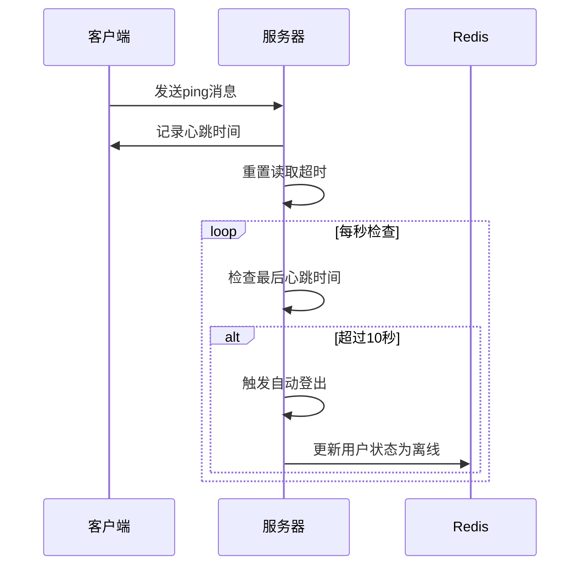

# API接口文档

<cite>
**本文档引用的文件**
- [router.go](file://server-go/internal/http/router/router.go)
- [auth.go](file://server-go/internal/http/handlers/auth/auth.go)
- [cultivation.go](file://server-go/internal/http/handlers/cultivation/cultivation.go)
- [alchemy.go](file://server-go/internal/http/handlers/alchemy/alchemy.go)
- [dungeon.go](file://server-go/internal/http/handlers/dungeon/dungeon.go)
- [exploration.go](file://server-go/internal/http/handlers/exploration/exploration.go)
- [gacha.go](file://server-go/internal/http/handlers/gacha/gacha.go)
- [player_handler.go](file://server-go/internal/http/handlers/player/player_handler.go)
- [handler.go](file://server-go/internal/websocket/handler.go)
- [manager.go](file://server-go/internal/websocket/manager.go)
- [user.go](file://server-go/internal/models/user.go)
- [equipment.go](file://server-go/internal/models/equipment.go)
- [pet.go](file://server-go/internal/models/pet.go)
- [item.go](file://server-go/internal/models/item.go)
- [herb.go](file://server-go/internal/models/herb.go)
- [HEARTBEAT_AND_LOGOUT_GUIDE.md](file://HEARTBEAT_AND_LOGOUT_GUIDE.md)
</cite>

## 目录
1. [简介](#简介)
2. [RESTful API](#restful-api)
   1. [认证接口](#认证接口)
   2. [修炼接口](#修炼接口)
   3. [炼丹接口](#炼丹接口)
   4. [秘境接口](#秘境接口)
   5. [探索接口](#探索接口)
   6. [抽奖接口](#抽奖接口)
   7. [玩家接口](#玩家接口)
3. [WebSocket接口](#websocket接口)
   1. [连接建立](#连接建立)
   2. [消息协议](#消息协议)
   3. [事件类型](#事件类型)
   4. [心跳保活](#心跳保活)
4. [错误处理](#错误处理)
5. [安全注意事项](#安全注意事项)

## 简介
本API文档详细描述了xiuxian-go项目的完整接口规范，包括所有公开的RESTful API和WebSocket接口。文档覆盖了用户认证、修炼、炼丹、秘境、探索、抽奖等核心功能的接口细节，为开发者提供全面的调用指南。

## RESTful API

### 认证接口
认证接口用于用户注册、登录和获取用户信息，遵循标准的JWT认证机制。

**Section sources**
- [auth.go](file://server-go/internal/http/handlers/auth/auth.go)

#### 用户注册
注册新用户账户。

| 属性 | 说明 |
|------|------|
| **HTTP方法** | POST |
| **URL路径** | /api/auth/register |
| **请求参数** | JSON格式，包含username和password |
| **请求体结构** | `{"username": "string", "password": "string"}` |
| **响应格式** | JSON格式，包含用户ID、用户名和JWT令牌 |
| **成功状态码** | 201 Created |
| **错误状态码** | 400 Bad Request, 500 Internal Server Error |

#### 用户登录
用户登录并获取认证令牌。

| 属性 | 说明 |
|------|------|
| **HTTP方法** | POST |
| **URL路径** | /api/auth/login |
| **请求参数** | JSON格式，包含username和password |
| **请求体结构** | `{"username": "string", "password": "string"}` |
| **响应格式** | JSON格式，包含用户ID、用户名和JWT令牌 |
| **成功状态码** | 200 OK |
| **错误状态码** | 400 Bad Request, 500 Internal Server Error |

#### 获取用户信息
获取当前认证用户的基本信息。

| 属性 | 说明 |
|------|------|
| **HTTP方法** | GET |
| **URL路径** | /api/auth/user |
| **认证要求** | 需要有效的JWT令牌 |
| **响应格式** | JSON格式，包含用户ID和用户名 |
| **成功状态码** | 200 OK |
| **错误状态码** | 401 Unauthorized, 404 Not Found |

### 修炼接口
修炼接口提供单次修炼、突破和获取修炼数据的功能。

**Section sources**
- [cultivation.go](file://server-go/internal/http/handlers/cultivation/cultivation.go)

#### 单次修炼
执行一次打坐修炼操作。

| 属性 | 说明 |
|------|------|
| **HTTP方法** | POST |
| **URL路径** | /api/cultivation/single |
| **认证要求** | 需要有效的JWT令牌 |
| **请求参数** | 无 |
| **响应格式** | JSON格式，包含修炼获得的灵力值 |
| **成功状态码** | 200 OK |
| **错误状态码** | 401 Unauthorized, 500 Internal Server Error |

#### 一键突破
执行突破操作，直到无法继续突破为止。

| 属性 | 说明 |
|------|------|
| **HTTP方法** | POST |
| **URL路径** | /api/cultivation/breakthrough |
| **认证要求** | 需要有效的JWT令牌 |
| **请求参数** | 无 |
| **响应格式** | JSON格式，包含突破结果 |
| **成功状态码** | 200 OK |
| **错误状态码** | 401 Unauthorized, 500 Internal Server Error |

#### 获取修炼数据
获取用户的修炼相关数据。

| 属性 | 说明 |
|------|------|
| **HTTP方法** | GET |
| **URL路径** | /api/cultivation/data |
| **认证要求** | 需要有效的JWT令牌 |
| **请求参数** | 无 |
| **响应格式** | JSON格式，包含用户等级、境界等修炼数据 |
| **成功状态码** | 200 OK |
| **错误状态码** | 401 Unauthorized, 500 Internal Server Error |

### 炼丹接口
炼丹接口提供丹方获取、炼制丹药和购买丹方残页等功能。

**Section sources**
- [alchemy.go](file://server-go/internal/http/handlers/alchemy/alchemy.go)

#### 获取所有丹方
获取所有可用的丹方列表。

| 属性 | 说明 |
|------|------|
| **HTTP方法** | GET |
| **URL路径** | /api/alchemy/recipes |
| **认证要求** | 需要有效的JWT令牌 |
| **查询参数** | playerLevel: 玩家等级 |
| **响应格式** | JSON格式，包含所有丹方信息和用户炼丹统计数据 |
| **成功状态码** | 200 OK |
| **错误状态码** | 401 Unauthorized, 500 Internal Server Error |

#### 获取丹方详情
获取特定丹方的详细信息。

| 属性 | 说明 |
|------|------|
| **HTTP方法** | GET |
| **URL路径** | /api/alchemy/recipes/:recipeId |
| **认证要求** | 需要有效的JWT令牌 |
| **路径参数** | recipeId: 丹方ID |
| **查询参数** | playerLevel: 玩家等级 |
| **响应格式** | JSON格式，包含丹方详细信息 |
| **成功状态码** | 200 OK |
| **错误状态码** | 401 Unauthorized, 500 Internal Server Error |

#### 炼制丹药
执行炼制丹药操作。

| 属性 | 说明 |
|------|------|
| **HTTP方法** | POST |
| **URL路径** | /api/alchemy/craft |
| **认证要求** | 需要有效的JWT令牌 |
| **请求体结构** | `{"recipeID": "string", "playerLevel": int, "inventoryHerbs": {}, "luck": float, "alchemyRate": float}` |
| **响应格式** | JSON格式，包含炼制结果 |
| **成功状态码** | 200 OK |
| **错误状态码** | 400 Bad Request, 401 Unauthorized, 500 Internal Server Error |

#### 购买丹方残页
购买指定丹方的残页。

| 属性 | 说明 |
|------|------|
| **HTTP方法** | POST |
| **URL路径** | /api/alchemy/buy-fragment |
| **认证要求** | 需要有效的JWT令牌 |
| **请求体结构** | `{"recipeID": "string", "quantity": int, "currentFragments": int}` |
| **响应格式** | JSON格式，包含购买结果和是否解锁丹方 |
| **成功状态码** | 200 OK |
| **错误状态码** | 400 Bad Request, 401 Unauthorized, 500 Internal Server Error |

#### 获取炼丹配置
获取炼丹系统的配置信息。

| 属性 | 说明 |
|------|------|
| **HTTP方法** | GET |
| **URL路径** | /api/alchemy/configs |
| **认证要求** | 需要有效的JWT令牌 |
| **请求参数** | 无 |
| **响应格式** | JSON格式，包含品阶、类型、丹方和灵草等配置 |
| **成功状态码** | 200 OK |
| **错误状态码** | 401 Unauthorized, 500 Internal Server Error |

### 秘境接口
秘境接口提供秘境启动、增益选择、战斗和结束秘境等功能。

**Section sources**
- [dungeon.go](file://server-go/internal/http/handlers/dungeon/dungeon.go)

#### 开始秘境
启动新的秘境挑战。

| 属性 | 说明 |
|------|------|
| **HTTP方法** | POST |
| **URL路径** | /api/dungeon/start |
| **认证要求** | 需要有效的JWT令牌 |
| **请求体结构** | `{"difficulty": "string"}` (可选值: easy, normal, hard, expert) |
| **响应格式** | JSON格式，包含秘境初始信息 |
| **成功状态码** | 200 OK |
| **错误状态码** | 400 Bad Request, 401 Unauthorized |

#### 获取增益选项
获取指定楼层的增益选项。

| 属性 | 说明 |
|------|------|
| **HTTP方法** | GET |
| **URL路径** | /api/dungeon/buffs/:floor |
| **认证要求** | 需要有效的JWT令牌 |
| **路径参数** | floor: 楼层号 |
| **响应格式** | JSON格式，包含增益选项列表 |
| **成功状态码** | 200 OK |
| **错误状态码** | 401 Unauthorized, 500 Internal Server Error |

#### 选择增益
选择一个增益效果。

| 属性 | 说明 |
|------|------|
| **HTTP方法** | POST |
| **URL路径** | /api/dungeon/select-buff |
| **认证要求** | 需要有效的JWT令牌 |
| **请求体结构** | `{"selectedBuffId": "string"}` |
| **响应格式** | JSON格式，包含所选增益的详细信息 |
| **成功状态码** | 200 OK |
| **错误状态码** | 400 Bad Request, 401 Unauthorized, 500 Internal Server Error |

#### 开始战斗
在指定楼层开始战斗。

| 属性 | 说明 |
|------|------|
| **HTTP方法** | POST |
| **URL路径** | /api/dungeon/fight |
| **认证要求** | 需要有效的JWT令牌 |
| **请求体结构** | `{"floor": int, "difficulty": "string"}` |
| **响应格式** | JSON格式，包含战斗结果 |
| **成功状态码** | 200 OK |
| **错误状态码** | 400 Bad Request, 401 Unauthorized, 500 Internal Server Error |

#### 结束秘境
结束当前的秘境挑战。

| 属性 | 说明 |
|------|------|
| **HTTP方法** | POST |
| **URL路径** | /api/dungeon/end |
| **认证要求** | 需要有效的JWT令牌 |
| **请求体结构** | `{"floor": int, "victory": bool}` |
| **响应格式** | JSON格式，包含秘境结束后的奖励信息 |
| **成功状态码** | 200 OK |
| **错误状态码** | 401 Unauthorized, 500 Internal Server Error |

### 探索接口
探索接口提供开始探索和处理探索事件选择的功能。

**Section sources**
- [exploration.go](file://server-go/internal/http/handlers/exploration/exploration.go)

#### 开始探索
启动新的探索任务。

| 属性 | 说明 |
|------|------|
| **HTTP方法** | POST |
| **URL路径** | /api/exploration/start |
| **认证要求** | 需要有效的JWT令牌 |
| **请求体结构** | `{"duration": int}` (默认10秒) |
| **响应格式** | JSON格式，包含探索事件列表和日志 |
| **成功状态码** | 200 OK |
| **错误状态码** | 400 Bad Request, 401 Unauthorized, 500 Internal Server Error |

#### 处理事件选择
处理探索过程中遇到的事件选择。

| 属性 | 说明 |
|------|------|
| **HTTP方法** | POST |
| **URL路径** | /api/exploration/event-choice |
| **认证要求** | 需要有效的JWT令牌 |
| **请求体结构** | `{"eventType": "string", "choice": int}` |
| **响应格式** | JSON格式，包含选择后的奖励 |
| **成功状态码** | 200 OK |
| **错误状态码** | 400 Bad Request, 401 Unauthorized, 500 Internal Server Error |

### 抽奖接口
抽奖接口提供抽卡和处理自动操作的功能。

**Section sources**
- [gacha.go](file://server-go/internal/http/handlers/gacha/gacha.go)

#### 抽卡
执行一次抽卡操作。

| 属性 | 说明 |
|------|------|
| **HTTP方法** | POST |
| **URL路径** | /api/gacha/draw |
| **认证要求** | 需要有效的JWT令牌 |
| **请求参数** | 无 |
| **响应格式** | JSON格式，包含抽卡结果 |
| **成功状态码** | 200 OK |
| **错误状态码** | 401 Unauthorized, 500 Internal Server Error |

#### 处理自动操作
处理批量自动操作。

| 属性 | 说明 |
|------|------|
| **HTTP方法** | POST |
| **URL路径** | /api/gacha/auto-actions |
| **认证要求** | 需要有效的JWT令牌 |
| **请求参数** | 无 |
| **响应格式** | JSON格式，包含操作结果 |
| **成功状态码** | 200 OK |
| **错误状态码** | 401 Unauthorized, 500 Internal Server Error |

### 玩家接口
玩家接口提供玩家数据获取、更新和排行榜等功能。

**Section sources**
- [player_handler.go](file://server-go/internal/http/handlers/player/player_handler.go)

#### 获取玩家数据
获取玩家的完整数据，包括用户信息、物品、宠物等。

| 属性 | 说明 |
|------|------|
| **HTTP方法** | GET |
| **URL路径** | /api/player/data |
| **认证要求** | 需要有效的JWT令牌 |
| **响应格式** | JSON格式，包含用户、物品、宠物等完整数据 |
| **成功状态码** | 200 OK |
| **错误状态码** | 401 Unauthorized, 500 Internal Server Error |

#### 获取灵力值
获取玩家的当前灵力值。

| 属性 | 说明 |
|------|------|
| **HTTP方法** | GET |
| **URL路径** | /api/player/spirit |
| **认证要求** | 需要有效的JWT令牌 |
| **响应格式** | JSON格式，包含spirit字段 |
| **成功状态码** | 200 OK |
| **错误状态码** | 500 Internal Server Error |

#### 更新灵力值
更新玩家的灵力值。

| 属性 | 说明 |
|------|------|
| **HTTP方法** | PUT |
| **URL路径** | /api/player/spirit |
| **认证要求** | 需要有效的JWT令牌 |
| **请求体结构** | `{"spirit": float64}` |
| **响应格式** | JSON格式，包含成功消息 |
| **成功状态码** | 200 OK |
| **错误状态码** | 400 Bad Request, 401 Unauthorized, 500 Internal Server Error |

#### 获取排行榜
获取玩家排行榜数据。

| 属性 | 说明 |
|------|------|
| **HTTP方法** | GET |
| **URL路径** | /api/player/leaderboard |
| **认证要求** | 无需认证 |
| **响应格式** | JSON数组，包含前100名玩家的信息 |
| **成功状态码** | 200 OK |
| **错误状态码** | 500 Internal Server Error |

#### 更新玩家数据
增量更新玩家数据。

| 属性 | 说明 |
|------|------|
| **HTTP方法** | PATCH |
| **URL路径** | /api/player/data |
| **认证要求** | 需要有效的JWT令牌 |
| **请求体结构** | 包含user、items、pets、herbs、pills等字段的JSON对象 |
| **响应格式** | JSON格式，包含成功消息 |
| **成功状态码** | 200 OK |
| **错误状态码** | 400 Bad Request, 401 Unauthorized, 500 Internal Server Error |

#### 删除物品
删除指定的物品。

| 属性 | 说明 |
|------|------|
| **HTTP方法** | DELETE |
| **URL路径** | /api/player/items |
| **认证要求** | 需要有效的JWT令牌 |
| **请求体结构** | `{"itemIds": ["string", ...]}` |
| **响应格式** | JSON格式，包含成功消息 |
| **成功状态码** | 200 OK |
| **错误状态码** | 400 Bad Request, 401 Unauthorized, 500 Internal Server Error |

#### 删除灵宠
删除指定的灵宠。

| 属性 | 说明 |
|------|------|
| **HTTP方法** | DELETE |
| **URL路径** | /api/player/pets |
| **认证要求** | 需要有效的JWT令牌 |
| **请求体结构** | `{"petIds": ["string", ...]}` |
| **响应格式** | JSON格式，包含成功消息 |
| **成功状态码** | 200 OK |
| **错误状态码** | 400 Bad Request, 401 Unauthorized, 500 Internal Server Error |

## WebSocket接口

### 连接建立
WebSocket连接通过特定的端点建立，需要提供用户认证信息。

**Section sources**
- [handler.go](file://server-go/internal/websocket/handler.go)
- [manager.go](file://server-go/internal/websocket/manager.go)

#### 连接端点
WebSocket连接通过以下端点建立：

| 属性 | 说明 |
|------|------|
| **URL路径** | /ws |
| **连接方式** | WebSocket |
| **查询参数** | userId: 用户ID, token: JWT令牌 |
| **示例** | `ws://localhost:8080/ws?userId=123&token=your_jwt_token` |

### 消息协议
WebSocket消息采用JSON格式，包含类型、用户ID、时间戳和数据。

**Section sources**
- [manager.go](file://server-go/internal/websocket/manager.go)

#### 消息结构
```json
{
  "type": "string",
  "userId": "number",
  "timestamp": "number",
  "data": {}
}
```

### 事件类型
系统支持多种WebSocket事件类型，用于实时数据推送。

**Section sources**
- [manager.go](file://server-go/internal/websocket/manager.go)
- [dungeon_handler.go](file://server-go/internal/websocket/dungeon_handler.go)
- [exploration_handler.go](file://server-go/internal/websocket/exploration_handler.go)
- [spirit_handler.go](file://server-go/internal/websocket/spirit_handler.go)

#### 支持的事件类型
| 事件类型 | 说明 |
|---------|------|
| spirit:grow | 灵力增长事件 |
| dungeon:update | 秘境更新事件 |
| exploration:result | 探索结果事件 |
| leaderboard:update | 排行榜更新事件 |
| ping | 心跳请求 |
| pong | 心跳响应 |

### 心跳保活
系统采用心跳机制保持连接活跃，并在超时后自动下线用户。

**Section sources**
- [manager.go](file://server-go/internal/websocket/manager.go)
- [HEARTBEAT_AND_LOGOUT_GUIDE.md](file://HEARTBEAT_AND_LOGOUT_GUIDE.md)

#### 心跳机制
| 属性 | 说明 |
|------|------|
| **心跳间隔** | 客户端每30秒发送一次ping |
| **超时时间** | 10秒未收到心跳则视为超时 |
| **处理方式** | 超时后自动调用登出逻辑，更新Redis状态 |

#### 心跳流程


**Diagram sources**
- [manager.go](file://server-go/internal/websocket/manager.go#L170-L256)

## 错误处理
API接口采用统一的错误处理机制，返回标准化的错误响应。

**Section sources**
- [auth.go](file://server-go/internal/http/handlers/auth/auth.go)
- [cultivation.go](file://server-go/internal/http/handlers/cultivation/cultivation.go)
- [alchemy.go](file://server-go/internal/http/handlers/alchemy/alchemy.go)

#### 通用错误响应格式
```json
{
  "message": "错误描述",
  "error": "错误详情(可选)"
}
```

#### 常见错误码
| 状态码 | 说明 |
|-------|------|
| 400 Bad Request | 请求参数错误 |
| 401 Unauthorized | 未授权或认证失败 |
| 404 Not Found | 资源未找到 |
| 500 Internal Server Error | 服务器内部错误 |

## 安全注意事项
为确保API的安全使用，请遵循以下安全建议。

**Section sources**
- [auth.go](file://server-go/internal/http/handlers/auth/auth.go)
- [middleware/auth.go](file://server-go/internal/http/middleware/auth.go)

#### 认证安全
- 使用HTTPS加密传输JWT令牌
- JWT令牌设置合理的过期时间(当前为30天)
- 密码使用bcrypt进行哈希存储

#### 数据安全
- 敏感操作需要身份验证
- 数据库操作使用参数化查询防止SQL注入
- 输入数据进行严格验证

#### WebSocket安全
- 连接时验证JWT令牌
- 限制消息处理频率防止滥用
- 实现心跳超时自动下线机制