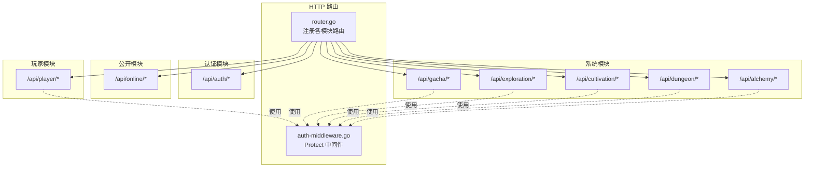
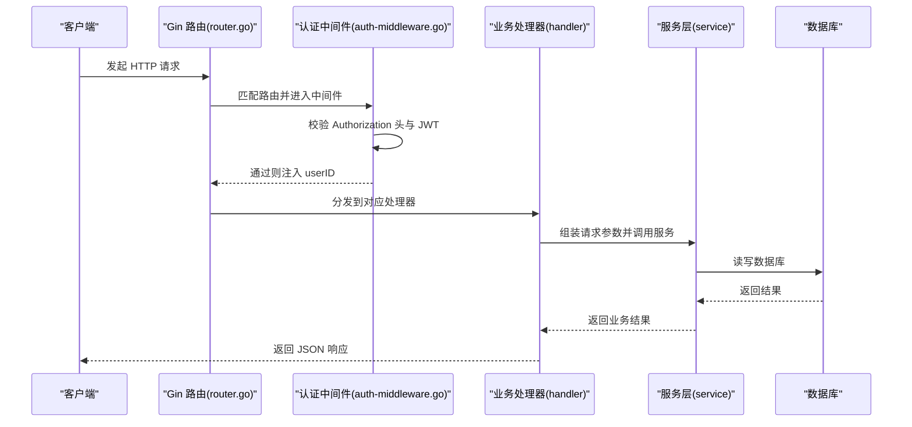
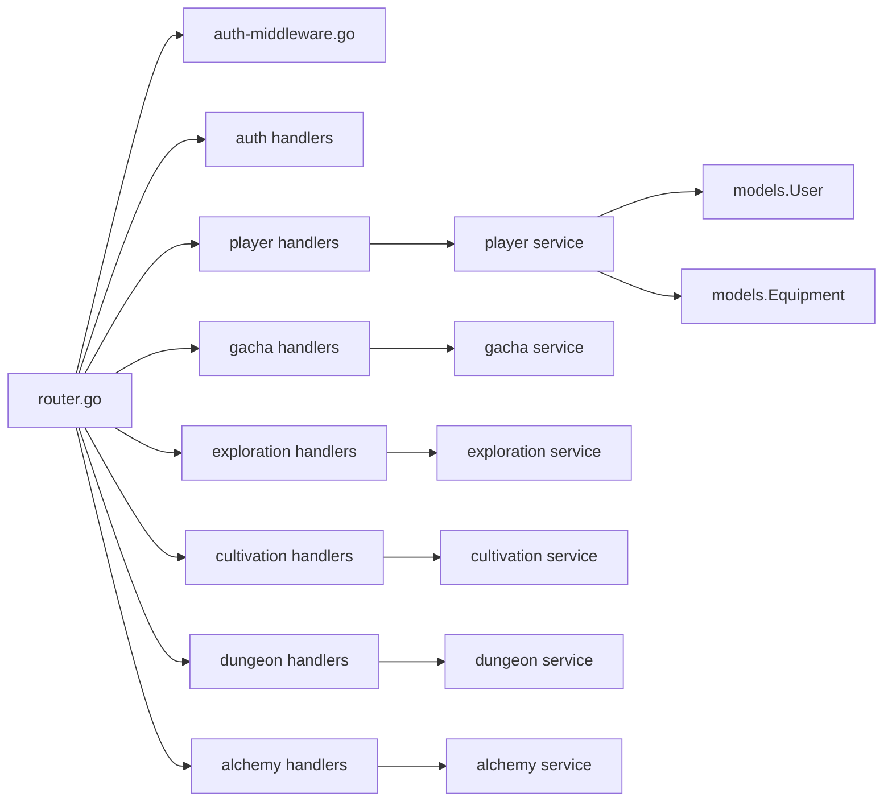

# RESTful API 接口

<cite>
**本文引用的文件**
- [router.go](file://server-go/internal/http/router/router.go)
- [auth.go](file://server-go/internal/http/handlers/auth/auth.go)
- [auth-middleware.go](file://server-go/internal/http/middleware/auth.go)
- [cultivation.go](file://server-go/internal/http/handlers/cultivation/cultivation.go)
- [alchemy.go](file://server-go/internal/http/handlers/alchemy/alchemy.go)
- [dungeon.go](file://server-go/internal/http/handlers/dungeon/dungeon.go)
- [exploration.go](file://server-go/internal/http/handlers/exploration/exploration.go)
- [gacha.go](file://server-go/internal/http/handlers/gacha/gacha.go)
- [gacha-handlers.go](file://server-go/internal/gacha/handlers.go)
- [equipment_handler.go](file://server-go/internal/http/handlers/player/equipment_handler.go)
- [user-model.go](file://server-go/internal/models/user.go)
- [equipment-model.go](file://server-go/internal/models/equipment.go)
</cite>

## 目录
1. [简介](#简介)
2. [项目结构](#项目结构)
3. [核心组件](#核心组件)
4. [架构总览](#架构总览)
5. [详细接口说明](#详细接口说明)
6. [依赖关系分析](#依赖关系分析)
7. [性能与并发特性](#性能与并发特性)
8. [故障排查与错误码](#故障排查与错误码)
9. [结论](#结论)

## 简介
本文件为 xiuxian-go 的 RESTful API 参考文档，覆盖所有 HTTP 接口，重点说明：
- 认证方式（基于 JWT 的 Bearer Token）
- 路由分组与中间件保护机制
- 每个端点的 HTTP 方法、URL 路径、请求参数、请求体结构、响应格式与状态码
- 数据验证规则与常见错误场景
- 与 router.go 中路由注册逻辑的对应关系

## 项目结构
后端采用 Gin 框架，路由在 router.go 中集中注册，按功能域分组：
- /api/auth：用户认证相关
- /api/player：玩家数据与装备系统
- /api/online：心跳与在线状态（公开）
- /api/gacha：抽卡系统
- /api/exploration：探索系统
- /api/cultivation：修炼系统
- /api/dungeon：秘境系统
- /api/alchemy：炼丹系统

图表来源
- [router.go](file://server-go/internal/http/router/router.go#L17-L126)
- [auth-middleware.go](file://server-go/internal/http/middleware/auth.go#L18-L76)

章节来源
- [router.go](file://server-go/internal/http/router/router.go#L17-L126)

## 核心组件
- 认证中间件 Protect：从 Authorization: Bearer <token> 读取令牌，校验 JWT_SECRET，通过后将 userID 写入上下文
- 各模块处理器：按路由分组，统一从上下文提取 userID，调用对应服务层执行业务逻辑
- 模型层：User、Equipment 等模型用于数据库交互

章节来源
- [auth-middleware.go](file://server-go/internal/http/middleware/auth.go#L18-L76)
- [user-model.go](file://server-go/internal/models/user.go#L12-L48)
- [equipment-model.go](file://server-go/internal/models/equipment.go#L7-L34)

## 架构总览
以下序列图展示典型请求流程：客户端 -> 路由 -> 中间件 -> 处理器 -> 服务层 -> 数据库

图表来源
- [router.go](file://server-go/internal/http/router/router.go#L17-L126)
- [auth-middleware.go](file://server-go/internal/http/middleware/auth.go#L18-L76)

## 详细接口说明

### 认证与用户信息
- 认证方式：Bearer Token
  - 请求头：Authorization: Bearer <token>
  - 中间件：Protect() 在各受保护路由组生效
- 错误码：
  - 401 未授权：缺少或无效的 Authorization 头；JWT 校验失败；JWT_SECRET 未配置
  - 400 参数错误：请求体 JSON 绑定失败
  - 500 服务器错误：JWT_SECRET 未配置；内部数据库/加密错误

#### /api/auth/register
- 方法：POST
- 路径：/api/auth/register
- 请求体：
  - username: string（必填）
  - password: string（必填）
- 响应：
  - id: uint
  - username: string
  - token: string
- 状态码：
  - 201 注册成功
  - 400 参数错误或用户名已存在
  - 500 服务器错误

章节来源
- [router.go](file://server-go/internal/http/router/router.go#L23-L30)
- [auth.go](file://server-go/internal/http/handlers/auth/auth.go#L40-L126)
- [auth-middleware.go](file://server-go/internal/http/middleware/auth.go#L18-L76)

#### /api/auth/login
- 方法：POST
- 路径：/api/auth/login
- 请求体：
  - username: string（必填）
  - password: string（必填）
- 响应：
  - id: uint
  - username: string
  - token: string
- 状态码：
  - 200 登录成功
  - 400 用户名或密码错误
  - 500 服务器错误

章节来源
- [router.go](file://server-go/internal/http/router/router.go#L23-L30)
- [auth.go](file://server-go/internal/http/handlers/auth/auth.go#L128-L180)
- [auth-middleware.go](file://server-go/internal/http/middleware/auth.go#L18-L76)

#### /api/auth/user
- 方法：GET
- 路径：/api/auth/user
- 请求头：Authorization: Bearer <token>
- 响应：
  - id: uint
  - username: string
- 状态码：
  - 200 成功
  - 401 未授权
  - 404 用户不存在
  - 500 服务器错误

章节来源
- [router.go](file://server-go/internal/http/router/router.go#L23-L30)
- [auth.go](file://server-go/internal/http/handlers/auth/auth.go#L182-L219)
- [auth-middleware.go](file://server-go/internal/http/middleware/auth.go#L18-L76)

### 玩家与装备
- 保护机制：/api/player 下除排行榜外均需认证
- 常见错误：401 未授权；400 参数错误；404 资源不存在；500 服务器错误

#### /api/player/leaderboard
- 方法：GET
- 路径：/api/player/leaderboard
- 响应：排行榜数据（结构由处理器定义）
- 状态码：200 成功

章节来源
- [router.go](file://server-go/internal/http/router/router.go#L31-L66)

#### /api/player/data
- 方法：GET
- 路径：/api/player/data
- 请求头：Authorization: Bearer <token>
- 响应：玩家基础数据（含等级、境界、修为、灵石等）
- 状态码：200 成功；401 未授权；500 服务器错误

章节来源
- [router.go](file://server-go/internal/http/router/router.go#L31-L66)

#### /api/player/equipment
- 方法：GET
- 路径：/api/player/equipment
- 查询参数：
  - type 或 equip_type: 装备类型
  - quality: 品质
  - equipped: 是否已装备（true/false）
- 请求头：Authorization: Bearer <token>
- 响应：装备列表
- 状态码：200 成功；401 未授权；500 服务器错误

章节来源
- [router.go](file://server-go/internal/http/router/router.go#L46-L59)
- [equipment_handler.go](file://server-go/internal/http/handlers/player/equipment_handler.go#L58-L174)

#### /api/player/equipment/details/:id
- 方法：GET
- 路径：/api/player/equipment/details/:id
- 请求头：Authorization: Bearer <token>
- 响应：单个装备详情
- 状态码：200 成功；401 未授权；404 未找到；500 服务器错误

章节来源
- [router.go](file://server-go/internal/http/router/router.go#L46-L59)
- [equipment_handler.go](file://server-go/internal/http/handlers/player/equipment_handler.go#L176-L222)

#### /api/player/equipment/:id/enhance
- 方法：POST
- 路径：/api/player/equipment/:id/enhance
- 请求头：Authorization: Bearer <token>
- 请求体：
  - reinforce_stones: int（必填，用于计算强化成本）
- 响应：
  - success: boolean
  - message: string
  - cost: int
  - oldStats: object
  - newStats: object
  - newLevel: int
  - newRequiredRealm: int
- 状态码：200 成功；400 参数错误；401 未授权；404 未找到；500 服务器错误

章节来源
- [router.go](file://server-go/internal/http/router/router.go#L51-L59)
- [equipment_handler.go](file://server-go/internal/http/handlers/player/equipment_handler.go#L224-L323)

#### /api/player/equipment/:id/reforge
- 方法：POST
- 路径：/api/player/equipment/:id/reforge
- 请求头：Authorization: Bearer <token>
- 请求体：
  - refinement_stones: int（必填）
- 响应：
  - success: boolean
  - message: string
  - cost: int
  - oldStats: object
  - newStats: object
- 状态码：200 成功；400 参数错误；401 未授权；404 未找到；500 服务器错误

章节来源
- [router.go](file://server-go/internal/http/router/router.go#L51-L59)
- [equipment_handler.go](file://server-go/internal/http/handlers/player/equipment_handler.go#L325-L388)

#### /api/player/equipment/:id/reforge-confirm
- 方法：POST
- 路径：/api/player/equipment/:id/reforge-confirm
- 请求头：Authorization: Bearer <token>
- 请求体：
  - confirmed: boolean（必填）
  - newStats: object（当 confirmed=true 时有效）
- 响应：
  - success: boolean
  - message: string
  - stats: object（当 confirmed=true 时返回新属性）
- 状态码：200 成功；400 参数错误；401 未授权；404 未找到；500 服务器错误

章节来源
- [router.go](file://server-go/internal/http/router/router.go#L51-L59)
- [equipment_handler.go](file://server-go/internal/http/handlers/player/equipment_handler.go#L390-L434)

#### /api/player/equipment/:id/equip
- 方法：POST
- 路径：/api/player/equipment/:id/equip
- 请求头：Authorization: Bearer <token>
- 请求体：
  - slot: string（可选，装备槽位）
- 响应：
  - success: boolean
  - message: string
  - equipment: object
  - user: object（包含基础属性、战斗属性、抗性、特殊属性及石数）
- 状态码：200 成功；400 参数错误；401 未授权；404 未找到；500 服务器错误

章节来源
- [router.go](file://server-go/internal/http/router/router.go#L51-L59)
- [equipment_handler.go](file://server-go/internal/http/handlers/player/equipment_handler.go#L436-L603)

#### /api/player/equipment/:id/unequip
- 方法：POST
- 路径：/api/player/equipment/:id/unequip
- 请求头：Authorization: Bearer <token>
- 响应：
  - success: boolean
  - message: string
  - equipment: object
  - user: object（包含基础属性、战斗属性、抗性、特殊属性及石数）
- 状态码：200 成功；400 参数错误；401 未授权；404 未找到；500 服务器错误

章节来源
- [router.go](file://server-go/internal/http/router/router.go#L51-L59)
- [equipment_handler.go](file://server-go/internal/http/handlers/player/equipment_handler.go#L605-L701)

#### /api/player/equipment/:id
- 方法：DELETE
- 路径：/api/player/equipment/:id
- 请求头：Authorization: Bearer <token>
- 响应：
  - success: boolean
  - message: string
  - stonesReceived: int（根据品质返还强化石）
- 状态码：200 成功；401 未授权；404 未找到；500 服务器错误

章节来源
- [router.go](file://server-go/internal/http/router/router.go#L51-L59)
- [equipment_handler.go](file://server-go/internal/http/handlers/player/equipment_handler.go#L703-L758)

#### /api/player/equipment/batch-sell
- 方法：POST
- 路径：/api/player/equipment/batch-sell
- 请求头：Authorization: Bearer <token>
- 请求体：
  - quality: string（可选）
  - type: string（可选）
- 响应：
  - success: boolean
  - message: string
  - stonesReceived: int
- 状态码：200 成功；400 参数错误；401 未授权；404 未找到；500 服务器错误

章节来源
- [router.go](file://server-go/internal/http/router/router.go#L51-L59)
- [equipment_handler.go](file://server-go/internal/http/handlers/player/equipment_handler.go#L760-L800)

### 抽卡系统
- 保护机制：需要认证
- 错误码：401 未授权；400 参数错误或资源不足；404 用户不存在；500 服务器错误

#### /api/gacha/draw
- 方法：POST
- 路径：/api/gacha/draw
- 请求头：Authorization: Bearer <token>
- 请求体：
  - poolType: string（必填，如 equipment/pet）
  - count: int（必填，1/10/50/100 或自定义）
  - useWishlist: boolean（可选）
- 响应：
  - success: boolean
  - items: array（获得的物品列表）
  - message: string
  - spirit_stones: int（剩余灵石）
- 状态码：200 成功；400 参数错误或灵石不足；401 未授权；404 用户不存在；500 服务器错误

章节来源
- [router.go](file://server-go/internal/http/router/router.go#L78-L85)
- [gacha.go](file://server-go/internal/http/handlers/gacha/gacha.go#L9-L17)
- [gacha-handlers.go](file://server-go/internal/gacha/handlers.go#L26-L173)

#### /api/gacha/auto-actions
- 方法：POST
- 路径：/api/gacha/auto-actions
- 请求头：Authorization: Bearer <token>
- 请求体：
  - items: array（待处理的物品数组）
  - autoSellQualities: array（自动出售的品质列表）
  - autoReleaseRarities: array（自动释放的稀有度列表）
- 响应：
  - success: boolean
  - soldItems: array
  - releasedPets: array
  - stonesGained: int
  - message: string
- 状态码：200 成功；400 参数错误；401 未授权；500 服务器错误

章节来源
- [router.go](file://server-go/internal/http/router/router.go#L78-L85)
- [gacha.go](file://server-go/internal/http/handlers/gacha/gacha.go#L14-L17)
- [gacha-handlers.go](file://server-go/internal/gacha/handlers.go#L175-L283)

### 探索系统
- 保护机制：需要认证
- 错误码：401 未授权；400 参数错误；500 服务器错误

#### /api/exploration/start
- 方法：POST
- 路径：/api/exploration/start
- 请求头：Authorization: Bearer <token>
- 请求体：
  - duration: number（可选，默认约10秒）
- 响应：
  - success: boolean
  - events: array（事件列表）
  - log: array（日志）
- 状态码：200 成功；400 参数错误；401 未授权；500 服务器错误

章节来源
- [router.go](file://server-go/internal/http/router/router.go#L86-L93)
- [exploration.go](file://server-go/internal/http/handlers/exploration/exploration.go#L19-L66)

#### /api/exploration/event-choice
- 方法：POST
- 路径：/api/exploration/event-choice
- 请求头：Authorization: Bearer <token>
- 请求体：
  - eventType: string（事件类型）
  - choice: string（选择项）
- 响应：
  - success: boolean
  - rewards: object（奖励内容）
- 状态码：200 成功；400 参数错误；401 未授权；500 服务器错误

章节来源
- [router.go](file://server-go/internal/http/router/router.go#L86-L93)
- [exploration.go](file://server-go/internal/http/handlers/exploration/exploration.go#L68-L110)

### 修炼系统
- 保护机制：需要认证
- 错误码：401 未授权；500 服务器错误

#### /api/cultivation/single
- 方法：POST
- 路径：/api/cultivation/single
- 请求头：Authorization: Bearer <token>
- 响应：
  - success: boolean
  - cultivationGain: number
  - spiritCost: number
  - currentCultivation: number
  - breakthrough: object（可选，突破时返回）
- 状态码：200 成功；401 未授权；500 服务器错误

章节来源
- [router.go](file://server-go/internal/http/router/router.go#L94-L103)
- [cultivation.go](file://server-go/internal/http/handlers/cultivation/cultivation.go#L20-L51)

#### /api/cultivation/breakthrough
- 方法：POST
- 路径：/api/cultivation/breakthrough
- 请求头：Authorization: Bearer <token>
- 响应：
  - success: boolean
  - message: string
  - breakthrough: object（包含新等级、新境界、新上限、奖励等）
- 状态码：200 成功；401 未授权；500 服务器错误

章节来源
- [router.go](file://server-go/internal/http/router/router.go#L94-L103)
- [cultivation.go](file://server-go/internal/http/handlers/cultivation/cultivation.go#L53-L84)

#### /api/cultivation/data
- 方法：GET
- 路径：/api/cultivation/data
- 请求头：Authorization: Bearer <token>
- 响应：
  - success: boolean
  - data: object（包含等级、境界等）
- 状态码：200 成功；401 未授权；500 服务器错误

章节来源
- [router.go](file://server-go/internal/http/router/router.go#L94-L103)
- [cultivation.go](file://server-go/internal/http/handlers/cultivation/cultivation.go#L86-L122)

### 秘境系统
- 保护机制：需要认证
- 错误码：401 未授权；400 参数错误；500 服务器错误

#### /api/dungeon/start
- 方法：POST
- 路径：/api/dungeon/start
- 请求头：Authorization: Bearer <token>
- 请求体：
  - difficulty: string（必填，枚举：easy/normal/hard/expert）
- 响应：
  - success: boolean
  - data: object（包含初始楼层、难度、刷新次数等）
- 状态码：200 成功；400 参数错误；401 未授权；500 服务器错误

章节来源
- [router.go](file://server-go/internal/http/router/router.go#L104-L114)
- [dungeon.go](file://server-go/internal/http/handlers/dungeon/dungeon.go#L20-L66)

#### /api/dungeon/buffs/:floor
- 方法：GET
- 路径：/api/dungeon/buffs/:floor
- 请求头：Authorization: Bearer <token>
- 响应：
  - success: boolean
  - data: object（包含楼层与增益选项）
- 状态码：200 成功；401 未授权；500 服务器错误

章节来源
- [router.go](file://server-go/internal/http/router/router.go#L104-L114)
- [dungeon.go](file://server-go/internal/http/handlers/dungeon/dungeon.go#L68-L117)

#### /api/dungeon/select-buff
- 方法：POST
- 路径：/api/dungeon/select-buff
- 请求头：Authorization: Bearer <token>
- 请求体：
  - selectedBuffId: string（必填）
- 响应：
  - success: boolean
  - data: object（所选增益）
- 状态码：200 成功；400 参数错误；401 未授权；500 服务器错误

章节来源
- [router.go](file://server-go/internal/http/router/router.go#L104-L114)
- [dungeon.go](file://server-go/internal/http/handlers/dungeon/dungeon.go#L119-L170)

#### /api/dungeon/fight
- 方法：POST
- 路径：/api/dungeon/fight
- 请求头：Authorization: Bearer <token>
- 请求体：
  - floor: number（可选，默认1）
  - difficulty: string（必填）
- 响应：
  - success: boolean
  - data: object（战斗结果）
- 状态码：200 成功；400 参数错误；401 未授权；500 服务器错误

章节来源
- [router.go](file://server-go/internal/http/router/router.go#L104-L114)
- [dungeon.go](file://server-go/internal/http/handlers/dungeon/dungeon.go#L172-L227)

#### /api/dungeon/end
- 方法：POST
- 路径：/api/dungeon/end
- 请求头：Authorization: Bearer <token>
- 请求体：
  - floor: number（必填）
  - victory: boolean（必填）
- 响应：
  - success: boolean
  - data: object（结束结果）
- 状态码：200 成功；400 参数错误；401 未授权；500 服务器错误

章节来源
- [router.go](file://server-go/internal/http/router/router.go#L104-L114)
- [dungeon.go](file://server-go/internal/http/handlers/dungeon/dungeon.go#L229-L276)

### 炼丹系统
- 保护机制：需要认证
- 错误码：401 未授权；400 参数错误；500 服务器错误

#### /api/alchemy/configs
- 方法：GET
- 路径：/api/alchemy/configs
- 请求头：Authorization: Bearer <token>
- 响应：
  - success: boolean
  - data: object（包含 grades/types/recipes/herbs）
- 状态码：200 成功；401 未授权；500 服务器错误

章节来源
- [router.go](file://server-go/internal/http/router/router.go#L115-L125)
- [alchemy.go](file://server-go/internal/http/handlers/alchemy/alchemy.go#L278-L305)

#### /api/alchemy/recipes
- 方法：GET
- 路径：/api/alchemy/recipes
- 查询参数：
  - playerLevel: number（可选，默认1）
- 请求头：Authorization: Bearer <token>
- 响应：
  - success: boolean
  - data: object（包含所有配方与用户真实炼丹数据）
- 状态码：200 成功；401 未授权；500 服务器错误

章节来源
- [router.go](file://server-go/internal/http/router/router.go#L115-L125)
- [alchemy.go](file://server-go/internal/http/handlers/alchemy/alchemy.go#L24-L80)

#### /api/alchemy/recipes/:recipeId
- 方法：GET
- 路径：/api/alchemy/recipes/:recipeId
- 查询参数：
  - playerLevel: number（可选，默认1）
- 请求头：Authorization: Bearer <token>
- 响应：
  - success: boolean
  - data: object（配方详情与解锁状态）
- 状态码：200 成功；401 未授权；500 服务器错误

章节来源
- [router.go](file://server-go/internal/http/router/router.go#L115-L125)
- [alchemy.go](file://server-go/internal/http/handlers/alchemy/alchemy.go#L82-L138)

#### /api/alchemy/craft
- 方法：POST
- 路径：/api/alchemy/craft
- 请求头：Authorization: Bearer <token>
- 请求体：
  - recipeID: string（必填）
  - playerLevel: number（可选，默认1）
  - luck: number（可选，默认1.0）
  - alchemyRate: number（可选，默认1.0）
  - inventoryHerbs: object（可选，库存草药）
- 响应：
  - success: boolean
  - data: object（炼制结果）
  - message: string
- 状态码：200 成功；400 参数错误；401 未授权；500 服务器错误

章节来源
- [router.go](file://server-go/internal/http/router/router.go#L115-L125)
- [alchemy.go](file://server-go/internal/http/handlers/alchemy/alchemy.go#L140-L217)

#### /api/alchemy/buy-fragment
- 方法：POST
- 路径：/api/alchemy/buy-fragment
- 请求头：Authorization: Bearer <token>
- 请求体：
  - recipeID: string（必填）
  - quantity: number（必填）
  - currentFragments: number（必填）
- 响应：
  - success: boolean
  - data: object（购买结果）
  - message: string
- 状态码：200 成功；400 参数错误；401 未授权；500 服务器错误

章节来源
- [router.go](file://server-go/internal/http/router/router.go#L115-L125)
- [alchemy.go](file://server-go/internal/http/handlers/alchemy/alchemy.go#L219-L276)

### 在线与心跳（公开）
- 无需认证

#### /api/online/login
- 方法：POST
- 路径：/api/online/login
- 响应：登录结果
- 状态码：200 成功

章节来源
- [router.go](file://server-go/internal/http/router/router.go#L68-L77)

#### /api/online/heartbeat
- 方法：POST
- 路径：/api/online/heartbeat
- 响应：心跳结果
- 状态码：200 成功

章节来源
- [router.go](file://server-go/internal/http/router/router.go#L68-L77)

#### /api/online/logout
- 方法：POST
- 路径：/api/online/logout
- 响应：登出结果
- 状态码：200 成功

章节来源
- [router.go](file://server-go/internal/http/router/router.go#L68-L77)

#### /api/online/players
- 方法：GET
- 路径：/api/online/players
- 响应：在线玩家列表
- 状态码：200 成功

章节来源
- [router.go](file://server-go/internal/http/router/router.go#L68-L77)

#### /api/online/player/:playerId
- 方法：GET
- 路径：/api/online/player/:playerId
- 响应：指定玩家在线状态
- 状态码：200 成功

章节来源
- [router.go](file://server-go/internal/http/router/router.go#L68-L77)

## 依赖关系分析
- 路由注册与中间件
  - router.go 将各模块路由分组，并在相应组上挂载 Protect 中间件
  - /api/player、/api/gacha、/api/exploration、/api/cultivation、/api/dungeon、/api/alchemy 下的接口均受 Protect 保护
- 处理器与服务层
  - 各处理器从上下文获取 userID，构造对应服务实例并调用业务逻辑
- 数据模型
  - User、Equipment 模型用于读写数据库，支撑玩家与装备相关接口

图表来源
- [router.go](file://server-go/internal/http/router/router.go#L17-L126)
- [auth-middleware.go](file://server-go/internal/http/middleware/auth.go#L18-L76)
- [user-model.go](file://server-go/internal/models/user.go#L12-L48)
- [equipment-model.go](file://server-go/internal/models/equipment.go#L7-L34)

## 性能与并发特性
- 中间件认证：每次请求都会解析 Authorization 头并校验 JWT，建议客户端复用 Token 并减少不必要的请求
- 事务处理：抽卡接口在批量生成物品时使用数据库事务，保证一致性
- 日志：处理器普遍记录 zap 日志，便于追踪请求与错误
- 并发：Gin 默认并发安全；服务层涉及数据库读写时遵循 GORM 并发规范

[本节为通用指导，不直接分析具体文件]

## 故障排查与错误码
- 401 未授权
  - 缺少 Authorization 头或格式不正确
  - JWT 校验失败或 JWT_SECRET 未配置
- 400 参数错误
  - 请求体 JSON 绑定失败
  - 必填参数缺失或取值非法
- 404 资源不存在
  - 用户不存在（抽卡、炼丹等）
  - 装备不存在
- 500 服务器错误
  - JWT_SECRET 未配置
  - 数据库操作失败
  - 加密/解密失败

章节来源
- [auth-middleware.go](file://server-go/internal/http/middleware/auth.go#L18-L76)
- [auth.go](file://server-go/internal/http/handlers/auth/auth.go#L40-L126)
- [gacha-handlers.go](file://server-go/internal/gacha/handlers.go#L26-L173)
- [alchemy.go](file://server-go/internal/http/handlers/alchemy/alchemy.go#L140-L217)
- [dungeon.go](file://server-go/internal/http/handlers/dungeon/dungeon.go#L20-L66)
- [exploration.go](file://server-go/internal/http/handlers/exploration/exploration.go#L19-L66)
- [equipment_handler.go](file://server-go/internal/http/handlers/player/equipment_handler.go#L224-L323)

## 结论
本参考文档基于 router.go 的路由注册逻辑与各处理器实现，系统性地梳理了 xiuxian-go 的 RESTful API。建议在生产环境中：
- 正确设置 JWT_SECRET
- 在客户端缓存 Token 并合理轮换
- 对必填参数与取值范围进行严格校验
- 结合日志与监控定位问题