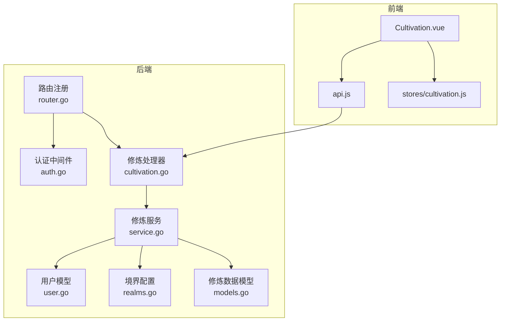
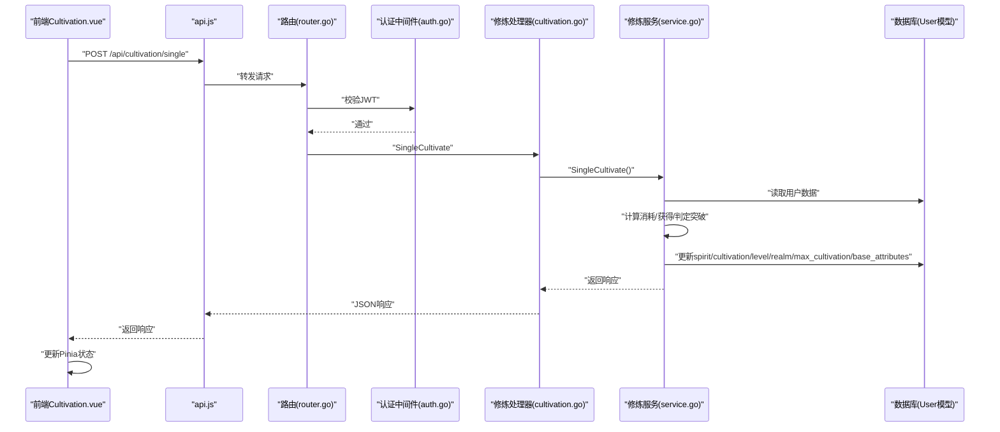
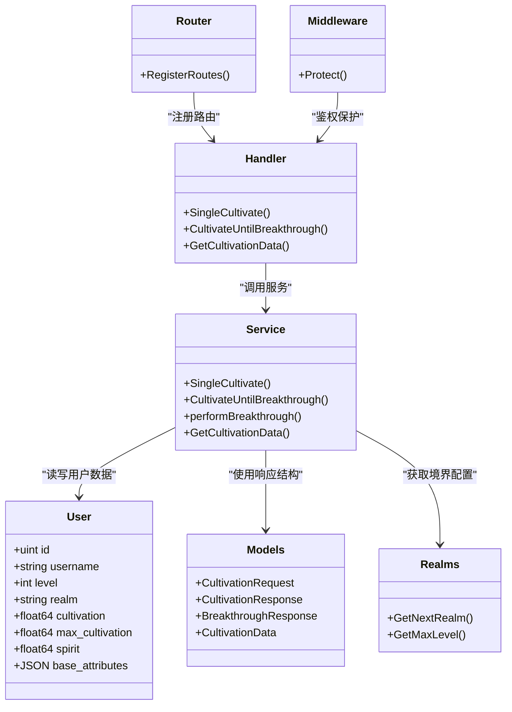

# 修炼系统接口

<cite>
**本文引用的文件**
- [server-go/internal/http/router/router.go](file://server-go/internal/http/router/router.go)
- [server-go/internal/http/middleware/auth.go](file://server-go/internal/http/middleware/auth.go)
- [server-go/internal/http/handlers/cultivation/cultivation.go](file://server-go/internal/http/handlers/cultivation/cultivation.go)
- [server-go/internal/cultivation/service.go](file://server-go/internal/cultivation/service.go)
- [server-go/internal/cultivation/models.go](file://server-go/internal/cultivation/models.go)
- [server-go/internal/cultivation/realms.go](file://server-go/internal/cultivation/realms.go)
- [server-go/internal/models/user.go](file://server-go/internal/models/user.go)
- [src/services/api.js](file://src/services/api.js)
- [src/views/Cultivation.vue](file://src/views/Cultivation.vue)
- [src/stores/cultivation.js](file://src/stores/cultivation.js)
</cite>

## 目录
1. [简介](#简介)
2. [项目结构](#项目结构)
3. [核心组件](#核心组件)
4. [架构总览](#架构总览)
5. [详细组件分析](#详细组件分析)
6. [依赖关系分析](#依赖关系分析)
7. [性能考量](#性能考量)
8. [故障排查指南](#故障排查指南)
9. [结论](#结论)
10. [附录](#附录)

## 简介
本技术文档聚焦于“修炼系统”的两个关键REST接口：
- POST /api/cultivation/single：单次打坐修炼，消耗灵力，获得修为，可能触发境界突破
- POST /api/cultivation/breakthrough：一键突破，快速修炼至当前境界上限并执行突破

文档将详细说明请求参数、响应数据结构、后端service业务逻辑（修为增长与突破概率）、数据持久化方式（User模型字段与JSON属性），以及前端Cultivation.vue通过api.js调用并更新Pinia状态管理器中的cultivation store。

## 项目结构
后端采用Go语言与Gin框架，按领域分层组织；前端使用Vue 3 + Pinia，通过统一的APIService封装HTTP请求。

图表来源
- [server-go/internal/http/router/router.go](file://server-go/internal/http/router/router.go#L94-L102)
- [server-go/internal/http/middleware/auth.go](file://server-go/internal/http/middleware/auth.go#L1-L75)
- [server-go/internal/http/handlers/cultivation/cultivation.go](file://server-go/internal/http/handlers/cultivation/cultivation.go#L20-L84)
- [server-go/internal/cultivation/service.go](file://server-go/internal/cultivation/service.go#L1-L151)
- [server-go/internal/models/user.go](file://server-go/internal/models/user.go#L12-L42)
- [server-go/internal/cultivation/realms.go](file://server-go/internal/cultivation/realms.go#L1-L192)
- [server-go/internal/cultivation/models.go](file://server-go/internal/cultivation/models.go#L16-L89)
- [src/views/Cultivation.vue](file://src/views/Cultivation.vue#L90-L208)
- [src/services/api.js](file://src/services/api.js#L904-L1131)
- [src/stores/cultivation.js](file://src/stores/cultivation.js#L1-L52)

章节来源
- [server-go/internal/http/router/router.go](file://server-go/internal/http/router/router.go#L94-L102)
- [src/views/Cultivation.vue](file://src/views/Cultivation.vue#L90-L208)

## 核心组件
- 路由与认证
  - /api/cultivation/* 路由组启用认证中间件，要求携带JWT Bearer Token
- 修炼处理器
  - SingleCultivate：处理单次打坐
  - CultivateUntilBreakthrough：处理一键突破
- 修炼服务
  - SingleCultivate：计算消耗、获得修为、判定突破、持久化
  - performBreakthrough：执行突破逻辑、奖励、解锁新境界
- 数据模型
  - User模型包含level、realm、cultivation、max_cultivation、spirit、base_attributes等字段
  - 修炼相关常量与响应结构体定义在cultivation/models.go
  - 境界配置在cultivation/realms.go

章节来源
- [server-go/internal/http/router/router.go](file://server-go/internal/http/router/router.go#L94-L102)
- [server-go/internal/http/middleware/auth.go](file://server-go/internal/http/middleware/auth.go#L18-L75)
- [server-go/internal/http/handlers/cultivation/cultivation.go](file://server-go/internal/http/handlers/cultivation/cultivation.go#L20-L84)
- [server-go/internal/cultivation/service.go](file://server-go/internal/cultivation/service.go#L76-L151)
- [server-go/internal/cultivation/models.go](file://server-go/internal/cultivation/models.go#L16-L89)
- [server-go/internal/cultivation/realms.go](file://server-go/internal/cultivation/realms.go#L1-L192)
- [server-go/internal/models/user.go](file://server-go/internal/models/user.go#L12-L42)

## 架构总览
后端请求经路由注册到处理器，处理器调用服务层，服务层读取/更新User模型，并通过JSON字段base_attributes存储玩家属性（如cultivationRate、spiritRate、luck、unlockedRealms）。前端通过api.js发起请求，Cultivation.vue接收响应并更新Pinia状态。

图表来源
- [server-go/internal/http/router/router.go](file://server-go/internal/http/router/router.go#L94-L102)
- [server-go/internal/http/middleware/auth.go](file://server-go/internal/http/middleware/auth.go#L18-L75)
- [server-go/internal/http/handlers/cultivation/cultivation.go](file://server-go/internal/http/handlers/cultivation/cultivation.go#L20-L84)
- [server-go/internal/cultivation/service.go](file://server-go/internal/cultivation/service.go#L76-L151)
- [server-go/internal/models/user.go](file://server-go/internal/models/user.go#L12-L42)
- [src/services/api.js](file://src/services/api.js#L904-L1131)
- [src/views/Cultivation.vue](file://src/views/Cultivation.vue#L90-L208)

## 详细组件分析

### 接口：POST /api/cultivation/single（单次修炼）
- 认证要求
  - 需要Authorization: Bearer <token>，由中间件校验
- 请求
  - 方法：POST
  - 路径：/api/cultivation/single
  - 请求体：空对象
- 响应
  - 成功时返回：success、cultivationGain、spiritCost、currentCultivation、breakthrough（可选）、message（可选）、error（可选）
  - 失败时返回：错误信息（如灵力不足、内部错误）

业务逻辑要点（service.go）
- 读取用户数据
- 从base_attributes解析cultivationRate、luck（默认值1.0）
- 计算当前等级的修炼消耗与获得（指数递增）
- 检查灵力是否足够
- 消耗灵力，累加修为（保留一位小数）
- 触发幸运暴击（概率与luck相关）
- 若修为达到上限则执行突破
- 更新base_attributes（包括unlockedRealms、spiritRate等）
- 保存用户数据（spirit、cultivation、level、realm、max_cultivation、base_attributes）

章节来源
- [server-go/internal/http/router/router.go](file://server-go/internal/http/router/router.go#L94-L102)
- [server-go/internal/http/middleware/auth.go](file://server-go/internal/http/middleware/auth.go#L18-L75)
- [server-go/internal/http/handlers/cultivation/cultivation.go](file://server-go/internal/http/handlers/cultivation/cultivation.go#L20-L51)
- [server-go/internal/cultivation/service.go](file://server-go/internal/cultivation/service.go#L76-L151)
- [server-go/internal/cultivation/models.go](file://server-go/internal/cultivation/models.go#L16-L31)

### 接口：POST /api/cultivation/breakthrough（一键突破）
- 认证要求
  - 需要Authorization: Bearer <token>，由中间件校验
- 请求
  - 方法：POST
  - 路径：/api/cultivation/breakthrough
  - 请求体：空对象
- 响应
  - 成功时返回：success、totalCultivationGain、totalSpiritCost、breakthroughs、finalCultivation、breakthroughDetails、message（可选）、error（可选）
  - 失败时返回：错误信息（如已达最高境界、灵力不足、内部错误）

业务逻辑要点（service.go）
- 读取用户数据并检查是否已达最高等级
- 计算剩余修为与每次修炼的获得/消耗
- 检查灵力是否足够一次性突破
- 消耗灵力，修为达到上限
- 执行突破流程（更新level、realm、max_cultivation、重置cultivation）
- 奖励：spirit奖励、spiritRate提升
- 更新base_attributes并保存

章节来源
- [server-go/internal/http/router/router.go](file://server-go/internal/http/router/router.go#L94-L102)
- [server-go/internal/http/middleware/auth.go](file://server-go/internal/http/middleware/auth.go#L18-L75)
- [server-go/internal/http/handlers/cultivation/cultivation.go](file://server-go/internal/http/handlers/cultivation/cultivation.go#L53-L84)
- [server-go/internal/cultivation/service.go](file://server-go/internal/cultivation/service.go#L153-L238)
- [server-go/internal/cultivation/models.go](file://server-go/internal/cultivation/models.go#L32-L53)

### 数据模型与持久化（User模型字段）
- 关键字段
  - level：当前境界等级
  - realm：当前境界名称
  - cultivation：当前修为
  - max_cultivation：当前境界上限
  - spirit：当前灵力
  - base_attributes：JSON字段，存储cultivationRate、spiritRate、luck、unlockedRealms等
- 境界上限与名称
  - 通过realms.go中的配置数组与GetNextRealm/GetMaxLevel确定

章节来源
- [server-go/internal/models/user.go](file://server-go/internal/models/user.go#L12-L42)
- [server-go/internal/cultivation/realms.go](file://server-go/internal/cultivation/realms.go#L1-L192)
- [server-go/internal/cultivation/models.go](file://server-go/internal/cultivation/models.go#L55-L89)

### 前端调用与状态更新
- api.js
  - post(url, data, token)：自动附加Authorization头
  - getCultivationData(token)：获取修炼消耗/获得/境界等数据
- Cultivation.vue
  - 调用APIService.post('/cultivation/single')与APIService.post('/cultivation/breakthrough')
  - 更新playerInfoStore：spirit、cultivation、level、realm、maxCultivation、spiritRate
  - 记录日志与统计
- stores/cultivation.js
  - 提供cultivate、tryBreakthrough等动作，用于本地状态管理（与后端配合）

章节来源
- [src/services/api.js](file://src/services/api.js#L904-L1131)
- [src/views/Cultivation.vue](file://src/views/Cultivation.vue#L90-L208)
- [src/stores/cultivation.js](file://src/stores/cultivation.js#L1-L52)

## 依赖关系分析

图表来源
- [server-go/internal/http/router/router.go](file://server-go/internal/http/router/router.go#L94-L102)
- [server-go/internal/http/middleware/auth.go](file://server-go/internal/http/middleware/auth.go#L18-L75)
- [server-go/internal/http/handlers/cultivation/cultivation.go](file://server-go/internal/http/handlers/cultivation/cultivation.go#L20-L121)
- [server-go/internal/cultivation/service.go](file://server-go/internal/cultivation/service.go#L1-L355)
- [server-go/internal/models/user.go](file://server-go/internal/models/user.go#L12-L42)
- [server-go/internal/cultivation/models.go](file://server-go/internal/cultivation/models.go#L16-L89)
- [server-go/internal/cultivation/realms.go](file://server-go/internal/cultivation/realms.go#L171-L192)

## 性能考量
- 计算复杂度
  - 单次修炼：O(1)，涉及常量与数学运算
  - 一键突破：O(1)，但涉及多次循环估算次数
- 数据库写入
  - 仅更新用户部分字段，减少写放大
- 前端渲染
  - 通过getCultivationData定期同步，避免频繁刷新导致抖动

[本节为通用建议，不直接分析具体文件]

## 故障排查指南
- 认证失败（401）
  - 确认Authorization头格式为Bearer <token>
  - 检查JWT_SECRET环境变量配置
- 参数异常（400）
  - 本接口请求体为空，若出现参数异常，请检查客户端调用是否正确
- 突破失败（403/400）
  - 已达最高等级或灵力不足
- 日志定位
  - 后端中间件与处理器均输出zap日志，便于定位问题

章节来源
- [server-go/internal/http/middleware/auth.go](file://server-go/internal/http/middleware/auth.go#L18-L75)
- [server-go/internal/http/handlers/cultivation/cultivation.go](file://server-go/internal/http/handlers/cultivation/cultivation.go#L20-L84)
- [server-go/internal/cultivation/service.go](file://server-go/internal/cultivation/service.go#L76-L151)

## 结论
本文档梳理了单次修炼与一键突破两个接口的请求/响应、业务逻辑、数据持久化与前后端集成方式。通过明确的认证要求、清晰的响应结构与严谨的服务层实现，系统实现了稳定的修炼体验与可扩展的境界体系。

[本节为总结，不直接分析具体文件]

## 附录

### 接口定义与示例

- 单次修炼
  - 方法：POST
  - 路径：/api/cultivation/single
  - 请求体：空对象
  - 成功响应字段：success、cultivationGain、spiritCost、currentCultivation、breakthrough（可选）、message（可选）、error（可选）
  - 失败响应：错误信息（如灵力不足、内部错误）

- 一键突破
  - 方法：POST
  - 路径：/api/cultivation/breakthrough
  - 请求体：空对象
  - 成功响应字段：success、totalCultivationGain、totalSpiritCost、breakthroughs、finalCultivation、breakthroughDetails、message（可选）、error（可选）
  - 失败响应：错误信息（如已达最高等级、灵力不足、内部错误）

- 获取修炼数据
  - 方法：GET
  - 路径：/api/cultivation/data
  - 返回字段：level、realm、cultivation、maxCultivation、spirit、spiritCost、cultivationGain、cultivationRate、spiritRate、unlockedRealms

章节来源
- [server-go/internal/http/handlers/cultivation/cultivation.go](file://server-go/internal/http/handlers/cultivation/cultivation.go#L20-L121)
- [server-go/internal/cultivation/models.go](file://server-go/internal/cultivation/models.go#L16-L89)

### 前端调用示例（概念性）
- 单次修炼
  - 调用：api.post('/cultivation/single', {}, token)
  - 成功后更新：spirit -= spiritCost；cultivation = currentCultivation；若存在breakthrough则更新level/realm/maxCultivation/spirit/newSpiritRate
- 一键突破
  - 调用：api.post('/cultivation/breakthrough', {}, token)
  - 成功后同步最新数据并更新统计

章节来源
- [src/views/Cultivation.vue](file://src/views/Cultivation.vue#L90-L208)
- [src/services/api.js](file://src/services/api.js#L904-L1131)