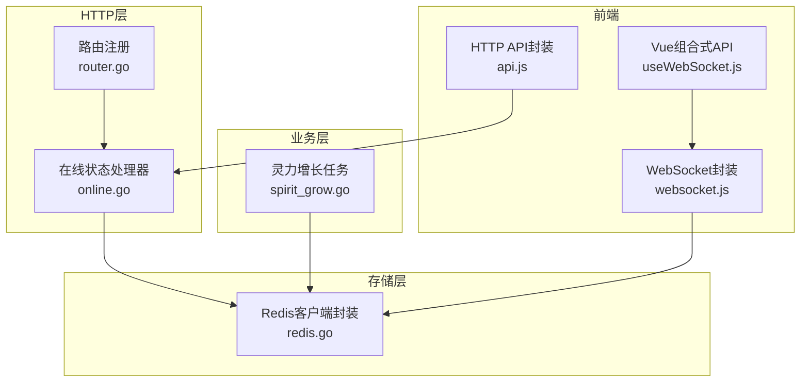
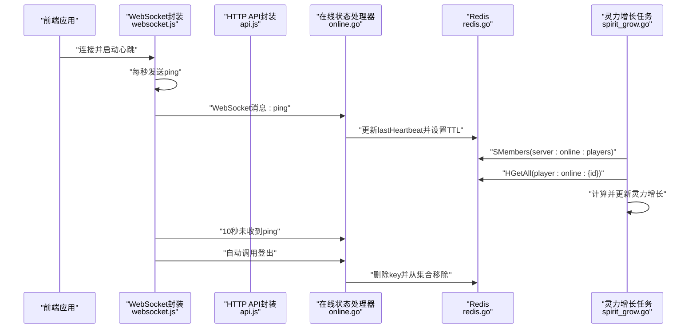
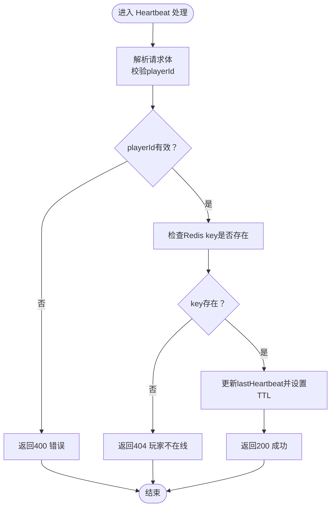
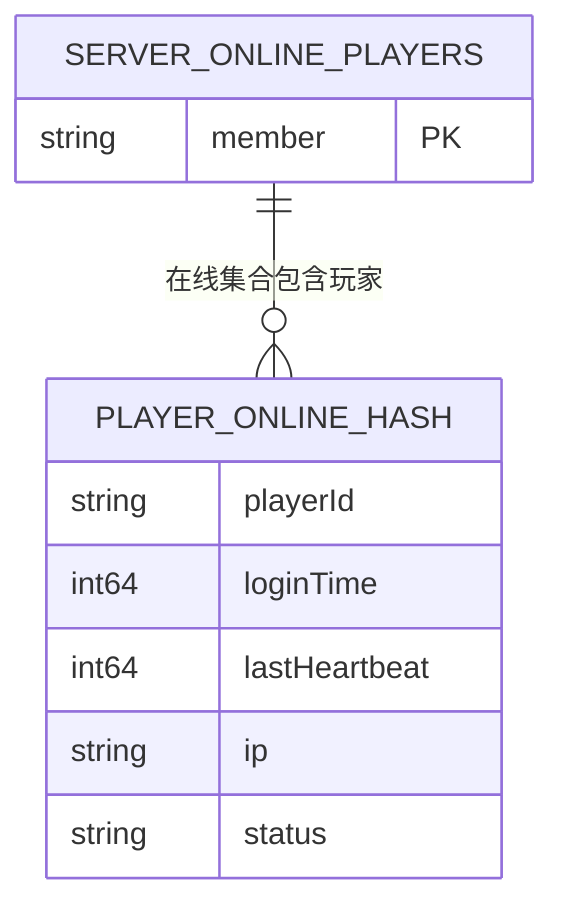
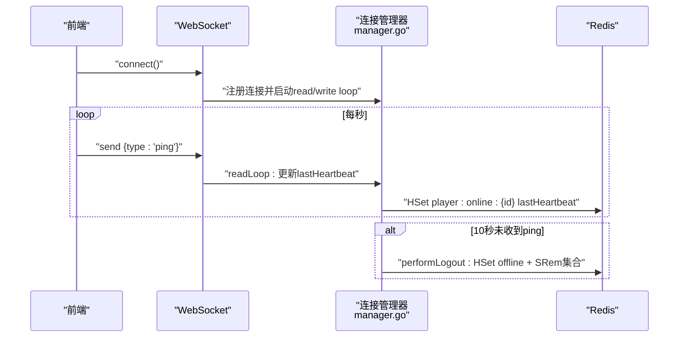
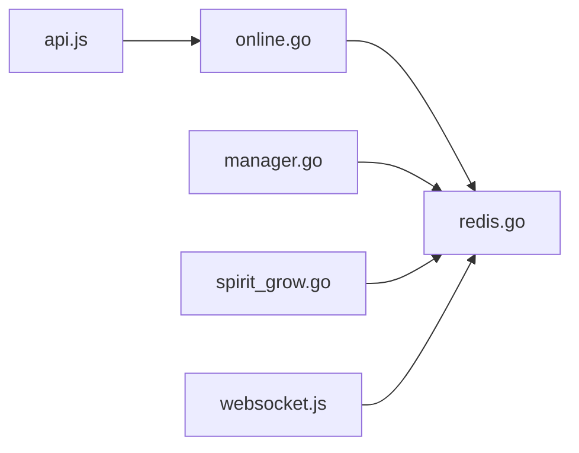

# 在线状态接口

<cite>
**本文引用的文件**
- [online.go](file://server-go/internal/http/handlers/online/online.go)
- [router.go](file://server-go/internal/http/router/router.go)
- [redis.go](file://server-go/internal/redis/redis.go)
- [manager.go](file://server-go/internal/websocket/manager.go)
- [websocket.js](file://src/services/websocket.js)
- [useWebSocket.js](file://src/composables/useWebSocket.js)
- [api.js](file://src/services/api.js)
- [spirit_grow.go](file://server-go/internal/spirit/spirit_grow.go)
- [HEARTBEAT_AND_LOGOUT_GUIDE.md](file://HEARTBEAT_AND_LOGOUT_GUIDE.md)
</cite>

## 目录
1. [简介](#简介)
2. [项目结构](#项目结构)
3. [核心组件](#核心组件)
4. [架构总览](#架构总览)
5. [详细组件分析](#详细组件分析)
6. [依赖关系分析](#依赖关系分析)
7. [性能与稳定性考虑](#性能与稳定性考虑)
8. [故障排查指南](#故障排查指南)
9. [结论](#结论)
10. [附录](#附录)

## 简介
本文档围绕在线状态管理API，重点说明“心跳上报”接口 POST /api/online/heartbeat 的设计与实现，包括：
- 客户端应定期发送心跳以维持在线状态
- 服务端通过Redis记录最后活跃时间，并基于TTL实现自动过期
- 如何判定用户离线、自动登出机制（参考心跳与自动下线指南）
- 该接口与WebSocket连接状态的协同关系
- 错误处理（如401未授权）、调用频率建议（如每30秒一次）
- 前端在WebSocket断开时的HTTP心跳降级策略

## 项目结构
在线状态相关模块分布如下：
- HTTP路由层：定义 /api/online/* 接口组
- 在线状态处理器：处理登录、心跳、登出、查询在线列表等
- Redis封装：统一初始化与客户端访问
- WebSocket管理：心跳检测、超时自动下线
- 前端WebSocket封装与组合式API
- 灵力增长任务：基于Redis在线集合进行周期性增长

图表来源
- [router.go](file://server-go/internal/http/router/router.go#L68-L76)
- [online.go](file://server-go/internal/http/handlers/online/online.go#L112-L185)
- [redis.go](file://server-go/internal/redis/redis.go#L1-L34)
- [spirit_grow.go](file://server-go/internal/spirit/spirit_grow.go#L63-L104)
- [websocket.js](file://src/services/websocket.js#L174-L205)
- [useWebSocket.js](file://src/composables/useWebSocket.js#L1-L136)
- [api.js](file://src/services/api.js#L1-L130)

章节来源
- [router.go](file://server-go/internal/http/router/router.go#L68-L76)

## 核心组件
- 在线状态处理器（online.go）
  - 提供登录、心跳、登出、查询在线列表、查询单个玩家在线状态等接口
  - 心跳接口通过Redis哈希记录最后活跃时间，并设置TTL
- Redis封装（redis.go）
  - 提供全局Redis客户端与上下文，初始化时Ping校验
- WebSocket管理（manager.go）
  - 前端每秒发送ping，后端10秒未收到心跳则自动下线
  - 自动下线时更新Redis状态并移除在线集合
- 灵力增长任务（spirit_grow.go）
  - 周期性扫描Redis在线集合，计算在线玩家的灵力增长
- 前端WebSocket封装（websocket.js）
  - 连接、心跳、断线重连、事件分发
- 前端组合式API（useWebSocket.js）
  - 提供连接状态、订阅事件、断开连接等能力
- HTTP API封装（api.js）
  - 提供在线状态相关HTTP调用方法（登录、心跳、登出）

章节来源
- [online.go](file://server-go/internal/http/handlers/online/online.go#L112-L185)
- [redis.go](file://server-go/internal/redis/redis.go#L1-L34)
- [manager.go](file://server-go/internal/websocket/manager.go#L170-L213)
- [spirit_grow.go](file://server-go/internal/spirit/spirit_grow.go#L63-L104)
- [websocket.js](file://src/services/websocket.js#L174-L205)
- [useWebSocket.js](file://src/composables/useWebSocket.js#L1-L136)
- [api.js](file://src/services/api.js#L92-L129)

## 架构总览
POST /api/online/heartbeat 的工作流如下：
- 客户端定期发送心跳（HTTP或WebSocket）
- 服务端更新Redis中玩家在线哈希的lastHeartbeat字段，并延长TTL
- 灵力增长任务仅对Redis在线集合中的玩家进行增长
- WebSocket侧若10秒未收到ping，自动调用登出逻辑并清理Redis

图表来源
- [online.go](file://server-go/internal/http/handlers/online/online.go#L112-L185)
- [redis.go](file://server-go/internal/redis/redis.go#L1-L34)
- [manager.go](file://server-go/internal/websocket/manager.go#L170-L213)
- [spirit_grow.go](file://server-go/internal/spirit/spirit_grow.go#L63-L104)
- [websocket.js](file://src/services/websocket.js#L174-L205)
- [api.js](file://src/services/api.js#L92-L129)

## 详细组件分析

### POST /api/online/heartbeat 心跳上报
- 请求体
  - 必填字段：playerId（字符串）
- 处理流程
  - 校验请求体与playerId
  - 检查Redis中是否存在该玩家在线哈希
  - 若存在：更新lastHeartbeat为当前毫秒时间戳，并延长TTL
  - 若不存在：返回404表示玩家不在线
  - 返回成功响应，包含最新lastHeartbeat
- 关键点
  - Redis键设计：player:online:{playerId}
  - 字段：playerId、loginTime、lastHeartbeat、ip、status
  - 过期策略：TTL设置为15秒，心跳成功即刷新
  - 与WebSocket协同：WebSocket侧每秒ping，同时更新Redis中的lastHeartbeat

图表来源
- [online.go](file://server-go/internal/http/handlers/online/online.go#L112-L185)

章节来源
- [online.go](file://server-go/internal/http/handlers/online/online.go#L112-L185)

### Redis在线状态存储结构
- 在线玩家集合
  - 集合键：server:online:players
  - 作用：存放当前在线的playerId集合
- 玩家在线哈希
  - 哈希键：player:online:{playerId}
  - 字段含义：
    - playerId：玩家标识
    - loginTime：登录时间（毫秒）
    - lastHeartbeat：最后心跳时间（毫秒）
    - ip：登录时IP
    - status：在线状态（online/offline）
- 过期策略
  - 心跳成功后设置TTL为15秒
  - 若15秒内未收到心跳，Redis自动过期，视为离线
- 灵力增长依赖
  - 灵力增长任务通过SMembers(server:online:players)获取在线玩家列表
  - 再对每个在线玩家的哈希进行读取与更新

图表来源
- [online.go](file://server-go/internal/http/handlers/online/online.go#L71-L103)
- [online.go](file://server-go/internal/http/handlers/online/online.go#L146-L179)
- [spirit_grow.go](file://server-go/internal/spirit/spirit_grow.go#L63-L104)
- [redis.go](file://server-go/internal/redis/redis.go#L1-L34)

章节来源
- [online.go](file://server-go/internal/http/handlers/online/online.go#L71-L103)
- [online.go](file://server-go/internal/http/handlers/online/online.go#L146-L179)
- [spirit_grow.go](file://server-go/internal/spirit/spirit_grow.go#L63-L104)

### WebSocket心跳与自动下线协同
- 前端
  - 每秒发送ping消息（type: "ping"）
  - 连接建立后启动心跳；断开连接时停止心跳
- 后端
  - readLoop中收到ping后更新lastHeartbeat并延长读超时
  - writeLoop每秒检查lastHeartbeat是否超时（10秒）
  - 超时后自动调用performLogout，更新Redis状态为offline并移除在线集合
- 与HTTP心跳的关系
  - WebSocket在线时，优先使用WebSocket心跳
  - WebSocket断开时，前端切换至HTTP心跳（POST /api/online/heartbeat），保持在线状态

图表来源
- [websocket.js](file://src/services/websocket.js#L174-L205)
- [manager.go](file://server-go/internal/websocket/manager.go#L170-L213)
- [manager.go](file://server-go/internal/websocket/manager.go#L222-L256)
- [manager.go](file://server-go/internal/websocket/manager.go#L258-L309)

章节来源
- [websocket.js](file://src/services/websocket.js#L174-L205)
- [manager.go](file://server-go/internal/websocket/manager.go#L170-L213)
- [manager.go](file://server-go/internal/websocket/manager.go#L222-L256)
- [manager.go](file://server-go/internal/websocket/manager.go#L258-L309)

### 自动登出机制与离线判定
- 离线判定
  - HTTP侧：Redis中不存在该玩家在线哈希或TTL过期
  - WebSocket侧：10秒未收到ping
- 自动登出流程
  - 清理Redis中的在线哈希（设置status为offline，记录logoutTime）
  - 从在线集合server:online:players移除该玩家
  - 更新数据库中玩家的last_spirit_gain_time
- 影响
  - 灵力增长任务不再对该玩家进行增长
  - 前端收到连接关闭事件，按策略重连

章节来源
- [online.go](file://server-go/internal/http/handlers/online/online.go#L188-L253)
- [manager.go](file://server-go/internal/websocket/manager.go#L258-L309)
- [HEARTBEAT_AND_LOGOUT_GUIDE.md](file://HEARTBEAT_AND_LOGOUT_GUIDE.md#L1-L252)

### 与灵力增长任务的协作
- 灵力增长任务每秒扫描在线集合
- 对集合中的每个玩家：
  - 读取其哈希（lastHeartbeat、loginTime、ip、status）
  - 计算自上次增长以来的时间差，按速率增长灵力
  - 更新数据库并推送事件
- 若玩家已离线（Redis中无该key），则跳过

章节来源
- [spirit_grow.go](file://server-go/internal/spirit/spirit_grow.go#L63-L104)
- [spirit_grow.go](file://server-go/internal/spirit/spirit_grow.go#L106-L174)

## 依赖关系分析
- 在线状态处理器依赖Redis封装
- WebSocket管理器同样依赖Redis封装
- 灵力增长任务依赖Redis在线集合
- 前端通过WebSocket封装与HTTP封装分别与后端交互

图表来源
- [online.go](file://server-go/internal/http/handlers/online/online.go#L19-L22)
- [manager.go](file://server-go/internal/websocket/manager.go#L16-L20)
- [spirit_grow.go](file://server-go/internal/spirit/spirit_grow.go#L11-L14)
- [redis.go](file://server-go/internal/redis/redis.go#L1-L34)
- [websocket.js](file://src/services/websocket.js#L1-L20)
- [api.js](file://src/services/api.js#L1-L20)

章节来源
- [online.go](file://server-go/internal/http/handlers/online/online.go#L19-L22)
- [manager.go](file://server-go/internal/websocket/manager.go#L16-L20)
- [spirit_grow.go](file://server-go/internal/spirit/spirit_grow.go#L11-L14)
- [redis.go](file://server-go/internal/redis/redis.go#L1-L34)
- [websocket.js](file://src/services/websocket.js#L1-L20)
- [api.js](file://src/services/api.js#L1-L20)

## 性能与稳定性考虑
- 心跳频率建议
  - WebSocket侧：每秒一次（前端已实现）
  - HTTP侧：建议每30秒一次，避免过于频繁导致Redis写压力
- TTL与过期
  - 心跳成功后设置TTL为15秒，确保在网络抖动或短暂掉线后仍能维持在线
- Redis写入优化
  - HSet与Expire为原子操作链路，减少并发竞争
- 灵力增长任务
  - 每秒扫描在线集合，注意集合规模与网络延迟影响
- 前端重连策略
  - WebSocket断开后按指数退避重连，避免风暴式重连

[本节为通用建议，不涉及具体文件分析]

## 故障排查指南
- 400 错误：请求体缺失或playerId无效
  - 检查请求体格式与playerId合法性
- 404 错误：玩家不在线
  - 可能原因：未先调用登录接口或Redis键已过期
  - 建议：先调用登录接口，确保Redis中存在对应哈希
- 401 未授权
  - 该接口无需鉴权；若出现401，检查中间件或代理配置
- 心跳未生效
  - WebSocket侧：确认每秒ping消息发送正常
  - HTTP侧：确认每30秒调用一次心跳接口
- 自动下线频繁
  - 检查网络波动、TTL设置、前端心跳频率
- 灵力增长异常
  - 检查Redis在线集合是否包含该玩家
  - 确认心跳持续更新lastHeartbeat

章节来源
- [online.go](file://server-go/internal/http/handlers/online/online.go#L112-L185)
- [websocket.js](file://src/services/websocket.js#L174-L205)
- [HEARTBEAT_AND_LOGOUT_GUIDE.md](file://HEARTBEAT_AND_LOGOUT_GUIDE.md#L1-L252)

## 结论
- POST /api/online/heartbeat 是维持在线状态的关键接口
- 通过Redis哈希与TTL实现轻量、高可用的在线状态管理
- WebSocket与HTTP双通道心跳确保在网络异常时仍能保持在线
- 自动登出机制与灵力增长任务紧密耦合，保证数据一致性
- 建议前端在WebSocket断开时启用HTTP心跳降级策略，提升稳定性

[本节为总结性内容，不涉及具体文件分析]

## 附录

### API定义（POST /api/online/heartbeat）
- 请求
  - 方法：POST
  - 路径：/api/online/heartbeat
  - 请求头：Content-Type: application/json
  - 请求体：
    - playerId: string（必填）
- 响应
  - 200：成功
    - message: string
    - playerId: string
    - lastHeartbeat: number（毫秒）
  - 400：请求参数错误
  - 404：玩家不在线
  - 500：服务器内部错误

章节来源
- [router.go](file://server-go/internal/http/router/router.go#L68-L76)
- [online.go](file://server-go/internal/http/handlers/online/online.go#L112-L185)

### 前端集成要点
- WebSocket心跳
  - 每秒发送ping消息
  - 连接建立后启动，断开后停止
- HTTP心跳降级
  - WebSocket断开后，每30秒调用一次心跳接口
- 状态订阅
  - 使用组合式API监听连接状态变化，及时切换策略

章节来源
- [websocket.js](file://src/services/websocket.js#L174-L205)
- [useWebSocket.js](file://src/composables/useWebSocket.js#L1-L136)
- [api.js](file://src/services/api.js#L92-L129)