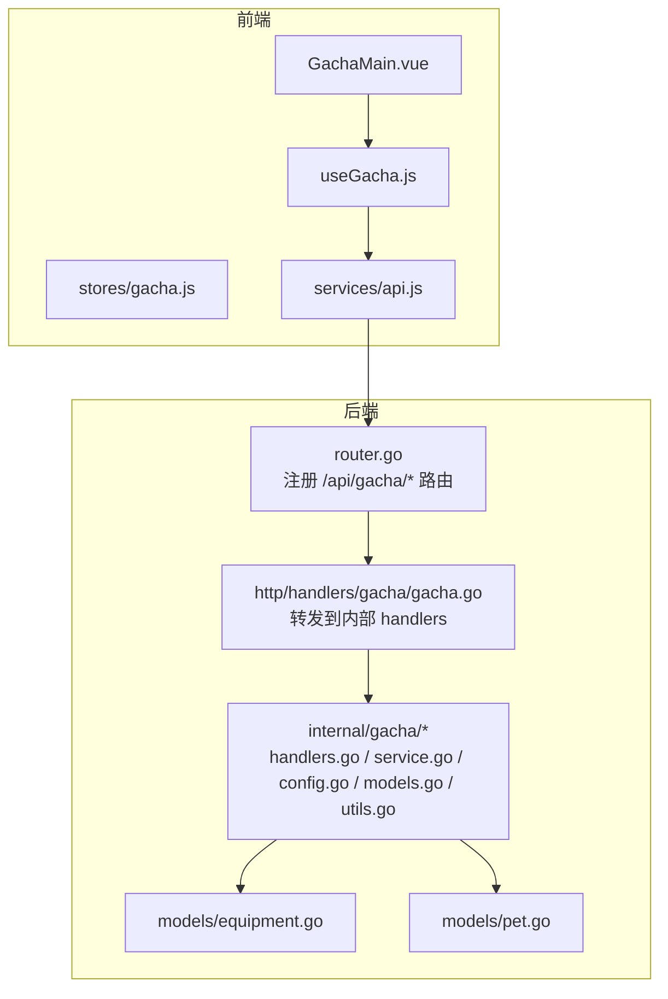
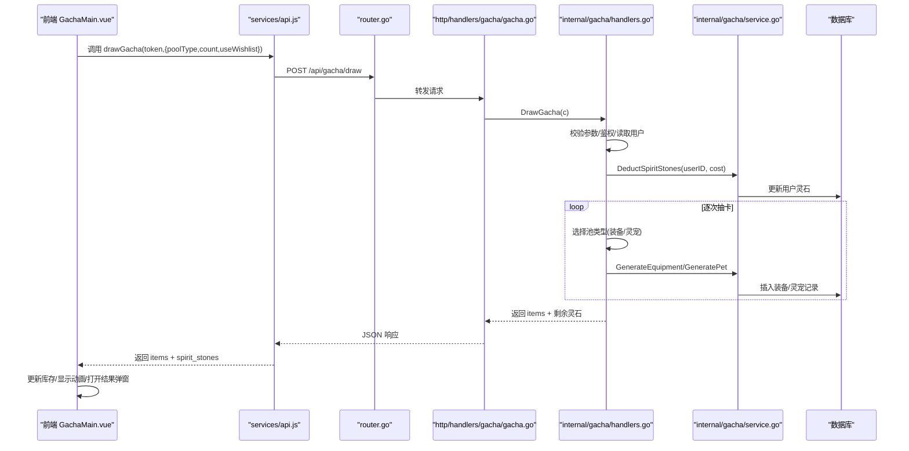
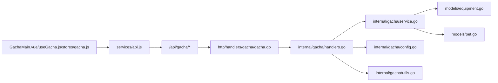
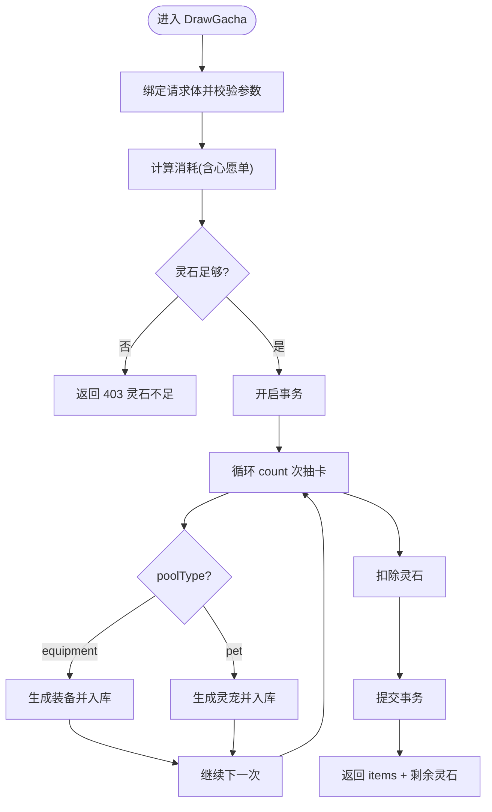

# 抽奖系统接口

<cite>
**本文引用的文件**
- [server-go/internal/http/handlers/gacha/gacha.go](file://server-go/internal/http/handlers/gacha/gacha.go)
- [server-go/internal/gacha/handlers.go](file://server-go/internal/gacha/handlers.go)
- [server-go/internal/gacha/service.go](file://server-go/internal/gacha/service.go)
- [server-go/internal/gacha/config.go](file://server-go/internal/gacha/config.go)
- [server-go/internal/gacha/models.go](file://server-go/internal/gacha/models.go)
- [server-go/internal/gacha/utils.go](file://server-go/internal/gacha/utils.go)
- [server-go/internal/http/router/router.go](file://server-go/internal/http/router/router.go)
- [server-go/internal/models/equipment.go](file://server-go/internal/models/equipment.go)
- [server-go/internal/models/pet.go](file://server-go/internal/models/pet.go)
- [src/components/gacha/GachaMain.vue](file://src/components/gacha/GachaMain.vue)
- [src/components/gacha/useGacha.js](file://src/components/gacha/useGacha.js)
- [src/stores/gacha.js](file://src/stores/gacha.js)
- [src/services/api.js](file://src/services/api.js)
</cite>

## 目录
1. [简介](#简介)
2. [项目结构](#项目结构)
3. [核心组件](#核心组件)
4. [架构总览](#架构总览)
5. [详细组件分析](#详细组件分析)
6. [依赖关系分析](#依赖关系分析)
7. [性能考量](#性能考量)
8. [故障排查指南](#故障排查指南)
9. [结论](#结论)
10. [附录](#附录)

## 简介
本文件面向“抽奖系统”API文档，重点覆盖以下两个后端接口：
- POST /api/gacha/draw：单抽接口
- POST /api/gacha/auto-actions：自动处理接口（用于批量出售/放生）

同时结合前端组件与状态管理，说明请求参数、响应结构、概率配置、保底机制、资源消耗（灵石）、库存更新、重复物品处理（转化为碎片）等业务规则，并给出常见错误码与前端调用示例与结果动画展示逻辑。

## 项目结构
后端采用 Go Gin 路由 + 内部 gacha 包处理业务逻辑；前端采用 Vue + Pinia 状态管理与 API 服务封装。

图表来源
- [server-go/internal/http/router/router.go](file://server-go/internal/http/router/router.go#L78-L84)
- [server-go/internal/http/handlers/gacha/gacha.go](file://server-go/internal/http/handlers/gacha/gacha.go#L1-L17)
- [server-go/internal/gacha/handlers.go](file://server-go/internal/gacha/handlers.go#L1-L173)
- [server-go/internal/gacha/service.go](file://server-go/internal/gacha/service.go#L1-L139)
- [server-go/internal/gacha/config.go](file://server-go/internal/gacha/config.go#L1-L198)
- [server-go/internal/gacha/models.go](file://server-go/internal/gacha/models.go#L1-L186)
- [server-go/internal/gacha/utils.go](file://server-go/internal/gacha/utils.go#L1-L363)
- [server-go/internal/models/equipment.go](file://server-go/internal/models/equipment.go#L1-L34)
- [server-go/internal/models/pet.go](file://server-go/internal/models/pet.go#L1-L35)

章节来源
- [server-go/internal/http/router/router.go](file://server-go/internal/http/router/router.go#L78-L84)

## 核心组件
- 后端路由：/api/gacha/draw 与 /api/gacha/auto-actions
- 抽奖处理器：负责鉴权、参数校验、资源扣费、事务内生成物品、库存更新
- 业务服务：生成装备/灵宠、扣除灵石、增加强化石、删除装备/灵宠
- 配置与工具：固定概率权重、属性池与规则、加权随机、属性值生成
- 前端：GachaMain.vue 调用 API、展示动画、更新库存与结果

章节来源
- [server-go/internal/http/handlers/gacha/gacha.go](file://server-go/internal/http/handlers/gacha/gacha.go#L1-L17)
- [server-go/internal/gacha/handlers.go](file://server-go/internal/gacha/handlers.go#L26-L173)
- [server-go/internal/gacha/service.go](file://server-go/internal/gacha/service.go#L1-L139)
- [server-go/internal/gacha/config.go](file://server-go/internal/gacha/config.go#L1-L198)
- [server-go/internal/gacha/utils.go](file://server-go/internal/gacha/utils.go#L1-L363)
- [src/components/gacha/GachaMain.vue](file://src/components/gacha/GachaMain.vue#L1-L426)
- [src/components/gacha/useGacha.js](file://src/components/gacha/useGacha.js#L1-L40)
- [src/stores/gacha.js](file://src/stores/gacha.js#L1-L150)
- [src/services/api.js](file://src/services/api.js#L1-L1131)

## 架构总览
后端通过 Gin 路由将 /api/gacha/* 请求转发至内部 gacha 包的处理器，处理器在事务中完成资源扣费与物品生成，随后返回结果给前端。前端接收后更新状态、库存与结果弹窗，并触发抽卡动画。

图表来源
- [server-go/internal/http/router/router.go](file://server-go/internal/http/router/router.go#L78-L84)
- [server-go/internal/http/handlers/gacha/gacha.go](file://server-go/internal/http/handlers/gacha/gacha.go#L1-L17)
- [server-go/internal/gacha/handlers.go](file://server-go/internal/gacha/handlers.go#L26-L173)
- [server-go/internal/gacha/service.go](file://server-go/internal/gacha/service.go#L1-L139)
- [src/components/gacha/GachaMain.vue](file://src/components/gacha/GachaMain.vue#L216-L349)
- [src/services/api.js](file://src/services/api.js#L1-L1131)

## 详细组件分析

### 接口定义与请求参数
- 接口路径
  - POST /api/gacha/draw
  - POST /api/gacha/auto-actions
- 认证方式
  - 需携带 Authorization: Bearer <token>，路由层已启用鉴权中间件
- 请求体（/api/gacha/draw）
  - poolType: string，取值 "equipment" 或 "pet"
  - count: number，抽卡次数（默认1）
  - useWishlist: boolean，是否启用心愿单模式（影响消耗）
- 请求体（/api/gacha/auto-actions）
  - items: Array，待处理的物品数组
  - autoSellQualities: Array<string>，自动出售的装备品质集合
  - autoReleaseRarities: Array<string>，自动放生的灵宠稀有度集合

章节来源
- [server-go/internal/http/router/router.go](file://server-go/internal/http/router/router.go#L78-L84)
- [server-go/internal/http/handlers/gacha/gacha.go](file://server-go/internal/http/handlers/gacha/gacha.go#L1-L17)
- [server-go/internal/gacha/handlers.go](file://server-go/internal/gacha/handlers.go#L44-L94)
- [server-go/internal/gacha/handlers.go](file://server-go/internal/gacha/handlers.go#L193-L209)

### 响应结构
- /api/gacha/draw
  - success: boolean
  - items: Array，包含抽中的装备或灵宠对象
  - message: string
  - spirit_stones: number，剩余灵石（注意：字段名为小写，前端兼容了大小写差异）
- /api/gacha/auto-actions
  - success: boolean
  - soldItems: Array，已出售的装备列表
  - releasedPets: Array，已放生的灵宽数量
  - stonesGained: number，获得的强化石数量
  - message: string

章节来源
- [server-go/internal/gacha/handlers.go](file://server-go/internal/gacha/handlers.go#L161-L173)
- [server-go/internal/gacha/handlers.go](file://server-go/internal/gacha/handlers.go#L271-L283)

### 抽卡逻辑与概率配置
- 固定概率权重
  - 装备品质权重：mythic、legendary、epic、rare、uncommon、common
  - 灵宠稀有度权重：mythic、legendary、epic、rare、uncommon、common
- 属性生成
  - 按品质与类型（装备类型/灵宠）生成基础属性、战斗属性、抗性属性、特殊属性
  - 属性值范围随品质提升而扩大
- 加权随机
  - 使用权重数组进行加权随机选择品质
- 装备等级与所需境界
  - 装备等级与玩家等级一致，所需境界按等级区间映射

章节来源
- [server-go/internal/gacha/config.go](file://server-go/internal/gacha/config.go#L1-L198)
- [server-go/internal/gacha/utils.go](file://server-go/internal/gacha/utils.go#L1-L363)
- [server-go/internal/gacha/models.go](file://server-go/internal/gacha/models.go#L46-L186)

### 保底机制
- 仓库未实现保底计数与强制出货逻辑，当前为纯随机抽取，不保证固定次数内必得高稀有度物品。

章节来源
- [server-go/internal/gacha/config.go](file://server-go/internal/gacha/config.go#L1-L198)
- [server-go/internal/gacha/models.go](file://server-go/internal/gacha/models.go#L46-L186)

### 资源消耗与库存更新
- 灵石消耗
  - 单抽：100 灵石；十连：1000 灵石；百抽：10000 灵石
  - 心愿单模式：单抽 200 灵石；十连 2000 灵石；百抽 10000 灵石
  - 若未满足条件，直接返回 400 灵石不足
- 扣费与入库
  - 抽卡在事务中进行，先扣灵石，再生成物品并插入数据库，最后提交事务
- 强化石收益（自动处理）
  - 出售装备按品质折算为强化石；放生灵宠按稀有度折算为强化石

章节来源
- [server-go/internal/gacha/handlers.go](file://server-go/internal/gacha/handlers.go#L81-L103)
- [server-go/internal/gacha/service.go](file://server-go/internal/gacha/service.go#L117-L139)
- [server-go/internal/gacha/handlers.go](file://server-go/internal/gacha/handlers.go#L210-L269)

### 产出物数据结构
- 装备（后端模型）
  - 字段概览：ID、用户ID、装备ID、名称、类型、品质、槽位、等级、所需境界、强化等级、属性、额外属性、是否已装备等
- 灵宠（后端模型）
  - 字段概览：ID、用户ID、宠物ID、名称、类型、稀有度、等级、星级、经验、战斗属性、加成、是否激活等
- 前端展示
  - 前端在收到后端 items 后，会补充品质/稀有度信息以便渲染

章节来源
- [server-go/internal/models/equipment.go](file://server-go/internal/models/equipment.go#L1-L34)
- [server-go/internal/models/pet.go](file://server-go/internal/models/pet.go#L1-L35)
- [src/components/gacha/GachaMain.vue](file://src/components/gacha/GachaMain.vue#L266-L296)

### 错误码与异常处理
- 400 参数错误：请求体绑定失败或参数非法
- 401 未授权：缺少或无效的 Authorization
- 403 灵石不足：抽卡消耗大于现有灵石
- 500 服务器错误：数据库错误、事务回滚、内部异常
- 自动处理接口：若传入 items 中包含非目标类型或品质/稀有度不在配置中，将按配置逻辑跳过或忽略

章节来源
- [server-go/internal/gacha/handlers.go](file://server-go/internal/gacha/handlers.go#L44-L103)
- [server-go/internal/gacha/handlers.go](file://server-go/internal/gacha/handlers.go#L175-L283)

### 前端调用示例与结果动画
- 前端入口
  - GachaMain.vue 提供抽卡按钮与动画控制
  - useGacha.js 封装调用后端 /api/gacha/draw 的逻辑
  - stores/gacha.js 管理抽卡动画状态、结果分页与筛选
  - services/api.js 统一封装 fetch 请求并做字段命名转换
- 调用流程
  - performGacha(token, poolType, count, useWishlist)
  - 成功后更新 inventoryStore.spiritStones，触发抽卡动画，打开结果弹窗
  - 重新拉取玩家数据以同步最新库存
- 结果展示
  - GachaResultModal 分页展示抽卡结果，支持按品质/稀有度筛选

章节来源
- [src/components/gacha/GachaMain.vue](file://src/components/gacha/GachaMain.vue#L148-L349)
- [src/components/gacha/useGacha.js](file://src/components/gacha/useGacha.js#L1-L40)
- [src/stores/gacha.js](file://src/stores/gacha.js#L1-L150)
- [src/services/api.js](file://src/services/api.js#L1-L1131)

## 依赖关系分析
- 路由层
  - /api/gacha/* 路由受鉴权保护，转发到内部处理器
- 处理器层
  - DrawGacha：鉴权、参数校验、资源扣费、事务内生成物品、返回结果
  - ProcessAutoActions：自动出售/放生，按配置折算强化石
- 服务层
  - GenerateEquipment/GeneratePet：生成并持久化
  - Deduct/Add/Delete：资源与物品操作
- 配置与工具
  - 固定概率权重、属性池、加权随机、属性值范围
- 前端
  - 通过 api.js 统一调用后端接口，GachaMain.vue 控制 UI 与动画

图表来源
- [server-go/internal/http/router/router.go](file://server-go/internal/http/router/router.go#L78-L84)
- [server-go/internal/http/handlers/gacha/gacha.go](file://server-go/internal/http/handlers/gacha/gacha.go#L1-L17)
- [server-go/internal/gacha/handlers.go](file://server-go/internal/gacha/handlers.go#L26-L173)
- [server-go/internal/gacha/service.go](file://server-go/internal/gacha/service.go#L1-L139)
- [server-go/internal/gacha/config.go](file://server-go/internal/gacha/config.go#L1-L198)
- [server-go/internal/gacha/utils.go](file://server-go/internal/gacha/utils.go#L1-L363)
- [src/components/gacha/GachaMain.vue](file://src/components/gacha/GachaMain.vue#L1-L426)
- [src/components/gacha/useGacha.js](file://src/components/gacha/useGacha.js#L1-L40)
- [src/stores/gacha.js](file://src/stores/gacha.js#L1-L150)
- [src/services/api.js](file://src/services/api.js#L1-L1131)

## 性能考量
- 抽卡循环在单事务中执行，避免并发导致的资源不一致
- 属性生成与加权随机均为本地计算，复杂度低
- 前端分页与筛选在内存中进行，建议限制 items 数量或后端分页

[本节为通用建议，不直接分析具体文件]

## 故障排查指南
- 400 参数错误
  - 检查 poolType、count、useWishlist 是否合法
- 401 未授权
  - 确认 Authorization 头是否正确传递
- 403 灵石不足
  - 检查 useWishlist 与 count 对应的消耗是否正确
- 500 服务器错误
  - 查看日志中事务回滚与数据库错误信息
- 自动处理无效
  - 确认 items 中 type/quality/rarity 是否匹配配置

章节来源
- [server-go/internal/gacha/handlers.go](file://server-go/internal/gacha/handlers.go#L44-L103)
- [server-go/internal/gacha/handlers.go](file://server-go/internal/gacha/handlers.go#L175-L283)

## 结论
本抽奖系统实现了基于固定权重的概率抽取、装备与灵宠属性生成、灵石消耗与库存更新、以及自动处理出售/放生的闭环。前端通过统一 API 服务与状态管理，提供了流畅的抽卡体验与结果展示。当前未实现保底机制，后续可按业务需求扩展。

[本节为总结性内容，不直接分析具体文件]

## 附录

### API 定义速览
- POST /api/gacha/draw
  - 请求体：poolType(string), count(number), useWishlist(boolean)
  - 响应：success(boolean), items(Array), message(string), spirit_stones(number)
- POST /api/gacha/auto-actions
  - 请求体：items(Array), autoSellQualities(Array<string>), autoReleaseRarities(Array<string>)
  - 响应：success(boolean), soldItems(Array), releasedPets(Array), stonesGained(number), message(string)

章节来源
- [server-go/internal/http/router/router.go](file://server-go/internal/http/router/router.go#L78-L84)
- [server-go/internal/http/handlers/gacha/gacha.go](file://server-go/internal/http/handlers/gacha/gacha.go#L1-L17)
- [server-go/internal/gacha/handlers.go](file://server-go/internal/gacha/handlers.go#L44-L103)
- [server-go/internal/gacha/handlers.go](file://server-go/internal/gacha/handlers.go#L175-L283)

### 抽卡流程图（算法实现）

图表来源
- [server-go/internal/gacha/handlers.go](file://server-go/internal/gacha/handlers.go#L81-L173)
- [server-go/internal/gacha/service.go](file://server-go/internal/gacha/service.go#L117-L127)
- [server-go/internal/gacha/models.go](file://server-go/internal/gacha/models.go#L127-L186)