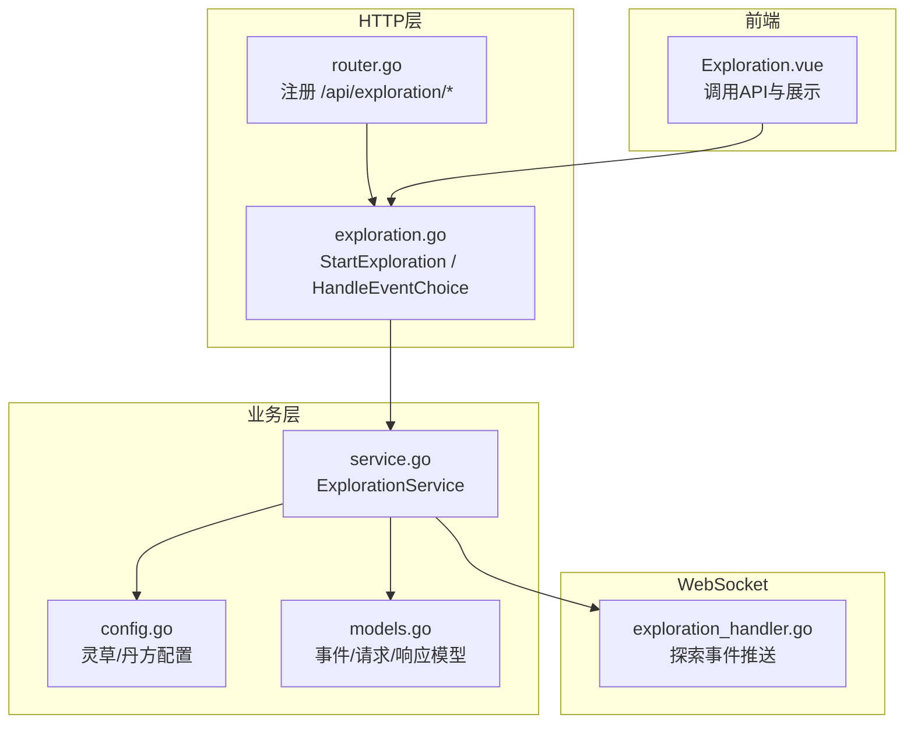
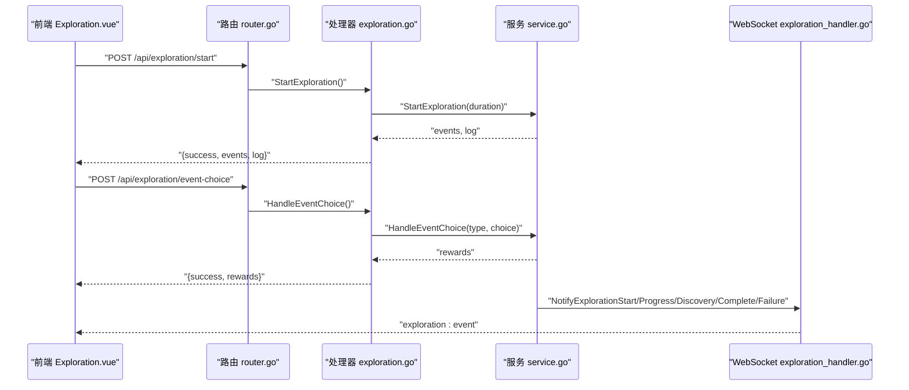
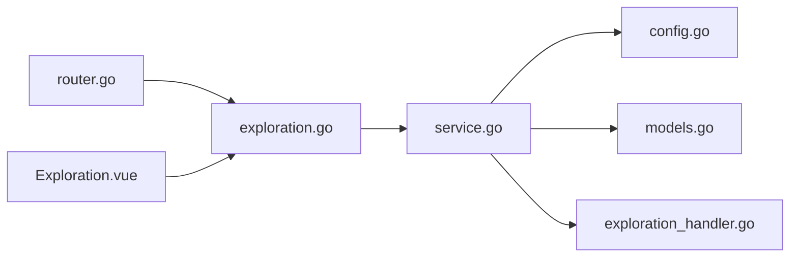
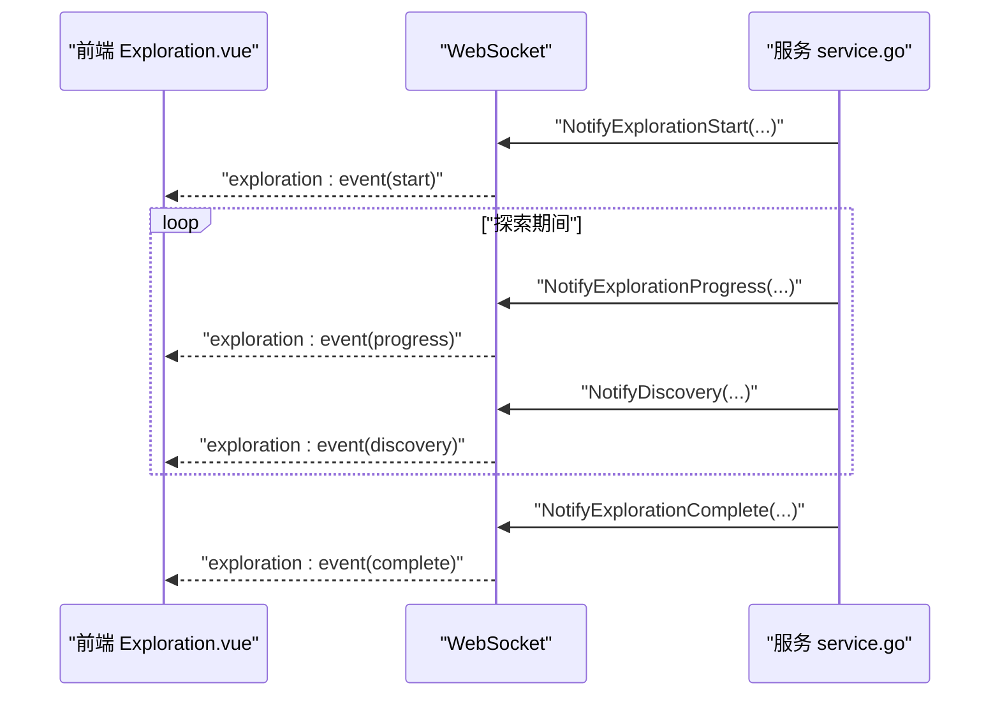

# 探索系统接口

<cite>
**本文引用的文件**
- [server-go/internal/http/handlers/exploration/exploration.go](file://server-go/internal/http/handlers/exploration/exploration.go)
- [server-go/internal/exploration/service.go](file://server-go/internal/exploration/service.go)
- [server-go/internal/exploration/config.go](file://server-go/internal/exploration/config.go)
- [server-go/internal/exploration/models.go](file://server-go/internal/exploration/models.go)
- [server-go/internal/http/router/router.go](file://server-go/internal/http/router/router.go)
- [server-go/internal/websocket/exploration_handler.go](file://server-go/internal/websocket/exploration_handler.go)
- [src/views/Exploration.vue](file://src/views/Exploration.vue)
- [server-go/internal/models/user.go](file://server-go/internal/models/user.go)
</cite>

## 目录
1. [简介](#简介)
2. [项目结构](#项目结构)
3. [核心组件](#核心组件)
4. [架构总览](#架构总览)
5. [详细组件分析](#详细组件分析)
6. [依赖关系分析](#依赖关系分析)
7. [性能与并发特性](#性能与并发特性)
8. [错误码与异常处理](#错误码与异常处理)
9. [前端调用与WebSocket协同](#前端调用与websocket协同)
10. [结论](#结论)

## 简介
本文件面向探索系统REST API，重点覆盖以下两条核心接口：
- POST /api/exploration/start：开始探索，返回探索期间触发的随机事件列表与日志
- POST /api/exploration/event-choice：处理事件选择，返回奖励结果

文档还结合exploration.go中的处理逻辑，说明service.go如何基于config.go中的配置计算探索事件的概率与产出；并阐述异步执行、超时处理、并发限制与防重复提交策略；最后给出错误码说明、前端Exploration.vue调用方式以及与WebSocket的协同更新机制。

## 项目结构
探索系统相关代码分布如下：
- HTTP层：路由注册与处理器
- 业务层：探索服务与事件配置
- 数据模型：探索事件、请求/响应、配置常量
- WebSocket：探索事件实时推送
- 前端：探索页面与API调用

图表来源
- [server-go/internal/http/router/router.go](file://server-go/internal/http/router/router.go#L86-L93)
- [server-go/internal/http/handlers/exploration/exploration.go](file://server-go/internal/http/handlers/exploration/exploration.go#L19-L109)
- [server-go/internal/exploration/service.go](file://server-go/internal/exploration/service.go#L1-L120)
- [server-go/internal/exploration/config.go](file://server-go/internal/exploration/config.go#L1-L120)
- [server-go/internal/exploration/models.go](file://server-go/internal/exploration/models.go#L1-L128)
- [server-go/internal/websocket/exploration_handler.go](file://server-go/internal/websocket/exploration_handler.go#L1-L149)
- [src/views/Exploration.vue](file://src/views/Exploration.vue#L43-L150)

章节来源
- [server-go/internal/http/router/router.go](file://server-go/internal/http/router/router.go#L86-L93)
- [server-go/internal/http/handlers/exploration/exploration.go](file://server-go/internal/http/handlers/exploration/exploration.go#L19-L109)
- [server-go/internal/exploration/service.go](file://server-go/internal/exploration/service.go#L1-L120)
- [server-go/internal/exploration/config.go](file://server-go/internal/exploration/config.go#L1-L120)
- [server-go/internal/exploration/models.go](file://server-go/internal/exploration/models.go#L1-L128)
- [server-go/internal/websocket/exploration_handler.go](file://server-go/internal/websocket/exploration_handler.go#L1-L149)
- [src/views/Exploration.vue](file://src/views/Exploration.vue#L43-L150)

## 核心组件
- HTTP处理器：负责参数校验、鉴权、调用服务层并返回JSON响应
- 探索服务：封装探索逻辑，包括事件触发、奖励产出、属性更新
- 配置模块：定义灵草品质、灵草配置、丹药配方及其概率与价值计算
- WebSocket处理器：向用户实时推送探索开始、进度、发现、完成、失败等事件
- 前端视图：发起探索与事件选择请求，展示日志与弹窗

章节来源
- [server-go/internal/http/handlers/exploration/exploration.go](file://server-go/internal/http/handlers/exploration/exploration.go#L19-L109)
- [server-go/internal/exploration/service.go](file://server-go/internal/exploration/service.go#L1-L120)
- [server-go/internal/exploration/config.go](file://server-go/internal/exploration/config.go#L1-L120)
- [server-go/internal/websocket/exploration_handler.go](file://server-go/internal/websocket/exploration_handler.go#L1-L149)
- [src/views/Exploration.vue](file://src/views/Exploration.vue#L43-L150)

## 架构总览
下图展示了从HTTP请求到业务处理再到WebSocket推送的整体流程。

图表来源
- [server-go/internal/http/router/router.go](file://server-go/internal/http/router/router.go#L86-L93)
- [server-go/internal/http/handlers/exploration/exploration.go](file://server-go/internal/http/handlers/exploration/exploration.go#L19-L109)
- [server-go/internal/exploration/service.go](file://server-go/internal/exploration/service.go#L1-L120)
- [server-go/internal/websocket/exploration_handler.go](file://server-go/internal/websocket/exploration_handler.go#L59-L148)

## 详细组件分析

### 接口定义与数据模型
- POST /api/exploration/start
  - 请求体：{duration: number}（毫秒），默认10000
  - 响应体：{success: boolean, events: ExplorationEvent[], log: string}
- POST /api/exploration/event-choice
  - 请求体：{eventType: string, choice: any}
  - 响应体：{success: boolean, rewards: any}

事件类型与字段
- ExplorationEvent：包含type、description、amount、herb、enemy、recipeId、fragments、choices等
- EventChoice：包含text、value
- ExplorationRequest/Response：封装请求与响应结构
- EventChoiceRequest/Response：封装事件选择请求与响应

章节来源
- [server-go/internal/http/handlers/exploration/exploration.go](file://server-go/internal/http/handlers/exploration/exploration.go#L19-L109)
- [server-go/internal/exploration/models.go](file://server-go/internal/exploration/models.go#L1-L128)

### 探索服务与事件触发
- StartExploration(duration)
  - 读取玩家数据，计算幸运值，按每秒概率触发事件
  - 生成事件列表与日志，更新基础奖励（灵石）
- HandleEventChoice(eventType, choice)
  - 根据事件类型分派处理：物品、灵石、灵草、丹方残页、战斗
- triggerRandomEvent(user, r)
  - 维护事件池与权重，按概率触发具体事件
- 事件处理函数
  - 古老石碑、灵泉、上古洞府、妖兽袭击、走火入魔、宝藏、顿悟、心魔侵扰、灵草发现、丹方残页
  - 每个事件更新玩家属性或库存，并返回带choices的事件对象

章节来源
- [server-go/internal/exploration/service.go](file://server-go/internal/exploration/service.go#L27-L120)
- [server-go/internal/exploration/service.go](file://server-go/internal/exploration/service.go#L105-L390)
- [server-go/internal/exploration/service.go](file://server-go/internal/exploration/service.go#L392-L467)

### 配置与产出计算
- 灵草品质与价值
  - 品质权重：common/uncommon/rare/epic/legendary
  - 价值计算：baseValue × 品质倍率
- 丹药配方
  - 包含ID、名称、描述、等级、类型、所需残页数
- 事件概率
  - 基础触发概率与幸运值相关，按每秒检查一次

章节来源
- [server-go/internal/exploration/config.go](file://server-go/internal/exploration/config.go#L1-L120)
- [server-go/internal/exploration/config.go](file://server-go/internal/exploration/config.go#L241-L265)

### WebSocket协同推送
- 探索事件类型：start、progress、discovery、complete、failure
- 推送内容：进度百分比、持续时间、已用时间、发现内容、奖励、错误信息
- 广播策略：按用户ID推送，避免事件过于密集时的抖动

章节来源
- [server-go/internal/websocket/exploration_handler.go](file://server-go/internal/websocket/exploration_handler.go#L1-L149)

### 前端调用方式
- Exploration.vue
  - startExploration：调用POST /api/exploration/start，处理返回的events与log
  - handleEventChoice：调用POST /api/exploration/event-choice，根据事件类型更新UI
  - 日志面板与弹窗展示事件详情与选项

章节来源
- [src/views/Exploration.vue](file://src/views/Exploration.vue#L43-L150)

## 依赖关系分析
- 路由注册
  - /api/exploration组内包含/start与/event-choice两个POST端点
  - 需要鉴权中间件保护
- 处理器依赖
  - exploration.go依赖service.go进行业务处理
  - service.go依赖config.go与models.go
- WebSocket依赖
  - service.go通过exploration_handler.go推送事件
- 前端依赖
  - Exploration.vue通过apiClient调用上述端点

图表来源
- [server-go/internal/http/router/router.go](file://server-go/internal/http/router/router.go#L86-L93)
- [server-go/internal/http/handlers/exploration/exploration.go](file://server-go/internal/http/handlers/exploration/exploration.go#L19-L109)
- [server-go/internal/exploration/service.go](file://server-go/internal/exploration/service.go#L1-L120)
- [server-go/internal/exploration/config.go](file://server-go/internal/exploration/config.go#L1-L120)
- [server-go/internal/exploration/models.go](file://server-go/internal/exploration/models.go#L1-L128)
- [server-go/internal/websocket/exploration_handler.go](file://server-go/internal/websocket/exploration_handler.go#L1-L149)
- [src/views/Exploration.vue](file://src/views/Exploration.vue#L43-L150)

章节来源
- [server-go/internal/http/router/router.go](file://server-go/internal/http/router/router.go#L86-L93)
- [server-go/internal/http/handlers/exploration/exploration.go](file://server-go/internal/http/handlers/exploration/exploration.go#L19-L109)
- [server-go/internal/exploration/service.go](file://server-go/internal/exploration/service.go#L1-L120)
- [server-go/internal/exploration/config.go](file://server-go/internal/exploration/config.go#L1-L120)
- [server-go/internal/exploration/models.go](file://server-go/internal/exploration/models.go#L1-L128)
- [server-go/internal/websocket/exploration_handler.go](file://server-go/internal/websocket/exploration_handler.go#L1-L149)
- [src/views/Exploration.vue](file://src/views/Exploration.vue#L43-L150)

## 性能与并发特性
- 异步执行
  - StartExploration在处理器中直接调用服务层方法，属于同步阻塞处理
  - 若需长时间探索，建议在服务层引入后台任务或分段推进，并通过WebSocket推送进度
- 超时处理
  - 当前未见显式的超时控制；可在服务层增加上下文超时或分段处理以避免阻塞
- 并发限制
  - 未见全局并发限制；可在服务层或路由层增加令牌桶/信号量控制同一用户的并发探索
- 防重复提交
  - 未见防重机制；可在服务层引入用户级锁（如Redis SETNX）或幂等键，确保同一用户在同一时刻仅有一个活跃探索任务

[本节为通用性能讨论，不直接分析具体文件，故无章节来源]

## 错误码与异常处理
- HTTP状态码
  - 400：请求参数错误（处理器参数绑定失败）
  - 401：未授权（缺少userID或鉴权失败）
  - 500：内部错误（服务层抛错或数据库更新失败）
- 业务错误
  - 用户不存在、数据库读写失败、事件类型未知等
- 建议
  - 在处理器中统一捕获错误并返回结构化错误信息
  - 对关键路径（数据库更新）增加重试与回滚

章节来源
- [server-go/internal/http/handlers/exploration/exploration.go](file://server-go/internal/http/handlers/exploration/exploration.go#L22-L66)
- [server-go/internal/http/handlers/exploration/exploration.go](file://server-go/internal/http/handlers/exploration/exploration.go#L71-L109)

## 前端调用与WebSocket协同
- 前端调用
  - startExploration：POST /api/exploration/start，duration默认10000
  - handleEventChoice：POST /api/exploration/event-choice，携带eventType与choice
  - 日志与弹窗展示事件详情与选项
- WebSocket协同
  - 服务层在探索开始、进度、发现、完成、失败时通过exploration_handler.go推送事件
  - 前端监听exploration:event消息，实时更新UI

图表来源
- [server-go/internal/websocket/exploration_handler.go](file://server-go/internal/websocket/exploration_handler.go#L59-L148)
- [server-go/internal/exploration/service.go](file://server-go/internal/exploration/service.go#L27-L120)

章节来源
- [src/views/Exploration.vue](file://src/views/Exploration.vue#L43-L150)
- [server-go/internal/websocket/exploration_handler.go](file://server-go/internal/websocket/exploration_handler.go#L1-L149)
- [server-go/internal/exploration/service.go](file://server-go/internal/exploration/service.go#L27-L120)

## 结论
- 探索系统通过清晰的HTTP接口与服务层实现，结合配置模块完成事件概率与产出计算
- WebSocket提供了实时事件推送能力，前端可通过API与WebSocket协同获得流畅体验
- 当前实现为同步阻塞模式，建议在服务层引入后台任务、分段推进与并发限制，以提升性能与稳定性
- 建议补充超时控制、防重复提交与统一错误码规范，增强系统健壮性