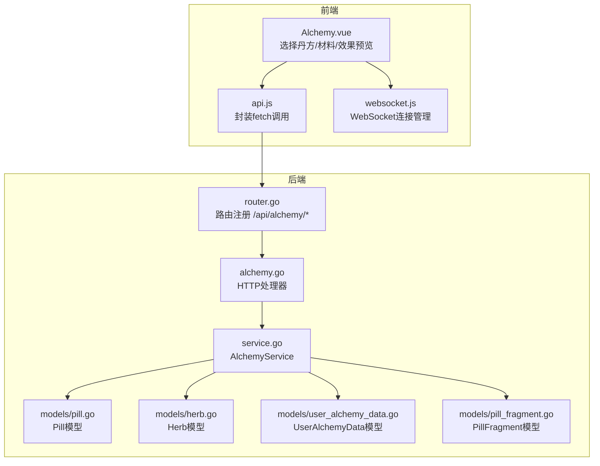
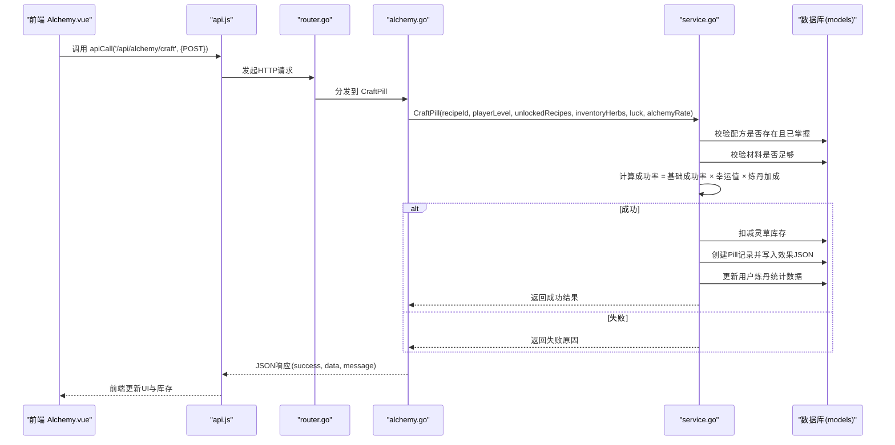
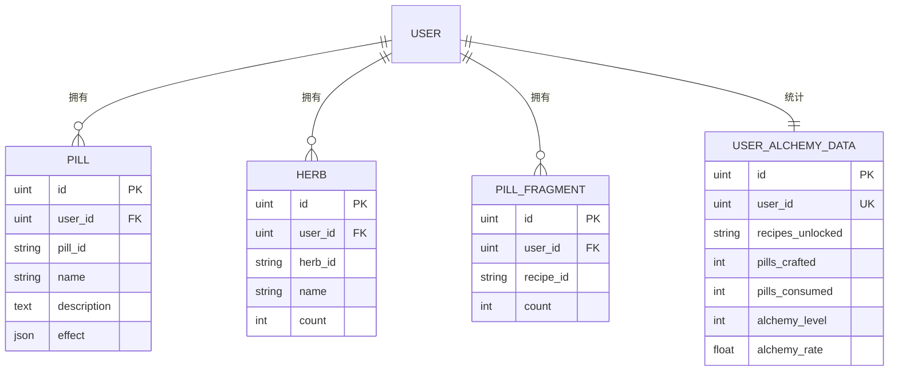
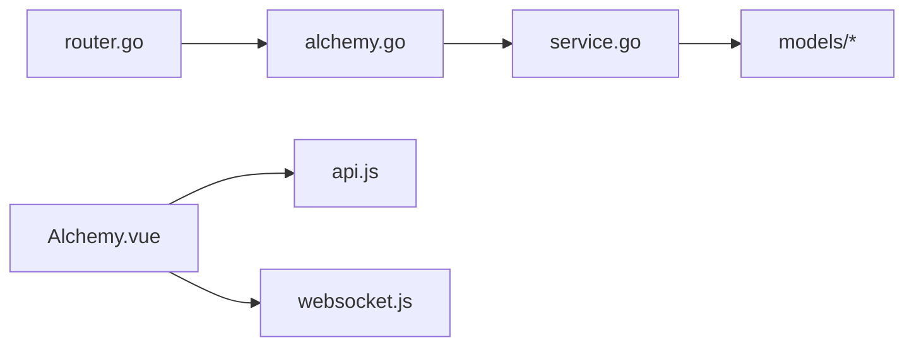
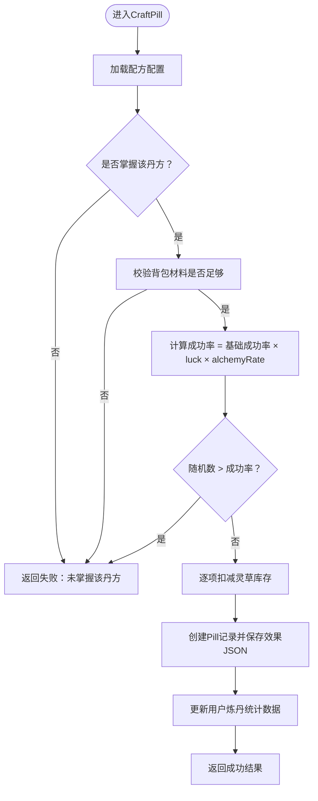

# 炼丹系统接口

<cite>
**本文引用的文件**
- [server-go/internal/http/handlers/alchemy/alchemy.go](file://server-go/internal/http/handlers/alchemy/alchemy.go)
- [server-go/internal/alchemy/service.go](file://server-go/internal/alchemy/service.go)
- [server-go/internal/alchemy/models.go](file://server-go/internal/alchemy/models.go)
- [server-go/internal/models/pill.go](file://server-go/internal/models/pill.go)
- [server-go/internal/models/herb.go](file://server-go/internal/models/herb.go)
- [server-go/internal/models/user_alchemy_data.go](file://server-go/internal/models/user_alchemy_data.go)
- [server-go/internal/models/pill_fragment.go](file://server-go/internal/models/pill_fragment.go)
- [server-go/internal/http/router/router.go](file://server-go/internal/http/router/router.go)
- [src/views/Alchemy.vue](file://src/views/Alchemy.vue)
- [src/services/api.js](file://src/services/api.js)
- [src/services/websocket.js](file://src/services/websocket.js)
</cite>

## 目录
1. [简介](#简介)
2. [项目结构](#项目结构)
3. [核心组件](#核心组件)
4. [架构总览](#架构总览)
5. [详细组件分析](#详细组件分析)
6. [依赖关系分析](#依赖关系分析)
7. [性能考量](#性能考量)
8. [故障排查指南](#故障排查指南)
9. [结论](#结论)
10. [附录](#附录)

## 简介
本文件为“炼丹系统”API的完整参考文档，重点围绕核心接口 POST /api/alchemy/craft 的炼制流程展开，覆盖请求参数、服务层配方匹配与成功率计算、材料消耗、响应结构、错误场景与HTTP状态码，并结合前端 Alchemy.vue 的调用方式与 WebSocket 同步机制，帮助开发者快速集成与排障。

## 项目结构
炼丹系统位于后端 Go 服务与前端 Vue 之间，通过 Gin 路由暴露 REST 接口；服务层负责业务逻辑与数据库交互；前端通过统一 API 服务封装调用后端接口，并通过 WebSocket 实时接收状态变化。

图表来源
- [server-go/internal/http/router/router.go](file://server-go/internal/http/router/router.go#L115-L124)
- [server-go/internal/http/handlers/alchemy/alchemy.go](file://server-go/internal/http/handlers/alchemy/alchemy.go#L140-L217)
- [server-go/internal/alchemy/service.go](file://server-go/internal/alchemy/service.go#L349-L454)
- [server-go/internal/models/pill.go](file://server-go/internal/models/pill.go#L1-L21)
- [server-go/internal/models/herb.go](file://server-go/internal/models/herb.go#L1-L17)
- [server-go/internal/models/user_alchemy_data.go](file://server-go/internal/models/user_alchemy_data.go#L1-L17)
- [server-go/internal/models/pill_fragment.go](file://server-go/internal/models/pill_fragment.go#L1-L13)

章节来源
- [server-go/internal/http/router/router.go](file://server-go/internal/http/router/router.go#L115-L124)

## 核心组件
- HTTP处理器：提供 /api/alchemy/* 的路由与请求校验，组装服务层结果并返回标准响应。
- 服务层：实现配方匹配、材料校验、成功率计算、材料扣减、丹药入库与统计数据更新。
- 数据模型：Pill、Herb、UserAlchemyData、PillFragment 等，支撑炼丹过程中的持久化与统计。
- 前端调用：Alchemy.vue 通过 api.js 调用后端接口，同时维护本地库存与统计；WebSocket 用于实时状态同步（如背包库存变化）。

章节来源
- [server-go/internal/http/handlers/alchemy/alchemy.go](file://server-go/internal/http/handlers/alchemy/alchemy.go#L140-L217)
- [server-go/internal/alchemy/service.go](file://server-go/internal/alchemy/service.go#L349-L454)
- [server-go/internal/alchemy/models.go](file://server-go/internal/alchemy/models.go#L109-L171)
- [server-go/internal/models/pill.go](file://server-go/internal/models/pill.go#L1-L21)
- [server-go/internal/models/herb.go](file://server-go/internal/models/herb.go#L1-L17)
- [server-go/internal/models/user_alchemy_data.go](file://server-go/internal/models/user_alchemy_data.go#L1-L17)
- [server-go/internal/models/pill_fragment.go](file://server-go/internal/models/pill_fragment.go#L1-L13)
- [src/views/Alchemy.vue](file://src/views/Alchemy.vue#L174-L248)
- [src/services/api.js](file://src/services/api.js#L864-L898)

## 架构总览
POST /api/alchemy/craft 的端到端流程如下：

图表来源
- [server-go/internal/http/router/router.go](file://server-go/internal/http/router/router.go#L115-L124)
- [server-go/internal/http/handlers/alchemy/alchemy.go](file://server-go/internal/http/handlers/alchemy/alchemy.go#L140-L217)
- [server-go/internal/alchemy/service.go](file://server-go/internal/alchemy/service.go#L349-L454)
- [server-go/internal/models/pill.go](file://server-go/internal/models/pill.go#L1-L21)
- [server-go/internal/models/herb.go](file://server-go/internal/models/herb.go#L1-L17)
- [server-go/internal/models/user_alchemy_data.go](file://server-go/internal/models/user_alchemy_data.go#L1-L17)
- [server-go/internal/models/pill_fragment.go](file://server-go/internal/models/pill_fragment.go#L1-L13)
- [src/views/Alchemy.vue](file://src/views/Alchemy.vue#L174-L248)
- [src/services/api.js](file://src/services/api.js#L864-L898)

## 详细组件分析

### 接口定义：POST /api/alchemy/craft
- 路由注册：受认证中间件保护，仅登录用户可访问。
- 请求体字段：
  - recipeId：字符串，目标丹方ID
  - playerLevel：整数，玩家等级（用于效果倍率计算）
  - unlockedRecipes：字符串数组，已掌握的丹方ID列表
  - inventoryHerbs：字典，{灵草ID: 数量}，表示当前背包中各灵草数量
  - luck：浮点数，幸运值（>0）
  - alchemyRate：浮点数，炼丹加成率（>0）
- 响应体字段：
  - success：布尔，炼制是否成功
  - message：字符串，操作提示
  - pillId：字符串（可选），新创建的丹药记录ID
  - pillName：字符串（可选），丹药名称
  - successRate：浮点数（可选），本次炼制成功率
  - consumedHerbs：字典（可选），消耗的灵草及其数量
  - pillEffect：对象（可选），计算后的效果（type、value、duration、successRate）

前置条件与校验
- 用户必须已掌握该丹方（unlockedRecipes包含recipeId）
- 背包中每种材料的数量必须满足配方要求
- 幸运值与炼丹加成率若<=0则按默认值1.0处理

成功率与材料消耗
- 成功率 = 品阶基础成功率 × luck × alchemyRate
- 成功后从数据库逐项扣减对应灵草数量
- 成功后创建一条Pill记录，并将效果以JSON形式保存

响应与状态码
- 成功：HTTP 200，返回 success=true
- 参数错误：HTTP 400，返回 success=false 与错误信息
- 未授权：HTTP 401
- 其他内部错误：HTTP 500

章节来源
- [server-go/internal/http/router/router.go](file://server-go/internal/http/router/router.go#L115-L124)
- [server-go/internal/http/handlers/alchemy/alchemy.go](file://server-go/internal/http/handlers/alchemy/alchemy.go#L140-L217)
- [server-go/internal/alchemy/models.go](file://server-go/internal/alchemy/models.go#L109-L171)
- [server-go/internal/alchemy/service.go](file://server-go/internal/alchemy/service.go#L349-L454)

### 服务层：AlchemyService.CraftPill
- 配方匹配：遍历内置配方，找到对应recipeID
- 权限与材料校验：检查是否掌握、背包材料是否足够
- 成功率计算：取品阶配置中的基础成功率，乘以luck与alchemyRate
- 随机判定：随机数大于成功率则失败
- 材料扣减：逐项对用户灵草库存执行count -= count
- 产物入库：创建Pill记录，effect字段保存JSON化的效果
- 统计更新：读取UserAlchemyDataDB，pillsCrafted自增并保存

章节来源
- [server-go/internal/alchemy/service.go](file://server-go/internal/alchemy/service.go#L349-L454)
- [server-go/internal/models/pill.go](file://server-go/internal/models/pill.go#L1-L21)
- [server-go/internal/models/herb.go](file://server-go/internal/models/herb.go#L1-L17)
- [server-go/internal/models/user_alchemy_data.go](file://server-go/internal/models/user_alchemy_data.go#L1-L17)

### 数据模型与关系
- Pill：保存炼制成功的丹药记录，包含effect JSON字段
- Herb：保存用户拥有的灵草库存
- UserAlchemyData：保存用户炼丹统计数据（炼制次数、服用次数、等级、加成率）
- PillFragment：保存用户拥有的丹方残页数量

图表来源
- [server-go/internal/models/pill.go](file://server-go/internal/models/pill.go#L1-L21)
- [server-go/internal/models/herb.go](file://server-go/internal/models/herb.go#L1-L17)
- [server-go/internal/models/pill_fragment.go](file://server-go/internal/models/pill_fragment.go#L1-L13)
- [server-go/internal/models/user_alchemy_data.go](file://server-go/internal/models/user_alchemy_data.go#L1-L17)

### 前端调用与WebSocket同步
- 前端 Alchemy.vue
  - 通过 api.js 的 apiCall 方法调用 /api/alchemy/craft
  - 构造 inventoryHerbs 字典（将背包中同ID灵草计数汇总）
  - 成功后根据 consumedHerbs 从前端库存移除对应数量的灵草条目
  - 刷新丹方列表，更新炼制次数统计
- WebSocket
  - 通过 websocket.js 管理连接、心跳与事件订阅
  - 可用于订阅背包库存变化等实时事件（具体事件类型以后端实现为准）

章节来源
- [src/views/Alchemy.vue](file://src/views/Alchemy.vue#L174-L248)
- [src/services/api.js](file://src/services/api.js#L864-L898)
- [src/services/websocket.js](file://src/services/websocket.js#L1-L313)

## 依赖关系分析
- 路由依赖：router.go 将 /api/alchemy/* 路由绑定到 alchemy.go 的处理器
- 处理器依赖：alchemy.go 依赖 AlchemyService 完成业务逻辑
- 服务层依赖：service.go 依赖 models 层进行数据库读写
- 前端依赖：Alchemy.vue 依赖 api.js 进行HTTP调用，依赖 websocket.js 进行实时通信

图表来源
- [server-go/internal/http/router/router.go](file://server-go/internal/http/router/router.go#L115-L124)
- [server-go/internal/http/handlers/alchemy/alchemy.go](file://server-go/internal/http/handlers/alchemy/alchemy.go#L140-L217)
- [server-go/internal/alchemy/service.go](file://server-go/internal/alchemy/service.go#L349-L454)
- [src/views/Alchemy.vue](file://src/views/Alchemy.vue#L174-L248)
- [src/services/api.js](file://src/services/api.js#L864-L898)
- [src/services/websocket.js](file://src/services/websocket.js#L1-L313)

## 性能考量
- 成功率计算为纯内存运算，复杂度低
- 材料扣减与Pill创建均为单次数据库写入，建议在高并发场景下：
  - 使用数据库事务包裹材料扣减与Pill创建，保证一致性
  - 对高频查询的用户炼丹统计数据进行缓存
  - 对 inventoryHerbs 的构建可在前端按需优化，避免重复计算

[本节为通用建议，无需列出章节来源]

## 故障排查指南
常见失败场景与HTTP状态码
- 未授权：HTTP 401（未携带有效token）
- 请求参数错误：HTTP 400（JSON解析失败或字段缺失）
- 丹方不存在或未掌握：HTTP 400（服务层返回错误）
- 材料不足：HTTP 400（服务层返回错误）
- 内部错误：HTTP 500（数据库异常、序列化失败等）

定位要点
- 检查前端传入的 inventoryHerbs 是否正确汇总
- 确认 unlockedRecipes 中包含 recipeId
- 检查 luck 与 alchemyRate 是否为正数
- 关注服务层日志输出，定位数据库操作失败点

章节来源
- [server-go/internal/http/handlers/alchemy/alchemy.go](file://server-go/internal/http/handlers/alchemy/alchemy.go#L140-L217)
- [server-go/internal/alchemy/service.go](file://server-go/internal/alchemy/service.go#L349-L454)

## 结论
POST /api/alchemy/craft 提供了完整的炼制流程：配方校验、材料校验、成功率计算、材料扣减与产物入库。配合前端 Alchemy.vue 与 api.js 的调用以及 websocket.js 的实时能力，可实现流畅的炼丹体验。建议在高并发场景下引入事务与缓存策略，确保数据一致性与性能表现。

[本节为总结，无需列出章节来源]

## 附录

### 请求体字段说明（POST /api/alchemy/craft）
- recipeId：目标丹方ID
- playerLevel：玩家等级（用于效果倍率）
- unlockedRecipes：已掌握的丹方ID列表
- inventoryHerbs：{灵草ID: 数量}
- luck：幸运值（>0）
- alchemyRate：炼丹加成率（>0）

章节来源
- [server-go/internal/alchemy/models.go](file://server-go/internal/alchemy/models.go#L109-L171)
- [server-go/internal/http/handlers/alchemy/alchemy.go](file://server-go/internal/http/handlers/alchemy/alchemy.go#L140-L217)

### 响应体字段说明（POST /api/alchemy/craft）
- success：布尔
- message：字符串
- pillId：新创建的Pill记录ID（可选）
- pillName：丹药名称（可选）
- successRate：成功率（可选）
- consumedHerbs：消耗的灵草（可选）
- pillEffect：效果（可选）

章节来源
- [server-go/internal/alchemy/models.go](file://server-go/internal/alchemy/models.go#L119-L171)
- [server-go/internal/alchemy/service.go](file://server-go/internal/alchemy/service.go#L445-L454)

### 成功率计算流程图

图表来源
- [server-go/internal/alchemy/service.go](file://server-go/internal/alchemy/service.go#L349-L454)

### 前端调用示例（Alchemy.vue）
- 调用位置：Alchemy.vue 的 craftPill 方法
- 关键步骤：
  - 构建 inventoryHerbs（将背包中同ID灵草计数汇总）
  - 调用 api.js.apiCall('/api/alchemy/craft', {POST})
  - 成功后根据 consumedHerbs 从前端库存移除对应数量的灵草条目
  - 刷新丹方列表与统计

章节来源
- [src/views/Alchemy.vue](file://src/views/Alchemy.vue#L174-L248)
- [src/services/api.js](file://src/services/api.js#L864-L898)