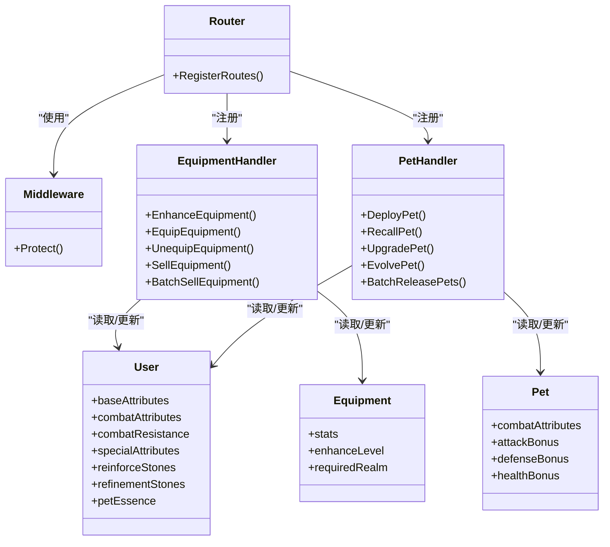

# 玩家管理接口

<cite>
**本文档引用的文件**
- [router.go](file://server-go/internal/http/router/router.go)
- [auth.go](file://server-go/internal/http/middleware/auth.go)
- [equipment_handler.go](file://server-go/internal/http/handlers/player/equipment_handler.go)
- [pet_handler.go](file://server-go/internal/http/handlers/player/pet_handler.go)
- [player_handler.go](file://server-go/internal/http/handlers/player/player_handler.go)
- [user.go](file://server-go/internal/models/user.go)
- [equipment.go](file://server-go/internal/models/equipment.go)
- [pet.go](file://server-go/internal/models/pet.go)
- [api.js](file://src/services/api.js)
- [EquipmentTab.vue](file://src/components/EquipmentTab.vue)
- [Settings.vue](file://src/views/Settings.vue)
- [settings.js](file://src/stores/settings.js)
</cite>

## 目录
1. [简介](#简介)
2. [项目结构](#项目结构)
3. [核心组件](#核心组件)
4. [架构总览](#架构总览)
5. [详细组件分析](#详细组件分析)
6. [依赖关系分析](#依赖关系分析)
7. [性能考量](#性能考量)
8. [故障排查指南](#故障排查指南)
9. [结论](#结论)
10. [附录](#附录)

## 简介
本文档面向“玩家管理”相关API，聚焦以下三类能力：
- 装备：强化、洗练、穿戴/卸下、出售、批量出售
- 灵宠：出战/召回、升级、升星、批量放生
- 基础信息：玩家灵力值更新（对应PUT /api/player/spirit）

同时，结合前端组件与Pinia Store，说明如何在客户端侧调用后端接口并同步本地状态。

## 项目结构
后端采用Gin路由分组，玩家相关接口位于/api/player组内，统一受JWT认证中间件保护。前端通过APIService封装HTTP请求，EquipmentTab.vue负责装备交互，Settings.vue承载部分前端设置项。

**图表来源**
- [router.go](file://server-go/internal/http/router/router.go#L1-L126)
- [auth.go](file://server-go/internal/http/middleware/auth.go#L1-L76)
- [equipment_handler.go](file://server-go/internal/http/handlers/player/equipment_handler.go#L1-L844)
- [pet_handler.go](file://server-go/internal/http/handlers/player/pet_handler.go#L1-L628)
- [player_handler.go](file://server-go/internal/http/handlers/player/player_handler.go#L154-L341)
- [user.go](file://server-go/internal/models/user.go#L1-L48)
- [equipment.go](file://server-go/internal/models/equipment.go#L1-L34)
- [pet.go](file://server-go/internal/models/pet.go#L1-L35)
- [api.js](file://src/services/api.js#L1-L1131)
- [EquipmentTab.vue](file://src/components/EquipmentTab.vue#L1-L739)
- [Settings.vue](file://src/views/Settings.vue#L1-L281)
- [settings.js](file://src/stores/settings.js#L1-L28)

**章节来源**
- [router.go](file://server-go/internal/http/router/router.go#L1-L126)

## 核心组件
- 认证中间件：从Authorization头解析Bearer Token，校验JWT_SECRET，失败返回401；成功将用户ID注入上下文。
- 装备处理器：提供强化、洗练、穿戴/卸下、出售、批量出售等接口。
- 灵宠处理器：提供出战/召回、升级、升星、批量放生等接口。
- 玩家数据处理器：提供获取/更新灵力值等接口。
- 数据模型：User、Equipment、Pet，承载玩家基础属性、装备属性、宠物战斗属性等。

**章节来源**
- [auth.go](file://server-go/internal/http/middleware/auth.go#L1-L76)
- [equipment_handler.go](file://server-go/internal/http/handlers/player/equipment_handler.go#L1-L844)
- [pet_handler.go](file://server-go/internal/http/handlers/player/pet_handler.go#L1-L628)
- [player_handler.go](file://server-go/internal/http/handlers/player/player_handler.go#L154-L341)
- [user.go](file://server-go/internal/models/user.go#L1-L48)
- [equipment.go](file://server-go/internal/models/equipment.go#L1-L34)
- [pet.go](file://server-go/internal/models/pet.go#L1-L35)

## 架构总览
后端路由按功能分组，玩家接口均受认证保护；前端通过APIService封装请求，EquipmentTab.vue与Settings.vue分别驱动装备与设置交互。

**图表来源**
- [router.go](file://server-go/internal/http/router/router.go#L1-L126)
- [auth.go](file://server-go/internal/http/middleware/auth.go#L1-L76)
- [equipment_handler.go](file://server-go/internal/http/handlers/player/equipment_handler.go#L224-L323)
- [api.js](file://src/services/api.js#L453-L477)
- [EquipmentTab.vue](file://src/components/EquipmentTab.vue#L626-L654)

## 详细组件分析

### 装备强化接口：POST /api/player/equipment/:id/enhance
- **功能概述**
  - 基于当前强化等级计算强化成本（每级成本随等级递增），校验用户强化石余额，执行强化并返回前后属性对比。
- **认证要求**
  - 需携带Authorization: Bearer <token>，否则返回401。
- **参数校验**
  - 请求体需包含reinforce_stones字段；若用户或装备不存在，返回404。
  - 若强化石不足，返回400提示并返回当前属性与期望成本。
- **业务逻辑要点**
  - 成本计算：cost = 10 × (当前等级 + 1)。
  - 属性提升：每个属性乘以1.1倍。
  - 等级与境界要求：强化成功后等级+1，required_realm = floor(新等级/10)+1。
  - 安全性改进：后端不再信任前端提供的`reinforceStones`值，而是直接查询数据库验证用户`reinforce_stones`数量，防止客户端操纵。
  - 事务一致性：更新装备与扣减强化石在同一事务中完成，失败回滚。
- **错误响应**
  - 400：请求参数错误、强化石不足。
  - 404：装备不存在。
  - 500：服务器内部错误。
- **前端调用示例**
  - EquipmentTab.vue在弹窗中先调用`getUser`接口获取最新强化石数量，再调用`enhanceEquipment`，随后更新本地强化石与装备属性。
- **前端状态同步**
  - 通过EquipmentTab.vue更新强化石与装备stats、enhanceLevel；同时在穿戴/卸下后同步玩家基础属性。

**章节来源**
- [equipment_handler.go](file://server-go/internal/http/handlers/player/equipment_handler.go#L224-L323)
- [api.js](file://src/services/api.js#L453-L477)
- [EquipmentTab.vue](file://src/components/EquipmentTab.vue#L626-L654)

### 装备洗练接口：POST /api/player/equipment/:id/reforge
- **功能概述**
  - 生成新属性（随机浮动±50%），返回供用户确认，用户确认后才扣除洗练石并更新属性。
- **认证要求**
  - 需携带Authorization: Bearer <token>。
- **参数校验**
  - 请求体需包含refinement_stones字段；若用户或装备不存在，返回404。
  - 若洗练石不足，返回400提示。
- **业务逻辑要点**
  - 洗练成本：固定为10。
  - 安全性改进：后端不再信任前端提供的`refinementStones`值，而是直接查询数据库验证用户`refinement_stones`数量，防止客户端操纵。
  - 洗练流程：先返回新属性供用户确认，用户确认后通过`/reforge-confirm`接口才实际扣除洗练石并更新装备属性。
  - 事务一致性：更新装备属性与扣减洗练石在同一事务中完成。
- **错误响应**
  - 400：请求参数错误、洗练石不足。
  - 404：装备不存在。
  - 500：服务器内部错误。
- **前端调用示例**
  - EquipmentTab.vue在洗练时先调用`getUser`获取最新洗练石数量，再调用`reforgeEquipment`，用户确认后调用`confirmReforge`。

**章节来源**
- [equipment_handler.go](file://server-go/internal/http/handlers/player/equipment_handler.go#L326-L408)
- [equipment_handler.go](file://server-go/internal/http/handlers/player/equipment_handler.go#L412-L470)
- [api.js](file://src/services/api.js#L485-L529)
- [EquipmentTab.vue](file://src/components/EquipmentTab.vue#L654-L711)

### 获取灵宠列表：GET /api/player/pets
- **功能概述**
  - 返回当前玩家的灵宽数量与状态（含活跃/非活跃）。
- **认证要求**
  - 需携带Authorization: Bearer <token>。
- **参数校验**
  - 无特定查询参数；后端按当前用户过滤。
- **错误响应**
  - 401：未授权。
  - 500：服务器内部错误。
- **前端调用示例**
  - EquipmentTab.vue在打开装备列表时，会拉取后端数据并渲染；灵宠列表可通过独立的PetsTab组件调用后端接口实现。

**章节来源**
- [router.go](file://server-go/internal/http/router/router.go#L1-L126)
- [pet_handler.go](file://server-go/internal/http/handlers/player/pet_handler.go#L1-L628)

### 更新玩家设置：PUT /api/player/settings
- **功能概述**
  - 当前仓库未提供PUT /api/player/settings的具体实现。前端Settings.vue与src/stores/settings.js仅维护本地主题设置（暗黑模式切换），未向后端提交设置变更。
- **建议实现方案**
  - 后端新增PUT /api/player/settings处理器，接收设置对象（如主题、语言等），在事务中持久化至用户表或用户设置表。
  - 前端Settings.vue通过APIService调用该接口，完成后端返回成功后再更新Pinia store。
- **前端调用示例**
  - Settings.vue与settings.js当前为本地状态管理，如需对接后端，可在Settings.vue中新增提交逻辑并调用APIService。

**章节来源**
- [router.go](file://server-go/internal/http/router/router.go#L1-L126)
- [Settings.vue](file://src/views/Settings.vue#L1-L281)
- [settings.js](file://src/stores/settings.js#L1-L28)

### 装备系统其他接口（参考）
- 获取玩家装备列表：GET /api/player/equipment
  - 支持按type/equip_type、quality、equipped过滤。
- 获取装备详情：GET /api/player/equipment/details/:id
- 装备穿戴：POST /api/player/equipment/:id/equip
  - 自动移除同类型已装备的加成，应用新装备加成，并考虑出战灵宠的百分比加成与数值加成叠加。
- 装备卸下：POST /api/player/equipment/:id/unequip
  - 移除装备加成并恢复出战灵宠加成。
- 出售装备：DELETE /api/player/equipment/:id
  - 根据品质返还强化石。
- 批量出售：POST /api/player/equipment/batch-sell
  - 支持按quality/type过滤并批量删除。

**章节来源**
- [equipment_handler.go](file://server-go/internal/http/handlers/player/equipment_handler.go#L58-L174)
- [equipment_handler.go](file://server-go/internal/http/handlers/player/equipment_handler.go#L176-L223)
- [equipment_handler.go](file://server-go/internal/http/handlers/player/equipment_handler.go#L436-L701)
- [equipment_handler.go](file://server-go/internal/http/handlers/player/equipment_handler.go#L703-L844)

### 灵宠系统接口（参考）
- 出战：POST /api/player/pets/:id/deploy
  - 若已有出战灵宠则召回并移除其加成，再应用新灵宠加成。
- 召回：POST /api/player/pets/:id/recall
  - 移除新灵宠加成并恢复原加成。
- 升级：POST /api/player/pets/:id/upgrade
  - 消耗pet_essence，按品质与星级、等级、阶段系数计算新加成。
- 升星：POST /api/player/pets/:id/evolve
  - 消耗同品质材料灵宠，按名称是否一致决定成功率。
- 批量放生：POST /api/player/pets/batch-release
  - 删除非活跃灵宠并发放经验。

**章节来源**
- [pet_handler.go](file://server-go/internal/http/handlers/player/pet_handler.go#L1-L628)

### 基础信息接口（参考）
- 更新灵力值：PUT /api/player/spirit
  - 接收spirit字段，更新用户表对应列。
- 获取玩家数据：GET /api/player/data
  - 返回玩家基础信息与资源。
- 增量更新玩家数据：PATCH /api/player/data
  - 接收user/items/pets/herbs/pills增量，开启事务并提交。

**章节来源**
- [player_handler.go](file://server-go/internal/http/handlers/player/player_handler.go#L154-L341)

## 依赖关系分析
- 路由层
  - /api/player组内接口统一受Protect中间件保护，认证失败直接返回401。
- 处理器层
  - 装备/灵宠处理器均依赖数据库查询与更新，涉及用户属性（基础/战斗/抗性/特殊）与装备/宠物状态的联动。
- 模型层
  - User模型包含基础属性与资源（强化石、洗练石、灵宠精华等）。
  - Equipment模型包含stats、enhanceLevel、requiredRealm等。
  - Pet模型包含combatAttributes、attack/defense/health_bonus等。

**图表来源**
- [router.go](file://server-go/internal/http/router/router.go#L1-L126)
- [auth.go](file://server-go/internal/http/middleware/auth.go#L1-L76)
- [equipment_handler.go](file://server-go/internal/http/handlers/player/equipment_handler.go#L1-L844)
- [pet_handler.go](file://server-go/internal/http/handlers/player/pet_handler.go#L1-L628)
- [user.go](file://server-go/internal/models/user.go#L1-L48)
- [equipment.go](file://server-go/internal/models/equipment.go#L1-L34)
- [pet.go](file://server-go/internal/models/pet.go#L1-L35)

## 性能考量
- 认证中间件：每次请求解析JWT，建议在网关层或反向代理处做缓存与限流。
- 数据库查询：装备/灵宠列表支持多条件过滤，建议在相关字段建立索引（如user_id、equip_type、quality、is_active）。
- 事务一致性：强化/穿戴/卸下等操作涉及多表更新，建议保持在单事务中，避免脏读与不一致。
- 前端状态同步：EquipmentTab.vue在操作后主动刷新本地缓存并更新玩家属性，减少重复请求。

[本节为通用指导，不直接分析具体文件]

## 故障排查指南
- 401 未授权
  - 检查Authorization头是否为Bearer <token>，且JWT_SECRET已正确配置。
- 400 参数无效
  - 装备强化：确认reinforce_stones与当前等级成本匹配；洗练：确认refinement_stones可用。
  - 灵宠升级：确认essenceCount为正数且不超过用户pet_essence。
- 404 对象不存在
  - 装备/灵宠ID无效或不属于当前用户。
- 500 服务器错误
  - 检查数据库连接、事务提交与回滚日志；关注zap日志输出。

**章节来源**
- [auth.go](file://server-go/internal/http/middleware/auth.go#L1-L76)
- [equipment_handler.go](file://server-go/internal/http/handlers/player/equipment_handler.go#L224-L323)
- [pet_handler.go](file://server-go/internal/http/handlers/player/pet_handler.go#L1-L628)

## 结论
- 装备强化接口具备清晰的成本与属性提升规则，前端可据此进行成本预估与状态更新。
- 灵宠系统提供完整的出战/召回、升级/升星与批量放生流程，适合大规模背包管理。
- 玩家设置接口当前为前端本地状态，建议尽快补齐后端实现并与前端联动。

[本节为总结性内容，不直接分析具体文件]

## 附录

### 接口一览与规范
- 装备
  - POST /api/player/equipment/:id/enhance
    - 请求体：reinforce_stones
    - 成功返回：oldStats/newStats/newLevel/newRequiredRealm/cost
  - POST /api/player/equipment/:id/reforge
    - 请求体：refinement_stones
    - 成功返回：oldStats/newStats/cost
  - POST /api/player/equipment/:id/reforge-confirm
    - 请求体：confirmed, newStats
  - POST /api/player/equipment/:id/equip
    - 请求体：slot（可选）
    - 成功返回：equipment,user（含基础/战斗/抗性/特殊属性）
  - POST /api/player/equipment/:id/unequip
  - DELETE /api/player/equipment/:id
  - POST /api/player/equipment/batch-sell
- 灵宠
  - POST /api/player/pets/:id/deploy
  - POST /api/player/pets/:id/recall
  - POST /api/player/pets/:id/upgrade
    - 请求体：essenceCount
  - POST /api/player/pets/:id/evolve
    - 请求体：foodPetId
  - POST /api/player/pets/batch-release
    - 请求体：rarity（可选）
- 基础信息
  - PUT /api/player/spirit
    - 请求体：spirit

**章节来源**
- [router.go](file://server-go/internal/http/router/router.go#L1-L126)
- [equipment_handler.go](file://server-go/internal/http/handlers/player/equipment_handler.go#L1-L844)
- [pet_handler.go](file://server-go/internal/http/handlers/player/pet_handler.go#L1-L628)
- [player_handler.go](file://server-go/internal/http/handlers/player/player_handler.go#L154-L341)

### 前端调用与状态同步示例
- EquipmentTab.vue
  - 调用APIService.enhanceEquipment、reforgeEquipment、confirmReforge、equipEquipment、unequipEquipment、sellEquipment、batchSellEquipment。
  - 成功后更新本地强化石、装备stats、equipped状态与玩家属性。
- Settings.vue + settings.js
  - 当前为本地主题切换；如需对接后端设置，可在Settings.vue中新增提交逻辑并调用APIService。

**章节来源**
- [EquipmentTab.vue](file://src/components/EquipmentTab.vue#L1-L739)
- [api.js](file://src/services/api.js#L453-L797)
- [Settings.vue](file://src/views/Settings.vue#L1-L281)
- [settings.js](file://src/stores/settings.js#L1-L28)