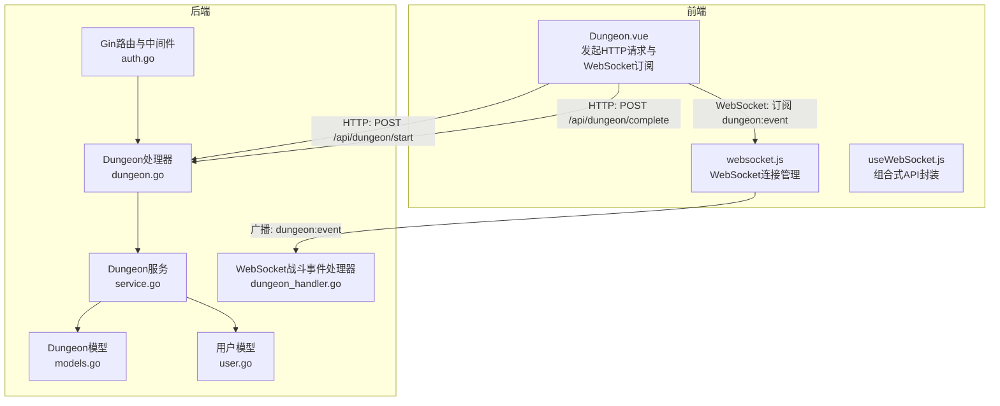
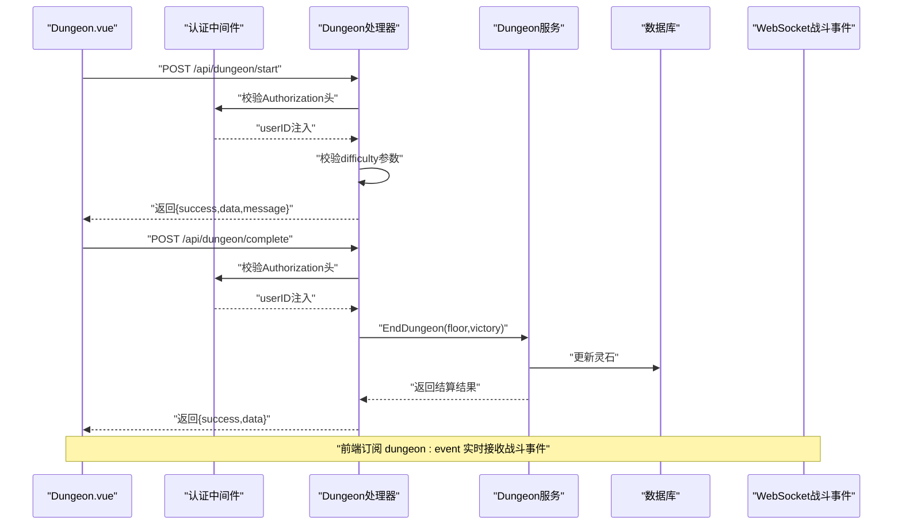
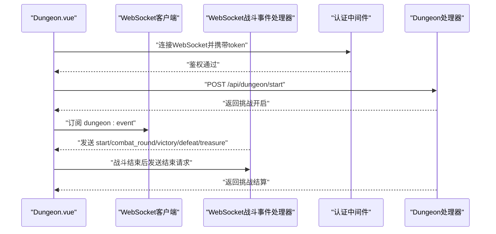
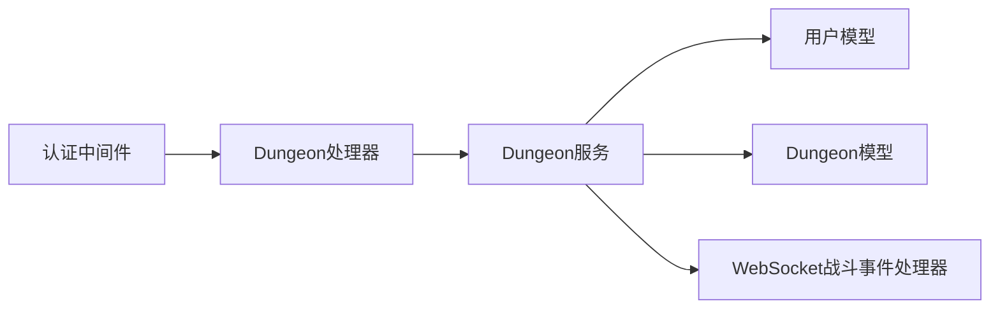

# 秘境系统接口

<cite>
**本文引用的文件**
- [server-go/internal/http/handlers/dungeon/dungeon.go](file://server-go/internal/http/handlers/dungeon/dungeon.go)
- [server-go/internal/dungeon/service.go](file://server-go/internal/dungeon/service.go)
- [server-go/internal/dungeon/models.go](file://server-go/internal/dungeon/models.go)
- [server-go/internal/http/middleware/auth.go](file://server-go/internal/http/middleware/auth.go)
- [server-go/internal/models/user.go](file://server-go/internal/models/user.go)
- [server-go/internal/websocket/dungeon_handler.go](file://server-go/internal/websocket/dungeon_handler.go)
- [src/views/Dungeon.vue](file://src/views/Dungeon.vue)
- [src/services/websocket.js](file://src/services/websocket.js)
- [src/composables/useWebSocket.js](file://src/composables/useWebSocket.js)
- [server-go/internal/models/equipment.go](file://server-go/internal/models/equipment.go)
</cite>

## 目录
1. [简介](#简介)
2. [项目结构](#项目结构)
3. [核心组件](#核心组件)
4. [架构总览](#架构总览)
5. [详细组件分析](#详细组件分析)
6. [依赖分析](#依赖分析)
7. [性能考虑](#性能考虑)
8. [故障排查指南](#故障排查指南)
9. [结论](#结论)
10. [附录](#附录)

## 简介
本文件聚焦于秘境系统的核心API，重点覆盖以下两个接口：
- POST /api/dungeon/start：开始挑战接口，用于开启秘境并初始化当前层数、难度与刷新次数。
- POST /api/dungeon/complete：完成挑战接口，用于结束秘境并结算奖励。

同时，文档说明请求参数（如难度、楼层）、响应内容（战斗结果、掉落与属性变更）、认证方式、冷却控制、状态校验（是否已在挑战中）、常见错误码（400参数错误、409状态冲突），并结合后端战斗逻辑与前端Dungeon.vue组件调用示例，解释如何通过WebSocket实时推送战斗日志。

## 项目结构
后端采用Go语言，按领域划分模块；前端采用Vue3，通过fetch调用后端REST接口，并通过WebSocket接收实时事件。

图表来源
- [server-go/internal/http/handlers/dungeon/dungeon.go](file://server-go/internal/http/handlers/dungeon/dungeon.go#L1-L276)
- [server-go/internal/dungeon/service.go](file://server-go/internal/dungeon/service.go#L1-L581)
- [server-go/internal/dungeon/models.go](file://server-go/internal/dungeon/models.go#L1-L136)
- [server-go/internal/http/middleware/auth.go](file://server-go/internal/http/middleware/auth.go#L1-L76)
- [server-go/internal/models/user.go](file://server-go/internal/models/user.go#L1-L48)
- [server-go/internal/websocket/dungeon_handler.go](file://server-go/internal/websocket/dungeon_handler.go#L1-L144)
- [src/views/Dungeon.vue](file://src/views/Dungeon.vue#L596-L800)
- [src/services/websocket.js](file://src/services/websocket.js#L1-L313)
- [src/composables/useWebSocket.js](file://src/composables/useWebSocket.js#L1-L319)

章节来源
- [server-go/internal/http/handlers/dungeon/dungeon.go](file://server-go/internal/http/handlers/dungeon/dungeon.go#L1-L276)
- [src/views/Dungeon.vue](file://src/views/Dungeon.vue#L596-L800)

## 核心组件
- 认证中间件：从Authorization头解析Bearer Token，校验JWT后将用户ID注入上下文，供路由处理器使用。
- Dungeon处理器：提供开始挑战、获取增益选项、选择增益、开始战斗、结束秘境等接口。
- Dungeon服务：负责战斗计算、增益应用、难度修正、奖励发放等业务逻辑。
- WebSocket战斗事件处理器：将战斗事件广播给指定用户，前端通过订阅实时接收。

章节来源
- [server-go/internal/http/middleware/auth.go](file://server-go/internal/http/middleware/auth.go#L1-L76)
- [server-go/internal/http/handlers/dungeon/dungeon.go](file://server-go/internal/http/handlers/dungeon/dungeon.go#L1-L276)
- [server-go/internal/dungeon/service.go](file://server-go/internal/dungeon/service.go#L1-L581)
- [server-go/internal/websocket/dungeon_handler.go](file://server-go/internal/websocket/dungeon_handler.go#L1-L144)

## 架构总览
后端通过Gin路由接收请求，经认证中间件校验后交由Dungeon处理器处理；处理器调用Dungeon服务执行业务逻辑，并可能通过WebSocket广播战斗事件。前端通过Dungeon.vue发起HTTP请求并订阅WebSocket事件，实现挑战流程与实时日志推送。

图表来源
- [server-go/internal/http/handlers/dungeon/dungeon.go](file://server-go/internal/http/handlers/dungeon/dungeon.go#L1-L276)
- [server-go/internal/dungeon/service.go](file://server-go/internal/dungeon/service.go#L558-L581)
- [server-go/internal/websocket/dungeon_handler.go](file://server-go/internal/websocket/dungeon_handler.go#L1-L144)

## 详细组件分析

### 接口：POST /api/dungeon/start
- 功能：开启秘境，返回当前层数、难度与刷新次数。
- 请求头
  - Authorization: Bearer <token>
- 请求体
  - difficulty: 字符串，必填，取值范围："easy" | "normal" | "hard" | "expert"
- 响应
  - success: 布尔
  - data: 包含 floor、difficulty、refreshCount
  - message: 字符串
- 错误
  - 400：请求参数错误（如JSON解析失败）
  - 401：未授权（缺少或无效的Authorization头）
  - 409：状态冲突（当前已在挑战中，需先结束挑战）

注意：当前后端实现中，/api/dungeon/start接口返回固定初始状态，未实现“已在挑战中”的状态校验与冷却控制。若需实现状态校验与冷却，可在处理器中引入会话状态与Redis缓存。

章节来源
- [server-go/internal/http/handlers/dungeon/dungeon.go](file://server-go/internal/http/handlers/dungeon/dungeon.go#L20-L66)

### 接口：POST /api/dungeon/complete
- 功能：结束秘境并结算奖励（灵石）。
- 请求头
  - Authorization: Bearer <token>
- 请求体
  - floor: 数字，层数
  - victory: 布尔，是否获胜
- 响应
  - success: 布尔
  - data: 包含 floor、totalReward、victory、spiritStones
  - message: 字符串
- 错误
  - 400：请求参数错误（如JSON解析失败）
  - 401：未授权（缺少或无效的Authorization头）
  - 500：内部错误（数据库更新失败）

章节来源
- [server-go/internal/http/handlers/dungeon/dungeon.go](file://server-go/internal/http/handlers/dungeon/dungeon.go#L229-L276)
- [server-go/internal/dungeon/service.go](file://server-go/internal/dungeon/service.go#L558-L581)

### 认证方式
- 使用JWT Bearer Token，从Authorization头读取。
- 服务器端校验JWT_SECRET环境变量与Token有效性，成功后将userID写入上下文。
- 所有Dungeon相关接口均依赖此中间件保护。

章节来源
- [server-go/internal/http/middleware/auth.go](file://server-go/internal/http/middleware/auth.go#L1-L76)
- [server-go/internal/http/handlers/dungeon/dungeon.go](file://server-go/internal/http/handlers/dungeon/dungeon.go#L1-L276)

### 冷却时间控制
- 当前后端未实现冷却时间控制。
- 建议方案：在Redis中以用户ID为Key，记录上次挑战结束时间；在开始挑战接口中检查冷却时间，未到期则返回409状态冲突。

章节来源
- [server-go/internal/http/handlers/dungeon/dungeon.go](file://server-go/internal/http/handlers/dungeon/dungeon.go#L20-L66)

### 状态校验（是否已在挑战中）
- 当前后端未实现“已在挑战中”的状态校验。
- 建议方案：在Redis中维护用户当前秘境状态（如floor、difficulty、refreshCount），开始挑战前检查是否存在有效状态；存在则返回409状态冲突。

章节来源
- [server-go/internal/http/handlers/dungeon/dungeon.go](file://server-go/internal/http/handlers/dungeon/dungeon.go#L20-L66)

### 常见错误
- 400 参数错误：请求体JSON解析失败或参数缺失/非法。
- 401 未授权：Authorization头缺失或无效。
- 409 状态冲突：已在挑战中或冷却未结束。
- 500 内部错误：数据库操作失败或服务异常。

章节来源
- [server-go/internal/http/handlers/dungeon/dungeon.go](file://server-go/internal/http/handlers/dungeon/dungeon.go#L1-L276)

### 前端调用示例（Dungeon.vue）
- 开始挑战：向 /api/dungeon/start 发起POST请求，携带 difficulty。
- 结束挑战：向 /api/dungeon/complete 发起POST请求，携带 floor 与 victory。
- WebSocket订阅：前端通过 useWebSocket.js 订阅 dungeon:event，实时接收战斗事件。

章节来源
- [src/views/Dungeon.vue](file://src/views/Dungeon.vue#L596-L800)
- [src/services/websocket.js](file://src/services/websocket.js#L1-L313)
- [src/composables/useWebSocket.js](file://src/composables/useWebSocket.js#L1-L319)

### WebSocket实时推送战斗日志
- 后端WebSocket战斗事件处理器支持广播战斗事件，事件类型包括 start、combat_round、victory、defeat、treasure。
- 前端通过 wsManager.on('dungeon:event', ...) 订阅，useDungeonCombat组合式API处理事件并更新战斗日志与状态。

图表来源
- [server-go/internal/websocket/dungeon_handler.go](file://server-go/internal/websocket/dungeon_handler.go#L1-L144)
- [src/services/websocket.js](file://src/services/websocket.js#L1-L313)
- [src/composables/useWebSocket.js](file://src/composables/useWebSocket.js#L1-L319)
- [server-go/internal/http/handlers/dungeon/dungeon.go](file://server-go/internal/http/handlers/dungeon/dungeon.go#L1-L276)

## 依赖分析
- 处理器依赖认证中间件获取userID。
- 处理器调用Dungeon服务执行业务逻辑。
- 服务层读取用户战斗属性与特殊属性，计算战斗结果并更新用户灵石。
- WebSocket战斗事件处理器通过连接管理器向指定用户推送事件。

图表来源
- [server-go/internal/http/middleware/auth.go](file://server-go/internal/http/middleware/auth.go#L1-L76)
- [server-go/internal/http/handlers/dungeon/dungeon.go](file://server-go/internal/http/handlers/dungeon/dungeon.go#L1-L276)
- [server-go/internal/dungeon/service.go](file://server-go/internal/dungeon/service.go#L1-L581)
- [server-go/internal/models/user.go](file://server-go/internal/models/user.go#L1-L48)
- [server-go/internal/dungeon/models.go](file://server-go/internal/dungeon/models.go#L1-L136)
- [server-go/internal/websocket/dungeon_handler.go](file://server-go/internal/websocket/dungeon_handler.go#L1-L144)

## 性能考虑
- 战斗计算在后端服务中完成，前端通过WebSocket接收事件，避免大量计算阻塞UI。
- WebSocket连接具备心跳与自动重连机制，保证实时性与稳定性。
- 建议对高频接口增加限流与缓存，减少数据库压力。

[本节为通用指导，无需引用具体文件]

## 故障排查指南
- 401 未授权
  - 检查Authorization头是否为Bearer Token，确认JWT_SECRET配置正确。
- 400 参数错误
  - 检查请求体JSON格式与字段类型，确认difficulty、floor、victory等参数合法。
- 409 状态冲突
  - 若已在挑战中或冷却未结束，需先结束挑战或等待冷却。
- 500 内部错误
  - 检查数据库连接与更新逻辑，关注服务日志。

章节来源
- [server-go/internal/http/middleware/auth.go](file://server-go/internal/http/middleware/auth.go#L1-L76)
- [server-go/internal/http/handlers/dungeon/dungeon.go](file://server-go/internal/http/handlers/dungeon/dungeon.go#L1-L276)

## 结论
- 当前后端已提供基础的秘境接口与WebSocket事件推送能力。
- 建议尽快补齐状态校验与冷却控制，以保障用户体验与系统稳定性。
- 前端可通过WebSocket实时接收战斗事件，配合Dungeon.vue实现流畅的挑战体验。

[本节为总结性内容，无需引用具体文件]

## 附录

### 数据模型与装备掉落说明
- 用户模型包含基础属性、战斗属性、特殊属性与灵石等字段，战斗结果会更新灵石。
- 装备模型包含装备ID、名称、类型、槽位、品质、强化等级、属性JSON等字段，可用于掉落装备的存储与查询。

章节来源
- [server-go/internal/models/user.go](file://server-go/internal/models/user.go#L1-L48)
- [server-go/internal/models/equipment.go](file://server-go/internal/models/equipment.go#L1-L34)

### 战斗逻辑与随机事件
- 战斗采用回合制，依据速度决定先后手，计算伤害与减免，支持暴击、连击、眩晕、反击、吸血等特效。
- 难度修饰符影响敌人属性与奖励倍率；奖励为灵石，失败时按比例扣减。
- 随机事件：当前后端未实现特殊事件触发机制，可在服务层扩展事件池与触发条件。

章节来源
- [server-go/internal/dungeon/service.go](file://server-go/internal/dungeon/service.go#L160-L489)

### 前端WebSocket集成要点
- 使用 wsManager.connect(token, userId) 建立连接。
- 通过 wsManager.on('dungeon:event', ...) 订阅战斗事件。
- 使用 useDungeonCombat 管理战斗日志与状态。

章节来源
- [src/services/websocket.js](file://src/services/websocket.js#L1-L313)
- [src/composables/useWebSocket.js](file://src/composables/useWebSocket.js#L1-L319)