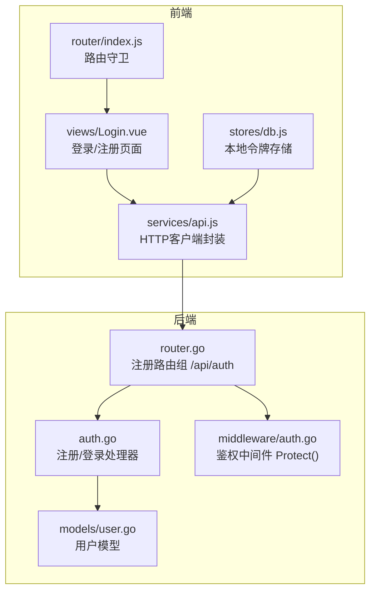
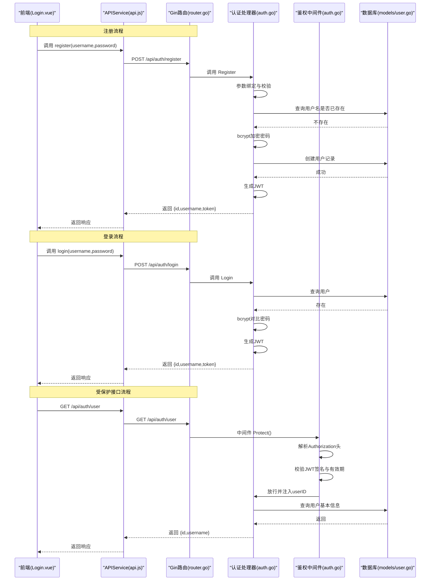
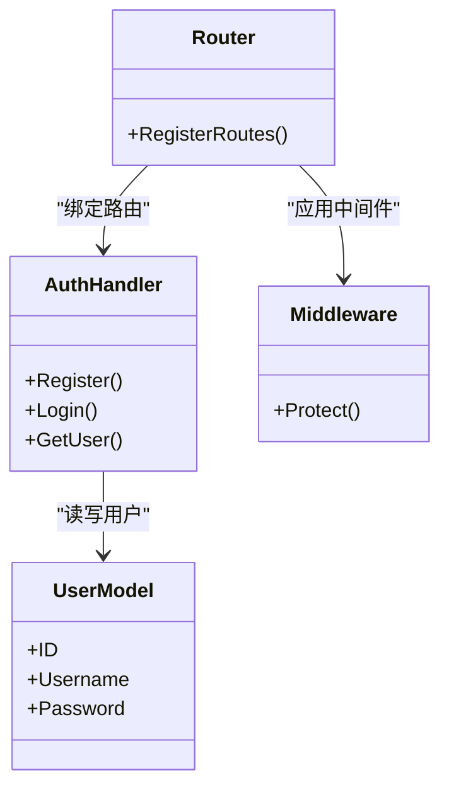

# 认证相关接口

<cite>
**本文引用的文件**
- [auth.go](file://server-go/internal/http/handlers/auth/auth.go)
- [router.go](file://server-go/internal/http/router/router.go)
- [auth.go](file://server-go/internal/http/middleware/auth.go)
- [user.go](file://server-go/internal/models/user.go)
- [Login.vue](file://src/views/Login.vue)
- [api.js](file://src/services/api.js)
- [db.js](file://src/stores/db.js)
- [index.js](file://src/router/index.js)
</cite>

## 目录
1. [简介](#简介)
2. [项目结构](#项目结构)
3. [核心组件](#核心组件)
4. [架构总览](#架构总览)
5. [详细组件分析](#详细组件分析)
6. [依赖关系分析](#依赖关系分析)
7. [性能考量](#性能考量)
8. [故障排查指南](#故障排查指南)
9. [结论](#结论)
10. [附录](#附录)

## 简介
本文件面向 xiuxian-go 的认证体系，聚焦于用户注册与登录流程，覆盖以下要点：
- 接口定义与行为：POST /api/auth/register、POST /api/auth/login
- 输入校验与错误处理：参数缺失、用户名冲突、凭据错误等
- 密码安全：bcrypt 哈希处理
- 令牌发放与验证：JWT 结构、有效期、中间件校验
- 路由保护：/api/auth 路由组是否启用中间件
- 前端集成：Login.vue 页面与 api.js 的调用方式
- curl 示例与响应样例：成功与常见错误（400、409 等）

## 项目结构
认证相关的核心代码分布在后端处理器、路由与中间件，以及前端登录页面与 API 服务层。

图表来源
- [router.go](file://server-go/internal/http/router/router.go#L23-L30)
- [auth.go](file://server-go/internal/http/handlers/auth/auth.go#L40-L180)
- [auth.go](file://server-go/internal/http/middleware/auth.go#L18-L75)
- [user.go](file://server-go/internal/models/user.go#L12-L42)
- [Login.vue](file://src/views/Login.vue#L1-L184)
- [api.js](file://src/services/api.js#L40-L90)
- [db.js](file://src/stores/db.js#L1-L22)
- [index.js](file://src/router/index.js#L1-L37)

章节来源
- [router.go](file://server-go/internal/http/router/router.go#L23-L30)
- [auth.go](file://server-go/internal/http/handlers/auth/auth.go#L40-L180)
- [auth.go](file://server-go/internal/http/middleware/auth.go#L18-L75)
- [user.go](file://server-go/internal/models/user.go#L12-L42)
- [Login.vue](file://src/views/Login.vue#L1-L184)
- [api.js](file://src/services/api.js#L40-L90)
- [db.js](file://src/stores/db.js#L1-L22)
- [index.js](file://src/router/index.js#L1-L37)

## 核心组件
- 注册处理器：接收用户名、密码，校验参数，检查重复用户名，bcrypt 加密密码，创建用户并发放 JWT
- 登录处理器：接收用户名、密码，校验参数，查找用户，bcrypt 对比密码，发放 JWT
- 鉴权中间件：从 Authorization 头解析 Bearer 令牌，校验签名与有效期，注入 userID 到上下文
- 路由组：/api/auth 下的注册、登录、用户信息接口
- 前端 API 封装：统一发起 /api/auth/* 请求，携带 Authorization 头
- 前端登录页：收集表单、调用 API、保存令牌、跳转首页

章节来源
- [auth.go](file://server-go/internal/http/handlers/auth/auth.go#L40-L180)
- [auth.go](file://server-go/internal/http/middleware/auth.go#L18-L75)
- [router.go](file://server-go/internal/http/router/router.go#L23-L30)
- [api.js](file://src/services/api.js#L40-L90)
- [Login.vue](file://src/views/Login.vue#L36-L145)

## 架构总览
认证流程涉及前后端交互与中间件拦截，整体序列如下：

图表来源
- [router.go](file://server-go/internal/http/router/router.go#L23-L30)
- [auth.go](file://server-go/internal/http/handlers/auth/auth.go#L40-L180)
- [auth.go](file://server-go/internal/http/middleware/auth.go#L18-L75)
- [user.go](file://server-go/internal/models/user.go#L12-L42)
- [api.js](file://src/services/api.js#L40-L90)
- [Login.vue](file://src/views/Login.vue#L36-L145)

## 详细组件分析

### 注册接口：POST /api/auth/register
- 请求体字段
  - username: 字符串，必填
  - password: 字符串，必填
- 行为与流程
  - 参数绑定失败：返回 400
  - 查询用户名是否已存在：若存在则返回 400（消息提示用户名已存在）
  - bcrypt 生成哈希：失败返回 500
  - 创建用户记录：失败返回 500
  - 生成 JWT：失败返回 500
  - 成功返回 201，包含 id、username、token
- 错误场景
  - 400：参数错误、用户名已存在
  - 500：密码加密失败、创建用户失败、生成令牌失败
- 响应样例
  - 成功：{"id": 123,"username":"test","token":"..."}
  - 400：{"message":"请求参数错误"}
  - 400：{"message":"用户名已存在"}
  - 500：{"message":"服务器错误","error":"..."}

章节来源
- [auth.go](file://server-go/internal/http/handlers/auth/auth.go#L40-L126)

### 登录接口：POST /api/auth/login
- 请求体字段
  - username: 字符串，必填
  - password: 字符串，必填
- 行为与流程
  - 参数绑定失败：返回 400
  - 查询用户：不存在返回 400
  - bcrypt 对比密码：失败返回 400
  - 生成 JWT：失败返回 500
  - 成功返回 200，包含 id、username、token
- 错误场景
  - 400：参数错误、用户名或密码错误
  - 500：生成令牌失败
- 响应样例
  - 成功：{"id": 123,"username":"test","token":"..."}
  - 400：{"message":"请求参数错误"}
  - 400：{"message":"用户名或密码错误"}
  - 500：{"message":"服务器错误","error":"..."}

章节来源
- [auth.go](file://server-go/internal/http/handlers/auth/auth.go#L128-L180)

### JWT 令牌发放与验证
- 令牌结构
  - 签名算法：HS256
  - 有效期：30 天
  - 声明：包含标准声明与自定义字段 id
- 生成与校验
  - 生成：从环境变量读取密钥，构建 claims 并签名
  - 校验：中间件从 Authorization: Bearer <token> 读取，校验签名与密钥配置
- 刷新机制
  - 后端未实现自动刷新；前端可在令牌即将到期前重新登录以获取新令牌

章节来源
- [auth.go](file://server-go/internal/http/handlers/auth/auth.go#L23-L38)
- [auth.go](file://server-go/internal/http/middleware/auth.go#L18-L75)

### 路由组与中间件保护
- /api/auth 路由组
  - POST /api/auth/register：公开
  - POST /api/auth/login：公开
  - GET /api/auth/user：受保护（需携带 Bearer 令牌）
- 其他受保护路由
  - /api/player/*：在 /api/player 分组上统一启用 Protect 中间件
  - /api/gacha/*、/api/exploration/*、/api/cultivation/*、/api/dungeon/*、/api/alchemy/*：均在各自分组上启用 Protect 中间件

章节来源
- [router.go](file://server-go/internal/http/router/router.go#L23-L30)
- [router.go](file://server-go/internal/http/router/router.go#L31-L125)

### 前端集成与调用
- 登录页面 Login.vue
  - 表单校验通过后，分别调用 APIService.register 或 APIService.login
  - 成功后保存 token 至本地存储，并设置用户 id
  - 跳转到首页
- API 封装 api.js
  - register/login 直接向 /api/auth/* 发起请求
  - getUser 显式携带 Authorization: Bearer token
  - 其他受保护接口在 headers 中自动附加 Authorization（若存在本地 token）
- 本地存储 db.js
  - 提供 setAuthToken/getAuthToken/clearAuthToken 简易存储
- 路由守卫 index.js
  - 未持有 token 时重定向到 /login

章节来源
- [Login.vue](file://src/views/Login.vue#L36-L145)
- [api.js](file://src/services/api.js#L40-L90)
- [db.js](file://src/stores/db.js#L1-L22)
- [index.js](file://src/router/index.js#L1-L37)

## 依赖关系分析
- 处理器依赖
  - auth.go 处理器依赖数据库模型 models.User 与 bcrypt、jwt、zap、gorm/datatypes
- 路由与中间件
  - router.go 将 /api/auth 下的接口与 auth 处理器绑定，并在 /api/auth/user 上应用 Protect 中间件
- 前端依赖
  - Login.vue 依赖 APIService 与本地存储 db.js
  - APIService 依赖 fetch 与路由前缀 /api

图表来源
- [router.go](file://server-go/internal/http/router/router.go#L23-L30)
- [auth.go](file://server-go/internal/http/handlers/auth/auth.go#L40-L180)
- [auth.go](file://server-go/internal/http/middleware/auth.go#L18-L75)
- [user.go](file://server-go/internal/models/user.go#L12-L42)

章节来源
- [router.go](file://server-go/internal/http/router/router.go#L23-L30)
- [auth.go](file://server-go/internal/http/handlers/auth/auth.go#L40-L180)
- [auth.go](file://server-go/internal/http/middleware/auth.go#L18-L75)
- [user.go](file://server-go/internal/models/user.go#L12-L42)

## 性能考量
- 密码哈希成本：bcrypt 默认成本较高，建议在生产环境评估服务器负载与并发峰值，必要时调整成本参数或优化数据库索引
- JWT 生成：HS256 为对称签名，计算开销低；注意密钥安全与轮换策略
- 中间件链路：Protect 中间件每次请求都会解析与校验令牌，建议在网关层或反向代理层做限流与缓存
- 数据库查询：用户名唯一索引可降低重复用户名检测的查询成本

## 故障排查指南
- 400 参数错误
  - 前端请求体缺少字段或类型不符
  - 后端 ShouldBindJSON 失败
- 400 用户名已存在
  - 注册时用户名已被占用
- 400 用户名或密码错误
  - 登录时用户不存在或密码不匹配
- 500 服务器错误
  - 密码加密失败、创建用户失败、生成令牌失败
- 401 未授权
  - 缺少 Authorization 头或令牌无效
  - JWT_SECRET 未配置或不正确
- 前端 token 丢失
  - 登录失败时前端会清理本地 token
  - 路由守卫会在无 token 时重定向到登录页

章节来源
- [auth.go](file://server-go/internal/http/handlers/auth/auth.go#L40-L180)
- [auth.go](file://server-go/internal/http/middleware/auth.go#L18-L75)
- [Login.vue](file://src/views/Login.vue#L36-L145)
- [api.js](file://src/services/api.js#L40-L90)
- [db.js](file://src/stores/db.js#L1-L22)
- [index.js](file://src/router/index.js#L1-L37)

## 结论
本认证体系以 Gin 路由与处理器为核心，配合 bcrypt 哈希与 HS256 JWT 实现了基础的注册、登录与受保护接口访问能力。前端通过 Login.vue 与 APIService 完成令牌的获取与传递，路由守卫保障未登录用户的访问约束。当前未实现自动刷新机制，建议在前端增加令牌过期检测与自动登录流程，以提升用户体验。

## 附录

### curl 调用示例
- 注册
  - curl -X POST http://localhost:8080/api/auth/register -H "Content-Type: application/json" -d '{"username":"test","password":"pass"}'
- 登录
  - curl -X POST http://localhost:8080/api/auth/login -H "Content-Type: application/json" -d '{"username":"test","password":"pass"}'
- 获取用户信息（受保护）
  - curl -X GET http://localhost:8080/api/auth/user -H "Authorization: Bearer YOUR_TOKEN"

### 响应样例
- 注册成功
  - HTTP/1.1 201 Created
  - {"id":123,"username":"test","token":"..."}
- 注册失败：参数错误
  - HTTP/1.1 400 Bad Request
  - {"message":"请求参数错误"}
- 注册失败：用户名已存在
  - HTTP/1.1 400 Bad Request
  - {"message":"用户名已存在"}
- 登录成功
  - HTTP/1.1 200 OK
  - {"id":123,"username":"test","token":"..."}
- 登录失败：凭据错误
  - HTTP/1.1 400 Bad Request
  - {"message":"用户名或密码错误"}
- 获取用户信息失败：未授权
  - HTTP/1.1 401 Unauthorized
  - {"message":"用户未授权"}