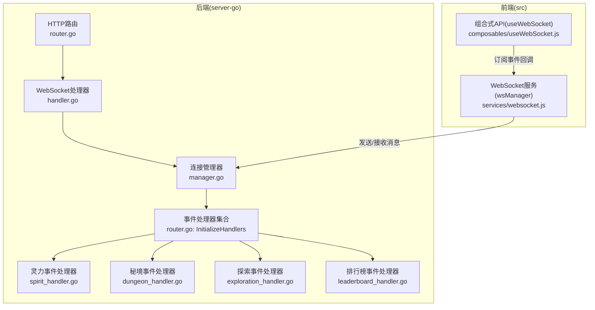
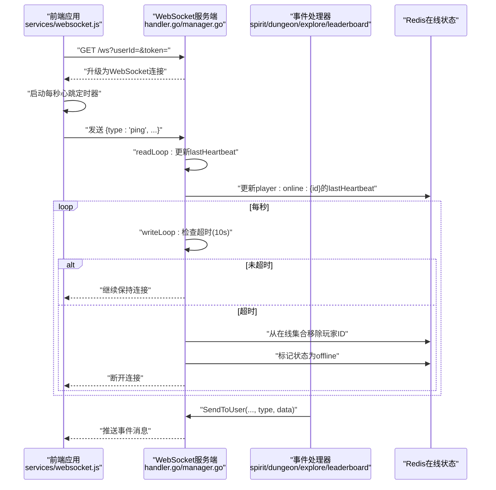
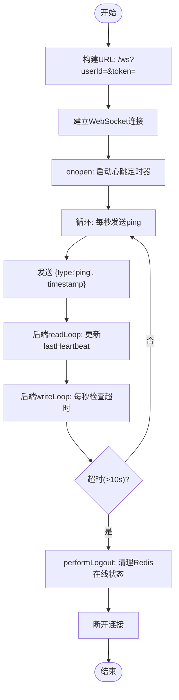
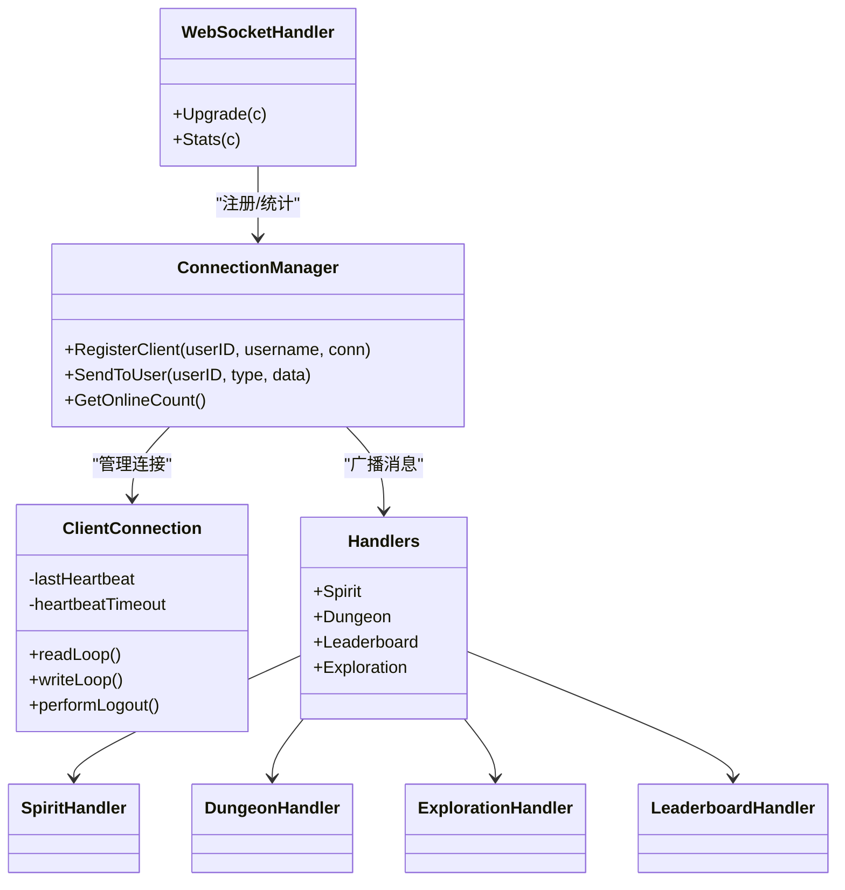

# WebSocket 实时通信接口

<cite>
**本文引用的文件**
- [server-go/internal/websocket/handler.go](file://server-go/internal/websocket/handler.go)
- [server-go/internal/websocket/router.go](file://server-go/internal/websocket/router.go)
- [server-go/internal/websocket/manager.go](file://server-go/internal/websocket/manager.go)
- [server-go/internal/websocket/spirit_handler.go](file://server-go/internal/websocket/spirit_handler.go)
- [server-go/internal/websocket/dungeon_handler.go](file://server-go/internal/websocket/dungeon_handler.go)
- [server-go/internal/websocket/exploration_handler.go](file://server-go/internal/websocket/exploration_handler.go)
- [server-go/internal/websocket/leaderboard_handler.go](file://server-go/internal/websocket/leaderboard_handler.go)
- [src/services/websocket.js](file://src/services/websocket.js)
- [src/composables/useWebSocket.js](file://src/composables/useWebSocket.js)
- [server-go/internal/http/handlers/online/online.go](file://server-go/internal/http/handlers/online/online.go)
- [server-go/internal/http/middleware/auth.go](file://server-go/internal/http/middleware/auth.go)
- [HEARTBEAT_AND_LOGOUT_GUIDE.md](file://HEARTBEAT_AND_LOGOUT_GUIDE.md)
</cite>

## 目录
1. [简介](#简介)
2. [项目结构](#项目结构)
3. [核心组件](#核心组件)
4. [架构总览](#架构总览)
5. [详细组件分析](#详细组件分析)
6. [依赖关系分析](#依赖关系分析)
7. [性能与可靠性](#性能与可靠性)
8. [故障排查与断线重连](#故障排查与断线重连)
9. [结论](#结论)

## 简介
本文件面向前端与后端开发者，系统性说明 xiuxian-go 的 WebSocket 实时通信机制。内容涵盖：
- 连接建立方式（含 userId 与 token 认证参数）
- 消息协议格式（JSON 结构）
- 支持的事件类型（如 spirit:grow、dungeon:event、exploration:event、leaderboard:update）及其数据结构
- 心跳保活策略：前端每秒发送 ping，后端 10 秒未收到则触发自动下线，并从 Redis 移除玩家在线状态
- 消息收发流程图、错误处理机制、断线重连策略（前端自动重连最多 5 次）

## 项目结构
WebSocket 相关代码主要分布在后端 server-go 的 websocket 包与前端 src 目录的服务层与组合式 API 层。

图表来源
- [server-go/internal/websocket/router.go](file://server-go/internal/websocket/router.go#L1-L36)
- [server-go/internal/websocket/handler.go](file://server-go/internal/websocket/handler.go#L1-L73)
- [server-go/internal/websocket/manager.go](file://server-go/internal/websocket/manager.go#L1-L120)
- [src/services/websocket.js](file://src/services/websocket.js#L1-L120)

章节来源
- [server-go/internal/websocket/router.go](file://server-go/internal/websocket/router.go#L1-L36)
- [server-go/internal/websocket/handler.go](file://server-go/internal/websocket/handler.go#L1-L73)
- [src/services/websocket.js](file://src/services/websocket.js#L1-L120)

## 核心组件
- WebSocket 路由与升级
  - 后端通过 HTTP GET /ws 接口升级为 WebSocket，并从查询参数读取 userId 与 token；随后注册连接并交由连接管理器维护。
- 连接管理器
  - 维护在线玩家映射、广播通道、注册/注销通道；为每个连接启动读循环与写循环；内置心跳保活与超时自动下线。
- 事件处理器
  - 灵力增长、秘境战斗、探索过程、排行榜更新四类事件处理器，负责构造消息并调用连接管理器发送给指定用户。
- 前端 WebSocket 管理器
  - 负责连接建立、心跳发送、消息分发、断线重连（最多 5 次，延迟递增）。

章节来源
- [server-go/internal/websocket/handler.go](file://server-go/internal/websocket/handler.go#L37-L73)
- [server-go/internal/websocket/manager.go](file://server-go/internal/websocket/manager.go#L1-L120)
- [server-go/internal/websocket/router.go](file://server-go/internal/websocket/router.go#L1-L36)
- [src/services/websocket.js](file://src/services/websocket.js#L1-L120)

## 架构总览
WebSocket 采用“HTTP 升级 + Gorilla WebSocket + 自定义消息协议”的模式，后端以连接管理器为中心，围绕心跳保活与事件广播展开。

图表来源
- [server-go/internal/websocket/handler.go](file://server-go/internal/websocket/handler.go#L37-L73)
- [server-go/internal/websocket/manager.go](file://server-go/internal/websocket/manager.go#L170-L256)
- [src/services/websocket.js](file://src/services/websocket.js#L160-L220)

## 详细组件分析

### 连接建立与认证
- 连接端点
  - 后端提供 GET /ws，用于将 HTTP 请求升级为 WebSocket。
- 认证参数
  - 查询参数 userId 与 token 必填；userId 需为合法整数；后端会记录用户名（若上下文存在）。
- 升级与注册
  - 升级成功后，后端调用连接管理器注册客户端，启动读写循环。

章节来源
- [server-go/internal/websocket/handler.go](file://server-go/internal/websocket/handler.go#L37-L73)
- [server-go/internal/websocket/router.go](file://server-go/internal/websocket/router.go#L8-L17)

### 消息协议格式
- 通用消息结构
  - 字段：type（消息类型）、userId（目标用户）、timestamp（时间戳）、data（具体业务数据，JSON 字节）
- 前端发送
  - 心跳消息：type 为 ping，携带 timestamp
- 后端推送
  - 灵力增长：type 为 spirit:grow
  - 秘境事件：type 为 dungeon:event
  - 探索事件：type 为 exploration:event
  - 排行榜更新：type 为 leaderboard:update

章节来源
- [server-go/internal/websocket/manager.go](file://server-go/internal/websocket/manager.go#L41-L60)
- [src/services/websocket.js](file://src/services/websocket.js#L160-L190)

### 事件类型与数据结构

#### 灵力增长（spirit:grow）
- 数据结构要点
  - userId、oldSpirit、newSpirit、gainAmount、spiritRate、elapsedSeconds、timestamp
- 发送场景
  - 后台任务计算灵力增长后，通过处理器广播给对应用户

章节来源
- [server-go/internal/websocket/spirit_handler.go](file://server-go/internal/websocket/spirit_handler.go#L18-L81)

#### 秘境事件（dungeon:event）
- 数据结构要点
  - userId、eventType（start/combat_round/victory/defeat/treasure）、dungeon、message、roundNum、playerHp、enemyHp、damageDealt、damageTaken、loot、timestamp
- 发送场景
  - 秘境战斗流程中，按阶段广播不同事件

章节来源
- [server-go/internal/websocket/dungeon_handler.go](file://server-go/internal/websocket/dungeon_handler.go#L9-L22)

#### 探索事件（exploration:event）
- 数据结构要点
  - userId、eventType（start/progress/discovery/complete/failure）、exploreName、message、progress、durationSecs、elapsedSecs、discovery、reward、errorMsg、timestamp
- 发送场景
  - 探索开始、进度推进、发现奖励、完成/失败等阶段

章节来源
- [server-go/internal/websocket/exploration_handler.go](file://server-go/internal/websocket/exploration_handler.go#L9-L21)

#### 排行榜更新（leaderboard:update）
- 数据结构要点
  - type（update/full_refresh/rank_up/rank_down）、category（spirit/power/level）、updateTime、top10、userRank(rank/value/percent)、timestamp
- 发送场景
  - 用户排名变化或全量刷新时推送

章节来源
- [server-go/internal/websocket/leaderboard_handler.go](file://server-go/internal/websocket/leaderboard_handler.go#L9-L17)

### 心跳保活与自动下线

#### 前端心跳策略
- 每秒发送一次 ping 消息，包含 timestamp
- 连接建立成功后启动心跳定时器；断开连接时停止

章节来源
- [src/services/websocket.js](file://src/services/websocket.js#L160-L205)

#### 后端心跳策略
- 读循环：收到 ping 后更新 lastHeartbeat，并延长读超时
- 写循环：每秒检查 lastHeartbeat 是否超过 10 秒
- 超时处理：异步执行 performLogout，清理 Redis 在线状态并断开连接

章节来源
- [server-go/internal/websocket/manager.go](file://server-go/internal/websocket/manager.go#L170-L256)
- [HEARTBEAT_AND_LOGOUT_GUIDE.md](file://HEARTBEAT_AND_LOGOUT_GUIDE.md#L1-L120)

#### Redis 在线状态管理
- 登录时初始化 player:online:{id} 哈希与 server:online:players 集合
- 心跳时更新 lastHeartbeat 字段
- 超时自动下线时从集合移除并标记 offline

章节来源
- [server-go/internal/http/handlers/online/online.go](file://server-go/internal/http/handlers/online/online.go#L71-L110)
- [server-go/internal/websocket/manager.go](file://server-go/internal/websocket/manager.go#L258-L309)

### 消息收发流程图

图表来源
- [src/services/websocket.js](file://src/services/websocket.js#L160-L220)
- [server-go/internal/websocket/manager.go](file://server-go/internal/websocket/manager.go#L170-L256)

## 依赖关系分析

图表来源
- [server-go/internal/websocket/router.go](file://server-go/internal/websocket/router.go#L1-L36)
- [server-go/internal/websocket/handler.go](file://server-go/internal/websocket/handler.go#L1-L73)
- [server-go/internal/websocket/manager.go](file://server-go/internal/websocket/manager.go#L1-L120)

章节来源
- [server-go/internal/websocket/router.go](file://server-go/internal/websocket/router.go#L1-L36)
- [server-go/internal/websocket/manager.go](file://server-go/internal/websocket/manager.go#L1-L120)

## 性能与可靠性
- 心跳检测周期
  - 前端每秒发送一次 ping；后端每秒检查一次 lastHeartbeat；超时阈值 10 秒。
- 消息队列
  - 广播通道与发送通道均具备容量，避免瞬时洪峰导致阻塞。
- 连接生命周期
  - 读循环设置读超时并配合 pongHandler；写循环定期检查超时并触发自动下线。
- 前端重连策略
  - 断线后最多重连 5 次，延迟按尝试次数递增。

章节来源
- [src/services/websocket.js](file://src/services/websocket.js#L1-L120)
- [server-go/internal/websocket/manager.go](file://server-go/internal/websocket/manager.go#L170-L256)

## 故障排查与断线重连

### 心跳与自动下线
- 现象
  - 若前端未持续发送 ping，后端将在 10 秒后自动下线并清理 Redis 在线状态。
- 排查要点
  - 检查前端心跳定时器是否启动与运行
  - 查看后端日志中“心跳超时”“自动下线”等关键信息
  - 确认 Redis 中 player:online:{id} 是否被移除

章节来源
- [HEARTBEAT_AND_LOGOUT_GUIDE.md](file://HEARTBEAT_AND_LOGOUT_GUIDE.md#L1-L120)
- [server-go/internal/websocket/manager.go](file://server-go/internal/websocket/manager.go#L222-L309)

### 断线重连策略
- 前端行为
  - 连接关闭且非主动断开时，按 3s × 尝试次数 的延迟进行最多 5 次重连
- 建议
  - 在页面初始化时先调用登录接口标记在线，再建立 WebSocket 连接
  - 监听 connection:open/close/error 事件，及时更新 UI 与日志

章节来源
- [src/services/websocket.js](file://src/services/websocket.js#L1-L120)
- [src/services/websocket.js](file://src/services/websocket.js#L207-L238)

### 认证与上游安全
- HTTP 接口使用 JWT 中间件保护，Authorization: Bearer <token> 校验通过后将 userID 写入上下文
- WebSocket 升级接口当前从查询参数读取 userId 与 token，建议在生产环境补充 JWT 校验逻辑

章节来源
- [server-go/internal/http/middleware/auth.go](file://server-go/internal/http/middleware/auth.go#L1-L76)
- [server-go/internal/websocket/handler.go](file://server-go/internal/websocket/handler.go#L37-L73)

## 结论
本 WebSocket 实时通信方案以 gorilla/websocket 为基础，结合自定义消息协议与事件处理器，实现了灵力增长、秘境战斗、探索过程与排行榜更新的实时推送。通过前后端协同的心跳保活与自动下线机制，确保了系统的稳定性与一致性。前端提供断线重连与事件订阅能力，便于在复杂业务场景中快速集成。