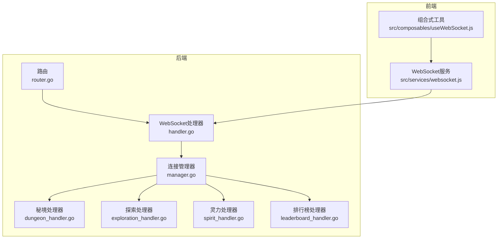
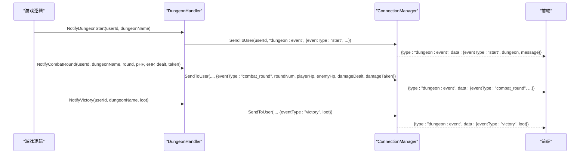
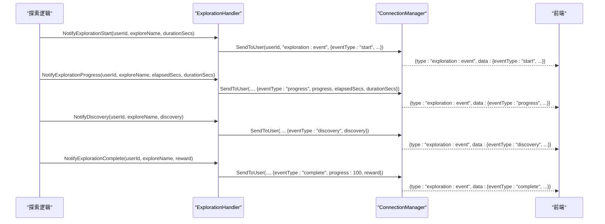
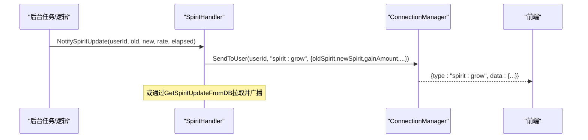
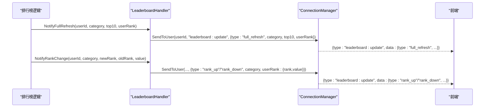
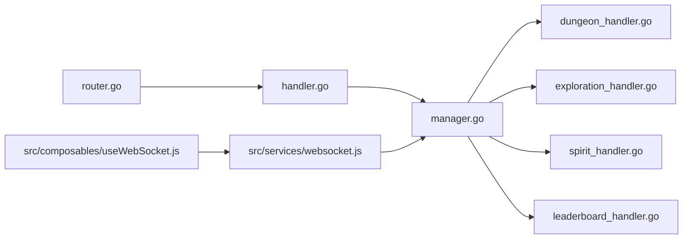

# 实时事件类型

<cite>
**本文引用的文件**
- [dungeon_handler.go](file://server-go/internal/websocket/dungeon_handler.go)
- [exploration_handler.go](file://server-go/internal/websocket/exploration_handler.go)
- [spirit_handler.go](file://server-go/internal/websocket/spirit_handler.go)
- [leaderboard_handler.go](file://server-go/internal/websocket/leaderboard_handler.go)
- [manager.go](file://server-go/internal/websocket/manager.go)
- [router.go](file://server-go/internal/websocket/router.go)
- [handler.go](file://server-go/internal/websocket/handler.go)
- [useWebSocket.js](file://src/composables/useWebSocket.js)
- [websocket.js](file://src/services/websocket.js)
</cite>

## 目录
1. [简介](#简介)
2. [项目结构](#项目结构)
3. [核心组件](#核心组件)
4. [架构总览](#架构总览)
5. [详细组件分析](#详细组件分析)
6. [依赖关系分析](#依赖关系分析)
7. [性能考量](#性能考量)
8. [故障排查指南](#故障排查指南)
9. [结论](#结论)
10. [附录](#附录)

## 简介
本文件系统化整理并文档化后端WebSocket支持的所有实时事件类型，覆盖以下处理器：
- 秘境事件处理器：dungeon_handler.go
- 探索事件处理器：exploration_handler.go
- 灵力事件处理器：spirit_handler.go
- 排行榜事件处理器：leaderboard_handler.go

文档逐项列出每种事件的type字符串、触发条件、data字段的完整结构定义与示例说明，并提供前端订阅与处理要点，帮助开发者准确订阅与处理这些事件。

## 项目结构
WebSocket相关后端位于 server-go/internal/websocket，前端位于 src/services 与 src/composables。整体采用“处理器-管理器-路由”的分层组织，处理器负责按业务场景构造事件并广播，管理器负责连接生命周期与消息投递，路由负责HTTP升级与处理器初始化。



图表来源
- [router.go](file://server-go/internal/websocket/router.go#L1-L36)
- [handler.go](file://server-go/internal/websocket/handler.go#L1-L100)
- [manager.go](file://server-go/internal/websocket/manager.go#L1-L309)
- [dungeon_handler.go](file://server-go/internal/websocket/dungeon_handler.go#L1-L144)
- [exploration_handler.go](file://server-go/internal/websocket/exploration_handler.go#L1-L149)
- [spirit_handler.go](file://server-go/internal/websocket/spirit_handler.go#L1-L122)
- [leaderboard_handler.go](file://server-go/internal/websocket/leaderboard_handler.go#L1-L137)
- [websocket.js](file://src/services/websocket.js#L1-L313)
- [useWebSocket.js](file://src/composables/useWebSocket.js#L1-L319)

章节来源
- [router.go](file://server-go/internal/websocket/router.go#L1-L36)
- [handler.go](file://server-go/internal/websocket/handler.go#L1-L100)
- [manager.go](file://server-go/internal/websocket/manager.go#L1-L309)

## 核心组件
- 连接管理器 ConnectionManager：维护在线用户映射、广播通道、注册/注销流程、心跳与下线处理。
- WebSocket处理器 WebSocketHandler：HTTP升级为WebSocket、参数校验、注册连接。
- 事件处理器 Handlers：集中初始化各业务处理器（秘境、探索、灵力、排行榜）。
- 前端WebSocket服务 wsManager：封装连接、订阅、心跳、重连、消息分发。

章节来源
- [manager.go](file://server-go/internal/websocket/manager.go#L1-L309)
- [handler.go](file://server-go/internal/websocket/handler.go#L1-L100)
- [router.go](file://server-go/internal/websocket/router.go#L1-L36)
- [websocket.js](file://src/services/websocket.js#L1-L313)

## 架构总览
后端通过路由注册WebSocket端点，处理器在升级时将用户身份注入连接管理器；业务处理器根据业务事件构造消息并通过管理器投递给指定用户；前端通过wsManager订阅对应type并处理data。

```mermaid
sequenceDiagram
participant FE as "前端应用"
participant WSJS as "前端wsManager<br/>websocket.js"
participant HTTP as "HTTP路由<br/>router.go"
participant WSH as "WebSocket处理器<br/>handler.go"
participant CM as "连接管理器<br/>manager.go"
participant DH as "秘境处理器<br/>dungeon_handler.go"
participant EH as "探索处理器<br/>exploration_handler.go"
participant SH as "灵力处理器<br/>spirit_handler.go"
participant LH as "排行榜处理器<br/>leaderboard_handler.go"
FE->>WSJS : 初始化并调用connect(userId, token)
WSJS->>HTTP : GET /ws?userId=&token=
HTTP->>WSH : Upgrade()
WSH->>CM : RegisterClient(userId, username, conn)
CM-->>FE : 连接成功(心跳开始)
Note over DH,EH,SH,LH : 业务事件发生时
DH->>CM : SendToUser(userId, "dungeon : event", data)
EH->>CM : SendToUser(userId, "exploration : event", data)
SH->>CM : SendToUser(userId, "spirit : grow", data)
LH->>CM : SendToUser(userId, "leaderboard : update", data)
CM-->>FE : 推送消息 {type, data, timestamp}
FE->>WSJS : onmessage 分发到对应订阅者
```

图表来源
- [router.go](file://server-go/internal/websocket/router.go#L1-L36)
- [handler.go](file://server-go/internal/websocket/handler.go#L1-L100)
- [manager.go](file://server-go/internal/websocket/manager.go#L1-L309)
- [dungeon_handler.go](file://server-go/internal/websocket/dungeon_handler.go#L1-L144)
- [exploration_handler.go](file://server-go/internal/websocket/exploration_handler.go#L1-L149)
- [spirit_handler.go](file://server-go/internal/websocket/spirit_handler.go#L1-L122)
- [leaderboard_handler.go](file://server-go/internal/websocket/leaderboard_handler.go#L1-L137)
- [websocket.js](file://src/services/websocket.js#L1-L313)

## 详细组件分析

### 秘境事件（dungeon_handler.go）
- 类型字符串：dungeon:event
- 事件类型（eventType）：
  - start：秘境开始
  - combat_round：战斗轮次
  - victory：战胜
  - defeat：战败
  - treasure：发现宝藏
- data字段结构（DungeonEvent）：
  - userId: uint
  - eventType: string
  - dungeon: string（秘境名称）
  - message: string（提示消息）
  - roundNum: int（战斗轮数，combat_round时有效）
  - playerHp: float64（玩家剩余血量，combat_round时有效）
  - enemyHp: float64（敌人剩余血量，combat_round时有效）
  - damageDealt: float64（造成的伤害，combat_round时有效）
  - damageTaken: float64（承受的伤害，combat_round时有效）
  - loot: interface{}（战利品，victory/treasure时有效）
  - timestamp: int64
- 触发条件与示例说明：
  - start：进入秘境时推送，包含秘境名称与开始消息。
  - combat_round：每轮战斗推进时推送，包含双方血量、伤害、轮数等。
  - victory：挑战胜利时推送，包含奖励战利品。
  - defeat：挑战失败时推送，包含失败提示。
  - treasure：发现宝箱时推送，包含宝物奖励。
- 前端订阅与处理要点：
  - 订阅方式：wsManager.on("dungeon:event", callback)
  - 处理建议：根据eventType切换UI状态（如“战斗中”、“胜利”、“失败”），展示伤害与血量变化，显示战利品。
  - 参考路径：[订阅战斗事件](file://src/composables/useWebSocket.js#L45-L73)，[消息分发](file://src/services/websocket.js#L102-L128)



图表来源
- [dungeon_handler.go](file://server-go/internal/websocket/dungeon_handler.go#L1-L144)
- [manager.go](file://server-go/internal/websocket/manager.go#L137-L153)
- [websocket.js](file://src/services/websocket.js#L102-L128)

章节来源
- [dungeon_handler.go](file://server-go/internal/websocket/dungeon_handler.go#L1-L144)
- [useWebSocket.js](file://src/composables/useWebSocket.js#L45-L73)
- [websocket.js](file://src/services/websocket.js#L102-L128)

### 探索事件（exploration_handler.go）
- 类型字符串：exploration:event
- 事件类型（eventType）：
  - start：探索开始
  - progress：探索进度
  - discovery：发现内容
  - complete：探索完成
  - failure：探索失败
- data字段结构（ExplorationEvent）：
  - userId: uint
  - eventType: string
  - exploreName: string（探索地点名称）
  - message: string（提示消息）
  - progress: int（进度百分比，progress/complete时有效）
  - durationSecs: int（持续时间秒，start/progress时有效）
  - elapsedSecs: int（已用时间秒，progress时有效）
  - discovery: interface{}（发现内容，discovery时有效）
  - reward: interface{}（奖励，complete时有效）
  - errorMsg: string（失败原因，failure时有效）
  - timestamp: int64
- 触发条件与示例说明：
  - start：开始探索时推送，包含探索地点与总时长。
  - progress：定时或阶段性推送，包含进度百分比与耗时。
  - discovery：探索过程中发现物品/资源时推送，多次推送可使用NotifyMultipleDiscoveries。
  - complete：探索完成时推送，包含最终奖励与100%进度。
  - failure：探索失败时推送，包含失败原因。
- 前端订阅与处理要点：
  - 订阅方式：wsManager.on("exploration:event", callback)
  - 处理建议：根据eventType更新进度条、展示发现列表、显示奖励与失败提示。
  - 参考路径：[订阅探索事件](file://src/composables/useWebSocket.js#L65-L73)，[消息分发](file://src/services/websocket.js#L102-L128)



图表来源
- [exploration_handler.go](file://server-go/internal/websocket/exploration_handler.go#L1-L149)
- [manager.go](file://server-go/internal/websocket/manager.go#L137-L153)
- [websocket.js](file://src/services/websocket.js#L102-L128)

章节来源
- [exploration_handler.go](file://server-go/internal/websocket/exploration_handler.go#L1-L149)
- [useWebSocket.js](file://src/composables/useWebSocket.js#L65-L73)
- [websocket.js](file://src/services/websocket.js#L102-L128)

### 灵力事件（spirit_handler.go）
- 类型字符串：spirit:grow
- 事件类型（eventType）：无（该处理器固定推送“spirit:grow”）
- data字段结构（SpiritGrowthEvent）：
  - userId: uint
  - oldSpirit: float64（旧灵力值）
  - newSpirit: float64（新灵力值）
  - gainAmount: float64（本次增长量）
  - spiritRate: float64（灵力增长速率）
  - elapsedSeconds: float64（自上次增长以来的秒数）
  - timestamp: int64
- 触发条件与示例说明：
  - 当后台检测到用户灵力有增长时推送（内部会过滤无增长的情况）。
  - 可由后台任务触发，或通过GetSpiritUpdateFromDB拉取当前灵力值并广播。
- 前端订阅与处理要点：
  - 订阅方式：wsManager.on("spirit:grow", callback)
  - 处理建议：更新当前灵力值、累计增长总量、展示增长速率与耗时。
  - 参考路径：[订阅灵力增长](file://src/composables/useWebSocket.js#L35-L44)，[消息分发](file://src/services/websocket.js#L102-L128)



图表来源
- [spirit_handler.go](file://server-go/internal/websocket/spirit_handler.go#L1-L122)
- [manager.go](file://server-go/internal/websocket/manager.go#L137-L153)
- [websocket.js](file://src/services/websocket.js#L102-L128)

章节来源
- [spirit_handler.go](file://server-go/internal/websocket/spirit_handler.go#L1-L122)
- [useWebSocket.js](file://src/composables/useWebSocket.js#L35-L44)
- [websocket.js](file://src/services/websocket.js#L102-L128)

### 排行榜事件（leaderboard_handler.go）
- 类型字符串：leaderboard:update
- 事件类型（type）：
  - full_refresh：完整刷新（用户上线或首次加载）
  - update：仅更新用户排行信息
  - rank_up/rank_down：排名变化（由NotifyRankChange派生）
- data字段结构（LeaderboardUpdate）：
  - type: string（full_refresh/update/rank_up/rank_down）
  - category: string（spirit/power/level）
  - updateTime: int64（更新时间戳）
  - top10: []LeaderboardEntry（前三十或更多，full_refresh时提供）
  - userRank: *UserRankInfo（用户当前排名信息，可能为空则表示不在Top）
  - timestamp: int64
- LeaderboardEntry：
  - rank: int
  - userId: uint
  - username: string
  - spirit: float64
  - power: float64
  - level: int
  - avatarUrl: string
- UserRankInfo：
  - rank: int
  - value: float64
  - percent: float64（超越百分比）
- 触发条件与示例说明：
  - full_refresh：用户上线或首次加载时推送完整Top10与自身排名。
  - update：仅推送用户当前排名变化（如提升或下降）。
  - rank_up/rank_down：当用户排名相对上次发生变化时推送。
  - 提供便捷方法：NotifySpiritLeaderboardUpdate、NotifyPowerLeaderboardUpdate、NotifyLevelLeaderboardUpdate。
- 前端订阅与处理要点：
  - 订阅方式：wsManager.on("leaderboard:update", callback)
  - 处理建议：根据type决定是否替换Top10或仅更新userRank；计算并展示超越百分比。
  - 参考路径：[订阅排行榜](file://src/composables/useWebSocket.js#L55-L64)，[消息分发](file://src/services/websocket.js#L102-L128)



图表来源
- [leaderboard_handler.go](file://server-go/internal/websocket/leaderboard_handler.go#L1-L137)
- [manager.go](file://server-go/internal/websocket/manager.go#L137-L153)
- [websocket.js](file://src/services/websocket.js#L102-L128)

章节来源
- [leaderboard_handler.go](file://server-go/internal/websocket/leaderboard_handler.go#L1-L137)
- [useWebSocket.js](file://src/composables/useWebSocket.js#L55-L64)
- [websocket.js](file://src/services/websocket.js#L102-L128)

## 依赖关系分析
- 后端依赖链：
  - router.go -> handler.go -> manager.go
  - manager.go -> 各业务处理器（dungeon_handler.go、exploration_handler.go、spirit_handler.go、leaderboard_handler.go）
- 前端依赖链：
  - useWebSocket.js -> websocket.js -> handler.go（通过type字符串匹配）
- 关键耦合点：
  - type字符串在前后端需保持一致（dungeon:event、exploration:event、spirit:grow、leaderboard:update）
  - manager.go的SendToUser统一负责消息序列化与投递



图表来源
- [router.go](file://server-go/internal/websocket/router.go#L1-L36)
- [handler.go](file://server-go/internal/websocket/handler.go#L1-L100)
- [manager.go](file://server-go/internal/websocket/manager.go#L1-L309)
- [dungeon_handler.go](file://server-go/internal/websocket/dungeon_handler.go#L1-L144)
- [exploration_handler.go](file://server-go/internal/websocket/exploration_handler.go#L1-L149)
- [spirit_handler.go](file://server-go/internal/websocket/spirit_handler.go#L1-L122)
- [leaderboard_handler.go](file://server-go/internal/websocket/leaderboard_handler.go#L1-L137)
- [websocket.js](file://src/services/websocket.js#L1-L313)
- [useWebSocket.js](file://src/composables/useWebSocket.js#L1-L319)

章节来源
- [router.go](file://server-go/internal/websocket/router.go#L1-L36)
- [handler.go](file://server-go/internal/websocket/handler.go#L1-L100)
- [manager.go](file://server-go/internal/websocket/manager.go#L1-L309)
- [websocket.js](file://src/services/websocket.js#L1-L313)

## 性能考量
- 事件节流与限频：
  - 秘境连续轮次广播时内置约间隔，避免事件过于密集。
  - 探索多次发现时内置约间隔，避免事件风暴。
- 广播通道容量：
  - broadcast通道容量为256，send通道容量为64，建议前端及时消费，避免阻塞。
- 心跳与下线：
  - 后端每秒检查心跳，超时自动下线并清理Redis在线状态，减少无效连接占用。
- 建议：
  - 前端对高频事件（如战斗轮次、探索进度）做去抖/节流渲染。
  - 后端对同一用户短时间内重复事件做合并或去重策略（可扩展）。

章节来源
- [dungeon_handler.go](file://server-go/internal/websocket/dungeon_handler.go#L133-L144)
- [exploration_handler.go](file://server-go/internal/websocket/exploration_handler.go#L135-L149)
- [manager.go](file://server-go/internal/websocket/manager.go#L1-L309)

## 故障排查指南
- 连接问题：
  - 检查升级端点与查询参数（userId/token）是否正确传递。
  - 查看连接统计接口与日志，确认在线人数与连接状态。
- 订阅问题：
  - 确认前端订阅的type与后端推送一致（大小写与拼写）。
  - 检查onmessage回调是否正确接收并处理data与meta（userId、timestamp）。
- 心跳与掉线：
  - 若出现频繁断线，检查心跳发送频率与超时阈值，确认网络稳定性。
  - 后端心跳超时会触发自动下线，前端应实现重连策略。
- 日志定位：
  - 后端处理器与管理器均记录关键事件与错误，便于定位广播失败、序列化失败等问题。

章节来源
- [handler.go](file://server-go/internal/websocket/handler.go#L1-L100)
- [manager.go](file://server-go/internal/websocket/manager.go#L1-L309)
- [websocket.js](file://src/services/websocket.js#L1-L313)

## 结论
本文档系统梳理了后端WebSocket支持的四种实时事件类型及其data结构，明确了触发条件与前端订阅处理方式。通过统一的type字符串与标准化的消息格式，前后端能够稳定协作，实现实时交互体验。建议在实际开发中遵循本文档的字段规范与处理建议，确保事件的正确性与性能表现。

## 附录
- 前端监听代码片段（路径引用）：
  - 订阅灵力增长：[subscribeSpiritGrowth](file://src/services/websocket.js#L270-L275)
  - 订阅战斗事件：[subscribeDungeonEvent](file://src/services/websocket.js#L276-L281)
  - 订阅排行榜更新：[subscribeLeaderboardUpdate](file://src/services/websocket.js#L283-L288)
  - 订阅探索事件：[subscribeExplorationEvent](file://src/services/websocket.js#L290-L295)
  - 组合式订阅封装：[useWebSocket订阅](file://src/composables/useWebSocket.js#L35-L73)
- 后端事件构造与广播（路径引用）：
  - 秘境事件：[NotifyDungeonStart/NotifyCombatRound/NotifyVictory/NotifyDefeat/NotifyTreasure](file://server-go/internal/websocket/dungeon_handler.go#L60-L131)
  - 探索事件：[NotifyExplorationStart/NotifyExplorationProgress/NotifyDiscovery/NotifyExplorationComplete/NotifyExplorationFailure](file://server-go/internal/websocket/exploration_handler.go#L60-L133)
  - 灵力事件：[NotifySpiritUpdate/GetSpiritUpdateFromDB](file://server-go/internal/websocket/spirit_handler.go#L63-L114)
  - 排行榜事件：[NotifyRankChange/NotifyFullRefresh/分类便捷方法](file://server-go/internal/websocket/leaderboard_handler.go#L70-L120)