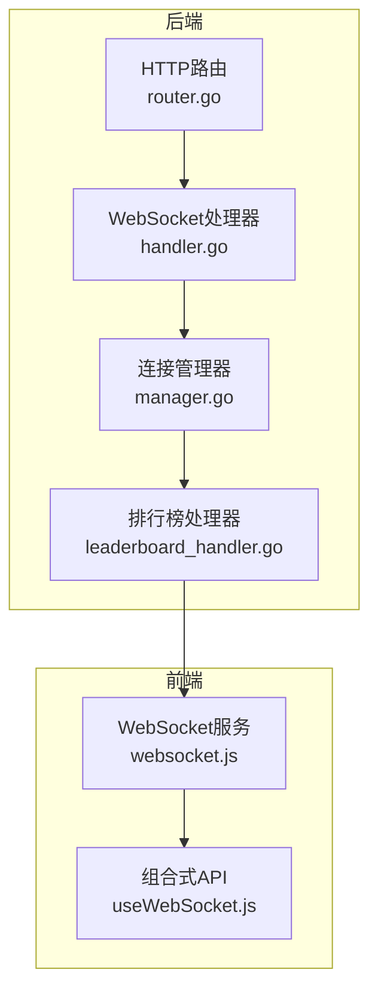
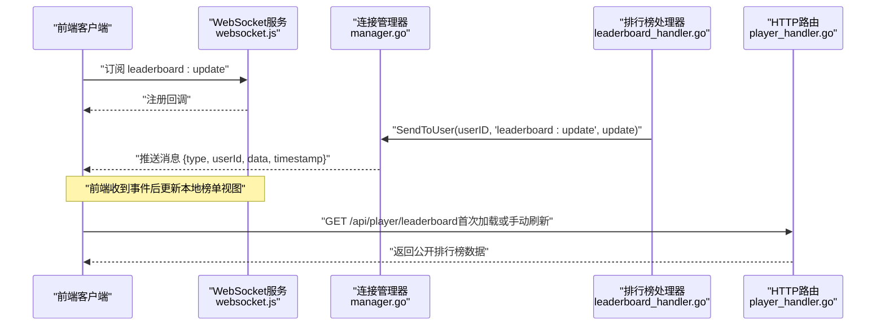
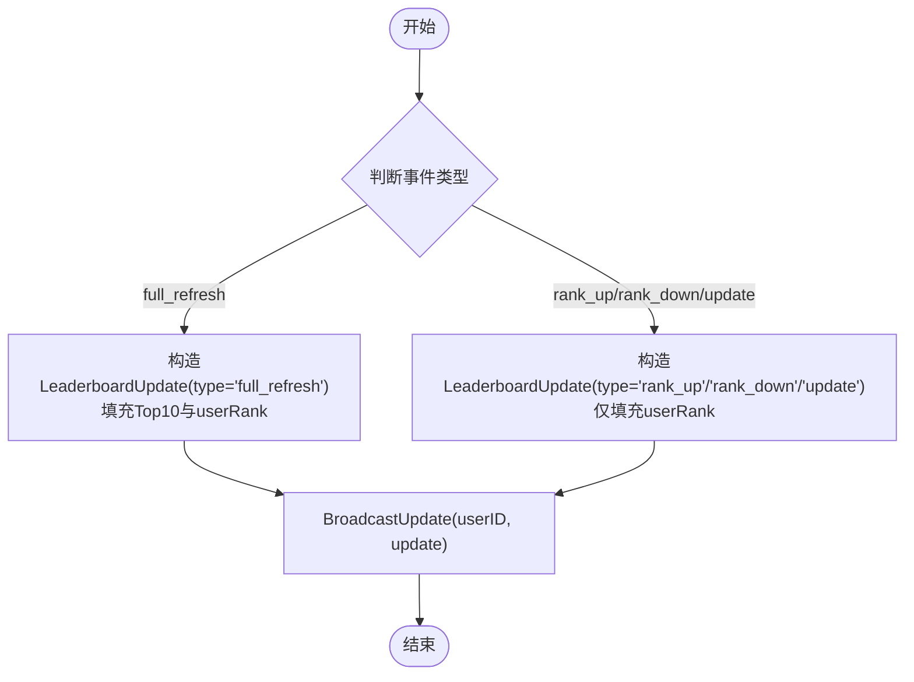
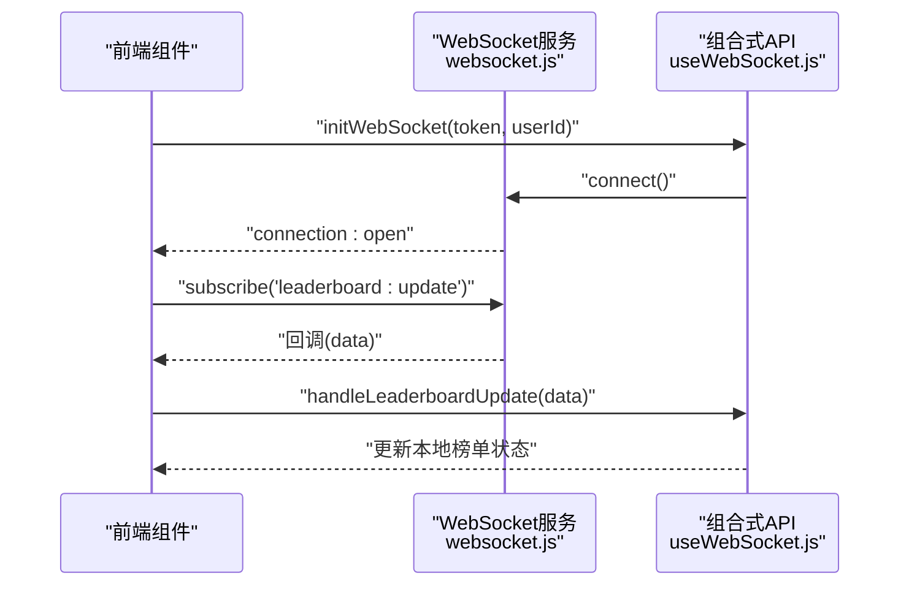
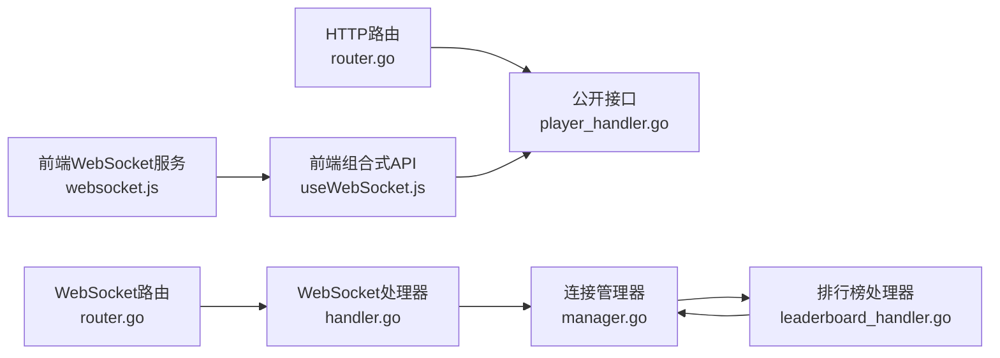

# 排行榜事件

<cite>
**本文引用的文件**
- [leaderboard_handler.go](file://server-go/internal/websocket/leaderboard_handler.go)
- [manager.go](file://server-go/internal/websocket/manager.go)
- [handler.go](file://server-go/internal/websocket/handler.go)
- [router.go](file://server-go/internal/websocket/router.go)
- [websocket.js](file://src/services/websocket.js)
- [useWebSocket.js](file://src/composables/useWebSocket.js)
- [WebSocket实现快速开始.md](file://WebSocket实现快速开始.md)
- [WebSocket改造完整实现指南.md](file://WebSocket改造完整实现指南.md)
- [player_handler.go](file://server-go/internal/http/handlers/player/player_handler.go)
- [router.go](file://server-go/internal/http/router/router.go)
</cite>

## 目录
1. [简介](#简介)
2. [项目结构](#项目结构)
3. [核心组件](#核心组件)
4. [架构总览](#架构总览)
5. [详细组件分析](#详细组件分析)
6. [依赖关系分析](#依赖关系分析)
7. [性能考虑](#性能考虑)
8. [故障排查指南](#故障排查指南)
9. [结论](#结论)
10. [附录](#附录)

## 简介
本文件系统化整理并文档化排行榜相关的WebSocket实时事件类型，围绕后端LeaderboardUpdate结构与相关方法，详细说明事件类型“update”、“rank_up”、“rank_down”和“full_refresh”的分类语义，以及按“spirit”、“power”、“level”三类别的数据推送机制。文档还解释Top10排行榜条目与UserRank用户排名信息的结构定义，说明NotifyRankChange与NotifyFullRefresh等方法的调用时机（如用户上线或排名变动），并提供前端监听示例（订阅“leaderboard:update”频道）、性能优化建议（如避免频繁刷新），同时指出BroadcastToAllOnline方法尚需实现遍历在线用户的功能，为开发者提供完整的排行榜实时更新集成方案。

## 项目结构
后端采用分层架构：HTTP路由负责公开接口，WebSocket路由负责升级HTTP为WebSocket；WebSocket层包含连接管理器、处理器与事件处理器（含排行榜处理器）。前端通过独立的服务与组合式API封装WebSocket连接、订阅与状态管理。

图表来源
- [router.go](file://server-go/internal/http/router/router.go#L1-L126)
- [handler.go](file://server-go/internal/websocket/handler.go#L1-L100)
- [manager.go](file://server-go/internal/websocket/manager.go#L1-L309)
- [leaderboard_handler.go](file://server-go/internal/websocket/leaderboard_handler.go#L1-L137)
- [websocket.js](file://src/services/websocket.js#L1-L313)
- [useWebSocket.js](file://src/composables/useWebSocket.js#L1-L319)

章节来源
- [router.go](file://server-go/internal/http/router/router.go#L1-L126)
- [handler.go](file://server-go/internal/websocket/handler.go#L1-L100)
- [manager.go](file://server-go/internal/websocket/manager.go#L1-L309)
- [leaderboard_handler.go](file://server-go/internal/websocket/leaderboard_handler.go#L1-L137)
- [websocket.js](file://src/services/websocket.js#L1-L313)
- [useWebSocket.js](file://src/composables/useWebSocket.js#L1-L319)

## 核心组件
- LeaderboardUpdate：排行榜实时事件的数据载体，包含事件类型、类别、更新时间、Top10榜单、用户当前排名信息与时间戳。
- LeaderboardEntry：榜单条目，包含排名、用户ID、用户名、灵力、战力、等级、头像URL。
- UserRankInfo：用户当前排名信息，包含排名、数值、超越百分比。
- LeaderboardHandler：排行榜事件处理器，提供通知与广播方法，包括按类别触发完整刷新与排名变化通知。
- ConnectionManager：WebSocket连接管理器，负责注册/注销连接、广播消息至指定用户、维护在线用户映射。
- WebSocketManager（前端）：负责连接、心跳、消息分发与订阅管理，前端通过订阅“leaderboard:update”接收实时事件。

章节来源
- [leaderboard_handler.go](file://server-go/internal/websocket/leaderboard_handler.go#L1-L137)
- [manager.go](file://server-go/internal/websocket/manager.go#L1-L309)
- [websocket.js](file://src/services/websocket.js#L1-L313)

## 架构总览
后端通过HTTP路由暴露公开接口，WebSocket路由负责升级连接并交由连接管理器统一管理。排行榜事件由LeaderboardHandler构造LeaderboardUpdate并通过SendToUser定向推送到指定用户。前端通过WebSocket服务订阅“leaderboard:update”，并在组合式API中聚合不同类别的榜单数据。

图表来源
- [leaderboard_handler.go](file://server-go/internal/websocket/leaderboard_handler.go#L51-L105)
- [manager.go](file://server-go/internal/websocket/manager.go#L137-L153)
- [websocket.js](file://src/services/websocket.js#L130-L170)
- [player_handler.go](file://server-go/internal/http/handlers/player/player_handler.go#L188-L210)

## 详细组件分析

### LeaderboardUpdate结构与事件类型
- 结构字段
  - type：事件类型，取值范围包括“update”、“rank_up”、“rank_down”、“full_refresh”。
  - category：排行榜类别，取值“spirit”、“power”、“level”。
  - updateTime：服务端记录的更新时间戳。
  - top10：Top10榜单条目数组，用于完整刷新场景。
  - userRank：用户当前排名信息，包含rank、value、percent。
  - timestamp：消息发出的时间戳。
- 事件类型语义
  - full_refresh：完整刷新，通常在用户上线或首次加载时触发，携带完整的Top10与userRank。
  - update：增量更新，仅携带userRank，适用于排名微调或数值变化。
  - rank_up：用户排名上升，type为“rank_up”，通常伴随userRank更新。
  - rank_down：用户排名下降，type为“rank_down”，通常伴随userRank更新。

章节来源
- [leaderboard_handler.go](file://server-go/internal/websocket/leaderboard_handler.go#L10-L17)
- [leaderboard_handler.go](file://server-go/internal/websocket/leaderboard_handler.go#L70-L105)

### 数据模型与推送机制
- Top10条目（LeaderboardEntry）
  - 字段：rank、userId、username、spirit、power、level、avatarUrl。
  - 用途：用于full_refresh事件，一次性下发Top10榜单。
- UserRank信息（UserRankInfo）
  - 字段：rank、value、percent。
  - 用途：用于update/rank_up/rank_down事件，反映用户当前在对应类别中的排名与超越百分比。
- 类别推送
  - spirit/power/level三类分别通过NotifySpiritLeaderboardUpdate、NotifyPowerLeaderboardUpdate、NotifyLevelLeaderboardUpdate触发full_refresh。
  - 排名变化通过NotifyRankChange根据新旧排名决定type为“update”、“rank_up”或“rank_down”。

章节来源
- [leaderboard_handler.go](file://server-go/internal/websocket/leaderboard_handler.go#L19-L36)
- [leaderboard_handler.go](file://server-go/internal/websocket/leaderboard_handler.go#L107-L120)
- [leaderboard_handler.go](file://server-go/internal/websocket/leaderboard_handler.go#L70-L91)

### 方法调用时机与流程
- NotifyFullRefresh（完整刷新）
  - 触发时机：用户上线或首次加载时，或需要全量同步榜单数据时。
  - 行为：构造LeaderboardUpdate，type为“full_refresh”，填充Top10与userRank，调用BroadcastUpdate定向推送给目标用户。
- NotifyRankChange（排名变化）
  - 触发时机：用户在某类别中的排名发生变化（上升或下降）。
  - 行为：根据新旧排名选择“rank_up”或“rank_down”，否则为“update”，仅携带userRank，调用BroadcastUpdate定向推送给目标用户。
- BroadcastUpdate（广播到指定用户）
  - 行为：为消息补充timestamp，调用ConnectionManager.SendToUser定向发送到指定userID。
- BroadcastToAllOnline（系统级广播）
  - 现状：方法存在但尚未实现，注释提示需要遍历所有在线玩家并向每个玩家发送其对应的排行榜信息。
  - 建议：在实现时结合ConnectionManager的在线用户映射，按类别分别构造Top10并逐个推送。

图表来源
- [leaderboard_handler.go](file://server-go/internal/websocket/leaderboard_handler.go#L51-L105)

章节来源
- [leaderboard_handler.go](file://server-go/internal/websocket/leaderboard_handler.go#L51-L105)
- [leaderboard_handler.go](file://server-go/internal/websocket/leaderboard_handler.go#L129-L137)

### 前端监听与集成
- 前端订阅
  - 通过WebSocket服务订阅“leaderboard:update”事件，接收后端推送的LeaderboardUpdate。
  - 前端组合式API useLeaderboard维护三类榜单（spirit/power/level）的本地状态，根据type区分full_refresh与update。
- 首次加载与手动刷新
  - 首次进入页面或点击刷新按钮时，可通过HTTP接口GET /api/player/leaderboard获取公开排行榜数据作为兜底或初始数据源。
- 示例流程
  - 登录成功后初始化WebSocket并订阅“leaderboard:update”。
  - 收到full_refresh时替换对应类别的Top10与userRank。
  - 收到update时仅更新userRank，避免不必要的UI重绘。

图表来源
- [websocket.js](file://src/services/websocket.js#L130-L170)
- [useWebSocket.js](file://src/composables/useWebSocket.js#L231-L265)

章节来源
- [websocket.js](file://src/services/websocket.js#L1-L313)
- [useWebSocket.js](file://src/composables/useWebSocket.js#L1-L319)
- [player_handler.go](file://server-go/internal/http/handlers/player/player_handler.go#L188-L210)

### 后端WebSocket路由与连接管理
- WebSocket升级
  - HTTP路由注册“/ws”，处理器从查询参数userId与token获取用户身份并升级为WebSocket。
- 连接管理
  - ConnectionManager维护在线用户映射，提供SendToUser定向发送消息的能力。
  - 广播通道与注册/注销通道保证消息可靠投递与连接生命周期管理。

章节来源
- [router.go](file://server-go/internal/websocket/router.go#L1-L36)
- [handler.go](file://server-go/internal/websocket/handler.go#L37-L73)
- [manager.go](file://server-go/internal/websocket/manager.go#L137-L153)

## 依赖关系分析
- 后端
  - WebSocket路由依赖WebSocket处理器与连接管理器。
  - 排行榜处理器依赖连接管理器进行定向广播。
  - HTTP路由提供公开排行榜接口，供前端首次加载或离线兜底。
- 前端
  - WebSocket服务负责连接、心跳与消息分发。
  - 组合式API封装订阅与状态管理，useLeaderboard按类别聚合数据。

图表来源
- [router.go](file://server-go/internal/http/router/router.go#L1-L126)
- [player_handler.go](file://server-go/internal/http/handlers/player/player_handler.go#L188-L210)
- [router.go](file://server-go/internal/websocket/router.go#L1-L36)
- [handler.go](file://server-go/internal/websocket/handler.go#L1-L100)
- [manager.go](file://server-go/internal/websocket/manager.go#L1-L309)
- [leaderboard_handler.go](file://server-go/internal/websocket/leaderboard_handler.go#L1-L137)
- [websocket.js](file://src/services/websocket.js#L1-L313)
- [useWebSocket.js](file://src/composables/useWebSocket.js#L1-L319)

章节来源
- [router.go](file://server-go/internal/http/router/router.go#L1-L126)
- [handler.go](file://server-go/internal/websocket/handler.go#L1-L100)
- [manager.go](file://server-go/internal/websocket/manager.go#L1-L309)
- [leaderboard_handler.go](file://server-go/internal/websocket/leaderboard_handler.go#L1-L137)
- [websocket.js](file://src/services/websocket.js#L1-L313)
- [useWebSocket.js](file://src/composables/useWebSocket.js#L1-L319)

## 性能考虑
- 频繁刷新策略
  - 避免在短时间内多次触发full_refresh，优先使用update或rank_up/rank_down以减少Top10传输量。
  - 前端useLeaderboard仅在收到full_refresh时替换Top10，收到update时仅更新userRank，降低渲染成本。
- 消息队列与背压
  - 连接管理器广播通道具备缓冲能力，若发送队列满会记录警告，前端应避免在短时间内大量订阅/退订。
- 心跳与断线重连
  - 前端心跳每秒发送一次，后端心跳超时逻辑会在长时间无响应时触发自动下线与重连，确保连接稳定性。
- 系统级广播优化
  - BroadcastToAllOnline方法目前未实现，建议在实现时采用批量/异步推送策略，避免阻塞主线程；可按类别分批推送，或利用连接管理器的在线映射逐个发送。

章节来源
- [manager.go](file://server-go/internal/websocket/manager.go#L85-L98)
- [websocket.js](file://src/services/websocket.js#L174-L206)
- [leaderboard_handler.go](file://server-go/internal/websocket/leaderboard_handler.go#L129-L137)

## 故障排查指南
- 连接失败
  - 检查后端是否正确注册WebSocket路由与处理器，确认升级端点“/ws”可用。
  - 前端确认userId与token参数正确传递，浏览器控制台查看连接错误与重连日志。
- 无法接收消息
  - 确认已订阅“leaderboard:update”，查看前端WebSocket服务的消息分发逻辑。
  - 后端日志中查看SendToUser是否成功调用，是否存在发送队列满的警告。
- 排行榜数据不一致
  - 首次加载使用HTTP接口GET /api/player/leaderboard作为兜底，随后以WebSocket推送为准。
  - 若出现异常波动，检查NotifyRankChange与NotifyFullRefresh的调用时机是否合理。

章节来源
- [handler.go](file://server-go/internal/websocket/handler.go#L37-L73)
- [manager.go](file://server-go/internal/websocket/manager.go#L85-L98)
- [websocket.js](file://src/services/websocket.js#L1-L313)
- [player_handler.go](file://server-go/internal/http/handlers/player/player_handler.go#L188-L210)

## 结论
本方案通过LeaderboardUpdate结构与四类事件类型，实现了spirit/power/level三类排行榜的实时推送。后端以LeaderboardHandler为核心，结合ConnectionManager实现定向广播；前端通过WebSocket服务与组合式API实现订阅与状态管理。建议在业务侧遵循“full_refresh用于首次/完整同步，update/rank_up/rank_down用于增量更新”的策略，并尽快完善BroadcastToAllOnline方法以支持系统级广播。

## 附录
- 前端集成要点
  - 在登录成功后初始化WebSocket并订阅“leaderboard:update”。
  - 使用useLeaderboard聚合三类榜单，根据type区分full_refresh与update。
  - 首次加载或手动刷新时调用HTTP接口GET /api/player/leaderboard作为兜底。
- 后端集成要点
  - 在用户上线或排名发生显著变化时调用NotifyFullRefresh或NotifyRankChange。
  - BroadcastToAllOnline方法待实现，建议按类别分批推送并避免阻塞。

章节来源
- [WebSocket实现快速开始.md](file://WebSocket实现快速开始.md#L140-L167)
- [WebSocket改造完整实现指南.md](file://WebSocket改造完整实现指南.md#L102-L199)
- [player_handler.go](file://server-go/internal/http/handlers/player/player_handler.go#L188-L210)