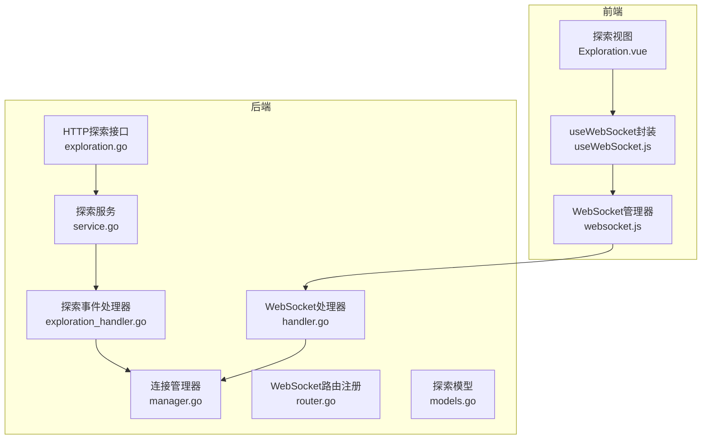
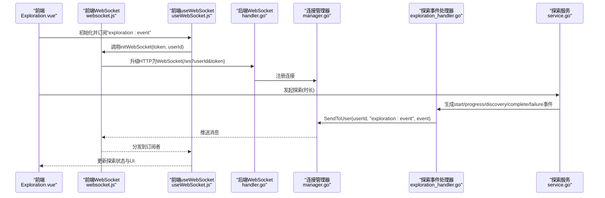
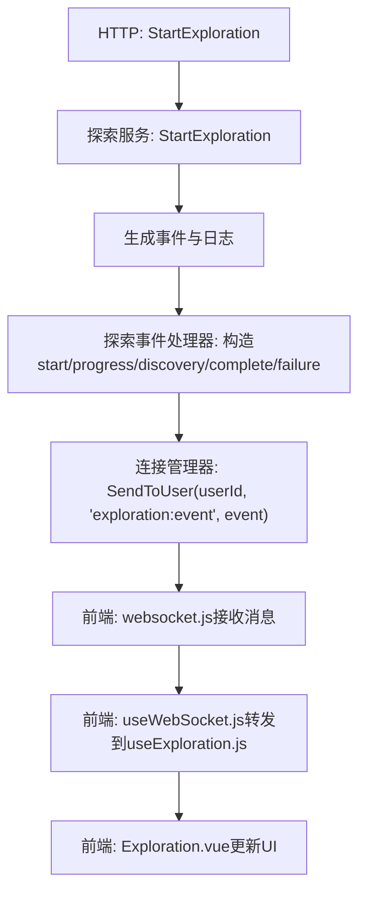
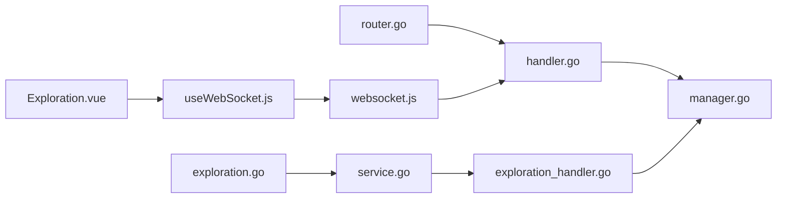

# 探索事件

<cite>
**本文引用的文件列表**
- [exploration_handler.go](file://server-go/internal/websocket/exploration_handler.go)
- [manager.go](file://server-go/internal/websocket/manager.go)
- [router.go](file://server-go/internal/websocket/router.go)
- [handler.go](file://server-go/internal/websocket/handler.go)
- [service.go](file://server-go/internal/exploration/service.go)
- [models.go](file://server-go/internal/exploration/models.go)
- [exploration.go](file://server-go/internal/http/handlers/exploration/exploration.go)
- [websocket.js](file://src/services/websocket.js)
- [useWebSocket.js](file://src/composables/useWebSocket.js)
- [Exploration.vue](file://src/views/Exploration.vue)
</cite>

## 目录
1. [简介](#简介)
2. [项目结构](#项目结构)
3. [核心组件](#核心组件)
4. [架构总览](#架构总览)
5. [详细组件分析](#详细组件分析)
6. [依赖关系分析](#依赖关系分析)
7. [性能考量](#性能考量)
8. [故障排查指南](#故障排查指南)
9. [结论](#结论)
10. [附录](#附录)

## 简介
本文系统化整理并文档化“探索”相关的WebSocket实时事件类型，围绕后端的探索事件结构与前端订阅机制，详细说明以下五类事件的触发时机、数据字段含义与典型应用场景：
- start：探索开始事件，包含探索地点名称、总时长、初始进度等
- progress：探索进度事件，周期性更新进度百分比与已用时间
- discovery：探索过程中的发现事件，推送发现的资源或物品
- complete：探索完成事件，返回奖励内容
- failure：探索失败事件，携带错误信息

同时提供前端订阅示例与错误处理建议，帮助开发者构建流畅的探索体验。

## 项目结构
探索事件涉及前后端多处模块协同：
- 后端
  - WebSocket连接管理与消息分发：manager.go、handler.go、router.go
  - 探索事件处理器：exploration_handler.go
  - 探索业务服务与模型：service.go、models.go
  - HTTP接口：exploration.go
- 前端
  - WebSocket连接与消息分发：websocket.js
  - Vue组合式API封装：useWebSocket.js
  - 探索视图与交互：Exploration.vue

图表来源
- [handler.go](file://server-go/internal/websocket/handler.go#L37-L73)
- [manager.go](file://server-go/internal/websocket/manager.go#L137-L153)
- [router.go](file://server-go/internal/websocket/router.go#L8-L17)
- [exploration_handler.go](file://server-go/internal/websocket/exploration_handler.go#L38-L57)
- [service.go](file://server-go/internal/exploration/service.go#L27-L75)
- [models.go](file://server-go/internal/exploration/models.go#L24-L48)
- [exploration.go](file://server-go/internal/http/handlers/exploration/exploration.go#L19-L66)
- [websocket.js](file://src/services/websocket.js#L1-L120)
- [useWebSocket.js](file://src/composables/useWebSocket.js#L1-L136)
- [Exploration.vue](file://src/views/Exploration.vue#L1-L171)

章节来源
- [handler.go](file://server-go/internal/websocket/handler.go#L37-L73)
- [manager.go](file://server-go/internal/websocket/manager.go#L137-L153)
- [router.go](file://server-go/internal/websocket/router.go#L8-L17)
- [exploration_handler.go](file://server-go/internal/websocket/exploration_handler.go#L38-L57)
- [service.go](file://server-go/internal/exploration/service.go#L27-L75)
- [models.go](file://server-go/internal/exploration/models.go#L24-L48)
- [exploration.go](file://server-go/internal/http/handlers/exploration/exploration.go#L19-L66)
- [websocket.js](file://src/services/websocket.js#L1-L120)
- [useWebSocket.js](file://src/composables/useWebSocket.js#L1-L136)
- [Exploration.vue](file://src/views/Exploration.vue#L1-L171)

## 核心组件
- 探索事件结构
  - 后端WebSocket事件结构：包含事件类型、探索地点、消息、进度、持续时间、已用时间、发现内容、奖励、错误信息、时间戳等字段
  - 前端HTTP探索事件结构：包含事件类型、描述、物品/数量、灵草、敌人、配方ID、碎片数、选择项等字段
- 探索事件处理器
  - 提供start、progress、discovery、complete、failure五类事件的通知方法，并通过连接管理器广播至指定用户
- 探索服务
  - 负责模拟探索过程、触发随机事件、生成日志与奖励，供HTTP接口调用
- WebSocket管理
  - 连接升级、心跳检测、按用户广播消息、断线重连与状态回调

章节来源
- [exploration_handler.go](file://server-go/internal/websocket/exploration_handler.go#L9-L22)
- [models.go](file://server-go/internal/exploration/models.go#L24-L48)
- [exploration_handler.go](file://server-go/internal/websocket/exploration_handler.go#L59-L149)
- [service.go](file://server-go/internal/exploration/service.go#L27-L75)
- [manager.go](file://server-go/internal/websocket/manager.go#L137-L153)

## 架构总览
WebSocket探索事件的端到端流程如下：
- 前端通过websocket.js连接后端WebSocket，订阅“exploration:event”
- 后端通过router.go注册/ws端点，handler.go负责升级HTTP为WebSocket并注册连接
- 探索服务service.go根据请求时长模拟探索过程，触发随机事件
- 探索事件处理器exploration_handler.go构造start/progress/discovery/complete/failure事件并通过manager.go广播给指定用户
- 前端useWebSocket.js将收到的事件推送到探索状态管理器useExploration.js，驱动UI更新

图表来源
- [handler.go](file://server-go/internal/websocket/handler.go#L37-L73)
- [manager.go](file://server-go/internal/websocket/manager.go#L137-L153)
- [exploration_handler.go](file://server-go/internal/websocket/exploration_handler.go#L38-L57)
- [service.go](file://server-go/internal/exploration/service.go#L27-L75)
- [websocket.js](file://src/services/websocket.js#L36-L96)
- [useWebSocket.js](file://src/composables/useWebSocket.js#L65-L73)
- [Exploration.vue](file://src/views/Exploration.vue#L1-L171)

## 详细组件分析

### 探索事件类型与触发机制
- start
  - 触发时机：探索开始时
  - 数据字段要点：事件类型为start，包含探索地点名称、总时长、初始进度（通常为0）、消息提示等
  - 典型用途：初始化UI进度条、显示探索目标与总耗时
- progress
  - 触发时机：探索进行中，周期性更新
  - 数据字段要点：事件类型为progress，包含进度百分比、已用时间、总时长、消息提示等
  - 典型用途：动态更新进度条、剩余时间、实时反馈探索进程
- discovery
  - 触发时机：探索过程中发现资源/物品
  - 数据字段要点：事件类型为discovery，包含发现内容对象，用于展示发现详情
  - 典型用途：推送发现的灵草、丹方残页、灵石等
- complete
  - 触发时机：探索成功完成
  - 数据字段要点：事件类型为complete，进度为100，包含奖励内容
  - 典型用途：展示最终奖励、刷新统计数据
- failure
  - 触发时机：探索失败中断
  - 数据字段要点：事件类型为failure，包含错误信息
  - 典型用途：提示失败原因、引导用户重试或调整策略

章节来源
- [exploration_handler.go](file://server-go/internal/websocket/exploration_handler.go#L59-L149)

### 数据字段与含义
- 后端WebSocket事件结构字段
  - userId：用户标识
  - eventType：事件类型（start/progress/discovery/complete/failure）
  - exploreName：探索地点名称
  - message：事件消息文本
  - progress：进度百分比
  - durationSecs：总时长（秒）
  - elapsedSecs：已用时间（秒）
  - discovery：发现内容（任意结构）
  - reward：奖励内容（任意结构）
  - errorMsg：错误信息
  - timestamp：事件时间戳
- 前端HTTP探索事件结构字段
  - type：事件类型（如item_found/spirit_stone_found/herb_found/pill_recipe_fragment_found/battle_encounter）
  - description：事件描述
  - item/amount/herb/enemy/recipeId/fragments/choices：事件相关数据与选择项

章节来源
- [exploration_handler.go](file://server-go/internal/websocket/exploration_handler.go#L9-L22)
- [models.go](file://server-go/internal/exploration/models.go#L24-L48)

### 触发流程与调用链
- HTTP接口
  - StartExploration：接收探索时长，调用探索服务生成事件与日志，返回给前端
  - HandleEventChoice：处理前端对事件的选择，返回奖励
- WebSocket广播
  - 探索服务生成事件后，由探索事件处理器构造相应事件并广播
  - 连接管理器按userId将消息投递到对应客户端
- 前端订阅
  - 前端通过websocket.js订阅“exploration:event”，useWebSocket.js将其转发到useExploration.js，驱动UI

图表来源
- [exploration.go](file://server-go/internal/http/handlers/exploration/exploration.go#L19-L66)
- [service.go](file://server-go/internal/exploration/service.go#L27-L75)
- [exploration_handler.go](file://server-go/internal/websocket/exploration_handler.go#L38-L57)
- [manager.go](file://server-go/internal/websocket/manager.go#L137-L153)
- [websocket.js](file://src/services/websocket.js#L100-L128)
- [useWebSocket.js](file://src/composables/useWebSocket.js#L65-L73)
- [Exploration.vue](file://src/views/Exploration.vue#L1-L171)

章节来源
- [exploration.go](file://server-go/internal/http/handlers/exploration/exploration.go#L19-L66)
- [service.go](file://server-go/internal/exploration/service.go#L27-L75)
- [exploration_handler.go](file://server-go/internal/websocket/exploration_handler.go#L38-L57)
- [manager.go](file://server-go/internal/websocket/manager.go#L137-L153)
- [websocket.js](file://src/services/websocket.js#L100-L128)
- [useWebSocket.js](file://src/composables/useWebSocket.js#L65-L73)
- [Exploration.vue](file://src/views/Exploration.vue#L1-L171)

### 前端监听与应用示例
- 订阅频道
  - 前端通过websocket.js订阅“exploration:event”，并在useWebSocket.js中提供subscribeExplorationEventData方法
- UI联动
  - useExploration.js根据eventType更新当前探索状态与进度条
  - Exploration.vue根据useExploration的状态渲染界面
- 错误处理建议
  - 监听连接状态变化，处理连接失败、断开与重连
  - 对未知事件类型进行降级处理，避免阻塞UI
  - 对事件时间戳进行校验，防止过期消息干扰

章节来源
- [websocket.js](file://src/services/websocket.js#L130-L155)
- [useWebSocket.js](file://src/composables/useWebSocket.js#L65-L73)
- [useWebSocket.js](file://src/composables/useWebSocket.js#L267-L318)
- [Exploration.vue](file://src/views/Exploration.vue#L1-L171)

## 依赖关系分析
- 后端
  - WebSocket路由router.go依赖handler.go进行连接升级
  - 探索事件处理器exploration_handler.go依赖连接管理器manager.go进行广播
  - 探索服务service.go与HTTP接口exploration.go耦合，前者被后者调用
- 前端
  - websocket.js依赖handler.go的/ws端点
  - useWebSocket.js依赖websocket.js的订阅接口
  - Exploration.vue依赖useWebSocket.js的状态管理

图表来源
- [router.go](file://server-go/internal/websocket/router.go#L8-L17)
- [handler.go](file://server-go/internal/websocket/handler.go#L37-L73)
- [manager.go](file://server-go/internal/websocket/manager.go#L137-L153)
- [exploration_handler.go](file://server-go/internal/websocket/exploration_handler.go#L38-L57)
- [service.go](file://server-go/internal/exploration/service.go#L27-L75)
- [exploration.go](file://server-go/internal/http/handlers/exploration/exploration.go#L19-L66)
- [websocket.js](file://src/services/websocket.js#L36-L96)
- [useWebSocket.js](file://src/composables/useWebSocket.js#L65-L73)
- [Exploration.vue](file://src/views/Exploration.vue#L1-L171)

章节来源
- [router.go](file://server-go/internal/websocket/router.go#L8-L17)
- [handler.go](file://server-go/internal/websocket/handler.go#L37-L73)
- [manager.go](file://server-go/internal/websocket/manager.go#L137-L153)
- [exploration_handler.go](file://server-go/internal/websocket/exploration_handler.go#L38-L57)
- [service.go](file://server-go/internal/exploration/service.go#L27-L75)
- [exploration.go](file://server-go/internal/http/handlers/exploration/exploration.go#L19-L66)
- [websocket.js](file://src/services/websocket.js#L36-L96)
- [useWebSocket.js](file://src/composables/useWebSocket.js#L65-L73)
- [Exploration.vue](file://src/views/Exploration.vue#L1-L171)

## 性能考量
- 广播队列与背压
  - 连接管理器使用带缓冲的广播通道，避免瞬时高并发导致丢消息
- 心跳与断线重连
  - 前端每秒发送心跳，后端心跳超时自动下线并清理Redis在线状态
  - 前端断线后按指数退避重连，避免风暴效应
- 事件密度控制
  - 多发现事件NotifyMultipleDiscoveries内部sleep，降低事件风暴风险
- 前端事件处理
  - useExploration.js仅保留有限条日志，避免DOM膨胀

章节来源
- [manager.go](file://server-go/internal/websocket/manager.go#L137-L153)
- [manager.go](file://server-go/internal/websocket/manager.go#L222-L256)
- [websocket.js](file://src/services/websocket.js#L183-L205)
- [websocket.js](file://src/services/websocket.js#L210-L238)
- [exploration_handler.go](file://server-go/internal/websocket/exploration_handler.go#L135-L149)
- [useWebSocket.js](file://src/composables/useWebSocket.js#L267-L318)

## 故障排查指南
- 连接问题
  - 检查/ws端点是否正确升级，userId/token参数是否有效
  - 查看前端连接状态回调，区分主动断开与异常断开
- 消息缺失
  - 确认userId是否正确，连接管理器是否已注册该用户
  - 检查广播通道是否溢出，必要时增大缓冲或优化事件频率
- 事件异常
  - 核对eventType是否符合预期，避免前端误判
  - 对未知事件类型进行降级处理，记录日志便于定位
- 前端UI不同步
  - 检查useExploration.js的事件处理分支是否覆盖complete/failure
  - 确保Exploration.vue正确绑定useExploration的状态

章节来源
- [handler.go](file://server-go/internal/websocket/handler.go#L37-L73)
- [manager.go](file://server-go/internal/websocket/manager.go#L137-L153)
- [websocket.js](file://src/services/websocket.js#L130-L155)
- [useWebSocket.js](file://src/composables/useWebSocket.js#L267-L318)
- [Exploration.vue](file://src/views/Exploration.vue#L1-L171)

## 结论
本文系统梳理了探索事件在后端与前端的实现与协作方式，明确了start/progress/discovery/complete/failure五类事件的数据结构与触发路径，并提供了前端订阅与错误处理的最佳实践。通过合理的广播与心跳机制，以及前端状态管理，可以为用户提供流畅、实时的探索体验。

## 附录
- 前端订阅示例（订阅'exploration:event'频道）
  - 初始化WebSocket并订阅探索事件
  - 在组件中使用useExploration.js处理事件并更新UI
- 错误处理建议
  - 监听连接状态变化，区分主动断开与异常断开
  - 对未知事件类型进行降级处理，记录日志
  - 控制事件密度，避免UI卡顿

章节来源
- [websocket.js](file://src/services/websocket.js#L130-L155)
- [useWebSocket.js](file://src/composables/useWebSocket.js#L65-L73)
- [useWebSocket.js](file://src/composables/useWebSocket.js#L267-L318)
- [Exploration.vue](file://src/views/Exploration.vue#L1-L171)