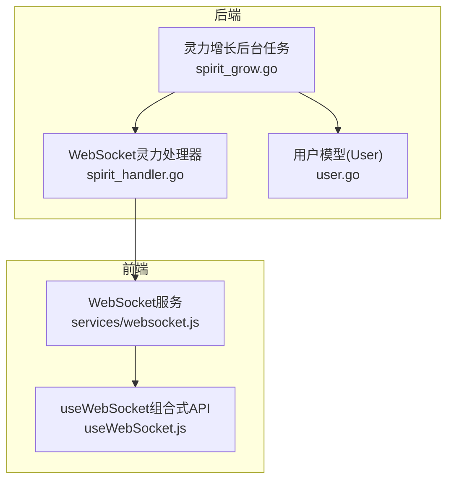
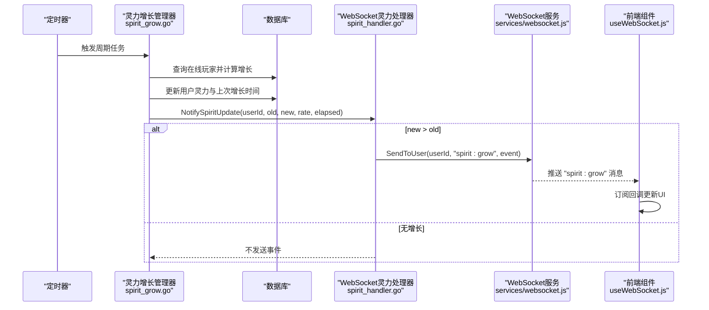
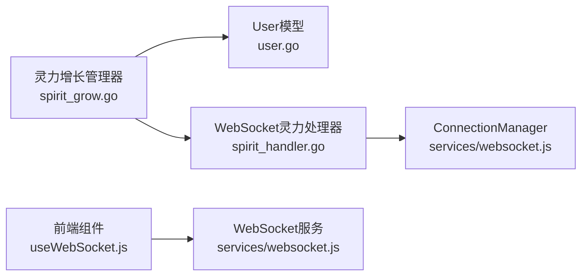

# 灵宠成长事件

<cite>
**本文引用的文件**
- [server-go/internal/spirit/spirit_grow.go](file://server-go/internal/spirit/spirit_grow.go)
- [server-go/internal/websocket/spirit_handler.go](file://server-go/internal/websocket/spirit_handler.go)
- [server-go/internal/models/user.go](file://server-go/internal/models/user.go)
- [src/services/websocket.js](file://src/services/websocket.js)
- [src/composables/useWebSocket.js](file://src/composables/useWebSocket.js)
- [WebSocket改造完整实现指南.md](file://WebSocket改造完整实现指南.md)
- [WebSocket实现完成总结.md](file://WebSocket实现完成总结.md)
</cite>

## 目录
1. [简介](#简介)
2. [项目结构](#项目结构)
3. [核心组件](#核心组件)
4. [架构总览](#架构总览)
5. [详细组件分析](#详细组件分析)
6. [依赖关系分析](#依赖关系分析)
7. [性能考量](#性能考量)
8. [故障排查指南](#故障排查指南)
9. [结论](#结论)
10. [附录](#附录)

## 简介
本文件系统化整理并文档化“灵宠成长”相关的WebSocket实时事件类型，围绕 spirit_handler.go 中的 SpiritGrowthEvent 结构体与 NotifySpiritUpdate 方法，详细说明 “spirit:grow” 事件的触发条件、数据结构、业务逻辑与前后端集成要点。重点覆盖以下方面：
- 后台任务检测到灵力增长后的事件推送流程
- 数据结构字段含义（旧/新灵力值、增长量、灵力速率、耗时）
- round1 函数对浮点数保留一位小数的处理规则
- 当 newSpirit ≤ oldSpirit 时不发送事件的优化策略
- 前端订阅 “spirit:grow” 频道的示例与 UI 更新建议
- GetSpiritUpdateFromDB 方法中 spiritRate 需从 BaseAttributes JSON 解析的待完善点

## 项目结构
与“灵宠成长”事件直接相关的后端与前端模块如下：
- 后端
  - 灵力增长后台任务：server-go/internal/spirit/spirit_grow.go
  - WebSocket 灵力事件处理器：server-go/internal/websocket/spirit_handler.go
  - 用户模型（包含灵力与上次增长时间等字段）：server-go/internal/models/user.go
- 前端
  - WebSocket 管理与订阅：src/services/websocket.js
  - Vue 组合式 API（useWebSocket）：src/composables/useWebSocket.js
  - 文档与示例：WebSocket改造完整实现指南.md、WebSocket实现完成总结.md

图表来源
- [server-go/internal/spirit/spirit_grow.go](file://server-go/internal/spirit/spirit_grow.go#L63-L174)
- [server-go/internal/websocket/spirit_handler.go](file://server-go/internal/websocket/spirit_handler.go#L13-L121)
- [server-go/internal/models/user.go](file://server-go/internal/models/user.go#L12-L42)
- [src/services/websocket.js](file://src/services/websocket.js#L1-L313)
- [src/composables/useWebSocket.js](file://src/composables/useWebSocket.js#L1-L43)

章节来源
- [server-go/internal/spirit/spirit_grow.go](file://server-go/internal/spirit/spirit_grow.go#L63-L174)
- [server-go/internal/websocket/spirit_handler.go](file://server-go/internal/websocket/spirit_handler.go#L13-L121)
- [server-go/internal/models/user.go](file://server-go/internal/models/user.go#L12-L42)
- [src/services/websocket.js](file://src/services/websocket.js#L1-L313)
- [src/composables/useWebSocket.js](file://src/composables/useWebSocket.js#L1-L43)

## 核心组件
- 灵力增长后台任务（SpiritGrowManager）
  - 定时扫描在线玩家，计算灵力增长并持久化，随后通过 WebSocket 推送 “spirit:grow” 事件
- WebSocket 灵力事件处理器（SpiritHandler）
  - 负责构造事件数据、按规则四舍五入、过滤无增长场景、向指定用户发送消息
- 用户模型（User）
  - 包含当前灵力值、上次增长时间、基础属性 JSON（含 spiritRate）等字段
- 前端 WebSocket 管理与订阅
  - 提供连接、订阅、心跳、重连等能力；前端通过订阅 “spirit:grow” 获取实时更新

章节来源
- [server-go/internal/spirit/spirit_grow.go](file://server-go/internal/spirit/spirit_grow.go#L17-L53)
- [server-go/internal/websocket/spirit_handler.go](file://server-go/internal/websocket/spirit_handler.go#L13-L81)
- [server-go/internal/models/user.go](file://server-go/internal/models/user.go#L12-L42)
- [src/services/websocket.js](file://src/services/websocket.js#L1-L313)

## 架构总览
“灵力增长”事件的端到端流程如下：
- 后台任务周期性扫描在线玩家，计算增长量并写回数据库
- 若存在增长，则通过 WebSocket 灵力处理器构造事件并发送给该用户
- 前端连接建立后订阅 “spirit:grow”，收到消息后更新本地状态与 UI

图表来源
- [server-go/internal/spirit/spirit_grow.go](file://server-go/internal/spirit/spirit_grow.go#L63-L174)
- [server-go/internal/websocket/spirit_handler.go](file://server-go/internal/websocket/spirit_handler.go#L63-L81)
- [src/services/websocket.js](file://src/services/websocket.js#L1-L313)
- [src/composables/useWebSocket.js](file://src/composables/useWebSocket.js#L1-L43)

## 详细组件分析

### 后台任务：灵力增长计算与推送
- 触发条件
  - 后台任务以固定间隔扫描在线玩家集合，若玩家在线且距离上次增长时间超过阈值，则计算增长并持久化
- 计算逻辑
  - 基于 elapsedSeconds 与 spiritRate 计算增长量，并对旧值与新值做两位小数取整
  - 更新 LastSpiritGainTime 与 Spirit 字段
- 事件推送
  - 调用 wsHandlers.Spirit.NotifySpiritUpdate(...) 将事件推送给该用户

章节来源
- [server-go/internal/spirit/spirit_grow.go](file://server-go/internal/spirit/spirit_grow.go#L63-L174)

### WebSocket 灵力处理器：事件构造与发送
- 数据结构：SpiritGrowthEvent
  - 字段包括 userId、oldSpirit、newSpirit、gainAmount、spiritRate、elapsedSeconds、timestamp
- round1 规则
  - 对 oldSpirit、newSpirit、gainAmount 采用一位小数取整
- 发送策略
  - 当 newSpirit ≤ oldSpirit 时不发送事件，避免冗余推送
- 事件类型
  - 消息类型为 "spirit:grow"，按用户维度定向发送

章节来源
- [server-go/internal/websocket/spirit_handler.go](file://server-go/internal/websocket/spirit_handler.go#L13-L81)

### 用户模型：灵力相关字段
- 关键字段
  - spirit：当前灵力值
  - last_spirit_gain_time：上次增长时间
  - base_attributes：JSON 存储的基础属性，其中包含 spiritRate

章节来源
- [server-go/internal/models/user.go](file://server-go/internal/models/user.go#L12-L42)

### 前端订阅与UI更新
- 订阅方式
  - 前端通过 wsManager.on('spirit:grow', callback) 订阅事件
  - 示例可参考文档中的集成步骤与示例代码片段路径
- UI更新建议
  - 动态数值动画：在收到事件后，使用过渡动画展示 newSpirit 与 gainAmount 的变化
  - 频繁更新节流：对高频更新进行防抖，减少不必要的渲染
  - 仅保存必要历史：默认保留最近若干条记录，避免内存占用过高

章节来源
- [src/services/websocket.js](file://src/services/websocket.js#L1-L313)
- [src/composables/useWebSocket.js](file://src/composables/useWebSocket.js#L1-L43)
- [WebSocket改造完整实现指南.md](file://WebSocket改造完整实现指南.md#L102-L199)
- [WebSocket实现完成总结.md](file://WebSocket实现完成总结.md#L112-L131)

### 数据结构与字段说明
- SpiritGrowthEvent 字段
  - userId：用户标识
  - oldSpirit：旧灵力值（保留一位小数）
  - newSpirit：新灵力值（保留一位小数）
  - gainAmount：增长量（保留一位小数）
  - spiritRate：灵力速率（来自基础属性）
  - elapsedSeconds：本次增长耗时（秒）
  - timestamp：事件时间戳

章节来源
- [server-go/internal/websocket/spirit_handler.go](file://server-go/internal/websocket/spirit_handler.go#L13-L26)

### round1 函数与浮点数取整规则
- round1 规则
  - 对传入浮点数乘以 10 后四舍五入，再除以 10，实现一位小数取整
- 使用场景
  - 在事件构造阶段对 oldSpirit、newSpirit、gainAmount 进行统一取整，保证前后端展示一致性

章节来源
- [server-go/internal/websocket/spirit_handler.go](file://server-go/internal/websocket/spirit_handler.go#L13-L15)

### 无增长不推送的优化策略
- 条件判断
  - 当 newSpirit ≤ oldSpirit 时直接返回，不构造与发送事件
- 价值
  - 减少无效消息，降低带宽与前端处理压力，提升用户体验

章节来源
- [server-go/internal/websocket/spirit_handler.go](file://server-go/internal/websocket/spirit_handler.go#L63-L81)

### spiritRate 解析待完善点
- 现状
  - GetSpiritUpdateFromDB 方法中 spiritRate 当前硬编码为 1.0
  - 注释明确指出需从 BaseAttributes JSON 中解析 spiritRate
- 影响
  - 若 spiritRate 未从 JSON 解析，可能导致事件中的速率与实际不符
- 建议
  - 在 GetSpiritUpdateFromDB 中解析 BaseAttributes JSON，读取 spiritRate 字段并赋值

章节来源
- [server-go/internal/websocket/spirit_handler.go](file://server-go/internal/websocket/spirit_handler.go#L83-L114)

### 前端监听代码示例与集成要点
- 前端订阅示例
  - 可参考文档中的订阅示例与集成步骤，示例代码片段路径见下方
- 集成清单
  - 后端：确保在灵力增长后台任务中调用 NotifySpiritUpdate
  - 前端：在应用初始化后调用 initWebSocket 并订阅 spirit:grow

章节来源
- [WebSocket改造完整实现指南.md](file://WebSocket改造完整实现指南.md#L102-L199)
- [WebSocket实现完成总结.md](file://WebSocket实现完成总结.md#L112-L131)

## 依赖关系分析
- 后台任务依赖
  - 依赖 Redis 在线玩家集合与数据库用户模型
  - 依赖 WebSocket Handlers 将事件推送到客户端
- WebSocket 处理器依赖
  - 依赖 ConnectionManager 进行定向发送
  - 依赖 User 模型与 BaseAttributes JSON 解析 spiritRate
- 前端依赖
  - 依赖 wsManager 提供的订阅接口与连接管理

图表来源
- [server-go/internal/spirit/spirit_grow.go](file://server-go/internal/spirit/spirit_grow.go#L63-L174)
- [server-go/internal/websocket/spirit_handler.go](file://server-go/internal/websocket/spirit_handler.go#L43-L81)
- [src/services/websocket.js](file://src/services/websocket.js#L1-L313)
- [src/composables/useWebSocket.js](file://src/composables/useWebSocket.js#L1-L43)

章节来源
- [server-go/internal/spirit/spirit_grow.go](file://server-go/internal/spirit/spirit_grow.go#L63-L174)
- [server-go/internal/websocket/spirit_handler.go](file://server-go/internal/websocket/spirit_handler.go#L43-L81)
- [src/services/websocket.js](file://src/services/websocket.js#L1-L313)
- [src/composables/useWebSocket.js](file://src/composables/useWebSocket.js#L1-L43)

## 性能考量
- 后端
  - 使用定时器与非阻塞通道，避免阻塞主线程
  - 对浮点数进行取整，减少消息体积与前端渲染复杂度
- 前端
  - 对高频更新进行防抖，避免频繁渲染
  - 仅保存必要历史记录，控制内存占用

章节来源
- [WebSocket改造完整实现指南.md](file://WebSocket改造完整实现指南.md#L618-L660)
- [WebSocket实现完成总结.md](file://WebSocket实现完成总结.md#L112-L131)

## 故障排查指南
- 连接失败
  - 检查 userId 与 token 参数是否正确传递
  - 确认 WebSocket 路由已注册且 Nginx 反代已开启升级支持
- 未收到消息
  - 确认前端已订阅 "spirit:grow"
  - 检查后端日志中是否打印“灵力增长事件已发送”
- 灵力速率异常
  - 检查 BaseAttributes JSON 中是否包含 spiritRate 字段
  - 确认 GetSpiritUpdateFromDB 已解析 spiritRate

章节来源
- [WebSocket改造完整实现指南.md](file://WebSocket改造完整实现指南.md#L552-L617)
- [WebSocket实现完成总结.md](file://WebSocket实现完成总结.md#L112-L131)
- [server-go/internal/websocket/spirit_handler.go](file://server-go/internal/websocket/spirit_handler.go#L83-L114)

## 结论
“灵宠成长”事件通过后台任务与 WebSocket 实时推送实现了低延迟、高效率的灵力增长通知。后端在计算与发送环节均做了取整与无增长过滤优化，前端通过订阅与节流策略保障了良好的交互体验。当前仍需完善 GetSpiritUpdateFromDB 中 spiritRate 的解析逻辑，以确保事件速率与实际一致。

## 附录
- 事件消息格式参考
  - 可参考文档中的 “灵力增长事件（spirit:grow）” 消息格式示例
- 前端订阅示例
  - 可参考文档中的 “前端订阅灵力增长” 示例代码片段路径

章节来源
- [WebSocket实现完成总结.md](file://WebSocket实现完成总结.md#L112-L131)
- [WebSocket改造完整实现指南.md](file://WebSocket改造完整实现指南.md#L102-L199)