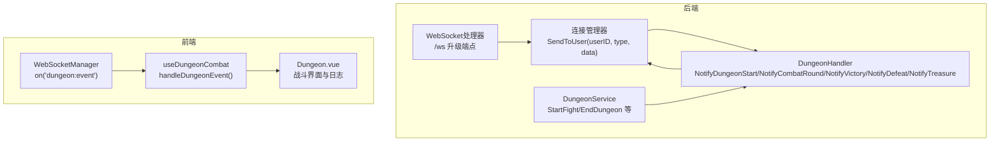
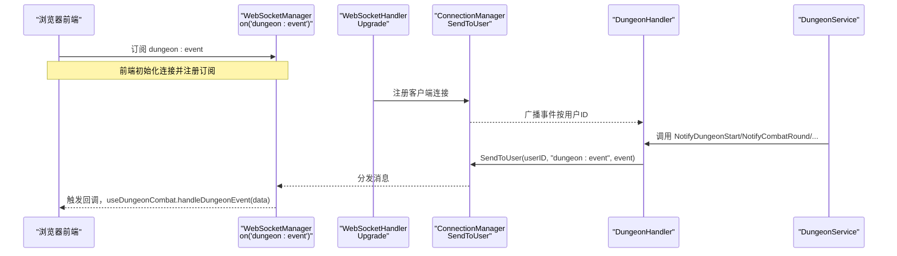
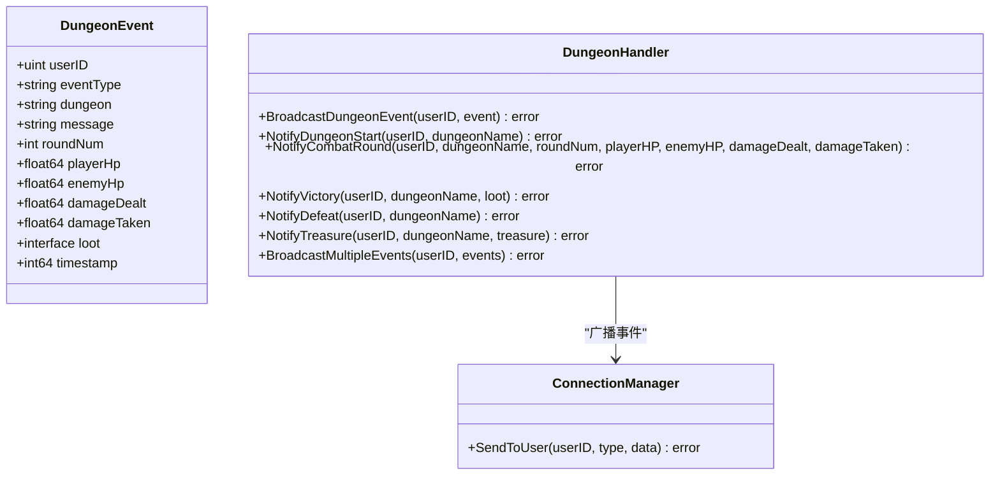
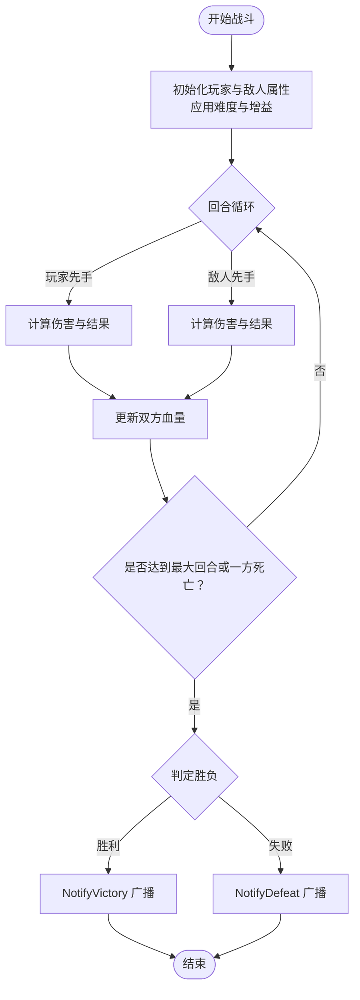
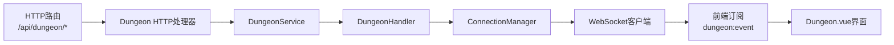

# 秘境事件

<cite>
**本文引用的文件**
- [dungeon_handler.go](file://server-go/internal/websocket/dungeon_handler.go)
- [service.go](file://server-go/internal/dungeon/service.go)
- [models.go](file://server-go/internal/dungeon/models.go)
- [dungeon.go](file://server-go/internal/http/handlers/dungeon/dungeon.go)
- [router.go](file://server-go/internal/http/router/router.go)
- [manager.go](file://server-go/internal/websocket/manager.go)
- [handler.go](file://server-go/internal/websocket/handler.go)
- [websocket.js](file://src/services/websocket.js)
- [useWebSocket.js](file://src/composables/useWebSocket.js)
- [Dungeon.vue](file://src/views/Dungeon.vue)
- [WebSocket改造完整实现指南.md](file://WebSocket改造完整实现指南.md)
- [WebSocket实现完成总结.md](file://WebSocket实现完成总结.md)
</cite>

## 目录
1. [简介](#简介)
2. [项目结构](#项目结构)
3. [核心组件](#核心组件)
4. [架构总览](#架构总览)
5. [详细组件分析](#详细组件分析)
6. [依赖关系分析](#依赖关系分析)
7. [性能考量](#性能考量)
8. [故障排查指南](#故障排查指南)
9. [结论](#结论)
10. [附录](#附录)

## 简介
本文件系统化整理并文档化“秘境”相关的WebSocket实时事件类型，围绕后端DungeonEvent结构与相关方法，详细说明以下五种事件的触发条件、数据结构定义与使用场景：
- start：用户进入秘境时触发，data包含秘境名称与初始消息
- combat_round：每轮战斗发生时推送，包含双方血量、伤害值与轮数信息
- victory：战胜时广播战利品与胜利提示
- defeat：战败时广播失败提示
- treasure：发现宝藏时广播宝藏信息

同时，提供前端订阅与典型应用示例，帮助开发者准确处理这些实时消息。

## 项目结构
后端采用Go语言，WebSocket事件通过统一的连接管理器分发；前端使用Vue组合式API封装WebSocket连接与订阅，并在秘境页面中消费事件流。

图表来源
- [handler.go](file://server-go/internal/websocket/handler.go#L37-L73)
- [manager.go](file://server-go/internal/websocket/manager.go#L137-L153)
- [dungeon_handler.go](file://server-go/internal/websocket/dungeon_handler.go#L38-L143)
- [service.go](file://server-go/internal/dungeon/service.go#L302-L489)
- [websocket.js](file://src/services/websocket.js#L1-L120)
- [useWebSocket.js](file://src/composables/useWebSocket.js#L180-L229)
- [Dungeon.vue](file://src/views/Dungeon.vue#L1-L120)

章节来源
- [router.go](file://server-go/internal/http/router/router.go#L104-L113)
- [handler.go](file://server-go/internal/websocket/handler.go#L37-L73)
- [manager.go](file://server-go/internal/websocket/manager.go#L137-L153)

## 核心组件
- 后端事件模型与处理器
  - 事件数据结构：DungeonEvent，字段覆盖事件类型、秘境名、消息、轮数、双方血量、伤害、战利品、时间戳等
  - 事件处理器：DungeonHandler，提供NotifyDungeonStart、NotifyCombatRound、NotifyVictory、NotifyDefeat、NotifyTreasure等方法，统一通过SendToUser广播
- 业务服务
  - DungeonService：负责战斗模拟、增益选择与应用、难度修正、奖励结算等，最终调用DungeonHandler广播事件
- 前端订阅与消费
  - WebSocketManager：封装连接、心跳、订阅与消息分发
  - useDungeonCombat：消费dungeon:event事件，维护战斗日志与状态机
  - Dungeon.vue：展示战斗界面、日志与奖励

章节来源
- [dungeon_handler.go](file://server-go/internal/websocket/dungeon_handler.go#L9-L22)
- [dungeon_handler.go](file://server-go/internal/websocket/dungeon_handler.go#L38-L143)
- [service.go](file://server-go/internal/dungeon/service.go#L302-L489)
- [websocket.js](file://src/services/websocket.js#L1-L120)
- [useWebSocket.js](file://src/composables/useWebSocket.js#L180-L229)
- [Dungeon.vue](file://src/views/Dungeon.vue#L1-L120)

## 架构总览
WebSocket事件在后端通过DungeonHandler广播至指定用户；前端通过WebSocketManager订阅dungeon:event频道，useDungeonCombat根据eventType更新UI与战斗状态。

图表来源
- [handler.go](file://server-go/internal/websocket/handler.go#L37-L73)
- [manager.go](file://server-go/internal/websocket/manager.go#L137-L153)
- [dungeon_handler.go](file://server-go/internal/websocket/dungeon_handler.go#L38-L143)
- [service.go](file://server-go/internal/dungeon/service.go#L302-L489)
- [websocket.js](file://src/services/websocket.js#L1-L120)
- [useWebSocket.js](file://src/composables/useWebSocket.js#L180-L229)

## 详细组件分析

### 事件类型与触发条件

- start
  - 触发条件：用户进入秘境后，服务端调用NotifyDungeonStart广播
  - 数据结构要点：eventType="start"，包含dungeon、message、timestamp
  - 使用场景：初始化战斗界面、显示秘境名称与欢迎消息
  - 触发路径：DungeonService.StartFight或业务流程中调用DungeonHandler.NotifyDungeonStart

- combat_round
  - 触发条件：每轮战斗结束后，服务端调用NotifyCombatRound广播
  - 数据结构要点：eventType="combat_round"，包含roundNum、playerHp、enemyHp、damageDealt、damageTaken、message
  - 使用场景：实时更新血条、回合数与伤害日志
  - 触发路径：DungeonService.StartFight内部循环中，每轮战斗后广播

- victory
  - 触发条件：战斗胜利时，服务端调用NotifyVictory广播
  - 数据结构要点：eventType="victory"，包含message、loot（战利品）、timestamp
  - 使用场景：展示胜利弹窗、奖励列表与统计更新
  - 触发路径：DungeonService.StartFight判定胜利后广播

- defeat
  - 触发条件：战斗失败时，服务端调用NotifyDefeat广播
  - 数据结构要点：eventType="defeat"，包含message、timestamp
  - 使用场景：展示失败提示、结束秘境探索
  - 触发路径：DungeonService.StartFight判定失败后广播

- treasure
  - 触发条件：探索过程中发现宝藏时，服务端调用NotifyTreasure广播
  - 数据结构要点：eventType="treasure"，包含message、loot、timestamp
  - 使用场景：展示宝藏获得提示与奖励
  - 触发路径：探索流程中检测到宝藏后广播

章节来源
- [dungeon_handler.go](file://server-go/internal/websocket/dungeon_handler.go#L59-L131)
- [service.go](file://server-go/internal/dungeon/service.go#L302-L489)

### 数据结构定义与字段说明

图表来源
- [dungeon_handler.go](file://server-go/internal/websocket/dungeon_handler.go#L9-L22)
- [dungeon_handler.go](file://server-go/internal/websocket/dungeon_handler.go#L38-L143)
- [manager.go](file://server-go/internal/websocket/manager.go#L137-L153)

章节来源
- [dungeon_handler.go](file://server-go/internal/websocket/dungeon_handler.go#L9-L22)
- [dungeon_handler.go](file://server-go/internal/websocket/dungeon_handler.go#L38-L143)
- [manager.go](file://server-go/internal/websocket/manager.go#L137-L153)

### 处理流程与调用链

图表来源
- [service.go](file://server-go/internal/dungeon/service.go#L302-L489)
- [dungeon_handler.go](file://server-go/internal/websocket/dungeon_handler.go#L95-L118)

章节来源
- [service.go](file://server-go/internal/dungeon/service.go#L302-L489)
- [dungeon_handler.go](file://server-go/internal/websocket/dungeon_handler.go#L95-L118)

### 前端监听与典型应用示例

- 前端订阅方式
  - 使用WebSocketManager的subscribeDungeonEvent订阅dungeon:event频道
  - 在useDungeonCombat中处理事件，根据eventType更新战斗状态与日志
- 典型应用示例
  - start：切换到战斗界面，显示当前秘境名
  - combat_round：更新血条、回合数与伤害日志
  - victory：展示奖励弹窗，更新统计数据
  - defeat：提示失败并结束探索
  - treasure：提示获得宝藏并展示奖励

章节来源
- [websocket.js](file://src/services/websocket.js#L276-L281)
- [useWebSocket.js](file://src/composables/useWebSocket.js#L180-L229)
- [Dungeon.vue](file://src/views/Dungeon.vue#L1-L120)

## 依赖关系分析

图表来源
- [router.go](file://server-go/internal/http/router/router.go#L104-L113)
- [dungeon.go](file://server-go/internal/http/handlers/dungeon/dungeon.go#L172-L227)
- [service.go](file://server-go/internal/dungeon/service.go#L302-L489)
- [dungeon_handler.go](file://server-go/internal/websocket/dungeon_handler.go#L38-L143)
- [manager.go](file://server-go/internal/websocket/manager.go#L137-L153)
- [websocket.js](file://src/services/websocket.js#L276-L281)
- [Dungeon.vue](file://src/views/Dungeon.vue#L1-L120)

章节来源
- [router.go](file://server-go/internal/http/router/router.go#L104-L113)
- [dungeon.go](file://server-go/internal/http/handlers/dungeon/dungeon.go#L172-L227)
- [service.go](file://server-go/internal/dungeon/service.go#L302-L489)
- [dungeon_handler.go](file://server-go/internal/websocket/dungeon_handler.go#L38-L143)
- [manager.go](file://server-go/internal/websocket/manager.go#L137-L153)
- [websocket.js](file://src/services/websocket.js#L276-L281)
- [Dungeon.vue](file://src/views/Dungeon.vue#L1-L120)

## 性能考量
- 事件节流：BroadcastMultipleEvents在逐条广播时插入100ms延迟，避免事件过于密集
- 心跳与保活：后端心跳超时检测与Redis心跳时间更新，保障长连接稳定性
- 广播队列：SendToUser将消息放入带缓冲的通道，避免阻塞主流程
- 前端缓存：useDungeonCombat维护最近50条战斗日志，避免DOM压力过大

章节来源
- [dungeon_handler.go](file://server-go/internal/websocket/dungeon_handler.go#L133-L143)
- [manager.go](file://server-go/internal/websocket/manager.go#L170-L256)
- [useWebSocket.js](file://src/composables/useWebSocket.js#L180-L229)

## 故障排查指南
- WebSocket连接失败
  - 检查升级端点与查询参数（userId、token），确认HTTP路由与中间件
  - 查看连接管理器日志与错误事件
- 事件未到达前端
  - 确认前端已订阅dungeon:event
  - 检查SendToUser是否正确按用户ID广播
- 心跳超时导致下线
  - 检查客户端心跳发送频率与后端心跳超时阈值
  - 核对Redis心跳时间更新逻辑
- 前端UI未更新
  - 确认useDungeonCombat.handleDungeonEvent被调用
  - 检查eventType分支逻辑与UI绑定

章节来源
- [handler.go](file://server-go/internal/websocket/handler.go#L37-L73)
- [manager.go](file://server-go/internal/websocket/manager.go#L170-L256)
- [websocket.js](file://src/services/websocket.js#L1-L120)
- [useWebSocket.js](file://src/composables/useWebSocket.js#L180-L229)

## 结论
本文系统梳理了秘境WebSocket事件的类型、触发条件、数据结构与前后端集成方式。通过统一的DungeonHandler与ConnectionManager，后端可稳定地向指定用户推送实时战斗事件；前端通过订阅与状态机更新，实现流畅的战斗体验。建议在生产环境中结合心跳保活、事件节流与日志监控，持续优化实时交互质量。

## 附录

### 事件类型与字段对照表
- start
  - eventType: "start"
  - 字段: dungeon, message, timestamp
- combat_round
  - eventType: "combat_round"
  - 字段: dungeon, message, roundNum, playerHp, enemyHp, damageDealt, damageTaken, timestamp
- victory
  - eventType: "victory"
  - 字段: dungeon, message, loot, timestamp
- defeat
  - eventType: "defeat"
  - 字段: dungeon, message, timestamp
- treasure
  - eventType: "treasure"
  - 字段: dungeon, message, loot, timestamp

章节来源
- [dungeon_handler.go](file://server-go/internal/websocket/dungeon_handler.go#L9-L22)
- [dungeon_handler.go](file://server-go/internal/websocket/dungeon_handler.go#L59-L131)

### 前端订阅与处理示例（路径引用）
- 订阅事件
  - [websocket.js](file://src/services/websocket.js#L276-L281)
- 事件处理与状态机
  - [useWebSocket.js](file://src/composables/useWebSocket.js#L180-L229)
- 战斗界面与日志
  - [Dungeon.vue](file://src/views/Dungeon.vue#L1-L120)

### 后端广播调用示例（路径引用）
- 开始事件
  - [dungeon_handler.go](file://server-go/internal/websocket/dungeon_handler.go#L59-L69)
- 轮次事件
  - [dungeon_handler.go](file://server-go/internal/websocket/dungeon_handler.go#L71-L93)
- 胜负事件
  - [dungeon_handler.go](file://server-go/internal/websocket/dungeon_handler.go#L95-L118)
- 宝藏事件
  - [dungeon_handler.go](file://server-go/internal/websocket/dungeon_handler.go#L120-L131)
- 连续轮次广播
  - [dungeon_handler.go](file://server-go/internal/websocket/dungeon_handler.go#L133-L143)

### 消息格式参考（路径引用）
- 通用消息格式
  - [WebSocket实现完成总结.md](file://WebSocket实现完成总结.md#L112-L154)
- 战斗事件示例
  - [WebSocket改造完整实现指南.md](file://WebSocket改造完整实现指南.md#L239-L259)