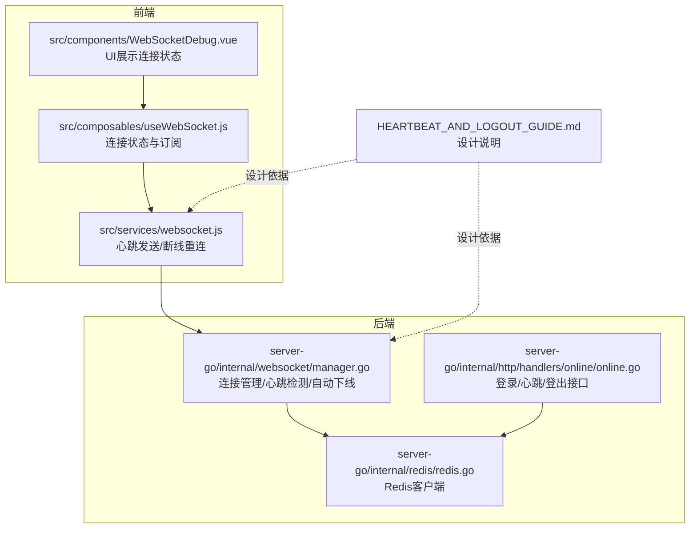
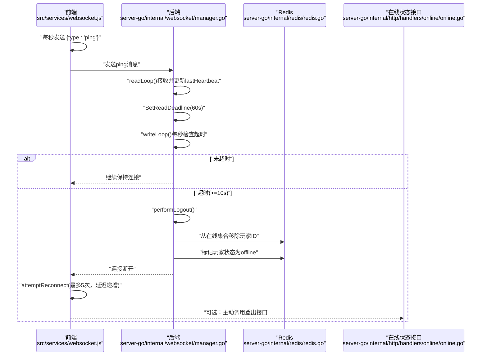
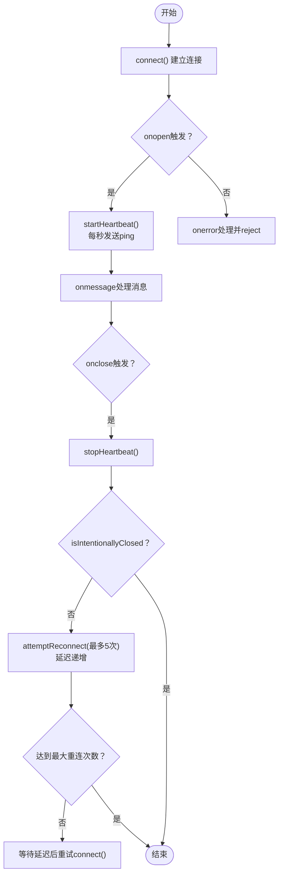
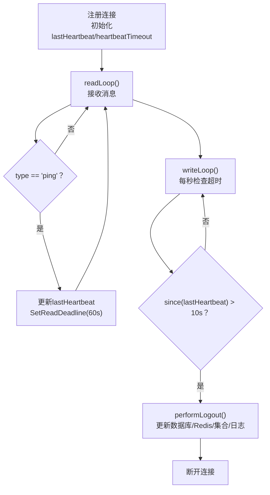
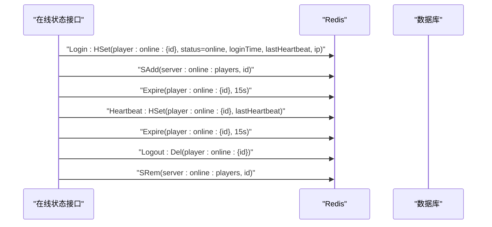
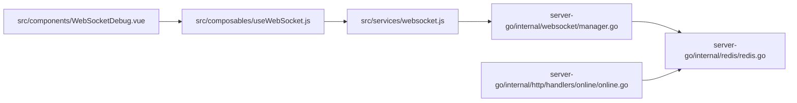

# 心跳保活与断线处理

<cite>
**本文引用的文件**
- [src/services/websocket.js](file://src/services/websocket.js)
- [server-go/internal/websocket/manager.go](file://server-go/internal/websocket/manager.go)
- [server-go/internal/http/handlers/online/online.go](file://server-go/internal/http/handlers/online/online.go)
- [server-go/internal/redis/redis.go](file://server-go/internal/redis/redis.go)
- [HEARTBEAT_AND_LOGOUT_GUIDE.md](file://HEARTBEAT_AND_LOGOUT_GUIDE.md)
- [src/composables/useWebSocket.js](file://src/composables/useWebSocket.js)
- [src/components/WebSocketDebug.vue](file://src/components/WebSocketDebug.vue)
- [test-heartbeat-timeout.js](file://test-heartbeat-timeout.js)
</cite>

## 目录
1. [引言](#引言)
2. [项目结构](#项目结构)
3. [核心组件](#核心组件)
4. [架构总览](#架构总览)
5. [详细组件分析](#详细组件分析)
6. [依赖关系分析](#依赖关系分析)
7. [性能考量](#性能考量)
8. [故障排查指南](#故障排查指南)
9. [结论](#结论)

## 引言
本文件围绕WebSocket心跳保活与断线处理机制展开，重点说明前端如何每秒发送“ping”消息维持连接，后端如何基于10秒未收到消息（包括ping）判定离线，并自动执行performLogout流程：关闭连接、从Redis在线集合移除用户、更新离线状态、释放相关资源。同时补充前端断线重连策略：在onclose或onerror触发后，最多重连5次，每次延迟按递增方式叠加，并在UI上提示用户连接状态。文中引用HEARTBEAT_AND_LOGOUT_GUIDE.md中的设计决策，解释为何选择10秒超时与5次重试。

## 项目结构
本机制涉及前后端多处文件协同工作：
- 前端：WebSocket连接管理与心跳发送、断线重连、连接状态订阅
- 后端：连接管理器、心跳读取与超时检测、自动下线逻辑
- 在线状态服务：登录/心跳/登出接口，维护Redis在线集合与玩家状态
- Redis：作为在线状态与心跳时间的持久化存储
- 文档：HEARTBEAT_AND_LOGOUT_GUIDE.md提供设计说明与时间线

图表来源
- [src/services/websocket.js](file://src/services/websocket.js#L1-L313)
- [server-go/internal/websocket/manager.go](file://server-go/internal/websocket/manager.go#L1-L309)
- [server-go/internal/http/handlers/online/online.go](file://server-go/internal/http/handlers/online/online.go#L1-L319)
- [server-go/internal/redis/redis.go](file://server-go/internal/redis/redis.go#L1-L34)
- [HEARTBEAT_AND_LOGOUT_GUIDE.md](file://HEARTBEAT_AND_LOGOUT_GUIDE.md#L1-L252)

章节来源
- [src/services/websocket.js](file://src/services/websocket.js#L1-L313)
- [server-go/internal/websocket/manager.go](file://server-go/internal/websocket/manager.go#L1-L309)
- [server-go/internal/http/handlers/online/online.go](file://server-go/internal/http/handlers/online/online.go#L1-L319)
- [server-go/internal/redis/redis.go](file://server-go/internal/redis/redis.go#L1-L34)
- [HEARTBEAT_AND_LOGOUT_GUIDE.md](file://HEARTBEAT_AND_LOGOUT_GUIDE.md#L1-L252)

## 核心组件
- 前端WebSocket管理器：负责连接、心跳发送、断线重连、事件分发与连接状态管理
- 后端连接管理器：负责注册/注销连接、读写循环、心跳超时检测、自动下线
- 在线状态服务：提供登录/心跳/登出接口，维护Redis在线集合与玩家状态
- Redis：存储在线玩家集合与玩家在线详情哈希，支持TTL与原子操作
- 设计文档：明确心跳间隔、超时阈值、检查频率及自动下线影响

章节来源
- [src/services/websocket.js](file://src/services/websocket.js#L1-L313)
- [server-go/internal/websocket/manager.go](file://server-go/internal/websocket/manager.go#L1-L309)
- [server-go/internal/http/handlers/online/online.go](file://server-go/internal/http/handlers/online/online.go#L1-L319)
- [server-go/internal/redis/redis.go](file://server-go/internal/redis/redis.go#L1-L34)
- [HEARTBEAT_AND_LOGOUT_GUIDE.md](file://HEARTBEAT_AND_LOGOUT_GUIDE.md#L1-L252)

## 架构总览
整体流程如下：
- 前端每秒发送“ping”消息；后端在读循环中接收并更新心跳时间，同时刷新读超时
- 后端写循环每秒检查lastHeartbeat是否超过10秒，若超时则触发performLogout
- performLogout清理Redis在线集合与玩家状态，随后断开连接
- 前端在onclose/onerror时判断非主动断开则自动重连，最多5次，延迟递增

图表来源
- [src/services/websocket.js](file://src/services/websocket.js#L160-L223)
- [server-go/internal/websocket/manager.go](file://server-go/internal/websocket/manager.go#L170-L256)
- [server-go/internal/websocket/manager.go](file://server-go/internal/websocket/manager.go#L258-L309)
- [server-go/internal/http/handlers/online/online.go](file://server-go/internal/http/handlers/online/online.go#L188-L253)
- [server-go/internal/redis/redis.go](file://server-go/internal/redis/redis.go#L1-L34)

## 详细组件分析

### 前端心跳与断线重连
- 心跳发送：每秒通过定时器发送“ping”消息，确保后端读循环能及时更新lastHeartbeat并刷新读超时
- 连接建立：onopen时启动心跳，触发connection:open事件
- 连接关闭：onclose时停止心跳，触发connection:close事件；若非主动断开则尝试重连
- 断线重连：最多5次，每次延迟按递增方式叠加（例如1s, 2s, 4s...），并在UI上提示连接状态
- 主动断开：disconnect()会标记isIntentionallyClosed，避免触发自动重连

图表来源
- [src/services/websocket.js](file://src/services/websocket.js#L36-L96)
- [src/services/websocket.js](file://src/services/websocket.js#L174-L205)
- [src/services/websocket.js](file://src/services/websocket.js#L208-L223)
- [src/services/websocket.js](file://src/services/websocket.js#L225-L237)

章节来源
- [src/services/websocket.js](file://src/services/websocket.js#L1-L313)
- [src/composables/useWebSocket.js](file://src/composables/useWebSocket.js#L1-L136)
- [src/components/WebSocketDebug.vue](file://src/components/WebSocketDebug.vue#L1-L149)

### 后端心跳检测与自动下线
- 连接注册：注册时初始化lastHeartbeat为当前时间，heartbeatTimeout设为10秒
- 读循环：接收消息，若type为“ping”，更新lastHeartbeat并刷新读超时，继续处理
- 写循环：每秒检查time.Since(lastHeartbeat)是否超过10秒，超时则异步执行performLogout
- 自动下线：更新数据库中的灵力增长时间戳（与登出接口逻辑一致），更新Redis玩家状态为offline，从在线集合移除玩家ID，记录日志

图表来源
- [server-go/internal/websocket/manager.go](file://server-go/internal/websocket/manager.go#L107-L127)
- [server-go/internal/websocket/manager.go](file://server-go/internal/websocket/manager.go#L170-L219)
- [server-go/internal/websocket/manager.go](file://server-go/internal/websocket/manager.go#L222-L256)
- [server-go/internal/websocket/manager.go](file://server-go/internal/websocket/manager.go#L258-L309)

章节来源
- [server-go/internal/websocket/manager.go](file://server-go/internal/websocket/manager.go#L1-L309)
- [HEARTBEAT_AND_LOGOUT_GUIDE.md](file://HEARTBEAT_AND_LOGOUT_GUIDE.md#L1-L252)

### 在线状态服务与Redis交互
- 登录接口：初始化玩家在线详情哈希，设置status为online，加入在线集合，设置TTL
- 心跳接口：更新玩家哈希中的lastHeartbeat并延长TTL
- 登出接口：删除玩家在线哈希键，从在线集合移除玩家ID
- Redis客户端：统一初始化与Ping校验

图表来源
- [server-go/internal/http/handlers/online/online.go](file://server-go/internal/http/handlers/online/online.go#L24-L110)
- [server-go/internal/http/handlers/online/online.go](file://server-go/internal/http/handlers/online/online.go#L112-L185)
- [server-go/internal/http/handlers/online/online.go](file://server-go/internal/http/handlers/online/online.go#L188-L253)
- [server-go/internal/redis/redis.go](file://server-go/internal/redis/redis.go#L1-L34)

章节来源
- [server-go/internal/http/handlers/online/online.go](file://server-go/internal/http/handlers/online/online.go#L1-L319)
- [server-go/internal/redis/redis.go](file://server-go/internal/redis/redis.go#L1-L34)

### 设计决策与参数说明
- 心跳间隔：前端每秒发送一次“ping”
- 超时阈值：后端10秒未收到心跳即判定离线
- 检查频率：后端每秒检查一次lastHeartbeat
- 重试策略：前端最多5次重连，延迟递增（例如1s, 2s, 4s...）

章节来源
- [HEARTBEAT_AND_LOGOUT_GUIDE.md](file://HEARTBEAT_AND_LOGOUT_GUIDE.md#L188-L211)

## 依赖关系分析
- 前端WebSocket管理器依赖浏览器原生WebSocket与事件模型，负责心跳与重连
- 后端连接管理器依赖gorilla/websocket库，管理连接生命周期与消息收发
- Redis客户端由统一入口初始化，后端通过HSet/SRem/Expire等命令维护在线状态
- 在线状态接口与Redis交互，提供登录/心跳/登出能力
- 前端组合式API与调试组件消费连接状态与消息事件

图表来源
- [src/services/websocket.js](file://src/services/websocket.js#L1-L313)
- [server-go/internal/websocket/manager.go](file://server-go/internal/websocket/manager.go#L1-L309)
- [server-go/internal/http/handlers/online/online.go](file://server-go/internal/http/handlers/online/online.go#L1-L319)
- [server-go/internal/redis/redis.go](file://server-go/internal/redis/redis.go#L1-L34)
- [src/composables/useWebSocket.js](file://src/composables/useWebSocket.js#L1-L136)
- [src/components/WebSocketDebug.vue](file://src/components/WebSocketDebug.vue#L1-L149)

## 性能考量
- 心跳频率与超时：每秒心跳与10秒超时平衡了实时性与网络波动容忍度
- 读写分离：读循环专注接收与刷新超时，写循环专注超时检测，降低耦合
- Redis操作：HSet/SRem/Expire均为原子操作，减少并发冲突
- 前端重连：指数级延迟有助于缓解瞬时网络抖动，避免雪崩式重连

[本节为通用建议，不直接分析具体文件]

## 故障排查指南
- 心跳超时但未触发下线
  - 检查前端是否持续发送“ping”，确认onopen后已启动心跳
  - 检查后端日志是否存在“心跳超时，正在下线”记录
- 灵力继续增长
  - 确认Redis中是否已从“server:online:players”集合移除该玩家ID
  - 若未移除，可在Redis中手动清理或检查performLogout执行路径
- 连接频繁断开
  - 检查网络稳定性与防火墙策略
  - 确认前端重连策略是否生效（最多5次，延迟递增）
- 登录/心跳/登出接口异常
  - 检查Redis连接与可用性
  - 查看接口返回状态码与错误信息

章节来源
- [HEARTBEAT_AND_LOGOUT_GUIDE.md](file://HEARTBEAT_AND_LOGOUT_GUIDE.md#L212-L238)
- [test-heartbeat-timeout.js](file://test-heartbeat-timeout.js#L1-L206)

## 结论
本机制通过“前端每秒心跳 + 后端10秒超时”的配合，实现了稳定可靠的在线保活与断线处理。前端负责心跳发送与断线重连，后端负责心跳检测与自动下线，Redis承担在线状态持久化。设计文档明确了参数与行为边界，测试脚本提供了可复现的验证路径。结合UI层的连接状态提示，能够有效提升用户体验与系统可靠性。