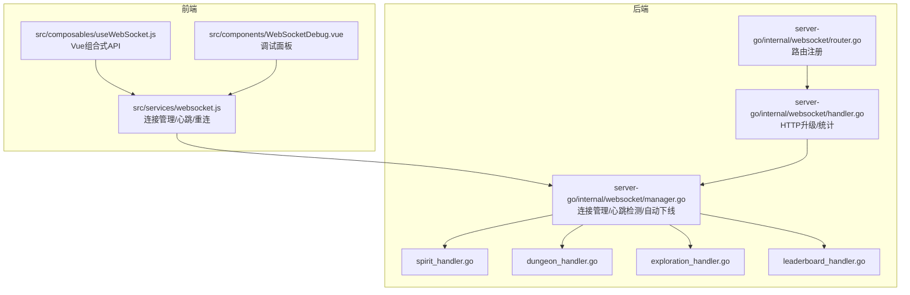
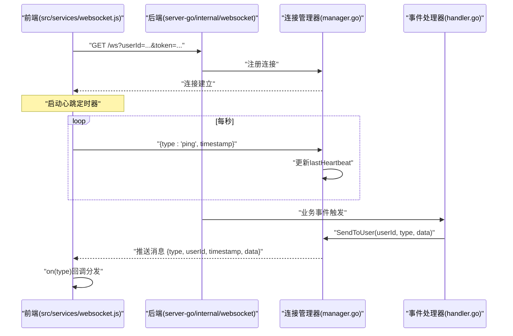
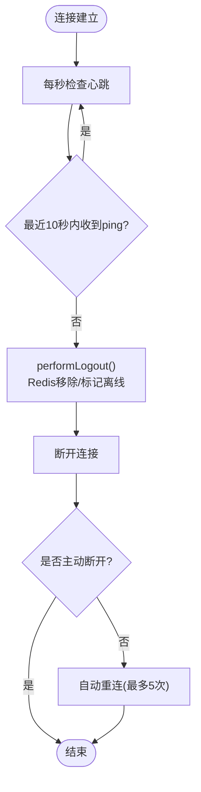
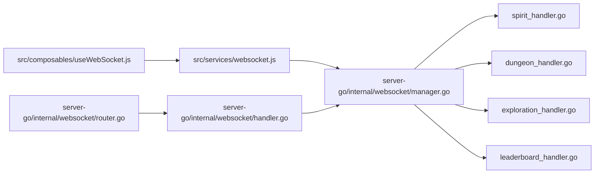

# 消息协议与数据格式

<cite>
**本文引用的文件**
- [handler.go](file://server-go/internal/websocket/handler.go)
- [router.go](file://server-go/internal/websocket/router.go)
- [manager.go](file://server-go/internal/websocket/manager.go)
- [spirit_handler.go](file://server-go/internal/websocket/spirit_handler.go)
- [dungeon_handler.go](file://server-go/internal/websocket/dungeon_handler.go)
- [exploration_handler.go](file://server-go/internal/websocket/exploration_handler.go)
- [leaderboard_handler.go](file://server-go/internal/websocket/leaderboard_handler.go)
- [websocket.js](file://src/services/websocket.js)
- [useWebSocket.js](file://src/composables/useWebSocket.js)
- [WebSocketDebug.vue](file://src/components/WebSocketDebug.vue)
- [WebSocket实现快速开始.md](file://WebSocket实现快速开始.md)
- [WebSocket改造完整实现指南.md](file://WebSocket改造完整实现指南.md)
- [HEARTBEAT_AND_LOGOUT_GUIDE.md](file://HEARTBEAT_AND_LOGOUT_GUIDE.md)
- [test-websocket.js](file://test-websocket.js)
</cite>

## 目录
1. [引言](#引言)
2. [项目结构](#项目结构)
3. [核心组件](#核心组件)
4. [架构总览](#架构总览)
5. [详细组件分析](#详细组件分析)
6. [依赖关系分析](#依赖关系分析)
7. [性能考量](#性能考量)
8. [故障排查指南](#故障排查指南)
9. [结论](#结论)
10. [附录](#附录)

## 引言
本文件定义 xiuxian-go WebSocket 通信的统一消息协议格式，确保前后端对消息结构、字段含义、序列化规则达成一致。所有消息均采用 JSON 结构，包含以下三个核心字段：
- type：事件类型，字符串，必填
- data：负载数据，对象或数组，必填
- timestamp：时间戳（秒），整数，必填

此外，客户端向服务器发送心跳时，消息结构为 { type: "ping", timestamp: 1702489200 }；服务器对心跳不做额外 data，仅在内部维护心跳状态。

## 项目结构
WebSocket 通信涉及前后端两部分：
- 前端：src/services/websocket.js 提供连接管理、消息收发、心跳与重连；src/composables/useWebSocket.js 提供 Vue 组合式 API；src/components/WebSocketDebug.vue 提供调试面板。
- 后端：server-go/internal/websocket 下的 manager.go、handler.go、router.go 以及各类事件处理器（spirit、dungeon、exploration、leaderboard）负责连接管理、消息路由与业务事件推送。

图表来源
- [router.go](file://server-go/internal/websocket/router.go#L1-L36)
- [handler.go](file://server-go/internal/websocket/handler.go#L1-L100)
- [manager.go](file://server-go/internal/websocket/manager.go#L1-L309)
- [spirit_handler.go](file://server-go/internal/websocket/spirit_handler.go#L1-L122)
- [dungeon_handler.go](file://server-go/internal/websocket/dungeon_handler.go#L1-L144)
- [exploration_handler.go](file://server-go/internal/websocket/exploration_handler.go#L1-L149)
- [leaderboard_handler.go](file://server-go/internal/websocket/leaderboard_handler.go#L1-L137)
- [websocket.js](file://src/services/websocket.js#L1-L313)
- [useWebSocket.js](file://src/composables/useWebSocket.js#L1-L319)
- [WebSocketDebug.vue](file://src/components/WebSocketDebug.vue#L1-L207)

章节来源
- [router.go](file://server-go/internal/websocket/router.go#L1-L36)
- [handler.go](file://server-go/internal/websocket/handler.go#L1-L100)
- [manager.go](file://server-go/internal/websocket/manager.go#L1-L309)
- [websocket.js](file://src/services/websocket.js#L1-L313)
- [useWebSocket.js](file://src/composables/useWebSocket.js#L1-L319)
- [WebSocketDebug.vue](file://src/components/WebSocketDebug.vue#L1-L207)

## 核心组件
- 前端 WebSocket 管理器（src/services/websocket.js）
  - 连接建立、消息收发、心跳发送、自动重连、事件订阅与分发
- 后端连接管理器（server-go/internal/websocket/manager.go）
  - 维护在线用户映射、消息广播、心跳检测与自动下线
- 事件处理器（server-go/internal/websocket/*.go）
  - 灵力增长、战斗事件、探索事件、排行榜更新
- 路由与升级（server-go/internal/websocket/router.go、handler.go）
  - /ws 升级端点与 /ws/stats 统计端点

章节来源
- [manager.go](file://server-go/internal/websocket/manager.go#L1-L309)
- [spirit_handler.go](file://server-go/internal/websocket/spirit_handler.go#L1-L122)
- [dungeon_handler.go](file://server-go/internal/websocket/dungeon_handler.go#L1-L144)
- [exploration_handler.go](file://server-go/internal/websocket/exploration_handler.go#L1-L149)
- [leaderboard_handler.go](file://server-go/internal/websocket/leaderboard_handler.go#L1-L137)
- [router.go](file://server-go/internal/websocket/router.go#L1-L36)
- [handler.go](file://server-go/internal/websocket/handler.go#L1-L100)

## 架构总览
WebSocket 通信链路如下：
- 前端通过 ws://host:3000/ws?userId=...&token=... 连接后端
- 后端将连接注册到连接管理器，启动读写循环
- 业务模块通过事件处理器向指定用户推送消息
- 前端订阅事件类型，接收并处理消息

图表来源
- [router.go](file://server-go/internal/websocket/router.go#L1-L36)
- [handler.go](file://server-go/internal/websocket/handler.go#L1-L100)
- [manager.go](file://server-go/internal/websocket/manager.go#L1-L309)
- [websocket.js](file://src/services/websocket.js#L1-L313)

## 详细组件分析

### 统一消息协议定义
- 字段说明
  - type：字符串，事件类型标识，如 "spirit:grow"、"dungeon:event"、"exploration:event"、"leaderboard:update"、"ping"
  - userId：整数，目标用户ID（服务器侧消息结构包含，前端消息结构不含）
  - data：对象或数组，具体业务负载
  - timestamp：整数，Unix 秒级时间戳
- 必填性
  - type、data、timestamp 为必填
  - userId 为服务器侧消息结构字段，用于路由到指定用户
- 序列化规则
  - 前端发送：JSON 字符串
  - 后端接收：JSON 解析为结构体
  - 心跳消息：type 为 "ping"，data 为空对象或省略，timestamp 为发送时间
- 错误处理与容错
  - 前端 onmessage 中 JSON.parse 失败时，应记录错误并避免崩溃
  - 后端 readLoop 中 ReadJSON 失败时，按异常关闭连接
  - 心跳超时后，后端执行自动下线逻辑，前端触发重连

章节来源
- [manager.go](file://server-go/internal/websocket/manager.go#L1-L309)
- [websocket.js](file://src/services/websocket.js#L1-L313)
- [HEARTBEAT_AND_LOGOUT_GUIDE.md](file://HEARTBEAT_AND_LOGOUT_GUIDE.md#L1-L252)

### 前端消息收发模式
- 连接建立
  - 构造 ws://host:3000/ws?userId=...&token=...
  - onopen 后启动心跳，触发 connection:open 事件
- 消息接收
  - onmessage 中 JSON.parse，按 type 分发到订阅回调
  - 未知 type 时记录警告
- 消息发送
  - send(message) 将消息 JSON.stringify 后发送
  - 心跳：每秒发送 { type: "ping", timestamp: Date.now() }
- 重连策略
  - onclose 且非主动断开时，按指数退避重连（最多5次）

章节来源
- [websocket.js](file://src/services/websocket.js#L1-L313)
- [useWebSocket.js](file://src/composables/useWebSocket.js#L1-L319)
- [WebSocketDebug.vue](file://src/components/WebSocketDebug.vue#L1-L207)

### 后端消息收发模式
- HTTP 升级
  - GET /ws?userId&token，校验参数后升级为 WebSocket
  - 注册连接至连接管理器
- 心跳处理
  - readLoop 识别 type="ping"，更新 lastHeartbeat 并延长读超时
- 消息广播
  - SendToUser(userId, type, data) 将消息封装为 {type, userId, timestamp, data} 广播
- 自动下线
  - writeLoop 每秒检查 lastHeartbeat 是否超时（默认10秒），超时则 performLogout()

章节来源
- [handler.go](file://server-go/internal/websocket/handler.go#L1-L100)
- [manager.go](file://server-go/internal/websocket/manager.go#L1-L309)
- [HEARTBEAT_AND_LOGOUT_GUIDE.md](file://HEARTBEAT_AND_LOGOUT_GUIDE.md#L1-L252)

### 事件类型与负载结构

#### 灵力增长（spirit:grow）
- 服务器 → 客户端
  - type: "spirit:grow"
  - data: 包含 userId、oldSpirit、newSpirit、gainAmount、spiritRate、elapsedSeconds、timestamp
- 示例（来自文档）
  - 服务器发送示例：参见“WebSocket改造完整实现指南.md”的“灵力增长”示例

章节来源
- [spirit_handler.go](file://server-go/internal/websocket/spirit_handler.go#L1-L122)
- [WebSocket改造完整实现指南.md](file://WebSocket改造完整实现指南.md#L215-L312)

#### 战斗事件（dungeon:event）
- 服务器 → 客户端
  - type: "dungeon:event"
  - data: 包含 eventType、dungeon、message、roundNum、playerHp、enemyHp、damageDealt、damageTaken、loot、timestamp
- 示例（来自文档）
  - 服务器发送示例：参见“WebSocket改造完整实现指南.md”的“战斗事件”示例

章节来源
- [dungeon_handler.go](file://server-go/internal/websocket/dungeon_handler.go#L1-L144)
- [WebSocket改造完整实现指南.md](file://WebSocket改造完整实现指南.md#L215-L312)

#### 排行榜更新（leaderboard:update）
- 服务器 → 客户端
  - type: "leaderboard:update"
  - data: 包含 type（full_refresh/update/rank_up/rank_down）、category（spirit/power/level）、updateTime、top10、userRank、timestamp
- 示例（来自文档）
  - 服务器发送示例：参见“WebSocket改造完整实现指南.md”的“排行榜更新”示例

章节来源
- [leaderboard_handler.go](file://server-go/internal/websocket/leaderboard_handler.go#L1-L137)
- [WebSocket改造完整实现指南.md](file://WebSocket改造完整实现指南.md#L215-L312)

#### 探索事件（exploration:event）
- 服务器 → 客户端
  - type: "exploration:event"
  - data: 包含 eventType、exploreName、message、progress、durationSecs、elapsedSecs、discovery、reward、errorMsg、timestamp
- 示例（来自文档）
  - 服务器发送示例：参见“WebSocket改造完整实现指南.md”的“探索事件”示例

章节来源
- [exploration_handler.go](file://server-go/internal/websocket/exploration_handler.go#L1-L149)
- [WebSocket改造完整实现指南.md](file://WebSocket改造完整实现指南.md#L215-L312)

#### 心跳（ping）
- 客户端 → 服务器
  - type: "ping"
  - data: {}
  - timestamp: 发送时间
- 服务器 → 客户端
  - 服务器不直接回复 "pong"，但会更新心跳时间并在超时后自动下线
- 示例（来自文档）
  - 客户端发送示例：参见“WebSocket改造完整实现指南.md”的“心跳机制”示例

章节来源
- [manager.go](file://server-go/internal/websocket/manager.go#L1-L309)
- [websocket.js](file://src/services/websocket.js#L1-L313)
- [HEARTBEAT_AND_LOGOUT_GUIDE.md](file://HEARTBEAT_AND_LOGOUT_GUIDE.md#L1-L252)
- [WebSocket改造完整实现指南.md](file://WebSocket改造完整实现指南.md#L313-L323)

### 心跳与自动下线流程

图表来源
- [manager.go](file://server-go/internal/websocket/manager.go#L1-L309)
- [HEARTBEAT_AND_LOGOUT_GUIDE.md](file://HEARTBEAT_AND_LOGOUT_GUIDE.md#L1-L252)

## 依赖关系分析
- 前端依赖
  - wsManager 作为单例，集中管理连接、心跳、重连与事件分发
  - useWebSocket.js 通过订阅事件类型与回调，将消息映射到组件状态
- 后端依赖
  - router.go 注册 /ws 与 /ws/stats
  - handler.go 负责 HTTP 升级与统计
  - manager.go 统一管理连接、心跳与广播
  - 各事件处理器通过 manager.SendToUser 将消息推送给指定用户

图表来源
- [router.go](file://server-go/internal/websocket/router.go#L1-L36)
- [handler.go](file://server-go/internal/websocket/handler.go#L1-L100)
- [manager.go](file://server-go/internal/websocket/manager.go#L1-L309)
- [websocket.js](file://src/services/websocket.js#L1-L313)
- [useWebSocket.js](file://src/composables/useWebSocket.js#L1-L319)

章节来源
- [router.go](file://server-go/internal/websocket/router.go#L1-L36)
- [handler.go](file://server-go/internal/websocket/handler.go#L1-L100)
- [manager.go](file://server-go/internal/websocket/manager.go#L1-L309)
- [websocket.js](file://src/services/websocket.js#L1-L313)
- [useWebSocket.js](file://src/composables/useWebSocket.js#L1-L319)

## 性能考量
- 心跳与超时
  - 前端每秒发送一次 ping，后端默认10秒超时，writeLoop 每秒检查一次
- 消息队列
  - 广播通道与发送通道均有容量，避免阻塞；队列满时记录警告
- 重连策略
  - 最多重连5次，延迟按尝试次数递增
- 建议
  - 业务事件发送频率受控，避免消息队列溢出
  - 前端订阅粒度合理，避免过多事件导致 UI 频繁更新

章节来源
- [manager.go](file://server-go/internal/websocket/manager.go#L1-L309)
- [websocket.js](file://src/services/websocket.js#L1-L313)
- [WebSocket实现快速开始.md](file://WebSocket实现快速开始.md#L180-L200)

## 故障排查指南
- 连接失败
  - 检查 userId 与 token 参数是否正确传递
  - 查看后端日志与前端控制台错误
- 无法接收消息
  - 确认连接已建立（isConnected）
  - 确认已订阅对应事件类型
  - 检查后端是否成功发送
- 心跳超时自动下线
  - 前端每秒发送 ping，若后端10秒未收到则自动下线
  - 检查网络与防火墙，确认 WebSocket 升级与代理配置正确
- 重连问题
  - 非主动断开时会自动重连，查看重连次数与延迟
- 测试验证
  - 使用 test-websocket.js 连接并观察消息接收情况

章节来源
- [test-websocket.js](file://test-websocket.js#L1-L205)
- [HEARTBEAT_AND_LOGOUT_GUIDE.md](file://HEARTBEAT_AND_LOGOUT_GUIDE.md#L1-L252)
- [WebSocket实现快速开始.md](file://WebSocket实现快速开始.md#L230-L249)

## 结论
本协议以 JSON 为核心载体，统一了 type、data、timestamp 三要素，明确了心跳与自动下线机制，前后端通过订阅/分发模型实现事件驱动的实时通信。建议在生产环境中：
- 前端：完善 JSON 解析错误处理与事件清理
- 后端：完善 token 校验与消息格式校验
- 运维：配置 Nginx WebSocket 升级与超时参数

## 附录

### 字段定义与示例
- 统一消息结构
  - type: "string"，必填
  - data: "object/array"，必填
  - timestamp: "number"，必填
- 心跳消息
  - 客户端发送：{ type: "ping", timestamp: 1702489200 }
- 事件示例（摘自文档）
  - 灵力增长：参见“WebSocket改造完整实现指南.md”的“灵力增长”示例
  - 战斗事件：参见“WebSocket改造完整实现指南.md”的“战斗事件”示例
  - 排行榜更新：参见“WebSocket改造完整实现指南.md”的“排行榜更新”示例
  - 探索事件：参见“WebSocket改造完整实现指南.md”的“探索事件”示例
  - 心跳机制：参见“WebSocket改造完整实现指南.md”的“心跳机制”示例

章节来源
- [WebSocket改造完整实现指南.md](file://WebSocket改造完整实现指南.md#L215-L323)