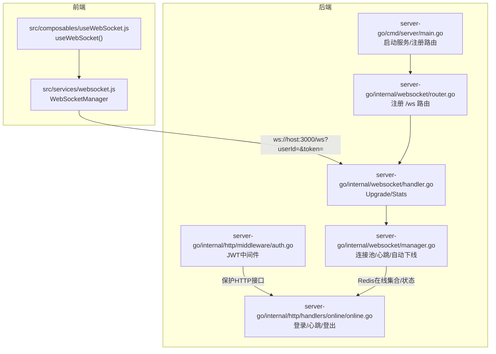
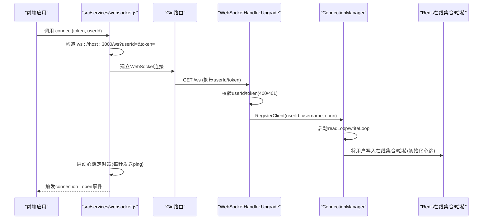
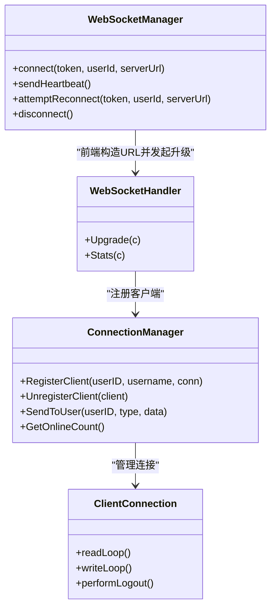

# 连接管理与认证

<cite>
**本文引用的文件**
- [server-go/cmd/server/main.go](file://server-go/cmd/server/main.go)
- [server-go/internal/websocket/router.go](file://server-go/internal/websocket/router.go)
- [server-go/internal/websocket/handler.go](file://server-go/internal/websocket/handler.go)
- [server-go/internal/websocket/manager.go](file://server-go/internal/websocket/manager.go)
- [src/services/websocket.js](file://src/services/websocket.js)
- [src/composables/useWebSocket.js](file://src/composables/useWebSocket.js)
- [server-go/internal/http/middleware/auth.go](file://server-go/internal/http/middleware/auth.go)
- [server-go/internal/http/handlers/online/online.go](file://server-go/internal/http/handlers/online/online.go)
- [HEARTBEAT_AND_LOGOUT_GUIDE.md](file://HEARTBEAT_AND_LOGOUT_GUIDE.md)
</cite>

## 目录
1. [简介](#简介)
2. [项目结构](#项目结构)
3. [核心组件](#核心组件)
4. [架构总览](#架构总览)
5. [详细组件分析](#详细组件分析)
6. [依赖关系分析](#依赖关系分析)
7. [性能考量](#性能考量)
8. [故障排查指南](#故障排查指南)
9. [结论](#结论)

## 简介
本文围绕 xiuxian-go 的 WebSocket 连接建立与认证流程展开，重点说明：
- 前端如何通过 userId 和 token 在连接 URL 中传递参数进行身份验证
- 后端 manager.go 如何管理客户端连接池
- router.go 如何注册 WebSocket 路由
- 连接初始化时的鉴权逻辑：后端验证 token 有效性，并将用户状态写入 Redis 在线集合
- 结合 HEARTBEAT_AND_LOGOUT_GUIDE.md 文档，说明连接关闭或异常断开时的资源清理机制：从连接池移除客户端、更新 Redis 在线状态、触发登出回调
- 提供连接建立失败的常见错误码（如 401 未授权、400 参数缺失）及处理建议

## 项目结构
WebSocket 相关代码主要分布在以下位置：
- 后端：server-go/internal/websocket/*（路由、处理器、连接管理器）
- 前端：src/services/websocket.js、src/composables/useWebSocket.js
- 认证中间件：server-go/internal/http/middleware/auth.go
- 在线状态与心跳/登出接口：server-go/internal/http/handlers/online/online.go
- 心跳与自动下线指南：HEARTBEAT_AND_LOGOUT_GUIDE.md
- 服务入口：server-go/cmd/server/main.go（注册路由、启动 WebSocket 管理器）

图表来源
- [server-go/cmd/server/main.go](file://server-go/cmd/server/main.go#L60-L106)
- [server-go/internal/websocket/router.go](file://server-go/internal/websocket/router.go#L8-L17)
- [server-go/internal/websocket/handler.go](file://server-go/internal/websocket/handler.go#L37-L73)
- [server-go/internal/websocket/manager.go](file://server-go/internal/websocket/manager.go#L107-L160)
- [server-go/internal/http/middleware/auth.go](file://server-go/internal/http/middleware/auth.go#L18-L75)
- [server-go/internal/http/handlers/online/online.go](file://server-go/internal/http/handlers/online/online.go#L24-L110)

章节来源
- [server-go/cmd/server/main.go](file://server-go/cmd/server/main.go#L60-L106)
- [server-go/internal/websocket/router.go](file://server-go/internal/websocket/router.go#L8-L17)

## 核心组件
- WebSocket 路由注册：router.go 将 /ws 与 Upgrade 处理器绑定，并提供 /ws/stats 统计接口。
- WebSocket 处理器：handler.go 从查询参数读取 userId 与 token，校验后升级为 WebSocket，随后交由连接管理器注册。
- 连接管理器：manager.go 维护连接池（按 userID 映射）、广播消息、心跳检测与自动下线。
- 前端 WebSocket 管理：src/services/websocket.js 构造 ws URL、发送心跳、断线重连；src/composables/useWebSocket.js 提供 Vue 组合式 API。
- 认证中间件：auth.go 提供基于 Authorization 头的 JWT 校验（用于 HTTP 接口保护）。
- 在线状态与心跳/登出：online.go 提供 /api/online/login、/api/online/heartbeat、/api/online/logout，负责 Redis 在线集合与状态维护。

章节来源
- [server-go/internal/websocket/router.go](file://server-go/internal/websocket/router.go#L8-L17)
- [server-go/internal/websocket/handler.go](file://server-go/internal/websocket/handler.go#L37-L73)
- [server-go/internal/websocket/manager.go](file://server-go/internal/websocket/manager.go#L107-L160)
- [src/services/websocket.js](file://src/services/websocket.js#L36-L96)
- [src/composables/useWebSocket.js](file://src/composables/useWebSocket.js#L21-L33)
- [server-go/internal/http/middleware/auth.go](file://server-go/internal/http/middleware/auth.go#L18-L75)
- [server-go/internal/http/handlers/online/online.go](file://server-go/internal/http/handlers/online/online.go#L24-L110)

## 架构总览
WebSocket 连接建立与认证的整体流程如下：

图表来源
- [src/services/websocket.js](file://src/services/websocket.js#L36-L96)
- [server-go/internal/websocket/handler.go](file://server-go/internal/websocket/handler.go#L37-L73)
- [server-go/internal/websocket/manager.go](file://server-go/internal/websocket/manager.go#L107-L160)
- [server-go/internal/http/handlers/online/online.go](file://server-go/internal/http/handlers/online/online.go#L24-L110)

## 详细组件分析

### WebSocket 路由注册（router.go）
- 注册 /ws 升级端点与 /ws/stats 统计端点
- 初始化所有事件处理器（灵力、副本、排行榜、探索）

章节来源
- [server-go/internal/websocket/router.go](file://server-go/internal/websocket/router.go#L8-L17)
- [server-go/internal/websocket/router.go](file://server-go/internal/websocket/router.go#L19-L36)

### WebSocket 处理器（handler.go）
- 从查询参数读取 userId 与 token
- 校验参数缺失或非法时返回 400
- 解析 userId 为整数，若失败返回 400
- 从上下文获取 username（通常由 HTTP 认证中间件设置）
- 升级为 WebSocket 并交由连接管理器注册
- 提供 /ws/stats 返回在线人数

章节来源
- [server-go/internal/websocket/handler.go](file://server-go/internal/websocket/handler.go#L37-L73)
- [server-go/internal/websocket/handler.go](file://server-go/internal/websocket/handler.go#L75-L87)

### 连接管理器（manager.go）
- 连接池：map[uint]*ClientConnection，按 userID 管理
- 注册/注销：通过 register/unregister channel 实现 goroutine 安全
- 广播：broadcast channel 将消息投递给指定用户
- 心跳：ClientConnection 维护 lastHeartbeat 与 heartbeatTimeout（10s）
- 自动下线：writeLoop 每秒检查超时，超时后执行 performLogout
- performLogout：更新数据库 LastSpiritGainTime、Redis 哈希状态为 offline、从在线集合移除玩家ID

章节来源
- [server-go/internal/websocket/manager.go](file://server-go/internal/websocket/manager.go#L107-L160)
- [server-go/internal/websocket/manager.go](file://server-go/internal/websocket/manager.go#L170-L220)
- [server-go/internal/websocket/manager.go](file://server-go/internal/websocket/manager.go#L222-L256)
- [server-go/internal/websocket/manager.go](file://server-go/internal/websocket/manager.go#L258-L309)

### 前端 WebSocket 管理（src/services/websocket.js）
- 构造 ws URL，携带 userId 与 token
- onopen 启动心跳定时器，onmessage 分发消息类型到监听器
- onclose 触发 connection:close 事件；非主动断开时尝试重连（最多5次，延迟递增）
- 提供 subscribe* 与 subscribeConnectionEvent 事件订阅

章节来源
- [src/services/websocket.js](file://src/services/websocket.js#L36-L96)
- [src/services/websocket.js](file://src/services/websocket.js#L99-L173)
- [src/services/websocket.js](file://src/services/websocket.js#L174-L206)
- [src/services/websocket.js](file://src/services/websocket.js#L207-L238)
- [src/services/websocket.js](file://src/services/websocket.js#L239-L264)

### 前端组合式 API（src/composables/useWebSocket.js）
- useWebSocket() 提供 initWebSocket、watchConnectionStatus、disconnect 等能力
- 将 wsManager 的连接状态与各类事件订阅暴露给 Vue 组件

章节来源
- [src/composables/useWebSocket.js](file://src/composables/useWebSocket.js#L21-L33)
- [src/composables/useWebSocket.js](file://src/composables/useWebSocket.js#L75-L105)
- [src/composables/useWebSocket.js](file://src/composables/useWebSocket.js#L120-L136)

### 认证中间件（auth.go）
- 从 Authorization 头解析 Bearer Token
- 使用 JWT_SECRET 校验 JWT，失败返回 401
- 成功后将 userID 写入上下文，供后续 handler 使用

章节来源
- [server-go/internal/http/middleware/auth.go](file://server-go/internal/http/middleware/auth.go#L18-L75)

### 在线状态与心跳/登出（online.go）
- Login：初始化 Redis 哈希字段（loginTime/lastHeartbeat/status/ip），设置过期时间，加入 server:online:players 集合
- Heartbeat：更新 Redis 哈希的 lastHeartbeat 字段并延长过期
- Logout：删除 Redis 哈希 key，从在线集合移除玩家ID

章节来源
- [server-go/internal/http/handlers/online/online.go](file://server-go/internal/http/handlers/online/online.go#L24-L110)
- [server-go/internal/http/handlers/online/online.go](file://server-go/internal/http/handlers/online/online.go#L112-L185)
- [server-go/internal/http/handlers/online/online.go](file://server-go/internal/http/handlers/online/online.go#L188-L253)

### 心跳与自动下线（HEARTBEAT_AND_LOGOUT_GUIDE.md）
- 前端每秒发送 ping 消息
- 后端 readLoop 收到 ping 后更新 lastHeartbeat 并延长读超时
- writeLoop 每秒检查超时（10s），超时后 performLogout 清理 Redis 在线状态并断开连接

章节来源
- [HEARTBEAT_AND_LOGOUT_GUIDE.md](file://HEARTBEAT_AND_LOGOUT_GUIDE.md#L1-L62)
- [HEARTBEAT_AND_LOGOUT_GUIDE.md](file://HEARTBEAT_AND_LOGOUT_GUIDE.md#L63-L133)
- [HEARTBEAT_AND_LOGOUT_GUIDE.md](file://HEARTBEAT_AND_LOGOUT_GUIDE.md#L133-L211)

## 依赖关系分析

图表来源
- [server-go/internal/websocket/handler.go](file://server-go/internal/websocket/handler.go#L37-L73)
- [server-go/internal/websocket/manager.go](file://server-go/internal/websocket/manager.go#L107-L160)
- [src/services/websocket.js](file://src/services/websocket.js#L36-L96)

章节来源
- [server-go/internal/websocket/handler.go](file://server-go/internal/websocket/handler.go#L37-L73)
- [server-go/internal/websocket/manager.go](file://server-go/internal/websocket/manager.go#L107-L160)
- [src/services/websocket.js](file://src/services/websocket.js#L36-L96)

## 性能考量
- 连接池并发安全：使用互斥锁与通道管理注册/注销，避免竞态
- 广播队列容量：广播/发送队列容量适中，防止内存膨胀；队列满时记录告警
- 心跳检测频率：后端每秒检查一次，前端每秒发送一次，平衡实时性与开销
- Redis 操作：在线集合与哈希字段更新均在关键路径上，需确保 Redis 可用性与延迟可控

[本节为通用指导，不直接分析具体文件]

## 故障排查指南

### 连接建立失败的常见错误码
- 400 参数缺失或非法
  - 现象：后端返回缺少 userId 或 token，或 userId 非法
  - 原因：前端未传参或传入非数字
  - 建议：确认前端构造 ws URL 时包含 userId 与 token，且 userId 为合法数字
- 401 未授权
  - 现象：HTTP 接口返回 401
  - 原因：Authorization 头缺失或 JWT 校验失败
  - 建议：检查 JWT_SECRET 是否配置，Token 是否有效
- 500 服务器内部错误
  - 现象：Redis 写入失败或数据库更新失败
  - 建议：检查 Redis 与数据库连接状态，查看日志定位具体错误

章节来源
- [server-go/internal/websocket/handler.go](file://server-go/internal/websocket/handler.go#L37-L73)
- [server-go/internal/http/middleware/auth.go](file://server-go/internal/http/middleware/auth.go#L18-L75)
- [server-go/internal/http/handlers/online/online.go](file://server-go/internal/http/handlers/online/online.go#L24-L110)

### 心跳与自动下线相关问题
- 现象：连接被自动下线
  - 原因：前端未持续发送 ping 或网络异常导致后端 10 秒未收到心跳
  - 建议：确认前端心跳定时器正常运行，检查网络稳定性
- 现象：Redis 在线集合未移除或状态未更新
  - 原因：performLogout 执行失败
  - 建议：查看后端日志，确认 Redis 操作成功；必要时手动清理

章节来源
- [server-go/internal/websocket/manager.go](file://server-go/internal/websocket/manager.go#L222-L256)
- [server-go/internal/websocket/manager.go](file://server-go/internal/websocket/manager.go#L258-L309)
- [HEARTBEAT_AND_LOGOUT_GUIDE.md](file://HEARTBEAT_AND_LOGOUT_GUIDE.md#L133-L211)

### 断线重连与资源清理
- 前端：非主动断开时自动重连（最多5次，延迟递增）
- 后端：readLoop 异常关闭时从连接池移除客户端，writeLoop 超时自动下线并清理 Redis
- 登出回调：后端 performLogout 会更新数据库与 Redis，在线集合移除玩家ID

章节来源
- [src/services/websocket.js](file://src/services/websocket.js#L207-L238)
- [server-go/internal/websocket/manager.go](file://server-go/internal/websocket/manager.go#L170-L220)
- [server-go/internal/websocket/manager.go](file://server-go/internal/websocket/manager.go#L258-L309)

## 结论
- 前端通过 ws URL 传递 userId 与 token，后端在 /ws 升级时进行参数校验
- 连接管理器负责连接池管理、消息广播与心跳检测，10 秒未收到心跳即自动下线
- 自动下线时，后端会更新数据库与 Redis 在线状态，并从在线集合移除玩家
- 前端在断线时进行重连，确保服务可用性
- 若出现 400/401/500 错误，应优先检查参数合法性、JWT 校验与 Redis/数据库可用性