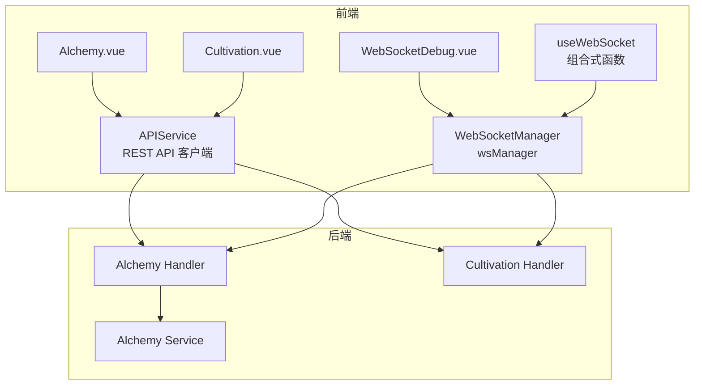
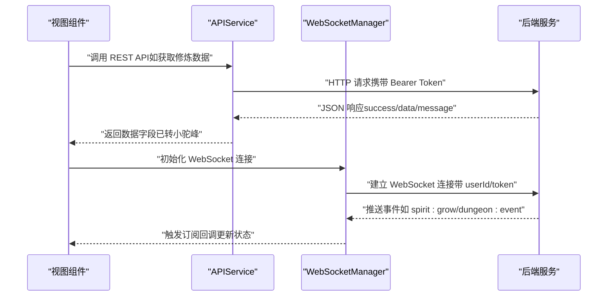
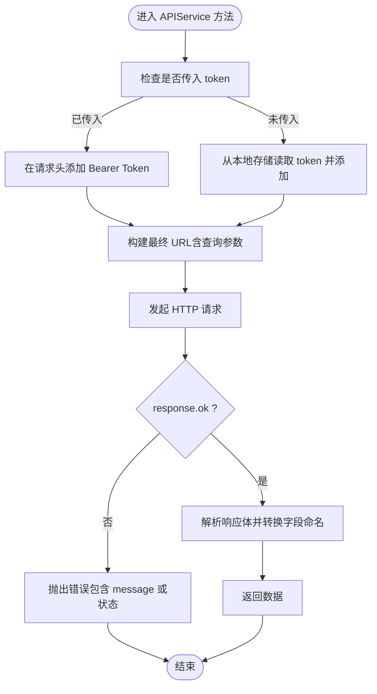
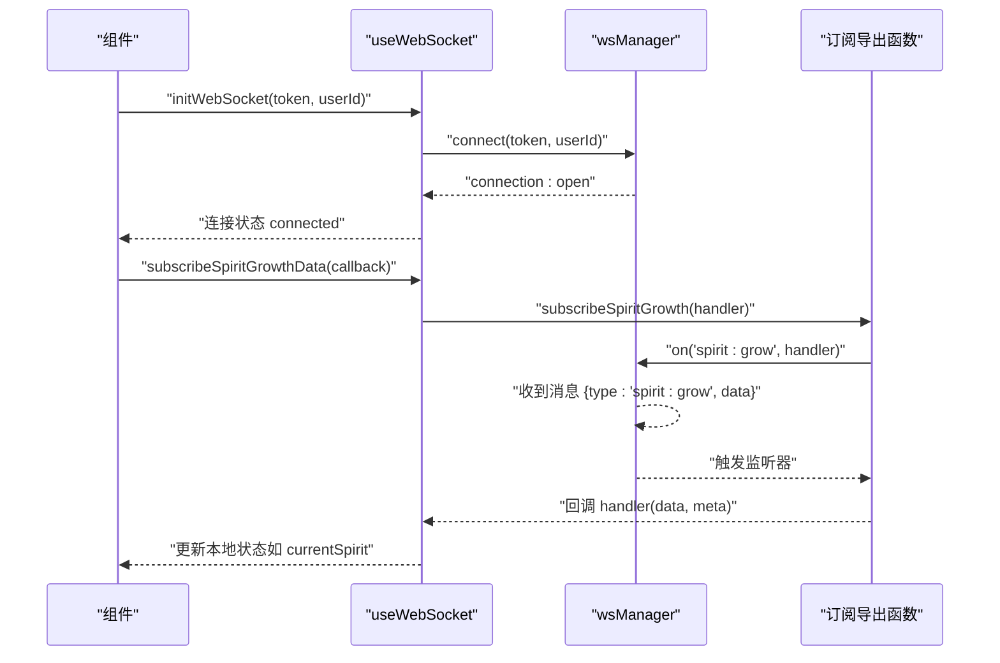
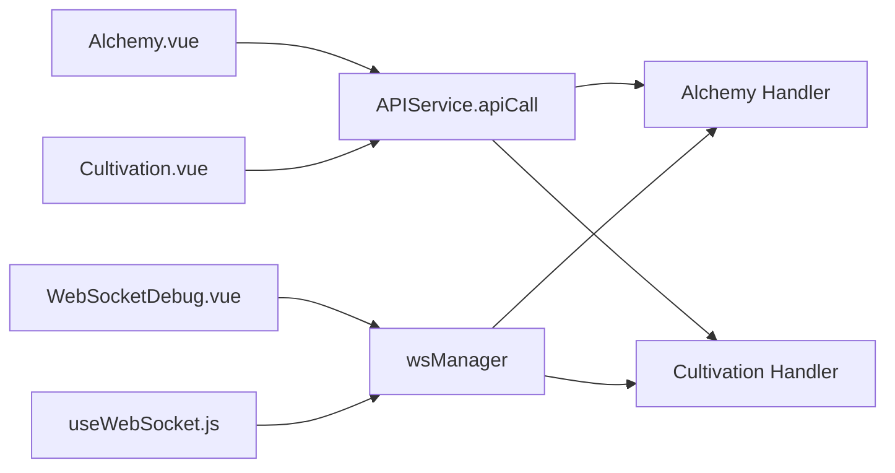

# API客户端与服务层

<cite>
**本文引用的文件**
- [api.js](file://src/services/api.js)
- [websocket.js](file://src/services/websocket.js)
- [useWebSocket.js](file://src/composables/useWebSocket.js)
- [Alchemy.vue](file://src/views/Alchemy.vue)
- [Cultivation.vue](file://src/views/Cultivation.vue)
- [WebSocketDebug.vue](file://src/components/WebSocketDebug.vue)
- [test-websocket.js](file://test-websocket.js)
- [WebSocket改造完整实现指南.md](file://WebSocket改造完整实现指南.md)
- [WebSocket实现快速开始.md](file://WebSocket实现快速开始.md)
- [Alchemy Handler](file://server-go/internal/http/handlers/alchemy/alchemy.go)
- [Alchemy Service](file://server-go/internal/alchemy/service.go)
- [Cultivation Handler](file://server-go/internal/http/handlers/cultivation/cultivation.go)
</cite>

## 目录
1. [简介](#简介)
2. [项目结构](#项目结构)
3. [核心组件](#核心组件)
4. [架构总览](#架构总览)
5. [详细组件分析](#详细组件分析)
6. [依赖关系分析](#依赖关系分析)
7. [性能考量](#性能考量)
8. [故障排查指南](#故障排查指南)
9. [结论](#结论)
10. [附录](#附录)

## 简介
本文件系统性地文档化前端与后端的通信机制，重点围绕以下两个方面：
- 基于原生 fetch 的 RESTful API 客户端（APIService），说明其基础实例、认证令牌传递、错误统一处理与常用 API 方法（如获取修炼数据、炼丹相关接口等）。
- 基于自研 WebSocket 管理器的服务层与组合式函数，说明如何初始化连接、消息路由、心跳保活与重连策略，并给出在组件中调用 API 与 WebSocket 的实践示例与异步响应处理流程。

## 项目结构
前端通信相关的核心文件分布如下：
- 服务层（REST API 客户端）：src/services/api.js
- WebSocket 管理器与订阅导出：src/services/websocket.js
- 组合式函数（useWebSocket）：src/composables/useWebSocket.js
- 示例组件（Alchemy、Cultivation、WebSocketDebug）：src/views/Alchemy.vue、src/views/Cultivation.vue、src/components/WebSocketDebug.vue
- WebSocket 功能测试脚本：test-websocket.js
- 文档与指南：WebSocket改造完整实现指南.md、WebSocket实现快速开始.md
- 后端 API 实现（Alchemy、Cultivation）：server-go/internal/http/handlers/alchemy/alchemy.go、server-go/internal/http/handlers/cultivation/cultivation.go；业务服务：server-go/internal/alchemy/service.go

图表来源
- [api.js](file://src/services/api.js#L1-L1131)
- [websocket.js](file://src/services/websocket.js#L1-L313)
- [useWebSocket.js](file://src/composables/useWebSocket.js#L1-L319)
- [Alchemy.vue](file://src/views/Alchemy.vue#L110-L219)
- [Cultivation.vue](file://src/views/Cultivation.vue#L90-L245)
- [WebSocketDebug.vue](file://src/components/WebSocketDebug.vue#L1-L207)
- [Alchemy Handler](file://server-go/internal/http/handlers/alchemy/alchemy.go#L1-L188)
- [Alchemy Service](file://server-go/internal/alchemy/service.go#L226-L669)
- [Cultivation Handler](file://server-go/internal/http/handlers/cultivation/cultivation.go#L99-L121)

章节来源
- [api.js](file://src/services/api.js#L1-L1131)
- [websocket.js](file://src/services/websocket.js#L1-L313)
- [useWebSocket.js](file://src/composables/useWebSocket.js#L1-L319)
- [Alchemy.vue](file://src/views/Alchemy.vue#L110-L219)
- [Cultivation.vue](file://src/views/Cultivation.vue#L90-L245)
- [WebSocketDebug.vue](file://src/components/WebSocketDebug.vue#L1-L207)

## 核心组件
- APIService（REST API 客户端）
  - 提供认证（注册/登录/获取用户）、在线状态（登录/登出/心跳）、玩家数据（获取/增量更新/删除物品/宠物）、装备系统（列表/详情/强化/洗练/确认/穿戴/卸下/出售/批量出售）、灵宠系统（出战/召回/升级/升星/批量放生）、排行榜、抽奖系统、通用 apiCall/get/post/put/delete 方法，以及获取修炼数据等。
  - 统一字段命名转换（后端字段转小驼峰），并提供错误抛出与统一处理。
- WebSocketManager（WebSocket 管理器）
  - 负责连接建立、消息分发、心跳保活、断线重连、事件订阅与取消订阅、连接状态查询。
- useWebSocket（组合式函数）
  - 对外暴露连接初始化、订阅事件、连接状态监听、断开连接、状态查询等能力，并提供针对不同业务场景的状态管理（灵力增长、战斗事件、排行榜、探索事件）。

章节来源
- [api.js](file://src/services/api.js#L1-L1131)
- [websocket.js](file://src/services/websocket.js#L1-L313)
- [useWebSocket.js](file://src/composables/useWebSocket.js#L1-L319)

## 架构总览
前端通过 APIService 与后端 REST API 交互，通过 WebSocketManager 与后端 WebSocket 通道交互。组件通过组合式函数 useWebSocket 管理连接与订阅，实现事件驱动的状态更新。

图表来源
- [api.js](file://src/services/api.js#L1067-L1128)
- [websocket.js](file://src/services/websocket.js#L30-L120)
- [useWebSocket.js](file://src/composables/useWebSocket.js#L10-L33)

## 详细组件分析

### REST API 客户端：APIService
- 基础实例与基础路径
  - 使用常量定义基础路径，所有 API 方法均以该前缀拼接端点。
- 认证令牌（Bearer Token）
  - 在需要鉴权的 GET/POST/PUT/DELETE 方法中，优先显式传入 token；若未传入则尝试从本地存储读取。
  - 统一在请求头中附加 Authorization: Bearer <token>。
- 错误统一处理
  - 对非 OK 响应抛出错误，错误信息包含后端 message 或状态描述。
  - 对部分接口采用 response.ok 校验与文本回退解析，保证健壮性。
- 字段命名转换
  - 提供通用转换函数，将后端返回的大写首字母字段映射为小驼峰，便于前端消费。
- 关键 API 方法与参数结构
  - 获取修炼数据：getCultivationData(token)
    - 用途：拉取当前玩家的修炼消耗、获得、境界等数据。
    - 参数：token（可选，内部会尝试从本地存储读取）。
    - 返回：包含 success/data/message 的对象，data 中字段已转小驼峰。
    - 参考路径：[api.js](file://src/services/api.js#L1067-L1087)
  - 炼丹相关（Alchemy）
    - 初始化/获取配方列表：apiCall('/api/alchemy/recipes', { method: 'GET', params: { playerLevel } })
      - 用途：获取所有配方列表与玩家统计。
      - 参数：playerLevel（查询参数）。
      - 返回：success/data.recipes。
      - 参考路径：[Alchemy.vue](file://src/views/Alchemy.vue#L110-L129)
    - 炼制丹药：apiCall('/api/alchemy/craft', { method: 'POST', data: { recipeId, playerLevel, unlockedRecipes, inventoryHerbs, luck, alchemyRate } })
      - 用途：调用后端进行炼制，返回成功率与结果。
      - 参数：recipeId、playerLevel、unlockedRecipes、inventoryHerbs、luck、alchemyRate。
      - 返回：success/data。
      - 参考路径：[Alchemy.vue](file://src/views/Alchemy.vue#L174-L219)
    - 后端接口定义参考：
      - [Alchemy Handler](file://server-go/internal/http/handlers/alchemy/alchemy.go#L1-L188)
      - [Alchemy Service](file://server-go/internal/alchemy/service.go#L226-L669)
  - 通用 API 调用：apiCall(url, options)
    - 用途：支持 GET/POST/PUT/PATCH/DELETE，自动拼接查询参数与请求体。
    - 参数：options.method、headers、params、body。
    - 返回：success/data/message，data 字段已转小驼峰。
    - 参考路径：[api.js](file://src/services/api.js#L866-L902)
  - 通用 GET/POST/PUT/DELETE：get/post/put/delete
    - 用途：便捷封装，自动处理 Authorization 与响应解析。
    - 参考路径：[api.js](file://src/services/api.js#L941-L1065)

图表来源
- [api.js](file://src/services/api.js#L904-L1065)

章节来源
- [api.js](file://src/services/api.js#L1-L1131)
- [Alchemy.vue](file://src/views/Alchemy.vue#L110-L219)
- [Alchemy Handler](file://server-go/internal/http/handlers/alchemy/alchemy.go#L1-L188)
- [Alchemy Service](file://server-go/internal/alchemy/service.go#L226-L669)

### WebSocket 服务层：WebSocketManager 与 useWebSocket
- WebSocketManager（wsManager）
  - 连接建立：connect(token, userId, serverUrl?)
    - 构造 ws/wss URL，附加 userId 与 token 查询参数。
    - onopen：标记连接成功、启动心跳、触发 connection:open 事件。
    - onmessage：解析 JSON 并按 type 分发给对应监听器。
    - onerror/onclose：记录错误/关闭，触发相应事件；若非主动断开则尝试重连。
    - 参考路径：[websocket.js](file://src/services/websocket.js#L30-L120)
  - 心跳保活：sendHeartbeat/send（每秒 ping）、startHeartbeat/stopHeartbeat
    - 参考路径：[websocket.js](file://src/services/websocket.js#L174-L205)
  - 重连机制：attemptReconnect（指数退避，最多尝试若干次）
    - 参考路径：[websocket.js](file://src/services/websocket.js#L207-L223)
  - 事件订阅：on/off（订阅/取消订阅）、emit（触发事件）
    - 参考路径：[websocket.js](file://src/services/websocket.js#L130-L173)
  - 连接状态：getConnectionStatus/isConnected/url/reconnectAttempts
    - 参考路径：[websocket.js](file://src/services/websocket.js#L254-L264)
- useWebSocket（组合式函数）
  - 初始化连接：initWebSocket(token, userId)
  - 订阅事件：subscribeSpiritGrowthData/subscribeDungeonEventData/subscribeLeaderboardUpdateData/subscribeExplorationEventData
  - 连接状态监听：watchConnectionStatus(callback)
  - 断开连接：disconnect()
  - 状态查询：getStatus()
  - 参考路径：[useWebSocket.js](file://src/composables/useWebSocket.js#L10-L135)
- 业务状态管理（组合式函数）
  - useSpiritGrowth：维护灵力增长历史、累计获得、当前灵力。
  - useDungeonCombat：维护战斗日志、当前副本、战斗状态。
  - useLeaderboard：维护排行榜 top10 与用户排名。
  - useExploration：维护探索日志、进度与状态。
  - 参考路径：[useWebSocket.js](file://src/composables/useWebSocket.js#L138-L319)

图表来源
- [useWebSocket.js](file://src/composables/useWebSocket.js#L10-L135)
- [websocket.js](file://src/services/websocket.js#L130-L173)

章节来源
- [websocket.js](file://src/services/websocket.js#L1-L313)
- [useWebSocket.js](file://src/composables/useWebSocket.js#L1-L319)

### 在组件中调用 API 与 WebSocket 的实践示例
- 调用 REST API（Alchemy）
  - 初始化配方列表：调用 apiCall('/api/alchemy/recipes', { method: 'GET', params: { playerLevel } })。
  - 炼制丹药：调用 apiCall('/api/alchemy/craft', { method: 'POST', data: { recipeId, playerLevel, unlockedRecipes, inventoryHerbs, luck, alchemyRate } })。
  - 参考路径：[Alchemy.vue](file://src/views/Alchemy.vue#L110-L219)
- 调用 REST API（Cultivation）
  - 单次修炼：post('/cultivation/single', {}, token)
  - 一键突破：post('/cultivation/breakthrough', {}, token)
  - 同步修炼数据：getCultivationData(token)
  - 参考路径：[Cultivation.vue](file://src/views/Cultivation.vue#L90-L245)
- 使用 WebSocket（调试面板）
  - 连接/断开：WebSocketDebug.vue 中通过 wsManager.connect/disconnect 控制。
  - 订阅消息：在 mounted 中对 spirit:grow/dungeon:event/leaderboard:update/exploration:event 订阅并更新最近消息与统计。
  - 参考路径：[WebSocketDebug.vue](file://src/components/WebSocketDebug.vue#L1-L207)

章节来源
- [Alchemy.vue](file://src/views/Alchemy.vue#L110-L219)
- [Cultivation.vue](file://src/views/Cultivation.vue#L90-L245)
- [WebSocketDebug.vue](file://src/components/WebSocketDebug.vue#L1-L207)

## 依赖关系分析
- 组件依赖
  - Alchemy.vue 依赖 APIService.apiCall 与后端 Alchemy Handler/Service。
  - Cultivation.vue 依赖 APIService.post/put/get 与后端 Cultivation Handler。
  - WebSocketDebug.vue 依赖 wsManager 与 useWebSocket 的订阅导出。
- 服务层依赖
  - APIService 依赖浏览器原生 fetch 与本地存储（authToken）。
  - WebSocketManager 依赖浏览器 WebSocket、定时器与事件分发。
- 后端依赖
  - Alchemy Handler/Service 提供配方列表、炼制结果与用户统计。
  - Cultivation Handler 提供修炼消耗、获得与突破逻辑。

图表来源
- [Alchemy.vue](file://src/views/Alchemy.vue#L110-L219)
- [Cultivation.vue](file://src/views/Cultivation.vue#L90-L245)
- [WebSocketDebug.vue](file://src/components/WebSocketDebug.vue#L1-L207)
- [api.js](file://src/services/api.js#L866-L1128)
- [websocket.js](file://src/services/websocket.js#L1-L313)
- [Alchemy Handler](file://server-go/internal/http/handlers/alchemy/alchemy.go#L1-L188)
- [Cultivation Handler](file://server-go/internal/http/handlers/cultivation/cultivation.go#L99-L121)

章节来源
- [Alchemy.vue](file://src/views/Alchemy.vue#L110-L219)
- [Cultivation.vue](file://src/views/Cultivation.vue#L90-L245)
- [WebSocketDebug.vue](file://src/components/WebSocketDebug.vue#L1-L207)
- [api.js](file://src/services/api.js#L1-L1131)
- [websocket.js](file://src/services/websocket.js#L1-L313)

## 性能考量
- REST API
  - 统一字段命名转换在数据量较大时可能带来额外开销，建议在高频接口中评估是否需要按需转换。
  - GET 请求参数使用 URLSearchParams，避免手动拼接，减少错误与体积。
- WebSocket
  - 心跳频率为每秒一次，建议根据网络状况与后端策略调整。
  - 重连采用指数退避，避免频繁重试造成压力。
  - 订阅者过多时注意内存占用与回调执行时间，必要时进行节流或限流。

[本节为通用指导，无需列出具体文件来源]

## 故障排查指南
- WebSocket 连接失败
  - 确认后端服务已启动且端口正确（默认 3000）。
  - 检查 userId 与 token 参数是否有效。
  - 查看浏览器控制台与后端日志，定位 onerror/onclose 触发原因。
  - 参考：[WebSocket实现快速开始.md](file://WebSocket实现快速开始.md#L235-L248)
- WebSocket 无法接收消息
  - 确认连接已建立（wsManager.isConnected）。
  - 确认已订阅对应事件类型（如 spirit:grow）。
  - 检查后端是否正确发送消息。
  - 参考：[WebSocketDebug.vue](file://src/components/WebSocketDebug.vue#L135-L148)
- REST API 请求失败
  - 检查 Authorization 头是否正确附加 Bearer Token。
  - 确认后端返回的 message 字段是否包含明确错误信息。
  - 对于非 OK 响应，APIService 会抛出错误，可在组件中捕获并提示用户。
  - 参考：[api.js](file://src/services/api.js#L904-L1065)
- WebSocket 功能测试
  - 使用 test-websocket.js 作为客户端验证连接、消息接收与断开。
  - 参考：[test-websocket.js](file://test-websocket.js#L1-L61)

章节来源
- [WebSocket实现快速开始.md](file://WebSocket实现快速开始.md#L235-L248)
- [WebSocketDebug.vue](file://src/components/WebSocketDebug.vue#L135-L148)
- [api.js](file://src/services/api.js#L904-L1065)
- [test-websocket.js](file://test-websocket.js#L1-L61)

## 结论
本项目在前端实现了清晰的 REST API 客户端与 WebSocket 服务层，配合组合式函数提供事件驱动的状态管理。通过统一的认证令牌传递、错误处理与字段命名转换，前端能够稳定地与后端进行双向通信。建议在后续迭代中：
- 对高频接口优化字段转换策略。
- 在 WebSocket 层引入更细粒度的事件去抖与订阅生命周期管理。
- 在组件中增加统一的错误提示与重试策略。

[本节为总结性内容，无需列出具体文件来源]

## 附录
- WebSocket 端点与消息格式参考：[WebSocket改造完整实现指南.md](file://WebSocket改造完整实现指南.md#L205-L729)
- 后端 Alchemy/炼丹接口定义：[Alchemy Handler](file://server-go/internal/http/handlers/alchemy/alchemy.go#L1-L188)，[Alchemy Service](file://server-go/internal/alchemy/service.go#L226-L669)
- 后端 Cultivation/修炼接口定义：[Cultivation Handler](file://server-go/internal/http/handlers/cultivation/cultivation.go#L99-L121)

[本节为补充资料，无需列出具体文件来源]