# 前端架构

<cite>
**本文引用的文件**
- [src/main.js](file://src/main.js)
- [src/App.vue](file://src/App.vue)
- [src/router/index.js](file://src/router/index.js)
- [src/services/api.js](file://src/services/api.js)
- [src/services/websocket.js](file://src/services/websocket.js)
- [src/composables/useWebSocket.js](file://src/composables/useWebSocket.js)
- [src/stores/playerInfo.js](file://src/stores/playerInfo.js)
- [src/stores/inventory.js](file://src/stores/inventory.js)
- [src/stores/cultivation.js](file://src/stores/cultivation.js)
- [src/stores/gacha.js](file://src/stores/gacha.js)
- [src/views/Cultivation.vue](file://src/views/Cultivation.vue)
- [src/views/Alchemy.vue](file://src/views/Alchemy.vue)
- [src/views/Gacha.vue](file://src/views/Gacha.vue)
- [src/views/Exploration.vue](file://src/views/Exploration.vue)
- [src/views/Dungeon.vue](file://src/views/Dungeon.vue)
- [src/views/Inventory.vue](file://src/views/Inventory.vue)
</cite>

## 目录
1. [引言](#引言)
2. [项目结构](#项目结构)
3. [核心组件](#核心组件)
4. [架构总览](#架构总览)
5. [详细组件分析](#详细组件分析)
6. [依赖关系分析](#依赖关系分析)
7. [性能考量](#性能考量)
8. [故障排查指南](#故障排查指南)
9. [结论](#结论)
10. [附录](#附录)

## 引言
本文件面向希望深入理解 xiuxian-go 前端架构的读者，围绕 Vue 3 的 MVVM 模式，系统梳理入口初始化、根组件布局、路由系统、Pinia 状态管理、API 通信封装与 WebSocket 事件订阅等关键环节，并结合实际代码示例展示组件间数据流与事件传递机制，帮助开发者快速定位问题、扩展功能与优化体验。

## 项目结构
- 入口与根组件
  - 应用入口：创建应用实例、安装插件、挂载根组件
  - 根组件：提供全局布局、菜单导航、玩家信息面板、动态视图容器
- 路由系统：基于 vue-router 的 hash 模式，保护受认证路由
- 状态管理：基于 Pinia 的模块化 store，按领域拆分（玩家、背包、修炼、抽卡等）
- 服务层：
  - API 服务：统一封装 HTTP 请求与后端交互
  - WebSocket 服务：统一管理连接、心跳、订阅与事件派发
- 视图与组合式工具：各功能页面与可复用的组合式 API

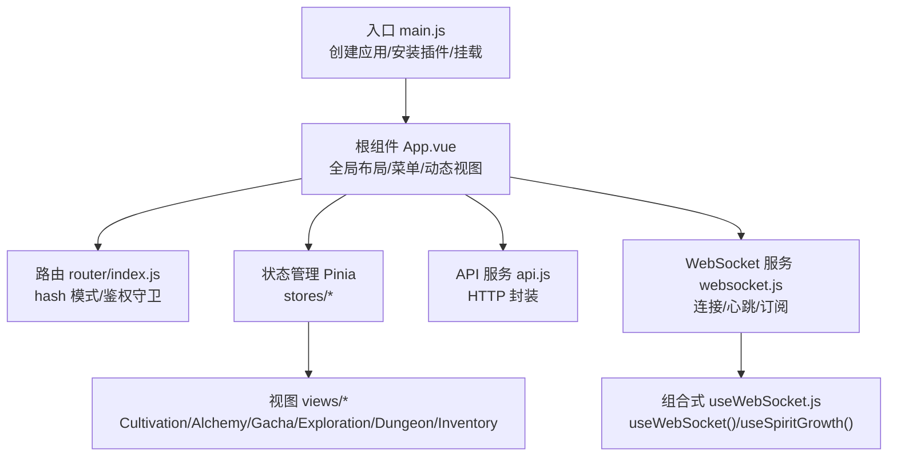

图表来源
- [src/main.js](file://src/main.js#L1-L31)
- [src/App.vue](file://src/App.vue#L1-L175)
- [src/router/index.js](file://src/router/index.js#L1-L37)
- [src/services/api.js](file://src/services/api.js#L1-L120)
- [src/services/websocket.js](file://src/services/websocket.js#L1-L120)
- [src/composables/useWebSocket.js](file://src/composables/useWebSocket.js#L1-L136)

章节来源
- [src/main.js](file://src/main.js#L1-L31)
- [src/App.vue](file://src/App.vue#L1-L175)
- [src/router/index.js](file://src/router/index.js#L1-L37)

## 核心组件
- 入口初始化
  - 创建 Vue 应用实例，安装 Pinia 与路由插件
  - 在页面卸载时主动调用后端离线接口，保证状态一致性
- 根组件 App.vue
  - 提供全局主题与 UI Provider 包裹
  - 维护菜单与动态视图渲染（通过组件动态切换）
  - 初始化玩家数据、暗黑模式切换、登出流程
  - 通过 watch 监听玩家 ID 变化，按需初始化 WebSocket 连接与心跳
  - 订阅 WebSocket 灵力增长事件，实时更新玩家灵力与获取速率
- 路由系统
  - hash 模式，/home 作为受认证入口，未登录重定向至 /login
  - App.vue 作为 home 的组件，内部再根据菜单切换具体视图
- 状态管理（Pinia）
  - playerInfo：玩家基础属性、境界、修为、灵力、属性与抗性等
  - inventory：资源与物品库存、自动处理设置
  - cultivation：修炼动作与突破逻辑
  - gacha：抽卡结果、筛选、分页、动画状态与弹窗控制
- 服务层
  - api.js：统一 HTTP 请求、字段命名转换、错误处理
  - websocket.js：WebSocket 连接、心跳、重连、事件派发
  - useWebSocket.js：组合式 API，封装连接、订阅、状态查询与断开

章节来源
- [src/main.js](file://src/main.js#L1-L31)
- [src/App.vue](file://src/App.vue#L1-L175)
- [src/router/index.js](file://src/router/index.js#L1-L37)
- [src/services/api.js](file://src/services/api.js#L1-L120)
- [src/services/websocket.js](file://src/services/websocket.js#L1-L120)
- [src/composables/useWebSocket.js](file://src/composables/useWebSocket.js#L1-L136)

## 架构总览
下图展示了前端与后端的交互路径：浏览器通过 HTTP 与 WebSocket 与后端通信；前端通过 Pinia 管理全局状态，视图组件通过 API 服务与 WebSocket 组合式 API 与后端交互。

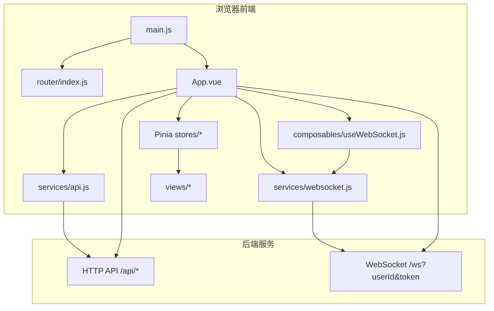

图表来源
- [src/main.js](file://src/main.js#L1-L31)
- [src/router/index.js](file://src/router/index.js#L1-L37)
- [src/App.vue](file://src/App.vue#L1-L175)
- [src/services/api.js](file://src/services/api.js#L1-L120)
- [src/services/websocket.js](file://src/services/websocket.js#L1-L120)
- [src/composables/useWebSocket.js](file://src/composables/useWebSocket.js#L1-L136)

## 详细组件分析

### 入口与根组件（MVVM 初始化）
- 初始化流程
  - 创建应用实例，安装 Pinia 与路由
  - 页面卸载时调用后端离线接口，避免状态漂移
- 根组件职责
  - 全局 UI Provider、暗黑模式切换
  - 菜单与动态视图渲染（通过组件动态切换）
  - 登录态校验与登出流程
  - 监听玩家 ID 变化，初始化 WebSocket 与心跳
  - 订阅灵力增长事件，更新玩家灵力与获取速率

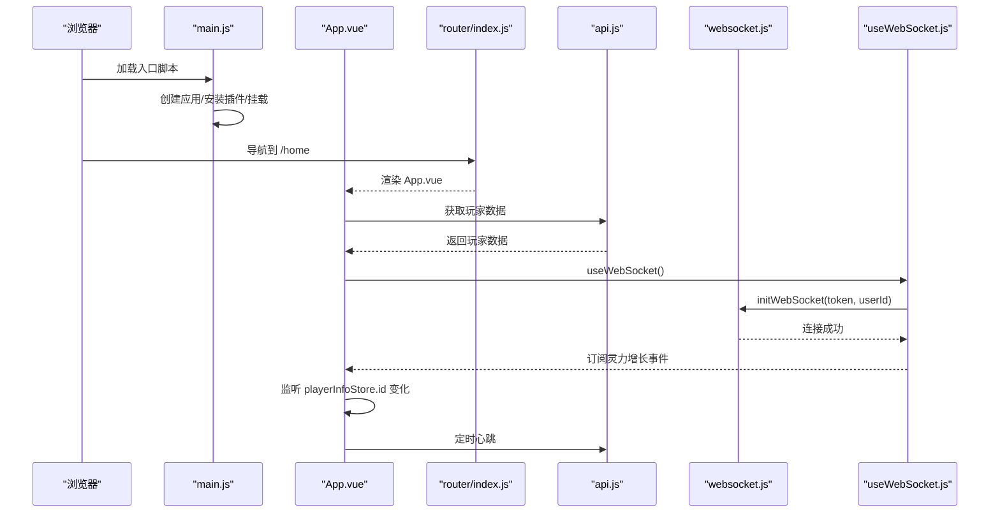

图表来源
- [src/main.js](file://src/main.js#L1-L31)
- [src/App.vue](file://src/App.vue#L310-L546)
- [src/router/index.js](file://src/router/index.js#L1-L37)
- [src/services/api.js](file://src/services/api.js#L138-L178)
- [src/services/websocket.js](file://src/services/websocket.js#L36-L120)
- [src/composables/useWebSocket.js](file://src/composables/useWebSocket.js#L21-L43)

章节来源
- [src/main.js](file://src/main.js#L1-L31)
- [src/App.vue](file://src/App.vue#L310-L546)
- [src/router/index.js](file://src/router/index.js#L1-L37)

### 路由系统（hash 模式与鉴权）
- 路由配置
  - /home 作为 App.vue 的路由，受认证守卫保护
  - 未登录重定向到 /login
- 视图切换
  - App.vue 内部通过菜单选择，动态渲染对应视图组件
  - 未登录时显示路由视图，登录后通过动态组件渲染

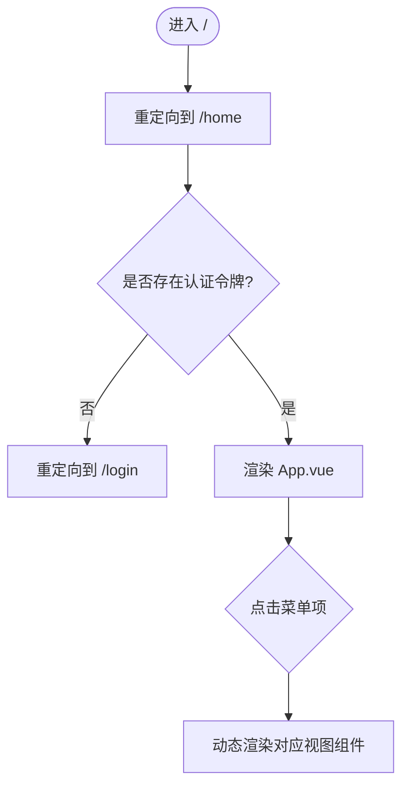

图表来源
- [src/router/index.js](file://src/router/index.js#L1-L37)
- [src/App.vue](file://src/App.vue#L236-L258)

章节来源
- [src/router/index.js](file://src/router/index.js#L1-L37)
- [src/App.vue](file://src/App.vue#L236-L258)

### 状态管理（Pinia）组织方式
- playerInfo.store
  - 管理玩家基础属性、境界、修为、灵力、属性与抗性、幸运、修炼/炼丹加成等
  - 提供登出动作，清理令牌并重置状态
- inventory.store
  - 管理资源与物品库存（灵石、强化石、洗炼石、灵草、物品、法宝）
  - 提供获得物品、使用物品（丹药/灵宠）、添加装备等动作
- cultivation.store
  - 提供修炼与突破逻辑：增加修为、尝试突破、提升灵力获取倍率等
- gacha.store
  - 管理抽卡结果、心愿单与自动处理设置、筛选与分页、动画状态与弹窗控制
  - 提供分页与总数计算的 getter

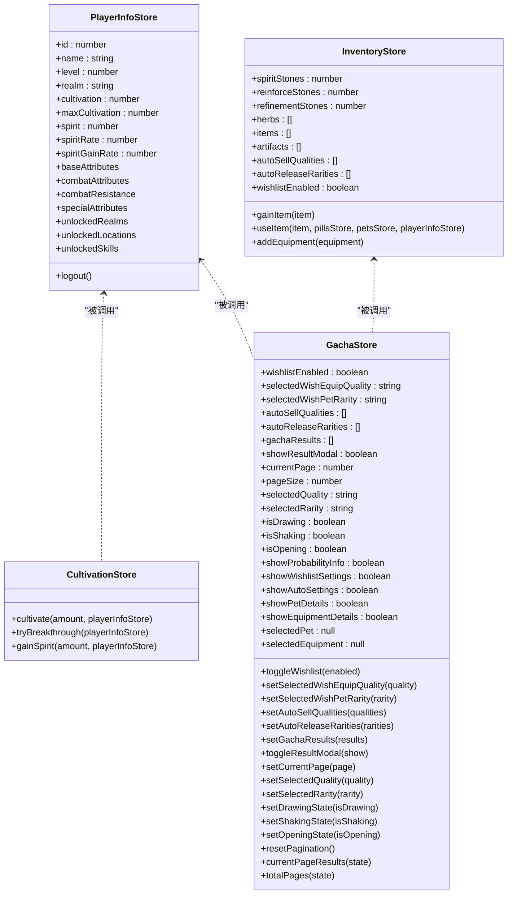

图表来源
- [src/stores/playerInfo.js](file://src/stores/playerInfo.js#L1-L112)
- [src/stores/inventory.js](file://src/stores/inventory.js#L1-L54)
- [src/stores/cultivation.js](file://src/stores/cultivation.js#L1-L52)
- [src/stores/gacha.js](file://src/stores/gacha.js#L1-L150)

章节来源
- [src/stores/playerInfo.js](file://src/stores/playerInfo.js#L1-L112)
- [src/stores/inventory.js](file://src/stores/inventory.js#L1-L54)
- [src/stores/cultivation.js](file://src/stores/cultivation.js#L1-L52)
- [src/stores/gacha.js](file://src/stores/gacha.js#L1-L150)

### API 通信封装（api.js）
- 统一基址与请求头
  - 基址为 /api，支持 Authorization Bearer Token
- 数据转换
  - 将后端返回的大驼峰字段转换为小驼峰命名，便于前端使用
- 方法族
  - 认证与在线状态：register/login/getUser/playerOnline/playerOffline
  - 玩家数据：getPlayerData/getPlayerSpirit/updatePlayerData/deleteItems/deletePets/updateSpirit/setPlayerOffline
  - 装备系统：getEquipmentList/getEquipmentDetails/enhanceEquipment/reforgeEquipment/confirmReforge/equipEquipment/unequipEquipment/sellEquipment/batchSellEquipment
  - 灵宠系统：deployPet/recallPet/upgradePet/evolvePet/batchReleasePets
  - 其他：物品详情、玩家库存、排行榜等

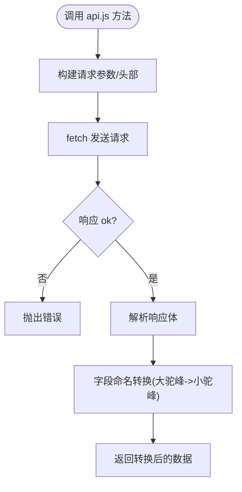

图表来源
- [src/services/api.js](file://src/services/api.js#L1-L120)
- [src/services/api.js](file://src/services/api.js#L138-L178)
- [src/services/api.js](file://src/services/api.js#L348-L427)

章节来源
- [src/services/api.js](file://src/services/api.js#L1-L120)
- [src/services/api.js](file://src/services/api.js#L138-L178)
- [src/services/api.js](file://src/services/api.js#L348-L427)

### WebSocket 连接与事件订阅（websocket.js 与 useWebSocket.js）
- 连接管理
  - 构造 ws/wss URL，携带 userId 与 token
  - onopen/onmessage/onerror/onclose 生命周期处理
  - 心跳：每秒发送 ping，超时处理
  - 自动重连：指数退避，最多尝试若干次
- 事件订阅
  - 提供订阅接口：spirit:grow、dungeon:event、leaderboard:update、exploration:event
  - 组合式 API：useWebSocket/useSpiritGrowth/useDungeonCombat/useLeaderboard/useExploration
- 灵力增长事件
  - App.vue 订阅 spirit:grow，更新 playerInfoStore.spirit 与 spiritGainRate

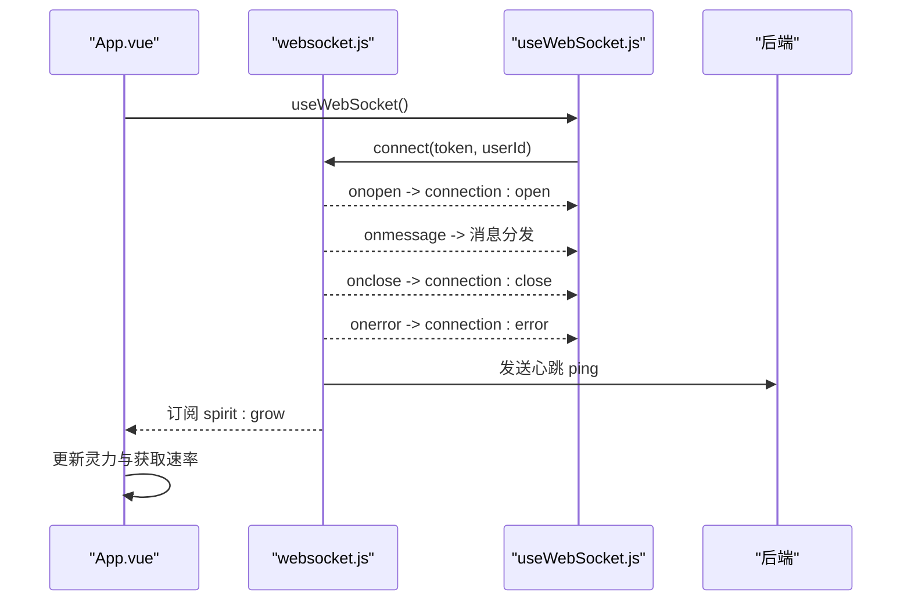

图表来源
- [src/services/websocket.js](file://src/services/websocket.js#L36-L120)
- [src/services/websocket.js](file://src/services/websocket.js#L174-L206)
- [src/services/websocket.js](file://src/services/websocket.js#L207-L238)
- [src/composables/useWebSocket.js](file://src/composables/useWebSocket.js#L21-L43)
- [src/App.vue](file://src/App.vue#L458-L480)

章节来源
- [src/services/websocket.js](file://src/services/websocket.js#L36-L120)
- [src/services/websocket.js](file://src/services/websocket.js#L174-L206)
- [src/services/websocket.js](file://src/services/websocket.js#L207-L238)
- [src/composables/useWebSocket.js](file://src/composables/useWebSocket.js#L21-L43)
- [src/App.vue](file://src/App.vue#L458-L480)

### 视图组件数据流与事件传递

#### 修炼（Cultivation.vue）
- 数据来源
  - 通过 api.js 获取修炼消耗与获得数据，同步到 playerInfoStore
- 事件与交互
  - 单次修炼：调用后端接口，更新灵力与修为，必要时触发突破
  - 自动修炼：循环调用单次修炼，直至灵力不足或用户停止
  - 一键突破：调用后端接口，同步最新数据并更新统计

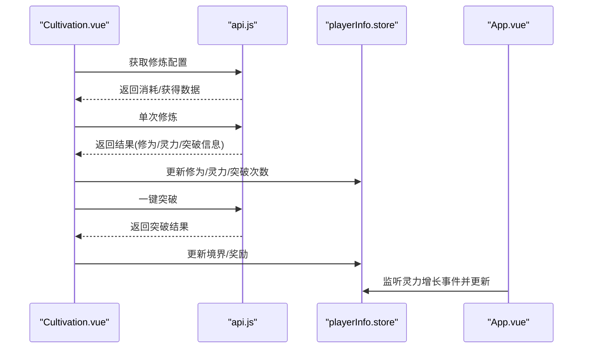

图表来源
- [src/views/Cultivation.vue](file://src/views/Cultivation.vue#L90-L136)
- [src/views/Cultivation.vue](file://src/views/Cultivation.vue#L138-L179)
- [src/views/Cultivation.vue](file://src/views/Cultivation.vue#L181-L209)
- [src/views/Cultivation.vue](file://src/views/Cultivation.vue#L210-L246)
- [src/services/api.js](file://src/services/api.js#L138-L178)
- [src/App.vue](file://src/App.vue#L458-L480)

章节来源
- [src/views/Cultivation.vue](file://src/views/Cultivation.vue#L90-L246)
- [src/services/api.js](file://src/services/api.js#L138-L178)
- [src/App.vue](file://src/App.vue#L458-L480)

#### 炼丹（Alchemy.vue）
- 数据来源
  - 通过 api.js 获取可用丹方列表与效果预览
- 事件与交互
  - 选择丹方、检查材料、调用后端炼制接口
  - 成功后从前端库存扣除消耗材料，更新炼制次数统计
  - 购买丹方残页，解锁新配方

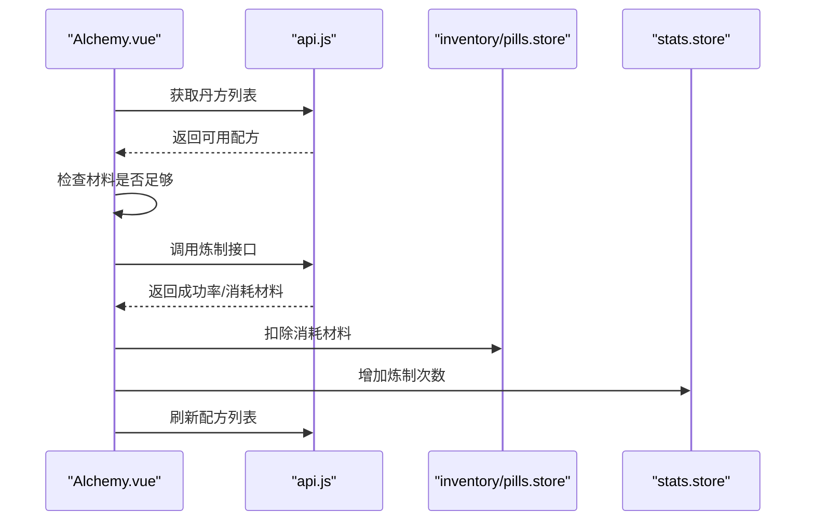

图表来源
- [src/views/Alchemy.vue](file://src/views/Alchemy.vue#L110-L171)
- [src/views/Alchemy.vue](file://src/views/Alchemy.vue#L174-L248)
- [src/views/Alchemy.vue](file://src/views/Alchemy.vue#L250-L292)
- [src/services/api.js](file://src/services/api.js#L1-L120)

章节来源
- [src/views/Alchemy.vue](file://src/views/Alchemy.vue#L110-L292)
- [src/services/api.js](file://src/services/api.js#L1-L120)

#### 抽卡（Gacha.vue 与 useGacha.js）
- 数据来源
  - 通过 api.js 执行抽卡与自动处理
- 事件与交互
  - 执行抽卡，返回物品列表
  - 自动处理：按设置自动出售/放生
  - 更新 gacha.store 的结果与分页状态

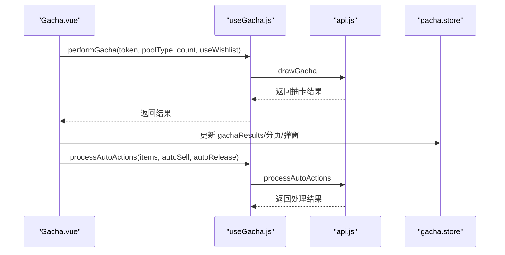

图表来源
- [src/views/Gacha.vue](file://src/views/Gacha.vue#L1-L12)
- [src/components/gacha/useGacha.js](file://src/components/gacha/useGacha.js#L1-L40)
- [src/stores/gacha.js](file://src/stores/gacha.js#L1-L150)
- [src/services/api.js](file://src/services/api.js#L1-L120)

章节来源
- [src/views/Gacha.vue](file://src/views/Gacha.vue#L1-L12)
- [src/components/gacha/useGacha.js](file://src/components/gacha/useGacha.js#L1-L40)
- [src/stores/gacha.js](file://src/stores/gacha.js#L1-L150)
- [src/services/api.js](file://src/services/api.js#L1-L120)

#### 探索（Exploration.vue）
- 数据来源
  - 通过 apiClient（同源）调用后端探索接口
- 事件与交互
  - 开始探索：触发后端探索流程，接收事件列表
  - 事件选择：调用后端处理事件选择，更新日志与统计

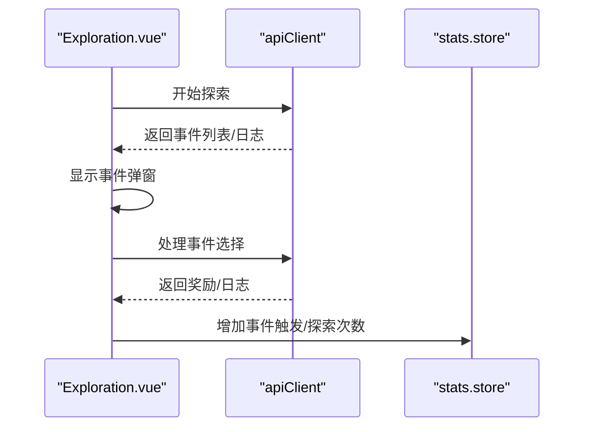

图表来源
- [src/views/Exploration.vue](file://src/views/Exploration.vue#L43-L151)

章节来源
- [src/views/Exploration.vue](file://src/views/Exploration.vue#L43-L151)

#### 秘境（Dungeon.vue）
- 数据来源
  - 通过 fetch 调用后端接口：开启/获取增益/选择增益/开始战斗/结束
- 事件与交互
  - 选择难度与开始探索，生成增益选项
  - 选择增益后进入战斗，战斗结束后根据胜负更新统计与奖励

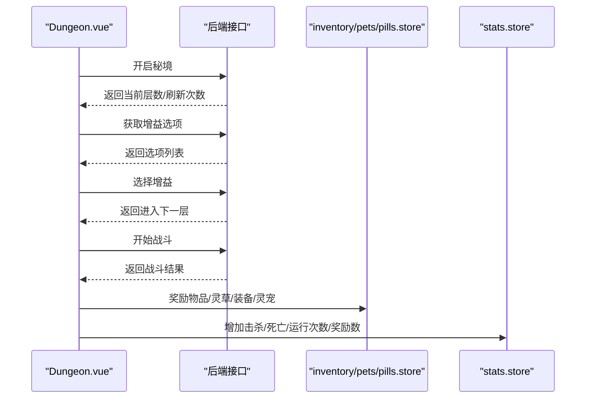

图表来源
- [src/views/Dungeon.vue](file://src/views/Dungeon.vue#L596-L800)

章节来源
- [src/views/Dungeon.vue](file://src/views/Dungeon.vue#L596-L800)

#### 背包（Inventory.vue）
- 数据来源
  - 通过 api.js 获取已装备列表与玩家完整数据（含宠物）
- 事件与交互
  - 加载已装备的装备，清空未装备槽位
  - 加载宠物列表并打印调试信息

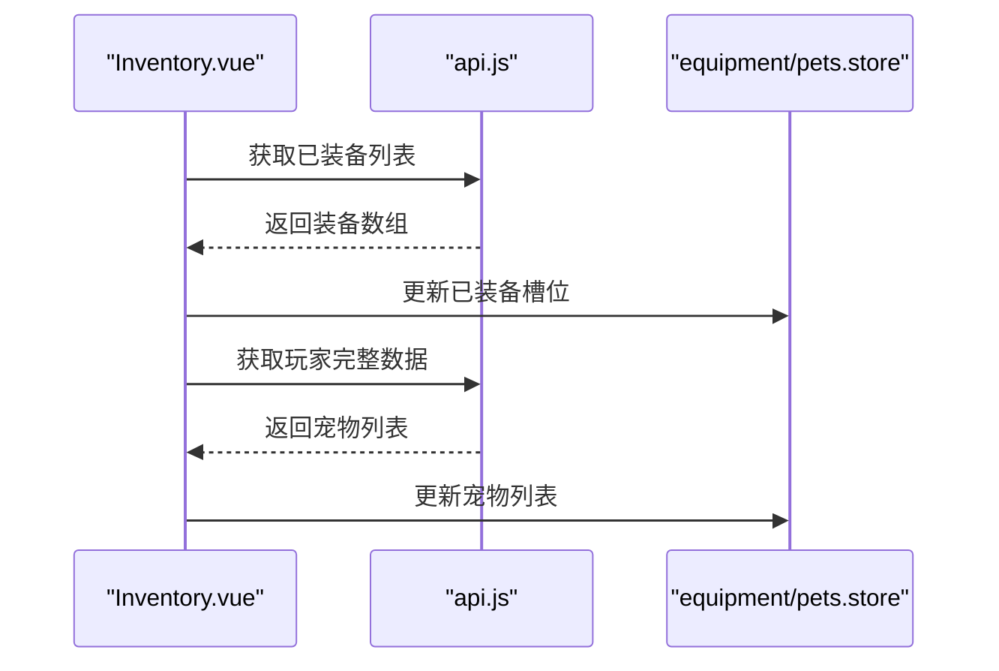

图表来源
- [src/views/Inventory.vue](file://src/views/Inventory.vue#L81-L154)
- [src/services/api.js](file://src/services/api.js#L348-L427)

章节来源
- [src/views/Inventory.vue](file://src/views/Inventory.vue#L81-L154)
- [src/services/api.js](file://src/services/api.js#L348-L427)

## 依赖关系分析
- 组件耦合
  - App.vue 与各 store、api.js、websocket.js 紧密耦合，负责全局状态与生命周期管理
  - 视图组件通过 api.js 与后端交互，通过 useWebSocket.js 与 WebSocket 交互
- 外部依赖
  - vue-router：路由与鉴权
  - naive-ui：UI 组件库
  - uuid：生成唯一标识
- 潜在风险
  - App.vue 中对 playerInfoStore.id 的 watch 逻辑较为复杂，需注意重复初始化与断开连接的时机
  - WebSocket 重连策略与心跳间隔需与后端保持一致

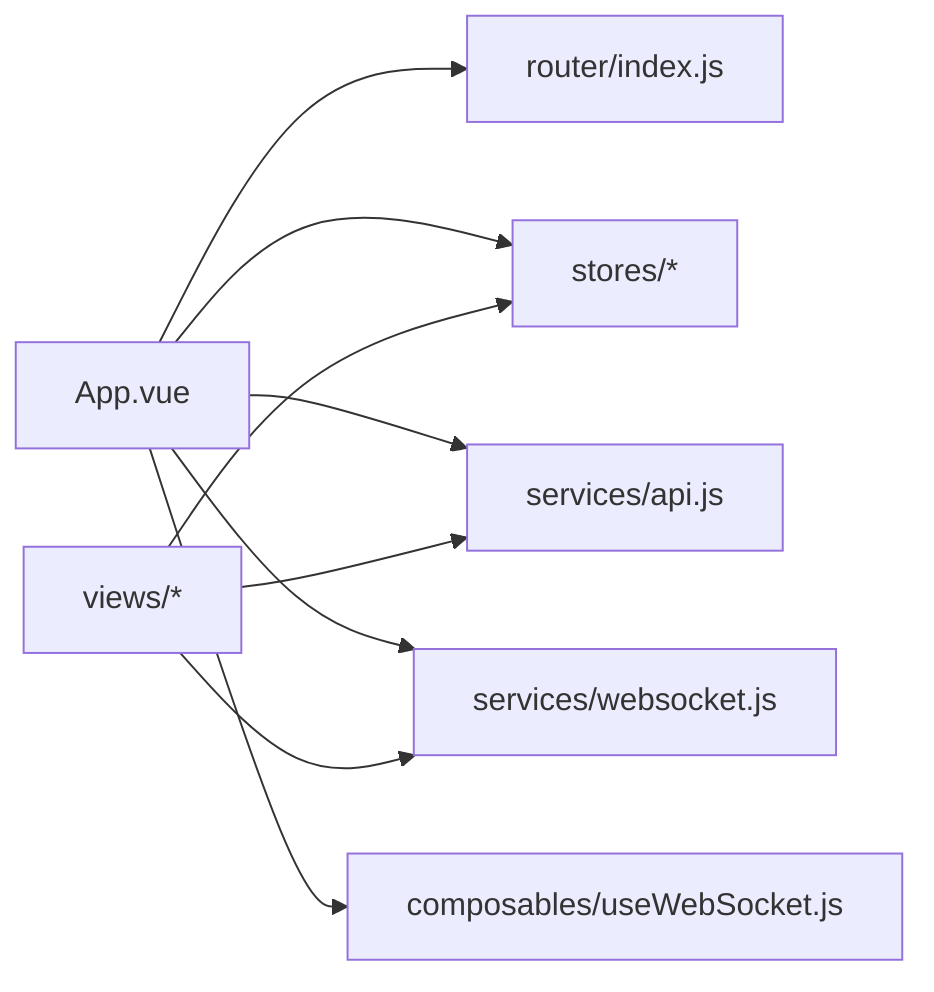

图表来源
- [src/App.vue](file://src/App.vue#L1-L175)
- [src/router/index.js](file://src/router/index.js#L1-L37)
- [src/services/api.js](file://src/services/api.js#L1-L120)
- [src/services/websocket.js](file://src/services/websocket.js#L1-L120)
- [src/composables/useWebSocket.js](file://src/composables/useWebSocket.js#L1-L136)

章节来源
- [src/App.vue](file://src/App.vue#L1-L175)
- [src/router/index.js](file://src/router/index.js#L1-L37)
- [src/services/api.js](file://src/services/api.js#L1-L120)
- [src/services/websocket.js](file://src/services/websocket.js#L1-L120)
- [src/composables/useWebSocket.js](file://src/composables/useWebSocket.js#L1-L136)

## 性能考量
- WebSocket 心跳与重连
  - 前端每秒发送心跳，建议后端保持稳定的心跳处理，避免频繁断线
  - 重连采用指数退避，避免雪崩效应
- API 请求缓存
  - 对于不频繁变动的数据（如丹方列表），可在视图组件内做本地缓存，减少重复请求
- 组件渲染
  - App.vue 使用动态组件切换视图，避免不必要的全量刷新
  - 大列表渲染（如背包、抽卡结果）建议使用虚拟滚动或分页
- 状态更新
  - 通过 Pinia 的 $patch/$reset 精准更新状态，避免深层嵌套导致的性能问题

## 故障排查指南
- 登录态异常
  - 检查路由守卫是否正确读取认证令牌
  - 确认 App.vue 在 beforeunload 与登出时调用离线接口
- WebSocket 连接失败
  - 查看 wsManager.connect 的 URL 构造与端口
  - 检查 onerror/onclose 分支与自动重连逻辑
- 灵力增长不同步
  - 确认 App.vue 订阅 spirit:grow 并更新 playerInfoStore
  - 检查后端是否正确推送消息类型
- 抽卡/炼丹失败
  - 查看 api.js 的响应解析与错误分支
  - 确认前端库存与后端库存一致，避免重复消费

章节来源
- [src/router/index.js](file://src/router/index.js#L1-L37)
- [src/App.vue](file://src/App.vue#L14-L31)
- [src/services/websocket.js](file://src/services/websocket.js#L36-L120)
- [src/services/api.js](file://src/services/api.js#L138-L178)

## 结论
xiuxian-go 前端以 Vue 3 的 MVVM 模式为核心，通过入口初始化、根组件布局、路由鉴权、Pinia 状态管理与统一的服务层封装，实现了清晰的职责分离与良好的可维护性。WebSocket 与 HTTP 的双通道交互保障了实时性与稳定性。建议在后续迭代中进一步完善错误处理、性能监控与组件化复用，以提升用户体验与开发效率。

## 附录
- 关键实现路径参考
  - 入口初始化：[src/main.js](file://src/main.js#L1-L31)
  - 根组件布局与动态视图：[src/App.vue](file://src/App.vue#L1-L175)
  - 路由鉴权与 hash 模式：[src/router/index.js](file://src/router/index.js#L1-L37)
  - API 统一封装与字段转换：[src/services/api.js](file://src/services/api.js#L1-L120)
  - WebSocket 连接与心跳：[src/services/websocket.js](file://src/services/websocket.js#L36-L120)
  - 组合式 WebSocket 管理：[src/composables/useWebSocket.js](file://src/composables/useWebSocket.js#L21-L43)
  - 玩家状态管理：[src/stores/playerInfo.js](file://src/stores/playerInfo.js#L1-L112)
  - 背包状态管理：[src/stores/inventory.js](file://src/stores/inventory.js#L1-L54)
  - 修炼状态管理：[src/stores/cultivation.js](file://src/stores/cultivation.js#L1-L52)
  - 抽卡状态管理：[src/stores/gacha.js](file://src/stores/gacha.js#L1-L150)
  - 修炼视图交互：[src/views/Cultivation.vue](file://src/views/Cultivation.vue#L90-L246)
  - 炼丹视图交互：[src/views/Alchemy.vue](file://src/views/Alchemy.vue#L110-L292)
  - 抽卡视图与 hook：[src/views/Gacha.vue](file://src/views/Gacha.vue#L1-L12)、[src/components/gacha/useGacha.js](file://src/components/gacha/useGacha.js#L1-L40)
  - 探索视图交互：[src/views/Exploration.vue](file://src/views/Exploration.vue#L43-L151)
  - 秘境视图交互：[src/views/Dungeon.vue](file://src/views/Dungeon.vue#L596-L800)
  - 背包视图交互：[src/views/Inventory.vue](file://src/views/Inventory.vue#L81-L154)