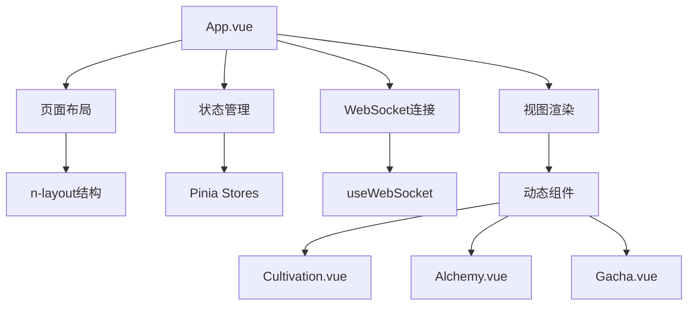
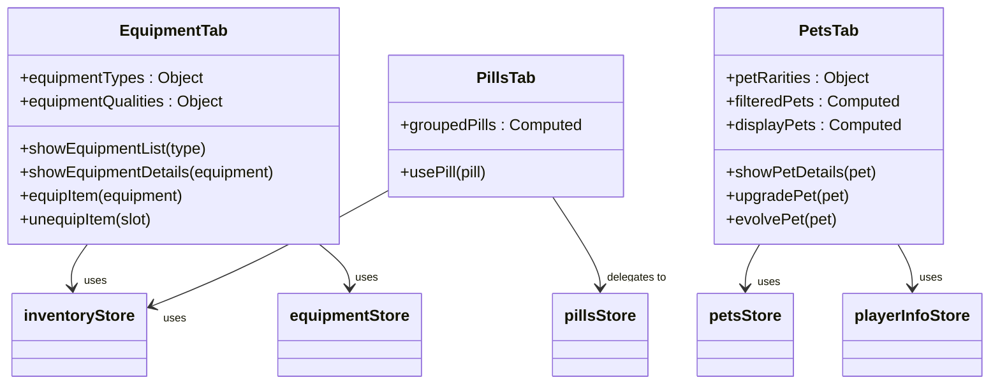
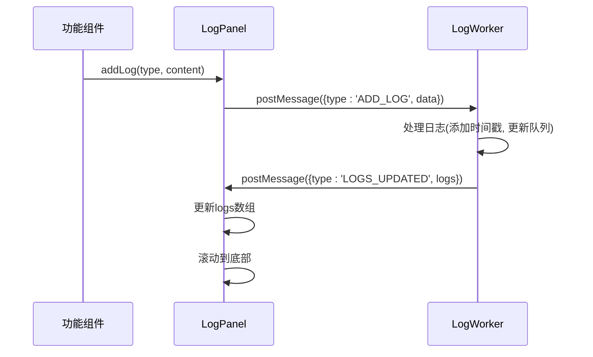
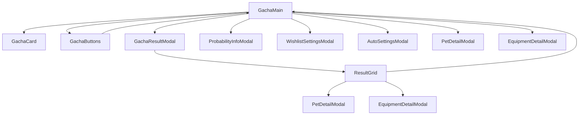
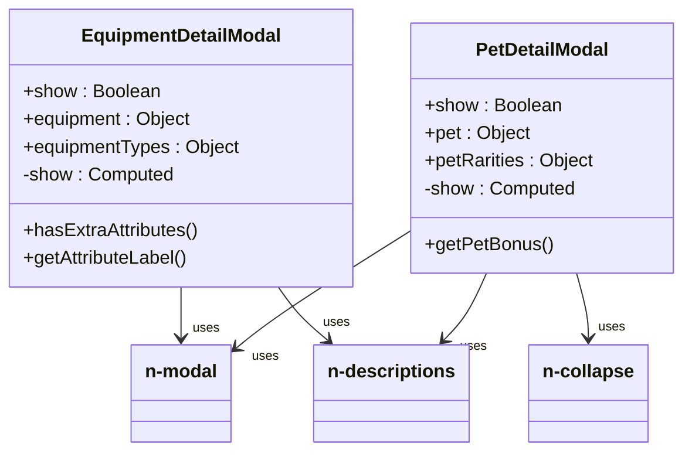

# 前端组件体系

<cite>
**本文档引用文件**   
- [App.vue](file://src/App.vue)
- [router/index.js](file://src/router/index.js)
- [views/Cultivation.vue](file://src/views/Cultivation.vue)
- [views/Alchemy.vue](file://src/views/Alchemy.vue)
- [components/EquipmentTab.vue](file://src/components/EquipmentTab.vue)
- [components/PillsTab.vue](file://src/components/PillsTab.vue)
- [components/PetsTab.vue](file://src/components/PetsTab.vue)
- [components/LogPanel.vue](file://src/components/LogPanel.vue)
- [components/gacha/GachaMain.vue](file://src/components/gacha/GachaMain.vue)
- [components/gacha/GachaCard.vue](file://src/components/gacha/GachaCard.vue)
- [components/gacha/ResultGrid.vue](file://src/components/gacha/ResultGrid.vue)
- [components/gacha/EquipmentDetailModal.vue](file://src/components/gacha/EquipmentDetailModal.vue)
- [components/gacha/PetDetailModal.vue](file://src/components/gacha/PetDetailModal.vue)
- [stores/gacha.js](file://src/stores/gacha.js)
- [stores/inventory.js](file://src/stores/inventory.js)
</cite>

## 目录
1. [根组件与路由架构](#根组件与路由架构)
2. [功能标签页组件分析](#功能标签页组件分析)
3. [日志面板机制](#日志面板机制)
4. [抽奖系统组件树](#抽奖系统组件树)
5. [模态框复用设计](#模态框复用设计)
6. [核心Vue特性应用](#核心vue特性应用)

## 根组件与路由架构

`App.vue`作为应用的根组件，承担着全局状态管理、布局组织和导航控制的核心职责。该组件通过`n-layout`组件构建了标准的上下布局结构，顶部为包含游戏标题、用户信息和导航菜单的页头，底部为动态内容区域。组件通过`isAuthenticated`计算属性判断用户认证状态，决定是否显示主应用界面或跳转至登录页。

在状态管理方面，`App.vue`集中导入并使用了多个Pinia状态存储（如`playerInfoStore`、`inventoryStore`等），实现了跨组件的数据共享。组件通过`getPlayerData`方法在挂载时从后端获取玩家数据，并同步更新各store中的状态。此外，组件还集成了WebSocket连接管理，通过`useWebSocket`组合式函数建立与服务器的实时通信，用于接收灵力增长等实时数据。

路由系统由`router/index.js`文件定义，采用Vue Router的hash模式。路由配置中，`/home`路径通过`beforeEnter`守卫检查用户认证令牌，确保只有已登录用户才能访问主应用。`App.vue`通过`currentViewComponent`计算属性，基于当前视图标识动态渲染对应的视图组件（如`Cultivation`、`Alchemy`等），实现了单页应用的视图切换。



**图示来源**
- [App.vue](file://src/App.vue)
- [router/index.js](file://src/router/index.js)

**章节来源**
- [App.vue](file://src/App.vue#L1-L654)
- [router/index.js](file://src/router/index.js#L1-L37)

## 功能标签页组件分析

功能标签页组件（如`EquipmentTab`、`PillsTab`、`PetsTab`）是游戏核心功能的入口，每个组件负责管理特定类型的游戏资源。

`EquipmentTab`组件通过网格布局展示玩家当前装备的五件法宝（法宝、冠巾、道袍、云履、本命法宝）。每个装备格子显示装备名称和操作按钮，点击“更多”可打开装备列表模态框。该组件通过props接收`equipmentStore`、`inventoryStore`等store实例，实现了与全局状态的深度集成。组件内部通过`showEquipmentList`方法从后端获取指定类型的装备列表，并在本地缓存，避免重复请求。

`PillsTab`组件采用简洁的网格布局展示玩家拥有的丹药。它通过`groupedPills`计算属性对背包中的丹药进行分组计数，相同ID的丹药合并显示并标注数量。用户点击“服用”按钮时，组件调用`inventoryStore.useItem`方法，委托`pillsStore`处理丹药使用逻辑，体现了职责分离的设计原则。

`PetsTab`组件管理玩家的灵宠，支持按稀有度筛选和分页显示。组件通过`filteredPets`计算属性实现筛选功能，`displayPets`计算属性处理分页逻辑。每个灵宠卡片显示名称、稀有度、等级和星级，并提供“出战/召回”按钮。点击卡片可查看灵宠详情，包括详细的属性加成和战斗属性。



**图示来源**
- [components/EquipmentTab.vue](file://src/components/EquipmentTab.vue)
- [components/PillsTab.vue](file://src/components/PillsTab.vue)
- [components/PetsTab.vue](file://src/components/PetsTab.vue)

**章节来源**
- [components/EquipmentTab.vue](file://src/components/EquipmentTab.vue#L1-L739)
- [components/PillsTab.vue](file://src/components/PillsTab.vue#L1-L72)
- [components/PetsTab.vue](file://src/components/PetsTab.vue#L1-L608)

## 日志面板机制

`LogPanel`组件是游戏内信息反馈的核心，负责展示系统日志和操作反馈。该组件采用Web Worker技术实现日志处理的异步化，将日志的存储、格式化和滚动逻辑移至独立线程，避免大量日志输出时阻塞主线程，保证了UI的流畅性。

组件通过`addLog`方法接收日志内容，该方法将日志数据通过`postMessage`发送给Worker。Worker负责生成时间戳、管理日志队列，并在日志更新时通知主线程。组件通过`scrollRef`引用，在日志更新后自动滚动到底部，确保最新日志始终可见。日志条目使用`n-tag`组件显示时间戳，`n-gradient-text`组件显示内容，不同类型的日志（如成功、错误）使用不同颜色区分。

`LogPanel`被广泛集成到其他功能组件中，如`Cultivation.vue`和`Alchemy.vue`，通过`ref`引用调用其`addLog`方法，实现了日志功能的复用。这种设计模式将日志展示逻辑与业务逻辑解耦，提高了代码的可维护性。



**图示来源**
- [components/LogPanel.vue](file://src/components/LogPanel.vue)

**章节来源**
- [components/LogPanel.vue](file://src/components/LogPanel.vue#L1-L132)

## 抽奖系统组件树

抽奖系统采用清晰的组件树结构，以`GachaMain`为根组件，协调多个子组件共同完成抽奖流程。

`GachaMain.vue`作为容器组件，管理抽奖的核心状态（如`gachaType`、`gachaNumber`）和业务逻辑。它通过`useGachaStore`访问全局抽奖状态，并通过`performGacha`方法处理抽卡请求。该方法首先调用后端API执行抽卡，然后触发抽卡动画（摇晃和开启），最后将结果存入`gachaStore`并打开结果模态框。

`GachaCard`组件是一个无状态的展示组件，仅接收`isShaking`和`isOpening`等布尔值props，通过CSS类控制动画效果。它使用简单的表情符号（🥋代表装备，🥚代表灵宠）作为视觉元素，通过`shake`和`open`CSS类实现摇晃和变色动画。

`ResultGrid`组件负责展示抽卡结果，它接收`currentPageResults`等props，通过网格布局渲染物品列表。对于符合心愿单条件的物品，会添加`wish-bonus`类，显示旋转的星星特效。每个物品卡片都包含一个详情按钮，点击后通过`emit`触发事件，由父组件`GachaMain`处理并打开相应的详情模态框。



**图示来源**
- [components/gacha/GachaMain.vue](file://src/components/gacha/GachaMain.vue)
- [components/gacha/GachaCard.vue](file://src/components/gacha/GachaCard.vue)
- [components/gacha/ResultGrid.vue](file://src/components/gacha/ResultGrid.vue)

**章节来源**
- [components/gacha/GachaMain.vue](file://src/components/gacha/GachaMain.vue#L1-L426)
- [components/gacha/GachaCard.vue](file://src/components/gacha/GachaCard.vue#L1-L87)
- [components/gacha/ResultGrid.vue](file://src/components/gacha/ResultGrid.vue#L1-L145)

## 模态框复用设计

模态框组件（如`EquipmentDetailModal`、`PetDetailModal`）采用高度复用的设计模式，通过props接收数据，通过`v-model`实现双向绑定，实现了在不同上下文中的灵活使用。

`EquipmentDetailModal`和`PetDetailModal`都使用`n-modal`组件作为基础，通过`v-model:show`绑定显示状态。它们接收`equipment`或`pet`对象作为props，使用`n-descriptions`组件以表格形式展示详细信息。两个组件都使用了计算属性`show`来处理`v-model`的双向绑定，这是Vue 3中实现自定义组件v-model的标准做法。

这些模态框在多个地方被复用：在`EquipmentTab`中用于查看已装备物品的详情，在`GachaResultModal`中用于查看抽卡获得的新物品。这种设计避免了代码重复，确保了信息展示的一致性。组件通过`defineProps`明确声明了所需的props类型和默认值，增强了代码的可读性和健壮性。



**图示来源**
- [components/gacha/EquipmentDetailModal.vue](file://src/components/gacha/EquipmentDetailModal.vue)
- [components/gacha/PetDetailModal.vue](file://src/components/gacha/PetDetailModal.vue)

**章节来源**
- [components/gacha/EquipmentDetailModal.vue](file://src/components/gacha/EquipmentDetailModal.vue#L1-L73)
- [components/gacha/PetDetailModal.vue](file://src/components/gacha/PetDetailModal.vue#L1-L153)

## 核心Vue特性应用

本项目深入应用了Vue 3的核心特性，包括组合式API、响应式系统、组件通信和状态管理。

**Props传递与事件发射**：组件间通信遵循单向数据流原则。父组件通过props向下传递数据，子组件通过`emit`向上发射事件。例如，`GachaButtons`组件通过`@gacha`监听抽卡事件，`ResultGrid`通过`@show-pet-detail`发射事件，均由`GachaMain`组件处理。

**插槽使用**：项目中大量使用了`n-card`、`n-modal`等第三方组件的插槽功能。例如，`n-card`的`#header`和`#footer`插槽用于自定义卡片头部和底部内容，`n-modal`的`#action`插槽用于放置操作按钮，实现了灵活的UI定制。

**状态管理**：采用Pinia作为状态管理库，将应用状态（如玩家信息、背包物品、抽奖设置）集中管理。`gachaStore`和`inventoryStore`等store通过`defineStore`定义，使用`state`、`actions`和`getters`组织逻辑。组件通过`useStore`函数导入store，实现了状态的全局访问和响应式更新。

```mermaid
flowchart TD
A[组合式API] --> B[setup()]
A --> C[ref()]
A --> D[computed()]
A --> E[watch()]
F[响应式系统] --> G[Proxy]
F --> H[依赖追踪]
I[组件通信] --> J[Props]
I --> K[Events]
I --> L[Slots]
M[状态管理] --> N[Pinia]
N --> O[State]
N --> P[Actions]
N --> Q[Getters]
```

**图示来源**
- [stores/gacha.js](file://src/stores/gacha.js)
- [stores/inventory.js](file://src/stores/inventory.js)

**章节来源**
- [stores/gacha.js](file://src/stores/gacha.js#L1-L150)
- [stores/inventory.js](file://src/stores/inventory.js#L1-L54)