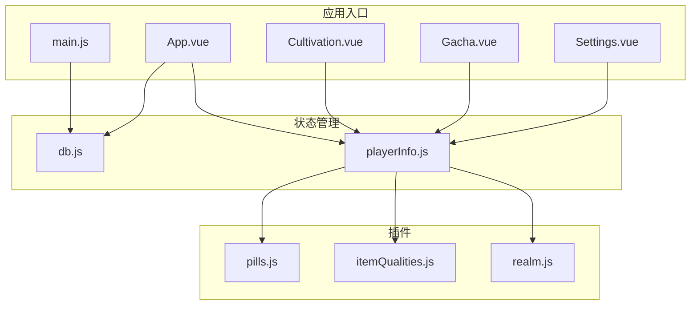
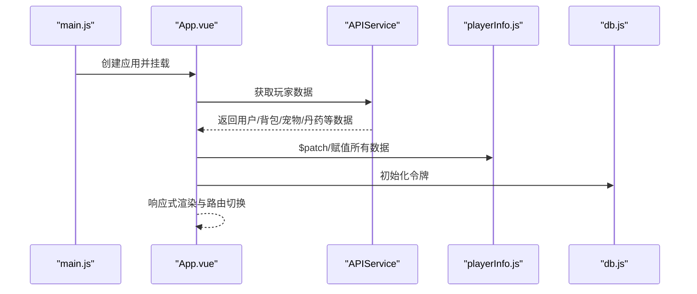
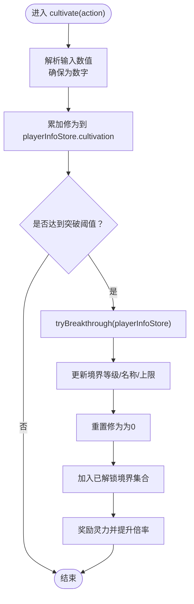
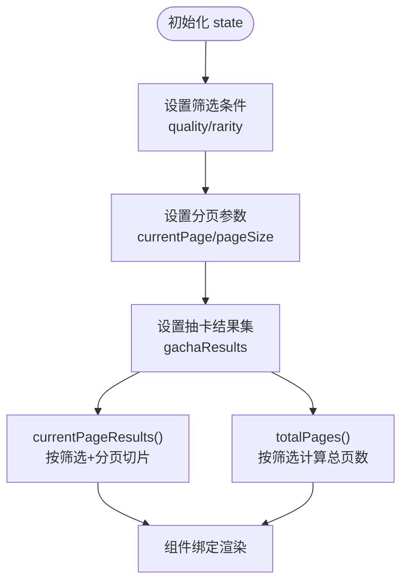
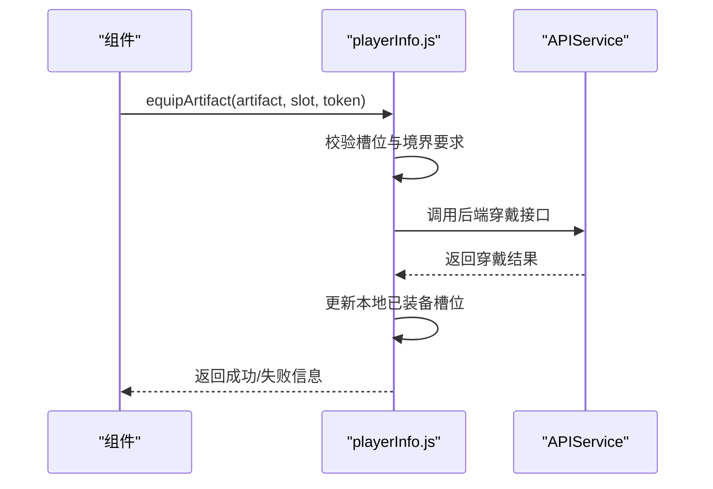
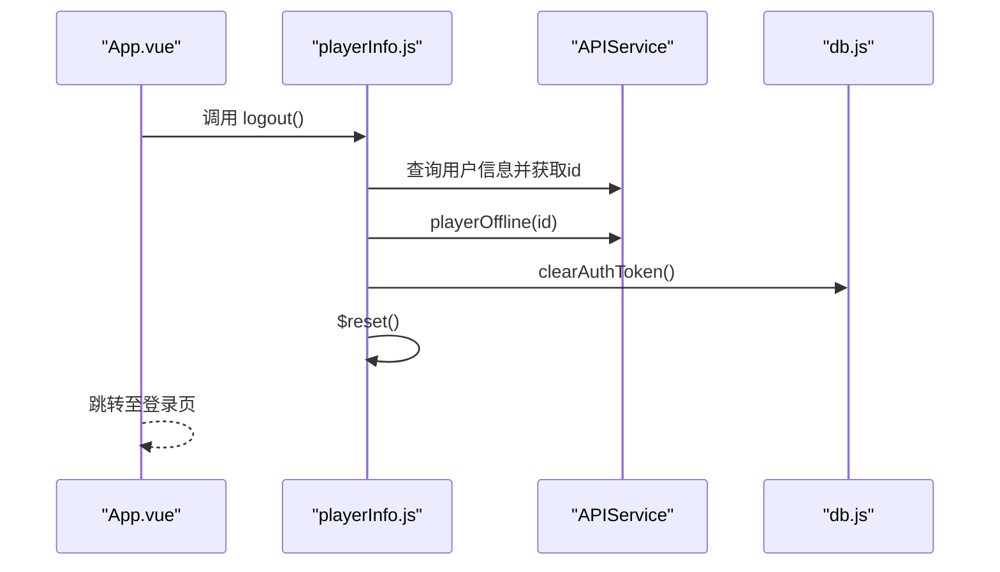
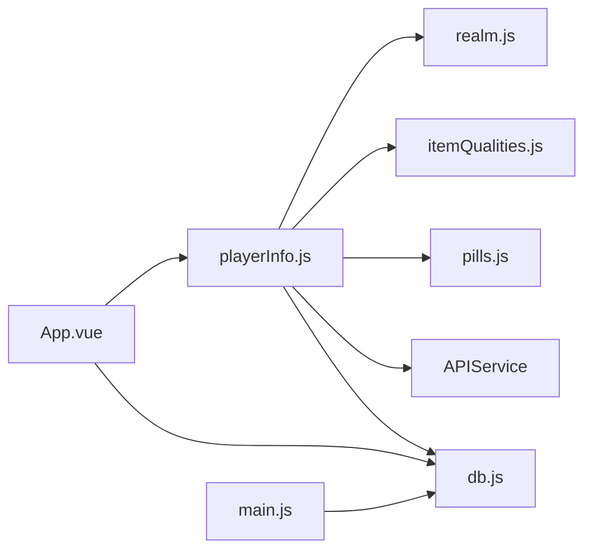

# 状态管理机制

<cite>
**本文引用的文件**
- [playerInfo.js](file://src/stores/playerInfo.js)
- [db.js](file://src/stores/db.js)
- [main.js](file://src/main.js)
- [App.vue](file://src/App.vue)
- [Cultivation.vue](file://src/views/Cultivation.vue)
- [Gacha.vue](file://src/views/Gacha.vue)
- [Settings.vue](file://src/views/Settings.vue)
- [realm.js](file://src/plugins/realm.js)
- [itemQualities.js](file://src/plugins/itemQualities.js)
- [pills.js](file://src/plugins/pills.js)
</cite>

## 更新摘要
**已做更改**
- 更新了文档以反映将多个Pinia store（combat, cultivation, gacha, pets, pills, settings, stats）合并到playerInfoStore的架构变更
- 移除了对已删除store文件（cultivation.js, gacha.js, equipment.js, pets.js, settings.js）的引用
- 更新了核心组件、架构总览和详细组件分析部分，以描述playerInfoStore中整合的状态和逻辑
- 重构了依赖关系分析，反映新的模块化结构
- 更新了故障排查指南中的登出异常排查路径

## 目录
1. [引言](#引言)
2. [项目结构](#项目结构)
3. [核心组件](#核心组件)
4. [架构总览](#架构总览)
5. [详细组件分析](#详细组件分析)
6. [依赖关系分析](#依赖关系分析)
7. [性能考量](#性能考量)
8. [故障排查指南](#故障排查指南)
9. [结论](#结论)

## 引言
本文件围绕 xiuxian-go 项目的 Pinia 状态管理进行系统化梳理，重点解析 playerInfoStore 模块的设计与职责划分。playerInfoStore 现在作为统一的前端数据源，整合了原多个独立 store 的状态和逻辑，包括装备、抽卡、宠物、丹药、设置和统计等模块。

本文将深入分析 playerInfoStore 如何管理修炼进度与境界数据，维护抽奖逻辑与保底计数器，处理装备与灵宠的状态同步。同时，说明 playerInfoStore 作为核心用户数据源的作用，其对用户偏好设置的持久化机制，以及通过 store 实现跨组件数据流解耦的机制。结合实际代码展示 state、getters、actions 的使用模式，说明模块间状态共享与响应式更新机制。

## 项目结构
- 状态管理位于 src/stores 目录，采用单一主 store 设计，playerInfoStore 聚合了所有业务域的状态
- 视图层通过组合式 API 在组件中直接引入并使用 playerInfoStore，实现跨组件数据共享
- 插件目录 src/plugins 提供领域配置（如境界、品质、丹方），被 store 与视图共同引用

图表来源
- [playerInfo.js](file://src/stores/playerInfo.js#L1-L502)
- [db.js](file://src/stores/db.js#L1-L62)
- [realm.js](file://src/plugins/realm.js#L1-L174)
- [itemQualities.js](file://src/plugins/itemQualities.js#L1-L134)
- [pills.js](file://src/plugins/pills.js#L1-L100)
- [main.js](file://src/main.js#L1-L31)
- [App.vue](file://src/App.vue#L1-L643)
- [Cultivation.vue](file://src/views/Cultivation.vue#L1-L270)
- [Gacha.vue](file://src/views/Gacha.vue#L1-L12)
- [Settings.vue](file://src/views/Settings.vue#L1-L269)

章节来源
- [main.js](file://src/main.js#L1-L31)
- [App.vue](file://src/App.vue#L1-L643)

## 核心组件
本节概述 playerInfoStore 的职责边界与关键行为：
- playerInfoStore：作为统一的核心用户数据源，整合了基础属性、战斗属性、抗性、特殊属性、成就解锁项、修炼进度、装备状态、抽卡逻辑、灵宠数据、丹药库存、用户设置和游戏统计等所有状态
- db.js：模拟本地令牌存储与玩家数据的读写入口（当前仅令牌）

章节来源
- [playerInfo.js](file://src/stores/playerInfo.js#L1-L502)
- [db.js](file://src/stores/db.js#L1-L62)

## 架构总览
下图展示了应用启动、数据加载、状态更新与响应式联动的整体流程。

图表来源
- [main.js](file://src/main.js#L1-L31)
- [App.vue](file://src/App.vue#L300-L346)
- [playerInfo.js](file://src/stores/playerInfo.js#L1-L502)
- [db.js](file://src/stores/db.js#L1-L62)

## 详细组件分析

### 修炼模块（整合至playerInfoStore）
- 职责：管理修炼进度与境界突破，提供修炼增量、突破尝试与灵力获取等动作
- 关键点：
  - 通过直接更新 playerInfoStore 的 state 来管理修炼状态
  - 调用 realm 插件获取境界名称与上限，触发突破后更新境界、修为、奖励与倍率
  - 灵力获取逻辑在后端处理，此处仅做本地状态更新

图表来源
- [playerInfo.js](file://src/stores/playerInfo.js#L192-L218)
- [realm.js](file://src/plugins/realm.js#L1-L174)

章节来源
- [playerInfo.js](file://src/stores/playerInfo.js#L192-L218)
- [realm.js](file://src/plugins/realm.js#L1-L174)

### 抽卡模块（整合至playerInfoStore）
- 职责：维护抽卡 UI 状态（心愿单、自动处理、筛选、分页、弹窗）、提供分页 getter
- 关键点：
  - state 中包含大量 UI 控制字段，便于组件直接绑定
  - getters 根据当前筛选条件与分页参数计算当前页结果与总页数
  - actions 提供开关与设置方法，便于组件控制抽卡界面行为

图表来源
- [playerInfo.js](file://src/stores/playerInfo.js#L472-L501)

章节来源
- [playerInfo.js](file://src/stores/playerInfo.js#L107-L124)
- [playerInfo.js](file://src/stores/playerInfo.js#L360-L386)
- [playerInfo.js](file://src/stores/playerInfo.js#L472-L501)

### 装备模块（整合至playerInfoStore）
- 职责：封装与后端交互的装备操作，store 侧仅做轻量状态同步
- 关键点：
  - equipArtifact/unequipArtifact/sellEquipment/batchSellEquipments 均通过 APIService 调用后端
  - 穿戴前校验槽位与境界要求，穿戴成功后更新本地已装备槽位
  - 卖出/批量卖出后同步背包列表
  - fetchPlayerEquipment 用于从后端拉取玩家装备数据

图表来源
- [playerInfo.js](file://src/stores/playerInfo.js#L227-L255)

章节来源
- [playerInfo.js](file://src/stores/playerInfo.js#L98-L105)
- [playerInfo.js](file://src/stores/playerInfo.js#L227-L357)

### 灵宠模块（整合至playerInfoStore）
- 职责：提供灵宠品质配置与库存列表
- 关键点：
  - 通过 itemQualities 插件注入品质配置
  - pets 字段用于存放当前玩家灵宽数组

章节来源
- [playerInfo.js](file://src/stores/playerInfo.js#L125-L129)
- [itemQualities.js](file://src/plugins/itemQualities.js#L1-L134)

### 丹药模块（整合至playerInfoStore）
- 职责：管理丹药库存、丹方残页、炼制与服用逻辑
- 关键点：
  - gainPillFragment：收集丹方残页，集齐后解锁完整丹方
  - craftPill：根据丹方炼制丹药，消耗灵草并生成丹药实例
  - usePill：服用丹药，添加持续效果并从库存移除

章节来源
- [playerInfo.js](file://src/stores/playerInfo.js#L131-L136)
- [playerInfo.js](file://src/stores/playerInfo.js#L389-L448)
- [pills.js](file://src/plugins/pills.js#L1-L100)

### 设置模块（整合至playerInfoStore）
- 职责：维护主题偏好（暗黑模式），并通过更新 HTML 根元素 class 实现全局切换
- 关键点：
  - toggleDarkMode 切换 isDarkMode 并调用 updateHtmlDarkMode 更新 DOM
  - App.vue 中通过 n-config-provider 读取 isDarkMode 决定主题

章节来源
- [playerInfo.js](file://src/stores/playerInfo.js#L139)
- [playerInfo.js](file://src/stores/playerInfo.js#L455-L468)
- [App.vue](file://src/App.vue#L2-L3)

### 统计模块（整合至playerInfoStore）
- 职责：记录游戏进度与成就数据
- 关键点：
  - 包含总修炼时间、突破次数、探索次数、物品获取数量等统计项
  - 在相应游戏行为中递增计数

章节来源
- [playerInfo.js](file://src/stores/playerInfo.js#L142-L161)

### 用户数据模块（playerInfoStore）
- 职责：核心用户数据源，承载所有用户状态
- 关键点：
  - 提供 renamePlayer 与 logout 动作
  - 登出时调用后端离线接口、清理令牌并重置 store

图表来源
- [playerInfo.js](file://src/stores/playerInfo.js#L173-L187)
- [db.js](file://src/stores/db.js#L1-L62)
- [App.vue](file://src/App.vue#L506-L534)

章节来源
- [playerInfo.js](file://src/stores/playerInfo.js#L1-L502)
- [db.js](file://src/stores/db.js#L1-L62)
- [App.vue](file://src/App.vue#L506-L534)

## 依赖关系分析
- playerInfoStore 依赖 realm.js、itemQualities.js 和 pills.js 插件
- playerInfoStore 依赖 APIService 与 db.js（令牌）
- App.vue 作为顶层容器，负责一次性加载玩家数据并初始化 WebSocket、心跳与主题

图表来源
- [playerInfo.js](file://src/stores/playerInfo.js#L1-L502)
- [db.js](file://src/stores/db.js#L1-L62)
- [main.js](file://src/main.js#L1-L31)
- [App.vue](file://src/App.vue#L1-L643)

章节来源
- [realm.js](file://src/plugins/realm.js#L1-L174)
- [itemQualities.js](file://src/plugins/itemQualities.js#L1-L134)
- [pills.js](file://src/plugins/pills.js#L1-L100)

## 性能考量
- 状态粒度：playerInfoStore 体量较大，建议在视图层按需访问字段，避免不必要的响应式追踪
- 请求频率：App.vue 中对玩家数据的同步与心跳定时器需合理设置间隔，避免频繁请求
- UI 状态：抽卡模块的分页与筛选在 getter 中计算，建议在大数据量时考虑虚拟滚动或服务端分页
- 装备交互：装备操作均走后端，store 仅做轻量同步，减少前端复杂度与误判风险

## 故障排查指南
- 登出异常
  - 现象：登出后仍出现重连或数据未清空
  - 排查：确认 App.vue 中是否正确调用 ws.disconnect()、stopHeartbeatTimer()、clearAuthToken() 与 playerInfoStore 的 $reset()
  - 参考路径
    - [App.vue](file://src/App.vue#L506-L534)
    - [playerInfo.js](file://src/stores/playerInfo.js#L173-L187)
    - [db.js](file://src/stores/db.js#L1-L62)
- 装备穿戴失败
  - 现象：穿戴提示“境界不足”或“同类型装备已装备”
  - 排查：检查 playerInfoStore 中的槽位校验与后端返回信息；确认 playerInfoStore.level 与 requiredRealm 的匹配
  - 参考路径
    - [playerInfo.js](file://src/stores/playerInfo.js#L227-L255)
    - [realm.js](file://src/plugins/realm.js#L133-L174)
- 抽卡分页不生效
  - 现象：筛选后分页错乱
  - 排查：确认 playerInfoStore 的 currentPageResults 与 totalPages 是否在筛选条件下正确计算
  - 参考路径
    - [playerInfo.js](file://src/stores/playerInfo.js#L472-L501)
- 主题切换无效
  - 现象：切换暗黑模式后 UI 未变化
  - 排查：确认 playerInfoStore 的 toggleDarkMode 是否调用 updateHtmlDarkMode，以及 App.vue 的 n-config-provider 是否读取 isDarkMode
  - 参考路径
    - [playerInfo.js](file://src/stores/playerInfo.js#L455-L468)
    - [App.vue](file://src/App.vue#L2-L3)

章节来源
- [App.vue](file://src/App.vue#L506-L534)
- [playerInfo.js](file://src/stores/playerInfo.js#L173-L187)
- [db.js](file://src/stores/db.js#L1-L62)
- [playerInfo.js](file://src/stores/playerInfo.js#L227-L255)
- [playerInfo.js](file://src/stores/playerInfo.js#L472-L501)
- [playerInfo.js](file://src/stores/playerInfo.js#L455-L468)

## 结论
- xiuxian-go 的 Pinia 状态管理采用“单一主 store + 视图直接消费”的模式，playerInfoStore 作为统一的核心数据源整合了所有业务模块
- 原有多个独立 store（combat, cultivation, gacha, pets, pills, settings, stats）的功能已完全合并至 playerInfoStore，实现了状态的集中管理
- 通过将各模块的状态和逻辑整合到 playerInfoStore，简化了模块间依赖，提高了状态管理的内聚性
- 通过 getters 与 actions 的合理组织，实现了 UI 状态与业务逻辑的解耦；跨组件数据流通过 store 实现集中管理与响应式更新
- 建议后续在大数据量场景下优化分页与请求频率，并完善设备/售卖等动作的本地状态回滚与错误提示