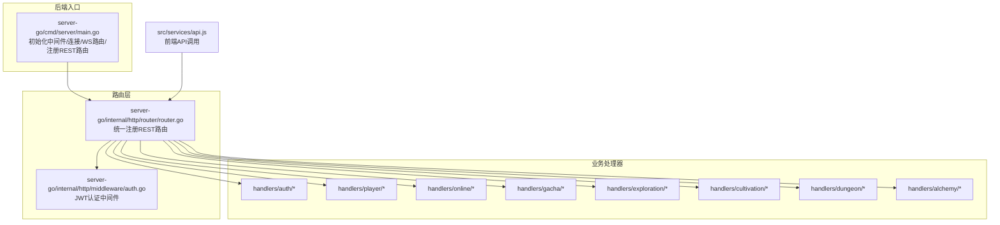
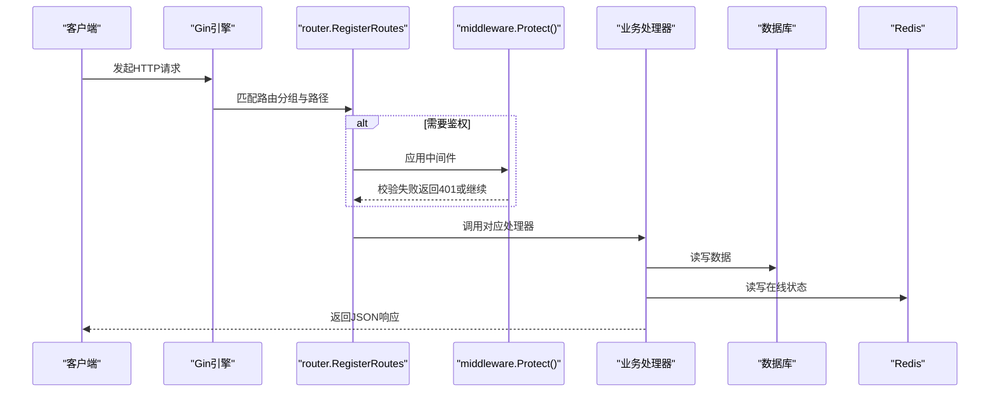
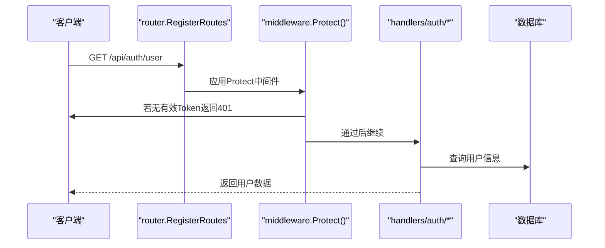
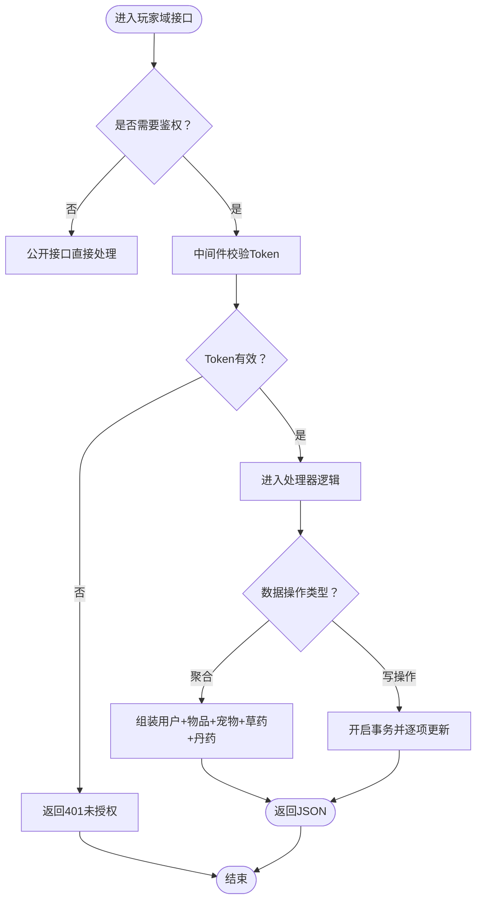
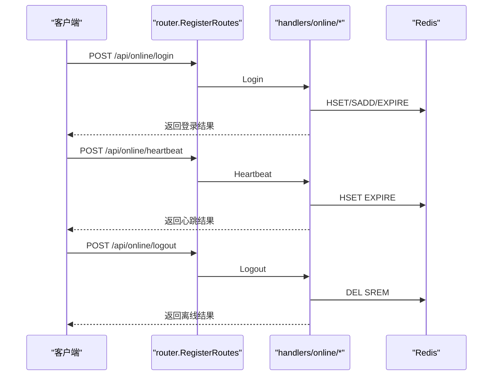
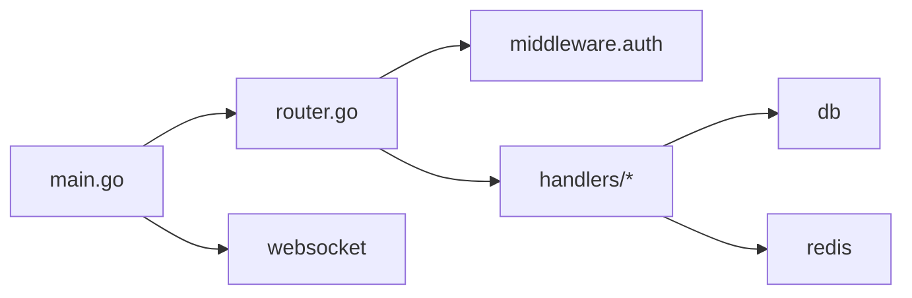

# API路由注册机制

<cite>
**本文引用的文件**
- [server-go/cmd/server/main.go](file://server-go/cmd/server/main.go)
- [server-go/internal/http/router/router.go](file://server-go/internal/http/router/router.go)
- [server-go/internal/http/middleware/auth.go](file://server-go/internal/http/middleware/auth.go)
- [server-go/internal/http/handlers/auth/auth.go](file://server-go/internal/http/handlers/auth/auth.go)
- [server-go/internal/http/handlers/player/player_handler.go](file://server-go/internal/http/handlers/player/player_handler.go)
- [server-go/internal/http/handlers/player/equipment_handler.go](file://server-go/internal/http/handlers/player/equipment_handler.go)
- [server-go/internal/http/handlers/player/pet_handler.go](file://server-go/internal/http/handlers/player/pet_handler.go)
- [server-go/internal/http/handlers/online/online.go](file://server-go/internal/http/handlers/online/online.go)
- [server-go/internal/http/handlers/gacha/gacha.go](file://server-go/internal/http/handlers/gacha/gacha.go)
- [server-go/internal/http/handlers/exploration/exploration.go](file://server-go/internal/http/handlers/exploration/exploration.go)
- [server-go/internal/http/handlers/cultivation/cultivation.go](file://server-go/internal/http/handlers/cultivation/cultivation.go)
- [server-go/internal/http/handlers/dungeon/dungeon.go](file://server-go/internal/http/handlers/dungeon/dungeon.go)
- [server-go/internal/http/handlers/alchemy/alchemy.go](file://server-go/internal/http/handlers/alchemy/alchemy.go)
- [src/services/api.js](file://src/services/api.js)
- [src/router/index.js](file://src/router/index.js)
</cite>

## 目录
1. [引言](#引言)
2. [项目结构](#项目结构)
3. [核心组件](#核心组件)
4. [架构总览](#架构总览)
5. [详细组件分析](#详细组件分析)
6. [依赖关系分析](#依赖关系分析)
7. [性能考量](#性能考量)
8. [故障排查指南](#故障排查指南)
9. [结论](#结论)
10. [附录](#附录)

## 引言
本文围绕 xiuxian-go 的 API 路由注册流程展开，自后端入口 main.go 中的路由注册函数开始，系统性解析 server-go 内部 router.go 如何组织并注册全部 RESTful 端点；覆盖路由分组（如 /api/auth、/api/player 等）、中间件应用（如 middleware.Protect()）、以及各功能模块的 HTTP 方法与路径映射。同时结合前端 src/services/api.js 的调用方式，说明后端路由设计如何对齐前端 API 调用，并讨论该设计在可维护性与扩展性方面的优势。

## 项目结构
后端采用 Go + Gin 的轻量 Web 框架，路由集中在 router.go 中统一注册；认证中间件在 middleware/auth.go 中实现；各业务模块的处理器位于 internal/http/handlers 下，按领域划分（auth、player、online、gacha、exploration、cultivation、dungeon、alchemy）。

图表来源
- [server-go/cmd/server/main.go](file://server-go/cmd/server/main.go#L1-L107)
- [server-go/internal/http/router/router.go](file://server-go/internal/http/router/router.go#L1-L126)
- [server-go/internal/http/middleware/auth.go](file://server-go/internal/http/middleware/auth.go#L1-L76)
- [src/services/api.js](file://src/services/api.js#L1-L120)

章节来源
- [server-go/cmd/server/main.go](file://server-go/cmd/server/main.go#L1-L107)
- [server-go/internal/http/router/router.go](file://server-go/internal/http/router/router.go#L1-L126)

## 核心组件
- 路由注册中心：router.go 中的 RegisterRoutes(r *gin.Engine)，集中声明所有 RESTful 端点，按领域分组并应用中间件。
- 认证中间件：Protect() 从 Authorization 头提取 Bearer Token，校验 JWT_SECRET，失败返回 401；成功将用户 ID 写入上下文供后续处理器使用。
- 业务处理器：各模块处理器负责参数绑定、业务逻辑调用、数据库交互与响应输出，统一遵循 REST 命名与方法约定。
- 前端对接：src/services/api.js 以 /api 基础路径发起调用，与后端路由保持一致。

章节来源
- [server-go/internal/http/router/router.go](file://server-go/internal/http/router/router.go#L1-L126)
- [server-go/internal/http/middleware/auth.go](file://server-go/internal/http/middleware/auth.go#L1-L76)
- [src/services/api.js](file://src/services/api.js#L1-L120)

## 架构总览
后端启动时初始化数据库、Redis、日志、WebSocket 管理器与处理器，随后注册 REST 路由与 WebSocket 路由。REST 路由采用分组策略，将不同领域的接口归类到 /api/{domain} 下，统一通过 Protect() 中间件保护需要鉴权的接口。

图表来源
- [server-go/cmd/server/main.go](file://server-go/cmd/server/main.go#L60-L106)
- [server-go/internal/http/router/router.go](file://server-go/internal/http/router/router.go#L17-L126)
- [server-go/internal/http/middleware/auth.go](file://server-go/internal/http/middleware/auth.go#L18-L76)

## 详细组件分析

### 路由注册与分组
- 健康检查：GET /health
- 认证域：/api/auth
  - POST /api/auth/register
  - POST /api/auth/login
  - GET /api/auth/user（需鉴权）
- 玩家域：/api/player
  - GET /api/player/leaderboard（公开）
  - GET /api/player/data（需鉴权）
  - GET /api/player/spirit（需鉴权）
  - PUT /api/player/spirit（需鉴权）
  - PATCH /api/player/data（需鉴权）
  - DELETE /api/player/items（需鉴权）
  - DELETE /api/player/pets（需鉴权）
  - 装备相关：GET /api/player/equipment、GET /api/player/equipment/details/:id、POST /api/player/equipment/:id/enhance、POST /api/player/equipment/:id/reforge、POST /api/player/equipment/:id/reforge-confirm、POST /api/player/equipment/:id/equip、POST /api/player/equipment/:id/unequip、DELETE /api/player/equipment/:id、POST /api/player/equipment/batch-sell
  - 灵宠相关：POST /api/player/pets/:id/deploy、POST /api/player/pets/:id/recall、POST /api/player/pets/:id/upgrade、POST /api/player/pets/:id/evolve、POST /api/player/pets/batch-release
- 在线域：/api/online（无需鉴权）
  - POST /api/online/login
  - POST /api/online/heartbeat
  - POST /api/online/logout
  - GET /api/online/players
  - GET /api/online/player/:playerId
- 抽卡域：/api/gacha（需鉴权）
  - POST /api/gacha/draw
  - POST /api/gacha/auto-actions
- 探索域：/api/exploration（需鉴权）
  - POST /api/exploration/start
  - POST /api/exploration/event-choice
- 修炼域：/api/cultivation（需鉴权）
  - POST /api/cultivation/single
  - POST /api/cultivation/breakthrough
  - GET /api/cultivation/data
- 秘境域：/api/dungeon（需鉴权）
  - POST /api/dungeon/start
  - GET /api/dungeon/buffs/:floor
  - POST /api/dungeon/select-buff
  - POST /api/dungeon/fight
  - POST /api/dungeon/end
- 炼丹域：/api/alchemy（需鉴权）
  - GET /api/alchemy/configs
  - GET /api/alchemy/recipes
  - GET /api/alchemy/recipes/:recipeId
  - POST /api/alchemy/craft
  - POST /api/alchemy/buy-fragment

章节来源
- [server-go/internal/http/router/router.go](file://server-go/internal/http/router/router.go#L17-L126)

### 认证中间件与鉴权流程
- 中间件 Protect() 从 Authorization 头读取 Bearer Token，校验 JWT_SECRET，失败返回 401；成功将用户 ID 写入上下文，供后续处理器通过 c.Get("userID") 获取。
- 认证处理器 auth.go 提供注册、登录、获取用户信息接口，登录成功生成 JWT 并返回 token，前端通过 Authorization: Bearer <token> 方式携带令牌。

图表来源
- [server-go/internal/http/middleware/auth.go](file://server-go/internal/http/middleware/auth.go#L18-L76)
- [server-go/internal/http/handlers/auth/auth.go](file://server-go/internal/http/handlers/auth/auth.go#L1-L219)
- [server-go/internal/http/router/router.go](file://server-go/internal/http/router/router.go#L23-L30)

章节来源
- [server-go/internal/http/middleware/auth.go](file://server-go/internal/http/middleware/auth.go#L1-L76)
- [server-go/internal/http/handlers/auth/auth.go](file://server-go/internal/http/handlers/auth/auth.go#L1-L219)

### 玩家域：数据、装备与灵宠
- 数据聚合：GetPlayerData 组合用户、物品、宠物、草药、丹药等数据，返回统一结构；UpdatePlayerData 支持增量更新（用户、物品、宠物、草药、丹药），并使用事务保证一致性。
- 装备系统：提供查询、详情、强化、洗练、确认洗练、穿戴、卸下、出售、批量出售等完整链路。
- 灵宠系统：支持出战、召回、升级、升星、批量放生，涉及玩家基础属性与战斗属性的动态加成与回滚。

图表来源
- [server-go/internal/http/router/router.go](file://server-go/internal/http/router/router.go#L31-L66)
- [server-go/internal/http/handlers/player/player_handler.go](file://server-go/internal/http/handlers/player/player_handler.go#L110-L302)
- [server-go/internal/http/handlers/player/equipment_handler.go](file://server-go/internal/http/handlers/player/equipment_handler.go#L58-L174)
- [server-go/internal/http/handlers/player/pet_handler.go](file://server-go/internal/http/handlers/player/pet_handler.go#L19-L258)

章节来源
- [server-go/internal/http/handlers/player/player_handler.go](file://server-go/internal/http/handlers/player/player_handler.go#L1-L357)
- [server-go/internal/http/handlers/player/equipment_handler.go](file://server-go/internal/http/handlers/player/equipment_handler.go#L1-L800)
- [server-go/internal/http/handlers/player/pet_handler.go](file://server-go/internal/http/handlers/player/pet_handler.go#L1-L628)

### 在线域：心跳与状态管理
- 登录：标记玩家上线，初始化灵力增长时间戳，写入 Redis Hash 与集合。
- 心跳：更新 lastHeartbeat 并延长过期时间，维持在线状态。
- 离线：删除 Redis key，从在线集合移除玩家。
- 查询：获取在线玩家列表与指定玩家在线状态。

图表来源
- [server-go/internal/http/router/router.go](file://server-go/internal/http/router/router.go#L68-L76)
- [server-go/internal/http/handlers/online/online.go](file://server-go/internal/http/handlers/online/online.go#L24-L110)
- [server-go/internal/http/handlers/online/online.go](file://server-go/internal/http/handlers/online/online.go#L112-L185)
- [server-go/internal/http/handlers/online/online.go](file://server-go/internal/http/handlers/online/online.go#L188-L253)

章节来源
- [server-go/internal/http/handlers/online/online.go](file://server-go/internal/http/handlers/online/online.go#L1-L319)

### 其他功能域
- 抽卡：DrawGacha、ProcessAutoActions
- 探索：StartExploration、HandleEventChoice
- 修炼：SingleCultivate、CultivateUntilBreakthrough、GetCultivationData
- 秘境：StartDungeon、GetBuffOptions、SelectBuff、StartFight、EndDungeon
- 炼丹：GetConfigs、GetAllRecipes、GetRecipeDetail、CraftPill、BuyFragment

章节来源
- [server-go/internal/http/handlers/gacha/gacha.go](file://server-go/internal/http/handlers/gacha/gacha.go#L1-L17)
- [server-go/internal/http/handlers/exploration/exploration.go](file://server-go/internal/http/handlers/exploration/exploration.go#L1-L110)
- [server-go/internal/http/handlers/cultivation/cultivation.go](file://server-go/internal/http/handlers/cultivation/cultivation.go#L1-L122)
- [server-go/internal/http/handlers/dungeon/dungeon.go](file://server-go/internal/http/handlers/dungeon/dungeon.go#L1-L276)
- [server-go/internal/http/handlers/alchemy/alchemy.go](file://server-go/internal/http/handlers/alchemy/alchemy.go#L1-L305)

### 与前端 API 的对齐
- 前端通过 /api 基础路径发起调用，与后端路由分组一一对应，例如：
  - /api/auth/register、/api/auth/login、/api/auth/user
  - /api/player/data、/api/player/spirit、/api/player/equipment/*、/api/player/pets/*
  - /api/online/login、/api/online/heartbeat、/api/online/logout
  - /api/gacha/draw、/api/exploration/start、/api/cultivation/single、/api/dungeon/start、/api/alchemy/recipes
- 前端在需要鉴权的接口中统一携带 Authorization: Bearer <token>，与后端 Protect() 中间件严格对齐。

章节来源
- [src/services/api.js](file://src/services/api.js#L1-L120)
- [src/services/api.js](file://src/services/api.js#L131-L318)
- [src/services/api.js](file://src/services/api.js#L319-L800)
- [server-go/internal/http/router/router.go](file://server-go/internal/http/router/router.go#L23-L126)

## 依赖关系分析
- 路由层依赖处理器与中间件；处理器依赖数据库与 Redis；WebSocket 路由在 main.go 中单独注册，但通过上下文共享 WS 管理器与处理器。
- 认证中间件依赖 JWT_SECRET 环境变量；在线域处理器依赖 Redis 客户端；玩家域处理器依赖数据库模型与 JSON 字段序列化工具。

图表来源
- [server-go/cmd/server/main.go](file://server-go/cmd/server/main.go#L60-L106)
- [server-go/internal/http/router/router.go](file://server-go/internal/http/router/router.go#L1-L126)
- [server-go/internal/http/middleware/auth.go](file://server-go/internal/http/middleware/auth.go#L1-L76)

章节来源
- [server-go/cmd/server/main.go](file://server-go/cmd/server/main.go#L1-L107)
- [server-go/internal/http/router/router.go](file://server-go/internal/http/router/router.go#L1-L126)

## 性能考量
- 响应压缩：Gin 使用 gzip 中间件对响应进行压缩，降低带宽占用。
- 日志与可观测性：集成 zap 日志中间件，记录请求、认证、业务关键路径，便于定位性能瓶颈与异常。
- Redis 缓存：在线状态与心跳通过 Redis 快速更新与查询，避免频繁访问数据库。
- 事务与幂等：玩家数据增量更新使用事务，保障一致性；在线域通过 Redis TTL 自动清理，减少 GC 压力。

[本节为通用建议，不直接分析具体文件]

## 故障排查指南
- 认证失败
  - 现象：返回 401 未授权
  - 排查：确认 Authorization 头是否为 Bearer <token>；检查 JWT_SECRET 是否配置；核对 token 是否过期
  - 参考
    - [server-go/internal/http/middleware/auth.go](file://server-go/internal/http/middleware/auth.go#L18-L76)
    - [server-go/internal/http/handlers/auth/auth.go](file://server-go/internal/http/handlers/auth/auth.go#L128-L180)
- 在线状态异常
  - 现象：心跳返回“玩家不在线”或离线后仍显示在线
  - 排查：确认 Redis key 是否存在与过期时间；检查 loginTime/lastHeartbeat 字段是否正确更新
  - 参考
    - [server-go/internal/http/handlers/online/online.go](file://server-go/internal/http/handlers/online/online.go#L112-L185)
    - [server-go/internal/http/handlers/online/online.go](file://server-go/internal/http/handlers/online/online.go#L188-L253)
- 玩家数据更新失败
  - 现象：PATCH /api/player/data 返回错误
  - 排查：检查请求体字段是否合法；确认事务是否回滚；核对数据库约束
  - 参考
    - [server-go/internal/http/handlers/player/player_handler.go](file://server-go/internal/http/handlers/player/player_handler.go#L212-L302)
- 装备/灵宠操作异常
  - 现象：穿戴/卸下、强化、洗练等接口返回错误
  - 排查：确认装备/灵宠归属与状态；检查属性加成与回滚逻辑；核对 JSON 字段解析
  - 参考
    - [server-go/internal/http/handlers/player/equipment_handler.go](file://server-go/internal/http/handlers/player/equipment_handler.go#L436-L701)
    - [server-go/internal/http/handlers/player/pet_handler.go](file://server-go/internal/http/handlers/player/pet_handler.go#L19-L258)

章节来源
- [server-go/internal/http/middleware/auth.go](file://server-go/internal/http/middleware/auth.go#L1-L76)
- [server-go/internal/http/handlers/auth/auth.go](file://server-go/internal/http/handlers/auth/auth.go#L1-L219)
- [server-go/internal/http/handlers/online/online.go](file://server-go/internal/http/handlers/online/online.go#L1-L319)
- [server-go/internal/http/handlers/player/player_handler.go](file://server-go/internal/http/handlers/player/player_handler.go#L212-L302)
- [server-go/internal/http/handlers/player/equipment_handler.go](file://server-go/internal/http/handlers/player/equipment_handler.go#L436-L701)
- [server-go/internal/http/handlers/player/pet_handler.go](file://server-go/internal/http/handlers/player/pet_handler.go#L19-L258)

## 结论
- 路由设计遵循 REST 原则，按领域分组清晰，鉴权策略统一，便于前端对齐与测试。
- 中间件与处理器职责明确，日志与 Redis 的引入提升了可观测性与性能。
- 前后端 API 路径高度一致，配合前端路由守卫，形成完整的认证与访问控制闭环。
- 该架构在可维护性与扩展性方面表现良好：新增接口只需在 router.go 中注册并编写处理器，复用中间件与基础设施。

[本节为总结，不直接分析具体文件]

## 附录
- 前端路由守卫：在进入受保护页面前检查本地存储中的认证令牌，未登录自动跳转至登录页。
  - 参考
    - [src/router/index.js](file://src/router/index.js#L1-L37)

章节来源
- [src/router/index.js](file://src/router/index.js#L1-L37)