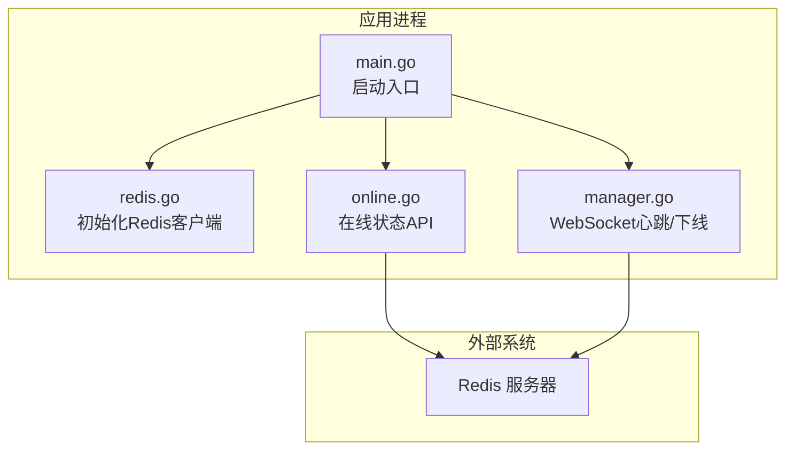
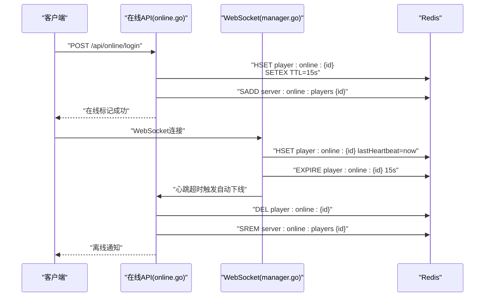
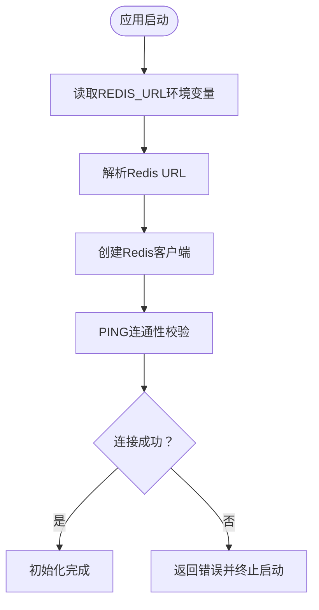
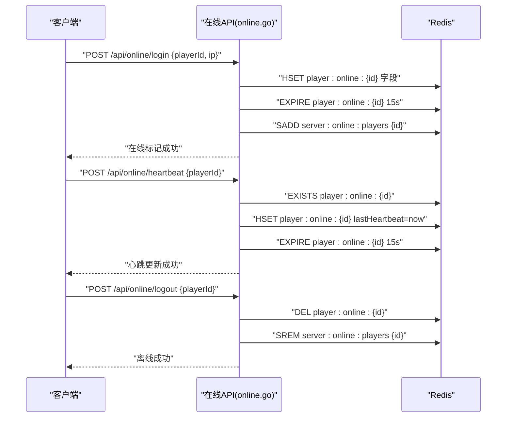
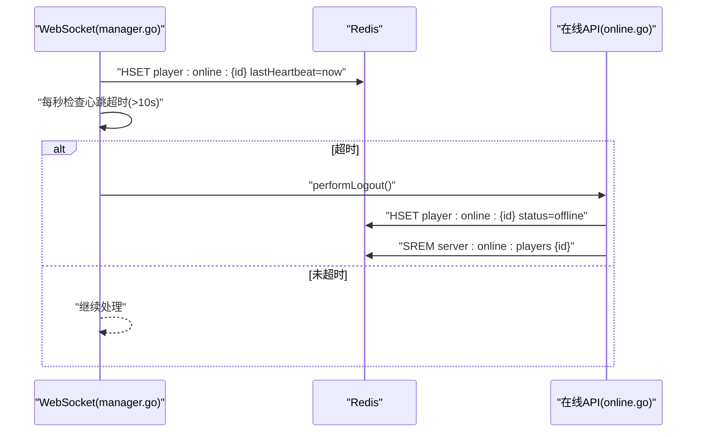
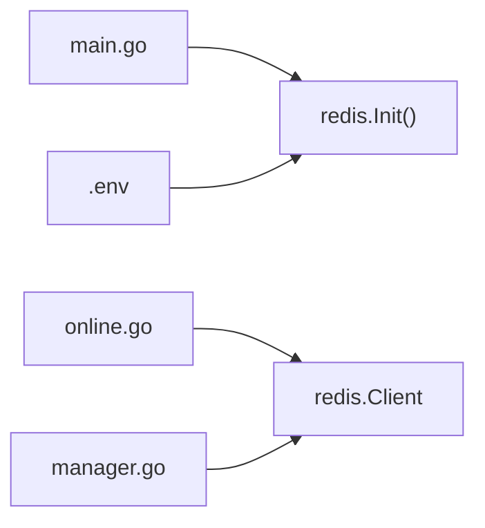

# Redis缓存与状态管理

<cite>
**本文引用的文件**
- [redis.go](file://server-go/internal/redis/redis.go)
- [main.go](file://server-go/cmd/server/main.go)
- [online.go](file://server-go/internal/http/handlers/online/online.go)
- [manager.go](file://server-go/internal/websocket/manager.go)
- [.env](file://server-go/.env)
- [HEARTBEAT_AND_LOGOUT_GUIDE.md](file://HEARTBEAT_AND_LOGOUT_GUIDE.md)
- [test-heartbeat-timeout.js](file://test-heartbeat-timeout.js)
- [diagnose-online-status.js](file://diagnose-online-status.js)
</cite>

## 目录
1. [简介](#简介)
2. [项目结构](#项目结构)
3. [核心组件](#核心组件)
4. [架构总览](#架构总览)
5. [详细组件分析](#详细组件分析)
6. [依赖关系分析](#依赖关系分析)
7. [性能考量](#性能考量)
8. [故障排查指南](#故障排查指南)
9. [结论](#结论)

## 简介
本文件围绕 Redis 在系统中的角色与实现展开，重点聚焦以下方面：
- Redis 的初始化与连接管理：由独立模块负责，应用启动时在主程序中调用初始化。
- 在线状态与心跳缓存：使用哈希键存储玩家在线信息，使用集合维护在线玩家ID列表，并通过 TTL 实现自动过期。
- 与 WebSocket 的联动：前端通过 WebSocket 每秒发送心跳，后端同时更新内存与 Redis；若心跳超时，自动执行离线流程。
- 缓存策略与序列化：采用字符串字段存储数值时间戳，未见显式序列化为 JSON 或二进制的证据。
- 高并发与风险：基于现有实现，未发现分布式锁或会话缓存的直接证据；针对缓存穿透/雪崩的防护策略亦未在代码中体现。

## 项目结构
Redis 相关代码集中在 server-go 内部模块中，主要文件如下：
- server-go/internal/redis/redis.go：提供全局 Redis 客户端与初始化函数。
- server-go/cmd/server/main.go：应用启动入口，在启动阶段调用 redis.Init()。
- server-go/internal/http/handlers/online/online.go：在线状态与心跳 API 的实现，使用 Redis 进行状态记录与查询。
- server-go/internal/websocket/manager.go：WebSocket 层面的心跳处理与超时自动下线逻辑，同时更新 Redis。
- server-go/.env：包含 REDIS_URL 环境变量示例。
- HEARTBEAT_AND_LOGOUT_GUIDE.md：心跳与自动下线的工作流说明。
- test-heartbeat-timeout.js：心跳超时自动下线的端到端测试脚本。
- diagnose-online-status.js：在线状态诊断脚本。

图表来源
- [main.go](file://server-go/cmd/server/main.go#L31-L40)
- [redis.go](file://server-go/internal/redis/redis.go#L15-L33)
- [online.go](file://server-go/internal/http/handlers/online/online.go#L24-L110)
- [manager.go](file://server-go/internal/websocket/manager.go#L190-L309)

章节来源
- [main.go](file://server-go/cmd/server/main.go#L31-L40)
- [redis.go](file://server-go/internal/redis/redis.go#L15-L33)

## 核心组件
- Redis 初始化模块
  - 提供全局客户端与上下文，支持从环境变量加载连接地址，默认回退到本地端口。
  - 初始化时解析 URL 并执行 PING 校验，确保连接可用。
- 在线状态与心跳 API
  - 登录：写入哈希键，设置 TTL，同时将玩家ID加入在线集合。
  - 心跳：校验在线状态，更新哈希键中的最后心跳时间并刷新 TTL。
  - 离线：删除哈希键，从在线集合移除玩家ID。
  - 查询：获取在线集合，遍历每个玩家哈希键，过滤状态为在线的玩家并返回必要字段。
- WebSocket 心跳与自动下线
  - readLoop：接收 ping 消息并更新内存心跳时间，同时更新 Redis 中的 lastHeartbeat。
  - writeLoop：每秒检查心跳超时，超时后触发 performLogout。
  - performLogout：更新数据库的灵力增长时间戳，标记 Redis 状态为 offline，从在线集合移除玩家ID。

章节来源
- [redis.go](file://server-go/internal/redis/redis.go#L15-L33)
- [online.go](file://server-go/internal/http/handlers/online/online.go#L24-L110)
- [online.go](file://server-go/internal/http/handlers/online/online.go#L112-L186)
- [online.go](file://server-go/internal/http/handlers/online/online.go#L188-L253)
- [online.go](file://server-go/internal/http/handlers/online/online.go#L255-L318)
- [manager.go](file://server-go/internal/websocket/manager.go#L190-L309)

## 架构总览
Redis 在系统中承担“在线玩家状态中心”的职责：
- 作为会话状态的临时存储：玩家登录后在 Redis 中写入在线信息，心跳更新保持活跃，TTL 保证过期清理。
- 作为在线列表的聚合索引：通过集合维护在线玩家ID，查询时可快速获取在线集合再拉取各玩家详情。
- 与业务流程解耦：在线状态变更由 API 与 WebSocket 共同驱动，业务层仅依赖 Redis 的键空间约定。

图表来源
- [online.go](file://server-go/internal/http/handlers/online/online.go#L24-L110)
- [online.go](file://server-go/internal/http/handlers/online/online.go#L112-L186)
- [online.go](file://server-go/internal/http/handlers/online/online.go#L188-L253)
- [manager.go](file://server-go/internal/websocket/manager.go#L190-L309)

## 详细组件分析

### Redis 初始化与连接管理
- 初始化流程
  - 从环境变量读取 REDIS_URL，若为空则使用默认本地地址。
  - 解析 URL 并创建客户端实例。
  - 执行 PING 校验，确保连接可用。
- 上下文与客户端
  - 提供全局客户端与背景上下文，供上层模块直接使用。
- 启动集成
  - 主程序在启动阶段调用 redis.Init()，失败即终止启动。

图表来源
- [main.go](file://server-go/cmd/server/main.go#L31-L40)
- [redis.go](file://server-go/internal/redis/redis.go#L15-L33)
- [.env](file://server-go/.env#L1-L9)

章节来源
- [redis.go](file://server-go/internal/redis/redis.go#L15-L33)
- [main.go](file://server-go/cmd/server/main.go#L31-L40)
- [.env](file://server-go/.env#L1-L9)

### 在线状态与心跳 API
- 登录(Login)
  - 参数校验：接收玩家ID与IP。
  - 数据库侧重置灵力增长时间戳。
  - Redis 写入哈希键，包含玩家ID、登录时间、最后心跳时间、IP、状态等字段。
  - 设置哈希键 TTL 为 15 秒。
  - 将玩家ID加入在线集合 server:online:players。
- 心跳(Heartbeat)
  - 校验在线状态：存在性检查。
  - 更新哈希键中的 lastHeartbeat 字段为当前毫秒时间戳。
  - 刷新哈希键 TTL 为 15 秒。
- 离线(Logout)
  - 校验在线状态：存在性检查。
  - 删除哈希键。
  - 从在线集合 server:online:players 移除玩家ID。
- 查询(GetOnlinePlayers / GetPlayerOnlineStatus)
  - GetOnlinePlayers：从在线集合取出所有ID，遍历每个玩家哈希键，过滤 status=online 的记录，返回必要字段。
  - GetPlayerOnlineStatus：按玩家ID查询哈希键，返回状态与时间戳等信息。

图表来源
- [online.go](file://server-go/internal/http/handlers/online/online.go#L24-L110)
- [online.go](file://server-go/internal/http/handlers/online/online.go#L112-L186)
- [online.go](file://server-go/internal/http/handlers/online/online.go#L188-L253)

章节来源
- [online.go](file://server-go/internal/http/handlers/online/online.go#L24-L110)
- [online.go](file://server-go/internal/http/handlers/online/online.go#L112-L186)
- [online.go](file://server-go/internal/http/handlers/online/online.go#L188-L253)
- [online.go](file://server-go/internal/http/handlers/online/online.go#L255-L318)

### WebSocket 心跳与自动下线
- 心跳处理
  - readLoop：接收 ping 消息，更新内存 lastHeartbeat，并同步更新 Redis 中的 lastHeartbeat 字段。
  - writeLoop：每秒检查心跳是否超时（10 秒），超时则触发 performLogout。
- 自动下线
  - performLogout：先更新数据库的灵力增长时间戳，再将 Redis 中的状态标记为 offline，并从在线集合移除玩家ID。

图表来源
- [manager.go](file://server-go/internal/websocket/manager.go#L190-L309)
- [HEARTBEAT_AND_LOGOUT_GUIDE.md](file://HEARTBEAT_AND_LOGOUT_GUIDE.md#L63-L133)

章节来源
- [manager.go](file://server-go/internal/websocket/manager.go#L190-L309)
- [HEARTBEAT_AND_LOGOUT_GUIDE.md](file://HEARTBEAT_AND_LOGOUT_GUIDE.md#L63-L133)

## 依赖关系分析
- 启动依赖
  - main.go 依赖 redis.Init() 完成 Redis 初始化。
- 在线模块依赖
  - online.go 依赖 redis 包提供的全局客户端与上下文。
- WebSocket 依赖
  - manager.go 依赖 redis 包更新在线状态。
- 环境依赖
  - .env 文件提供 REDIS_URL 示例，用于初始化连接。

图表来源
- [main.go](file://server-go/cmd/server/main.go#L31-L40)
- [redis.go](file://server-go/internal/redis/redis.go#L15-L33)
- [online.go](file://server-go/internal/http/handlers/online/online.go#L24-L110)
- [manager.go](file://server-go/internal/websocket/manager.go#L190-L309)
- [.env](file://server-go/.env#L1-L9)

章节来源
- [main.go](file://server-go/cmd/server/main.go#L31-L40)
- [redis.go](file://server-go/internal/redis/redis.go#L15-L33)
- [online.go](file://server-go/internal/http/handlers/online/online.go#L24-L110)
- [manager.go](file://server-go/internal/websocket/manager.go#L190-L309)
- [.env](file://server-go/.env#L1-L9)

## 性能考量
- 键空间与数据模型
  - 使用哈希键存储单玩家的多字段信息，减少键数量。
  - 使用集合维护在线玩家ID，查询在线列表时可先取集合再拉取详情，降低单次查询的数据量。
- TTL 设计
  - 登录与心跳均设置 15 秒 TTL，有助于在异常情况下快速回收资源。
  - WebSocket 层面心跳超时阈值为 10 秒，与 Redis TTL 协同，确保超时后尽快失效。
- 序列化与编码
  - 现有实现将数值时间戳以字符串形式写入 Redis，未见显式 JSON 或二进制序列化的证据。
- 并发与一致性
  - 登录/心跳/离线均为单键操作，Redis 单线程模型天然保证原子性。
  - 在线列表的集合操作与哈希键操作分别进行，查询时需注意集合与哈希键之间的时间窗口差异（例如离线后集合先移除，哈希键可能仍存在但已过期）。
- 缓存穿透/雪崩
  - 代码中未见针对空值缓存、热点键预热、互斥锁等专门的防护措施。
  - 若需要增强稳定性，可在查询前增加布隆过滤器或热点键保护，或在离线后立即删除哈希键以避免穿透。

[本节为通用性能建议，不直接分析具体文件，故无章节来源]

## 故障排查指南
- 启动失败
  - 现象：应用启动时报 Redis 初始化错误。
  - 排查：确认 REDIS_URL 是否正确，Redis 服务是否可达，网络与认证配置是否正确。
- 在线列表为空
  - 现象：查询在线列表返回空。
  - 排查：确认登录/心跳是否成功写入集合与哈希键；检查 TTL 是否过短导致过期；使用诊断脚本核对集合与哈希键内容。
- 心跳超时未下线
  - 现象：停止心跳后未触发自动下线。
  - 排查：确认 WebSocket 层是否持续更新 Redis 中的 lastHeartbeat；检查 writeLoop 的心跳超时阈值与日志；查看 performLogout 是否执行。
- 离线后仍显示在线
  - 现象：离线后查询仍显示在线。
  - 排查：确认 SREM 是否执行成功；检查哈希键是否被 DEL；确认 TTL 是否导致数据提前过期。

章节来源
- [main.go](file://server-go/cmd/server/main.go#L31-L40)
- [redis.go](file://server-go/internal/redis/redis.go#L15-L33)
- [online.go](file://server-go/internal/http/handlers/online/online.go#L255-L318)
- [manager.go](file://server-go/internal/websocket/manager.go#L190-L309)
- [diagnose-online-status.js](file://diagnose-online-status.js#L1-L59)
- [test-heartbeat-timeout.js](file://test-heartbeat-timeout.js#L115-L205)

## 结论
- Redis 在本系统中承担在线玩家状态中心的角色，通过哈希键与集合实现轻量级、高并发的在线状态管理。
- 应用启动时在 main.go 中调用 redis.Init() 完成连接初始化，确保后续 API 与 WebSocket 能稳定访问 Redis。
- 在线状态由 API 与 WebSocket 共同维护：API 负责显式登录/心跳/离线，WebSocket 负责隐式心跳与超时自动下线。
- 当前实现未发现分布式锁或会话缓存的直接证据；针对缓存穿透/雪崩的专项防护也未在代码中体现，建议在高并发场景下引入布隆过滤器、热点键保护等策略以提升稳定性。