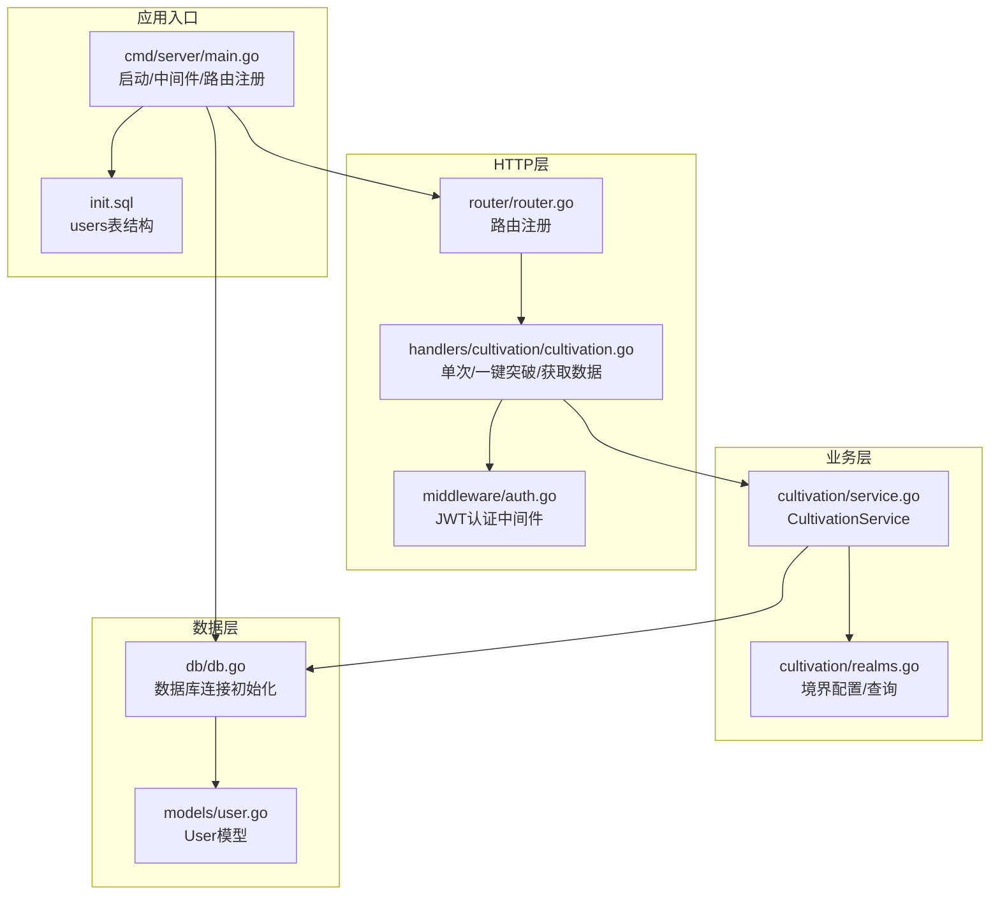
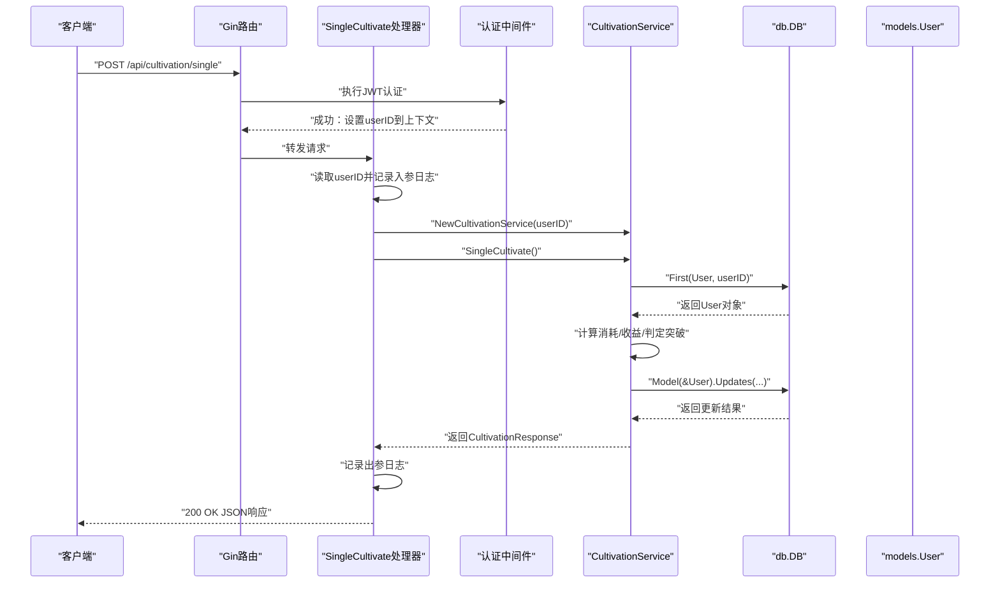
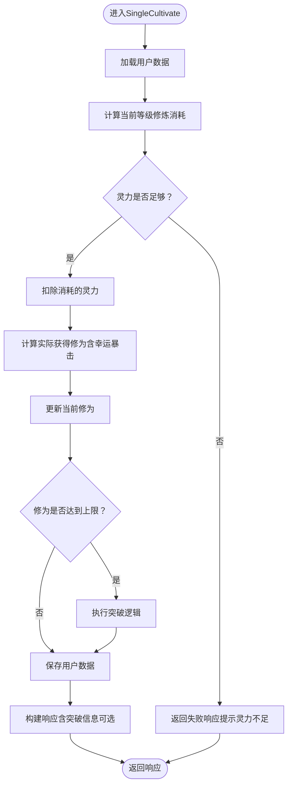
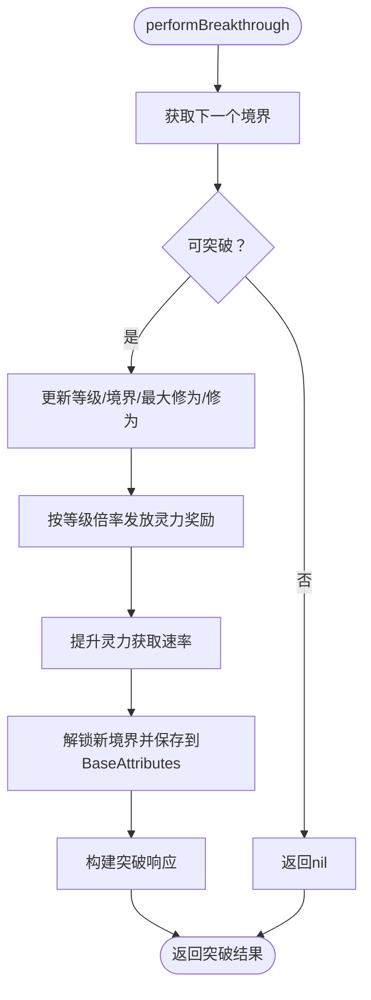
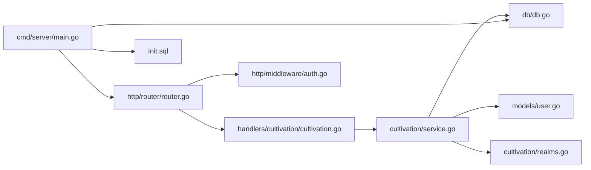

# 修炼系统后端架构

<cite>
**本文引用的文件**
- [server-go/internal/http/handlers/cultivation/cultivation.go](file://server-go/internal/http/handlers/cultivation/cultivation.go)
- [server-go/internal/cultivation/service.go](file://server-go/internal/cultivation/service.go)
- [server-go/internal/cultivation/models.go](file://server-go/internal/cultivation/models.go)
- [server-go/internal/cultivation/realms.go](file://server-go/internal/cultivation/realms.go)
- [server-go/internal/models/user.go](file://server-go/internal/models/user.go)
- [server-go/internal/db/db.go](file://server-go/internal/db/db.go)
- [server-go/internal/http/middleware/auth.go](file://server-go/internal/http/middleware/auth.go)
- [server-go/internal/http/router/router.go](file://server-go/internal/http/router/router.go)
- [server-go/cmd/server/main.go](file://server-go/cmd/server/main.go)
- [server-go/init.sql](file://server-go/init.sql)
</cite>

## 目录
1. [简介](#简介)
2. [项目结构](#项目结构)
3. [核心组件](#核心组件)
4. [架构总览](#架构总览)
5. [详细组件分析](#详细组件分析)
6. [依赖关系分析](#依赖关系分析)
7. [性能考量](#性能考量)
8. [故障排查指南](#故障排查指南)
9. [结论](#结论)

## 简介
本文件面向“修炼系统”的后端架构，聚焦于HTTP处理器层、业务逻辑层与数据访问层在“单次打坐修炼”场景下的职责划分与协作流程。文档将围绕以下关键点展开：
- HTTP处理器如何解析请求、提取用户上下文并调用服务层方法；
- 业务服务如何计算修炼收益、判定突破条件并更新用户状态；
- 数据访问层如何持久化用户数据；
- 错误处理与日志记录策略；
- 境界突破逻辑的实现细节；
- 事务管理策略与性能优化建议。

## 项目结构
后端采用分层架构：HTTP层负责路由与请求/响应封装；业务层承载领域逻辑；数据层负责数据库交互；模型层定义数据结构；中间件负责认证与日志注入；路由注册集中于router模块；数据库初始化在cmd/server/main.go中完成。



图表来源
- [server-go/internal/http/handlers/cultivation/cultivation.go](file://server-go/internal/http/handlers/cultivation/cultivation.go#L1-L122)
- [server-go/internal/http/middleware/auth.go](file://server-go/internal/http/middleware/auth.go#L1-L76)
- [server-go/internal/http/router/router.go](file://server-go/internal/http/router/router.go#L1-L126)
- [server-go/internal/cultivation/service.go](file://server-go/internal/cultivation/service.go#L1-L355)
- [server-go/internal/cultivation/realms.go](file://server-go/internal/cultivation/realms.go#L1-L192)
- [server-go/internal/db/db.go](file://server-go/internal/db/db.go#L1-L45)
- [server-go/internal/models/user.go](file://server-go/internal/models/user.go#L1-L48)
- [server-go/cmd/server/main.go](file://server-go/cmd/server/main.go#L1-L107)
- [server-go/init.sql](file://server-go/init.sql#L1-L45)

章节来源
- [server-go/internal/http/router/router.go](file://server-go/internal/http/router/router.go#L94-L102)
- [server-go/internal/http/middleware/auth.go](file://server-go/internal/http/middleware/auth.go#L1-L76)
- [server-go/cmd/server/main.go](file://server-go/cmd/server/main.go#L31-L106)

## 核心组件
- HTTP处理器：封装请求参数、提取用户上下文、调用服务层并返回标准化响应。
- 业务服务：封装修炼计算、突破判定与属性更新逻辑。
- 数据模型：User模型承载修炼相关字段与JSON属性存储。
- 数据库：GORM连接初始化，统一通过db.DB进行读写。
- 境界配置：预置的境界列表与查询工具，支撑突破判定与奖励发放。

章节来源
- [server-go/internal/http/handlers/cultivation/cultivation.go](file://server-go/internal/http/handlers/cultivation/cultivation.go#L20-L121)
- [server-go/internal/cultivation/service.go](file://server-go/internal/cultivation/service.go#L1-L355)
- [server-go/internal/models/user.go](file://server-go/internal/models/user.go#L12-L42)
- [server-go/internal/db/db.go](file://server-go/internal/db/db.go#L1-L45)
- [server-go/internal/cultivation/realms.go](file://server-go/internal/cultivation/realms.go#L1-L192)

## 架构总览
下图展示了从HTTP请求到数据库更新的完整调用链，涵盖认证、处理器、服务与数据层的关键节点。



图表来源
- [server-go/internal/http/handlers/cultivation/cultivation.go](file://server-go/internal/http/handlers/cultivation/cultivation.go#L20-L51)
- [server-go/internal/http/middleware/auth.go](file://server-go/internal/http/middleware/auth.go#L18-L75)
- [server-go/internal/cultivation/service.go](file://server-go/internal/cultivation/service.go#L76-L151)
- [server-go/internal/db/db.go](file://server-go/internal/db/db.go#L1-L45)
- [server-go/internal/models/user.go](file://server-go/internal/models/user.go#L12-L42)

## 详细组件分析

### HTTP处理器层：SingleCultivate
- 职责
  - 从Gin上下文中提取userID；
  - 记录结构化日志；
  - 实例化CultivationService并调用SingleCultivate；
  - 统一错误处理与响应格式。
- 关键点
  - 未授权时直接返回401；
  - 成功时返回JSON响应，包含本次修炼获得的修为、消耗的灵力、当前修为，以及可能的突破信息。

章节来源
- [server-go/internal/http/handlers/cultivation/cultivation.go](file://server-go/internal/http/handlers/cultivation/cultivation.go#L20-L51)

### 业务逻辑层：CultivationService.SingleCultivate
- 职责
  - 读取用户数据；
  - 计算当前等级的修炼消耗与收益（含幸运暴击）；
  - 检查灵力是否足够；
  - 若修为达到上限则执行突破；
  - 更新用户属性（BaseAttributes JSON）与核心修炼字段；
  - 返回标准化响应。
- 关键算法
  - 修炼消耗与收益按等级指数递增；
  - 幸运暴击按概率触发，收益翻倍；
  - 突破时重置修为、提升最大修为、发放灵力奖励、提升灵力获取速率并解锁新境界。



图表来源
- [server-go/internal/cultivation/service.go](file://server-go/internal/cultivation/service.go#L76-L151)

章节来源
- [server-go/internal/cultivation/service.go](file://server-go/internal/cultivation/service.go#L76-L151)

### 境界突破逻辑：performBreakthrough
- 职责
  - 获取下一个境界信息；
  - 更新等级、境界、最大修为并重置修为；
  - 发放突破奖励（灵力与灵力获取速率提升）；
  - 解锁新境界并持久化到BaseAttributes。
- 与realm配置的关系
  - 通过GetNextRealm(currentLevel)与GetMaxLevel()判断是否可突破；
  - 境界上限由realms配置决定。



图表来源
- [server-go/internal/cultivation/service.go](file://server-go/internal/cultivation/service.go#L240-L280)
- [server-go/internal/cultivation/realms.go](file://server-go/internal/cultivation/realms.go#L171-L192)

章节来源
- [server-go/internal/cultivation/service.go](file://server-go/internal/cultivation/service.go#L240-L312)
- [server-go/internal/cultivation/realms.go](file://server-go/internal/cultivation/realms.go#L171-L192)

### 数据访问层：db.DB与User模型
- db.DB
  - 初始化于应用启动阶段，使用环境变量配置连接参数；
  - 提供ORM能力，贯穿所有数据读写。
- User模型
  - 包含level、realm、cultivation、max_cultivation、spirit等核心字段；
  - BaseAttributes以JSON形式存储玩家属性（如cultivationRate、spiritRate、unlockedRealms）；
  - users表结构由init.sql定义，字段与模型保持一致。

章节来源
- [server-go/internal/db/db.go](file://server-go/internal/db/db.go#L1-L45)
- [server-go/internal/models/user.go](file://server-go/internal/models/user.go#L12-L42)
- [server-go/init.sql](file://server-go/init.sql#L10-L31)

### 类关系图（代码级）
```mermaid
classDiagram
class CultivationService {
+uint userID
+SingleCultivate() *CultivationResponse
+CultivateUntilBreakthrough() *CultivationResponse
+GetCultivationData() *CultivationData
-getPlayerAttributes(user) map[string]interface{}
-setPlayerAttributes(user, attrs) error
-performBreakthrough(user, attrs) *BreakthroughResponse
-unlockRealm(user, attrs) error
}
class User {
+uint id
+string username
+string playerName
+int level
+string realm
+float64 cultivation
+float64 maxCultivation
+float64 spirit
+datatypes.JSON baseAttributes
+time.Time lastSpiritGainTime
}
class DB {
+*gorm.DB DB
+Init() error
}
CultivationService --> User : "读取/更新"
CultivationService --> DB : "使用"
```

图表来源
- [server-go/internal/cultivation/service.go](file://server-go/internal/cultivation/service.go#L1-L355)
- [server-go/internal/models/user.go](file://server-go/internal/models/user.go#L12-L42)
- [server-go/internal/db/db.go](file://server-go/internal/db/db.go#L1-L45)

## 依赖关系分析
- 层内依赖
  - HTTP处理器依赖业务服务（NewCultivationService(userID)）；
  - 业务服务依赖数据层（db.DB）、模型（models.User）、境界配置（realms）；
  - 路由注册集中于router，统一挂载认证中间件Protect()。
- 外部依赖
  - Gin作为Web框架；
  - JWT用于认证；
  - Zap用于结构化日志；
  - GORM用于数据库访问；
  - PostgreSQL驱动。



图表来源
- [server-go/internal/http/handlers/cultivation/cultivation.go](file://server-go/internal/http/handlers/cultivation/cultivation.go#L1-L122)
- [server-go/internal/cultivation/service.go](file://server-go/internal/cultivation/service.go#L1-L355)
- [server-go/internal/db/db.go](file://server-go/internal/db/db.go#L1-L45)
- [server-go/internal/models/user.go](file://server-go/internal/models/user.go#L12-L42)
- [server-go/internal/cultivation/realms.go](file://server-go/internal/cultivation/realms.go#L1-L192)
- [server-go/internal/http/router/router.go](file://server-go/internal/http/router/router.go#L94-L102)
- [server-go/internal/http/middleware/auth.go](file://server-go/internal/http/middleware/auth.go#L1-L76)
- [server-go/cmd/server/main.go](file://server-go/cmd/server/main.go#L31-L106)
- [server-go/init.sql](file://server-go/init.sql#L10-L31)

章节来源
- [server-go/internal/http/router/router.go](file://server-go/internal/http/router/router.go#L94-L102)
- [server-go/internal/http/middleware/auth.go](file://server-go/internal/http/middleware/auth.go#L18-L75)
- [server-go/cmd/server/main.go](file://server-go/cmd/server/main.go#L31-L106)

## 性能考量
- 计算复杂度
  - SingleCultivate主要为O(1)计算，涉及少量数学运算与JSON解析；
  - 突破逻辑同样为O(1)，但会额外进行一次数据库更新。
- 数据库访问
  - 单次读取与一次更新，无复杂联表查询；
  - 建议在高并发场景下：
    - 使用连接池参数优化（由GORM/驱动控制）；
    - 对频繁读取的用户数据增加缓存（Redis）以减少DB压力；
    - 将突破奖励发放与属性更新合并为原子更新，避免重复读取。
- 日志与中间件
  - 已集成gzip压缩与结构化日志，有助于降低带宽与便于问题定位；
  - 建议对高频接口开启限流与熔断，防止突发流量冲击。
- 事务管理
  - 当前实现未显式使用事务，但单次更新为原子操作（GORM Updates），满足一致性要求；
  - 若未来扩展为多步写入（例如同时更新多个表），建议引入事务包裹，确保原子性与回滚能力。

[本节为通用性能建议，不直接分析具体文件]

## 故障排查指南
- 认证失败
  - 现象：返回401未授权；
  - 排查：确认Authorization头格式、JWT_SECRET配置、令牌有效性。
- 修炼失败
  - 现象：返回500内部错误；
  - 排查：查看zap日志中“cultivation failed”条目，定位具体错误（如数据库更新失败）。
- 突破失败
  - 现象：返回错误信息（如已达最高境界、突破失败）；
  - 排查：确认用户等级、境界配置是否正确、BaseAttributes中unlockedRealms是否更新。
- 灵力不足
  - 现象：返回提示需要的灵力与当前灵力；
  - 排查：核对计算消耗公式与用户当前spirit值。

章节来源
- [server-go/internal/http/handlers/cultivation/cultivation.go](file://server-go/internal/http/handlers/cultivation/cultivation.go#L20-L51)
- [server-go/internal/http/middleware/auth.go](file://server-go/internal/http/middleware/auth.go#L18-L75)
- [server-go/internal/cultivation/service.go](file://server-go/internal/cultivation/service.go#L153-L238)

## 结论
- 该修炼系统采用清晰的分层架构：HTTP层仅负责请求接入与响应封装，业务层专注领域逻辑，数据层提供统一的ORM访问；
- SingleCultivate调用链简洁高效，覆盖了修炼收益计算、灵力消耗、突破判定与属性更新；
- 境界配置集中管理，便于扩展与维护；
- 建议在未来引入事务与缓存以进一步提升可靠性与性能。