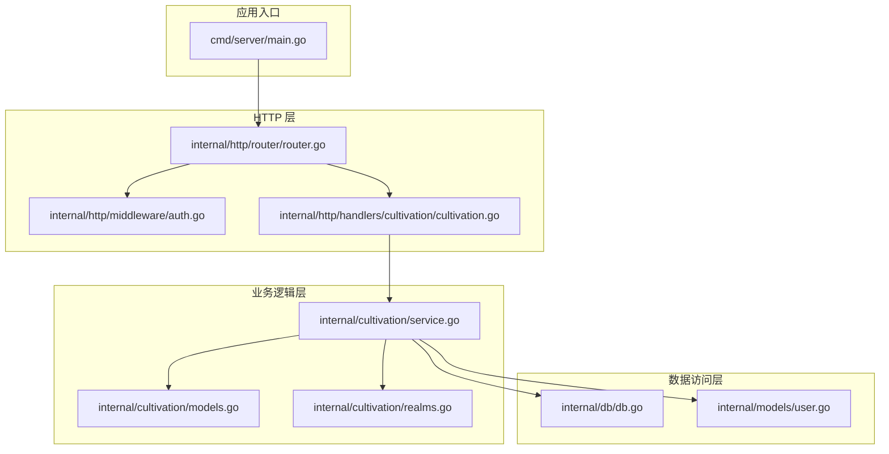
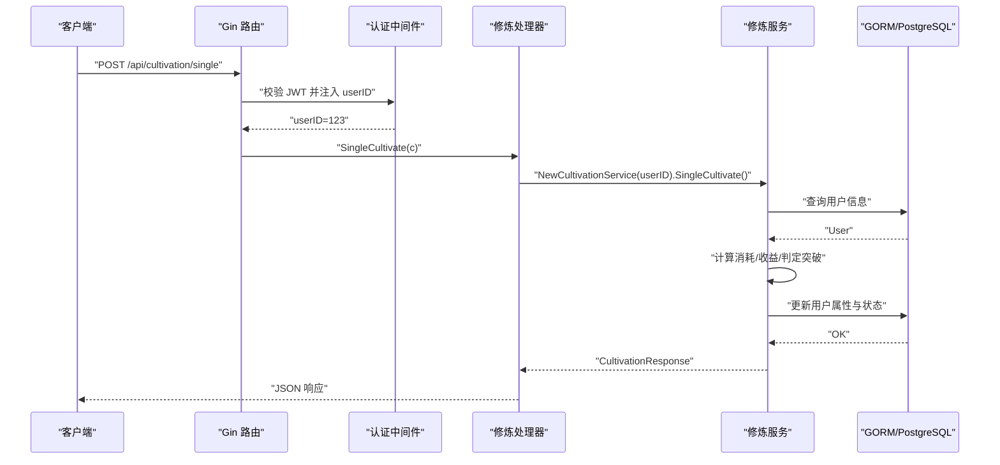
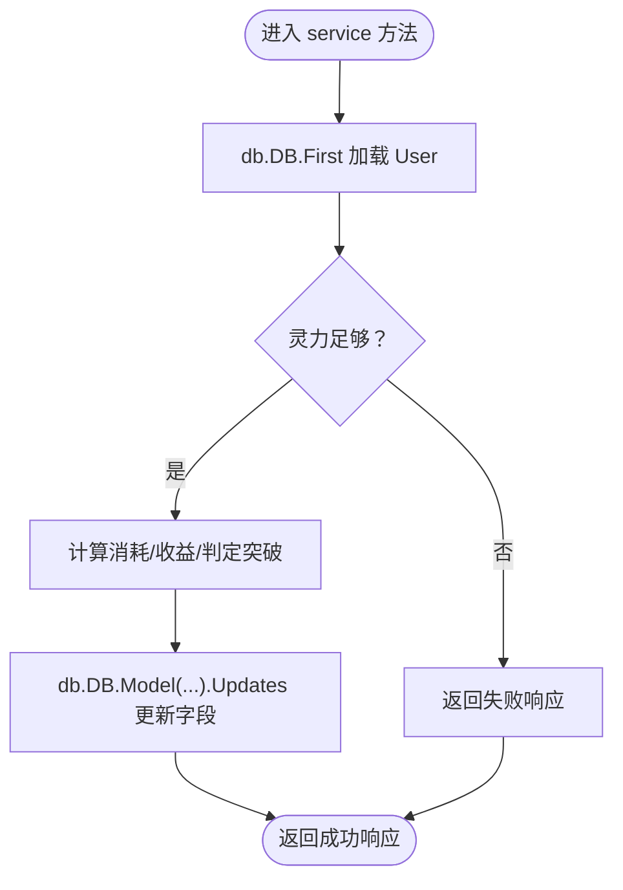
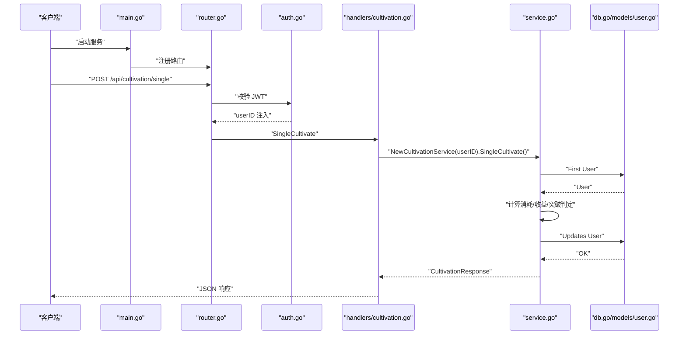
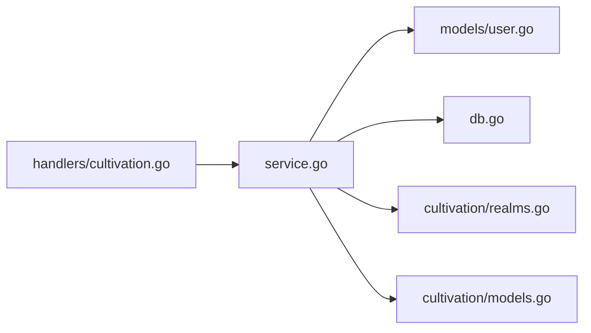

# 后端分层架构

<cite>
**本文引用的文件**
- [server-go/cmd/server/main.go](file://server-go/cmd/server/main.go)
- [server-go/internal/http/router/router.go](file://server-go/internal/http/router/router.go)
- [server-go/internal/http/middleware/auth.go](file://server-go/internal/http/middleware/auth.go)
- [server-go/internal/http/handlers/cultivation/cultivation.go](file://server-go/internal/http/handlers/cultivation/cultivation.go)
- [server-go/internal/cultivation/service.go](file://server-go/internal/cultivation/service.go)
- [server-go/internal/cultivation/models.go](file://server-go/internal/cultivation/models.go)
- [server-go/internal/cultivation/realms.go](file://server-go/internal/cultivation/realms.go)
- [server-go/internal/db/db.go](file://server-go/internal/db/db.go)
- [server-go/internal/models/user.go](file://server-go/internal/models/user.go)
- [server-go/init.sql](file://server-go/init.sql)
</cite>

## 目录
1. [引言](#引言)
2. [项目结构](#项目结构)
3. [核心组件](#核心组件)
4. [架构总览](#架构总览)
5. [详细组件分析](#详细组件分析)
6. [依赖关系分析](#依赖关系分析)
7. [性能考量](#性能考量)
8. [故障排查指南](#故障排查指南)
9. [结论](#结论)

## 引言
本文件面向 xiuxian-go 后端的分层架构，聚焦于 HTTP 处理器层（handlers）、业务逻辑层（service）与数据访问层（models）的职责分离与协作机制。文档将以“单次打坐修炼”为例，完整梳理一次请求从 HTTP 层进入，经由 service 层封装核心业务逻辑，再到 models 层通过 GORM 与 PostgreSQL 交互的调用链路。同时，文档解释各层之间的依赖方向、解耦策略，以及如何通过接口设计（如 service 工厂函数）提升可测试性。

## 项目结构
后端采用 Go 语言与 Gin 框架，按功能域划分模块，遵循“分层 + 功能域”的组织方式：
- cmd/server：应用入口，初始化数据库、Redis、日志、路由与 WebSocket
- internal/http：HTTP 层，包含路由注册、中间件与各功能域的处理器
- internal/cultivation：修炼功能域，包含 service、models、realm 配置
- internal/db：数据库初始化与全局 GORM 实例
- internal/models：通用数据模型（如 User）



图表来源
- [server-go/cmd/server/main.go](file://server-go/cmd/server/main.go#L1-L107)
- [server-go/internal/http/router/router.go](file://server-go/internal/http/router/router.go#L1-L126)
- [server-go/internal/http/middleware/auth.go](file://server-go/internal/http/middleware/auth.go#L1-L76)
- [server-go/internal/http/handlers/cultivation/cultivation.go](file://server-go/internal/http/handlers/cultivation/cultivation.go#L1-L122)
- [server-go/internal/cultivation/service.go](file://server-go/internal/cultivation/service.go#L1-L355)
- [server-go/internal/cultivation/models.go](file://server-go/internal/cultivation/models.go#L1-L89)
- [server-go/internal/cultivation/realms.go](file://server-go/internal/cultivation/realms.go#L1-L192)
- [server-go/internal/db/db.go](file://server-go/internal/db/db.go#L1-L45)
- [server-go/internal/models/user.go](file://server-go/internal/models/user.go#L1-L48)

章节来源
- [server-go/cmd/server/main.go](file://server-go/cmd/server/main.go#L1-L107)
- [server-go/internal/http/router/router.go](file://server-go/internal/http/router/router.go#L1-L126)

## 核心组件
- HTTP 处理器层（handlers）
  - 负责接收请求、解析上下文（如 userID、zap 日志）、构造响应
  - 在本仓库中，修炼相关处理器位于 internal/http/handlers/cultivation/cultivation.go
- 业务逻辑层（service）
  - 封装核心业务规则：计算消耗与收益、判定突破、持久化属性与状态
  - 修炼服务位于 internal/cultivation/service.go，提供 SingleCultivate、CultivateUntilBreakthrough、GetCultivationData 等方法
- 数据访问层（models）
  - 通过 GORM 与 PostgreSQL 交互，内部 models 定义 User 结构体，db 初始化全局 DB 实例
  - 修炼领域模型与常量定义在 internal/cultivation/models.go 与 internal/cultivation/realms.go

章节来源
- [server-go/internal/http/handlers/cultivation/cultivation.go](file://server-go/internal/http/handlers/cultivation/cultivation.go#L1-L122)
- [server-go/internal/cultivation/service.go](file://server-go/internal/cultivation/service.go#L1-L355)
- [server-go/internal/db/db.go](file://server-go/internal/db/db.go#L1-L45)
- [server-go/internal/models/user.go](file://server-go/internal/models/user.go#L1-L48)
- [server-go/internal/cultivation/models.go](file://server-go/internal/cultivation/models.go#L1-L89)
- [server-go/internal/cultivation/realms.go](file://server-go/internal/cultivation/realms.go#L1-L192)

## 架构总览
后端采用“请求驱动”的分层模式：
- 入口：main.go 初始化数据库、路由、中间件与 WebSocket
- 路由：router.go 注册 /api/cultivation 下的修炼相关接口
- 中间件：auth.go 提供 JWT 校验，向上下文注入 userID
- 处理器：handlers/cultivation/cultivation.go 从上下文取 userID，构造 service 并调用业务方法
- 业务：service 层封装算法与事务边界，读写 models 与 realm 配置
- 数据：db 初始化 GORM 连接，models 使用 GORM ORM 映射 PostgreSQL 表



图表来源
- [server-go/cmd/server/main.go](file://server-go/cmd/server/main.go#L1-L107)
- [server-go/internal/http/router/router.go](file://server-go/internal/http/router/router.go#L94-L102)
- [server-go/internal/http/middleware/auth.go](file://server-go/internal/http/middleware/auth.go#L1-L76)
- [server-go/internal/http/handlers/cultivation/cultivation.go](file://server-go/internal/http/handlers/cultivation/cultivation.go#L20-L51)
- [server-go/internal/cultivation/service.go](file://server-go/internal/cultivation/service.go#L76-L151)
- [server-go/internal/db/db.go](file://server-go/internal/db/db.go#L1-L45)

## 详细组件分析

### HTTP 处理器层（handlers）
- 职责
  - 从 gin 上下文提取 userID 与 zap 日志实例
  - 构造 service 实例并调用对应业务方法
  - 统一错误处理与日志记录
- 关键点
  - SingleCultivate：读取 userID，调用 service.SingleCultivate，返回 JSON
  - 认证失败时直接返回 401
  - 错误统一捕获并记录 zap 日志

章节来源
- [server-go/internal/http/handlers/cultivation/cultivation.go](file://server-go/internal/http/handlers/cultivation/cultivation.go#L20-L51)
- [server-go/internal/http/middleware/auth.go](file://server-go/internal/http/middleware/auth.go#L1-L76)

### 业务逻辑层（service）
- 职责
  - 封装修炼算法：消耗/收益计算、幸运暴击、突破判定与奖励
  - 维护玩家属性（BaseAttributes JSON），持久化速率与解锁境界
  - 协调 models 与 realm 配置，执行数据更新
- 关键方法
  - SingleCultivate：单次修炼，检查灵力、计算收益、可能触发突破
  - CultivateUntilBreakthrough：一键突破，预估次数与消耗，执行突破
  - GetCultivationData：返回当前修炼状态与可计算指标
  - performBreakthrough/unlockRealm：突破流程与解锁逻辑
- 依赖
  - models.User：用户实体
  - db.DB：GORM 实例
  - cultivation/models 常量与结构体：收益/消耗参数
  - cultivation/realms：境界配置与最大等级

```mermaid
classDiagram
class CultivationService {
-userID : uint
+SingleCultivate() : CultivationResponse
+CultivateUntilBreakthrough() : CultivationResponse
+GetCultivationData() : CultivationData
-performBreakthrough(user, attrs) : BreakthroughResponse
-unlockRealm(user, attrs) : error
-getPlayerAttributes(user) : map[string]interface{}
-setPlayerAttributes(user, attrs) : error
}
class User {
+ID : uint
+Level : int
+Realm : string
+Cultivation : float64
+MaxCultivation : float64
+Spirit : float64
+BaseAttributes : JSON
}
class RealmInfo {
+Level : int
+Name : string
+MaxCultivation : float64
}
CultivationService --> User : "读取/更新"
CultivationService --> RealmInfo : "获取下一境界"
```

图表来源
- [server-go/internal/cultivation/service.go](file://server-go/internal/cultivation/service.go#L15-L355)
- [server-go/internal/models/user.go](file://server-go/internal/models/user.go#L1-L48)
- [server-go/internal/cultivation/realms.go](file://server-go/internal/cultivation/realms.go#L1-L192)

章节来源
- [server-go/internal/cultivation/service.go](file://server-go/internal/cultivation/service.go#L76-L238)
- [server-go/internal/cultivation/models.go](file://server-go/internal/cultivation/models.go#L1-L89)
- [server-go/internal/cultivation/realms.go](file://server-go/internal/cultivation/realms.go#L171-L192)

### 数据访问层（models + db）
- GORM 初始化
  - db.Init 构建 DSN 并打开 PostgreSQL 连接，导出全局 DB 实例
- 模型映射
  - models.User 映射 users 表，包含基础属性、JSON 字段（BaseAttributes 等）
  - init.sql 定义 users 与 items 等表结构，确保字段与模型一致
- 交互模式
  - service 层通过 db.DB 查询与更新 User，使用 GORM 的 First/Model/Updates



图表来源
- [server-go/internal/db/db.go](file://server-go/internal/db/db.go#L1-L45)
- [server-go/internal/models/user.go](file://server-go/internal/models/user.go#L1-L48)
- [server-go/internal/cultivation/service.go](file://server-go/internal/cultivation/service.go#L76-L151)
- [server-go/init.sql](file://server-go/init.sql#L1-L45)

章节来源
- [server-go/internal/db/db.go](file://server-go/internal/db/db.go#L1-L45)
- [server-go/internal/models/user.go](file://server-go/internal/models/user.go#L1-L48)
- [server-go/init.sql](file://server-go/init.sql#L1-L45)

### 一次“单次打坐修炼”的完整调用链
- 入口与路由
  - main.go 初始化 Gin、中间件、路由与 WebSocket
  - router.go 注册 /api/cultivation/single
  - auth.go 中间件校验 JWT，注入 userID
- 处理器
  - handlers/cultivation/cultivation.go 的 SingleCultivate 从上下文取 userID，构造 service 并调用 SingleCultivate
- 业务逻辑
  - service.SingleCultivate：加载 User，读取 BaseAttributes（含 cultivationRate、luck 等），计算消耗与收益，可能触发 performBreakthrough，最终更新 User 并返回响应
- 数据持久化
  - db.Init 初始化 GORM 连接，service 通过 db.DB 查询与更新 User



图表来源
- [server-go/cmd/server/main.go](file://server-go/cmd/server/main.go#L1-L107)
- [server-go/internal/http/router/router.go](file://server-go/internal/http/router/router.go#L94-L102)
- [server-go/internal/http/middleware/auth.go](file://server-go/internal/http/middleware/auth.go#L1-L76)
- [server-go/internal/http/handlers/cultivation/cultivation.go](file://server-go/internal/http/handlers/cultivation/cultivation.go#L20-L51)
- [server-go/internal/cultivation/service.go](file://server-go/internal/cultivation/service.go#L76-L151)
- [server-go/internal/db/db.go](file://server-go/internal/db/db.go#L1-L45)
- [server-go/internal/models/user.go](file://server-go/internal/models/user.go#L1-L48)

章节来源
- [server-go/internal/http/handlers/cultivation/cultivation.go](file://server-go/internal/http/handlers/cultivation/cultivation.go#L20-L51)
- [server-go/internal/cultivation/service.go](file://server-go/internal/cultivation/service.go#L76-L151)

## 依赖关系分析
- 层内依赖
  - handlers 仅依赖 service 的公开方法与类型别名，不直接访问 models 或 db
  - service 依赖 models.User、db.DB、cultivation/models 常量与结构体、cultivation/realms
  - models 与 db 保持纯数据访问职责，无业务逻辑
- 层间依赖
  - handlers -> service：通过 NewCultivationService(userID) 构造服务实例
  - service -> db：通过全局 db.DB 进行查询与更新
  - service -> models：读写 User 与领域模型
  - service -> realms：获取境界配置
- 解耦策略
  - 类型别名：handlers 与 service 之间通过类型别名隔离具体实现细节
  - 工厂函数：NewCultivationService(userID) 将依赖注入与实例化解耦
  - 中间件：auth.go 仅负责认证与上下文注入，不参与业务判断
- 可测试性
  - 通过工厂函数与全局 DB 实例，可在测试中替换 DB 或注入模拟服务实例
  - handlers 仅依赖 service 的公开接口，便于用桩对象替代



图表来源
- [server-go/internal/http/handlers/cultivation/cultivation.go](file://server-go/internal/http/handlers/cultivation/cultivation.go#L1-L122)
- [server-go/internal/cultivation/service.go](file://server-go/internal/cultivation/service.go#L1-L355)
- [server-go/internal/models/user.go](file://server-go/internal/models/user.go#L1-L48)
- [server-go/internal/db/db.go](file://server-go/internal/db/db.go#L1-L45)
- [server-go/internal/cultivation/realms.go](file://server-go/internal/cultivation/realms.go#L1-L192)
- [server-go/internal/cultivation/models.go](file://server-go/internal/cultivation/models.go#L1-L89)

章节来源
- [server-go/internal/http/handlers/cultivation/cultivation.go](file://server-go/internal/http/handlers/cultivation/cultivation.go#L1-L122)
- [server-go/internal/cultivation/service.go](file://server-go/internal/cultivation/service.go#L1-L355)

## 性能考量
- 数据库连接
  - 使用全局 GORM 实例，避免重复连接开销；建议在生产环境配合连接池与超时配置
- 查询与更新
  - service 层尽量减少多次往返，合并更新字段（如 Updates 同时更新多个字段）
- 日志与中间件
  - main.go 使用 gzip 压缩响应，减少网络传输；zap 日志按需配置级别
- 算法复杂度
  - 修炼计算为 O(1)，RealmInfo 数组查找为 O(n)（n=135），可通过映射优化

[本节为通用指导，不直接分析具体文件]

## 故障排查指南
- 认证失败
  - 现象：返回 401
  - 排查：确认 Authorization 头格式、JWT_SECRET 是否配置、token 是否有效
- 数据库连接失败
  - 现象：启动时报错
  - 排查：检查 DB_HOST/DB_PORT/DB_NAME/DB_USER/DB_PASSWORD 环境变量
- 用户不存在或数据异常
  - 现象：查询 User 失败或更新失败
  - 排查：确认 users 表存在且字段与 models.User 一致；init.sql 与 models 是否同步
- 突破失败或收益异常
  - 现象：突破未发生或收益为 0
  - 排查：检查 BaseAttributes 中 cultivationRate、luck、unlockedRealms；RealmInfo 配置与最大等级

章节来源
- [server-go/internal/http/middleware/auth.go](file://server-go/internal/http/middleware/auth.go#L1-L76)
- [server-go/internal/db/db.go](file://server-go/internal/db/db.go#L1-L45)
- [server-go/internal/models/user.go](file://server-go/internal/models/user.go#L1-L48)
- [server-go/init.sql](file://server-go/init.sql#L1-L45)
- [server-go/internal/cultivation/service.go](file://server-go/internal/cultivation/service.go#L76-L238)

## 结论
该后端采用清晰的三层分层架构：HTTP 处理器仅负责请求接入与响应输出；业务逻辑层集中封装核心算法与状态变更；数据访问层通过 GORM 与 PostgreSQL 交互。通过类型别名、工厂函数与中间件注入，实现了良好的解耦与可测试性。以“单次打坐修炼”为例，调用链从 handlers 到 service 再到 models，层次分明、职责明确，具备良好的扩展性与维护性。