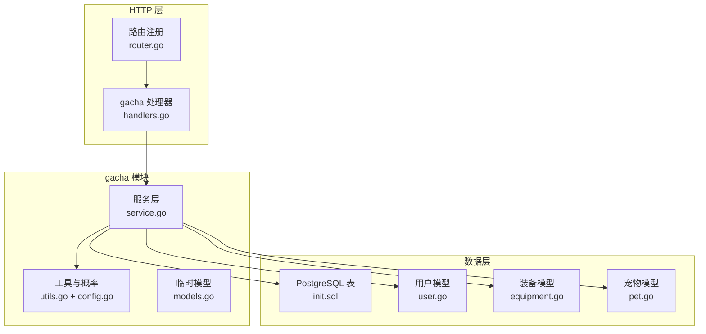
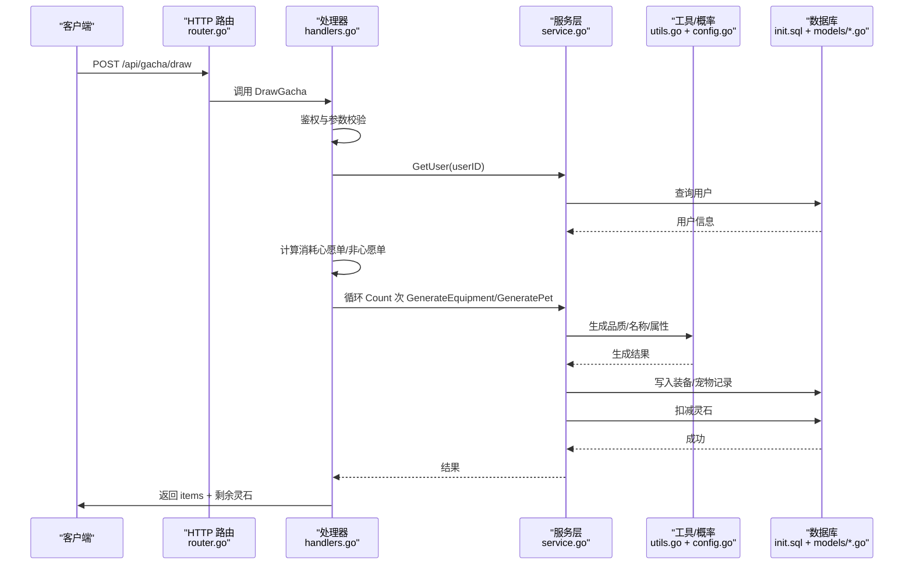
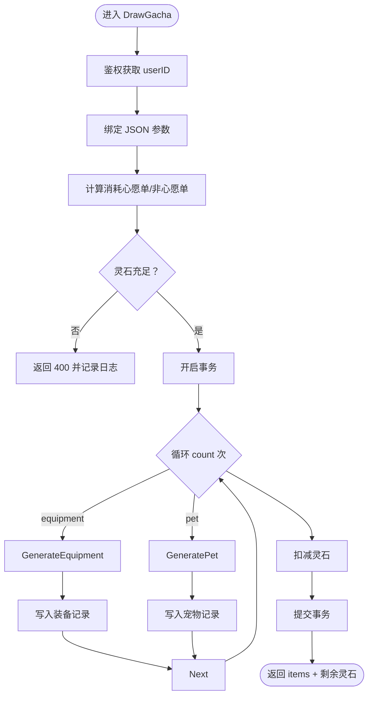
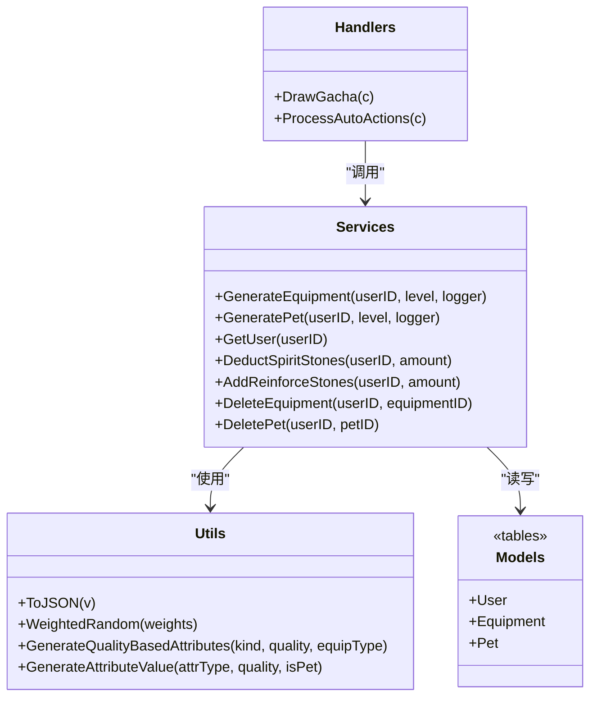
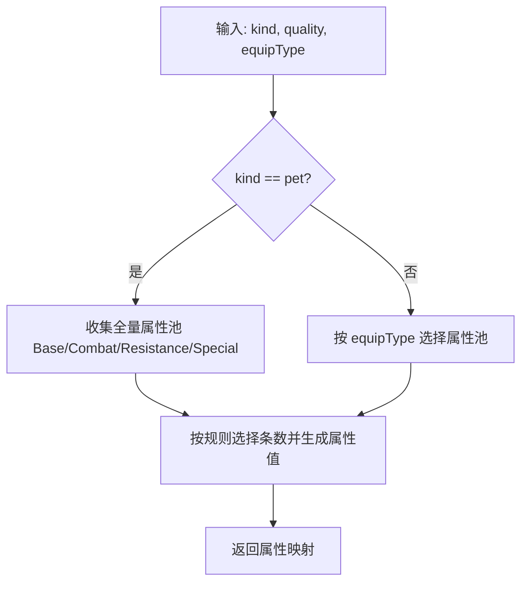
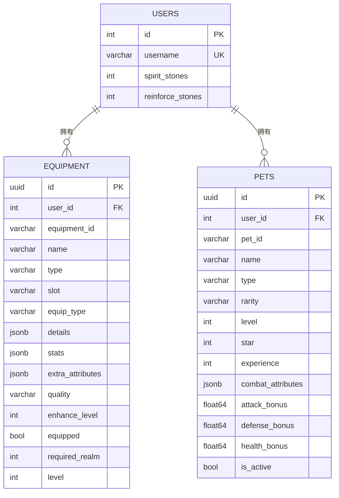
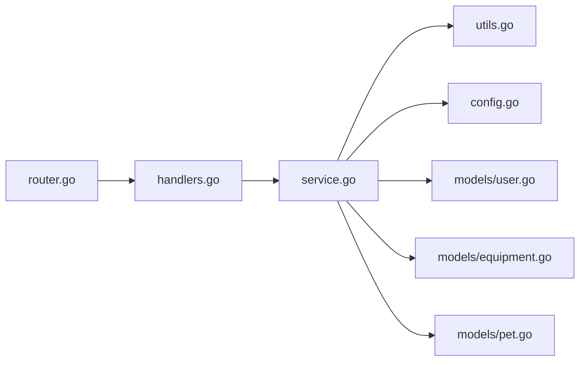

# 抽奖系统后端架构

<cite>
**本文引用的文件**
- [server-go/internal/gacha/handlers.go](file://server-go/internal/gacha/handlers.go)
- [server-go/internal/gacha/service.go](file://server-go/internal/gacha/service.go)
- [server-go/internal/gacha/models.go](file://server-go/internal/gacha/models.go)
- [server-go/internal/gacha/utils.go](file://server-go/internal/gacha/utils.go)
- [server-go/internal/gacha/config.go](file://server-go/internal/gacha/config.go)
- [server-go/internal/http/router/router.go](file://server-go/internal/http/router/router.go)
- [server-go/internal/models/user.go](file://server-go/internal/models/user.go)
- [server-go/internal/models/equipment.go](file://server-go/internal/models/equipment.go)
- [server-go/internal/models/pet.go](file://server-go/internal/models/pet.go)
- [server-go/init.sql](file://server-go/init.sql)
- [server-go/.env](file://server-go/.env)
</cite>

## 目录
1. [简介](#简介)
2. [项目结构](#项目结构)
3. [核心组件](#核心组件)
4. [架构总览](#架构总览)
5. [详细组件分析](#详细组件分析)
6. [依赖关系分析](#依赖关系分析)
7. [性能考量](#性能考量)
8. [故障排查指南](#故障排查指南)
9. [结论](#结论)
10. [附录](#附录)

## 简介
本文件面向“抽奖系统后端架构”的专业文档目标，聚焦于灵宠抽取与装备获取两大随机抽取功能。通过对 gacha 模块的处理器、服务层、模型与工具函数进行逐层剖析，阐明以下关键点：
- 抽卡请求在 HTTP 层如何被接收与校验，随后调用服务层执行抽取逻辑
- 服务层如何操作数据库模型（用户背包、抽取记录），并确保事务一致性
- 概率算法、保底机制、奖池配置等核心逻辑的实现细节
- 辅助函数在权重选择、属性生成、JSON 序列化等方面的作用
- 如何保证抽取结果的公平性与可追溯性
- 压力测试与性能调优建议

## 项目结构
后端采用分层架构：HTTP 路由层负责请求接入与鉴权，gacha 模块的 handlers 负责业务入口，service 负责抽取与持久化，utils/config 提供概率与属性生成规则，models 定义数据库实体。

图表来源
- [server-go/internal/http/router/router.go](file://server-go/internal/http/router/router.go#L78-L84)
- [server-go/internal/gacha/handlers.go](file://server-go/internal/gacha/handlers.go#L26-L173)
- [server-go/internal/gacha/service.go](file://server-go/internal/gacha/service.go#L13-L139)
- [server-go/internal/gacha/utils.go](file://server-go/internal/gacha/utils.go#L13-L363)
- [server-go/internal/gacha/config.go](file://server-go/internal/gacha/config.go#L1-L198)
- [server-go/internal/models/user.go](file://server-go/internal/models/user.go#L12-L47)
- [server-go/internal/models/equipment.go](file://server-go/internal/models/equipment.go#L7-L34)
- [server-go/internal/models/pet.go](file://server-go/internal/models/pet.go#L7-L35)
- [server-go/init.sql](file://server-go/init.sql#L10-L166)

章节来源
- [server-go/internal/http/router/router.go](file://server-go/internal/http/router/router.go#L78-L84)
- [server-go/internal/gacha/handlers.go](file://server-go/internal/gacha/handlers.go#L26-L173)
- [server-go/internal/gacha/service.go](file://server-go/internal/gacha/service.go#L13-L139)
- [server-go/internal/gacha/utils.go](file://server-go/internal/gacha/utils.go#L13-L363)
- [server-go/internal/gacha/config.go](file://server-go/internal/gacha/config.go#L1-L198)
- [server-go/internal/models/user.go](file://server-go/internal/models/user.go#L12-L47)
- [server-go/internal/models/equipment.go](file://server-go/internal/models/equipment.go#L7-L34)
- [server-go/internal/models/pet.go](file://server-go/internal/models/pet.go#L7-L35)
- [server-go/init.sql](file://server-go/init.sql#L10-L166)

## 核心组件
- HTTP 处理器（handlers.go）
  - 负责鉴权、参数校验、计费、事务控制与响应封装
  - 支持单次与批量抽卡，支持心愿单模式
- 服务层（service.go）
  - 负责生成装备/灵宠、扣减灵石、增加强化石、删除物品等数据库操作
  - 通过 GORM 执行原子性更新与插入
- 工具与概率（utils.go + config.go）
  - 提供加权随机、属性选择与生成、JSON 序列化等通用能力
  - 定义装备品质与灵宠稀有度的概率分布、属性池与规则
- 临时模型（models.go）
  - 在抽卡流程中作为中间态承载生成的装备/灵宠数据
- 数据模型（models/*.go + init.sql）
  - 用户、装备、宠物三张核心表，字段与 JSON 存储结构与前端保持一致
- 路由（router.go）
  - 暴露 /api/gacha/draw 与 /api/gacha/auto-actions 两个端点，均需鉴权

章节来源
- [server-go/internal/gacha/handlers.go](file://server-go/internal/gacha/handlers.go#L26-L173)
- [server-go/internal/gacha/service.go](file://server-go/internal/gacha/service.go#L13-L139)
- [server-go/internal/gacha/utils.go](file://server-go/internal/gacha/utils.go#L13-L363)
- [server-go/internal/gacha/config.go](file://server-go/internal/gacha/config.go#L1-L198)
- [server-go/internal/models/user.go](file://server-go/internal/models/user.go#L12-L47)
- [server-go/internal/models/equipment.go](file://server-go/internal/models/equipment.go#L7-L34)
- [server-go/internal/models/pet.go](file://server-go/internal/models/pet.go#L7-L35)
- [server-go/internal/http/router/router.go](file://server-go/internal/http/router/router.go#L78-L84)

## 架构总览
下图展示一次抽卡请求的端到端流程：HTTP 层接收请求，鉴权与参数校验后进入服务层；服务层根据奖池类型调用生成器，产出装备或灵宠，随后持久化到数据库并扣减灵石；最后返回结果。

图表来源
- [server-go/internal/http/router/router.go](file://server-go/internal/http/router/router.go#L78-L84)
- [server-go/internal/gacha/handlers.go](file://server-go/internal/gacha/handlers.go#L26-L173)
- [server-go/internal/gacha/service.go](file://server-go/internal/gacha/service.go#L13-L139)
- [server-go/internal/gacha/utils.go](file://server-go/internal/gacha/utils.go#L13-L363)
- [server-go/init.sql](file://server-go/init.sql#L10-L166)

## 详细组件分析

### 处理器：DrawGacha（抽卡入口）
- 鉴权与日志
  - 从上下文提取 userID 并记录 Authorization 头，便于调试与审计
- 请求参数与计费
  - 支持 poolType（equipment/pet）、count、useWishlist
  - 心愿单模式与普通模式的消耗不同，按次数累加
- 用户余额校验
  - 读取用户灵石，若不足则拒绝请求
- 事务与循环
  - 使用数据库事务包裹多次抽卡，任一失败即回滚
  - 根据 poolType 分支生成装备或灵宠，记录日志
- 扣费与返回
  - 成功后扣减灵石，提交事务，返回 items 与剩余灵石

图表来源
- [server-go/internal/gacha/handlers.go](file://server-go/internal/gacha/handlers.go#L26-L173)

章节来源
- [server-go/internal/gacha/handlers.go](file://server-go/internal/gacha/handlers.go#L26-L173)

### 服务层：GenerateEquipment / GeneratePet / GetUser / 扣费与增减
- GenerateEquipment
  - 调用生成器生成装备中间态，随后将必要字段映射到数据库模型并持久化
  - 日志记录生成前后关键属性，便于审计
- GeneratePet
  - 生成灵宠中间态，确保宠物 ID 的唯一性（冲突时重试生成）
  - 将中间态映射到数据库模型并持久化
- GetUser / DeductSpiritStones / AddReinforceStones / DeleteEquipment / DeletePet
  - 基于 GORM 的原子更新与删除，保证数据一致性

图表来源
- [server-go/internal/gacha/handlers.go](file://server-go/internal/gacha/handlers.go#L26-L173)
- [server-go/internal/gacha/service.go](file://server-go/internal/gacha/service.go#L13-L139)
- [server-go/internal/gacha/utils.go](file://server-go/internal/gacha/utils.go#L13-L363)
- [server-go/internal/models/user.go](file://server-go/internal/models/user.go#L12-L47)
- [server-go/internal/models/equipment.go](file://server-go/internal/models/equipment.go#L7-L34)
- [server-go/internal/models/pet.go](file://server-go/internal/models/pet.go#L7-L35)

章节来源
- [server-go/internal/gacha/service.go](file://server-go/internal/gacha/service.go#L13-L139)

### 工具与概率：权重随机、属性生成、JSON 序列化
- WeightedRandom
  - 实现离散加权采样，确保品质/稀有度符合配置概率
- GenerateQualityBasedAttributes / GenerateAttributeValue
  - 根据品质与属性类别生成数值范围内的属性值，区分基础、战斗、抗性、特殊四类
  - 对装备按类型筛选属性池，对灵宠使用全量属性池
- ToJSON
  - 将任意结构序列化为数据库可用的 JSONB 字段
- 配置常量
  - EquipmentQualityProbabilities / PetRarityProbabilities：固定概率，不受玩家等级影响
  - AttributesByType / EquipTypeAttributeMapping：属性池与装备类型映射
  - QualityAttributeRules：不同品质的属性条数规则
  - PetNamesByRarity / PetDescriptionsByRarity：稀有度对应的名称与描述
  - EquipmentTypes：装备类型与前缀词典

图表来源
- [server-go/internal/gacha/utils.go](file://server-go/internal/gacha/utils.go#L282-L363)
- [server-go/internal/gacha/config.go](file://server-go/internal/gacha/config.go#L1-L198)

章节来源
- [server-go/internal/gacha/utils.go](file://server-go/internal/gacha/utils.go#L13-L363)
- [server-go/internal/gacha/config.go](file://server-go/internal/gacha/config.go#L1-L198)

### 数据模型与持久化
- 用户（users）
  - 字段包含 spirit_stones、reinforce_stones 等资源字段，用于抽卡与自动处理
- 装备（equipment）
  - 以 JSONB 存放 details、stats、extra_attributes，便于灵活扩展
- 宠物（pets）
  - 以 JSONB 存放 combat_attributes，bonus 字段记录基础加成
- 初始化脚本
  - 创建 users、equipment、pets 等表及索引，确保查询性能

图表来源
- [server-go/init.sql](file://server-go/init.sql#L10-L166)
- [server-go/internal/models/user.go](file://server-go/internal/models/user.go#L12-L47)
- [server-go/internal/models/equipment.go](file://server-go/internal/models/equipment.go#L7-L34)
- [server-go/internal/models/pet.go](file://server-go/internal/models/pet.go#L7-L35)

章节来源
- [server-go/internal/models/user.go](file://server-go/internal/models/user.go#L12-L47)
- [server-go/internal/models/equipment.go](file://server-go/internal/models/equipment.go#L7-L34)
- [server-go/internal/models/pet.go](file://server-go/internal/models/pet.go#L7-L35)
- [server-go/init.sql](file://server-go/init.sql#L10-L166)

### 自动处理：ProcessAutoActions（出售/释放）
- 功能概述
  - 根据传入物品列表，按品质或稀有度自动出售装备或释放灵宠
  - 将回收的强化石奖励给用户
- 参数与策略
  - items：待处理的物品数组
  - autoSellQualities / autoReleaseRarities：触发条件
  - qualityStoneValues：不同品质/稀有度对应的强化石收益
- 数据一致性
  - 通过单次事务执行删除与奖励，失败回滚

章节来源
- [server-go/internal/gacha/handlers.go](file://server-go/internal/gacha/handlers.go#L175-L283)
- [server-go/internal/gacha/service.go](file://server-go/internal/gacha/service.go#L117-L139)

## 依赖关系分析
- 控制耦合
  - handlers 依赖 service；service 依赖 utils/config；service 依赖 models 与数据库
- 数据耦合
  - 用户资源（灵石、强化石）与装备/宠物库存强相关
- 外部依赖
  - Gin 路由与中间件、GORM ORM、Zap 日志、UUID 生成、PostgreSQL

图表来源
- [server-go/internal/gacha/handlers.go](file://server-go/internal/gacha/handlers.go#L26-L173)
- [server-go/internal/gacha/service.go](file://server-go/internal/gacha/service.go#L13-L139)
- [server-go/internal/gacha/utils.go](file://server-go/internal/gacha/utils.go#L13-L363)
- [server-go/internal/gacha/config.go](file://server-go/internal/gacha/config.go#L1-L198)
- [server-go/internal/http/router/router.go](file://server-go/internal/http/router/router.go#L78-L84)

章节来源
- [server-go/internal/gacha/handlers.go](file://server-go/internal/gacha/handlers.go#L26-L173)
- [server-go/internal/gacha/service.go](file://server-go/internal/gacha/service.go#L13-L139)
- [server-go/internal/gacha/utils.go](file://server-go/internal/gacha/utils.go#L13-L363)
- [server-go/internal/gacha/config.go](file://server-go/internal/gacha/config.go#L1-L198)
- [server-go/internal/http/router/router.go](file://server-go/internal/http/router/router.go#L78-L84)

## 性能考量
- 并发与锁
  - 抽卡循环在单事务内执行，避免并发写入导致的资源竞争
  - 建议在高并发场景下限制单次抽卡数量，降低事务持有时间
- 数据库优化
  - 为 users、equipment、pets 建立索引，提升查询与写入性能
  - 使用 JSONB 字段存储动态属性，减少表结构变更成本
- 日志与可观测性
  - 处理器与服务层均输出关键事件日志，便于定位性能瓶颈
- 缓存与限流
  - 可在网关层对 /api/gacha/* 接口实施限流，防止突发流量冲击数据库
- 压测建议
  - 使用压测工具模拟多用户同时抽卡，观察数据库锁等待、事务提交延迟与 QPS
  - 关注灵石扣减与库存写入的 RT，逐步扩大并发规模直至稳定

[本节为通用性能指导，不直接分析具体文件]

## 故障排查指南
- 常见错误与定位
  - 401 未授权：确认鉴权中间件生效与 Authorization 头正确
  - 400 请求参数错误：检查 poolType、count、useWishlist 是否合法
  - 400 灵石不足：核对用户 spirit_stones 与消耗计算
  - 500 服务器错误：关注事务回滚与数据库异常日志
- 审计与追踪
  - 处理器与服务层均记录关键事件（用户ID、请求参数、生成结果、剩余灵石），便于问题复盘
- 数据一致性
  - 若出现库存与资源不匹配，检查事务是否正常提交，是否存在 panic 导致回滚

章节来源
- [server-go/internal/gacha/handlers.go](file://server-go/internal/gacha/handlers.go#L26-L173)
- [server-go/internal/gacha/service.go](file://server-go/internal/gacha/service.go#L117-L139)

## 结论
该抽奖系统通过清晰的分层设计实现了稳定的随机抽取能力：HTTP 层负责接入与鉴权，服务层统一管理抽取与持久化，工具与配置模块提供概率与属性生成的可维护性。系统通过事务保障数据一致性，日志与索引提升可观测性与性能。当前实现采用固定概率，未引入保底机制；若未来需要保底，可在服务层引入计数器并在达到阈值时强制提升稀有度或品质，同时在日志中明确标注保底触发事件，确保公平性与可追溯性。

[本节为总结性内容，不直接分析具体文件]

## 附录
- 端点定义
  - POST /api/gacha/draw：抽卡请求，参数包括 poolType、count、useWishlist
  - POST /api/gacha/auto-actions：自动处理请求，参数包括 items、autoSellQualities、autoReleaseRarities
- 环境变量
  - DB_HOST、DB_PORT、DB_NAME、DB_USER、DB_PASSWORD、JWT_SECRET、REDIS_URL 等

章节来源
- [server-go/internal/http/router/router.go](file://server-go/internal/http/router/router.go#L78-L84)
- [server-go/.env](file://server-go/.env#L1-L9)