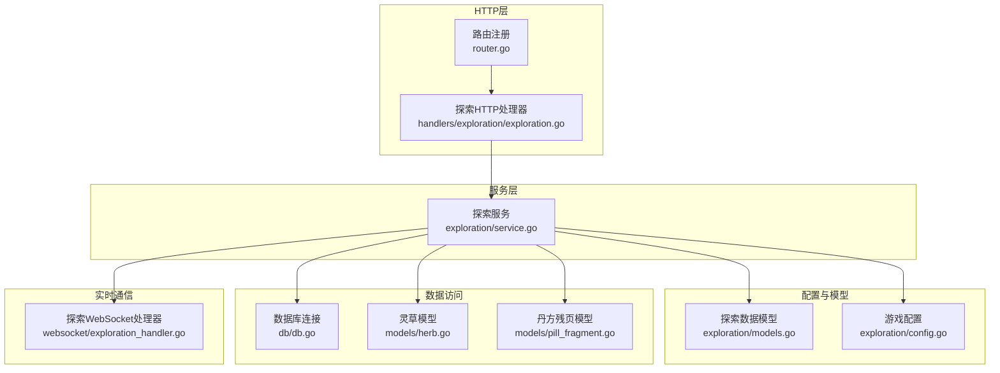
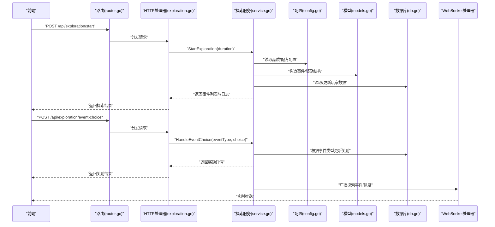
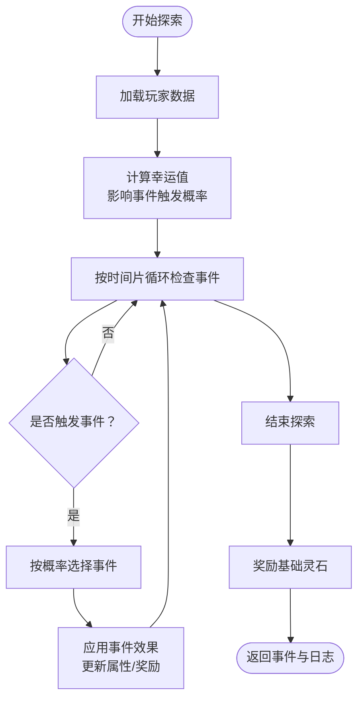
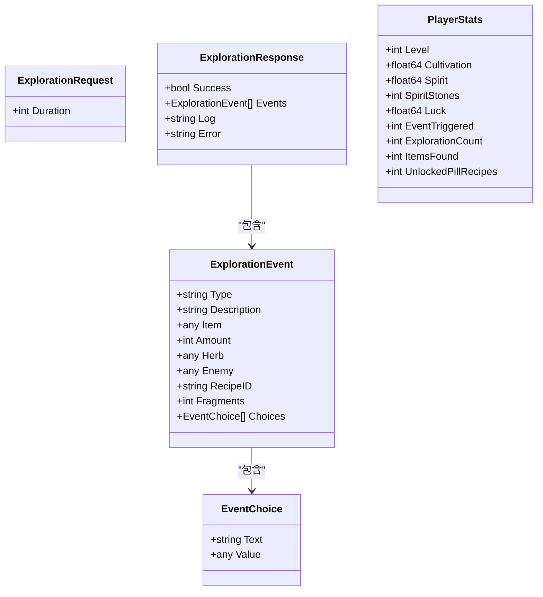
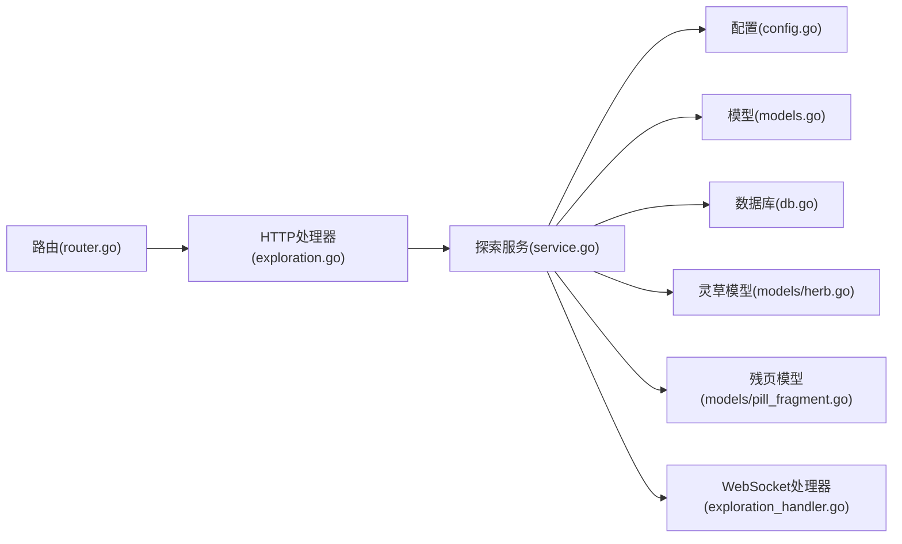

# 探索系统后端架构

<cite>
**本文引用的文件**
- [server-go/internal/http/handlers/exploration/exploration.go](file://server-go/internal/http/handlers/exploration/exploration.go)
- [server-go/internal/exploration/service.go](file://server-go/internal/exploration/service.go)
- [server-go/internal/exploration/models.go](file://server-go/internal/exploration/models.go)
- [server-go/internal/exploration/config.go](file://server-go/internal/exploration/config.go)
- [server-go/internal/http/router/router.go](file://server-go/internal/http/router/router.go)
- [server-go/internal/db/db.go](file://server-go/internal/db/db.go)
- [server-go/internal/models/herb.go](file://server-go/internal/models/herb.go)
- [server-go/internal/models/pill_fragment.go](file://server-go/internal/models/pill_fragment.go)
- [server-go/internal/websocket/exploration_handler.go](file://server-go/internal/websocket/exploration_handler.go)
- [开发文档/后端探索系统实现指南.md](file://开发文档/后端探索系统实现指南.md)
- [开发文档/探索功能迁移清单.md](file://开发文档/探索功能迁移清单.md)
- [开发文档/探索功能快速启动.md](file://开发文档/探索功能快速启动.md)
</cite>

## 目录
1. [引言](#引言)
2. [项目结构](#项目结构)
3. [核心组件](#核心组件)
4. [架构总览](#架构总览)
5. [详细组件分析](#详细组件分析)
6. [依赖关系分析](#依赖关系分析)
7. [性能考量](#性能考量)
8. [故障排查指南](#故障排查指南)
9. [结论](#结论)
10. [附录](#附录)

## 引言
本文件面向探索系统后端架构，聚焦以下目标：
- 解释探索指令如何通过HTTP处理器进入系统，调用探索服务，并与探索状态模型交互。
- 描述探索路径生成算法、资源刷新机制及特殊事件的概率控制逻辑。
- 分析配置文件如何驱动探索行为的参数化与可调性。
- 提供监控与调试建议，帮助定位问题并优化体验。

## 项目结构
探索系统位于后端子模块 internal/exploration，配合HTTP处理器、路由注册、数据库连接与模型定义共同构成完整闭环。前端通过REST API与后端交互，WebSocket用于实时广播探索事件。

图表来源
- [server-go/internal/http/router/router.go](file://server-go/internal/http/router/router.go#L86-L93)
- [server-go/internal/http/handlers/exploration/exploration.go](file://server-go/internal/http/handlers/exploration/exploration.go#L19-L109)
- [server-go/internal/exploration/service.go](file://server-go/internal/exploration/service.go#L1-L120)
- [server-go/internal/exploration/models.go](file://server-go/internal/exploration/models.go#L1-L128)
- [server-go/internal/exploration/config.go](file://server-go/internal/exploration/config.go#L1-L265)
- [server-go/internal/db/db.go](file://server-go/internal/db/db.go#L1-L45)
- [server-go/internal/models/herb.go](file://server-go/internal/models/herb.go#L1-L17)
- [server-go/internal/models/pill_fragment.go](file://server-go/internal/models/pill_fragment.go#L1-L13)
- [server-go/internal/websocket/exploration_handler.go](file://server-go/internal/websocket/exploration_handler.go#L1-L149)

章节来源
- [server-go/internal/http/router/router.go](file://server-go/internal/http/router/router.go#L86-L93)
- [开发文档/后端探索系统实现指南.md](file://开发文档/后端探索系统实现指南.md#L1-L136)

## 核心组件
- HTTP处理器：接收探索请求与事件选择请求，校验参数，调用探索服务并返回标准化响应。
- 探索服务：封装探索主流程、事件触发、奖励发放与属性更新逻辑。
- 数据模型与配置：定义事件、奖励、品质与配方等数据结构与概率权重。
- 数据访问：统一通过GORM访问PostgreSQL，持久化玩家与物品数据。
- WebSocket处理器：向用户实时推送探索进度与发现事件，增强交互体验。

章节来源
- [server-go/internal/http/handlers/exploration/exploration.go](file://server-go/internal/http/handlers/exploration/exploration.go#L19-L109)
- [server-go/internal/exploration/service.go](file://server-go/internal/exploration/service.go#L1-L120)
- [server-go/internal/exploration/models.go](file://server-go/internal/exploration/models.go#L1-L128)
- [server-go/internal/exploration/config.go](file://server-go/internal/exploration/config.go#L1-L265)
- [server-go/internal/db/db.go](file://server-go/internal/db/db.go#L1-L45)
- [server-go/internal/websocket/exploration_handler.go](file://server-go/internal/websocket/exploration_handler.go#L1-L149)

## 架构总览
下图展示了从HTTP入口到服务层、配置与模型、数据库以及WebSocket广播的整体调用链路。

图表来源
- [server-go/internal/http/router/router.go](file://server-go/internal/http/router/router.go#L86-L93)
- [server-go/internal/http/handlers/exploration/exploration.go](file://server-go/internal/http/handlers/exploration/exploration.go#L19-L109)
- [server-go/internal/exploration/service.go](file://server-go/internal/exploration/service.go#L27-L120)
- [server-go/internal/exploration/config.go](file://server-go/internal/exploration/config.go#L1-L265)
- [server-go/internal/exploration/models.go](file://server-go/internal/exploration/models.go#L1-L128)
- [server-go/internal/db/db.go](file://server-go/internal/db/db.go#L1-L45)
- [server-go/internal/websocket/exploration_handler.go](file://server-go/internal/websocket/exploration_handler.go#L38-L149)

## 详细组件分析

### HTTP处理器：接收探索指令与事件选择
- StartExploration
  - 从上下文中提取用户ID，绑定请求体，设置默认探索时长。
  - 记录入参与出参日志，调用探索服务执行探索。
  - 返回标准化响应，包含事件列表与探索日志。
- HandleEventChoice
  - 绑定事件选择请求，调用探索服务处理选择。
  - 返回奖励详情，供前端展示。

章节来源
- [server-go/internal/http/handlers/exploration/exploration.go](file://server-go/internal/http/handlers/exploration/exploration.go#L19-L109)

### 探索服务：探索主流程与事件触发
- StartExploration
  - 读取玩家数据，基于幸运值计算事件触发概率。
  - 按时间片模拟事件检查，累积事件与日志。
  - 奖励基础灵石，返回事件与日志。
- triggerRandomEvent
  - 定义8类随机事件及其触发概率，按概率选择事件并调用对应处理函数。
- 事件处理函数
  - 古老石碑：增加修为。
  - 灵泉：增加灵力。
  - 古修遗府：同时增加修为与灵力。
  - 妖兽袭击：扣除灵力。
  - 走火入魔：扣除修为。
  - 秘境宝藏：增加灵石。
  - 顿悟：增加修为并提升灵力获取速率。
  - 心魔侵扰：同时扣除灵力与修为。
  - 灵草发现：随机选择灵草种类与品质，创建或更新灵草记录。
  - 丹方残页：随机选择配方，创建或更新残页计数。
- 事件选择处理
  - 根据事件类型分别处理：物品、灵石、灵草、残页、战斗等。
  - 战斗事件：简单胜负判定，胜利奖励灵石，失败提示失败。

图表来源
- [server-go/internal/exploration/service.go](file://server-go/internal/exploration/service.go#L27-L120)
- [server-go/internal/exploration/service.go](file://server-go/internal/exploration/service.go#L105-L186)
- [server-go/internal/exploration/service.go](file://server-go/internal/exploration/service.go#L188-L467)

章节来源
- [server-go/internal/exploration/service.go](file://server-go/internal/exploration/service.go#L27-L120)
- [server-go/internal/exploration/service.go](file://server-go/internal/exploration/service.go#L105-L186)
- [server-go/internal/exploration/service.go](file://server-go/internal/exploration/service.go#L188-L467)

### 数据模型与配置：事件、奖励与概率
- 事件类型与结构
  - 事件类型常量：物品、灵石、灵草、残页、战斗。
  - ExplorationEvent：包含类型、描述、奖励数量、发现内容、可选分支等。
  - EventChoice：事件分支选项。
  - ExplorationResult/Request/Response：探索请求与响应结构。
- 灵草与配方配置
  - HerbConfigs：列出多种灵草的基础价值、类别与掉落权重。
  - PillRecipes：列出多种丹药配方与所需残页数量。
  - GetRandomQuality/GetHerbValue：按权重随机品质并计算价值。
- 玩家统计与属性
  - PlayerStats：包含等级、修为、灵力、灵石、幸运值、事件触发次数等。
  - BaseAttributes JSON：存储玩家属性（如幸运值、灵力获取速率）。

图表来源
- [server-go/internal/exploration/models.go](file://server-go/internal/exploration/models.go#L1-L128)

章节来源
- [server-go/internal/exploration/models.go](file://server-go/internal/exploration/models.go#L1-L128)
- [server-go/internal/exploration/config.go](file://server-go/internal/exploration/config.go#L1-L265)

### 数据访问与模型映射
- 数据库连接
  - 通过GORM连接PostgreSQL，支持环境变量配置。
- 灵草与残页模型
  - Herb：用户拥有的灵草记录，含数量。
  - PillFragment：用户收集的丹方残页记录，按配方聚合计数。
- 服务层对模型的使用
  - 在事件中创建/更新灵草与残页记录，确保唯一性与计数一致性。

章节来源
- [server-go/internal/db/db.go](file://server-go/internal/db/db.go#L1-L45)
- [server-go/internal/models/herb.go](file://server-go/internal/models/herb.go#L1-L17)
- [server-go/internal/models/pill_fragment.go](file://server-go/internal/models/pill_fragment.go#L1-L13)
- [server-go/internal/exploration/service.go](file://server-go/internal/exploration/service.go#L323-L390)

### WebSocket处理器：实时广播探索事件
- 探索事件类型
  - start、progress、discovery、complete、failure。
- 方法职责
  - NotifyExplorationStart/Progress/Complete/Failure：推送不同阶段事件。
  - NotifyDiscovery/NotifyMultipleDiscoveries：推送发现内容，避免事件过于密集。
- 错误处理
  - 记录广播失败日志，便于定位网络或连接问题。

章节来源
- [server-go/internal/websocket/exploration_handler.go](file://server-go/internal/websocket/exploration_handler.go#L1-L149)

## 依赖关系分析
- 路由注册
  - /api/exploration 路由组包含开始探索与事件选择两个端点，均需认证中间件保护。
- 处理器依赖
  - HTTP处理器依赖探索服务；服务层依赖配置、模型与数据库。
- 数据模型依赖
  - 灵草与残页模型作为服务层的持久化对象，被事件处理函数直接使用。
- WebSocket依赖
  - 探索服务在关键节点调用WebSocket处理器进行广播。

图表来源
- [server-go/internal/http/router/router.go](file://server-go/internal/http/router/router.go#L86-L93)
- [server-go/internal/http/handlers/exploration/exploration.go](file://server-go/internal/http/handlers/exploration/exploration.go#L19-L109)
- [server-go/internal/exploration/service.go](file://server-go/internal/exploration/service.go#L1-L120)
- [server-go/internal/exploration/config.go](file://server-go/internal/exploration/config.go#L1-L265)
- [server-go/internal/exploration/models.go](file://server-go/internal/exploration/models.go#L1-L128)
- [server-go/internal/db/db.go](file://server-go/internal/db/db.go#L1-L45)
- [server-go/internal/models/herb.go](file://server-go/internal/models/herb.go#L1-L17)
- [server-go/internal/models/pill_fragment.go](file://server-go/internal/models/pill_fragment.go#L1-L13)
- [server-go/internal/websocket/exploration_handler.go](file://server-go/internal/websocket/exploration_handler.go#L1-L149)

## 性能考量
- 事件触发概率与时间片
  - 服务层按每秒一次的频率检查事件，时长越长，检查次数越多。可通过减少检查粒度或采用更高效的概率判定降低CPU占用。
- 数据库写入
  - 每次事件可能产生多次更新（如灵草、残页计数）。建议在批量事件结束后合并更新，或使用事务以减少锁竞争。
- WebSocket广播
  - 多发现事件时采用延迟避免过载。可根据前端消费能力动态调整延迟或批量推送。
- 配置读取
  - 配置为全局变量，读取成本低；若未来扩展为动态配置，建议引入缓存与热更新策略。

[本节为通用指导，不直接分析具体文件]

## 故障排查指南
- HTTP处理器常见问题
  - 未授权：确认认证中间件是否生效，请求头是否携带有效Token。
  - 参数错误：检查请求体字段与类型，确保duration为毫秒级数值。
- 探索服务常见问题
  - 幸运值缺失：BaseAttributes中缺少luck键时，默认幸运值为1，事件触发概率按基础值计算。
  - 事件未触发：检查概率权重与随机种子，确认服务层循环次数与概率阈值。
  - 奖励未入库：核对灵草与残页的唯一性逻辑，确保首次创建与后续更新分支均能写入数据库。
- 数据库连接问题
  - 环境变量未配置或连接串错误会导致初始化失败。请检查DB_HOST、DB_PORT、DB_NAME、DB_USER、DB_PASSWORD。
- WebSocket广播问题
  - 广播失败会记录错误日志，检查连接管理器与用户会话状态。

章节来源
- [server-go/internal/http/handlers/exploration/exploration.go](file://server-go/internal/http/handlers/exploration/exploration.go#L19-L109)
- [server-go/internal/exploration/service.go](file://server-go/internal/exploration/service.go#L469-L515)
- [server-go/internal/db/db.go](file://server-go/internal/db/db.go#L1-L45)
- [server-go/internal/websocket/exploration_handler.go](file://server-go/internal/websocket/exploration_handler.go#L38-L149)
- [开发文档/探索功能快速启动.md](file://开发文档/探索功能快速启动.md#L55-L120)
- [开发文档/探索功能迁移清单.md](file://开发文档/探索功能迁移清单.md#L74-L151)

## 结论
探索系统后端通过清晰的分层设计实现了“请求接入—业务处理—数据持久化—实时反馈”的完整闭环。服务层以配置驱动事件与奖励，结合概率控制与属性更新，为玩家提供丰富的探索体验。建议在高并发场景下优化事件检查频率与数据库写入策略，并完善监控指标以便持续改进。

[本节为总结性内容，不直接分析具体文件]

## 附录
- API与测试参考
  - 开始探索：POST /api/exploration/start
  - 事件选择：POST /api/exploration/event-choice
  - 参考测试脚本与期望响应，见“探索功能快速启动”与“探索功能迁移清单”。

章节来源
- [开发文档/后端探索系统实现指南.md](file://开发文档/后端探索系统实现指南.md#L69-L136)
- [开发文档/探索功能快速启动.md](file://开发文档/探索功能快速启动.md#L55-L120)
- [开发文档/探索功能迁移清单.md](file://开发文档/探索功能迁移清单.md#L74-L151)