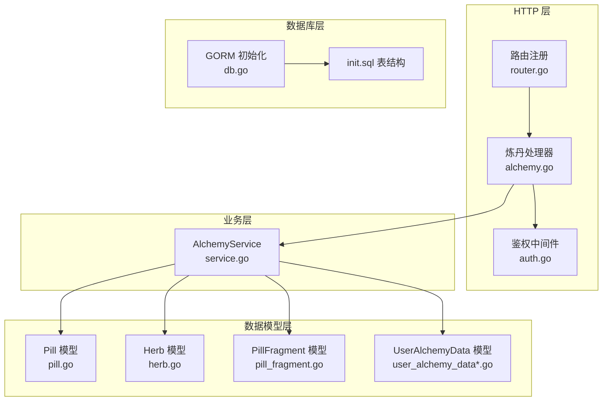
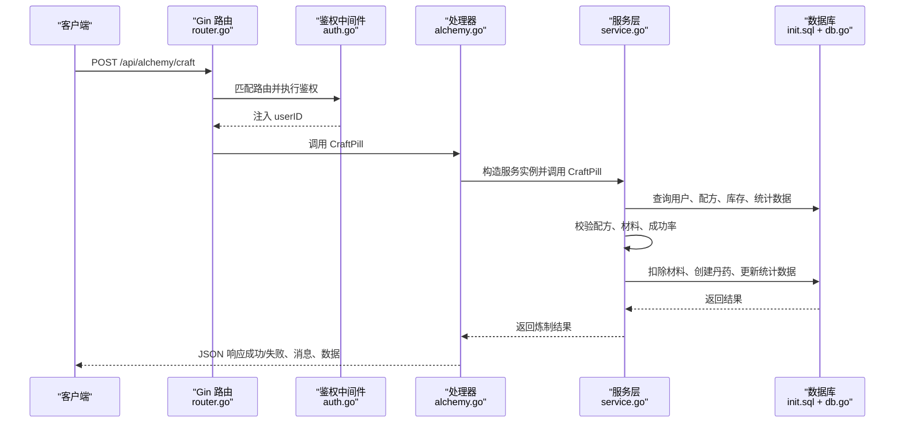
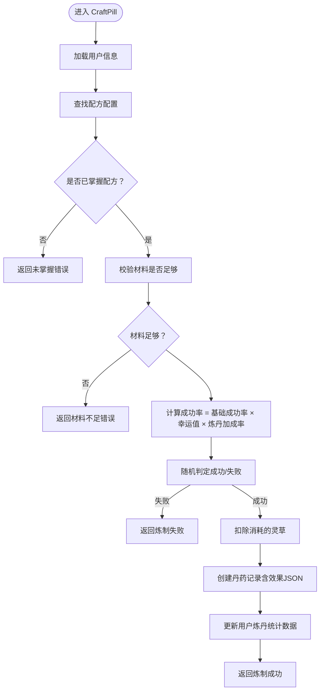
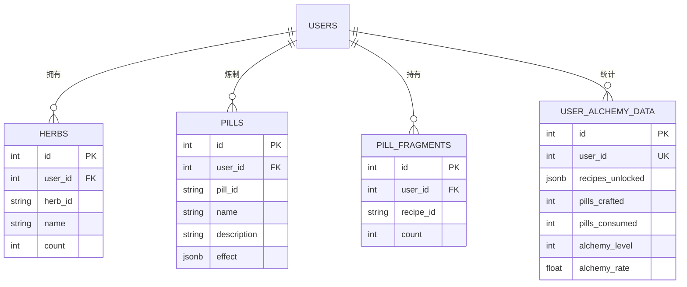
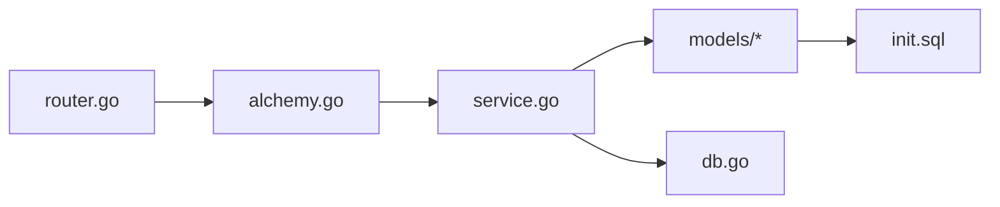

# 炼丹系统后端架构

<cite>
**本文引用的文件**
- [server-go/internal/http/handlers/alchemy/alchemy.go](file://server-go/internal/http/handlers/alchemy/alchemy.go)
- [server-go/internal/alchemy/service.go](file://server-go/internal/alchemy/service.go)
- [server-go/internal/alchemy/models.go](file://server-go/internal/alchemy/models.go)
- [server-go/internal/models/pill.go](file://server-go/internal/models/pill.go)
- [server-go/internal/models/herb.go](file://server-go/internal/models/herb.go)
- [server-go/internal/models/pill_fragment.go](file://server-go/internal/models/pill_fragment.go)
- [server-go/internal/models/user_alchemy_data.go](file://server-go/internal/models/user_alchemy_data.go)
- [server-go/internal/models/user_alchemy_data_db.go](file://server-go/internal/models/user_alchemy_data_db.go)
- [server-go/internal/http/router/router.go](file://server-go/internal/http/router/router.go)
- [server-go/internal/http/middleware/auth.go](file://server-go/internal/http/middleware/auth.go)
- [server-go/internal/db/db.go](file://server-go/internal/db/db.go)
- [server-go/cmd/server/main.go](file://server-go/cmd/server/main.go)
- [server-go/init.sql](file://server-go/init.sql)
</cite>

## 目录
1. [简介](#简介)
2. [项目结构](#项目结构)
3. [核心组件](#核心组件)
4. [架构总览](#架构总览)
5. [详细组件分析](#详细组件分析)
6. [依赖关系分析](#依赖关系分析)
7. [性能考量](#性能考量)
8. [故障排查指南](#故障排查指南)
9. [结论](#结论)

## 简介
本文件面向炼丹系统后端架构的深度文档，围绕“从API请求到丹药生成”的完整流程展开，重点说明以下内容：
- alchemy.go 中的 CraftPill 处理器如何接收炼丹请求，调用 service.go 的炼丹业务逻辑，并与 models.go 中定义的灵草、丹药等模型交互。
- 配方验证、材料消耗、成功率计算等关键逻辑的实现方式。
- 服务层如何协调多个数据模型操作，确保数据一致性。
- 异常处理与日志记录的最佳实践。

## 项目结构
炼丹系统位于 server-go 内部，采用分层清晰的组织方式：
- HTTP 层：路由注册与请求处理，负责鉴权、参数绑定、日志记录与响应封装。
- 业务层：AlchemyService 提供炼丹核心逻辑，包括配方校验、材料消耗、成功率计算、残页购买与解锁判定等。
- 数据模型层：定义炼丹相关的实体模型（Pill、Herb、PillFragment、UserAlchemyData），并与数据库表结构一一对应。
- 数据库层：GORM 初始化与连接配置，配合 init.sql 定义表结构与索引。

图表来源
- [server-go/internal/http/router/router.go](file://server-go/internal/http/router/router.go#L115-L125)
- [server-go/internal/http/handlers/alchemy/alchemy.go](file://server-go/internal/http/handlers/alchemy/alchemy.go#L140-L217)
- [server-go/internal/http/middleware/auth.go](file://server-go/internal/http/middleware/auth.go#L18-L76)
- [server-go/internal/alchemy/service.go](file://server-go/internal/alchemy/service.go#L349-L454)
- [server-go/internal/models/pill.go](file://server-go/internal/models/pill.go#L1-L21)
- [server-go/internal/models/herb.go](file://server-go/internal/models/herb.go#L1-L17)
- [server-go/internal/models/pill_fragment.go](file://server-go/internal/models/pill_fragment.go#L1-L13)
- [server-go/internal/models/user_alchemy_data_db.go](file://server-go/internal/models/user_alchemy_data_db.go#L1-L21)
- [server-go/internal/db/db.go](file://server-go/internal/db/db.go#L1-L45)
- [server-go/init.sql](file://server-go/init.sql#L47-L83)

章节来源
- [server-go/internal/http/router/router.go](file://server-go/internal/http/router/router.go#L115-L125)
- [server-go/internal/http/handlers/alchemy/alchemy.go](file://server-go/internal/http/handlers/alchemy/alchemy.go#L140-L217)
- [server-go/internal/alchemy/service.go](file://server-go/internal/alchemy/service.go#L349-L454)
- [server-go/internal/db/db.go](file://server-go/internal/db/db.go#L1-L45)
- [server-go/init.sql](file://server-go/init.sql#L47-L83)

## 核心组件
- HTTP 处理器（AlchemyHandler）：负责接收请求、参数校验、调用服务层、组装响应与日志记录。
- AlchemyService：封装炼丹业务逻辑，包括配方校验、材料消耗、成功率计算、残页购买与解锁判定、用户炼丹数据读取与更新。
- 数据模型（Pill、Herb、PillFragment、UserAlchemyData）：映射数据库表，承载炼丹过程中的数据结构与持久化。
- 鉴权中间件：统一拦截 /api/alchemy 下的请求，校验 JWT 并注入 userID。
- 路由注册：将 /api/alchemy 下的各端点挂载到 Gin 路由树。

章节来源
- [server-go/internal/http/handlers/alchemy/alchemy.go](file://server-go/internal/http/handlers/alchemy/alchemy.go#L140-L217)
- [server-go/internal/alchemy/service.go](file://server-go/internal/alchemy/service.go#L349-L454)
- [server-go/internal/alchemy/models.go](file://server-go/internal/alchemy/models.go#L1-L198)
- [server-go/internal/models/pill.go](file://server-go/internal/models/pill.go#L1-L21)
- [server-go/internal/models/herb.go](file://server-go/internal/models/herb.go#L1-L17)
- [server-go/internal/models/pill_fragment.go](file://server-go/internal/models/pill_fragment.go#L1-L13)
- [server-go/internal/models/user_alchemy_data.go](file://server-go/internal/models/user_alchemy_data.go#L1-L17)
- [server-go/internal/models/user_alchemy_data_db.go](file://server-go/internal/models/user_alchemy_data_db.go#L1-L21)
- [server-go/internal/http/middleware/auth.go](file://server-go/internal/http/middleware/auth.go#L18-L76)
- [server-go/internal/http/router/router.go](file://server-go/internal/http/router/router.go#L115-L125)

## 架构总览
炼丹系统遵循“HTTP -> 业务 -> 数据模型 -> 数据库”的分层架构。请求从 Gin 路由进入，经鉴权中间件注入 userID，再由处理器调用 AlchemyService 执行业务逻辑，最终通过 GORM 持久化到 PostgreSQL。

图表来源
- [server-go/internal/http/router/router.go](file://server-go/internal/http/router/router.go#L115-L125)
- [server-go/internal/http/middleware/auth.go](file://server-go/internal/http/middleware/auth.go#L18-L76)
- [server-go/internal/http/handlers/alchemy/alchemy.go](file://server-go/internal/http/handlers/alchemy/alchemy.go#L140-L217)
- [server-go/internal/alchemy/service.go](file://server-go/internal/alchemy/service.go#L349-L454)
- [server-go/init.sql](file://server-go/init.sql#L47-L83)
- [server-go/internal/db/db.go](file://server-go/internal/db/db.go#L1-L45)

## 详细组件分析

### HTTP 层：Alchemy 处理器
- 鉴权：所有 /api/alchemy 接口均受保护，中间件从 Authorization 头解析 JWT，校验失败直接返回 401。
- 参数绑定：使用 ShouldBindJSON 绑定请求体，参数错误返回 400。
- 日志：使用 zap_logger 上下文记录入参与出参，便于追踪。
- 主要接口：
  - GET /api/alchemy/recipes：列出所有配方，附带用户真实炼丹数据。
  - GET /api/alchemy/recipes/:recipeId：获取单个配方详情。
  - POST /api/alchemy/craft：炼制丹药，调用服务层并返回结果。
  - POST /api/alchemy/buy-fragment：购买残页并尝试解锁配方。
  - GET /api/alchemy/configs：获取品阶、类型、配方、灵草配置。

章节来源
- [server-go/internal/http/handlers/alchemy/alchemy.go](file://server-go/internal/http/handlers/alchemy/alchemy.go#L24-L80)
- [server-go/internal/http/handlers/alchemy/alchemy.go](file://server-go/internal/http/handlers/alchemy/alchemy.go#L82-L138)
- [server-go/internal/http/handlers/alchemy/alchemy.go](file://server-go/internal/http/handlers/alchemy/alchemy.go#L140-L217)
- [server-go/internal/http/handlers/alchemy/alchemy.go](file://server-go/internal/http/handlers/alchemy/alchemy.go#L219-L276)
- [server-go/internal/http/handlers/alchemy/alchemy.go](file://server-go/internal/http/handlers/alchemy/alchemy.go#L278-L305)
- [server-go/internal/http/middleware/auth.go](file://server-go/internal/http/middleware/auth.go#L18-L76)

### 业务层：AlchemyService
- 配置与常量：
  - 品阶配置（难度、基础成功率、所需残页数）。
  - 丹药类型配置（效果倍数）。
  - 灵草配置（ID、名称、价格）。
  - 丹方配置（ID、名称、描述、品阶、类型、材料需求、基础效果、所需残页）。
- 关键方法：
  - GetAllRecipes / GetRecipeDetail：构建配方详情，包含材料、效果、解锁状态、当前残页数等。
  - calculatePillEffect：按品阶、类型与玩家等级计算实际效果值与持续时间。
  - CraftPill：
    - 校验配方是否存在、是否已掌握。
    - 校验材料是否充足。
    - 计算成功率：基础成功率 × 幸运值 × 炼丹加成率。
    - 随机判定成功/失败；成功则扣除材料、创建丹药记录、更新用户炼丹统计数据。
  - BuyFragment：
    - 计算价格（随品阶递增）。
    - 扣除灵石，更新/创建残页记录。
    - 若满足条件则解锁配方并扣减相应残页数。
  - GetUserAlchemyData：聚合用户残页、统计数据与解锁状态。
  - 辅助函数：根据 ID 获取品阶/类型/灵草名称，获取所有配置。

图表来源
- [server-go/internal/alchemy/service.go](file://server-go/internal/alchemy/service.go#L349-L454)

章节来源
- [server-go/internal/alchemy/service.go](file://server-go/internal/alchemy/service.go#L26-L67)
- [server-go/internal/alchemy/service.go](file://server-go/internal/alchemy/service.go#L234-L263)
- [server-go/internal/alchemy/service.go](file://server-go/internal/alchemy/service.go#L265-L288)
- [server-go/internal/alchemy/service.go](file://server-go/internal/alchemy/service.go#L290-L330)
- [server-go/internal/alchemy/service.go](file://server-go/internal/alchemy/service.go#L332-L347)
- [server-go/internal/alchemy/service.go](file://server-go/internal/alchemy/service.go#L349-L454)
- [server-go/internal/alchemy/service.go](file://server-go/internal/alchemy/service.go#L456-L541)
- [server-go/internal/alchemy/service.go](file://server-go/internal/alchemy/service.go#L543-L558)
- [server-go/internal/alchemy/service.go](file://server-go/internal/alchemy/service.go#L614-L669)

### 数据模型层
- Pill：记录炼制成功的丹药，包含用户ID、配方ID、名称、描述与效果（JSON）。
- Herb：记录玩家拥有的灵草，包含用户ID、灵草ID、名称与数量。
- PillFragment：记录玩家拥有的某配方残页数量。
- UserAlchemyData / UserAlchemyDataDB：记录用户炼丹统计数据（总炼制次数、总服用次数、炼丹等级、炼丹加成率、已解锁配方等）。存在两个版本，分别用于不同场景。

图表来源
- [server-go/internal/models/pill.go](file://server-go/internal/models/pill.go#L1-L21)
- [server-go/internal/models/herb.go](file://server-go/internal/models/herb.go#L1-L17)
- [server-go/internal/models/pill_fragment.go](file://server-go/internal/models/pill_fragment.go#L1-L13)
- [server-go/internal/models/user_alchemy_data.go](file://server-go/internal/models/user_alchemy_data.go#L1-L17)
- [server-go/internal/models/user_alchemy_data_db.go](file://server-go/internal/models/user_alchemy_data_db.go#L1-L21)
- [server-go/init.sql](file://server-go/init.sql#L47-L83)

章节来源
- [server-go/internal/models/pill.go](file://server-go/internal/models/pill.go#L1-L21)
- [server-go/internal/models/herb.go](file://server-go/internal/models/herb.go#L1-L17)
- [server-go/internal/models/pill_fragment.go](file://server-go/internal/models/pill_fragment.go#L1-L13)
- [server-go/internal/models/user_alchemy_data.go](file://server-go/internal/models/user_alchemy_data.go#L1-L17)
- [server-go/internal/models/user_alchemy_data_db.go](file://server-go/internal/models/user_alchemy_data_db.go#L1-L21)
- [server-go/init.sql](file://server-go/init.sql#L47-L83)

### 配方验证、材料消耗与成功率计算
- 配方验证：
  - 通过 ID 查找配方配置，若不存在返回错误。
  - 校验用户是否已掌握该配方（基于解锁状态）。
- 材料消耗：
  - 遍历配方材料需求，检查库存是否满足；不满足则返回错误。
  - 成功后按配方材料逐一从数据库扣减对应数量。
- 成功率计算：
  - 基础成功率来自配方品阶配置。
  - 实际成功率 = 基础成功率 × 幸运值 × 炼丹加成率。
  - 使用伪随机判定成功/失败。
- 丹药效果：
  - 基于配方基础效果、类型倍数与玩家等级计算最终效果值与持续时间。
  - 将效果序列化为 JSON 存入 Pill 记录。

章节来源
- [server-go/internal/alchemy/service.go](file://server-go/internal/alchemy/service.go#L349-L454)
- [server-go/internal/alchemy/models.go](file://server-go/internal/alchemy/models.go#L22-L63)
- [server-go/internal/alchemy/models.go](file://server-go/internal/alchemy/models.go#L71-L77)
- [server-go/internal/alchemy/models.go](file://server-go/internal/alchemy/models.go#L100-L106)

### 残页购买与配方解锁
- 价格计算：随配方品阶递增（例如品阶越高单价越高）。
- 扣除灵石：校验灵石余额，不足则返回错误。
- 更新残页：若记录不存在则创建，否则累加数量。
- 解锁判定：当某配方残页数量达到所需数量且未解锁时，扣除相应残页并标记配方已解锁。

章节来源
- [server-go/internal/alchemy/service.go](file://server-go/internal/alchemy/service.go#L456-L541)
- [server-go/internal/alchemy/models.go](file://server-go/internal/alchemy/models.go#L130-L145)

### 数据一致性与事务性建议
- 当前实现中，材料扣减、创建丹药与更新统计数据为多次独立数据库操作。若需强一致，建议在单次事务中执行：
  - 校验库存与成功率。
  - 扣减材料。
  - 创建丹药。
  - 更新统计数据。
- 通过 GORM 的事务接口开启事务，失败时回滚，成功时提交，可避免部分更新导致的数据不一致。

章节来源
- [server-go/internal/alchemy/service.go](file://server-go/internal/alchemy/service.go#L349-L454)
- [server-go/internal/db/db.go](file://server-go/internal/db/db.go#L1-L45)

### 异常处理与日志记录最佳实践
- 参数校验：使用 ShouldBindJSON 对请求体进行绑定，参数错误返回 400。
- 业务错误：对“用户不存在”“配方不存在”“未掌握配方”“材料不足”“灵石不足”等情况返回明确错误信息与 4xx 状态码。
- 成功路径：记录入参与出参，包含用户ID、配方ID、成功率、消息等关键字段。
- 鉴权失败：中间件统一返回 401，并记录失败原因（缺少令牌、JWT无效、签名错误等）。
- 日志级别：通过环境变量控制日志级别，默认 debug，生产环境建议调整为 info/warn/error。

章节来源
- [server-go/internal/http/handlers/alchemy/alchemy.go](file://server-go/internal/http/handlers/alchemy/alchemy.go#L140-L217)
- [server-go/internal/http/middleware/auth.go](file://server-go/internal/http/middleware/auth.go#L18-L76)
- [server-go/cmd/server/main.go](file://server-go/cmd/server/main.go#L43-L55)

## 依赖关系分析
- 路由层依赖中间件与处理器；处理器依赖服务层；服务层依赖数据模型与数据库。
- 数据模型与 init.sql 的表结构保持一致，确保运行期数据持久化正确。
- GORM 初始化从环境变量读取连接参数，支持本地开发与容器部署。

图表来源
- [server-go/internal/http/router/router.go](file://server-go/internal/http/router/router.go#L115-L125)
- [server-go/internal/http/handlers/alchemy/alchemy.go](file://server-go/internal/http/handlers/alchemy/alchemy.go#L140-L217)
- [server-go/internal/alchemy/service.go](file://server-go/internal/alchemy/service.go#L349-L454)
- [server-go/internal/db/db.go](file://server-go/internal/db/db.go#L1-L45)
- [server-go/init.sql](file://server-go/init.sql#L47-L83)

章节来源
- [server-go/internal/http/router/router.go](file://server-go/internal/http/router/router.go#L115-L125)
- [server-go/internal/http/handlers/alchemy/alchemy.go](file://server-go/internal/http/handlers/alchemy/alchemy.go#L140-L217)
- [server-go/internal/alchemy/service.go](file://server-go/internal/alchemy/service.go#L349-L454)
- [server-go/internal/db/db.go](file://server-go/internal/db/db.go#L1-L45)
- [server-go/init.sql](file://server-go/init.sql#L47-L83)

## 性能考量
- 数据库访问：当前多次查询/更新分散在不同步骤，建议在关键路径（炼制）合并为单事务，减少往返与锁竞争。
- 索引优化：init.sql 已为关键表建立索引（如 user_id），可进一步评估复合索引与查询模式匹配度。
- 日志开销：生产环境降低日志级别，避免高频 Info/Debug 导致 IO 压力。
- 缓存策略：对于只读配置（品阶、类型、配方、灵草）可在进程内缓存，减少重复查询。

## 故障排查指南
- 401 未授权：检查 Authorization 头是否为 Bearer Token，确认 JWT_SECRET 是否配置。
- 400 请求参数错误：核对请求体字段（recipeId、playerLevel、inventoryHerbs、luck、alchemyRate 等）。
- 404/400 业务错误：
  - “用户不存在”：确认 userID 是否正确注入。
  - “配方不存在”：确认 recipeId 是否存在于配置中。
  - “未掌握配方”：确认用户是否已解锁该配方。
  - “材料不足”：确认 inventoryHerbs 与配方材料需求一致。
  - “灵石不足”：确认用户灵石余额。
- 数据不一致：若出现“材料已扣但未创建丹药”或“统计数据未更新”，检查事务边界与错误分支处理。

章节来源
- [server-go/internal/http/middleware/auth.go](file://server-go/internal/http/middleware/auth.go#L18-L76)
- [server-go/internal/http/handlers/alchemy/alchemy.go](file://server-go/internal/http/handlers/alchemy/alchemy.go#L140-L217)
- [server-go/internal/alchemy/service.go](file://server-go/internal/alchemy/service.go#L349-L454)

## 结论
炼丹系统后端采用清晰的分层架构，HTTP 层负责鉴权与请求处理，业务层集中实现炼丹核心逻辑，数据模型与数据库表结构一一对应。CraftPill 流程覆盖了配方验证、材料消耗、成功率计算与数据持久化。建议在关键路径引入事务以确保数据一致性，并结合缓存与索引优化提升性能。同时，完善日志与错误处理策略，有助于问题定位与线上稳定性保障。