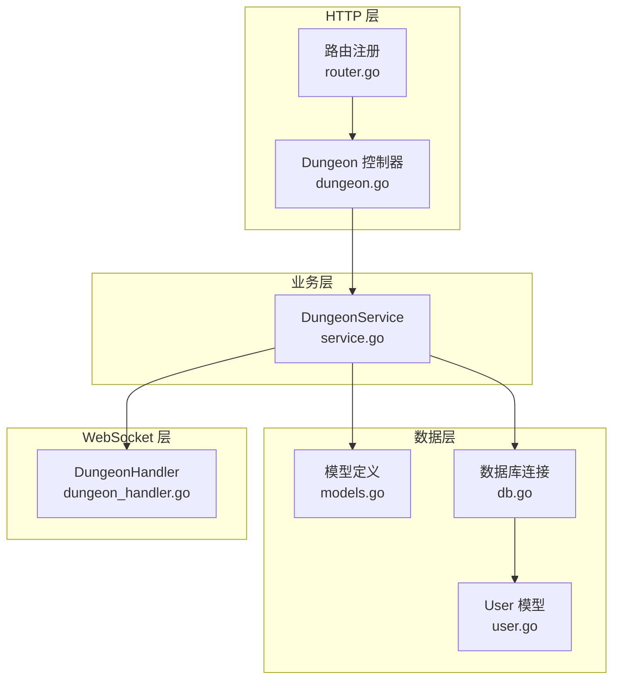
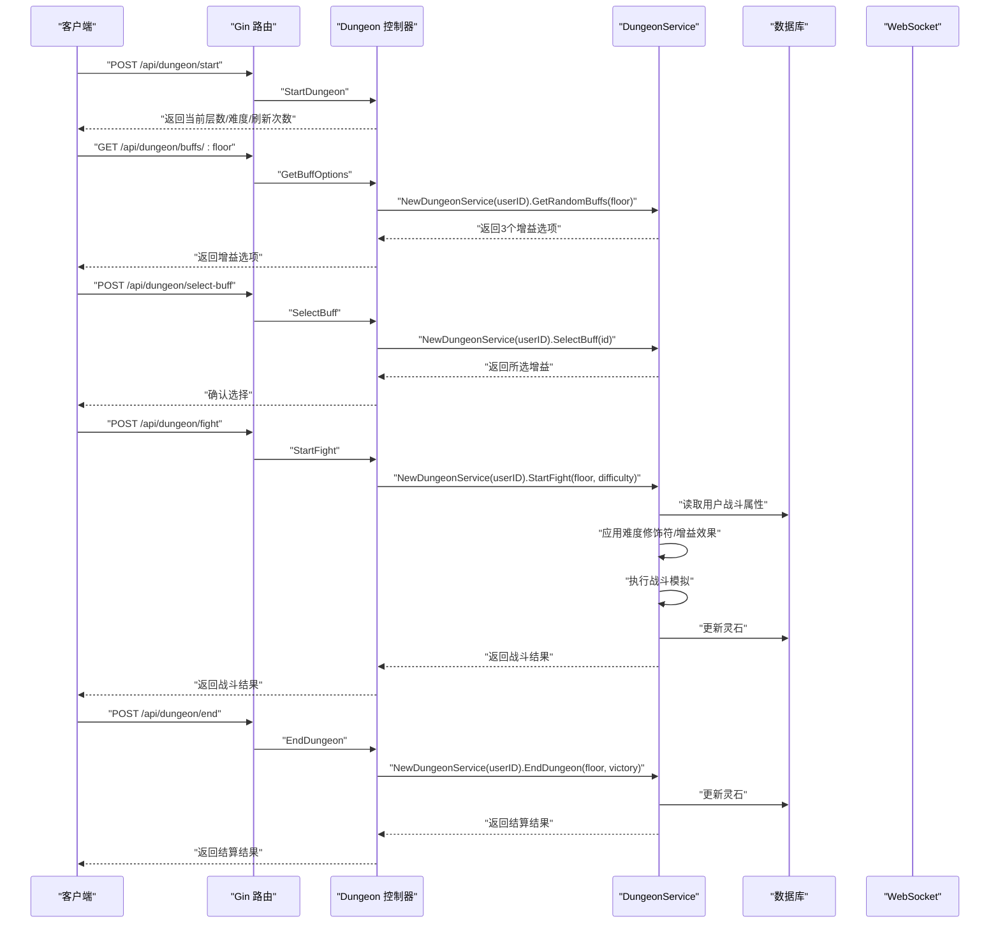
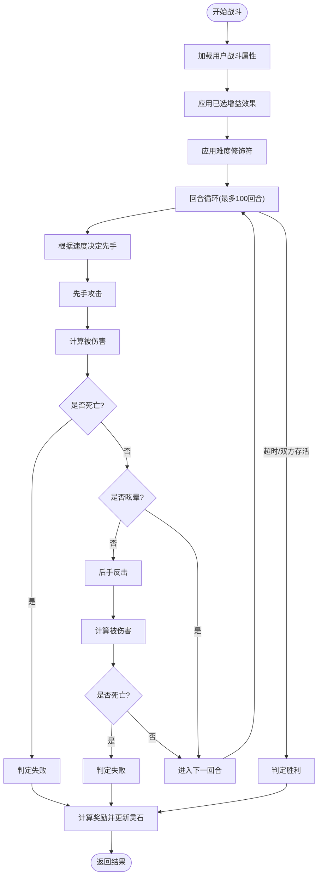
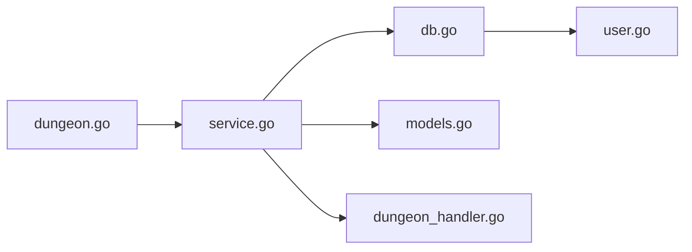

# 秘境系统后端架构

<cite>
**本文引用的文件**
- [server-go/internal/dungeon/models.go](file://server-go/internal/dungeon/models.go)
- [server-go/internal/dungeon/service.go](file://server-go/internal/dungeon/service.go)
- [server-go/internal/http/handlers/dungeon/dungeon.go](file://server-go/internal/http/handlers/dungeon/dungeon.go)
- [server-go/internal/websocket/dungeon_handler.go](file://server-go/internal/websocket/dungeon_handler.go)
- [server-go/internal/http/router/router.go](file://server-go/internal/http/router/router.go)
- [server-go/internal/http/middleware/auth.go](file://server-go/internal/http/middleware/auth.go)
- [server-go/internal/db/db.go](file://server-go/internal/db/db.go)
- [server-go/internal/models/user.go](file://server-go/internal/models/user.go)
- [WebSocket改造完整实现指南.md](file://WebSocket改造完整实现指南.md)
- [README_秘境功能.md](file://README_秘境功能.md)
</cite>

## 目录
1. [引言](#引言)
2. [项目结构](#项目结构)
3. [核心组件](#核心组件)
4. [架构总览](#架构总览)
5. [详细组件分析](#详细组件分析)
6. [依赖关系分析](#依赖关系分析)
7. [性能考量](#性能考量)
8. [故障排查指南](#故障排查指南)
9. [结论](#结论)
10. [附录](#附录)

## 引言
本技术文档聚焦于秘境系统后端架构，围绕“挑战启动、增益选择、战斗结算”三大核心流程，系统性解析 dungeong.go 中的处理器如何处理用户请求、调用 service.go 的业务逻辑，并操作 models.go 中的秘境状态数据模型；同时深入分析战斗计算逻辑、随机事件生成及奖励发放的事务性保障，说明系统如何通过分层设计实现高内聚低耦合，并给出应对高并发挑战的优化方案。

## 项目结构
后端采用 Go 语言，按领域分层组织：
- HTTP 层：路由注册与控制器（handlers），负责请求解析、鉴权、响应封装
- 业务层：service，封装秘境挑战、增益选择、战斗结算等核心算法
- 数据层：models 与 db，定义用户与战斗属性的数据模型，以及数据库连接
- WebSocket 层：事件广播，用于实时推送战斗事件给前端

图表来源
- [server-go/internal/http/router/router.go](file://server-go/internal/http/router/router.go#L104-L114)
- [server-go/internal/http/handlers/dungeon/dungeon.go](file://server-go/internal/http/handlers/dungeon/dungeon.go#L1-L276)
- [server-go/internal/dungeon/service.go](file://server-go/internal/dungeon/service.go#L1-L581)
- [server-go/internal/dungeon/models.go](file://server-go/internal/dungeon/models.go#L1-L136)
- [server-go/internal/db/db.go](file://server-go/internal/db/db.go#L1-L45)
- [server-go/internal/models/user.go](file://server-go/internal/models/user.go#L1-L48)
- [server-go/internal/websocket/dungeon_handler.go](file://server-go/internal/websocket/dungeon_handler.go#L1-L144)

章节来源
- [server-go/internal/http/router/router.go](file://server-go/internal/http/router/router.go#L104-L114)
- [server-go/internal/http/handlers/dungeon/dungeon.go](file://server-go/internal/http/handlers/dungeon/dungeon.go#L1-L276)

## 核心组件
- HTTP 控制器：提供 /api/dungeon/* 接口，负责参数校验、鉴权、调用业务层并返回统一响应
- 业务服务：DungeonService 封装增益生成、战斗计算、奖励发放等核心逻辑
- 数据模型：定义增益选项、战斗属性、伤害结果、战斗结果等结构体
- 数据库：User 模型与数据库连接，支撑用户属性与奖励发放
- WebSocket：DungeonHandler 负责将战斗事件推送给前端

章节来源
- [server-go/internal/http/handlers/dungeon/dungeon.go](file://server-go/internal/http/handlers/dungeon/dungeon.go#L1-L276)
- [server-go/internal/dungeon/service.go](file://server-go/internal/dungeon/service.go#L1-L581)
- [server-go/internal/dungeon/models.go](file://server-go/internal/dungeon/models.go#L1-L136)
- [server-go/internal/db/db.go](file://server-go/internal/db/db.go#L1-L45)
- [server-go/internal/models/user.go](file://server-go/internal/models/user.go#L1-L48)
- [server-go/internal/websocket/dungeon_handler.go](file://server-go/internal/websocket/dungeon_handler.go#L1-L144)

## 架构总览
后端通过 Gin 路由组将 /api/dungeon 下的请求交由对应的控制器处理；控制器构造业务服务实例，调用服务方法完成业务处理；服务方法读取数据库中的用户战斗属性，结合难度修饰符与增益效果，执行战斗模拟与奖励发放；战斗事件通过 WebSocket Handler 推送至前端。

图表来源
- [server-go/internal/http/router/router.go](file://server-go/internal/http/router/router.go#L104-L114)
- [server-go/internal/http/handlers/dungeon/dungeon.go](file://server-go/internal/http/handlers/dungeon/dungeon.go#L1-L276)
- [server-go/internal/dungeon/service.go](file://server-go/internal/dungeon/service.go#L302-L489)
- [server-go/internal/db/db.go](file://server-go/internal/db/db.go#L1-L45)
- [server-go/internal/models/user.go](file://server-go/internal/models/user.go#L1-L48)
- [server-go/internal/websocket/dungeon_handler.go](file://server-go/internal/websocket/dungeon_handler.go#L1-L144)

## 详细组件分析

### HTTP 控制器：dungeon.go
- StartDungeon：校验难度参数，返回当前层数、难度与刷新次数
- GetBuffOptions：解析 floor 参数，调用服务生成增益选项
- SelectBuff：校验 selectedBuffId，调用服务返回所选增益
- StartFight：校验 difficulty 与 floor，默认值处理，调用服务执行战斗
- EndDungeon：接收 floor 与 victory，调用服务结算并更新用户灵石

章节来源
- [server-go/internal/http/handlers/dungeon/dungeon.go](file://server-go/internal/http/handlers/dungeon/dungeon.go#L1-L276)

### 业务服务：service.go
- 增益生成：根据层数动态调整概率池，保证每层3个不重复的增益选项
- 战斗计算：基于前后端一致的公式，计算伤害、减免、闪避、反击、眩晕等
- 奖励发放：依据难度与胜负计算灵石奖励，原子性更新用户数据
- 增益应用：将已选增益效果合并到战斗属性，支持多增益叠加

图表来源
- [server-go/internal/dungeon/service.go](file://server-go/internal/dungeon/service.go#L302-L489)

章节来源
- [server-go/internal/dungeon/service.go](file://server-go/internal/dungeon/service.go#L68-L158)
- [server-go/internal/dungeon/service.go](file://server-go/internal/dungeon/service.go#L160-L262)
- [server-go/internal/dungeon/service.go](file://server-go/internal/dungeon/service.go#L264-L301)
- [server-go/internal/dungeon/service.go](file://server-go/internal/dungeon/service.go#L302-L489)

### 数据模型：models.go
- 请求/响应结构：DungeonRequest、DungeonResponse、BuffOptionsResponse、FightRequest、FightResponse
- 战斗属性：CombatStats，覆盖生命、攻击、防御、速度、各类概率与抗性、增伤/减伤、战斗属性提升等
- 伤害结果：DamageResult、TakeDamageResult，承载伤害数值、是否暴击/连击/眩晕/闪避/反击等
- 增益配置：BuffConfig、BuffOption，支持 common/rare/epic 三档品质
- 难度修饰：DifficultyModifier，提供健康、伤害、奖励的修正系数

章节来源
- [server-go/internal/dungeon/models.go](file://server-go/internal/dungeon/models.go#L1-L136)

### 数据库与用户模型：db.go、user.go
- db.go：初始化 PostgreSQL 连接，读取环境变量配置
- user.go：User 模型包含基础信息与 JSON 字段（战斗属性、特殊属性等），用于存储玩家战斗参数

章节来源
- [server-go/internal/db/db.go](file://server-go/internal/db/db.go#L1-L45)
- [server-go/internal/models/user.go](file://server-go/internal/models/user.go#L1-L48)

### WebSocket：dungeon_handler.go
- 定义战斗事件结构体，包含事件类型、层数、玩家/敌人血量、伤害、战利品、时间戳等
- 提供广播方法：开始、战斗轮次、胜利、失败、宝藏发现等事件
- 通过连接管理器向指定用户推送消息

章节来源
- [server-go/internal/websocket/dungeon_handler.go](file://server-go/internal/websocket/dungeon_handler.go#L1-L144)
- [WebSocket改造完整实现指南.md](file://WebSocket改造完整实现指南.md#L343-L366)

## 依赖关系分析
- 控制器依赖业务服务：每个接口均通过 NewDungeonService(userID) 创建服务实例并调用相应方法
- 业务服务依赖数据库与模型：读取 User 模型的战斗属性 JSON，应用难度与增益效果，更新灵石
- WebSocket 依赖连接管理器：将战斗事件推送到前端

图表来源
- [server-go/internal/http/handlers/dungeon/dungeon.go](file://server-go/internal/http/handlers/dungeon/dungeon.go#L1-L276)
- [server-go/internal/dungeon/service.go](file://server-go/internal/dungeon/service.go#L1-L581)
- [server-go/internal/db/db.go](file://server-go/internal/db/db.go#L1-L45)
- [server-go/internal/models/user.go](file://server-go/internal/models/user.go#L1-L48)
- [server-go/internal/websocket/dungeon_handler.go](file://server-go/internal/websocket/dungeon_handler.go#L1-L144)

章节来源
- [server-go/internal/http/handlers/dungeon/dungeon.go](file://server-go/internal/http/handlers/dungeon/dungeon.go#L1-L276)
- [server-go/internal/dungeon/service.go](file://server-go/internal/dungeon/service.go#L1-L581)

## 性能考量
- 分层解耦：HTTP 控制器仅做参数校验与调用，业务逻辑集中在 service，便于单元测试与扩展
- 数据访问：通过 GORM 进行 ORM 操作，注意批量更新与事务控制
- WebSocket 广播：事件推送采用连接管理器，避免阻塞主线程
- 并发优化建议：
  - 使用连接池与只读副本（若需要）降低读压力
  - 对高频接口引入限流与熔断（如基于令牌桶）
  - 对战斗计算可考虑缓存用户属性热点，减少 JSON 解析成本
  - 对奖励发放使用数据库事务，确保原子性
  - 对 WebSocket 事件进行节流，避免过于密集的消息推送

[本节为通用性能指导，不直接分析具体文件]

## 故障排查指南
- 鉴权失败：确认 Authorization 头是否为 Bearer Token，JWT_SECRET 是否正确配置
- 参数校验失败：检查请求体字段是否符合控制器要求（如 difficulty、selectedBuffId、floor）
- 用户不存在：StartFight/EndDungeon 前置条件为用户存在，若报错请检查用户 ID
- 战斗异常：核对难度参数与 floor 默认值；检查增益效果是否正确应用
- 奖励未到账：确认数据库更新是否成功，必要时回滚或补偿

章节来源
- [server-go/internal/http/middleware/auth.go](file://server-go/internal/http/middleware/auth.go#L1-L76)
- [server-go/internal/http/handlers/dungeon/dungeon.go](file://server-go/internal/http/handlers/dungeon/dungeon.go#L1-L276)
- [server-go/internal/dungeon/service.go](file://server-go/internal/dungeon/service.go#L302-L489)

## 结论
秘境系统后端通过清晰的分层设计，将请求处理、业务逻辑与数据访问有效分离；service 层承担了增益生成、战斗计算与奖励发放的核心职责，配合 models 的强类型结构体与 db 的 ORM 访问，形成了高内聚低耦合的架构。WebSocket 层为前端提供了实时事件推送能力。未来可在数据库事务、并发限流、缓存与事件节流等方面进一步优化，以应对更高并发场景。

## 附录
- 前后端协作参考：README_秘境功能.md 中对系统工作流程、增益与战斗机制的说明
- WebSocket 事件格式与订阅方式参考：WebSocket改造完整实现指南.md

章节来源
- [README_秘境功能.md](file://README_秘境功能.md#L162-L186)
- [WebSocket改造完整实现指南.md](file://WebSocket改造完整实现指南.md#L203-L215)