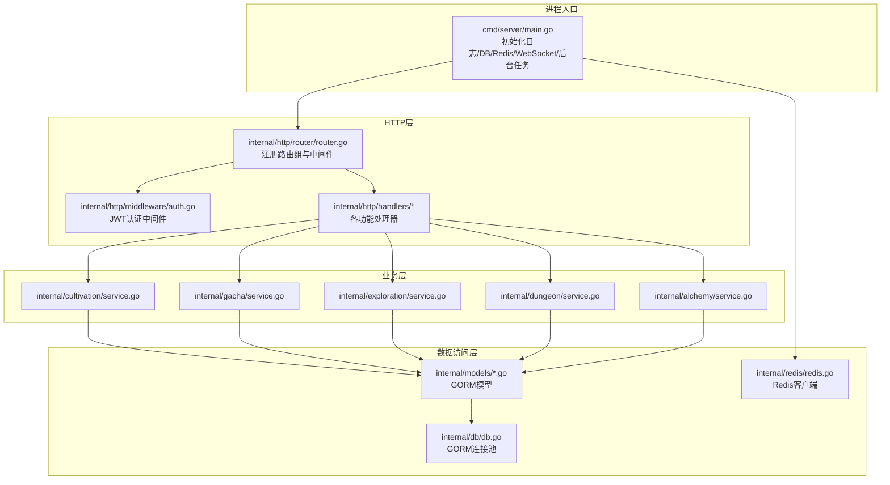
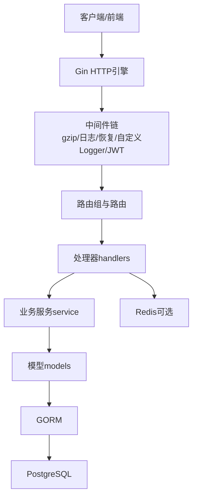
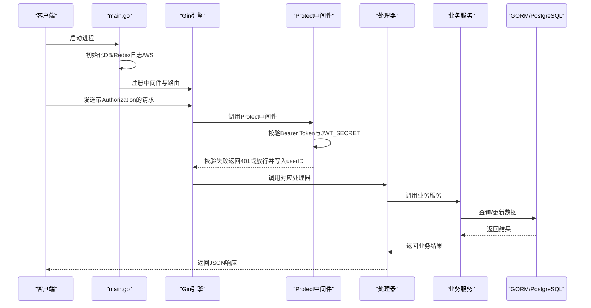
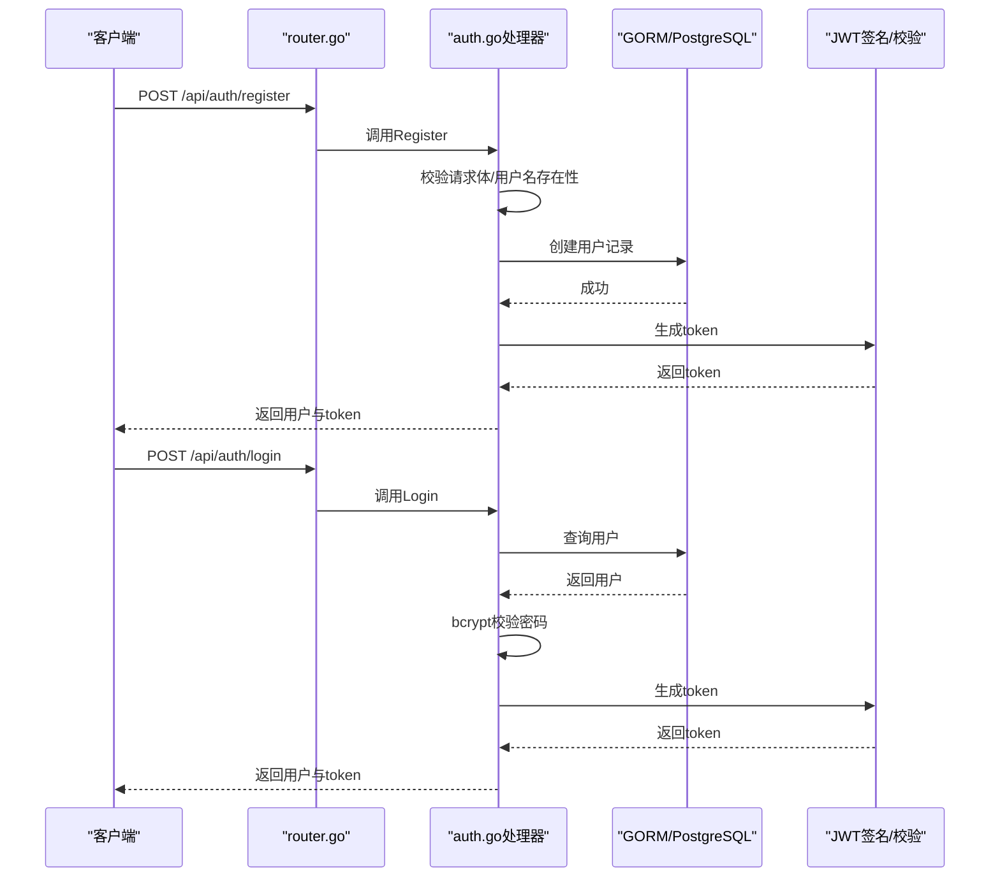
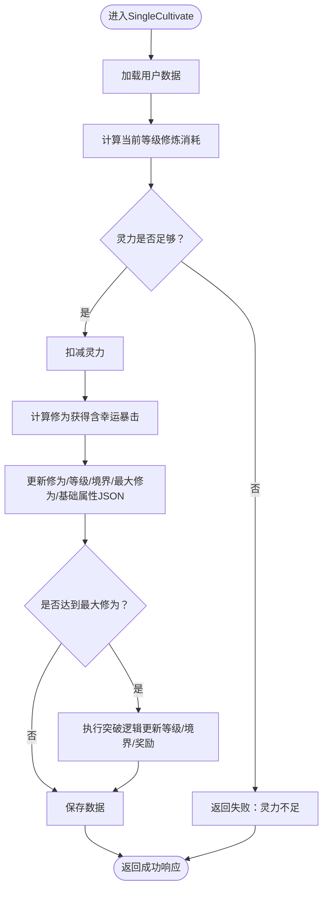
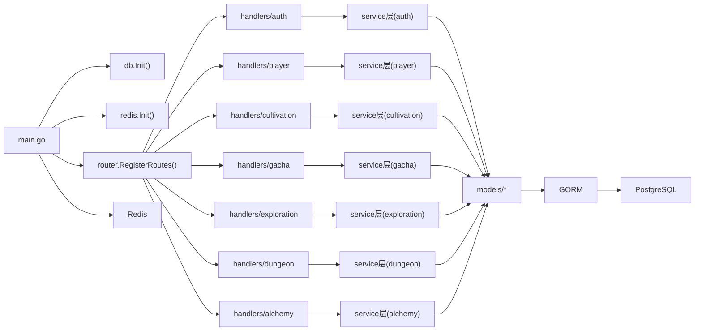

# 后端架构

<cite>
**本文引用的文件**
- [server-go/cmd/server/main.go](file://server-go/cmd/server/main.go)
- [server-go/internal/http/router/router.go](file://server-go/internal/http/router/router.go)
- [server-go/internal/http/middleware/auth.go](file://server-go/internal/http/middleware/auth.go)
- [server-go/internal/http/handlers/auth/auth.go](file://server-go/internal/http/handlers/auth/auth.go)
- [server-go/internal/http/handlers/player/player_handler.go](file://server-go/internal/http/handlers/player/player_handler.go)
- [server-go/internal/http/handlers/cultivation/cultivation.go](file://server-go/internal/http/handlers/cultivation/cultivation.go)
- [server-go/internal/http/handlers/gacha/gacha.go](file://server-go/internal/http/handlers/gacha/gacha.go)
- [server-go/internal/http/handlers/exploration/exploration.go](file://server-go/internal/http/handlers/exploration/exploration.go)
- [server-go/internal/http/handlers/dungeon/dungeon.go](file://server-go/internal/http/handlers/dungeon/dungeon.go)
- [server-go/internal/http/handlers/alchemy/alchemy.go](file://server-go/internal/http/handlers/alchemy/alchemy.go)
- [server-go/internal/db/db.go](file://server-go/internal/db/db.go)
- [server-go/internal/models/user.go](file://server-go/internal/models/user.go)
- [server-go/internal/redis/redis.go](file://server-go/internal/redis/redis.go)
- [server-go/internal/cultivation/service.go](file://server-go/internal/cultivation/service.go)
- [server-go/internal/gacha/service.go](file://server-go/internal/gacha/service.go)
- [server-go/internal/exploration/service.go](file://server-go/internal/exploration/service.go)
- [server-go/internal/dungeon/service.go](file://server-go/internal/dungeon/service.go)
- [server-go/internal/alchemy/service.go](file://server-go/internal/alchemy/service.go)
</cite>

## 目录
1. [引言](#引言)
2. [项目结构](#项目结构)
3. [核心组件](#核心组件)
4. [架构总览](#架构总览)
5. [详细组件分析](#详细组件分析)
6. [依赖关系分析](#依赖关系分析)
7. [性能考量](#性能考量)
8. [故障排查指南](#故障排查指南)
9. [结论](#结论)
10. [附录](#附录)

## 引言
本文件面向 xiuxian-go 后端，围绕 Go 语言实现的服务端设计进行系统化深度文档化。内容从 main.go 启动流程入手，阐述 Gin 框架初始化 HTTP 服务器、路由注册；详解分层架构（HTTP 处理器层、业务逻辑层、数据访问层）职责划分；说明 GORM 如何将 models 目录结构体映射到 PostgreSQL 数据库表；介绍 db.go 如何管理数据库连接池；覆盖中间件（auth.go）认证机制；以及 internal/redis/redis.go 在缓存用户状态中的应用。最后通过调用链分析展示一次 API 请求的完整处理路径，帮助读者快速理解并高效开发与维护。

## 项目结构
后端采用“命令入口 -> 路由 -> 处理器 -> 业务服务 -> 数据访问”的清晰分层组织方式。命令入口负责初始化日志、数据库、Redis、WebSocket 管理器与后台任务，随后注册 HTTP 路由与 WebSocket 路由，并将必要组件注入 Gin 上下文供处理器使用。各功能模块（玩家、修炼、秘境、探索、炼丹、抽卡等）按领域拆分，分别提供 handlers 层与 service 层，service 层通过 models 与 GORM 访问数据库。

图表来源
- [server-go/cmd/server/main.go](file://server-go/cmd/server/main.go#L1-L107)
- [server-go/internal/http/router/router.go](file://server-go/internal/http/router/router.go#L1-L126)
- [server-go/internal/http/middleware/auth.go](file://server-go/internal/http/middleware/auth.go#L1-L76)
- [server-go/internal/db/db.go](file://server-go/internal/db/db.go#L1-L45)
- [server-go/internal/redis/redis.go](file://server-go/internal/redis/redis.go#L1-L34)

章节来源
- [server-go/cmd/server/main.go](file://server-go/cmd/server/main.go#L1-L107)
- [server-go/internal/http/router/router.go](file://server-go/internal/http/router/router.go#L1-L126)

## 核心组件
- 启动入口与中间件
  - main.go 负责加载 .env、初始化数据库与 Redis、构建 zap 日志器、启用 gzip 压缩、注册中间件（日志、恢复、自定义 Logger）、启动 WebSocket 管理器与灵力增长后台任务，并注册 HTTP 与 WebSocket 路由，同时将 WS 管理器与处理器注入上下文。
  - 认证中间件 Protect 从 Authorization 头解析 Bearer Token，校验 JWT_SECRET，失败返回 401；成功将用户 ID 写入上下文供后续处理器使用。
- 路由注册
  - router.go 将 /api/auth、/api/player、/api/online、/api/gacha、/api/exploration、/api/cultivation、/api/dungeon、/api/alchemy 等路由组与具体接口绑定，其中多数接口使用 Protect 中间件保护。
- 数据访问与模型
  - db.go 通过 GORM 连接 PostgreSQL，暴露全局 DB 句柄。
  - models/user.go 定义 User 结构体，显式指定表名为 users，字段映射到数据库列，包含基础玩家属性、JSON 字段存储战斗与特殊属性、灵力自动增长时间戳等。
- 缓存
  - redis.go 提供 Redis 客户端初始化与 Ping 校验，用于缓存用户状态等场景。
- 业务服务
  - 各领域 service 层封装复杂业务逻辑，统一通过 models 与 GORM 访问数据库，避免 handlers 直接操作数据。

章节来源
- [server-go/cmd/server/main.go](file://server-go/cmd/server/main.go#L1-L107)
- [server-go/internal/http/middleware/auth.go](file://server-go/internal/http/middleware/auth.go#L1-L76)
- [server-go/internal/http/router/router.go](file://server-go/internal/http/router/router.go#L1-L126)
- [server-go/internal/db/db.go](file://server-go/internal/db/db.go#L1-L45)
- [server-go/internal/models/user.go](file://server-go/internal/models/user.go#L1-L48)
- [server-go/internal/redis/redis.go](file://server-go/internal/redis/redis.go#L1-L34)

## 架构总览
后端采用典型的三层架构：
- HTTP 层（handlers）：接收请求、绑定参数、调用业务服务、返回响应、记录日志。
- 业务层（service）：封装领域规则、事务控制、跨模型协作、算法计算。
- 数据访问层（models + GORM）：模型定义、数据库连接池、事务与查询。

图表来源
- [server-go/cmd/server/main.go](file://server-go/cmd/server/main.go#L1-L107)
- [server-go/internal/http/router/router.go](file://server-go/internal/http/router/router.go#L1-L126)
- [server-go/internal/db/db.go](file://server-go/internal/db/db.go#L1-L45)
- [server-go/internal/redis/redis.go](file://server-go/internal/redis/redis.go#L1-L34)

## 详细组件分析

### 启动流程与中间件链
- 启动流程要点
  - 加载 .env，初始化数据库与 Redis。
  - 构建 zap 生产级日志器，支持 LOG_LEVEL 动态切换。
  - 注册 gzip 压缩、gin-zap 日志、恢复中间件、自定义 Logger 中间件。
  - 启动 WebSocket 管理器与灵力增长后台任务。
  - 注册 HTTP 与 WebSocket 路由，并将 WS 管理器与处理器注入上下文。
  - 启动 HTTP 服务器监听端口。
- 中间件链
  - LoggerMiddleware 将 zap 日志器放入上下文，供 handlers 使用。
  - Protect 中间件从 Authorization: Bearer <token> 读取令牌，校验 JWT_SECRET，校验失败返回 401，成功将 userID 写入上下文。

图表来源
- [server-go/cmd/server/main.go](file://server-go/cmd/server/main.go#L1-L107)
- [server-go/internal/http/middleware/auth.go](file://server-go/internal/http/middleware/auth.go#L1-L76)

章节来源
- [server-go/cmd/server/main.go](file://server-go/cmd/server/main.go#L1-L107)
- [server-go/internal/http/middleware/auth.go](file://server-go/internal/http/middleware/auth.go#L1-L76)

### 路由注册与分组
- 路由组
  - /api/auth：注册、登录、获取当前用户信息（Protect 保护）。
  - /api/player：排行榜公开访问；其余接口需认证，包括获取/更新玩家数据、灵力、装备与宠物相关操作。
  - /api/online：心跳、登录、登出、在线玩家查询等（无需鉴权）。
  - /api/gacha：抽卡与自动行动（Protect 保护）。
  - /api/exploration：开始探索、事件选择（Protect 保护）。
  - /api/cultivation：单次修炼、一键突破、获取修炼数据（Protect 保护）。
  - /api/dungeon：开始秘境、获取增益选项、选择增益、开始战斗、结束秘境（Protect 保护）。
  - /api/alchemy：获取配置、配方、配方详情、炼制、购买残页（Protect 保护）。
- 中间件使用
  - 多数接口使用 Protect 中间件，确保仅认证用户可访问。

章节来源
- [server-go/internal/http/router/router.go](file://server-go/internal/http/router/router.go#L1-L126)

### 认证机制与处理器
- 认证中间件 Protect
  - 从 Authorization 头提取 Bearer Token，读取 JWT_SECRET，解析并校验，失败返回 401；成功将 userID 写入上下文。
- 登录/注册处理器
  - 注册：校验请求体、检查用户名是否存在、bcrypt 加密密码、创建用户记录、生成 JWT、返回用户信息与 token。
  - 登录：查找用户、bcrypt 校验密码、生成 JWT、返回用户信息与 token。
  - 获取用户：从上下文读取 userID，查询用户基本信息并返回。
- 处理器通用模式
  - 从上下文获取 zap 日志器，记录入参与出参；绑定请求体；调用 service；处理错误；返回 JSON。

图表来源
- [server-go/internal/http/router/router.go](file://server-go/internal/http/router/router.go#L1-L126)
- [server-go/internal/http/handlers/auth/auth.go](file://server-go/internal/http/handlers/auth/auth.go#L1-L219)
- [server-go/internal/http/middleware/auth.go](file://server-go/internal/http/middleware/auth.go#L1-L76)

章节来源
- [server-go/internal/http/handlers/auth/auth.go](file://server-go/internal/http/handlers/auth/auth.go#L1-L219)
- [server-go/internal/http/middleware/auth.go](file://server-go/internal/http/middleware/auth.go#L1-L76)

### 数据访问层与模型映射
- 数据库连接池
  - db.go 通过 GORM 打开 PostgreSQL 连接，读取 DB_HOST/DB_PORT/DB_NAME/DB_USER/DB_PASSWORD 环境变量，默认值见源码；DB 为全局句柄，供各 service 使用。
- 模型映射
  - models/user.go 定义 User 结构体，使用 gorm 标签映射列名，TableName 显式返回 users；包含基础玩家属性、JSON 字段存储战斗与特殊属性、灵力自动增长时间戳等。
- 其他模型
  - models 下还包含装备、宠物、草药、丹药、用户炼丹数据等模型文件，均通过 GORM 与数据库表映射。

章节来源
- [server-go/internal/db/db.go](file://server-go/internal/db/db.go#L1-L45)
- [server-go/internal/models/user.go](file://server-go/internal/models/user.go#L1-L48)

### 业务服务层（以修炼为例）
- 服务职责
  - 读取用户数据，计算修炼消耗与收益，处理幸运暴击、突破逻辑，更新用户属性与 JSON 字段，持久化变更。
- 关键流程
  - SingleCultivate：检查灵力是否足够，计算消耗与收益，可能触发突破，更新属性与 JSON 字段，保存到数据库。
  - CultivateUntilBreakthrough：估算次数与总消耗，一次性突破至下一境界，更新属性与 JSON 字段。
  - GetCultivationData：读取用户当前等级、境界、修为、灵力、修炼/灵力速率与已解锁境界列表。

图表来源
- [server-go/internal/cultivation/service.go](file://server-go/internal/cultivation/service.go#L1-L355)
- [server-go/internal/http/handlers/cultivation/cultivation.go](file://server-go/internal/http/handlers/cultivation/cultivation.go#L1-L122)

章节来源
- [server-go/internal/cultivation/service.go](file://server-go/internal/cultivation/service.go#L1-L355)
- [server-go/internal/http/handlers/cultivation/cultivation.go](file://server-go/internal/http/handlers/cultivation/cultivation.go#L1-L122)

### 其他业务服务概览
- 抽卡服务
  - GenerateEquipment/GeneratePet：生成随机装备/宠物并持久化；DeductSpiritStones/AddReinforceStones/DeleteEquipment/DeletePet：围绕用户资源与物品的增删改查。
- 探索服务
  - StartExploration：按幸运值触发事件，产出日志与奖励；HandleEventChoice：根据事件类型处理不同结果（物品、灵石、灵草、丹方残页、战斗）。
- 秘境服务
  - GetRandomBuffs/SelectBuff/SelectBuffAndApplyEffects：提供增益选项与应用；StartFight：根据难度与增益计算战斗过程与奖励；EndDungeon：结算楼层奖励。
- 炼丹服务
  - GetAllRecipes/GetRecipeDetail/CraftPill/BuyFragment：配方管理、炼制成功率计算、材料扣除、残页购买与解锁。

章节来源
- [server-go/internal/gacha/service.go](file://server-go/internal/gacha/service.go#L1-L139)
- [server-go/internal/exploration/service.go](file://server-go/internal/exploration/service.go#L1-L515)
- [server-go/internal/dungeon/service.go](file://server-go/internal/dungeon/service.go#L1-L581)
- [server-go/internal/alchemy/service.go](file://server-go/internal/alchemy/service.go#L1-L670)

### 处理器与服务交互示例（玩家数据）
- GetPlayerData
  - 从上下文获取 userID，组装用户、物品、宠物、草药、丹药数据，返回 JSON。
- UpdatePlayerData
  - 使用事务批量更新用户基础数据与物品/宠物/草药/丹药，记录日志并返回成功消息。
- DeleteItems/DeletePets
  - 校验请求体，按用户 ID 与物品/宠物 ID 列表删除对应记录。

章节来源
- [server-go/internal/http/handlers/player/player_handler.go](file://server-go/internal/http/handlers/player/player_handler.go#L1-L357)

### WebSocket 与后台任务
- WebSocket 管理器
  - main.go 启动 WebSocket 连接管理器与事件处理器，并将它们注入 Gin 上下文，供其他接口使用。
- 灵力增长后台任务
  - main.go 启动 spirit grow manager 并在退出时停止，用于周期性增长玩家灵力。

章节来源
- [server-go/cmd/server/main.go](file://server-go/cmd/server/main.go#L1-L107)

## 依赖关系分析
- 组件耦合与内聚
  - handlers 仅依赖 service 接口，service 仅依赖 models 与 GORM，db 与 redis 作为基础设施被 service 间接使用，保持较高内聚与较低耦合。
- 直接与间接依赖
  - main.go 直接依赖 db.Init、redis.Init、router.RegisterRoutes、websocket 初始化与管理器。
  - router.go 直接依赖各 handlers 包。
  - handlers 依赖各自 service 包，service 依赖 models 与 db。
- 外部依赖
  - Gin、GORM、Redis 客户端、JWT、bcrypt、zap 等。

图表来源
- [server-go/cmd/server/main.go](file://server-go/cmd/server/main.go#L1-L107)
- [server-go/internal/http/router/router.go](file://server-go/internal/http/router/router.go#L1-L126)

章节来源
- [server-go/cmd/server/main.go](file://server-go/cmd/server/main.go#L1-L107)
- [server-go/internal/http/router/router.go](file://server-go/internal/http/router/router.go#L1-L126)

## 性能考量
- 中间件与日志
  - gzip 压缩减少响应体积；zap 日志器生产级配置，建议在高并发场景下合理设置日志级别与采样策略。
- 数据库
  - 使用 GORM 连接池，注意合理设置连接数与超时；对高频查询建立合适索引；批量更新使用事务减少往返。
- 缓存
  - Redis 用于缓存用户状态等热点数据，降低数据库压力；注意过期策略与一致性。
- WebSocket
  - 连接管理器集中管理连接，后台任务与处理器注入上下文，避免重复初始化带来的开销。

## 故障排查指南
- 认证失败
  - 检查 Authorization 头格式是否为 Bearer <token>；确认 JWT_SECRET 是否正确配置；查看中间件日志输出。
- 数据库连接失败
  - 检查 DB_HOST/DB_PORT/DB_NAME/DB_USER/DB_PASSWORD 环境变量；确认 PostgreSQL 可达；查看 db.Init 错误。
- Redis 连接失败
  - 检查 REDIS_URL；确认 Redis 服务可达；查看 redis.Init 错误。
- 处理器内部错误
  - 查看处理器中 zap 日志记录的入参与出参；定位具体 service 调用链；检查数据库事务提交与回滚逻辑。

章节来源
- [server-go/internal/http/middleware/auth.go](file://server-go/internal/http/middleware/auth.go#L1-L76)
- [server-go/internal/db/db.go](file://server-go/internal/db/db.go#L1-L45)
- [server-go/internal/redis/redis.go](file://server-go/internal/redis/redis.go#L1-L34)
- [server-go/internal/http/handlers/player/player_handler.go](file://server-go/internal/http/handlers/player/player_handler.go#L1-L357)

## 结论
xiuxian-go 后端以 Gin 为核心，结合 GORM 与 Redis，形成清晰的三层架构：HTTP 处理器层负责请求接入与响应输出；业务服务层承载复杂领域逻辑；数据访问层通过模型与连接池稳定支撑。认证中间件与路由分组保障接口安全与可维护性；WebSocket 与后台任务增强实时性与自动化能力。整体设计具备良好的扩展性与可维护性，适合持续迭代与功能扩展。

## 附录
- 关键文件路径与职责
  - [server-go/cmd/server/main.go](file://server-go/cmd/server/main.go#L1-L107)：进程入口、中间件链、路由注册、WebSocket 与后台任务初始化。
  - [server-go/internal/http/router/router.go](file://server-go/internal/http/router/router.go#L1-L126)：路由注册与分组。
  - [server-go/internal/http/middleware/auth.go](file://server-go/internal/http/middleware/auth.go#L1-L76)：JWT 认证中间件。
  - [server-go/internal/http/handlers/auth/auth.go](file://server-go/internal/http/handlers/auth/auth.go#L1-L219)：注册/登录/获取用户处理器。
  - [server-go/internal/http/handlers/player/player_handler.go](file://server-go/internal/http/handlers/player/player_handler.go#L1-L357)：玩家数据与库存/宠物相关处理器。
  - [server-go/internal/http/handlers/cultivation/cultivation.go](file://server-go/internal/http/handlers/cultivation/cultivation.go#L1-L122)：修炼处理器。
  - [server-go/internal/http/handlers/gacha/gacha.go](file://server-go/internal/http/handlers/gacha/gacha.go#L1-L17)：抽卡处理器。
  - [server-go/internal/http/handlers/exploration/exploration.go](file://server-go/internal/http/handlers/exploration/exploration.go)：探索处理器。
  - [server-go/internal/http/handlers/dungeon/dungeon.go](file://server-go/internal/http/handlers/dungeon/dungeon.go)：秘境处理器。
  - [server-go/internal/http/handlers/alchemy/alchemy.go](file://server-go/internal/http/handlers/alchemy/alchemy.go)：炼丹处理器。
  - [server-go/internal/db/db.go](file://server-go/internal/db/db.go#L1-L45)：数据库连接池初始化。
  - [server-go/internal/models/user.go](file://server-go/internal/models/user.go#L1-L48)：用户模型定义。
  - [server-go/internal/redis/redis.go](file://server-go/internal/redis/redis.go#L1-L34)：Redis 客户端初始化。