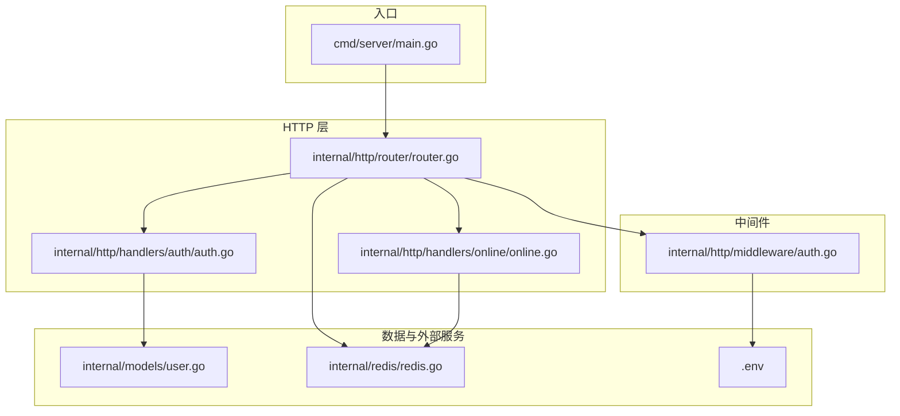
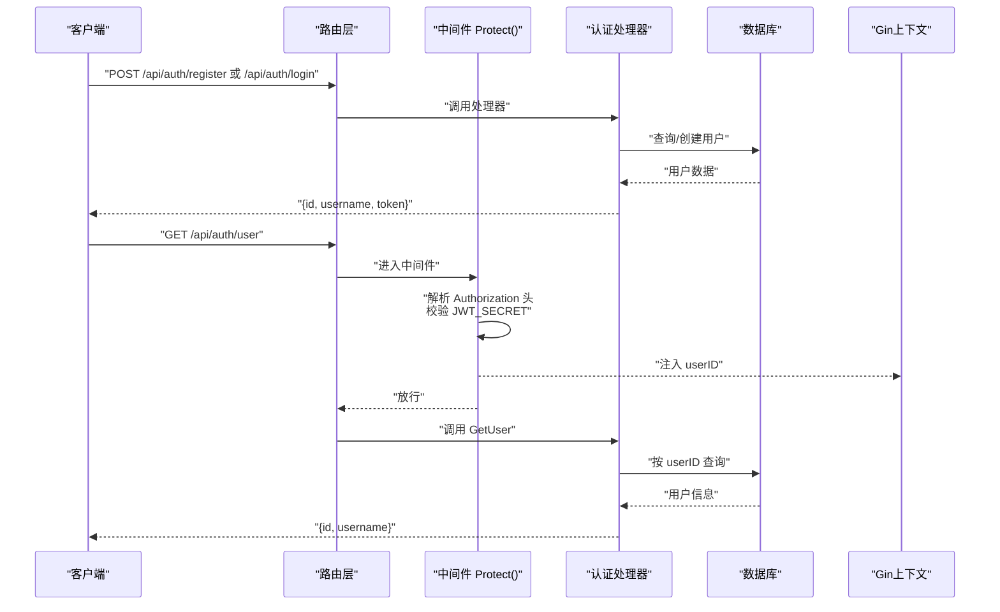
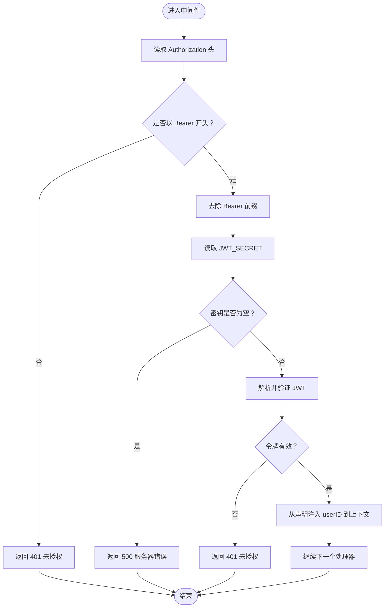
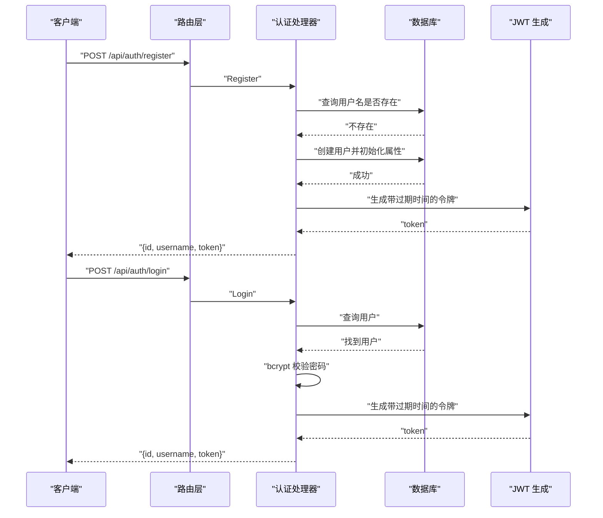
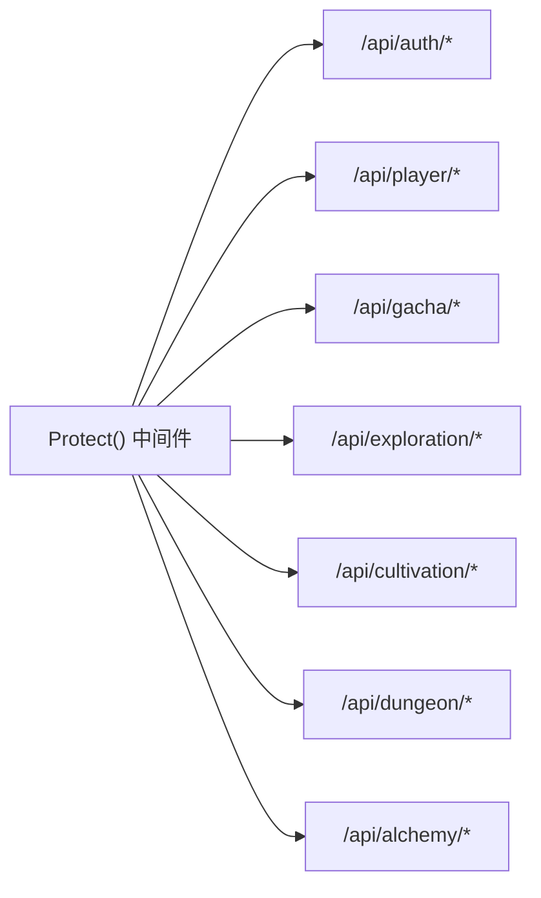
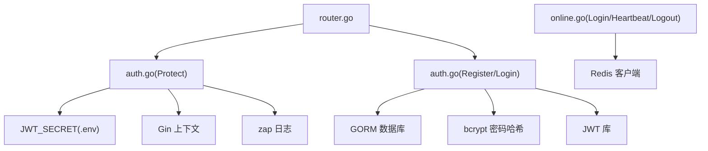

# 认证与中间件机制

<cite>
**本文引用的文件**
- [server-go/internal/http/middleware/auth.go](file://server-go/internal/http/middleware/auth.go)
- [server-go/internal/http/handlers/auth/auth.go](file://server-go/internal/http/handlers/auth/auth.go)
- [server-go/internal/http/router/router.go](file://server-go/internal/http/router/router.go)
- [server-go/internal/models/user.go](file://server-go/internal/models/user.go)
- [server-go/internal/redis/redis.go](file://server-go/internal/redis/redis.go)
- [server-go/internal/http/handlers/online/online.go](file://server-go/internal/http/handlers/online/online.go)
- [server-go/cmd/server/main.go](file://server-go/cmd/server/main.go)
- [server-go/.env](file://server-go/.env)
</cite>

## 目录
1. [引言](#引言)
2. [项目结构](#项目结构)
3. [核心组件](#核心组件)
4. [架构总览](#架构总览)
5. [详细组件分析](#详细组件分析)
6. [依赖关系分析](#依赖关系分析)
7. [性能考量](#性能考量)
8. [故障排查指南](#故障排查指南)
9. [结论](#结论)
10. [附录](#附录)

## 引言
本文件围绕 xiuxian-go 的认证体系进行深入剖析，重点聚焦于中间件 Protect() 的实现原理与工作流，结合注册/登录处理器的令牌签发流程，解释 JWT 的生成与验证、令牌在受保护路由中的注入与传递机制，并给出令牌存储策略（如 Redis 黑名单）与安全最佳实践建议。同时，文档覆盖 /api/auth/user 等受保护路由的访问控制，帮助读者在理解现有实现的基础上，评估与优化系统的安全性与可维护性。

## 项目结构
认证相关的核心代码分布在以下模块：
- 中间件层：负责从请求头提取并校验 JWT，向上下文注入用户标识
- 处理器层：提供注册、登录与用户信息查询接口，负责签发 JWT
- 路由层：将中间件应用到受保护路由组，统一拦截未授权访问
- 数据模型与外部服务：用户模型、Redis 客户端初始化
- 启动入口：加载环境变量、初始化数据库与 Redis、注册路由

图表来源
- [server-go/cmd/server/main.go](file://server-go/cmd/server/main.go#L1-L107)
- [server-go/internal/http/router/router.go](file://server-go/internal/http/router/router.go#L1-L126)
- [server-go/internal/http/handlers/auth/auth.go](file://server-go/internal/http/handlers/auth/auth.go#L1-L219)
- [server-go/internal/http/handlers/online/online.go](file://server-go/internal/http/handlers/online/online.go#L1-L319)
- [server-go/internal/http/middleware/auth.go](file://server-go/internal/http/middleware/auth.go#L1-L76)
- [server-go/internal/models/user.go](file://server-go/internal/models/user.go#L1-L48)
- [server-go/internal/redis/redis.go](file://server-go/internal/redis/redis.go#L1-L34)
- [server-go/.env](file://server-go/.env#L1-L9)

章节来源
- [server-go/cmd/server/main.go](file://server-go/cmd/server/main.go#L1-L107)
- [server-go/internal/http/router/router.go](file://server-go/internal/http/router/router.go#L1-L126)

## 核心组件
- 中间件 Protect()：从 Authorization 请求头提取 Bearer 令牌，使用环境变量 JWT_SECRET 进行签名验证，将用户 ID 注入 Gin 上下文，供后续处理器使用
- 注册/登录处理器：接收用户名与密码，校验唯一性与凭据，使用 bcrypt 加密存储密码，签发 JWT 返回给客户端
- 路由组：将 Protect() 应用于 /api/auth/user 与多个业务接口组，形成统一的访问控制
- 在线状态与心跳：通过 /api/online/* 接口维护玩家在线状态，配合 Redis TTL 实现自动下线；与 JWT 无直接黑名单关联，但可作为整体安全策略的一部分

章节来源
- [server-go/internal/http/middleware/auth.go](file://server-go/internal/http/middleware/auth.go#L1-L76)
- [server-go/internal/http/handlers/auth/auth.go](file://server-go/internal/http/handlers/auth/auth.go#L1-L219)
- [server-go/internal/http/router/router.go](file://server-go/internal/http/router/router.go#L1-L126)
- [server-go/internal/http/handlers/online/online.go](file://server-go/internal/http/handlers/online/online.go#L1-L319)

## 架构总览
下图展示了认证与中间件的整体交互流程，包括请求进入、中间件校验、处理器读取上下文、以及受保护路由的访问控制。

图表来源
- [server-go/internal/http/router/router.go](file://server-go/internal/http/router/router.go#L23-L29)
- [server-go/internal/http/middleware/auth.go](file://server-go/internal/http/middleware/auth.go#L22-L74)
- [server-go/internal/http/handlers/auth/auth.go](file://server-go/internal/http/handlers/auth/auth.go#L128-L219)
- [server-go/internal/models/user.go](file://server-go/internal/models/user.go#L12-L42)

## 详细组件分析

### 中间件 Protect() 实现原理
- 请求头解析：从 Authorization 头提取 Bearer 令牌，若缺失或格式不正确，返回未授权并终止后续处理
- 密钥加载：从环境变量 JWT_SECRET 读取密钥，若未配置，返回服务器内部错误
- JWT 验证：使用 HS256 签名算法与密钥进行解析与校验，失败时记录详细日志并返回未授权
- 上下文注入：验证通过后，从声明中取出用户 ID，注入到 Gin 上下文键 "userID"，供后续处理器读取

图表来源
- [server-go/internal/http/middleware/auth.go](file://server-go/internal/http/middleware/auth.go#L22-L74)

章节来源
- [server-go/internal/http/middleware/auth.go](file://server-go/internal/http/middleware/auth.go#L1-L76)
- [server-go/.env](file://server-go/.env#L8-L8)

### 注册与登录流程（含 JWT 签发）
- 注册 Register：
  - 校验请求体参数
  - 检查用户名是否已存在
  - 使用 bcrypt 对密码进行哈希加密
  - 创建用户记录并初始化基础属性
  - 生成 JWT（含过期时间），返回用户信息与令牌
- 登录 Login：
  - 校验请求体参数
  - 查询用户并比对密码哈希
  - 生成 JWT（含过期时间），返回用户信息与令牌

图表来源
- [server-go/internal/http/handlers/auth/auth.go](file://server-go/internal/http/handlers/auth/auth.go#L40-L126)
- [server-go/internal/http/handlers/auth/auth.go](file://server-go/internal/http/handlers/auth/auth.go#L128-L180)
- [server-go/internal/models/user.go](file://server-go/internal/models/user.go#L12-L42)

章节来源
- [server-go/internal/http/handlers/auth/auth.go](file://server-go/internal/http/handlers/auth/auth.go#L1-L219)
- [server-go/internal/models/user.go](file://server-go/internal/models/user.go#L1-L48)

### 受保护路由访问控制
- 路由组 /api/auth：包含 /api/auth/user，使用 Protect() 中间件进行鉴权
- 其他业务路由组（如 /api/player、/api/gacha、/api/exploration、/api/cultivation、/api/dungeon、/api/alchemy）均在组内启用 Protect()，确保这些接口仅允许已认证用户访问
- 处理器通过从上下文读取 userID，实现基于用户身份的数据访问与写入

图表来源
- [server-go/internal/http/router/router.go](file://server-go/internal/http/router/router.go#L23-L125)

章节来源
- [server-go/internal/http/router/router.go](file://server-go/internal/http/router/router.go#L1-L126)

### JWT 生成与验证逻辑
- 生成逻辑：
  - 从环境变量读取 JWT_SECRET
  - 构造声明，包含用户 ID 与过期时间（当前实现为 30 天）
  - 使用 HS256 签名算法生成签名字符串
- 验证逻辑：
  - 从 Authorization 头提取 Bearer 令牌
  - 读取 JWT_SECRET
  - 使用相同算法与密钥解析并验证签名
  - 成功后从声明中提取用户 ID 注入上下文

章节来源
- [server-go/internal/http/handlers/auth/auth.go](file://server-go/internal/http/handlers/auth/auth.go#L23-L38)
- [server-go/internal/http/middleware/auth.go](file://server-go/internal/http/middleware/auth.go#L41-L59)

### 令牌存储策略与黑名单
- 当前实现：
  - 采用无状态 JWT，中间件仅进行签名验证，未在服务端维护黑名单
  - 在线状态与心跳通过 Redis 维护，利用 TTL 自动过期实现离线
- 黑名单建议（可选增强方案）：
  - 服务端维护 Redis 集合或有序集合，记录已吊销的 JTI 或用户 ID
  - 中间件在验证时检查黑名单，若命中则拒绝
  - 结合刷新令牌机制，吊销旧令牌并发放新令牌
  - 为高风险场景增加滑动过期与 IP/设备绑定校验

章节来源
- [server-go/internal/http/middleware/auth.go](file://server-go/internal/http/middleware/auth.go#L22-L74)
- [server-go/internal/http/handlers/online/online.go](file://server-go/internal/http/handlers/online/online.go#L71-L109)
- [server-go/internal/http/handlers/online/online.go](file://server-go/internal/http/handlers/online/online.go#L112-L185)
- [server-go/internal/http/handlers/online/online.go](file://server-go/internal/http/handlers/online/online.go#L188-L253)

## 依赖关系分析
- 中间件依赖：
  - 环境变量 JWT_SECRET
  - Gin 上下文注入 userID
  - 日志库 zap 记录认证过程与失败原因
- 处理器依赖：
  - 数据库 ORM（GORM）进行用户查询与创建
  - bcrypt 进行密码哈希
  - JWT 库进行令牌生成与解析
- 路由依赖：
  - 将中间件挂载到特定路由组，形成统一的访问控制策略
- 外部服务：
  - Redis 用于在线状态与心跳管理（非 JWT 黑名单）

图表来源
- [server-go/internal/http/middleware/auth.go](file://server-go/internal/http/middleware/auth.go#L1-L76)
- [server-go/internal/http/handlers/auth/auth.go](file://server-go/internal/http/handlers/auth/auth.go#L1-L219)
- [server-go/internal/http/router/router.go](file://server-go/internal/http/router/router.go#L1-L126)
- [server-go/internal/http/handlers/online/online.go](file://server-go/internal/http/handlers/online/online.go#L1-L319)
- [server-go/internal/redis/redis.go](file://server-go/internal/redis/redis.go#L1-L34)
- [server-go/.env](file://server-go/.env#L1-L9)

章节来源
- [server-go/internal/http/middleware/auth.go](file://server-go/internal/http/middleware/auth.go#L1-L76)
- [server-go/internal/http/handlers/auth/auth.go](file://server-go/internal/http/handlers/auth/auth.go#L1-L219)
- [server-go/internal/http/router/router.go](file://server-go/internal/http/router/router.go#L1-L126)
- [server-go/internal/http/handlers/online/online.go](file://server-go/internal/http/handlers/online/online.go#L1-L319)
- [server-go/internal/redis/redis.go](file://server-go/internal/redis/redis.go#L1-L34)
- [server-go/.env](file://server-go/.env#L1-L9)

## 性能考量
- 中间件验证成本低：仅进行签名解析与密钥匹配，CPU 开销小
- 密钥加载：每次请求读取环境变量，建议在进程启动时缓存至常量，减少重复 IO
- 数据库访问：注册/登录与受保护路由均涉及数据库查询，建议：
  - 对用户表建立合适的索引（如用户名唯一索引）
  - 使用连接池与合理的超时配置
  - 对高频接口进行必要的缓存（如用户基本信息）
- Redis：在线状态与心跳使用 Redis，注意键空间与过期策略，避免内存膨胀

## 故障排查指南
- 401 未授权：
  - 检查请求头 Authorization 是否为 Bearer 令牌
  - 确认 JWT_SECRET 已正确配置且与签发端一致
  - 查看中间件日志，定位解析失败或验证失败原因
- 500 服务器错误：
  - JWT_SECRET 未配置或为空
  - 数据库连接异常或查询失败
- 令牌过期：
  - 当前令牌有效期为 30 天，若需缩短，请修改签发逻辑中的过期时间
- 在线状态异常：
  - 心跳接口未及时更新导致自动下线
  - Redis 连接或键过期配置异常

章节来源
- [server-go/internal/http/middleware/auth.go](file://server-go/internal/http/middleware/auth.go#L31-L62)
- [server-go/internal/http/handlers/auth/auth.go](file://server-go/internal/http/handlers/auth/auth.go#L23-L38)
- [server-go/internal/http/handlers/online/online.go](file://server-go/internal/http/handlers/online/online.go#L112-L185)

## 结论
本项目采用无状态 JWT 作为认证载体，中间件 Protect() 负责从请求头提取并验证令牌，将用户 ID 注入上下文，从而实现对多条业务路由的统一访问控制。注册与登录流程通过 bcrypt 保障密码安全，JWT 提供短期会话能力。在线状态与心跳通过 Redis 实现自动下线，形成较为完善的会话生命周期管理。为进一步提升安全性，建议引入服务端令牌黑名单、刷新令牌机制与滑动过期策略，并对密钥加载与数据库访问进行性能优化。

## 附录
- 环境变量与配置要点：
  - JWT_SECRET：用于 JWT 签名与验证
  - REDIS_URL：Redis 连接地址
  - LOG_LEVEL：日志级别
- 安全最佳实践建议：
  - 缩短令牌有效期，结合刷新令牌
  - 引入黑名单与吊销机制
  - 限制每分钟令牌请求次数，防范暴力破解
  - 对敏感接口增加二次校验（如 IP/设备绑定）
  - 使用 HTTPS 传输，避免令牌在传输中泄露

章节来源
- [server-go/.env](file://server-go/.env#L1-L9)
- [server-go/cmd/server/main.go](file://server-go/cmd/server/main.go#L42-L55)