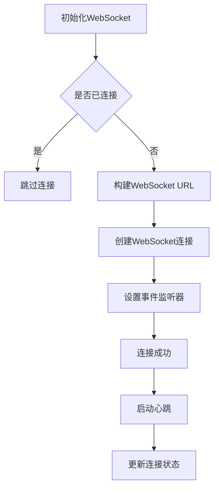
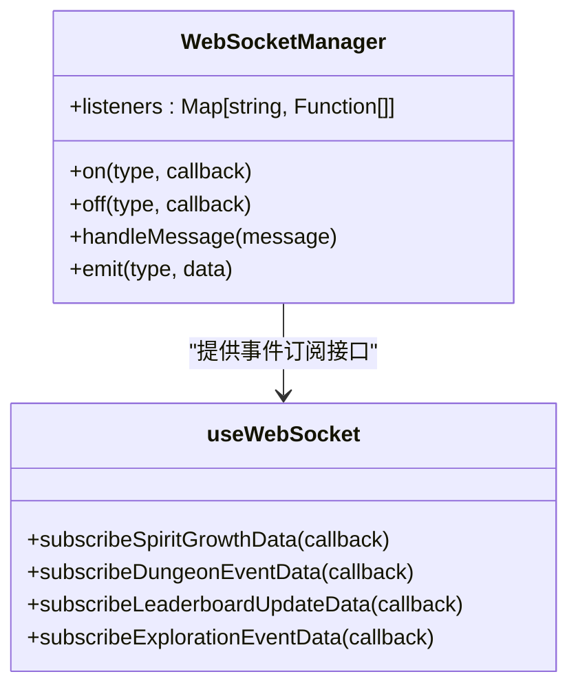
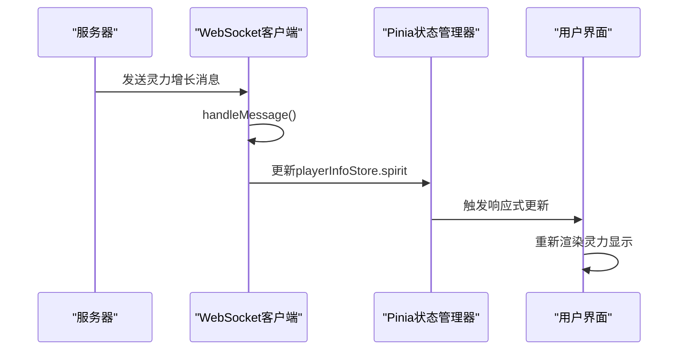
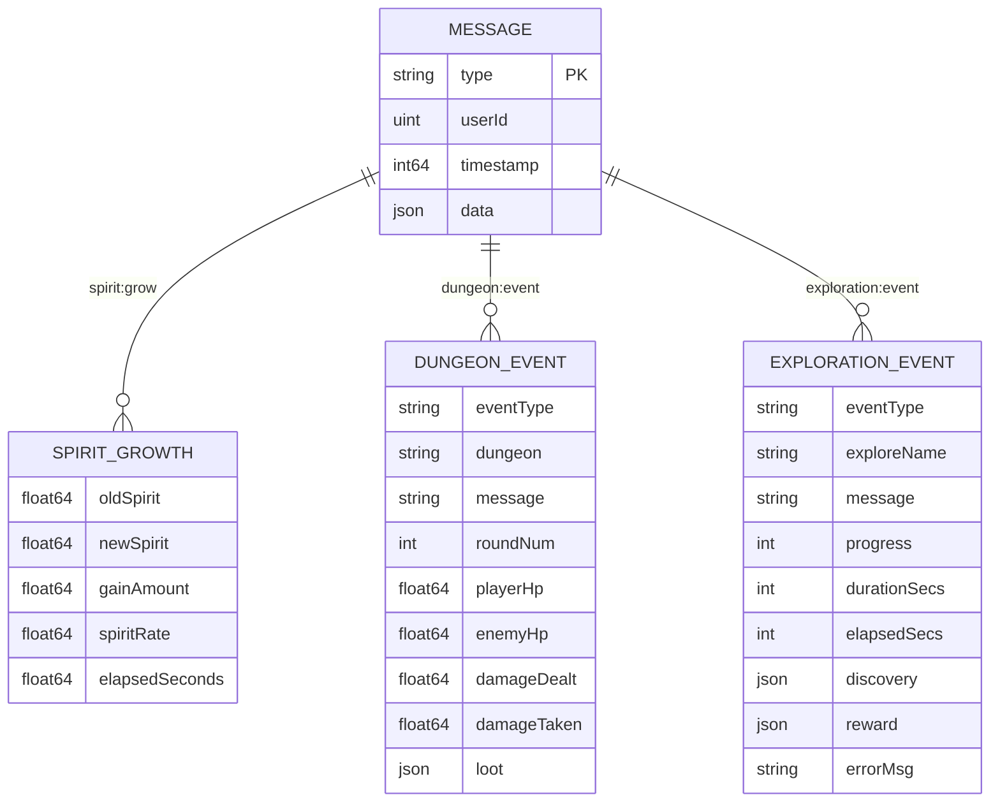
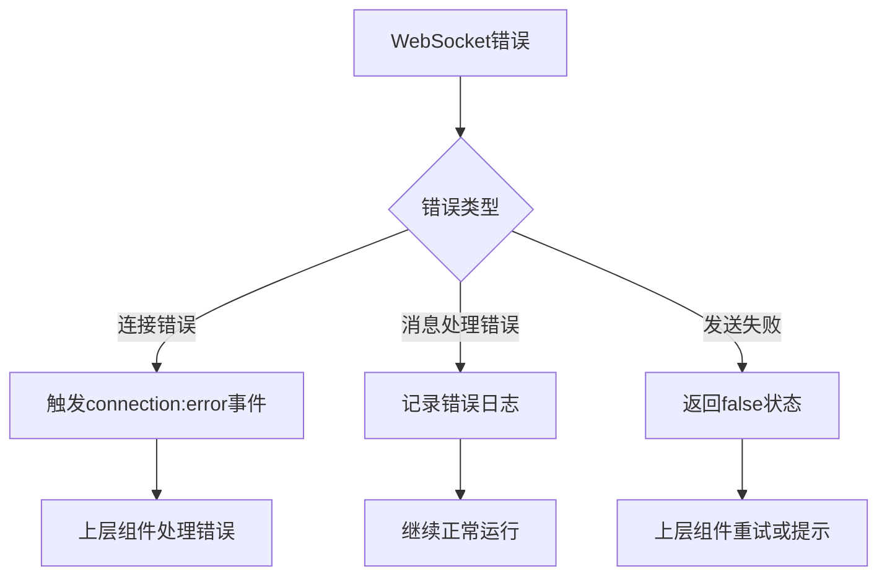
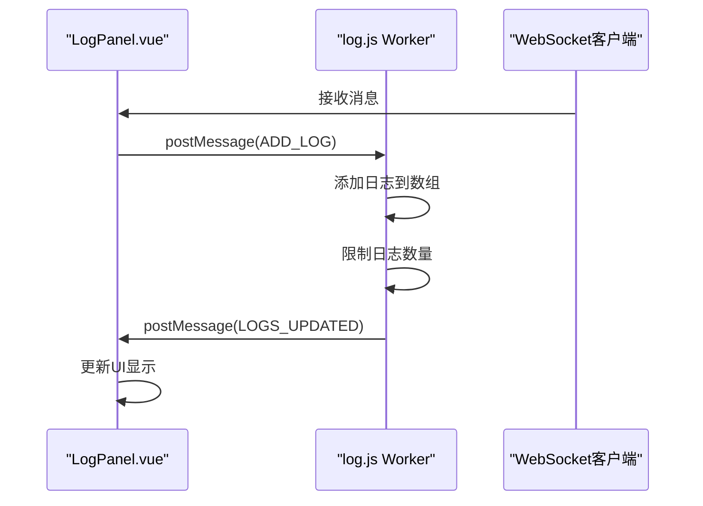
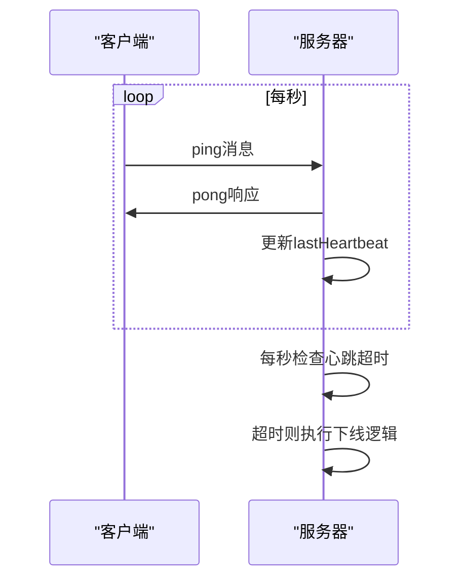
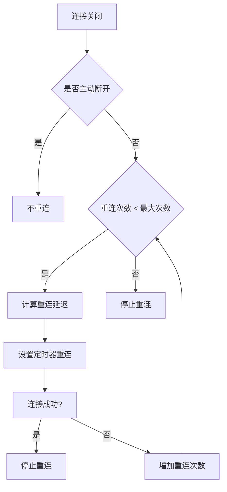

# WebSocket客户端集成

<cite>
**本文档引用文件**  
- [useWebSocket.js](file://src/composables/useWebSocket.js)
- [websocket.js](file://src/services/websocket.js)
- [playerInfo.js](file://src/stores/playerInfo.js)
- [LogPanel.vue](file://src/components/LogPanel.vue)
- [Cultivation.vue](file://src/views/Cultivation.vue)
- [Exploration.vue](file://src/views/Exploration.vue)
- [handler.go](file://server-go/internal/websocket/handler.go)
- [manager.go](file://server-go/internal/websocket/manager.go)
- [spirit_handler.go](file://server-go/internal/websocket/spirit_handler.go)
- [dungeon_handler.go](file://server-go/internal/websocket/dungeon_handler.go)
- [exploration_handler.go](file://server-go/internal/websocket/exploration_handler.go)
</cite>

## 目录
1. [引言](#引言)
2. [WebSocket连接管理](#websocket连接管理)
3. [消息处理与事件订阅](#消息处理与事件订阅)
4. [与Pinia状态管理器的集成](#与pinia状态管理器的集成)
5. [消息序列化格式](#消息序列化格式)
6. [错误处理机制](#错误处理机制)
7. [实际组件集成示例](#实际组件集成示例)
8. [心跳与连接保活](#心跳与连接保活)
9. [重连机制](#重连机制)
10. [总结](#总结)

## 引言
本项目通过WebSocket实现实时通信，为修仙游戏提供灵力增长、战斗事件、探索进度等实时更新功能。前端通过`useWebSocket.js`组合式函数封装WebSocket连接的创建、重连、消息监听与发送，与Pinia状态管理器（如`playerInfo.js`）集成，将实时消息自动更新到全局状态并触发UI响应。本文档详细说明WebSocket客户端的实现机制。

## WebSocket连接管理
前端WebSocket连接由`useWebSocket.js`组合式函数管理，该函数封装了连接的创建、状态监控和断开逻辑。连接通过`wsManager.connect()`方法建立，需要提供用户认证token和用户ID。

**Diagram sources**  
- [useWebSocket.js](file://src/composables/useWebSocket.js#L21-L32)
- [websocket.js](file://src/services/websocket.js#L36-L67)

**Section sources**  
- [useWebSocket.js](file://src/composables/useWebSocket.js#L10-L135)
- [websocket.js](file://src/services/websocket.js#L4-L267)

## 消息处理与事件订阅
WebSocket客户端支持多种事件类型的订阅，包括灵力增长、战斗事件、排行榜更新和探索事件。消息处理采用发布-订阅模式，通过`wsManager.on()`方法注册事件监听器。

**Diagram sources**  
- [websocket.js](file://src/services/websocket.js#L15-L252)
- [useWebSocket.js](file://src/composables/useWebSocket.js#L38-L73)

**Section sources**  
- [websocket.js](file://src/services/websocket.js#L102-L127)
- [useWebSocket.js](file://src/composables/useWebSocket.js#L38-L73)

## 与Pinia状态管理器的集成
WebSocket客户端与Pinia状态管理器深度集成，通过订阅实时消息自动更新全局状态。以`playerInfo.js`为例，灵力增长事件会自动更新玩家的灵力值。

**Diagram sources**  
- [useWebSocket.js](file://src/composables/useWebSocket.js#L38-L42)
- [playerInfo.js](file://src/stores/playerInfo.js#L16-L17)

**Section sources**  
- [useWebSocket.js](file://src/composables/useWebSocket.js#L146-L158)
- [playerInfo.js](file://src/stores/playerInfo.js#L6-L65)

## 消息序列化格式
WebSocket消息采用JSON格式进行序列化，包含消息类型、用户ID、时间戳和具体数据。后端定义了多种消息类型，每种类型有特定的数据结构。

**Diagram sources**  
- [manager.go](file://server-go/internal/websocket/manager.go#L41-L47)
- [spirit_handler.go](file://server-go/internal/websocket/spirit_handler.go#L18-L26)
- [dungeon_handler.go](file://server-go/internal/websocket/dungeon_handler.go#L10-L21)
- [exploration_handler.go](file://server-go/internal/websocket/exploration_handler.go#L10-L21)

**Section sources**  
- [manager.go](file://server-go/internal/websocket/manager.go#L41-L47)
- [spirit_handler.go](file://server-go/internal/websocket/spirit_handler.go#L18-L26)

## 错误处理机制
WebSocket客户端实现了完善的错误处理机制，包括连接失败、消息处理异常和网络中断等情况。错误通过事件系统通知上层组件。

**Diagram sources**  
- [websocket.js](file://src/services/websocket.js#L73-L76)
- [websocket.js](file://src/services/websocket.js#L121-L123)
- [websocket.js](file://src/services/websocket.js#L168-L171)

**Section sources**  
- [websocket.js](file://src/services/websocket.js#L73-L76)
- [websocket.js](file://src/services/websocket.js#L121-L123)

## 实际组件集成示例
`LogPanel.vue`组件展示了如何订阅特定事件类型并渲染实时日志。该组件使用Web Worker处理日志，避免阻塞主线程。

**Diagram sources**  
- [LogPanel.vue](file://src/components/LogPanel.vue#L47-L62)
- [log.js](file://src/workers/log.js#L7-L21)

**Section sources**  
- [LogPanel.vue](file://src/components/LogPanel.vue#L25-L104)
- [log.js](file://src/workers/log.js#L1-L56)

## 心跳与连接保活
WebSocket客户端实现了心跳机制，每秒向服务器发送心跳包，确保连接活跃。服务器端会检查心跳超时，自动下线长时间无响应的客户端。

**Diagram sources**  
- [websocket.js](file://src/services/websocket.js#L177-L190)
- [manager.go](file://server-go/internal/websocket/manager.go#L196-L212)
- [manager.go](file://server-go/internal/websocket/manager.go#L241-L250)

**Section sources**  
- [websocket.js](file://src/services/websocket.js#L177-L205)
- [manager.go](file://server-go/internal/websocket/manager.go#L196-L212)

## 重连机制
当WebSocket连接意外断开时，客户端会自动尝试重连，最多尝试5次，每次重试间隔逐渐增加。主动断开不会触发自动重连。

**Diagram sources**  
- [websocket.js](file://src/services/websocket.js#L84-L87)
- [websocket.js](file://src/services/websocket.js#L210-L223)

**Section sources**  
- [websocket.js](file://src/services/websocket.js#L84-L87)
- [websocket.js](file://src/services/websocket.js#L210-L223)

## 总结
本项目的WebSocket客户端实现了一个健壮的实时通信系统，通过组合式函数封装了连接管理、消息处理和状态更新。与Pinia状态管理器的深度集成确保了实时数据能够自动更新到全局状态，触发UI响应。心跳和重连机制保证了连接的稳定性，错误处理机制提高了系统的可靠性。通过Web Worker处理日志等耗时操作，避免了主线程阻塞，提升了用户体验。