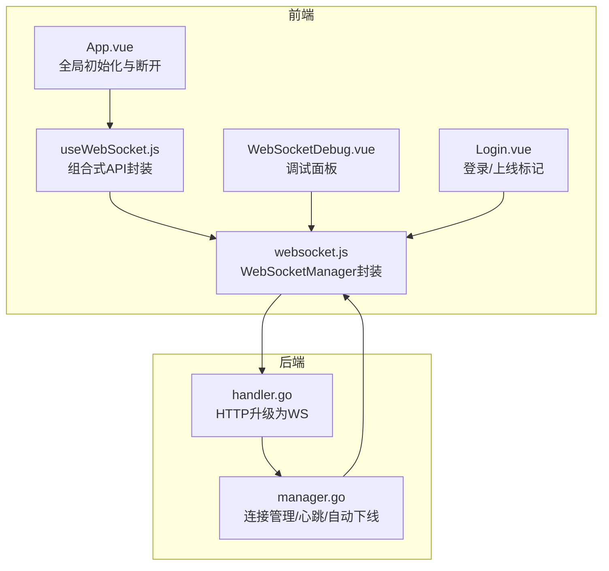
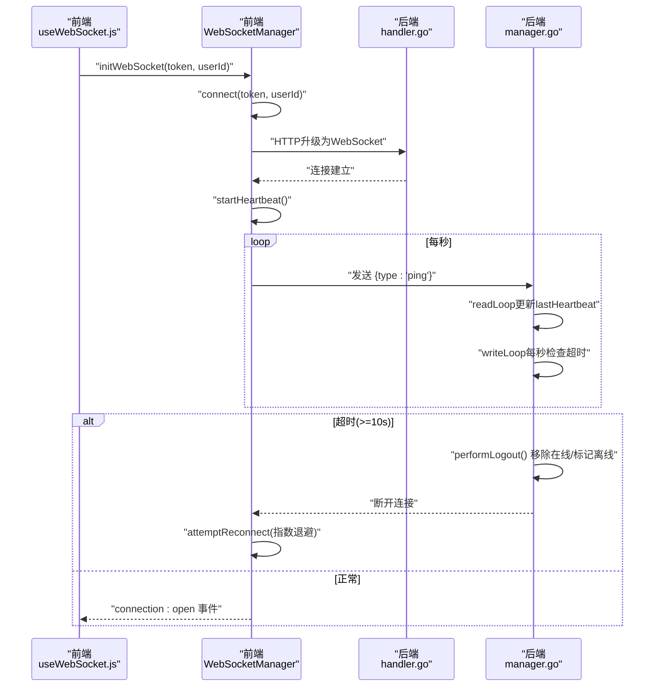
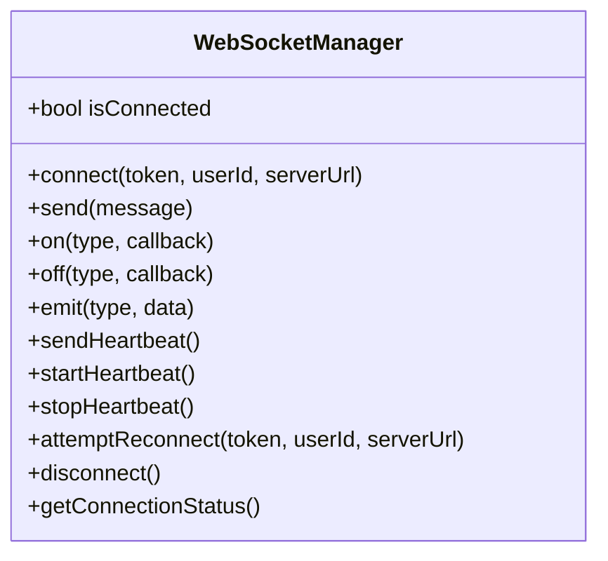
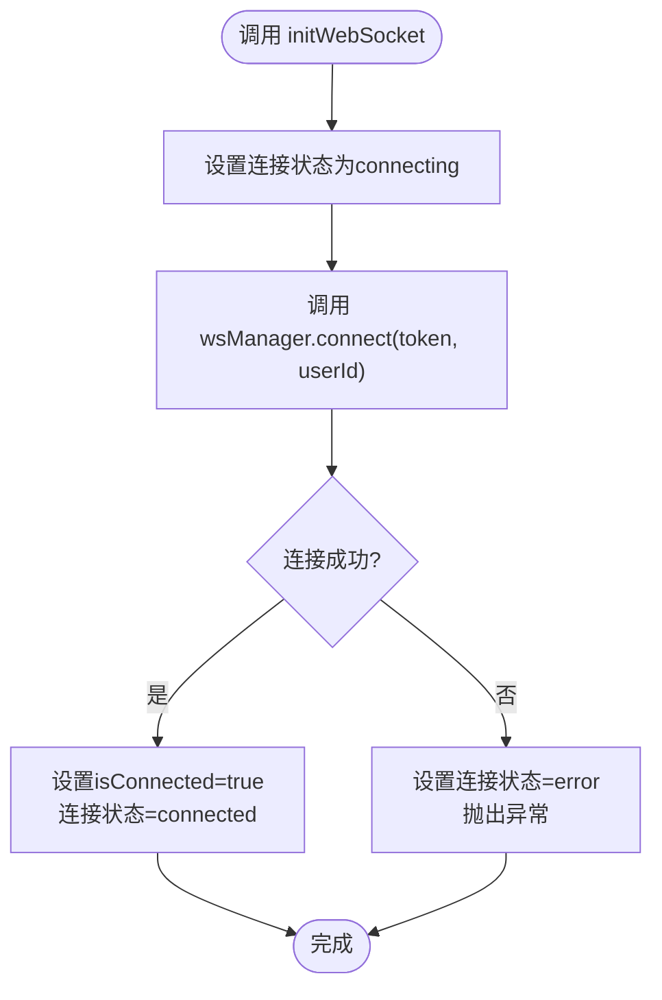
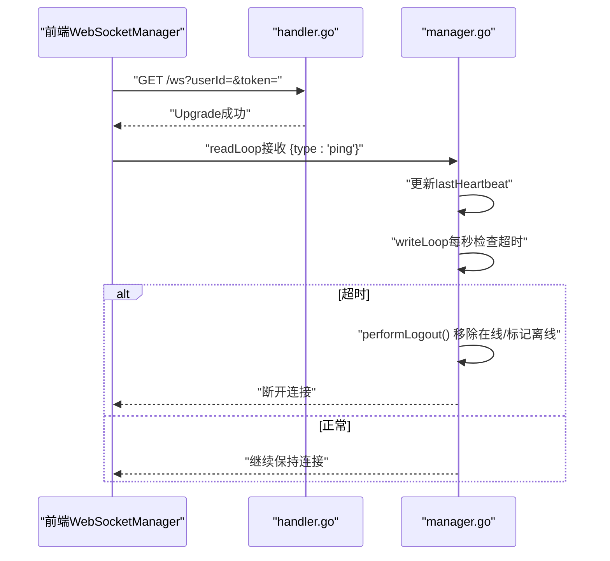
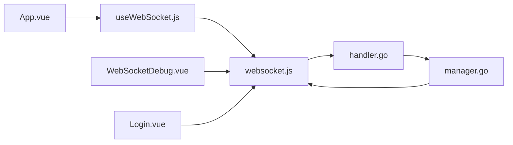

# WebSocket连接管理

<cite>
**本文引用的文件**
- [src/composables/useWebSocket.js](file://src/composables/useWebSocket.js)
- [src/services/websocket.js](file://src/services/websocket.js)
- [src/components/WebSocketDebug.vue](file://src/components/WebSocketDebug.vue)
- [src/views/Login.vue](file://src/views/Login.vue)
- [src/App.vue](file://src/App.vue)
- [server-go/internal/websocket/manager.go](file://server-go/internal/websocket/manager.go)
- [server-go/internal/websocket/handler.go](file://server-go/internal/websocket/handler.go)
- [HEARTBEAT_AND_LOGOUT_GUIDE.md](file://HEARTBEAT_AND_LOGOUT_GUIDE.md)
- [WebSocket改造完整实现指南.md](file://WebSocket改造完整实现指南.md)
- [test-heartbeat-timeout.js](file://test-heartbeat-timeout.js)
- [diagnose-online-status.js](file://diagnose-online-status.js)
</cite>

## 目录
1. [引言](#引言)
2. [项目结构](#项目结构)
3. [核心组件](#核心组件)
4. [架构总览](#架构总览)
5. [详细组件分析](#详细组件分析)
6. [依赖关系分析](#依赖关系分析)
7. [性能考量](#性能考量)
8. [故障排查指南](#故障排查指南)
9. [结论](#结论)
10. [附录](#附录)

## 引言
本文件系统性文档化前端WebSocket连接的初始化、心跳机制与自动重连策略，解释如何通过WebSocketService封装原生WebSocket，实现连接状态监听、断线重试（带指数退避）、心跳包发送（ping/pong）以维持长连接。同时说明环境配置（开发/生产模式下的连接地址）如何通过Vite注入，并结合心跳与自动下线设计规范，确保用户在线状态准确。文末提供连接异常（如4401鉴权失败、网络中断）的捕获与处理示例。

## 项目结构
前端采用Vue 3组合式API与自研WebSocket管理器，后端基于Gin + Gorilla WebSocket，配合心跳超时与自动下线逻辑，形成闭环的在线状态管理。

图表来源
- [src/composables/useWebSocket.js](file://src/composables/useWebSocket.js#L1-L136)
- [src/services/websocket.js](file://src/services/websocket.js#L1-L264)
- [src/components/WebSocketDebug.vue](file://src/components/WebSocketDebug.vue#L1-L149)
- [src/views/Login.vue](file://src/views/Login.vue#L1-L96)
- [src/App.vue](file://src/App.vue#L392-L425)
- [server-go/internal/websocket/handler.go](file://server-go/internal/websocket/handler.go#L37-L73)
- [server-go/internal/websocket/manager.go](file://server-go/internal/websocket/manager.go#L107-L178)

章节来源
- [src/composables/useWebSocket.js](file://src/composables/useWebSocket.js#L1-L136)
- [src/services/websocket.js](file://src/services/websocket.js#L1-L264)
- [server-go/internal/websocket/handler.go](file://server-go/internal/websocket/handler.go#L37-L73)
- [server-go/internal/websocket/manager.go](file://server-go/internal/websocket/manager.go#L107-L178)

## 核心组件
- WebSocketManager：封装原生WebSocket，负责连接、消息分发、心跳、断线重连、事件派发。
- useWebSocket：对WebSocketManager进行组合式封装，提供连接状态、订阅事件、断开连接等能力。
- 调试组件：WebSocketDebug.vue用于手动连接/断开、观察消息与统计。
- 登录与上线：Login.vue在登录成功后标记玩家上线，随后由App.vue初始化WebSocket。
- 后端连接管理：handler.go负责HTTP升级为WebSocket；manager.go负责心跳检测与自动下线。

章节来源
- [src/services/websocket.js](file://src/services/websocket.js#L1-L264)
- [src/composables/useWebSocket.js](file://src/composables/useWebSocket.js#L1-L136)
- [src/components/WebSocketDebug.vue](file://src/components/WebSocketDebug.vue#L1-L149)
- [src/views/Login.vue](file://src/views/Login.vue#L1-L96)
- [src/App.vue](file://src/App.vue#L392-L425)
- [server-go/internal/websocket/handler.go](file://server-go/internal/websocket/handler.go#L37-L73)
- [server-go/internal/websocket/manager.go](file://server-go/internal/websocket/manager.go#L107-L178)

## 架构总览
前端通过WebSocketManager建立与后端的长连接，建立连接后启动心跳；后端在readLoop中接收ping并更新心跳时间，在writeLoop中按1秒周期检查是否超时（默认10秒），超时则执行自动下线逻辑，移除Redis中的在线玩家并标记离线。

图表来源
- [src/composables/useWebSocket.js](file://src/composables/useWebSocket.js#L1-L136)
- [src/services/websocket.js](file://src/services/websocket.js#L30-L120)
- [server-go/internal/websocket/handler.go](file://server-go/internal/websocket/handler.go#L37-L73)
- [server-go/internal/websocket/manager.go](file://server-go/internal/websocket/manager.go#L170-L256)
- [HEARTBEAT_AND_LOGOUT_GUIDE.md](file://HEARTBEAT_AND_LOGOUT_GUIDE.md#L1-L120)

章节来源
- [src/composables/useWebSocket.js](file://src/composables/useWebSocket.js#L1-L136)
- [src/services/websocket.js](file://src/services/websocket.js#L30-L120)
- [server-go/internal/websocket/handler.go](file://server-go/internal/websocket/handler.go#L37-L73)
- [server-go/internal/websocket/manager.go](file://server-go/internal/websocket/manager.go#L170-L256)
- [HEARTBEAT_AND_LOGOUT_GUIDE.md](file://HEARTBEAT_AND_LOGOUT_GUIDE.md#L1-L120)

## 详细组件分析

### WebSocketManager（前端）
- 连接初始化：根据当前协议选择ws/wss，使用hostname与固定端口3000拼接URL，附加userId与token查询参数；连接成功后重置重连计数、启动心跳、派发connection:open事件。
- 消息处理：handleMessage解析消息并按type分发至对应监听器；支持on/off订阅与取消。
- 心跳机制：每秒发送一次ping；断开时停止心跳。
- 断线重连：最多尝试N次，每次延迟乘以递增倍数（指数退避）；仅当非主动断开时触发重连。
- 断开连接：标记isIntentionallyClosed，停止心跳并关闭底层WebSocket。

图表来源
- [src/services/websocket.js](file://src/services/websocket.js#L1-L264)

章节来源
- [src/services/websocket.js](file://src/services/websocket.js#L30-L238)

### useWebSocket（前端）
- 提供initWebSocket、watchConnectionStatus、subscribe系列、disconnect、getStatus等能力。
- 通过wsManager暴露的事件与订阅接口，将连接状态与业务事件（灵力增长、战斗、排行榜、探索）解耦。

图表来源
- [src/composables/useWebSocket.js](file://src/composables/useWebSocket.js#L18-L33)
- [src/services/websocket.js](file://src/services/websocket.js#L36-L97)

章节来源
- [src/composables/useWebSocket.js](file://src/composables/useWebSocket.js#L1-L136)
- [src/services/websocket.js](file://src/services/websocket.js#L36-L97)

### 后端连接管理（Golang）
- handler.go：从查询参数提取userId与token，升级HTTP为WebSocket并注册客户端。
- manager.go：ClientConnection维护lastHeartbeat与heartbeatTimeout；readLoop处理ping并更新Redis中的心跳时间；writeLoop每秒检查超时，超时后performLogout，移除在线集合、标记离线并记录日志。

图表来源
- [server-go/internal/websocket/handler.go](file://server-go/internal/websocket/handler.go#L37-L73)
- [server-go/internal/websocket/manager.go](file://server-go/internal/websocket/manager.go#L170-L256)

章节来源
- [server-go/internal/websocket/handler.go](file://server-go/internal/websocket/handler.go#L37-L73)
- [server-go/internal/websocket/manager.go](file://server-go/internal/websocket/manager.go#L170-L256)

### 心跳与自动下线设计规范
- 前端每秒发送一次ping；后端10秒未收到心跳则自动下线。
- 自动下线会移除Redis在线集合中的玩家ID，并标记状态为offline，同时记录日志。
- 前端在onclose事件触发后，若非主动断开，将按指数退避进行重连。

章节来源
- [HEARTBEAT_AND_LOGOUT_GUIDE.md](file://HEARTBEAT_AND_LOGOUT_GUIDE.md#L1-L120)
- [server-go/internal/websocket/manager.go](file://server-go/internal/websocket/manager.go#L222-L309)
- [src/services/websocket.js](file://src/services/websocket.js#L174-L238)

### 环境配置与连接地址
- 前端通过window.location构造WebSocket地址，协议根据当前页面协议选择ws/wss，主机名使用hostname，端口固定为3000，附加userId与token查询参数。
- Vite开发服务器默认端口可通过环境变量配置，但WebSocket目标指向后端3000端口，代理规则在后端。

章节来源
- [src/services/websocket.js](file://src/services/websocket.js#L45-L58)
- [vite.config.js](file://vite.config.js#L95-L103)

### 使用示例与最佳实践
- 登录成功后在App.vue中初始化WebSocket，订阅各类事件并在卸载时断开连接。
- 使用WebSocketDebug.vue进行手动连接/断开与消息观察。
- 通过Login.vue在登录后调用上线接口，确保后端在线状态与前端心跳一致。

章节来源
- [src/App.vue](file://src/App.vue#L392-L425)
- [src/components/WebSocketDebug.vue](file://src/components/WebSocketDebug.vue#L1-L149)
- [src/views/Login.vue](file://src/views/Login.vue#L1-L96)

## 依赖关系分析
- 前端依赖：useWebSocket依赖wsManager；wsManager依赖原生WebSocket与事件分发；调试组件依赖wsManager；登录/应用层依赖useWebSocket。
- 后端依赖：handler.go依赖gorilla/websocket与ConnectionManager；manager.go依赖Redis与数据库，实现心跳与自动下线。

图表来源
- [src/composables/useWebSocket.js](file://src/composables/useWebSocket.js#L1-L136)
- [src/services/websocket.js](file://src/services/websocket.js#L1-L264)
- [src/components/WebSocketDebug.vue](file://src/components/WebSocketDebug.vue#L1-L149)
- [src/views/Login.vue](file://src/views/Login.vue#L1-L96)
- [src/App.vue](file://src/App.vue#L392-L425)
- [server-go/internal/websocket/handler.go](file://server-go/internal/websocket/handler.go#L37-L73)
- [server-go/internal/websocket/manager.go](file://server-go/internal/websocket/manager.go#L107-L178)

章节来源
- [src/composables/useWebSocket.js](file://src/composables/useWebSocket.js#L1-L136)
- [src/services/websocket.js](file://src/services/websocket.js#L1-L264)
- [server-go/internal/websocket/handler.go](file://server-go/internal/websocket/handler.go#L37-L73)
- [server-go/internal/websocket/manager.go](file://server-go/internal/websocket/manager.go#L107-L178)

## 性能考量
- 心跳频率：前端每秒发送一次ping，后端每秒检查一次超时，平衡实时性与CPU消耗。
- 重连策略：指数退避降低后端压力，避免雪崩效应。
- 消息分发：按type分发，避免全量广播带来的资源浪费。
- 连接生命周期：主动断开时停止心跳与清理定时器，防止内存泄漏。

[本节为通用建议，不直接分析具体文件]

## 故障排查指南
- 4401鉴权失败
  - 现象：后端升级WebSocket时校验userId/token失败，返回错误。
  - 排查：确认登录流程已正确设置token与userId；检查handler.go中参数解析与校验逻辑。
  - 参考：[server-go/internal/websocket/handler.go](file://server-go/internal/websocket/handler.go#L37-L73)
- 网络中断
  - 现象：前端onclose触发，非主动断开时自动重连。
  - 排查：检查wsManager的attemptReconnect逻辑与指数退避参数；确认isIntentionallyClosed标记正确。
  - 参考：[src/services/websocket.js](file://src/services/websocket.js#L207-L238)
- 心跳超时自动下线
  - 现象：后端writeLoop检测到超时，performLogout移除在线并标记离线。
  - 排查：前端是否持续发送ping；后端readLoop是否更新lastHeartbeat；Redis键值是否正确。
  - 参考：[server-go/internal/websocket/manager.go](file://server-go/internal/websocket/manager.go#L170-L256)
- 在线状态不一致
  - 现象：前端显示在线，后端未在在线集合中。
  - 排查：使用诊断脚本检查/api/online/players与/api/online/player/:id；必要时手动标记上线。
  - 参考：[diagnose-online-status.js](file://diagnose-online-status.js#L1-L116)

章节来源
- [server-go/internal/websocket/handler.go](file://server-go/internal/websocket/handler.go#L37-L73)
- [src/services/websocket.js](file://src/services/websocket.js#L207-L238)
- [server-go/internal/websocket/manager.go](file://server-go/internal/websocket/manager.go#L170-L256)
- [diagnose-online-status.js](file://diagnose-online-status.js#L1-L116)

## 结论
本方案通过前端WebSocketManager与后端ConnectionManager的协作，实现了稳定的长连接、可靠的心跳与自动重连机制，并以心跳超时驱动的自动下线保障在线状态一致性。前端通过useWebSocket与调试组件提供清晰的接入与观测路径，后端通过Redis与数据库协同确保状态持久化与可诊断性。

[本节为总结，不直接分析具体文件]

## 附录
- 快速开始与集成要点可参考完整实现指南中的“Step 2：在主应用中初始化WebSocket”与调试面板启用说明。
- 心跳与自动下线的详细流程与参数可在设计规范文档中查阅。

章节来源
- [WebSocket改造完整实现指南.md](file://WebSocket改造完整实现指南.md#L111-L163)
- [WebSocket改造完整实现指南.md](file://WebSocket改造完整实现指南.md#L503-L527)
- [HEARTBEAT_AND_LOGOUT_GUIDE.md](file://HEARTBEAT_AND_LOGOUT_GUIDE.md#L1-L120)