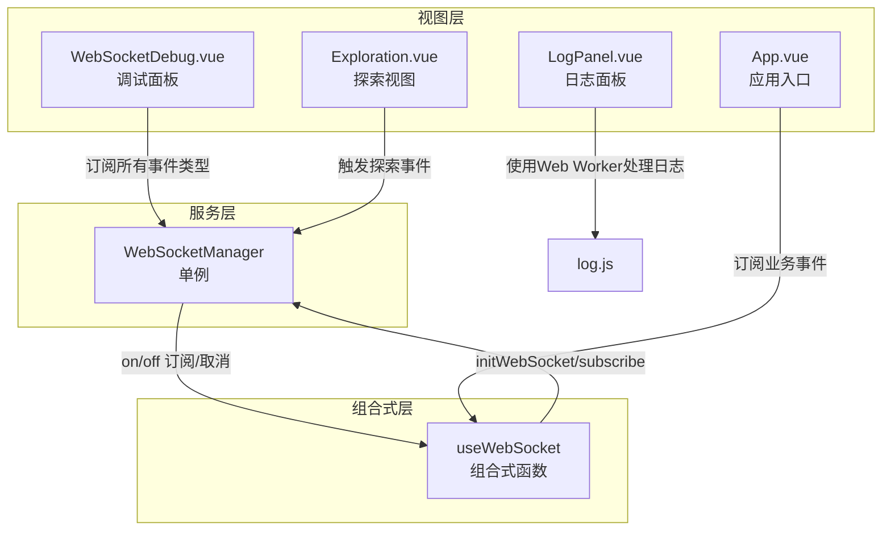
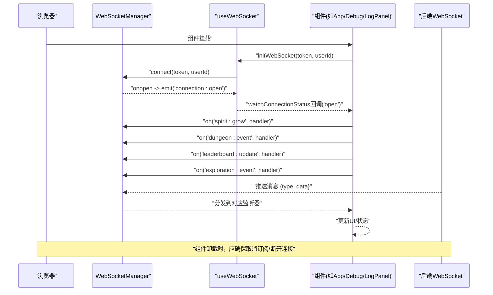
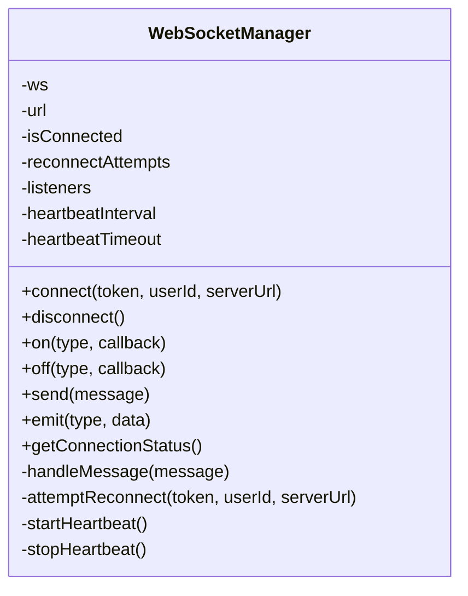
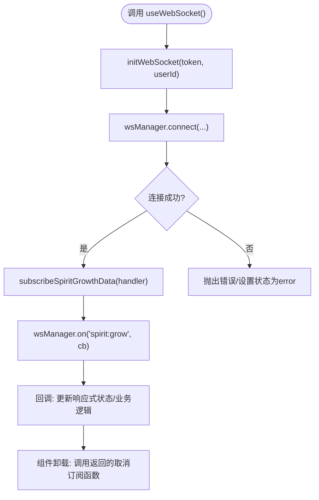
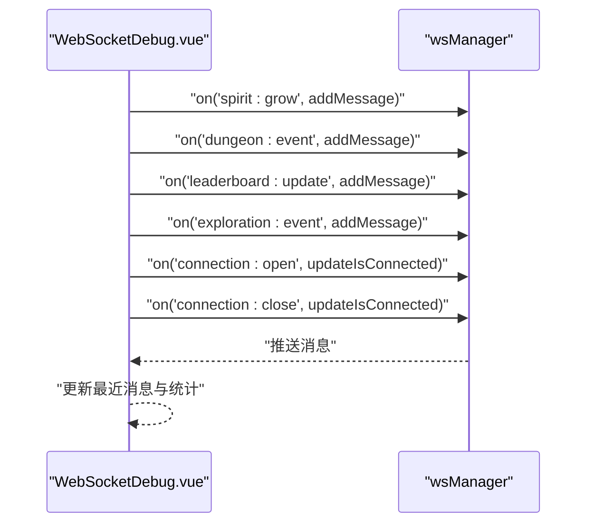
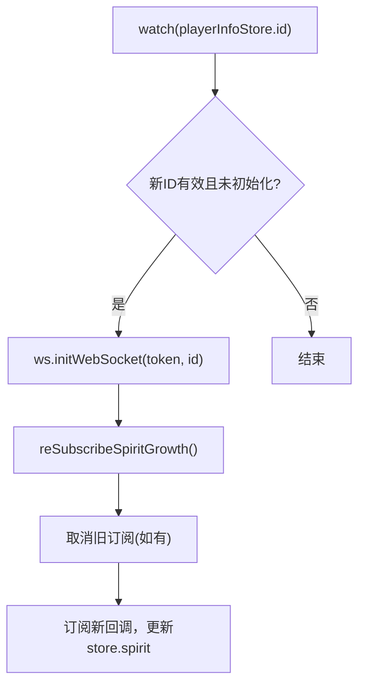
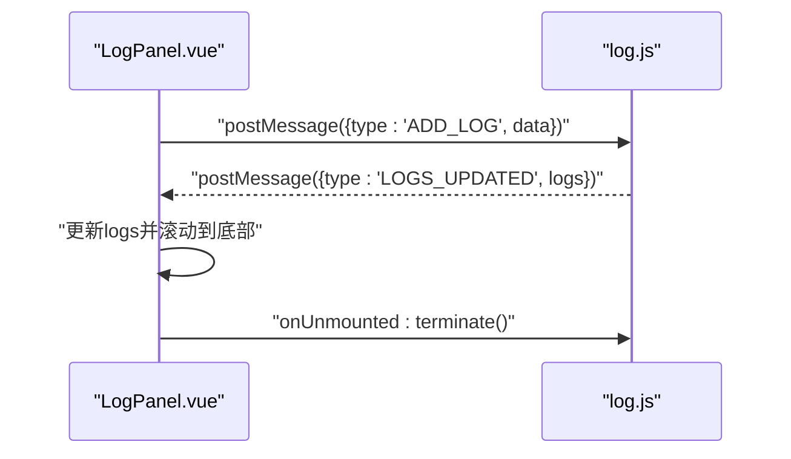
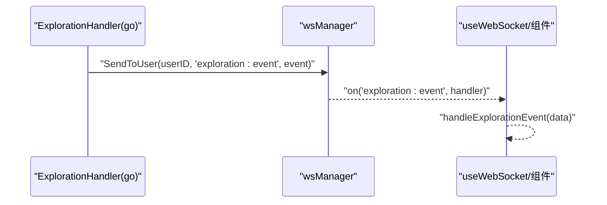
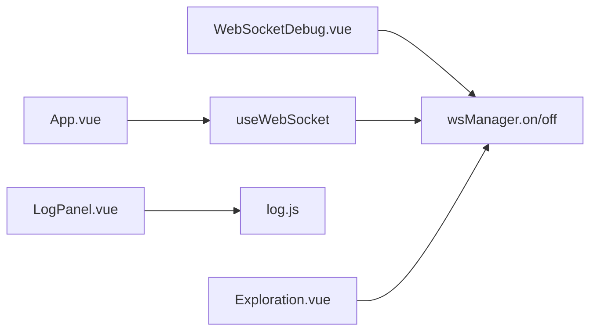

# 事件订阅与处理

<cite>
**本文引用的文件列表**
- [useWebSocket.js](file://src/composables/useWebSocket.js)
- [websocket.js](file://src/services/websocket.js)
- [WebSocketDebug.vue](file://src/components/WebSocketDebug.vue)
- [LogPanel.vue](file://src/components/LogPanel.vue)
- [log.js](file://src/workers/log.js)
- [App.vue](file://src/App.vue)
- [Exploration.vue](file://src/views/Exploration.vue)
- [exploration_handler.go](file://server-go/internal/websocket/exploration_handler.go)
</cite>

## 目录
1. [简介](#简介)
2. [项目结构](#项目结构)
3. [核心组件](#核心组件)
4. [架构总览](#架构总览)
5. [详细组件分析](#详细组件分析)
6. [依赖关系分析](#依赖关系分析)
7. [性能考量](#性能考量)
8. [故障排查指南](#故障排查指南)
9. [结论](#结论)

## 简介
本文件系统性地文档化前端事件系统的实现方式，重点说明如何通过组合式函数与服务层提供的 on()/off() 机制，让组件以“事件类型”为维度进行订阅与解耦。文档覆盖以下要点：
- 如何在组件挂载时注册监听器，接收实时日志并自动滚动；
- 如何在开发者工具中监听所有原始消息流用于调试；
- 事件解耦设计与内存泄漏防范（组件销毁时自动解绑）；
- 事件类型示例包括：'spirit:grow'（灵力增长）、'dungeon:event'（战斗事件）、'leaderboard:update'（排行榜更新）、'exploration:event'（探索事件）等。

## 项目结构
前端事件系统由三层协作构成：
- 服务层：WebSocketManager 单例负责连接、消息路由、心跳与事件分发；
- 组合式层：useWebSocket 提供统一的连接管理与事件订阅封装；
- 视图层：组件通过组合式函数订阅事件，并在生命周期内自动解绑。

图表来源
- [websocket.js](file://src/services/websocket.js#L1-L120)
- [useWebSocket.js](file://src/composables/useWebSocket.js#L1-L136)
- [WebSocketDebug.vue](file://src/components/WebSocketDebug.vue#L135-L149)
- [LogPanel.vue](file://src/components/LogPanel.vue#L47-L62)
- [log.js](file://src/workers/log.js#L1-L56)
- [App.vue](file://src/App.vue#L399-L480)
- [Exploration.vue](file://src/views/Exploration.vue#L42-L81)

章节来源
- [websocket.js](file://src/services/websocket.js#L1-L120)
- [useWebSocket.js](file://src/composables/useWebSocket.js#L1-L136)
- [WebSocketDebug.vue](file://src/components/WebSocketDebug.vue#L135-L149)
- [LogPanel.vue](file://src/components/LogPanel.vue#L47-L62)
- [log.js](file://src/workers/log.js#L1-L56)
- [App.vue](file://src/App.vue#L399-L480)
- [Exploration.vue](file://src/views/Exploration.vue#L42-L81)

## 核心组件
- WebSocketManager（服务层）
  - 提供 on(type, callback) 与 off(type, callback)，内部以事件类型为键维护回调数组；
  - 接收服务器消息后按 type 分发给对应监听器；
  - 管理连接状态、心跳、重连与主动断开。
- useWebSocket（组合式层）
  - 对外暴露 initWebSocket、subscribeXxxData、watchConnectionStatus、disconnect、getStatus 等；
  - 将底层事件类型映射为业务语义（如“灵力增长”、“探索事件”），并提供状态响应；
  - 返回响应式状态（如 isConnected、connectionStatus、各类事件数据）。
- WebSocketDebug（视图层）
  - 在挂载时订阅所有事件类型，展示最近消息与统计；
  - 提供连接/断开按钮，便于调试。
- LogPanel（视图层）
  - 使用 Web Worker 处理日志，主线程仅负责渲染与滚动；
  - 组件挂载时创建 Worker 并监听更新，卸载时终止 Worker，避免内存泄漏。

章节来源
- [websocket.js](file://src/services/websocket.js#L130-L155)
- [useWebSocket.js](file://src/composables/useWebSocket.js#L1-L136)
- [WebSocketDebug.vue](file://src/components/WebSocketDebug.vue#L135-L149)
- [LogPanel.vue](file://src/components/LogPanel.vue#L47-L62)

## 架构总览
下图展示了从前端到后端的事件流转路径，以及组件如何订阅事件类型。

图表来源
- [websocket.js](file://src/services/websocket.js#L45-L97)
- [websocket.js](file://src/services/websocket.js#L130-L155)
- [useWebSocket.js](file://src/composables/useWebSocket.js#L1-L136)
- [WebSocketDebug.vue](file://src/components/WebSocketDebug.vue#L135-L149)
- [App.vue](file://src/App.vue#L399-L480)

## 详细组件分析

### 事件系统核心：WebSocketManager 与 on()/off()
- on(type, callback)
  - 将回调追加到 listeners[type] 数组；
  - 返回一个取消订阅函数，调用该函数会从数组中移除对应回调。
- off(type, callback)
  - 从 listeners[type] 中过滤掉指定回调，实现精确解绑。
- handleMessage
  - 解析消息并按 type 调用所有监听器；
  - 对异常进行捕获，避免影响其他监听器。
- 连接与状态
  - connect/connect 时维护 isConnected、url、重连尝试次数；
  - onopen/onclose/onerror 时触发对应 connection:* 事件；
  - disconnect 标记 isIntentionallyClosed，避免自动重连。

图表来源
- [websocket.js](file://src/services/websocket.js#L1-L120)
- [websocket.js](file://src/services/websocket.js#L130-L155)
- [websocket.js](file://src/services/websocket.js#L225-L312)

章节来源
- [websocket.js](file://src/services/websocket.js#L1-L120)
- [websocket.js](file://src/services/websocket.js#L130-L155)
- [websocket.js](file://src/services/websocket.js#L225-L312)

### 组合式函数：useWebSocket 的订阅封装
- initWebSocket(token, userId)
  - 调用 wsManager.connect，设置连接状态与 isConnected。
- subscribeSpiritGrowthData/subscribeDungeonEventData/subscribeLeaderboardUpdateData/subscribeExplorationEventData
  - 通过 subscribeXxx 包装 wsManager.on('type', ...)，并将数据写入响应式状态；
  - 返回取消订阅函数，便于组件在卸载时调用。
- watchConnectionStatus(callback)
  - 订阅 connection:open/close/error，将状态同步到组件。
- disconnect/getStatus
  - 提供断开连接与获取状态的能力。

图表来源
- [useWebSocket.js](file://src/composables/useWebSocket.js#L1-L136)
- [websocket.js](file://src/services/websocket.js#L130-L155)

章节来源
- [useWebSocket.js](file://src/composables/useWebSocket.js#L1-L136)
- [websocket.js](file://src/services/websocket.js#L130-L155)

### 组件订阅示例：WebSocketDebug.vue
- 在 onMounted 中订阅所有事件类型（'spirit:grow'、'dungeon:event'、'leaderboard:update'、'exploration:event'），并将消息推入最近消息列表；
- 订阅 connection:open/close，更新连接状态标签；
- 通过按钮 connect/disconnect 控制连接生命周期。

图表来源
- [WebSocketDebug.vue](file://src/components/WebSocketDebug.vue#L135-L149)

章节来源
- [WebSocketDebug.vue](file://src/components/WebSocketDebug.vue#L135-L149)

### 组件订阅示例：App.vue（业务事件）
- 在 watch(playerInfoStore.id) 中检测登录态变化，首次登录时调用 ws.initWebSocket 并重新订阅事件；
- 重新订阅时先取消旧订阅，再绑定新订阅，避免重复绑定；
- onUnmounted 中断开连接，防止内存泄漏。

图表来源
- [App.vue](file://src/App.vue#L399-L480)

章节来源
- [App.vue](file://src/App.vue#L399-L480)

### 日志面板：LogPanel.vue 与 Web Worker
- 组件挂载时创建 Web Worker，监听 Worker 的 LOGS_UPDATED 消息，将日志数组更新到响应式变量；
- 使用 setTimeout 在下一帧滚动到底部，保证 DOM 更新后再滚动；
- onUnmounted 中终止 Worker，避免后台线程残留导致内存泄漏。

图表来源
- [LogPanel.vue](file://src/components/LogPanel.vue#L47-L62)
- [log.js](file://src/workers/log.js#L1-L56)

章节来源
- [LogPanel.vue](file://src/components/LogPanel.vue#L47-L62)
- [log.js](file://src/workers/log.js#L1-L56)

### 探索事件：后端到前端的事件链路
- 后端探索处理器根据探索阶段广播事件（如 start/progress/complete/failure），事件类型为 'exploration:event'；
- 前端组件通过 wsManager.on('exploration:event', handler) 订阅，useWebSocket 提供 subscribeExplorationEventData 包装；
- Exploration.vue 展示了前端对探索事件的消费与日志记录。

图表来源
- [exploration_handler.go](file://server-go/internal/websocket/exploration_handler.go#L43-L93)
- [websocket.js](file://src/services/websocket.js#L130-L155)
- [useWebSocket.js](file://src/composables/useWebSocket.js#L65-L73)
- [Exploration.vue](file://src/views/Exploration.vue#L42-L81)

章节来源
- [exploration_handler.go](file://server-go/internal/websocket/exploration_handler.go#L43-L93)
- [useWebSocket.js](file://src/composables/useWebSocket.js#L65-L73)
- [Exploration.vue](file://src/views/Exploration.vue#L42-L81)

## 依赖关系分析
- 组件对服务层的依赖
  - WebSocketDebug 与 App 直接依赖 wsManager.on/off；
  - useWebSocket 作为中间层，封装订阅与状态，降低组件对底层细节的耦合。
- 组件生命周期与内存泄漏防范
  - onMounted 订阅，onUnmounted 取消订阅或断开连接；
  - App 中在 watch 变更时先取消旧订阅再绑定新订阅，避免重复绑定；
  - LogPanel 在卸载时终止 Worker，避免后台线程泄漏。

图表来源
- [WebSocketDebug.vue](file://src/components/WebSocketDebug.vue#L135-L149)
- [App.vue](file://src/App.vue#L399-L480)
- [useWebSocket.js](file://src/composables/useWebSocket.js#L1-L136)
- [websocket.js](file://src/services/websocket.js#L130-L155)
- [LogPanel.vue](file://src/components/LogPanel.vue#L47-L62)
- [log.js](file://src/workers/log.js#L1-L56)
- [Exploration.vue](file://src/views/Exploration.vue#L42-L81)

章节来源
- [WebSocketDebug.vue](file://src/components/WebSocketDebug.vue#L135-L149)
- [App.vue](file://src/App.vue#L399-L480)
- [useWebSocket.js](file://src/composables/useWebSocket.js#L1-L136)
- [websocket.js](file://src/services/websocket.js#L130-L155)
- [LogPanel.vue](file://src/components/LogPanel.vue#L47-L62)
- [log.js](file://src/workers/log.js#L1-L56)
- [Exploration.vue](file://src/views/Exploration.vue#L42-L81)

## 性能考量
- 事件分发与回调执行
  - 每类事件维护独立回调数组，分发时逐一执行，异常被捕获，避免影响其他监听器；
  - 建议在回调中尽量做轻量处理，复杂逻辑可委托至 Worker 或异步任务。
- 心跳与重连
  - 心跳每秒发送一次，避免频繁网络压力；
  - 自动重连采用指数退避策略，最多尝试固定次数，防止资源耗尽。
- UI 更新
  - LogPanel 使用 Web Worker 处理日志，减少主线程阻塞；
  - 使用响应式状态驱动渲染，避免不必要的全量更新。

[本节为通用性能建议，不直接分析具体文件]

## 故障排查指南
- 连接失败
  - 检查后端是否启动、URL 参数（userId/token）是否正确；
  - 查看 wsManager.isConnected 与 connection:open/close 事件是否触发。
- 无法接收消息
  - 确认已订阅对应事件类型；
  - 检查 handleMessage 是否被调用，是否存在异常吞掉错误。
- 内存泄漏
  - 确保组件卸载时调用取消订阅或断开连接；
  - App 中在 watch 变更时先取消旧订阅再绑定新订阅；
  - LogPanel 卸载时终止 Worker。
- 调试技巧
  - 使用 WebSocketDebug.vue 订阅所有事件类型，观察最近消息与统计；
  - 在浏览器控制台中打印 wsManager.listeners 与 connection 状态。

章节来源
- [websocket.js](file://src/services/websocket.js#L45-L97)
- [websocket.js](file://src/services/websocket.js#L130-L155)
- [WebSocketDebug.vue](file://src/components/WebSocketDebug.vue#L135-L149)
- [LogPanel.vue](file://src/components/LogPanel.vue#L47-L62)
- [App.vue](file://src/App.vue#L399-L480)

## 结论
前端事件系统通过 WebSocketManager 的 on()/off() 机制实现了高内聚、低耦合的事件分发模型。useWebSocket 将底层事件类型映射为业务语义，组件只需在生命周期内正确订阅与解绑，即可获得稳定的实时交互体验。配合 WebSocketDebug 与 LogPanel 的调试与日志处理能力，系统在开发与生产环境中均具备良好的可观测性与可维护性。