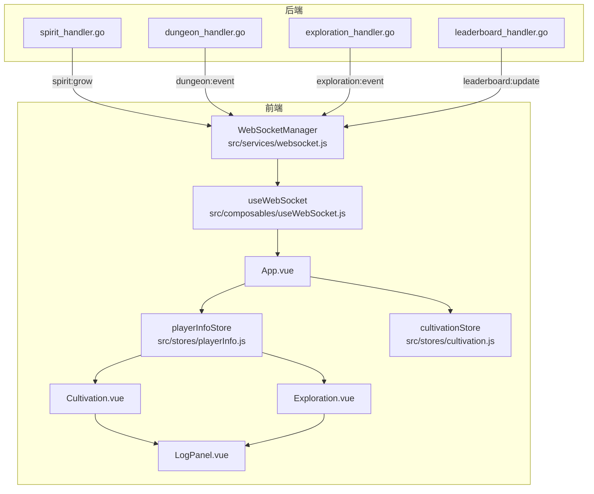
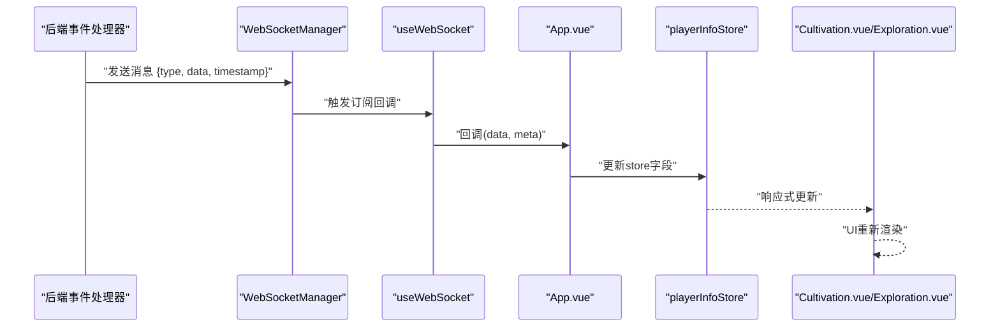
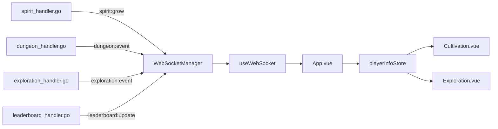

# 实时状态同步机制

<cite>
**本文引用的文件列表**
- [src/services/websocket.js](file://src/services/websocket.js)
- [src/composables/useWebSocket.js](file://src/composables/useWebSocket.js)
- [src/App.vue](file://src/App.vue)
- [src/stores/playerInfo.js](file://src/stores/playerInfo.js)
- [src/stores/cultivation.js](file://src/stores/cultivation.js)
- [src/views/Cultivation.vue](file://src/views/Cultivation.vue)
- [src/views/Exploration.vue](file://src/views/Exploration.vue)
- [src/components/LogPanel.vue](file://src/components/LogPanel.vue)
- [server-go/internal/websocket/spirit_handler.go](file://server-go/internal/websocket/spirit_handler.go)
- [server-go/internal/websocket/dungeon_handler.go](file://server-go/internal/websocket/dungeon_handler.go)
- [server-go/internal/websocket/exploration_handler.go](file://server-go/internal/websocket/exploration_handler.go)
- [server-go/internal/websocket/leaderboard_handler.go](file://server-go/internal/websocket/leaderboard_handler.go)
- [WebSocket实现完成总结.md](file://WebSocket实现完成总结.md)
- [WebSocket改造完整实现指南.md](file://WebSocket改造完整实现指南.md)
</cite>

## 目录
1. [引言](#引言)
2. [项目结构](#项目结构)
3. [核心组件](#核心组件)
4. [架构总览](#架构总览)
5. [详细组件分析](#详细组件分析)
6. [依赖关系分析](#依赖关系分析)
7. [性能考量](#性能考量)
8. [故障排查指南](#故障排查指南)
9. [结论](#结论)

## 引言
本文件聚焦于“WebSocket消息如何驱动前端状态更新”的主题，围绕以下目标展开：
- 描述服务端推送的实时事件（如修为增长、探索完成、灵宠孵化等）如何通过前端WebSocket通道到达并更新全局状态。
- 重点说明消息类型（event type）与前端store方法的映射机制，以及数据合并策略（如日志追加、数值累加）以避免状态错乱。
- 展示从服务端事件产生，到前端store响应式更新，再到UI组件自动渲染的完整链路。

## 项目结构
前端采用Vue 3 + Pinia架构，WebSocket采用事件驱动的发布-订阅模型：
- 服务层：WebSocket连接管理与消息分发（src/services/websocket.js）
- 组合式封装：连接、订阅、状态聚合（src/composables/useWebSocket.js）
- 应用入口：在登录态变化时初始化连接、订阅事件、更新store（src/App.vue）
- 全局状态：玩家信息与业务状态（src/stores/playerInfo.js、src/stores/cultivation.js）
- 视图组件：响应store变化并展示（src/views/Cultivation.vue、src/views/Exploration.vue）
- 日志组件：统一日志追加与滚动（src/components/LogPanel.vue）
- 后端事件：按消息类型广播（server-go/internal/websocket/*）

图表来源
- [src/services/websocket.js](file://src/services/websocket.js#L1-L120)
- [src/composables/useWebSocket.js](file://src/composables/useWebSocket.js#L1-L136)
- [src/App.vue](file://src/App.vue#L390-L508)
- [src/stores/playerInfo.js](file://src/stores/playerInfo.js#L1-L112)
- [src/stores/cultivation.js](file://src/stores/cultivation.js#L1-L52)
- [src/views/Cultivation.vue](file://src/views/Cultivation.vue#L1-L120)
- [src/views/Exploration.vue](file://src/views/Exploration.vue#L1-L120)
- [server-go/internal/websocket/spirit_handler.go](file://server-go/internal/websocket/spirit_handler.go#L97-L114)
- [server-go/internal/websocket/dungeon_handler.go](file://server-go/internal/websocket/dungeon_handler.go#L38-L57)
- [server-go/internal/websocket/exploration_handler.go](file://server-go/internal/websocket/exploration_handler.go#L38-L57)
- [server-go/internal/websocket/leaderboard_handler.go](file://server-go/internal/websocket/leaderboard_handler.go#L51-L68)

章节来源
- [src/services/websocket.js](file://src/services/websocket.js#L1-L120)
- [src/composables/useWebSocket.js](file://src/composables/useWebSocket.js#L1-L136)
- [src/App.vue](file://src/App.vue#L390-L508)
- [src/stores/playerInfo.js](file://src/stores/playerInfo.js#L1-L112)
- [src/stores/cultivation.js](file://src/stores/cultivation.js#L1-L52)
- [src/views/Cultivation.vue](file://src/views/Cultivation.vue#L1-L120)
- [src/views/Exploration.vue](file://src/views/Exploration.vue#L1-L120)
- [server-go/internal/websocket/spirit_handler.go](file://server-go/internal/websocket/spirit_handler.go#L97-L114)
- [server-go/internal/websocket/dungeon_handler.go](file://server-go/internal/websocket/dungeon_handler.go#L38-L57)
- [server-go/internal/websocket/exploration_handler.go](file://server-go/internal/websocket/exploration_handler.go#L38-L57)
- [server-go/internal/websocket/leaderboard_handler.go](file://server-go/internal/websocket/leaderboard_handler.go#L51-L68)

## 核心组件
- WebSocketManager：负责连接、心跳、消息分发与重连；提供事件订阅接口。
- useWebSocket：对WebSocketManager进行组合式封装，提供连接初始化、订阅回调、连接状态观察等能力。
- App.vue：在登录态变化时初始化WebSocket，订阅事件并将数据写入Pinia store。
- playerInfoStore：集中维护玩家基础属性与状态，供视图组件响应式消费。
- cultivationStore：提供修炼相关的动作（如修为累加、突破尝试），并与playerInfoStore协作。
- 视图组件：Cultivation.vue、Exploration.vue基于store状态渲染UI。
- 日志组件：LogPanel.vue统一管理日志追加与滚动。

章节来源
- [src/services/websocket.js](file://src/services/websocket.js#L1-L120)
- [src/composables/useWebSocket.js](file://src/composables/useWebSocket.js#L1-L136)
- [src/App.vue](file://src/App.vue#L390-L508)
- [src/stores/playerInfo.js](file://src/stores/playerInfo.js#L1-L112)
- [src/stores/cultivation.js](file://src/stores/cultivation.js#L1-L52)
- [src/views/Cultivation.vue](file://src/views/Cultivation.vue#L1-L120)
- [src/views/Exploration.vue](file://src/views/Exploration.vue#L1-L120)
- [src/components/LogPanel.vue](file://src/components/LogPanel.vue#L1-L132)

## 架构总览
WebSocket消息驱动前端状态更新的关键流程如下：
1. 后端根据业务事件构造消息（包含type、data、timestamp等），通过WebSocketManager广播给指定用户。
2. 前端WebSocketManager接收消息，按type分发到对应监听器。
3. useWebSocket将消息转发到App.vue的订阅回调，App.vue将数据写入playerInfoStore等store。
4. 视图组件基于store的响应式数据自动渲染，日志组件统一追加并滚动。

图表来源
- [src/services/websocket.js](file://src/services/websocket.js#L100-L128)
- [src/composables/useWebSocket.js](file://src/composables/useWebSocket.js#L35-L73)
- [src/App.vue](file://src/App.vue#L457-L480)
- [src/stores/playerInfo.js](file://src/stores/playerInfo.js#L1-L112)
- [src/views/Cultivation.vue](file://src/views/Cultivation.vue#L1-L120)
- [src/views/Exploration.vue](file://src/views/Exploration.vue#L1-L120)

## 详细组件分析

### WebSocket消息类型与订阅映射
- 灵力增长：type="spirit:grow"，后端通过spirit_handler.go广播，前端通过wsManager.on("spirit:grow")订阅。
- 战斗事件：type="dungeon:event"，后端通过dungeon_handler.go广播，前端通过wsManager.on("dungeon:event")订阅。
- 探索事件：type="exploration:event"，后端通过exploration_handler.go广播，前端通过wsManager.on("exploration:event")订阅。
- 排行榜更新：type="leaderboard:update"，后端通过leaderboard_handler.go广播，前端通过wsManager.on("leaderboard:update")订阅。

章节来源
- [src/services/websocket.js](file://src/services/websocket.js#L130-L155)
- [server-go/internal/websocket/spirit_handler.go](file://server-go/internal/websocket/spirit_handler.go#L97-L114)
- [server-go/internal/websocket/dungeon_handler.go](file://server-go/internal/websocket/dungeon_handler.go#L38-L57)
- [server-go/internal/websocket/exploration_handler.go](file://server-go/internal/websocket/exploration_handler.go#L38-L57)
- [server-go/internal/websocket/leaderboard_handler.go](file://server-go/internal/websocket/leaderboard_handler.go#L51-L68)

### 消息到store的映射与数据合并策略
- 灵力增长（spirit:grow）
  - 映射：App.vue在初始化后重新订阅灵力增长事件，直接将data.newSpirit与data.gainAmount写入playerInfoStore.spirit与spiritGainRate。
  - 合并策略：数值字段直接覆盖，避免累加导致的错乱；历史记录可由useSpiritGrowth聚合（非直接写入store）。
- 探索事件（exploration:event）
  - 映射：App.vue订阅后，根据eventType更新currentExploration与explorationProgress；同时useExploration内部维护探索日志数组，保留最近若干条记录。
  - 合并策略：日志数组采用“追加+截断”策略，避免无限增长；状态字段按事件类型直接覆盖。
- 战斗事件（dungeon:event）
  - 映射：App.vue订阅后，根据eventType更新combatState与currentDungeon；useDungeonCombat内部维护战斗日志数组，保留最近若干条记录。
  - 合并策略：日志数组采用“追加+截断”策略；状态字段按事件类型切换（如start/victory/defeat/combat_round）。
- 排行榜更新（leaderboard:update）
  - 映射：App.vue订阅后，根据type决定全量刷新或增量更新用户排名；useLeaderboard内部维护分类排行榜数据。
  - 合并策略：type为full_refresh时整包替换，type为update时仅更新用户排名，避免覆盖其他字段。

章节来源
- [src/App.vue](file://src/App.vue#L457-L480)
- [src/composables/useWebSocket.js](file://src/composables/useWebSocket.js#L141-L319)
- [src/stores/playerInfo.js](file://src/stores/playerInfo.js#L1-L112)

### 修炼与突破的store协作
- playerInfoStore：集中维护玩家基础属性（如level、realm、cultivation、maxCultivation、spirit等）。
- cultivationStore：提供cultivate与tryBreakthrough等动作，内部对数值进行安全转换与边界检查，并与playerInfoStore协作完成突破后的状态更新。
- 视图组件Cultivation.vue：从playerInfoStore读取属性，发起HTTP请求进行单次/一键修炼，成功后同步更新store并记录日志。

章节来源
- [src/stores/playerInfo.js](file://src/stores/playerInfo.js#L1-L112)
- [src/stores/cultivation.js](file://src/stores/cultivation.js#L1-L52)
- [src/views/Cultivation.vue](file://src/views/Cultivation.vue#L1-L200)

### 探索事件的UI联动
- Exploration.vue：通过API触发探索，后端返回事件列表；前端逐条触发事件并记录日志；事件结束后统计探索次数。
- useExploration：维护探索日志、当前探索名与进度，按eventType更新状态。
- LogPanel.vue：统一管理日志追加与滚动，避免UI卡顿。

章节来源
- [src/views/Exploration.vue](file://src/views/Exploration.vue#L1-L180)
- [src/composables/useWebSocket.js](file://src/composables/useWebSocket.js#L267-L319)
- [src/components/LogPanel.vue](file://src/components/LogPanel.vue#L1-L132)

### WebSocket连接与心跳
- WebSocketManager：负责连接、心跳（每秒ping）、错误与关闭事件、自动重连（最多5次，递增延迟）。
- App.vue：在登录态变化时初始化连接，启动心跳定时器（每3秒一次），并在卸载时断开连接与停止心跳。

章节来源
- [src/services/websocket.js](file://src/services/websocket.js#L1-L120)
- [src/App.vue](file://src/App.vue#L482-L508)

## 依赖关系分析
- 低耦合高内聚：WebSocketManager独立于业务store，仅负责消息分发；业务store通过App.vue的订阅回调更新状态。
- 松耦合事件映射：消息类型与订阅回调解耦，便于扩展新的事件类型。
- 数据流清晰：消息自下而上进入store，再由store驱动UI渲染，避免跨组件直接共享状态。

图表来源
- [server-go/internal/websocket/spirit_handler.go](file://server-go/internal/websocket/spirit_handler.go#L97-L114)
- [server-go/internal/websocket/dungeon_handler.go](file://server-go/internal/websocket/dungeon_handler.go#L38-L57)
- [server-go/internal/websocket/exploration_handler.go](file://server-go/internal/websocket/exploration_handler.go#L38-L57)
- [server-go/internal/websocket/leaderboard_handler.go](file://server-go/internal/websocket/leaderboard_handler.go#L51-L68)
- [src/services/websocket.js](file://src/services/websocket.js#L100-L128)
- [src/composables/useWebSocket.js](file://src/composables/useWebSocket.js#L1-L136)
- [src/App.vue](file://src/App.vue#L457-L480)
- [src/stores/playerInfo.js](file://src/stores/playerInfo.js#L1-L112)
- [src/views/Cultivation.vue](file://src/views/Cultivation.vue#L1-L120)
- [src/views/Exploration.vue](file://src/views/Exploration.vue#L1-L120)

## 性能考量
- 日志数组截断：useSpiritGrowth、useDungeonCombat、useExploration均限制历史记录数量，避免内存膨胀。
- 心跳与重连：WebSocketManager每秒发送心跳，关闭时停止心跳；自动重连采用递增延迟，降低后端压力。
- UI渲染优化：store字段直接覆盖适合高频数值更新；日志组件通过Web Worker与滚动优化减少主线程阻塞。

[本节为通用建议，无需列出具体文件来源]

## 故障排查指南
- 连接失败
  - 检查后端是否启动、URL是否正确、token与userId是否有效。
  - 查看浏览器控制台与后端日志，确认连接open/close/error事件。
- 无法接收消息
  - 确认wsManager.isConnected为true，确认已订阅对应事件类型。
  - 使用WebSocketDebug组件查看最近消息与统计。
- 状态错乱
  - 灵力增长应直接覆盖spirit与spiritGainRate，避免重复累加。
  - 探索/战斗日志采用追加+截断策略，避免无限增长。
  - 排行榜更新区分full_refresh与update，避免覆盖其他字段。

章节来源
- [src/services/websocket.js](file://src/services/websocket.js#L1-L120)
- [src/components/WebSocketDebug.vue](file://src/components/WebSocketDebug.vue#L1-L133)
- [WebSocket实现快速开始.md](file://WebSocket实现快速开始.md#L211-L268)

## 结论
该系统通过“消息类型→订阅回调→store更新→UI响应”的清晰链路，实现了服务端事件到前端状态的高效同步。消息类型与store方法的映射明确，数据合并策略（日志追加、状态覆盖、全量/增量更新）有效避免了状态错乱，配合心跳与重连机制保障了实时性与稳定性。后续可在现有基础上扩展更多事件类型与store动作，保持低耦合与高可维护性。