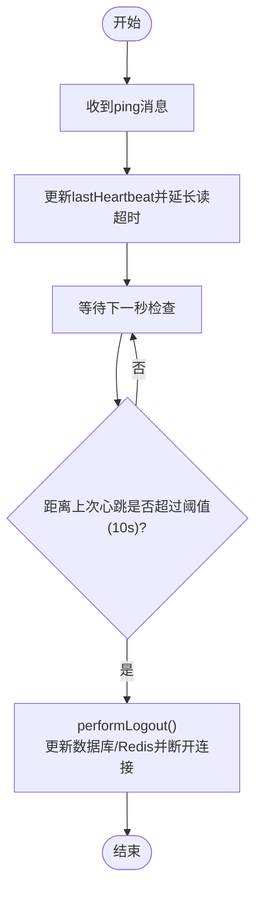

# WebSocket服务端实现

<cite>
**本文引用的文件**
- [manager.go](file://server-go/internal/websocket/manager.go)
- [router.go](file://server-go/internal/websocket/router.go)
- [handler.go](file://server-go/internal/websocket/handler.go)
- [spirit_handler.go](file://server-go/internal/websocket/spirit_handler.go)
- [dungeon_handler.go](file://server-go/internal/websocket/dungeon_handler.go)
- [exploration_handler.go](file://server-go/internal/websocket/exploration_handler.go)
- [leaderboard_handler.go](file://server-go/internal/websocket/leaderboard_handler.go)
- [HEARTBEAT_AND_LOGOUT_GUIDE.md](file://HEARTBEAT_AND_LOGOUT_GUIDE.md)
- [diagnose-online-status.js](file://diagnose-online-status.js)
- [websocket.js](file://src/services/websocket.js)
- [useWebSocket.js](file://src/composables/useWebSocket.js)
- [test-websocket.js](file://test-websocket.js)
</cite>

## 目录
1. [引言](#引言)
2. [项目结构](#项目结构)
3. [核心组件](#核心组件)
4. [架构总览](#架构总览)
5. [详细组件分析](#详细组件分析)
6. [依赖关系分析](#依赖关系分析)
7. [性能考量](#性能考量)
8. [故障排查指南](#故障排查指南)
9. [结论](#结论)
10. [附录](#附录)

## 引言
本文件面向WebSocket服务端的实现，聚焦以下目标：
- 深入文档化连接管理器的设计与实现，包括注册、广播、维护客户端连接池以及连接生命周期管理（连接建立、心跳检测、超时断开）。
- 解释消息路由机制，说明如何根据消息类型字段分发到不同处理器。
- 结合通用处理器基类设计，阐述通用消息解析、验证与响应封装逻辑。
- 重点描述心跳机制的实现方式（PING/PONG消息处理），参考会话超时策略，并说明与诊断脚本的协同工作方式。

## 项目结构
WebSocket相关代码位于后端 server-go 内部模块，前端通过 src/services/websocket.js 与后端交互；同时提供诊断脚本与测试脚本用于联调与排障。


图表来源
- [manager.go](file://server-go/internal/websocket/manager.go#L1-L309)
- [router.go](file://server-go/internal/websocket/router.go#L1-L36)
- [handler.go](file://server-go/internal/websocket/handler.go#L1-L100)
- [spirit_handler.go](file://server-go/internal/websocket/spirit_handler.go#L1-L122)
- [dungeon_handler.go](file://server-go/internal/websocket/dungeon_handler.go#L1-L144)
- [exploration_handler.go](file://server-go/internal/websocket/exploration_handler.go#L1-L149)
- [leaderboard_handler.go](file://server-go/internal/websocket/leaderboard_handler.go#L1-L137)
- [websocket.js](file://src/services/websocket.js#L1-L313)
- [useWebSocket.js](file://src/composables/useWebSocket.js#L1-L319)
- [diagnose-online-status.js](file://diagnose-online-status.js#L1-L116)
- [test-websocket.js](file://test-websocket.js#L1-L205)
- [HEARTBEAT_AND_LOGOUT_GUIDE.md](file://HEARTBEAT_AND_LOGOUT_GUIDE.md#L1-L252)

章节来源
- [manager.go](file://server-go/internal/websocket/manager.go#L1-L309)
- [router.go](file://server-go/internal/websocket/router.go#L1-L36)
- [handler.go](file://server-go/internal/websocket/handler.go#L1-L100)

## 核心组件
- 连接管理器：负责连接注册、注销、广播消息、在线人数统计、在线状态查询、心跳超时检测与自动下线。
- WebSocket处理器：负责HTTP升级为WebSocket、鉴权参数解析、连接注册、统计接口。
- 业务处理器：按领域划分的处理器，统一通过连接管理器向指定用户发送消息。
- 心跳与超时：前后端配合的心跳机制，后端基于时间阈值检测超时并执行自动下线。
- 诊断与测试：提供诊断脚本与测试脚本，便于联调与排障。

章节来源
- [manager.go](file://server-go/internal/websocket/manager.go#L1-L309)
- [handler.go](file://server-go/internal/websocket/handler.go#L1-L100)
- [router.go](file://server-go/internal/websocket/router.go#L1-L36)

## 架构总览
WebSocket服务端采用“连接管理器 + 业务处理器”的分层设计。HTTP路由将请求升级为WebSocket连接，随后由连接管理器统一管理生命周期与消息分发。


图表来源
- [router.go](file://server-go/internal/websocket/router.go#L1-L36)
- [handler.go](file://server-go/internal/websocket/handler.go#L1-L100)
- [manager.go](file://server-go/internal/websocket/manager.go#L1-L309)
- [spirit_handler.go](file://server-go/internal/websocket/spirit_handler.go#L1-L122)

## 详细组件分析

### 连接管理器(ConnectionManager)与客户端连接(ClientConnection)
- 设计要点
  - 使用map维护用户ID到连接对象的映射，支持并发安全的读写锁。
  - 通过三个通道实现解耦：注册、注销、广播。
  - 客户端连接包含发送队列、读写循环、心跳时间与超时阈值。
- 生命周期管理
  - 注册：创建ClientConnection并写入register通道，随后启动读写循环。
  - 注销：写入unregister通道，删除映射并关闭发送通道。
  - 广播：根据目标用户ID查找连接，非阻塞发送，队列满时记录警告。
- 心跳与超时
  - 读循环：识别ping消息，更新lastHeartbeat并延长读超时；同时更新Redis中的lastHeartbeat。
  - 写循环：每秒检查lastHeartbeat与超时阈值，超时则异步执行performLogout()并断开连接。
  - performLogout()：更新数据库最近灵力增长时间戳，清理Redis在线状态与集合，记录日志。

```mermaid
classDiagram
class ConnectionManager {
+clients : map[uint]*ClientConnection
+broadcast : chan *Message
+register : chan *ClientConnection
+unregister : chan *ClientConnection
+mu : RWMutex
+logger : Logger
+Start(ctx)
+RegisterClient(userID, username, conn) *ClientConnection
+UnregisterClient(client)
+SendToUser(userID, type, data) error
+GetOnlineCount() int
+IsUserOnline(userID) bool
}
class ClientConnection {
+UserID : uint
+Username : string
+conn : *websocket.Conn
+send : chan *Message
+done : chan struct{}
+manager : *ConnectionManager
+lastHeartbeat : time.Time
+heartbeatTimeout : time.Duration
+readLoop()
+writeLoop()
+performLogout()
}
class Message {
+Type : string
+UserID : uint
+Timestamp : int64
+Data : json.RawMessage
}
ConnectionManager --> ClientConnection : "管理"
ClientConnection --> ConnectionManager : "回调注销"
ConnectionManager --> Message : "广播/发送"
```

图表来源
- [manager.go](file://server-go/internal/websocket/manager.go#L1-L309)

章节来源
- [manager.go](file://server-go/internal/websocket/manager.go#L1-L309)

### WebSocket处理器(WebSocketHandler)与路由注册
- 升级流程
  - 从查询参数解析userId与token，校验失败返回错误。
  - 通过upgrader将HTTP连接升级为WebSocket。
  - 注册连接至连接管理器，记录日志。
- 路由注册
  - 提供/ws与/ws/stats两个端点，分别用于连接升级与在线统计。
- 统计接口
  - 返回当前在线人数与时间戳。


图表来源
- [router.go](file://server-go/internal/websocket/router.go#L1-L36)
- [handler.go](file://server-go/internal/websocket/handler.go#L1-L100)
- [manager.go](file://server-go/internal/websocket/manager.go#L1-L309)

章节来源
- [router.go](file://server-go/internal/websocket/router.go#L1-L36)
- [handler.go](file://server-go/internal/websocket/handler.go#L1-L100)

### 消息路由机制与通用封装
- 前端消息类型
  - 前端每秒发送ping消息，类型为“ping”，用于心跳保活。
  - 前端订阅多种业务消息类型：spirit:grow、dungeon:event、leaderboard:update、exploration:event。
- 后端消息封装
  - Message结构包含type、userId、timestamp、data字段，作为统一消息载体。
  - 业务处理器通过manager.SendToUser(userID, type, data)封装消息并发送。
- 分发策略
  - 读循环中识别“ping”消息并更新心跳；其他消息交由上层业务逻辑处理（当前仓库未展示上层路由逻辑，但消息载体与封装已完备）。

章节来源
- [manager.go](file://server-go/internal/websocket/manager.go#L1-L309)
- [spirit_handler.go](file://server-go/internal/websocket/spirit_handler.go#L1-L122)
- [dungeon_handler.go](file://server-go/internal/websocket/dungeon_handler.go#L1-L144)
- [exploration_handler.go](file://server-go/internal/websocket/exploration_handler.go#L1-L149)
- [leaderboard_handler.go](file://server-go/internal/websocket/leaderboard_handler.go#L1-L137)
- [websocket.js](file://src/services/websocket.js#L1-L313)

### 心跳机制与会话超时策略
- 前端心跳
  - 每秒发送一次ping消息，连接建立后启动心跳定时器，断开连接时停止。
- 后端心跳
  - 读循环：收到ping后更新lastHeartbeat并延长读超时。
  - 写循环：每秒检查lastHeartbeat与超时阈值（默认10秒），超时则执行performLogout()并断开连接。
- 自动下线逻辑
  - performLogout()：更新数据库最近灵力增长时间戳，清理Redis在线状态与集合，记录日志。
- 指南与配置
  - 参考心跳与下线指南，明确心跳间隔、超时阈值与检查频率等可调参数。



图表来源
- [manager.go](file://server-go/internal/websocket/manager.go#L1-L309)
- [HEARTBEAT_AND_LOGOUT_GUIDE.md](file://HEARTBEAT_AND_LOGOUT_GUIDE.md#L1-L252)

章节来源
- [manager.go](file://server-go/internal/websocket/manager.go#L1-L309)
- [HEARTBEAT_AND_LOGOUT_GUIDE.md](file://HEARTBEAT_AND_LOGOUT_GUIDE.md#L1-L252)
- [websocket.js](file://src/services/websocket.js#L1-L313)

### 业务处理器：灵力、秘境、探索、排行榜
- 灵力处理器(SpiritHandler)
  - 广播灵力增长事件，封装消息并发送。
  - 支持从数据库获取用户信息并推送。
- 秘境处理器(DungeonHandler)
  - 广播战斗事件，支持开始、战斗轮次、胜利、失败、宝箱发现等场景。
- 探索处理器(ExplorationHandler)
  - 广播探索事件，支持开始、进度、发现、完成、失败等场景。
- 排行榜处理器(LeaderboardHandler)
  - 广播排行榜更新，支持全量刷新与增量更新。


图表来源
- [spirit_handler.go](file://server-go/internal/websocket/spirit_handler.go#L1-L122)
- [dungeon_handler.go](file://server-go/internal/websocket/dungeon_handler.go#L1-L144)
- [exploration_handler.go](file://server-go/internal/websocket/exploration_handler.go#L1-L149)
- [leaderboard_handler.go](file://server-go/internal/websocket/leaderboard_handler.go#L1-L137)
- [manager.go](file://server-go/internal/websocket/manager.go#L1-L309)

章节来源
- [spirit_handler.go](file://server-go/internal/websocket/spirit_handler.go#L1-L122)
- [dungeon_handler.go](file://server-go/internal/websocket/dungeon_handler.go#L1-L144)
- [exploration_handler.go](file://server-go/internal/websocket/exploration_handler.go#L1-L149)
- [leaderboard_handler.go](file://server-go/internal/websocket/leaderboard_handler.go#L1-L137)

### 诊断与测试脚本协同
- 诊断脚本(diagnose-online-status.js)
  - 通过HTTP接口查询在线玩家列表、检查指定玩家状态、必要时标记在线。
  - 与后端在线状态接口配合，验证Redis在线集合与哈希字段的一致性。
- 测试脚本(test-websocket.js)
  - 作为最小化测试客户端，连接后等待一段时间观察消息接收情况。
  - 可与后端心跳与自动下线逻辑联动，验证超时断开行为。
- 前端脚本(websocket.js)
  - 实现心跳发送、连接状态管理、事件订阅与重连策略，与后端心跳机制形成闭环。

章节来源
- [diagnose-online-status.js](file://diagnose-online-status.js#L1-L116)
- [test-websocket.js](file://test-websocket.js#L1-L205)
- [websocket.js](file://src/services/websocket.js#L1-L313)

## 依赖关系分析
- 组件耦合
  - WebSocketHandler依赖ConnectionManager进行连接注册与统计。
  - 各业务处理器依赖ConnectionManager进行消息广播。
  - ConnectionManager内部通过通道与goroutine解耦，降低耦合度。
- 外部依赖
  - gorilla/websocket：WebSocket协议实现。
  - zap：日志记录。
  - redis：在线状态持久化与查询。
  - gin：HTTP路由与升级。
- 潜在风险
  - 广播通道与发送队列可能阻塞，需关注背压与丢弃策略。
  - 心跳超时阈值与检查频率需与前端心跳间隔匹配，避免误判。


图表来源
- [router.go](file://server-go/internal/websocket/router.go#L1-L36)
- [handler.go](file://server-go/internal/websocket/handler.go#L1-L100)
- [manager.go](file://server-go/internal/websocket/manager.go#L1-L309)
- [spirit_handler.go](file://server-go/internal/websocket/spirit_handler.go#L1-L122)
- [dungeon_handler.go](file://server-go/internal/websocket/dungeon_handler.go#L1-L144)
- [exploration_handler.go](file://server-go/internal/websocket/exploration_handler.go#L1-L149)
- [leaderboard_handler.go](file://server-go/internal/websocket/leaderboard_handler.go#L1-L137)

章节来源
- [router.go](file://server-go/internal/websocket/router.go#L1-L36)
- [handler.go](file://server-go/internal/websocket/handler.go#L1-L100)
- [manager.go](file://server-go/internal/websocket/manager.go#L1-L309)

## 性能考量
- 广播与发送
  - 广播通道与发送队列容量有限，建议监控队列长度与丢弃日志，必要时扩容或引入限流。
- 心跳检查频率
  - 每秒检查一次心跳成本较低，可根据业务负载调整频率。
- Redis写入
  - 心跳与下线均涉及Redis操作，建议使用连接池与批量操作减少网络往返。
- 并发模型
  - 读写循环独立goroutine，注意资源释放与错误传播，避免泄漏。

## 故障排查指南
- 心跳超时未触发
  - 检查前端是否持续发送ping消息，确认连接状态与心跳定时器。
  - 查看后端日志中“心跳超时，正在下线”与“心跳超时自动下线”等关键日志。
- 自动下线后仍见灵力增长
  - 确认Redis在线集合与哈希字段已被正确清理，必要时手动清理。
- 在线状态不一致
  - 使用诊断脚本查询在线玩家列表与指定玩家状态，核对登录/登出接口调用。
- 连接频繁断开
  - 检查心跳间隔与超时阈值配置，确保前后端一致；查看重连策略与最大重连次数。

章节来源
- [HEARTBEAT_AND_LOGOUT_GUIDE.md](file://HEARTBEAT_AND_LOGOUT_GUIDE.md#L1-L252)
- [diagnose-online-status.js](file://diagnose-online-status.js#L1-L116)
- [websocket.js](file://src/services/websocket.js#L1-L313)

## 结论
本WebSocket服务端通过连接管理器统一管理连接生命周期与消息分发，结合前后端心跳机制实现可靠的会话保活与超时断开。业务处理器以统一的消息封装与广播接口实现领域内事件的实时推送。配合诊断与测试脚本，能够有效支撑开发与运维阶段的联调与排障。

## 附录
- 快速开始与测试
  - 使用测试脚本连接并观察消息接收情况，验证心跳与广播链路。
  - 使用诊断脚本检查在线状态，确保Redis与数据库一致性。
- 前端集成
  - 在前端订阅所需消息类型，处理连接状态事件与重连逻辑，确保用户体验稳定。