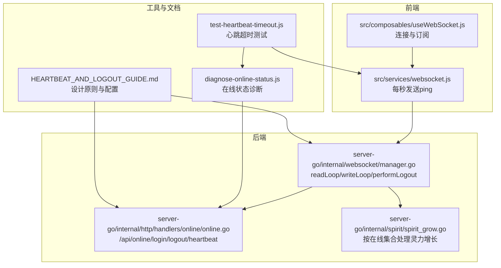
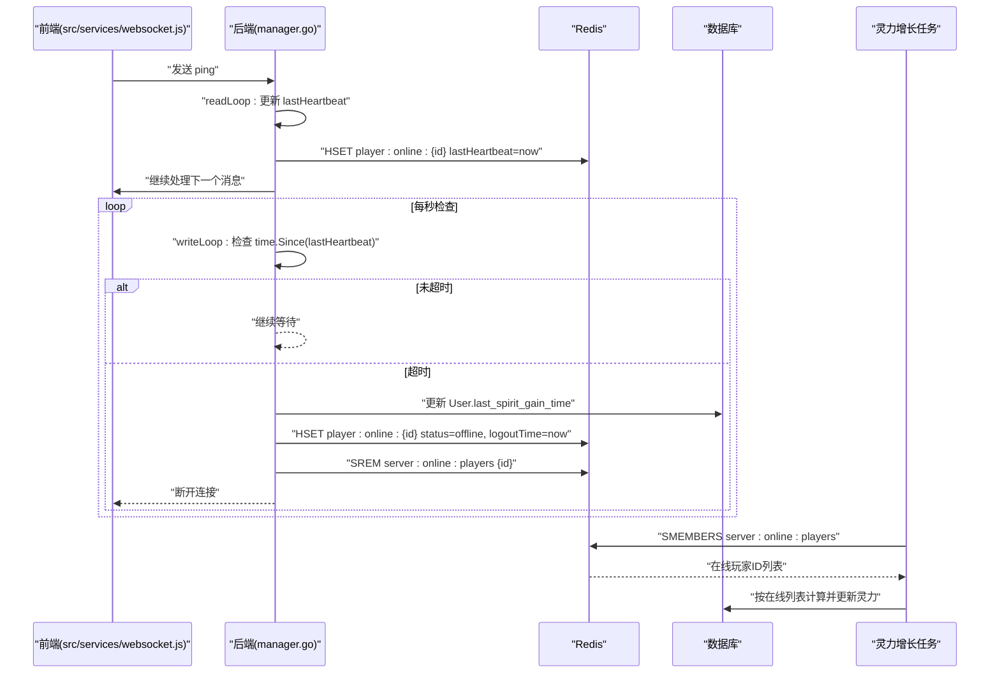
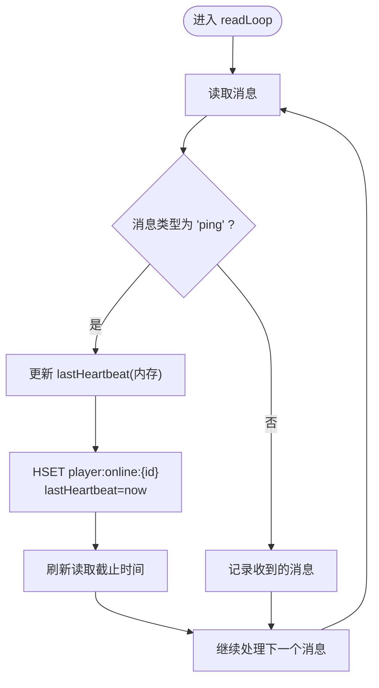
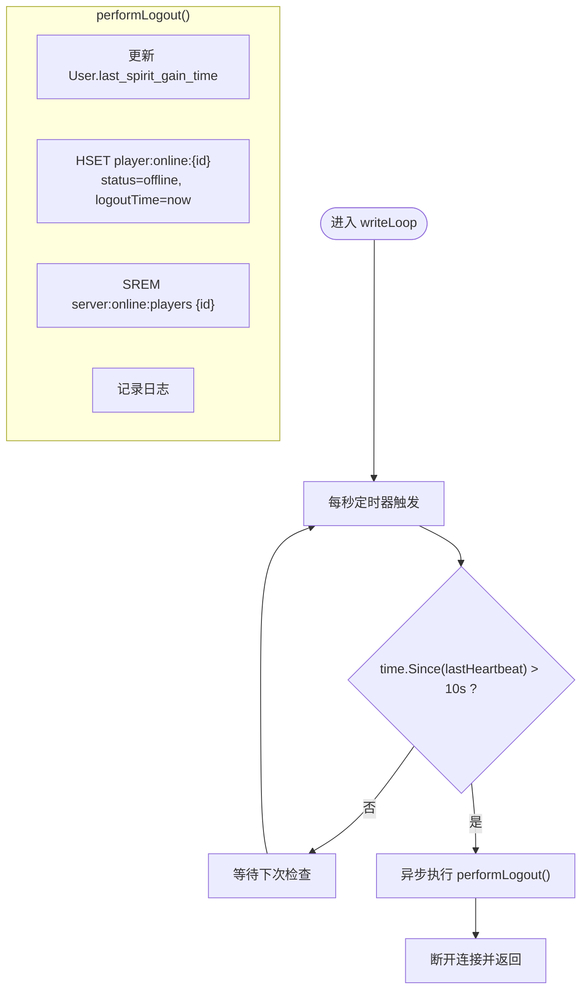
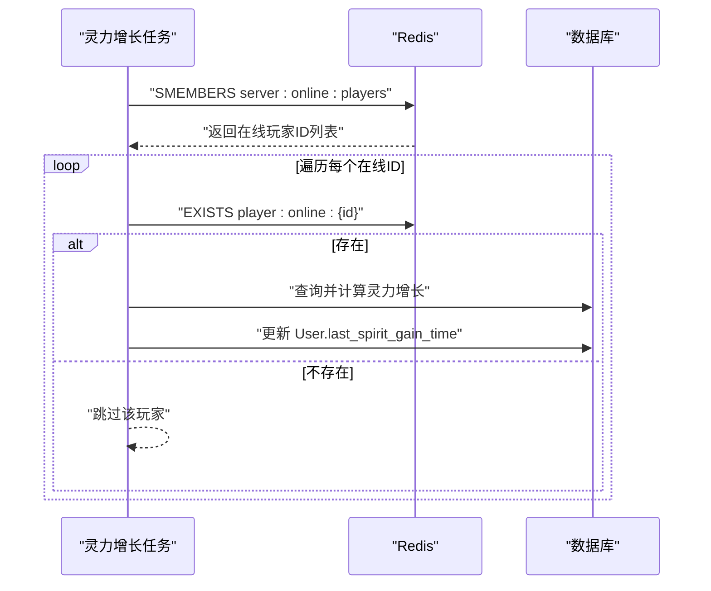
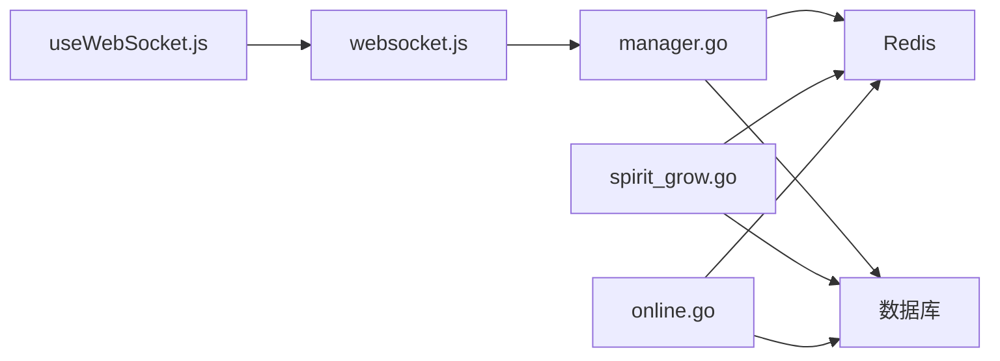

# 心跳机制与自动下线

<cite>
**本文引用的文件**
- [manager.go](file://server-go/internal/websocket/manager.go)
- [HEARTBEAT_AND_LOGOUT_GUIDE.md](file://HEARTBEAT_AND_LOGOUT_GUIDE.md)
- [diagnose-online-status.js](file://diagnose-online-status.js)
- [test-heartbeat-timeout.js](file://test-heartbeat-timeout.js)
- [online.go](file://server-go/internal/http/handlers/online/online.go)
- [spirit_grow.go](file://server-go/internal/spirit/spirit_grow.go)
- [websocket.js](file://src/services/websocket.js)
- [useWebSocket.js](file://src/composables/useWebSocket.js)
</cite>

## 目录
1. [引言](#引言)
2. [项目结构](#项目结构)
3. [核心组件](#核心组件)
4. [架构总览](#架构总览)
5. [详细组件分析](#详细组件分析)
6. [依赖关系分析](#依赖关系分析)
7. [性能考量](#性能考量)
8. [故障排查指南](#故障排查指南)
9. [结论](#结论)
10. [附录](#附录)

## 引言
本文件系统化文档化WebSocket心跳检测与用户自动下线机制，围绕后端manager.go中的readLoop与writeLoop实现，详细说明：
- 客户端PING消息处理流程：当收到type为“ping”的消息时，服务端如何更新ClientConnection.lastHeartbeat时间戳，并同步更新Redis中player:online:{userID}的lastHeartbeat字段；
- writeLoop中每秒执行的心跳检查逻辑：当time.Since(lastHeartbeat)超过10秒时触发超时，调用performLogout执行下线；
- performLogout的完整流程：更新数据库User.last_spirit_gain_time、设置Redis哈希状态为offline、从server:online:players集合中移除用户ID，确保前后端状态一致；
- 结合HEARTBEAT_AND_LOGOUT_GUIDE.md的设计原则，解释该机制如何防止灵力异常增长；
- 与diagnose-online-status.js诊断脚本协同验证在线状态准确性；
- 提供心跳超时处理的时序图，列举常见问题如时钟漂移、网络延迟的应对策略。

## 项目结构
本机制涉及前后端多处协作：
- 前端：src/services/websocket.js负责每秒发送ping心跳；src/composables/useWebSocket.js封装连接与订阅；
- 后端：server-go/internal/websocket/manager.go实现readLoop/writeLoop与自动下线逻辑；server-go/internal/http/handlers/online/online.go提供手动上下线接口；server-go/internal/spirit/spirit_grow.go按在线集合批量处理灵力增长；
- 诊断与测试：diagnose-online-status.js用于检查在线状态；test-heartbeat-timeout.js用于自动化测试心跳超时场景；HEARTBEAT_AND_LOGOUT_GUIDE.md提供设计原则与配置参数。

图表来源
- [manager.go](file://server-go/internal/websocket/manager.go#L170-L309)
- [online.go](file://server-go/internal/http/handlers/online/online.go#L24-L110)
- [spirit_grow.go](file://server-go/internal/spirit/spirit_grow.go#L63-L174)
- [websocket.js](file://src/services/websocket.js#L174-L205)
- [useWebSocket.js](file://src/composables/useWebSocket.js#L1-L136)
- [diagnose-online-status.js](file://diagnose-online-status.js#L1-L116)
- [test-heartbeat-timeout.js](file://test-heartbeat-timeout.js#L1-L206)
- [HEARTBEAT_AND_LOGOUT_GUIDE.md](file://HEARTBEAT_AND_LOGOUT_GUIDE.md#L1-L252)

章节来源
- [manager.go](file://server-go/internal/websocket/manager.go#L170-L309)
- [online.go](file://server-go/internal/http/handlers/online/online.go#L24-L110)
- [spirit_grow.go](file://server-go/internal/spirit/spirit_grow.go#L63-L174)
- [websocket.js](file://src/services/websocket.js#L174-L205)
- [useWebSocket.js](file://src/composables/useWebSocket.js#L1-L136)
- [diagnose-online-status.js](file://diagnose-online-status.js#L1-L116)
- [test-heartbeat-timeout.js](file://test-heartbeat-timeout.js#L1-L206)
- [HEARTBEAT_AND_LOGOUT_GUIDE.md](file://HEARTBEAT_AND_LOGOUT_GUIDE.md#L1-L252)

## 核心组件
- ClientConnection结构：包含lastHeartbeat与heartbeatTimeout，分别用于记录最后一次心跳时间与心跳超时阈值（默认10秒）。
- readLoop：读取客户端消息，当消息类型为“ping”时，更新lastHeartbeat并同步更新Redis中player:online:{userID}的lastHeartbeat字段；同时刷新读取截止时间。
- writeLoop：每秒检查一次心跳，若超时则异步调用performLogout并断开连接。
- performLogout：更新数据库User.last_spirit_gain_time，设置Redis哈希状态为offline，从server:online:players集合移除用户ID，确保前后端状态一致。
- HTTP在线接口：/api/online/login初始化在线状态并重置last_spirit_gain_time；/api/online/logout手动离线；/api/online/heartbeat更新心跳；/api/online/players与/api/online/player/:playerId查询在线状态。
- 灵力增长任务：按server:online:players集合遍历在线玩家，计算并更新其灵力值，从而天然避免离线玩家的异常增长。

章节来源
- [manager.go](file://server-go/internal/websocket/manager.go#L170-L309)
- [online.go](file://server-go/internal/http/handlers/online/online.go#L24-L110)
- [spirit_grow.go](file://server-go/internal/spirit/spirit_grow.go#L63-L174)

## 架构总览
心跳与自动下线的整体流程如下：
- 前端每秒发送ping消息；
- 后端readLoop接收并更新lastHeartbeat与Redis；
- writeLoop每秒检查超时，超时后performLogout；
- 灵力增长任务仅处理server:online:players集合中的玩家，确保离线玩家不再增长。

图表来源
- [manager.go](file://server-go/internal/websocket/manager.go#L170-L309)
- [online.go](file://server-go/internal/http/handlers/online/online.go#L24-L110)
- [spirit_grow.go](file://server-go/internal/spirit/spirit_grow.go#L63-L174)
- [websocket.js](file://src/services/websocket.js#L174-L205)

## 详细组件分析

### 客户端PING消息处理流程（readLoop）
- 当收到type为“ping”的消息时，服务端：
  - 更新ClientConnection.lastHeartbeat为当前时间；
  - 同步更新Redis中player:online:{userID}的lastHeartbeat字段；
  - 刷新读取截止时间，避免长时间阻塞；
  - 继续处理下一个消息。

图表来源
- [manager.go](file://server-go/internal/websocket/manager.go#L170-L219)

章节来源
- [manager.go](file://server-go/internal/websocket/manager.go#L170-L219)

### writeLoop心跳检查与自动下线（performLogout）
- writeLoop每秒检查一次：
  - 若time.Since(lastHeartbeat) > heartbeatTimeout（默认10秒），则：
    - 异步执行performLogout；
    - 断开连接并返回。
- performLogout执行顺序：
  - 更新数据库User.last_spirit_gain_time；
  - 设置Redis哈希状态为offline并记录logoutTime；
  - 从server:online:players集合移除用户ID；
  - 记录日志。

图表来源
- [manager.go](file://server-go/internal/websocket/manager.go#L222-L309)

章节来源
- [manager.go](file://server-go/internal/websocket/manager.go#L222-L309)

### 自动下线对灵力增长的影响
- 灵力增长任务按server:online:players集合遍历在线玩家，若玩家不在集合中，则不会被处理；
- 自动下线会将玩家从集合移除，从而确保灵力增长任务不再对该玩家进行增长计算，防止离线期间的异常增长。

图表来源
- [spirit_grow.go](file://server-go/internal/spirit/spirit_grow.go#L63-L174)

章节来源
- [spirit_grow.go](file://server-go/internal/spirit/spirit_grow.go#L63-L174)

### 前端心跳发送与重连策略
- 前端每秒发送一次ping消息；
- 连接关闭时，若非主动断开，将进行最多5次指数退避重连；
- 主动断开时，不进行重连。

章节来源
- [websocket.js](file://src/services/websocket.js#L174-L205)
- [websocket.js](file://src/services/websocket.js#L208-L237)
- [useWebSocket.js](file://src/composables/useWebSocket.js#L1-L136)

### HTTP在线接口与手动下线
- /api/online/login：初始化在线状态，重置User.last_spirit_gain_time，并写入player:online:{id}哈希与server:online:players集合；
- /api/online/logout：手动离线，删除player:online:{id}哈希并从集合移除；
- /api/online/heartbeat：更新心跳时间；
- /api/online/players与/api/online/player/:playerId：查询在线列表与指定玩家状态。

章节来源
- [online.go](file://server-go/internal/http/handlers/online/online.go#L24-L110)
- [online.go](file://server-go/internal/http/handlers/online/online.go#L112-L185)
- [online.go](file://server-go/internal/http/handlers/online/online.go#L188-L253)
- [online.go](file://server-go/internal/http/handlers/online/online.go#L255-L319)

### 诊断与测试脚本
- diagnose-online-status.js：获取在线玩家列表、检查指定玩家状态、必要时调用/api/online/login进行修复；
- test-heartbeat-timeout.js：注册用户、标记在线、连接WebSocket、发送心跳、模拟超时并验证下线与灵力增长停止。

章节来源
- [diagnose-online-status.js](file://diagnose-online-status.js#L1-L116)
- [test-heartbeat-timeout.js](file://test-heartbeat-timeout.js#L1-L206)

## 依赖关系分析
- manager.go依赖Redis客户端与数据库访问层，用于更新在线状态与用户数据；
- spirit_grow.go依赖Redis在线集合与数据库用户模型，按在线玩家批量计算灵力；
- online.go提供HTTP接口，与Redis与数据库交互，支持手动上下线与心跳更新；
- 前端websocket.js与useWebSocket.js负责连接、心跳与事件订阅。

图表来源
- [manager.go](file://server-go/internal/websocket/manager.go#L170-L309)
- [spirit_grow.go](file://server-go/internal/spirit/spirit_grow.go#L63-L174)
- [online.go](file://server-go/internal/http/handlers/online/online.go#L24-L110)
- [websocket.js](file://src/services/websocket.js#L174-L205)
- [useWebSocket.js](file://src/composables/useWebSocket.js#L1-L136)

章节来源
- [manager.go](file://server-go/internal/websocket/manager.go#L170-L309)
- [spirit_grow.go](file://server-go/internal/spirit/spirit_grow.go#L63-L174)
- [online.go](file://server-go/internal/http/handlers/online/online.go#L24-L110)
- [websocket.js](file://src/services/websocket.js#L174-L205)
- [useWebSocket.js](file://src/composables/useWebSocket.js#L1-L136)

## 性能考量
- 心跳检查频率：每秒一次，开销极低；
- Redis写入：仅在收到“ping”时更新lastHeartbeat，且写入哈希字段；
- 数据库更新：仅在performLogout时更新User.last_spirit_gain_time，频率低；
- 灵力增长任务：按在线集合遍历，避免对离线玩家的无效计算；
- 前端心跳间隔：1秒，与后端超时阈值匹配，兼顾实时性与稳定性。

[本节为通用性能讨论，不直接分析具体文件]

## 故障排查指南
- 心跳超时但未触发自动下线
  - 检查前端是否持续发送ping；
  - 检查后端writeLoop是否运行；
  - 查看后端日志中“心跳超时，正在下线”与“心跳超时自动下线”记录。
- 灵力仍在增长
  - 使用diagnose-online-status.js检查server:online:players集合是否仍包含该用户；
  - 如存在，手动调用/api/online/logout或执行performLogout逻辑；
  - 确认Redis中player:online:{id}的状态是否为offline。
- 时钟漂移与网络延迟
  - 建议统一使用UTC时间戳，减少本地时区差异影响；
  - 前端可记录发送与接收时间差，评估网络延迟；
  - 后端在更新Redis时采用毫秒级时间戳，提高精度。
- 重连策略
  - 前端非主动断开时自动重连，最多5次，指数退避；
  - 主动断开时避免重连，防止资源浪费。

章节来源
- [HEARTBEAT_AND_LOGOUT_GUIDE.md](file://HEARTBEAT_AND_LOGOUT_GUIDE.md#L189-L252)
- [diagnose-online-status.js](file://diagnose-online-status.js#L1-L116)
- [test-heartbeat-timeout.js](file://test-heartbeat-timeout.js#L1-L206)
- [websocket.js](file://src/services/websocket.js#L208-L237)

## 结论
该心跳与自动下线机制通过“前端每秒心跳 + 后端10秒超时 + performLogout清理”的闭环，有效防止离线期间的灵力异常增长，并与HTTP在线接口、灵力增长任务形成强一致的数据状态。配合diagnose-online-status.js与自动化测试脚本，可快速定位与验证在线状态一致性问题。

[本节为总结性内容，不直接分析具体文件]

## 附录
- 设计原则与配置参数
  - 前端心跳间隔：1秒；
  - 后端超时阈值：10秒；
  - 检查频率：1秒。
- 关键流程路径
  - readLoop处理“ping”：[manager.go](file://server-go/internal/websocket/manager.go#L196-L213)
  - writeLoop心跳检查与超时：[manager.go](file://server-go/internal/websocket/manager.go#L241-L250)
  - performLogout完整流程：[manager.go](file://server-go/internal/websocket/manager.go#L258-L309)
  - HTTP在线接口：[online.go](file://server-go/internal/http/handlers/online/online.go#L24-L110)
  - 灵力增长任务：[spirit_grow.go](file://server-go/internal/spirit/spirit_grow.go#L63-L174)
  - 前端心跳发送：[websocket.js](file://src/services/websocket.js#L174-L205)
  - 诊断脚本：[diagnose-online-status.js](file://diagnose-online-status.js#L1-L116)
  - 自动化测试：[test-heartbeat-timeout.js](file://test-heartbeat-timeout.js#L1-L206)