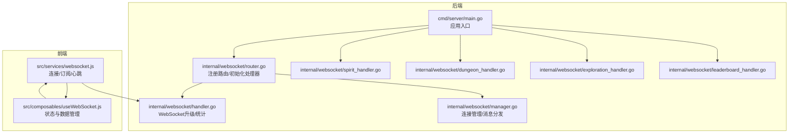
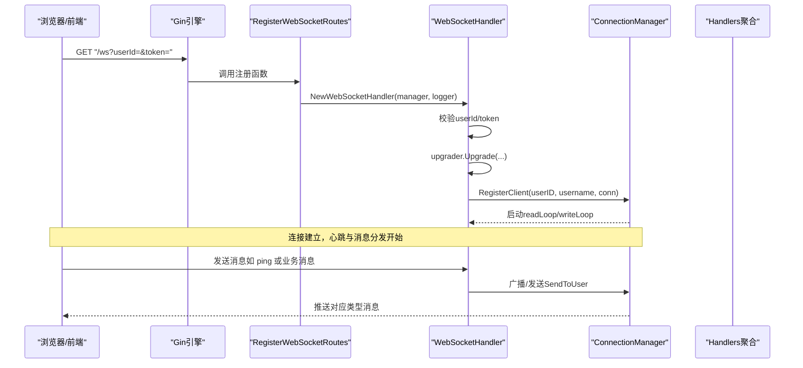
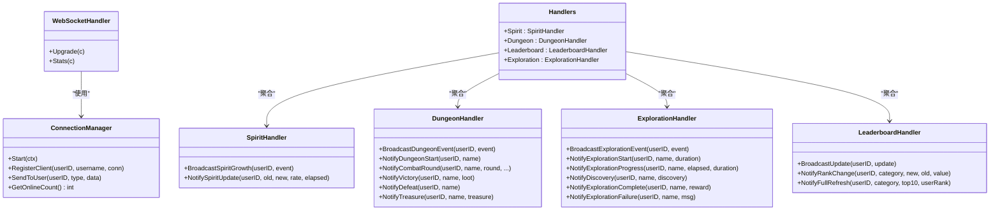
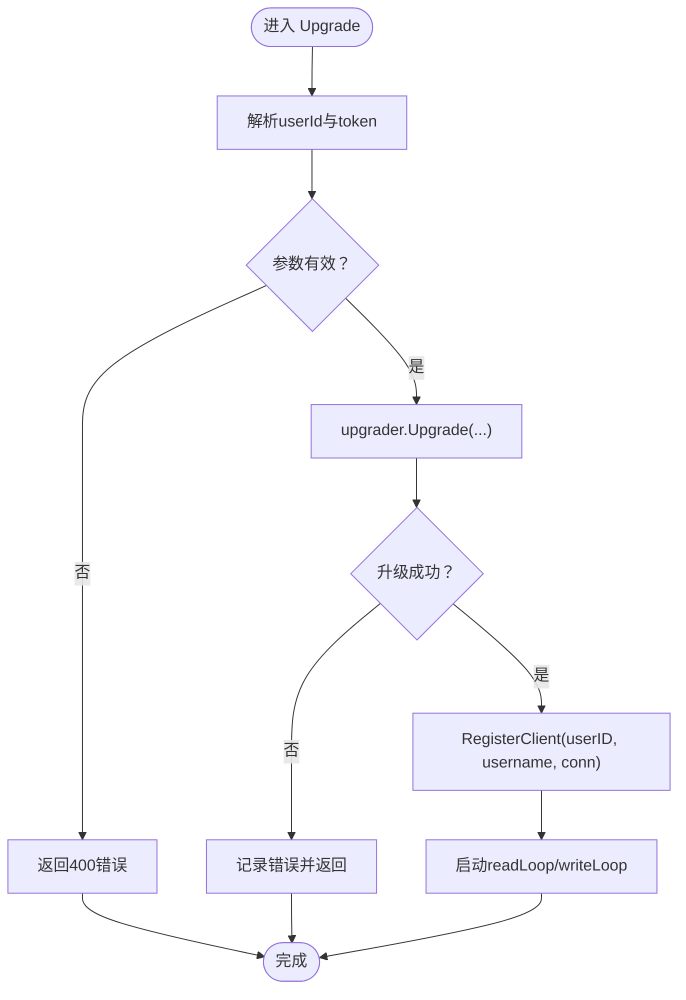
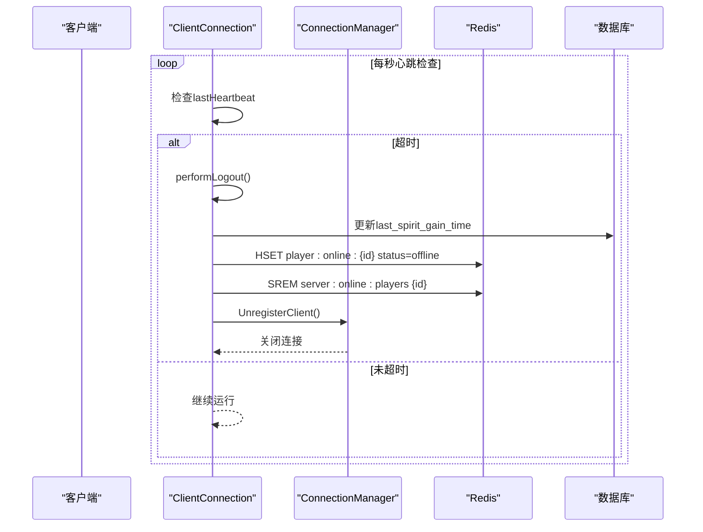
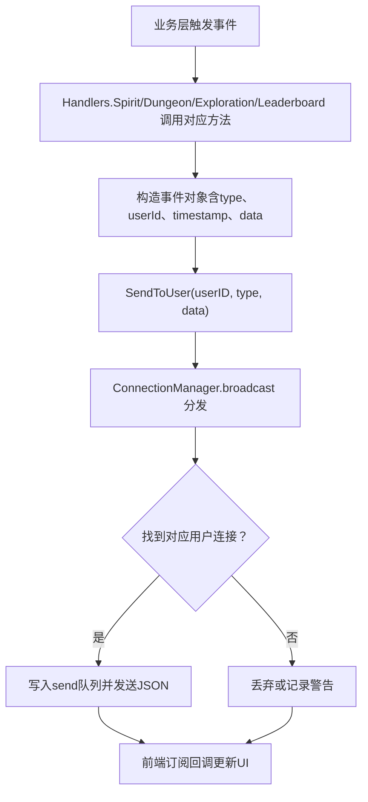
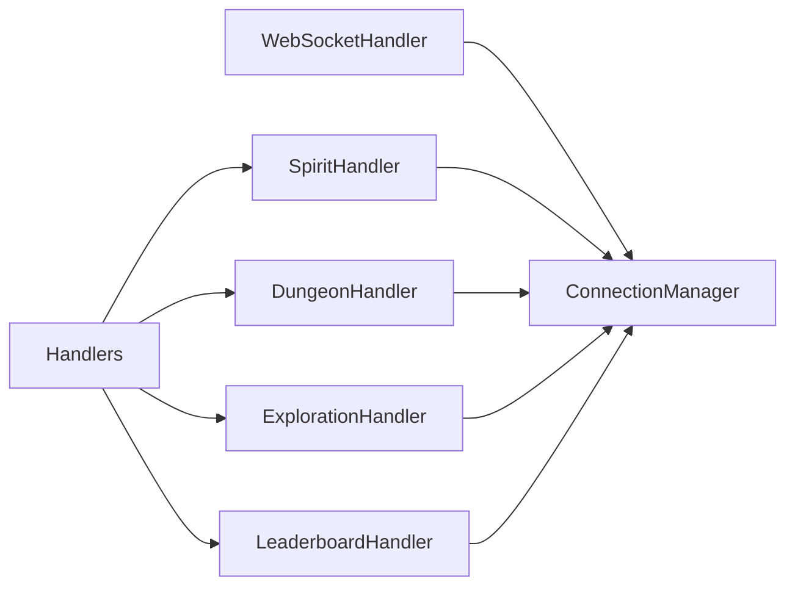

# 消息路由与分发

<cite>
**本文引用的文件列表**
- [router.go](file://server-go/internal/websocket/router.go)
- [handler.go](file://server-go/internal/websocket/handler.go)
- [manager.go](file://server-go/internal/websocket/manager.go)
- [spirit_handler.go](file://server-go/internal/websocket/spirit_handler.go)
- [dungeon_handler.go](file://server-go/internal/websocket/dungeon_handler.go)
- [exploration_handler.go](file://server-go/internal/websocket/exploration_handler.go)
- [leaderboard_handler.go](file://server-go/internal/websocket/leaderboard_handler.go)
- [main.go](file://server-go/cmd/server/main.go)
- [useWebSocket.js](file://src/composables/useWebSocket.js)
- [websocket.js](file://src/services/websocket.js)
- [WebSocket改造完整实现指南.md](file://WebSocket改造完整实现指南.md)
</cite>

## 目录
1. [引言](#引言)
2. [项目结构](#项目结构)
3. [核心组件](#核心组件)
4. [架构总览](#架构总览)
5. [详细组件分析](#详细组件分析)
6. [依赖分析](#依赖分析)
7. [性能考虑](#性能考虑)
8. [故障排查指南](#故障排查指南)
9. [结论](#结论)
10. [附录](#附录)

## 引言
本文件系统性文档化 WebSocket 消息路由机制的实现，围绕以下目标展开：
- 解释 router.go 中 RegisterWebSocketRoutes 如何通过 Gin 注册 /ws 升级端点与 /ws/stats 统计接口，并结合 NewWebSocketHandler 初始化处理器。
- 说明 InitializeHandlers 如何创建并初始化 SpiritHandler、DungeonHandler、LeaderboardHandler 和 ExplorationHandler，并聚合到 Handlers 结构体，为后续消息分发提供基础。
- 阐述消息类型（如 spirit:grow、dungeon:event）在运行时如何通过处理器实例进行分发，以及各处理器如何订阅和响应特定类型的消息。
- 基于 Handlers 的设计，分析其扩展性与维护性优势，并给出新增业务模块（如未来添加 PillHandler）的接入方式。
- 提供路由初始化流程的时序图，并指出与 handler.go 中升级逻辑的协作关系。

## 项目结构
WebSocket 相关代码位于 server-go/internal/websocket 目录，入口在 server-go/cmd/server/main.go。前端侧通过 src/services/websocket.js 与 src/composables/useWebSocket.js 实现连接、订阅与状态管理。

图表来源
- [main.go](file://server-go/cmd/server/main.go#L60-L106)
- [router.go](file://server-go/internal/websocket/router.go#L8-L36)
- [handler.go](file://server-go/internal/websocket/handler.go#L14-L100)
- [manager.go](file://server-go/internal/websocket/manager.go#L19-L170)
- [spirit_handler.go](file://server-go/internal/websocket/spirit_handler.go#L1-L122)
- [dungeon_handler.go](file://server-go/internal/websocket/dungeon_handler.go#L1-L144)
- [exploration_handler.go](file://server-go/internal/websocket/exploration_handler.go#L1-L149)
- [leaderboard_handler.go](file://server-go/internal/websocket/leaderboard_handler.go#L1-L137)
- [websocket.js](file://src/services/websocket.js#L1-L295)
- [useWebSocket.js](file://src/composables/useWebSocket.js#L1-L319)

章节来源
- [main.go](file://server-go/cmd/server/main.go#L60-L106)
- [router.go](file://server-go/internal/websocket/router.go#L8-L36)

## 核心组件
- 路由注册与处理器初始化
  - RegisterWebSocketRoutes：注册 /ws 升级端点与 /ws/stats 统计接口；通过 NewWebSocketHandler 初始化处理器。
  - InitializeHandlers：创建并初始化 SpiritHandler、DungeonHandler、LeaderboardHandler、ExplorationHandler，并聚合到 Handlers 结构体。
- WebSocket 升级与统计
  - WebSocketHandler：负责 HTTP 到 WebSocket 的升级、参数校验、连接注册与统计接口。
- 连接管理与消息分发
  - ConnectionManager：维护在线用户映射、广播通道、注册/注销通道、心跳检测与自动下线。
  - ClientConnection：封装单个连接的读写循环、心跳处理、发送队列与超时控制。
- 业务处理器
  - SpiritHandler：广播灵力增长事件，支持从数据库拉取最新数据。
  - DungeonHandler：广播秘境战斗事件（开始、战斗轮次、胜利、失败、宝藏）。
  - ExplorationHandler：广播探索事件（开始、进度、发现、完成、失败）。
  - LeaderboardHandler：广播排行榜更新（全量刷新、排名变化）。

章节来源
- [router.go](file://server-go/internal/websocket/router.go#L8-L36)
- [handler.go](file://server-go/internal/websocket/handler.go#L14-L100)
- [manager.go](file://server-go/internal/websocket/manager.go#L19-L170)
- [spirit_handler.go](file://server-go/internal/websocket/spirit_handler.go#L1-L122)
- [dungeon_handler.go](file://server-go/internal/websocket/dungeon_handler.go#L1-L144)
- [exploration_handler.go](file://server-go/internal/websocket/exploration_handler.go#L1-L149)
- [leaderboard_handler.go](file://server-go/internal/websocket/leaderboard_handler.go#L1-L137)

## 架构总览
WebSocket 路由初始化流程如下：
- 应用启动时，main.go 初始化日志、数据库、Redis、连接管理器并启动。
- 初始化 Handlers，注入到 Gin 上下文，供 HTTP 接口使用。
- 注册 HTTP 路由与 WebSocket 路由。
- 前端通过 ws://host:port/ws?userId=...&token=... 连接，handler.go 完成升级与注册。

图表来源
- [main.go](file://server-go/cmd/server/main.go#L60-L106)
- [router.go](file://server-go/internal/websocket/router.go#L8-L17)
- [handler.go](file://server-go/internal/websocket/handler.go#L37-L73)
- [manager.go](file://server-go/internal/websocket/manager.go#L107-L127)

## 详细组件分析

### 路由注册与处理器初始化
- RegisterWebSocketRoutes
  - 作用：注册 /ws 升级端点与 /ws/stats 统计接口。
  - 关键点：通过 NewWebSocketHandler(manager, logger) 创建处理器实例，再绑定到 Gin 路由。
- InitializeHandlers
  - 作用：创建并初始化各业务处理器，聚合到 Handlers 结构体，便于统一注入到上下文与业务层调用。
  - 设计优势：集中管理处理器生命周期与依赖，便于扩展新处理器。

图表来源
- [router.go](file://server-go/internal/websocket/router.go#L8-L36)
- [handler.go](file://server-go/internal/websocket/handler.go#L23-L100)
- [manager.go](file://server-go/internal/websocket/manager.go#L19-L170)
- [spirit_handler.go](file://server-go/internal/websocket/spirit_handler.go#L1-L122)
- [dungeon_handler.go](file://server-go/internal/websocket/dungeon_handler.go#L1-L144)
- [exploration_handler.go](file://server-go/internal/websocket/exploration_handler.go#L1-L149)
- [leaderboard_handler.go](file://server-go/internal/websocket/leaderboard_handler.go#L1-L137)

章节来源
- [router.go](file://server-go/internal/websocket/router.go#L8-L36)

### WebSocket 升级与统计
- 升级逻辑
  - handler.go 中的 Upgrade 方法从查询参数提取 userId 与 token，进行基本校验后，使用 upgrader.Upgrade 完成协议升级，并通过 ConnectionManager.RegisterClient 注册连接。
  - 注册后分别启动 readLoop 与 writeLoop，进入消息循环与心跳处理。
- 统计接口
  - Stats 返回在线人数与时间戳，便于监控与调试。

图表来源
- [handler.go](file://server-go/internal/websocket/handler.go#L37-L73)
- [manager.go](file://server-go/internal/websocket/manager.go#L107-L127)

章节来源
- [handler.go](file://server-go/internal/websocket/handler.go#L37-L81)

### 连接管理与消息分发
- ConnectionManager
  - 维护 clients 映射、broadcast/register/unregister 通道、读写锁与日志。
  - Start 启动主循环，处理注册、注销、广播与上下文退出。
  - SendToUser 将消息封装为 Message 并投递到 broadcast 通道，按 userID 查找客户端并发送。
- ClientConnection
  - readLoop：读取 JSON 消息，处理 ping 心跳并更新 Redis 中 lastHeartbeat；异常时注销连接。
  - writeLoop：定时检查心跳超时，超时则触发 performLogout，清理数据库与 Redis 在线状态，并移除在线集合。
- 心跳与自动下线
  - 前端每 20 秒发送 ping；后端收到 ping 后更新心跳并在 Redis 中持久化。
  - 若超过 heartbeatTimeout（10 秒）未收到心跳，触发自动下线流程。

图表来源
- [manager.go](file://server-go/internal/websocket/manager.go#L170-L309)

章节来源
- [manager.go](file://server-go/internal/websocket/manager.go#L19-L170)
- [manager.go](file://server-go/internal/websocket/manager.go#L170-L309)

### 业务处理器与消息类型
- 灵力增长（spirit:grow）
  - SpiritHandler 提供 NotifySpiritUpdate 与 BroadcastSpiritGrowth，用于广播灵力增长事件；GetSpiritUpdateFromDB 支持从数据库拉取最新数据。
- 秘境战斗（dungeon:event）
  - DungeonHandler 提供多种通知方法：NotifyDungeonStart、NotifyCombatRound、NotifyVictory、NotifyDefeat、NotifyTreasure，并支持批量广播。
- 探索事件（exploration:event）
  - ExplorationHandler 提供：NotifyExplorationStart、NotifyExplorationProgress、NotifyDiscovery、NotifyExplorationComplete、NotifyExplorationFailure，并支持多次发现的批量通知。
- 排行榜更新（leaderboard:update）
  - LeaderboardHandler 提供：NotifyRankChange、NotifyFullRefresh 等，支持按类别（spirit/power/level）推送更新。

图表来源
- [spirit_handler.go](file://server-go/internal/websocket/spirit_handler.go#L42-L81)
- [dungeon_handler.go](file://server-go/internal/websocket/dungeon_handler.go#L38-L143)
- [exploration_handler.go](file://server-go/internal/websocket/exploration_handler.go#L38-L149)
- [leaderboard_handler.go](file://server-go/internal/websocket/leaderboard_handler.go#L51-L121)
- [manager.go](file://server-go/internal/websocket/manager.go#L137-L154)

章节来源
- [spirit_handler.go](file://server-go/internal/websocket/spirit_handler.go#L42-L122)
- [dungeon_handler.go](file://server-go/internal/websocket/dungeon_handler.go#L38-L144)
- [exploration_handler.go](file://server-go/internal/websocket/exploration_handler.go#L38-L149)
- [leaderboard_handler.go](file://server-go/internal/websocket/leaderboard_handler.go#L51-L137)

### Handlers 结构体的扩展性与维护性
- 聚合设计
  - Handlers 将各业务处理器聚合在一起，便于统一注入到 Gin 上下文，业务层通过 c.MustGet("ws_handlers") 获取。
- 扩展方式
  - 新增处理器：在 spirit_handler.go 类似的模式下实现 NewXxxHandler 与广播方法；在 InitializeHandlers 中注册；在 router.go 中按需暴露新消息类型或接口。
  - 例如新增 PillHandler：实现 NewPillHandler、NotifyPillEvent 等方法，然后在 InitializeHandlers 中加入 Handlers.Pill，并在需要时通过 SendToUser 发送 "pill:event" 类型消息。

章节来源
- [router.go](file://server-go/internal/websocket/router.go#L19-L36)
- [main.go](file://server-go/cmd/server/main.go#L83-L95)

### 前后端协作与消息格式
- 前端连接与订阅
  - 前端通过 wsManager.connect(token, userId) 建立连接，订阅事件（如 spirit:grow、dungeon:event、leaderboard:update、exploration:event），并在连接状态变化时更新 UI。
- 心跳机制
  - 前端每 20 秒发送 ping；后端收到 ping 后更新心跳并在 Redis 中持久化；writeLoop 每秒检查心跳超时并触发自动下线。
- 消息格式
  - 通用字段：type、userId、timestamp、data。不同处理器定义各自 data 结构，如 spirit:grow 的增长明细、dungeon:event 的战斗轮次信息等。

章节来源
- [websocket.js](file://src/services/websocket.js#L1-L295)
- [useWebSocket.js](file://src/composables/useWebSocket.js#L1-L319)
- [WebSocket改造完整实现指南.md](file://WebSocket改造完整实现指南.md#L203-L349)

## 依赖分析
- 组件耦合
  - WebSocketHandler 依赖 ConnectionManager；Handlers 聚合各业务处理器；业务处理器均依赖 ConnectionManager 的 SendToUser。
- 外部依赖
  - gorilla/websocket 用于协议升级与读写；go.uber.org/zap 用于日志；Redis 用于心跳与在线状态持久化；数据库用于部分业务数据（如灵力）。
- 循环依赖
  - 代码结构清晰，无明显循环依赖；业务处理器仅通过 ConnectionManager 间接通信。

图表来源
- [router.go](file://server-go/internal/websocket/router.go#L8-L36)
- [handler.go](file://server-go/internal/websocket/handler.go#L23-L100)
- [manager.go](file://server-go/internal/websocket/manager.go#L19-L170)
- [spirit_handler.go](file://server-go/internal/websocket/spirit_handler.go#L1-L122)
- [dungeon_handler.go](file://server-go/internal/websocket/dungeon_handler.go#L1-L144)
- [exploration_handler.go](file://server-go/internal/websocket/exploration_handler.go#L1-L149)
- [leaderboard_handler.go](file://server-go/internal/websocket/leaderboard_handler.go#L1-L137)

章节来源
- [router.go](file://server-go/internal/websocket/router.go#L8-L36)
- [handler.go](file://server-go/internal/websocket/handler.go#L23-L100)
- [manager.go](file://server-go/internal/websocket/manager.go#L19-L170)

## 性能考虑
- 发送队列与背压
  - send 队列容量有限，若阻塞会记录警告；建议前端合理消费与节流。
- 广播与查找
  - 广播采用按 userID 查找客户端的方式，map 查找为 O(1)，整体开销可控。
- 心跳与超时
  - 10 秒超时与每秒心跳检查平衡了实时性与资源消耗；Redis 更新频率较低，避免频繁 IO。
- 批量事件
  - DungeonHandler 与 ExplorationHandler 提供批量广播方法，并在内部 sleep 控制速率，避免事件风暴。

[本节为通用性能讨论，无需列出具体文件来源]

## 故障排查指南
- 连接失败
  - 检查 /ws 参数（userId、token）是否正确传递；确认 handler.go 中 Upgrade 的校验逻辑。
- 无法收到消息
  - 确认业务层已通过 Handlers 调用对应处理器的广播方法；检查 manager.go 的 SendToUser 是否成功投递到 broadcast。
- 心跳超时自动下线
  - 检查前端是否定时发送 ping；确认 Redis 中 player:online:* 的 lastHeartbeat 是否更新；查看 manager.go 的 performLogout 流程日志。
- 统计接口异常
  - 检查 /ws/stats 的返回值与日志；确认 ConnectionManager.GetOnlineCount 的并发安全。

章节来源
- [handler.go](file://server-go/internal/websocket/handler.go#L37-L81)
- [manager.go](file://server-go/internal/websocket/manager.go#L137-L170)
- [manager.go](file://server-go/internal/websocket/manager.go#L222-L309)

## 结论
该 WebSocket 消息路由机制通过清晰的分层设计实现了高内聚、低耦合的消息分发体系：
- 路由层负责端点注册与处理器初始化；
- 升级层负责连接建立与参数校验；
- 管理层负责连接生命周期、心跳与消息分发；
- 业务层通过 Handlers 聚合的处理器实现消息广播；
- 前端通过订阅模式接收并渲染消息，配合心跳与自动下线保障稳定性。

该设计具备良好的扩展性：新增业务模块只需遵循现有模式实现处理器并在 Handlers 中聚合即可，无需改动核心路由与升级逻辑。

[本节为总结性内容，无需列出具体文件来源]

## 附录
- 新增业务模块接入步骤（以 PillHandler 为例）
  1) 实现 NewPillHandler(manager, logger) 与 NotifyPillEvent(userID, ...) 方法。
  2) 在 InitializeHandlers 中加入 Handlers.Pill = NewPillHandler(...)。
  3) 在需要时通过 SendToUser(userID, "pill:event", data) 发送消息。
  4) 前端订阅 "pill:event" 并更新 UI。

章节来源
- [router.go](file://server-go/internal/websocket/router.go#L19-L36)
- [main.go](file://server-go/cmd/server/main.go#L83-L95)