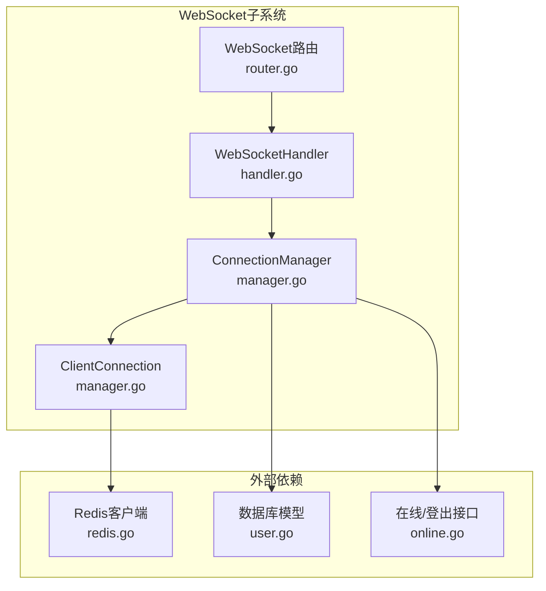
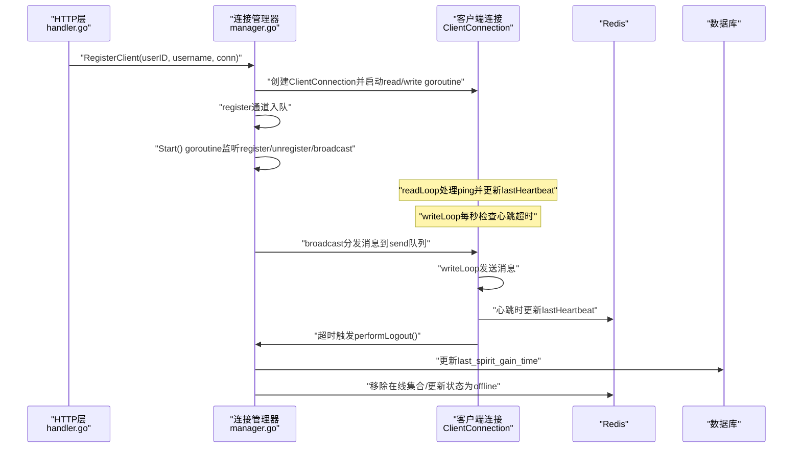
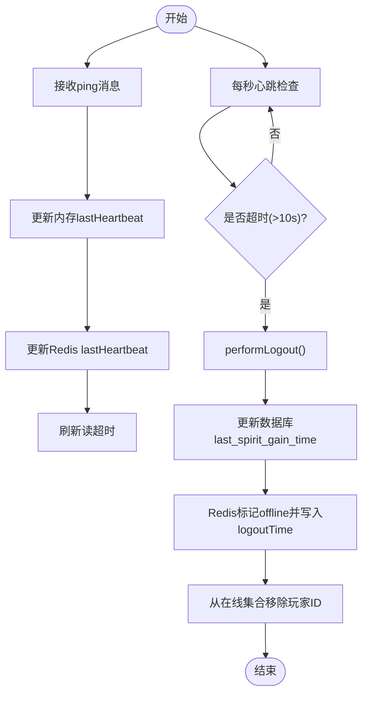
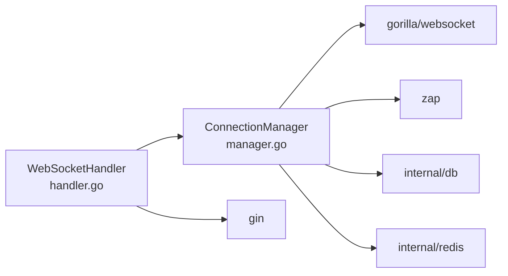

# 连接管理器

<cite>
**本文引用的文件**
- [manager.go](file://server-go/internal/websocket/manager.go)
- [handler.go](file://server-go/internal/websocket/handler.go)
- [router.go](file://server-go/internal/websocket/router.go)
- [redis.go](file://server-go/internal/redis/redis.go)
- [user.go](file://server-go/internal/models/user.go)
- [online.go](file://server-go/internal/http/handlers/online/online.go)
- [HEARTBEAT_AND_LOGOUT_GUIDE.md](file://HEARTBEAT_AND_LOGOUT_GUIDE.md)
- [test_websocket/main.go](file://server-go/cmd/test_websocket/main.go)
</cite>

## 目录
1. [引言](#引言)
2. [项目结构](#项目结构)
3. [核心组件](#核心组件)
4. [架构总览](#架构总览)
5. [详细组件分析](#详细组件分析)
6. [依赖关系分析](#依赖关系分析)
7. [性能考量](#性能考量)
8. [故障排查指南](#故障排查指南)
9. [结论](#结论)

## 引言
本文件围绕 WebSocket 连接管理器（ConnectionManager）进行深入文档化，聚焦以下目标：
- 解释 ConnectionManager 的字段与职责：clients 连接池、broadcast 广播通道、register/unregister 注册通道、mu 同步锁。
- 说明 Start() 如何通过 goroutine 监听注册、注销与广播事件，实现并发安全的连接管理。
- 描述 RegisterClient 与 UnregisterClient 的线程安全流程，以及 SendToUser 如何通过广播机制向指定用户发送消息。
- 结合 ClientConnection，阐明 readLoop 与 writeLoop 的工作机制，特别是心跳超时检测逻辑（每秒检查 lastHeartbeat 是否超过 10 秒）。
- 说明 performLogout 如何与 Redis 和数据库协同完成用户下线流程。
- 提供连接生命周期管理的最佳实践与潜在性能瓶颈及优化建议（如发送队列满时的处理策略）。

## 项目结构
WebSocket 相关代码位于 server-go 内部，主要文件如下：
- manager.go：连接管理器与客户端连接的实现
- handler.go：HTTP 升级为 WebSocket 的入口与统计接口
- router.go：WebSocket 路由注册
- redis.go：Redis 客户端初始化
- user.go：用户模型（包含灵力增长时间戳字段）
- online.go：在线状态与登出接口（与心跳超时自动下线逻辑一致）
- HEARTBEAT_AND_LOGOUT_GUIDE.md：心跳与自动下线实现指南
- test_websocket/main.go：集成测试，验证连接统计与错误处理

图表来源
- [manager.go](file://server-go/internal/websocket/manager.go#L1-L120)
- [handler.go](file://server-go/internal/websocket/handler.go#L1-L74)
- [router.go](file://server-go/internal/websocket/router.go#L1-L18)
- [redis.go](file://server-go/internal/redis/redis.go#L1-L34)
- [user.go](file://server-go/internal/models/user.go#L1-L48)
- [online.go](file://server-go/internal/http/handlers/online/online.go#L188-L253)

章节来源
- [manager.go](file://server-go/internal/websocket/manager.go#L1-L120)
- [handler.go](file://server-go/internal/websocket/handler.go#L1-L74)
- [router.go](file://server-go/internal/websocket/router.go#L1-L18)

## 核心组件
- ConnectionManager：全局连接管理器，维护在线用户映射、广播通道、注册/注销通道与读写锁。
- ClientConnection：单个客户端连接对象，包含底层 websocket.Conn、发送队列、心跳时间与超时阈值等。
- Message：统一消息载体，包含类型、目标用户ID、时间戳与数据体。
- WebSocketHandler：HTTP 升级为 WebSocket 的入口，负责从查询参数提取用户信息并注册连接。
- 路由：对外暴露 /ws 与 /ws/stats。

章节来源
- [manager.go](file://server-go/internal/websocket/manager.go#L19-L48)
- [handler.go](file://server-go/internal/websocket/handler.go#L24-L73)
- [router.go](file://server-go/internal/websocket/router.go#L8-L17)

## 架构总览
WebSocket 连接管理采用“事件驱动 + 广播”的模式：
- HTTP 层通过 handler.Upgrade 将连接升级为 WebSocket，并调用 manager.RegisterClient 注册。
- manager.Start 启动后台 goroutine，循环 select 监听 register/unregister/broadcast 三类事件，保证 clients 映射与发送队列的并发安全。
- SendToUser 将消息放入 broadcast 通道，由 manager 分发至目标用户的 send 队列。
- 每个 ClientConnection 启动 readLoop 与 writeLoop：
  - readLoop：读取消息，处理 ping 心跳并更新 lastHeartbeat；同时设置读超时与 pong 处理。
  - writeLoop：每秒检查心跳超时，若超时则异步执行 performLogout 并断开连接。
- performLogout：更新数据库的灵力增长时间戳，清理 Redis 在线状态与集合，记录日志。

图表来源
- [handler.go](file://server-go/internal/websocket/handler.go#L38-L73)
- [manager.go](file://server-go/internal/websocket/manager.go#L107-L153)
- [manager.go](file://server-go/internal/websocket/manager.go#L170-L256)
- [manager.go](file://server-go/internal/websocket/manager.go#L258-L309)

## 详细组件分析

### ConnectionManager 设计与字段语义
- clients：map[uint]*ClientConnection，按用户ID维护在线连接，用于广播与查询。
- broadcast：chan *Message，广播通道，容量为 256，承载全站/定向消息分发。
- register/unregister：chan *ClientConnection，分别用于注册与注销事件，避免直接并发访问 clients。
- mu：sync.RWMutex，保护 clients 的并发读写，确保广播与注销时的原子性。
- logger：zap 日志器，记录连接/断开/广播丢弃等关键事件。

Start() 并发控制要点：
- 使用 select 监听 register/unregister/broadcast 与 ctx.Done()，保证优雅退出。
- register/unregister 路径均加互斥锁，防止竞态；注销时关闭 send 队列，避免写入阻塞。
- broadcast 路径使用读锁，命中目标用户后尝试非阻塞写入 send 队列；若队列满则记录告警并丢弃消息，避免阻塞广播 goroutine。

RegisterClient 与 UnregisterClient：
- RegisterClient：构造 ClientConnection，初始化 lastHeartbeat 与 heartbeatTimeout，将连接入 register 通道，并启动 readLoop/writeLoop。
- UnregisterClient：非阻塞地将连接入 unregister 通道，确保不会阻塞调用方。

SendToUser：
- 序列化消息，构造 Message，写入 broadcast 通道；由 manager 分发到目标用户 send 队列。

章节来源
- [manager.go](file://server-go/internal/websocket/manager.go#L49-L105)
- [manager.go](file://server-go/internal/websocket/manager.go#L107-L153)

### ClientConnection 生命周期与读写循环
- 字段：UserID、Username、conn、send、done、manager、lastHeartbeat、heartbeatTimeout。
- send 队列容量为 64，作为背压缓冲；writeLoop 以 10 秒写超时发送消息，readLoop 以 60 秒读超时读取消息，并在收到 pong 时刷新读超时。
- readLoop：
  - 读取 JSON 消息，若为 ping 类型则更新 lastHeartbeat，并将 Redis 中的 lastHeartbeat 更新为毫秒时间戳，同时刷新读超时。
  - 非预期关闭错误会被记录，随后触发注销流程。
- writeLoop：
  - 每秒检查心跳超时（默认 10 秒），若超时则记录告警并异步执行 performLogout，随后返回。
  - done 通道用于优雅退出。

章节来源
- [manager.go](file://server-go/internal/websocket/manager.go#L170-L256)

### 心跳超时检测与自动下线流程
- 前端每秒发送 ping，后端 readLoop 接收并更新 lastHeartbeat 与 Redis 中的 lastHeartbeat。
- writeLoop 每秒检查 time.Since(lastHeartbeat) 是否超过 heartbeatTimeout（默认 10 秒）。
- 超时后：
  - 记录告警日志；
  - 异步执行 performLogout：
    - 更新数据库 User 的 last_spirit_gain_time；
    - 更新 Redis 中的在线哈希状态为 offline，并记录 logoutTime；
    - 从 server:online:players 集合移除该玩家ID；
    - 记录成功/失败日志。

图表来源
- [manager.go](file://server-go/internal/websocket/manager.go#L170-L256)
- [manager.go](file://server-go/internal/websocket/manager.go#L258-L309)
- [user.go](file://server-go/internal/models/user.go#L35-L42)
- [HEARTBEAT_AND_LOGOUT_GUIDE.md](file://HEARTBEAT_AND_LOGOUT_GUIDE.md#L1-L127)

章节来源
- [manager.go](file://server-go/internal/websocket/manager.go#L170-L309)
- [user.go](file://server-go/internal/models/user.go#L35-L42)
- [HEARTBEAT_AND_LOGOUT_GUIDE.md](file://HEARTBEAT_AND_LOGOUT_GUIDE.md#L1-L127)

### 与在线/登出接口的一致性
- /api/online/logout 与 performLogout 的逻辑保持一致：删除在线哈希键、从在线集合移除、记录日志。
- /api/online/players 用于查询在线玩家列表，配合 Redis 在线集合与哈希字段使用。

章节来源
- [online.go](file://server-go/internal/http/handlers/online/online.go#L188-L253)
- [manager.go](file://server-go/internal/websocket/manager.go#L258-L309)

## 依赖关系分析
- ConnectionManager 依赖：
  - gorilla/websocket：底层 WebSocket 连接与读写。
  - zap：日志记录。
  - internal/db：GORM 数据库访问，更新用户灵力增长时间戳。
  - internal/redis：Redis 客户端，维护在线状态与集合。
- ClientConnection 依赖：
  - gorilla/websocket：读写消息、设置读/写超时与 pong 处理。
  - internal/redis：心跳时间戳写入。
- WebSocketHandler 依赖：
  - gorilla/websocket：升级 HTTP 连接。
  - internal/websocket：持有 ConnectionManager 实例。
- 路由依赖：
  - gin：注册 /ws 与 /ws/stats。

图表来源
- [handler.go](file://server-go/internal/websocket/handler.go#L1-L73)
- [manager.go](file://server-go/internal/websocket/manager.go#L1-L20)
- [router.go](file://server-go/internal/websocket/router.go#L1-L17)

章节来源
- [handler.go](file://server-go/internal/websocket/handler.go#L1-L73)
- [manager.go](file://server-go/internal/websocket/manager.go#L1-L20)
- [router.go](file://server-go/internal/websocket/router.go#L1-L17)

## 性能考量
- 广播通道容量：broadcast 容量为 256，适合中低并发场景；高并发下可能成为瓶颈。建议：
  - 根据业务峰值估算 QPS，动态调整 broadcast 容量或引入多级缓冲。
  - 对热点用户（如活跃玩家）可考虑优先队列或分片广播。
- 发送队列容量：send 队列容量为 64，若上游推送过快或下游消费过慢，可能导致丢弃消息。建议：
  - 监控广播丢弃日志，必要时增大 send 容量或引入背压策略（如限速/拒绝）。
  - 在 writeLoop 发送失败时，可考虑短暂退避重试或降级策略。
- 心跳检查频率：writeLoop 每秒检查一次，CPU 开销极低；可根据业务需求调整（如 2s 检查一次）。
- 读/写超时：readLoop 设置 60s 读超时，writeLoop 设置 10s 写超时，有助于及时发现死连接。
- Redis 操作：心跳更新与登出操作均为单键/集合操作，性能良好；建议：
  - 使用 pipeline 或批量命令减少网络往返（当前为单命令，影响较小）。
  - 确保 Redis 连接池配置合理，避免阻塞。
- 数据库更新：performLogout 更新用户 last_spirit_gain_time，属于单记录更新，建议：
  - 使用事务包裹关键路径（若未来扩展更多写操作），保证一致性。
  - 控制更新频率，避免频繁写入。

[本节为通用性能讨论，不直接分析具体文件，故无章节来源]

## 故障排查指南
- 心跳超时自动下线：
  - 现象：日志出现“心跳超时，正在下线”与“心跳超时自动下线”，随后连接断开。
  - 排查：确认前端每秒发送 ping；检查 Redis 中 player:online:<id> 的 lastHeartbeat 是否更新；检查 server:online:players 是否移除。
- 广播丢弃：
  - 现象：日志出现“消息队列已满，丢弃消息”。
  - 排查：增大 send 队列容量或降低上游推送频率；监控广播通道积压。
- 登出接口不生效：
  - 现象：调用 /api/online/logout 后仍显示在线。
  - 排查：确认 Redis key 是否存在、在线集合是否移除；检查 performLogout 的日志输出。
- 连接无法建立：
  - 现象：/ws 升级失败。
  - 排查：检查 userId/token 参数、Upgrader 配置、CORS/CheckOrigin。

章节来源
- [manager.go](file://server-go/internal/websocket/manager.go#L85-L104)
- [manager.go](file://server-go/internal/websocket/manager.go#L258-L309)
- [online.go](file://server-go/internal/http/handlers/online/online.go#L188-L253)
- [HEARTBEAT_AND_LOGOUT_GUIDE.md](file://HEARTBEAT_AND_LOGOUT_GUIDE.md#L1-L127)

## 结论
ConnectionManager 通过 goroutine + 通道 + 读写锁的组合，实现了高内聚、低耦合的 WebSocket 连接管理：
- 并发安全：register/unregister/broadcast 三通道与 RWMutex 保障 clients 的一致性。
- 可观测性：zap 日志覆盖连接、断开、广播丢弃、心跳超时与登出全流程。
- 可靠性：readLoop/pong 处理与读超时、writeLoop 心跳检查与超时自动下线，形成闭环。
- 可扩展性：广播通道与 send 队列支持事件驱动扩展，结合 Redis/数据库实现在线状态与持久化数据的一致性。

最佳实践建议：
- 为 broadcast/send 队列配置可观测指标与告警阈值。
- 在高并发场景下评估并扩容广播/发送队列容量。
- 保持前端心跳频率与后端心跳超时阈值一致，避免误判。
- 将 performLogout 与 /api/online/logout 逻辑保持完全一致，确保数据一致性。