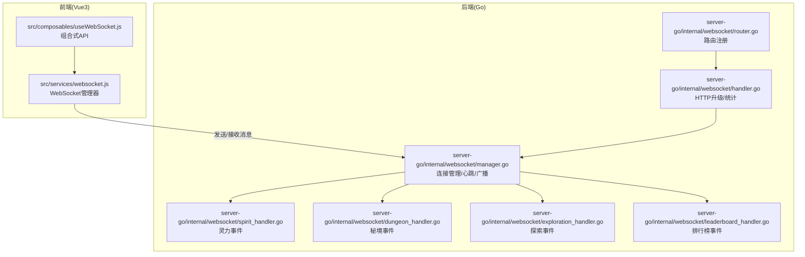
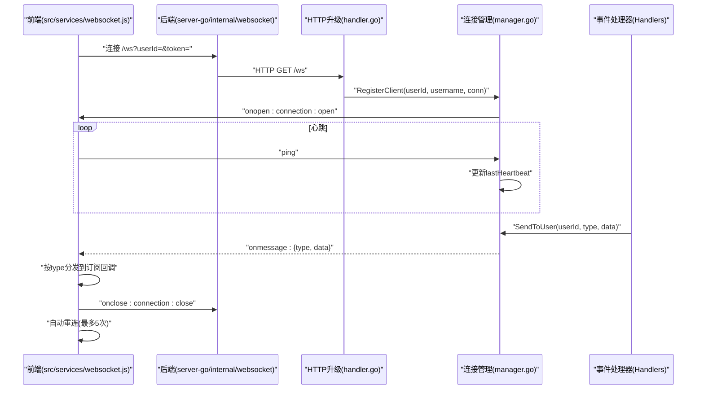
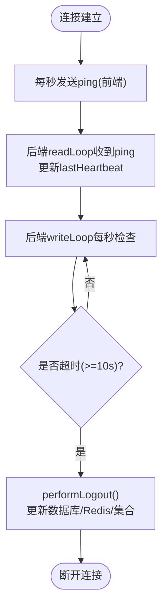
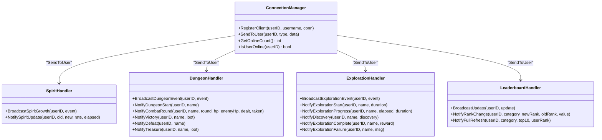
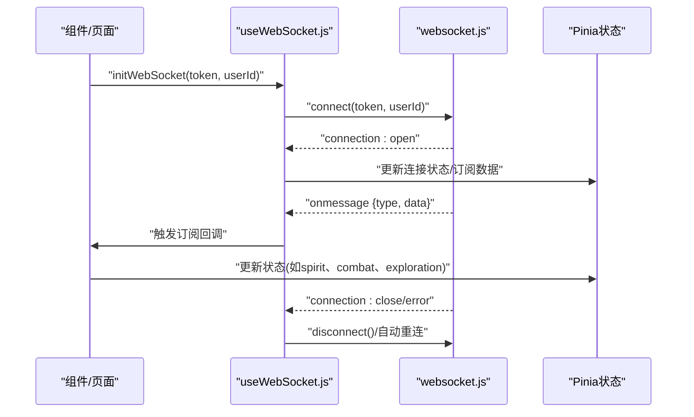
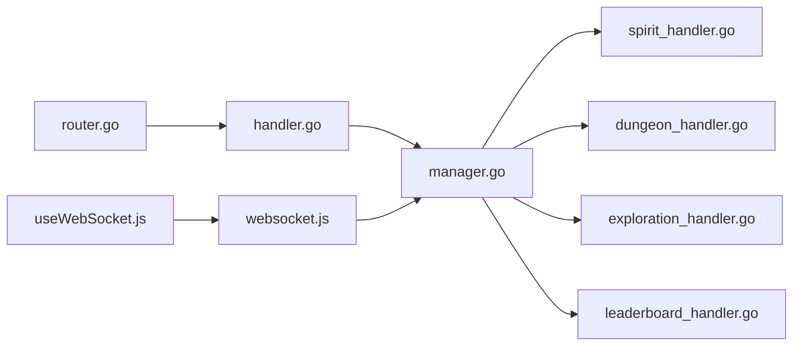

# 实时通信系统

<cite>
**本文引用的文件**
- [router.go](file://server-go/internal/websocket/router.go)
- [manager.go](file://server-go/internal/websocket/manager.go)
- [handler.go](file://server-go/internal/websocket/handler.go)
- [spirit_handler.go](file://server-go/internal/websocket/spirit_handler.go)
- [dungeon_handler.go](file://server-go/internal/websocket/dungeon_handler.go)
- [exploration_handler.go](file://server-go/internal/websocket/exploration_handler.go)
- [leaderboard_handler.go](file://server-go/internal/websocket/leaderboard_handler.go)
- [useWebSocket.js](file://src/composables/useWebSocket.js)
- [websocket.js](file://src/services/websocket.js)
- [WebSocket实现快速开始.md](file://WebSocket实现快速开始.md)
- [WebSocket改造完整实现指南.md](file://WebSocket改造完整实现指南.md)
- [HEARTBEAT_AND_LOGOUT_GUIDE.md](file://HEARTBEAT_AND_LOGOUT_GUIDE.md)
</cite>

## 目录
1. [引言](#引言)
2. [项目结构](#项目结构)
3. [核心组件](#核心组件)
4. [架构总览](#架构总览)
5. [详细组件分析](#详细组件分析)
6. [依赖关系分析](#依赖关系分析)
7. [性能考量](#性能考量)
8. [故障排查指南](#故障排查指南)
9. [结论](#结论)

## 引言
本文件系统化文档化 xiuxian-go 的 WebSocket 实时通信机制，覆盖后端路由与连接生命周期管理、各类事件处理器的职责与实现、前端连接建立与消息订阅、心跳与断线重连策略、消息序列化格式与性能优化，并结合“快速开始”和“完整实现指南”，帮助开发者快速理解与集成。

## 项目结构
- 后端（Go）：位于 server-go/internal/websocket，包含连接管理、HTTP 升级、路由注册、事件处理器（灵力、秘境、探索、排行榜）。
- 前端（Vue3）：位于 src/services 与 src/composables，包含 WebSocket 管理器、组合式 API 与状态更新逻辑。
- 文档：位于仓库根目录，提供快速开始、完整实现指南与心跳/自动下线指南。

图表来源
- [router.go](file://server-go/internal/websocket/router.go#L1-L36)
- [handler.go](file://server-go/internal/websocket/handler.go#L1-L100)
- [manager.go](file://server-go/internal/websocket/manager.go#L1-L309)
- [spirit_handler.go](file://server-go/internal/websocket/spirit_handler.go#L1-L122)
- [dungeon_handler.go](file://server-go/internal/websocket/dungeon_handler.go#L1-L144)
- [exploration_handler.go](file://server-go/internal/websocket/exploration_handler.go#L1-L149)
- [leaderboard_handler.go](file://server-go/internal/websocket/leaderboard_handler.go#L1-L137)
- [websocket.js](file://src/services/websocket.js#L1-L313)
- [useWebSocket.js](file://src/composables/useWebSocket.js#L1-L319)

章节来源
- [router.go](file://server-go/internal/websocket/router.go#L1-L36)
- [handler.go](file://server-go/internal/websocket/handler.go#L1-L100)
- [manager.go](file://server-go/internal/websocket/manager.go#L1-L309)
- [spirit_handler.go](file://server-go/internal/websocket/spirit_handler.go#L1-L122)
- [dungeon_handler.go](file://server-go/internal/websocket/dungeon_handler.go#L1-L144)
- [exploration_handler.go](file://server-go/internal/websocket/exploration_handler.go#L1-L149)
- [leaderboard_handler.go](file://server-go/internal/websocket/leaderboard_handler.go#L1-L137)
- [websocket.js](file://src/services/websocket.js#L1-L313)
- [useWebSocket.js](file://src/composables/useWebSocket.js#L1-L319)

## 核心组件
- WebSocket 路由与升级
  - 路由注册：提供 /ws 升级端点与 /ws/stats 统计端点。
  - HTTP 升级：从查询参数 userId/token 提取身份，升级为 WebSocket 连接并交由连接管理器接管。
- 连接管理器
  - 生命周期：注册/注销连接、广播消息、在线人数统计、在线状态查询。
  - 心跳与超时：每秒检查心跳，10 秒未收到心跳则触发自动下线。
  - 广播与队列：使用带缓冲的广播通道，非阻塞发送；队列满时丢弃并记录日志。
- 事件处理器
  - 灵力增长：按用户推送 spirit:grow。
  - 秘境事件：按用户推送 dungeon:event（start、combat_round、victory、defeat、treasure）。
  - 探索事件：按用户推送 exploration:event（start、progress、discovery、complete、failure）。
  - 排行榜更新：按用户推送 leaderboard:update（full_refresh、update、rank_up/rank_down）。
- 前端 WebSocket 管理器
  - 连接与重连：基于指数回退的自动重连策略，主动断开时停止重连。
  - 心跳：每秒发送 ping，维持连接活跃。
  - 订阅与分发：按消息 type 分发到对应回调，支持取消订阅。
- 前端组合式 API
  - useWebSocket：统一管理连接状态、订阅事件、更新 Pinia 状态。
  - useSpiritGrowth/useDungeonCombat/useLeaderboard/useExploration：封装事件历史与 UI 状态。

章节来源
- [router.go](file://server-go/internal/websocket/router.go#L1-L36)
- [handler.go](file://server-go/internal/websocket/handler.go#L1-L100)
- [manager.go](file://server-go/internal/websocket/manager.go#L1-L309)
- [spirit_handler.go](file://server-go/internal/websocket/spirit_handler.go#L1-L122)
- [dungeon_handler.go](file://server-go/internal/websocket/dungeon_handler.go#L1-L144)
- [exploration_handler.go](file://server-go/internal/websocket/exploration_handler.go#L1-L149)
- [leaderboard_handler.go](file://server-go/internal/websocket/leaderboard_handler.go#L1-L137)
- [websocket.js](file://src/services/websocket.js#L1-L313)
- [useWebSocket.js](file://src/composables/useWebSocket.js#L1-L319)

## 架构总览
WebSocket 实时通信采用“事件驱动 + 发布-订阅”的模式：
- 前端通过 ws://host:3000/ws?userId=...&token=... 建立连接。
- 后端在 goroutine 中维护连接池与广播通道，按用户 ID 将消息投递到对应客户端。
- 前端根据消息类型订阅并更新本地状态，同时维持心跳与自动重连。

图表来源
- [handler.go](file://server-go/internal/websocket/handler.go#L1-L100)
- [manager.go](file://server-go/internal/websocket/manager.go#L1-L309)
- [router.go](file://server-go/internal/websocket/router.go#L1-L36)
- [websocket.js](file://src/services/websocket.js#L1-L313)

## 详细组件分析

### 路由与升级（后端）
- 路由注册
  - /ws：用于升级 HTTP 到 WebSocket。
  - /ws/stats：返回在线人数等统计信息。
- HTTP 升级
  - 从查询参数提取 userId/token，校验后升级连接。
  - 从上下文获取用户名，注册到连接管理器。
  - 记录连接成功日志。

章节来源
- [router.go](file://server-go/internal/websocket/router.go#L1-L36)
- [handler.go](file://server-go/internal/websocket/handler.go#L1-L100)

### 连接管理器（后端）
- 结构与职责
  - clients：按用户 ID 管理连接。
  - broadcast/register/unregister：广播通道与注册/注销通道。
  - readLoop/writeLoop：分别负责读取消息与发送消息。
- 心跳与超时
  - 客户端每秒发送 ping，后端收到后更新 lastHeartbeat 并延长读超时。
  - writeLoop 每秒检查 lastHeartbeat 是否超时（默认 10 秒），超时则执行自动下线。
- 自动下线
  - 更新数据库 LastSpiritGainTime（与 Logout API 逻辑一致）。
  - 清理 Redis 在线状态与集合，记录日志。

图表来源
- [manager.go](file://server-go/internal/websocket/manager.go#L1-L309)
- [HEARTBEAT_AND_LOGOUT_GUIDE.md](file://HEARTBEAT_AND_LOGOUT_GUIDE.md#L1-L252)

章节来源
- [manager.go](file://server-go/internal/websocket/manager.go#L1-L309)
- [HEARTBEAT_AND_LOGOUT_GUIDE.md](file://HEARTBEAT_AND_LOGOUT_GUIDE.md#L1-L252)

### 事件处理器（后端）
- 灵力增长（spirit_handler.go）
  - 类型：spirit:grow
  - 字段：旧灵力、新灵力、增长量、速率、耗时、时间戳。
  - 发送：按用户 ID 广播。
- 秘境事件（dungeon_handler.go）
  - 类型：dungeon:event
  - 事件：start、combat_round、victory、defeat、treasure。
  - 发送：按用户 ID 广播，支持批量事件（带节流）。
- 探索事件（exploration_handler.go）
  - 类型：exploration:event
  - 事件：start、progress、discovery、complete、failure。
  - 发送：按用户 ID 广播，支持多次发现（带节流）。
- 排行榜更新（leaderboard_handler.go）
  - 类型：leaderboard:update
  - 更新：full_refresh、update、rank_up、rank_down。
  - 发送：按用户 ID 广播。

图表来源
- [manager.go](file://server-go/internal/websocket/manager.go#L1-L309)
- [spirit_handler.go](file://server-go/internal/websocket/spirit_handler.go#L1-L122)
- [dungeon_handler.go](file://server-go/internal/websocket/dungeon_handler.go#L1-L144)
- [exploration_handler.go](file://server-go/internal/websocket/exploration_handler.go#L1-L149)
- [leaderboard_handler.go](file://server-go/internal/websocket/leaderboard_handler.go#L1-L137)

章节来源
- [spirit_handler.go](file://server-go/internal/websocket/spirit_handler.go#L1-L122)
- [dungeon_handler.go](file://server-go/internal/websocket/dungeon_handler.go#L1-L144)
- [exploration_handler.go](file://server-go/internal/websocket/exploration_handler.go#L1-L149)
- [leaderboard_handler.go](file://server-go/internal/websocket/leaderboard_handler.go#L1-L137)

### 前端 WebSocket 管理器与组合式 API
- WebSocket 管理器（src/services/websocket.js）
  - 连接：构造 ws://host:3000/ws?userId=&token=，建立连接后启动心跳。
  - 重连：最多 5 次，延迟按尝试次数递增。
  - 心跳：每秒发送 { type: "ping" }。
  - 订阅：按 type 注册回调，on/off 取消订阅。
  - 错误与关闭：触发 connection:error/connection:close 事件。
- 组合式 API（src/composables/useWebSocket.js）
  - useWebSocket：统一管理连接状态、订阅事件、暴露数据与方法。
  - useSpiritGrowth/useDungeonCombat/useLeaderboard/useExploration：封装事件历史与 UI 状态，便于在组件中直接使用。

图表来源
- [websocket.js](file://src/services/websocket.js#L1-L313)
- [useWebSocket.js](file://src/composables/useWebSocket.js#L1-L319)

章节来源
- [websocket.js](file://src/services/websocket.js#L1-L313)
- [useWebSocket.js](file://src/composables/useWebSocket.js#L1-L319)

## 依赖关系分析
- 后端
  - router.go 依赖 handler.go 进行 HTTP 升级与统计。
  - handler.go 依赖 manager.go 注册连接。
  - manager.go 依赖各 Handler（spirit/dungeon/exploration/leaderboard）进行消息发送。
- 前端
  - useWebSocket.js 依赖 websocket.js 提供的连接与订阅能力。
  - 各业务 store 通过 useWebSocket.js 的订阅回调更新状态。

图表来源
- [router.go](file://server-go/internal/websocket/router.go#L1-L36)
- [handler.go](file://server-go/internal/websocket/handler.go#L1-L100)
- [manager.go](file://server-go/internal/websocket/manager.go#L1-L309)
- [spirit_handler.go](file://server-go/internal/websocket/spirit_handler.go#L1-L122)
- [dungeon_handler.go](file://server-go/internal/websocket/dungeon_handler.go#L1-L144)
- [exploration_handler.go](file://server-go/internal/websocket/exploration_handler.go#L1-L149)
- [leaderboard_handler.go](file://server-go/internal/websocket/leaderboard_handler.go#L1-L137)
- [useWebSocket.js](file://src/composables/useWebSocket.js#L1-L319)
- [websocket.js](file://src/services/websocket.js#L1-L313)

## 性能考量
- 后端
  - 广播通道缓冲：256 条消息，避免阻塞主循环。
  - 非阻塞发送：队列满时丢弃并记录日志，保证稳定性。
  - 读写分离：readLoop/ writeLoop 各自独立 goroutine，降低竞争。
  - 心跳与读超时：每秒检查心跳，读超时 60 秒，防止僵尸连接。
- 前端
  - 事件监听及时清理，避免内存泄漏。
  - 仅保留必要历史记录（如灵力/探索/战斗事件），减少渲染压力。
  - 自动重连延迟递增，降低服务器压力峰值。

章节来源
- [manager.go](file://server-go/internal/websocket/manager.go#L1-L309)
- [websocket.js](file://src/services/websocket.js#L1-L313)
- [WebSocket改造完整实现指南.md](file://WebSocket改造完整实现指南.md#L1-L732)

## 故障排查指南
- 连接失败
  - 检查后端是否启动、路由是否注册、userId/token 是否有效。
  - 查看前端 wsManager.isConnected 与 connection:open 事件。
- 消息未接收
  - 确认已订阅对应 type（如 spirit:grow、dungeon:event、exploration:event、leaderboard:update）。
  - 查看后端日志中“消息已发送”记录。
- 心跳与断线
  - 前端每秒发送 ping；后端 10 秒未收到心跳将自动下线。
  - 下线后前端触发 connection:close 并自动重连（最多 5 次）。
- Redis 在线状态
  - 心跳超时后，后端会从 Redis 集合移除玩家并标记 offline。
  - 如需手动清理，可检查 server:online:players 与 player:online:{id}。

章节来源
- [HEARTBEAT_AND_LOGOUT_GUIDE.md](file://HEARTBEAT_AND_LOGOUT_GUIDE.md#L1-L252)
- [websocket.js](file://src/services/websocket.js#L1-L313)
- [manager.go](file://server-go/internal/websocket/manager.go#L1-L309)

## 结论
本系统通过清晰的后端连接管理与事件处理器、稳定的前端连接与订阅模型，实现了低延迟、高可用的实时通信。心跳与自动下线保障了长连接的健康度，自动重连与缓冲通道提升了鲁棒性。结合“快速开始”和“完整实现指南”，开发者可快速集成并扩展至更多业务场景。