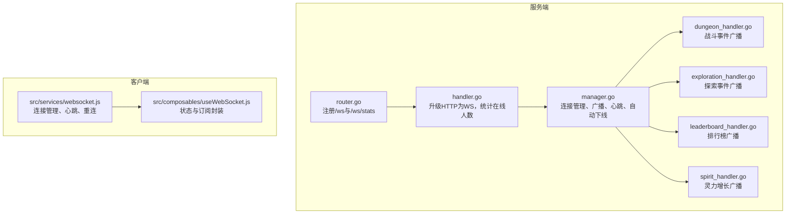
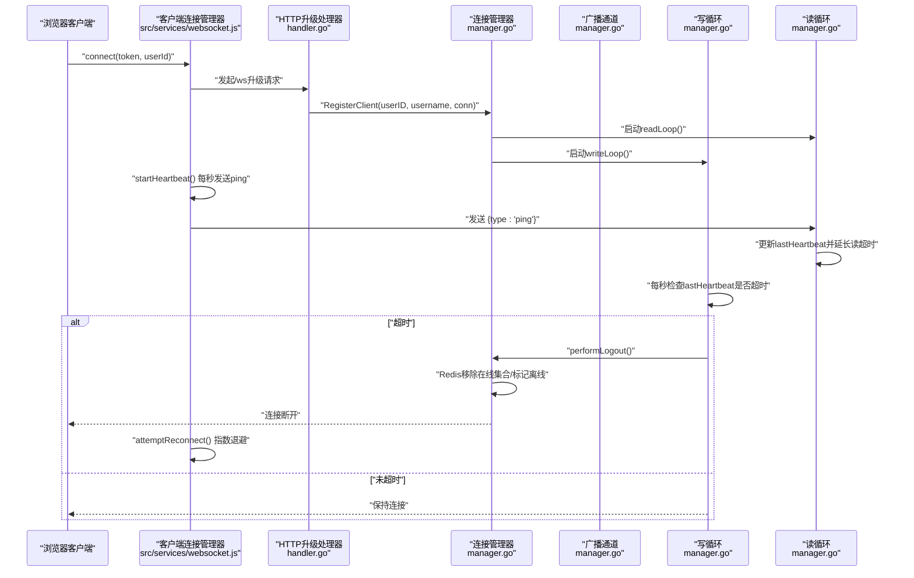
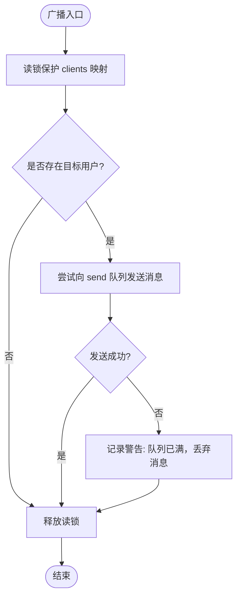
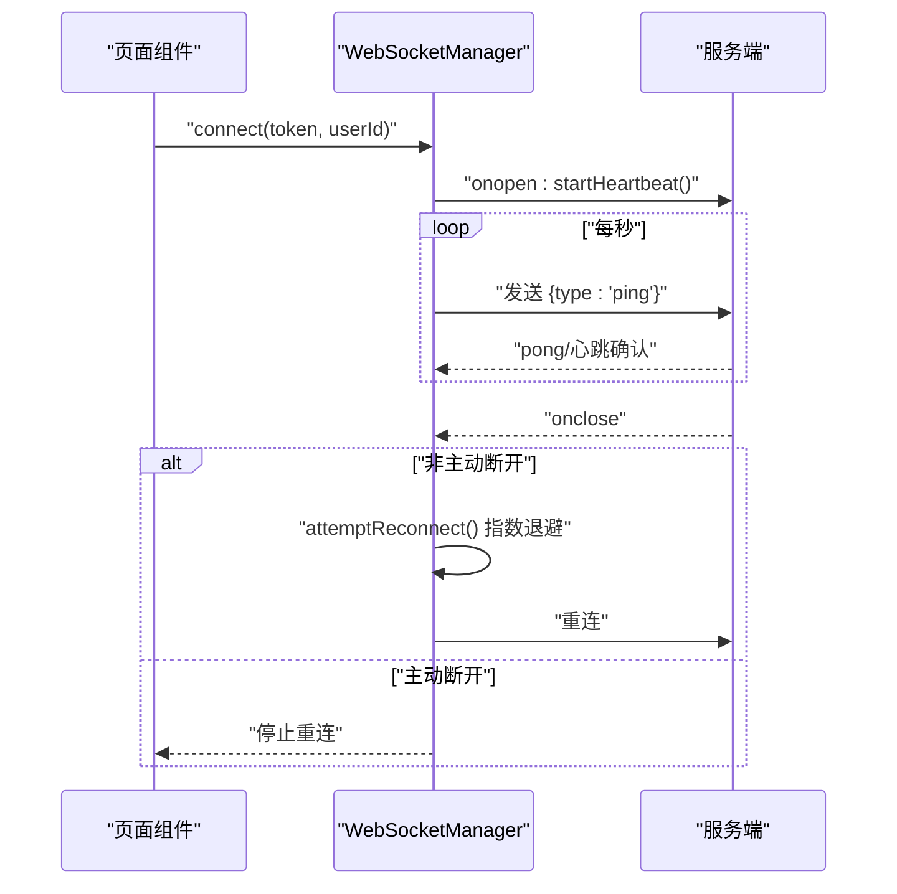
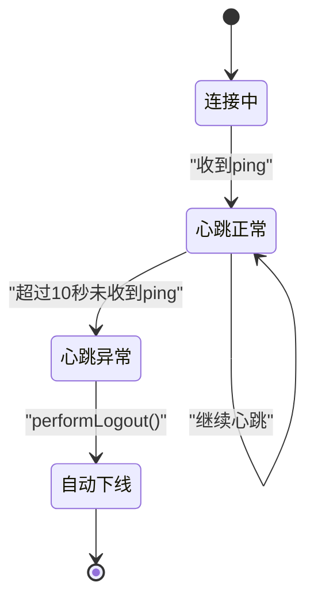
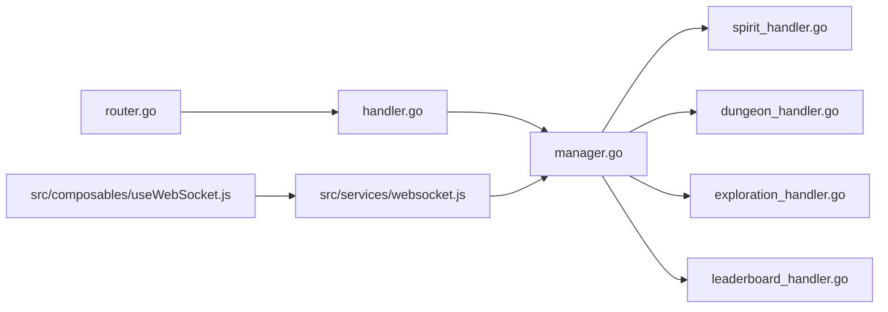

# 性能优化与可靠性保障

<cite>
**本文引用的文件**
- [server-go/internal/websocket/manager.go](file://server-go/internal/websocket/manager.go)
- [server-go/internal/websocket/handler.go](file://server-go/internal/websocket/handler.go)
- [server-go/internal/websocket/router.go](file://server-go/internal/websocket/router.go)
- [server-go/internal/websocket/dungeon_handler.go](file://server-go/internal/websocket/dungeon_handler.go)
- [server-go/internal/websocket/exploration_handler.go](file://server-go/internal/websocket/exploration_handler.go)
- [server-go/internal/websocket/leaderboard_handler.go](file://server-go/internal/websocket/leaderboard_handler.go)
- [server-go/internal/websocket/spirit_handler.go](file://server-go/internal/websocket/spirit_handler.go)
- [src/services/websocket.js](file://src/services/websocket.js)
- [src/composables/useWebSocket.js](file://src/composables/useWebSocket.js)
- [HEARTBEAT_AND_LOGOUT_GUIDE.md](file://HEARTBEAT_AND_LOGOUT_GUIDE.md)
- [test-websocket.js](file://test-websocket.js)
- [test-heartbeat-timeout.js](file://test-heartbeat-timeout.js)
</cite>

## 目录
1. [引言](#引言)
2. [项目结构](#项目结构)
3. [核心组件](#核心组件)
4. [架构总览](#架构总览)
5. [详细组件分析](#详细组件分析)
6. [依赖关系分析](#依赖关系分析)
7. [性能考量](#性能考量)
8. [故障排查指南](#故障排查指南)
9. [结论](#结论)
10. [附录](#附录)

## 引言
本文件系统化梳理WebSocket系统的性能优化与可靠性设计，重点覆盖以下方面：
- 服务端manager.go通过goroutine池、channel缓冲与非阻塞I/O提升高并发广播性能
- 客户端src/services/websocket.js采用指数退避重连策略与心跳保活，防止NAT超时断连
- 基于PING/PONG的心跳检测与自动下线流程，结合HEARTBEAT_AND_LOGOUT_GUIDE.md说明用户离线判定与资源清理
- 提供压力测试建议与监控指标（连接数、消息延迟）

## 项目结构
WebSocket子系统由“服务端路由与处理器 + 连接管理器 + 业务事件处理器 + 客户端连接管理”构成，整体分层清晰、职责明确。

图表来源
- [server-go/internal/websocket/router.go](file://server-go/internal/websocket/router.go#L1-L36)
- [server-go/internal/websocket/handler.go](file://server-go/internal/websocket/handler.go#L1-L100)
- [server-go/internal/websocket/manager.go](file://server-go/internal/websocket/manager.go#L1-L309)
- [server-go/internal/websocket/dungeon_handler.go](file://server-go/internal/websocket/dungeon_handler.go#L1-L144)
- [server-go/internal/websocket/exploration_handler.go](file://server-go/internal/websocket/exploration_handler.go#L1-L149)
- [server-go/internal/websocket/leaderboard_handler.go](file://server-go/internal/websocket/leaderboard_handler.go#L1-L137)
- [server-go/internal/websocket/spirit_handler.go](file://server-go/internal/websocket/spirit_handler.go#L1-L122)
- [src/services/websocket.js](file://src/services/websocket.js#L1-L313)
- [src/composables/useWebSocket.js](file://src/composables/useWebSocket.js#L1-L319)

章节来源
- [server-go/internal/websocket/router.go](file://server-go/internal/websocket/router.go#L1-L36)
- [server-go/internal/websocket/handler.go](file://server-go/internal/websocket/handler.go#L1-L100)
- [server-go/internal/websocket/manager.go](file://server-go/internal/websocket/manager.go#L1-L309)
- [src/services/websocket.js](file://src/services/websocket.js#L1-L313)
- [src/composables/useWebSocket.js](file://src/composables/useWebSocket.js#L1-L319)

## 核心组件
- 连接管理器（ConnectionManager）：维护在线用户映射、广播通道、注册/注销通道；启动广播循环与客户端读写goroutine；实现心跳检测与自动下线
- WebSocket处理器（WebSocketHandler）：负责HTTP升级为WebSocket、参数校验、统计接口
- 业务事件处理器：按领域拆分（灵力、战斗、探索、排行榜），统一通过manager发送至目标用户
- 客户端连接管理器（WebSocketManager）：封装连接生命周期、心跳发送、指数退避重连、事件派发

章节来源
- [server-go/internal/websocket/manager.go](file://server-go/internal/websocket/manager.go#L1-L309)
- [server-go/internal/websocket/handler.go](file://server-go/internal/websocket/handler.go#L1-L100)
- [server-go/internal/websocket/spirit_handler.go](file://server-go/internal/websocket/spirit_handler.go#L1-L122)
- [server-go/internal/websocket/dungeon_handler.go](file://server-go/internal/websocket/dungeon_handler.go#L1-L144)
- [server-go/internal/websocket/exploration_handler.go](file://server-go/internal/websocket/exploration_handler.go#L1-L149)
- [server-go/internal/websocket/leaderboard_handler.go](file://server-go/internal/websocket/leaderboard_handler.go#L1-L137)
- [src/services/websocket.js](file://src/services/websocket.js#L1-L313)

## 架构总览
WebSocket系统采用“事件驱动 + 广播模型”，服务端通过goroutine池与channel解耦生产者与消费者，客户端通过心跳与重连策略维持长连接稳定。

图表来源
- [server-go/internal/websocket/handler.go](file://server-go/internal/websocket/handler.go#L37-L73)
- [server-go/internal/websocket/manager.go](file://server-go/internal/websocket/manager.go#L107-L136)
- [server-go/internal/websocket/manager.go](file://server-go/internal/websocket/manager.go#L170-L256)
- [src/services/websocket.js](file://src/services/websocket.js#L36-L97)
- [src/services/websocket.js](file://src/services/websocket.js#L186-L205)
- [src/services/websocket.js](file://src/services/websocket.js#L209-L223)

## 详细组件分析

### 服务端连接管理器（manager.go）性能优化
- goroutine池与广播循环
  - 管理器启动一个主循环处理register/unregister/broadcast三种消息，分别对应连接注册、注销与广播
  - broadcast通道使用带缓冲的channel，避免阻塞上游生产者
- channel缓冲与非阻塞I/O
  - 广播通道容量为256，客户端发送队列容量为64，减少阻塞概率
  - 写循环在发送消息时设置写超时，读循环设置pong处理器并动态延长读超时，避免NAT超时导致连接中断
- 高并发广播路径
  - 广播循环在只读锁保护下查找目标客户端，发送采用非阻塞select，若队列满则记录警告并丢弃，避免阻塞整个广播循环
- 心跳与自动下线
  - 写循环每秒检查lastHeartbeat是否超时（默认10秒），超时后异步执行performLogout，清理Redis在线状态与集合，随后断开连接

图表来源
- [server-go/internal/websocket/manager.go](file://server-go/internal/websocket/manager.go#L85-L98)

章节来源
- [server-go/internal/websocket/manager.go](file://server-go/internal/websocket/manager.go#L1-L309)

### 服务端HTTP升级与统计（handler.go）
- 升级流程：校验userId/token，升级为WebSocket，注册连接
- 统计接口：返回当前在线人数，便于运维监控

章节来源
- [server-go/internal/websocket/handler.go](file://server-go/internal/websocket/handler.go#L1-L100)

### 业务事件处理器（spirit/dungeon/exploration/leaderboard）
- 统一通过manager.SendToUser将消息发送给指定用户，内部序列化消息并写入广播通道
- 各处理器提供领域内事件构造与批量广播能力，必要时对事件发送增加节流（如毫秒级sleep）

章节来源
- [server-go/internal/websocket/spirit_handler.go](file://server-go/internal/websocket/spirit_handler.go#L42-L81)
- [server-go/internal/websocket/dungeon_handler.go](file://server-go/internal/websocket/dungeon_handler.go#L38-L57)
- [server-go/internal/websocket/exploration_handler.go](file://server-go/internal/websocket/exploration_handler.go#L38-L57)
- [server-go/internal/websocket/leaderboard_handler.go](file://server-go/internal/websocket/leaderboard_handler.go#L51-L68)

### 客户端连接管理器（src/services/websocket.js）重连与心跳
- 心跳策略：每秒发送一次ping，连接建立后启动心跳定时器，断开时停止
- 断线重连：指数退避（第n次重连延迟为reconnectDelay*n），最多重连maxReconnectAttempts次；主动断开时不重连
- 事件派发：根据消息类型触发对应监听器回调，支持订阅/取消订阅

图表来源
- [src/services/websocket.js](file://src/services/websocket.js#L36-L97)
- [src/services/websocket.js](file://src/services/websocket.js#L186-L205)
- [src/services/websocket.js](file://src/services/websocket.js#L209-L223)

章节来源
- [src/services/websocket.js](file://src/services/websocket.js#L1-L313)

### 客户端组合式API（src/composables/useWebSocket.js）
- 提供useWebSocket钩子，封装连接状态、订阅事件、断开连接与状态查询
- 与wsManager配合，实现UI层对WebSocket的声明式使用

章节来源
- [src/composables/useWebSocket.js](file://src/composables/useWebSocket.js#L1-L319)

### 基于PING/PONG的心跳检测与自动下线（manager.go + HEARTBEAT_AND_LOGOUT_GUIDE.md）
- 心跳发送：前端每秒发送ping
- 心跳接收：readLoop收到ping后更新lastHeartbeat并延长读超时
- 超时检测：writeLoop每秒检查lastHeartbeat是否超过heartbeatTimeout（默认10秒），超时后performLogout
- 自动下线：performLogout更新数据库最近灵力增长时间戳，清理Redis在线集合与状态，记录日志

图表来源
- [server-go/internal/websocket/manager.go](file://server-go/internal/websocket/manager.go#L170-L256)
- [server-go/internal/websocket/manager.go](file://server-go/internal/websocket/manager.go#L258-L309)
- [HEARTBEAT_AND_LOGOUT_GUIDE.md](file://HEARTBEAT_AND_LOGOUT_GUIDE.md#L1-L252)

章节来源
- [server-go/internal/websocket/manager.go](file://server-go/internal/websocket/manager.go#L170-L309)
- [HEARTBEAT_AND_LOGOUT_GUIDE.md](file://HEARTBEAT_AND_LOGOUT_GUIDE.md#L1-L252)

## 依赖关系分析
- 服务端路由注册与处理器初始化
  - router.go注册/ws与/ws/stats，并初始化各事件处理器
  - handler.go负责HTTP升级与统计
  - manager.go作为核心枢纽，被各处理器依赖
- 客户端依赖
  - src/services/websocket.js提供连接、心跳、重连与事件派发
  - src/composables/useWebSocket.js封装状态与订阅，供Vue组件使用

图表来源
- [server-go/internal/websocket/router.go](file://server-go/internal/websocket/router.go#L1-L36)
- [server-go/internal/websocket/handler.go](file://server-go/internal/websocket/handler.go#L1-L100)
- [server-go/internal/websocket/manager.go](file://server-go/internal/websocket/manager.go#L1-L309)
- [server-go/internal/websocket/spirit_handler.go](file://server-go/internal/websocket/spirit_handler.go#L1-L122)
- [server-go/internal/websocket/dungeon_handler.go](file://server-go/internal/websocket/dungeon_handler.go#L1-L144)
- [server-go/internal/websocket/exploration_handler.go](file://server-go/internal/websocket/exploration_handler.go#L1-L149)
- [server-go/internal/websocket/leaderboard_handler.go](file://server-go/internal/websocket/leaderboard_handler.go#L1-L137)
- [src/services/websocket.js](file://src/services/websocket.js#L1-L313)
- [src/composables/useWebSocket.js](file://src/composables/useWebSocket.js#L1-L319)

章节来源
- [server-go/internal/websocket/router.go](file://server-go/internal/websocket/router.go#L1-L36)
- [server-go/internal/websocket/handler.go](file://server-go/internal/websocket/handler.go#L1-L100)
- [server-go/internal/websocket/manager.go](file://server-go/internal/websocket/manager.go#L1-L309)
- [src/services/websocket.js](file://src/services/websocket.js#L1-L313)
- [src/composables/useWebSocket.js](file://src/composables/useWebSocket.js#L1-L319)

## 性能考量
- 广播性能
  - 广播通道与客户端发送队列均设置合理缓冲，降低阻塞概率
  - 广播循环使用只读锁保护映射查询，发送采用非阻塞select，避免阻塞整个广播循环
- I/O超时与NAT穿透
  - 读循环设置pong处理器并动态延长读超时，写循环每秒检查心跳，有效防止NAT超时断连
- 事件节流
  - 部分处理器在批量广播时加入微小sleep，避免事件过于密集导致拥塞
- 监控与统计
  - 提供/ws/stats接口返回在线人数，便于压测与运行期观测

章节来源
- [server-go/internal/websocket/manager.go](file://server-go/internal/websocket/manager.go#L85-L98)
- [server-go/internal/websocket/manager.go](file://server-go/internal/websocket/manager.go#L170-L256)
- [server-go/internal/websocket/dungeon_handler.go](file://server-go/internal/websocket/dungeon_handler.go#L133-L143)
- [server-go/internal/websocket/exploration_handler.go](file://server-go/internal/websocket/exploration_handler.go#L135-L148)
- [server-go/internal/websocket/handler.go](file://server-go/internal/websocket/handler.go#L75-L81)

## 故障排查指南
- 心跳超时自动下线
  - 现象：后端日志出现“心跳超时，正在下线”与“心跳超时自动下线”
  - 排查：确认前端每秒发送ping；检查Redis在线集合与状态字段是否清理
- 重连失败
  - 现象：达到最大重连次数后停止重连
  - 排查：检查网络连通性、服务端升级是否成功、token与userId是否正确
- 广播丢弃
  - 现象：日志出现“消息队列已满，丢弃消息”
  - 排查：增大send队列容量或优化消费端处理速度

章节来源
- [server-go/internal/websocket/manager.go](file://server-go/internal/websocket/manager.go#L85-L98)
- [src/services/websocket.js](file://src/services/websocket.js#L209-L223)
- [HEARTBEAT_AND_LOGOUT_GUIDE.md](file://HEARTBEAT_AND_LOGOUT_GUIDE.md#L1-L252)

## 结论
本WebSocket系统通过“goroutine池 + channel缓冲 + 非阻塞I/O + 心跳保活 + 指数退避重连”的组合拳，在高并发场景下实现了稳定的广播性能与可靠的连接可用性。心跳与自动下线机制确保了用户离线状态的准确判定与资源及时清理，配合监控接口与测试脚本，便于持续优化与运维保障。

## 附录
- 压力测试建议
  - 使用test-websocket.js与test-heartbeat-timeout.js进行端到端验证
  - 关注指标：连接数、消息延迟（从发送到接收）、广播丢弃率、重连次数与成功率
- 监控指标
  - 连接数：/ws/stats返回的onlineCount
  - 消息延迟：客户端记录发送时间与收到时间差值的分布
  - 广播丢弃：manager日志中“消息队列已满，丢弃消息”的计数
  - 心跳与下线：manager日志中“心跳超时，正在下线”与“心跳超时自动下线”的计数

章节来源
- [test-websocket.js](file://test-websocket.js#L1-L205)
- [test-heartbeat-timeout.js](file://test-heartbeat-timeout.js#L1-L206)
- [server-go/internal/websocket/handler.go](file://server-go/internal/websocket/handler.go#L75-L81)