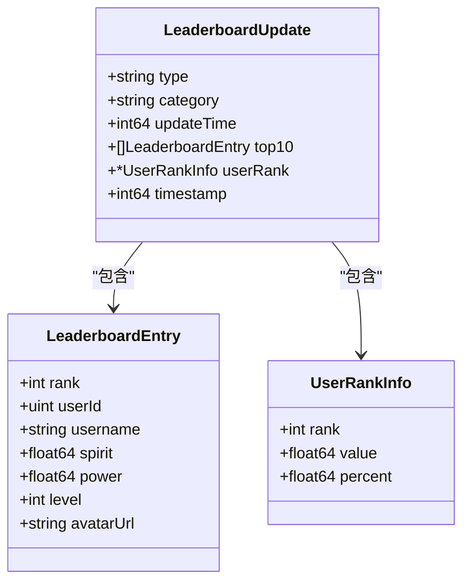
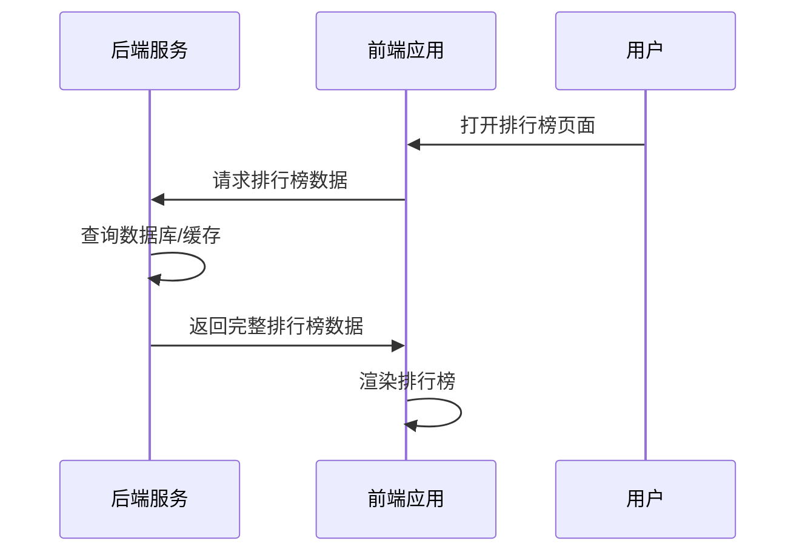
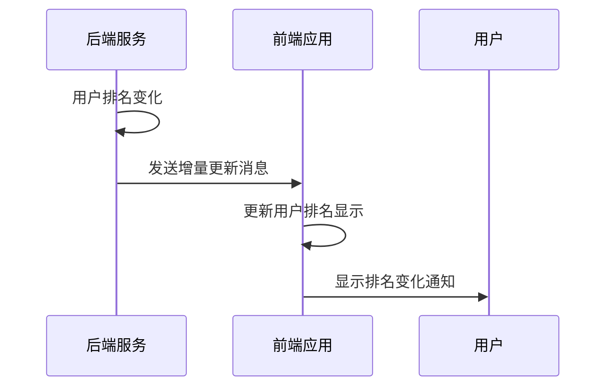
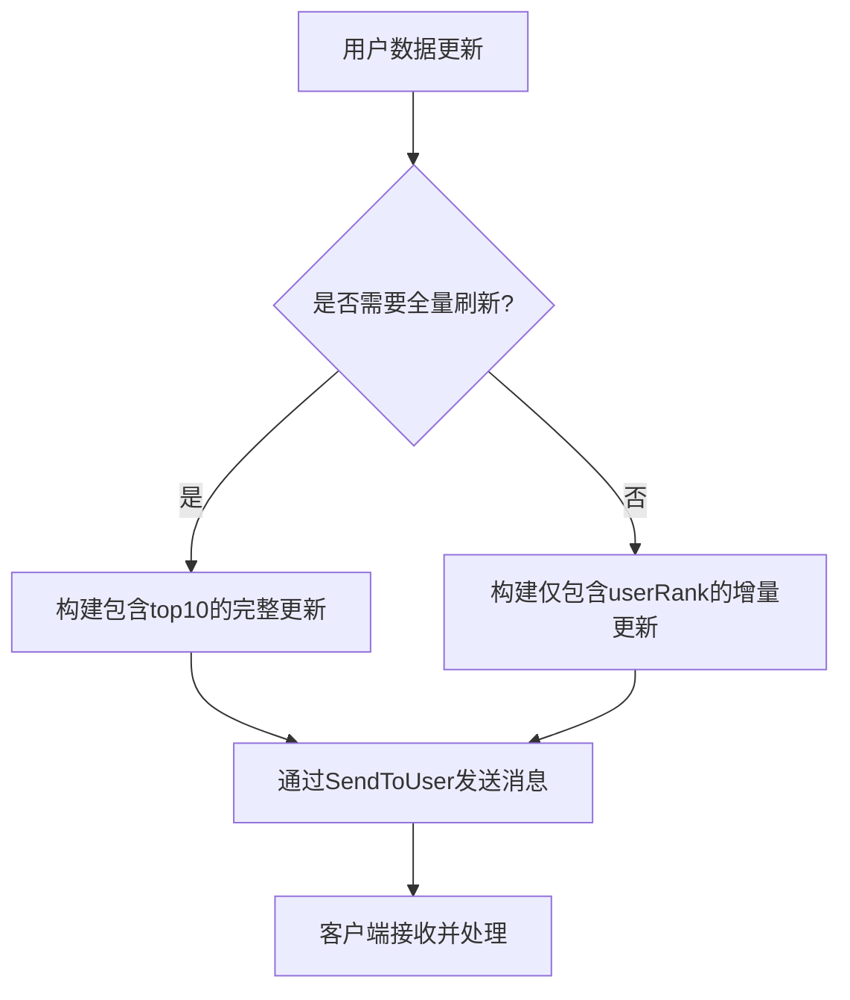
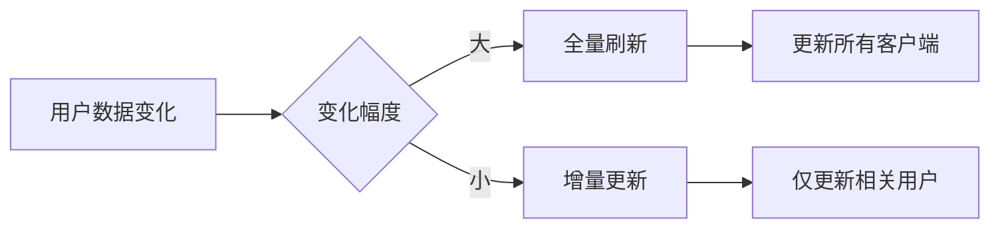
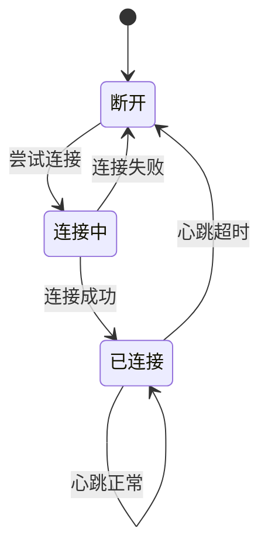

# 排行榜消息协议

<cite>
**本文档引用的文件**
- [leaderboard_handler.go](file://server-go/internal/websocket/leaderboard_handler.go)
- [useWebSocket.js](file://src/composables/useWebSocket.js)
- [websocket.js](file://src/services/websocket.js)
- [player_handler.go](file://server-go/internal/http/handlers/player/player_handler.go)
- [manager.go](file://server-go/internal/websocket/manager.go)
</cite>

## 目录
1. [排行榜消息结构](#排行榜消息结构)
2. [全量刷新与增量更新](#全量刷新与增量更新)
3. [实时同步流程](#实时同步流程)
4. [性能优化建议](#性能优化建议)
5. [错误处理与重连机制](#错误处理与重连机制)

## 排行榜消息结构

排行榜通过WebSocket的`leaderboard:update`消息类型进行实时更新。消息体包含以下核心字段：

- **type**: 更新类型，可取值为`full_refresh`（全量刷新）或`update`（增量更新）
- **category**: 排行榜类别，包括`spirit`（灵力）、`power`（战力）、`level`（等级）
- **top10**: 排行榜前10名的完整数据列表
- **userRank**: 当前用户在该排行榜中的排名信息
- **timestamp**: 消息发送的时间戳

具体数据结构定义如下：



**Diagram sources**
- [leaderboard_handler.go](file://server-go/internal/websocket/leaderboard_handler.go#L10-L35)

**Section sources**
- [leaderboard_handler.go](file://server-go/internal/websocket/leaderboard_handler.go#L10-L35)

## 全量刷新与增量更新

系统根据不同的业务场景采用两种更新策略：

### 全量刷新 (full_refresh)
在用户首次加载排行榜或重新上线时触发，包含完整的`top10`数据和`userRank`信息。这种更新方式确保客户端获得完整的排行榜状态。



**Diagram sources**
- [player_handler.go](file://server-go/internal/http/handlers/player/player_handler.go#L188-L209)
- [useWebSocket.js](file://src/composables/useWebSocket.js#L234-L249)

### 增量更新 (update)
当用户排名发生变化但不需要刷新整个排行榜时使用。仅包含`userRank`信息，减少了网络传输的数据量。



**Diagram sources**
- [leaderboard_handler.go](file://server-go/internal/websocket/leaderboard_handler.go#L70-L91)
- [useWebSocket.js](file://src/composables/useWebSocket.js#L249-L251)

**Section sources**
- [leaderboard_handler.go](file://server-go/internal/websocket/leaderboard_handler.go#L70-L91)
- [useWebSocket.js](file://src/composables/useWebSocket.js#L249-L251)

## 实时同步流程

排行榜数据的实时同步涉及后端广播逻辑和前端数据处理两个主要部分。

### 后端广播逻辑

后端通过`LeaderboardHandler`实现排行榜更新的广播。当用户数据发生变化时，系统会调用相应的通知方法：

```go
// 通知灵力排行榜更新
func (lh *LeaderboardHandler) NotifySpiritLeaderboardUpdate(userID uint, top10 []LeaderboardEntry, userRank *UserRankInfo) error {
    return lh.NotifyFullRefresh(userID, "spirit", top10, userRank)
}
```

广播过程通过`ConnectionManager`将消息发送给指定用户：



**Diagram sources**
- [leaderboard_handler.go](file://server-go/internal/websocket/leaderboard_handler.go#L51-L67)
- [manager.go](file://server-go/internal/websocket/manager.go#L137-L152)

### 前端数据处理

前端通过`useLeaderboard`组合式API处理排行榜更新消息：

```javascript
function handleLeaderboardUpdate(data) {
    const category = data.category;
    
    if (data.type === 'full_refresh') {
        leaderboards.value[category] = {
            top10: data.top10 || [],
            userRank: data.userRank
        };
    } else if (data.type === 'update') {
        leaderboards.value[category].userRank = data.userRank;
    }
}
```

**Section sources**
- [useWebSocket.js](file://src/composables/useWebSocket.js#L241-L254)
- [websocket.js](file://src/services/websocket.js#L286-L288)

## 性能优化建议

为提高系统性能和用户体验，建议采取以下优化措施：

1. **减少全量更新频率**：避免在每次排名变化时都进行全量刷新，仅在必要时（如用户首次加载）使用`full_refresh`

2. **合理使用增量更新**：对于排名微小变化，优先使用`update`类型，只传输用户排名信息

3. **批量处理更新**：对于频繁变化的排行榜，可以考虑批量处理更新请求，减少消息发送频率

4. **缓存排行榜数据**：在后端缓存排行榜数据，避免每次请求都查询数据库

5. **优化数据传输**：对于不需要显示头像的场景，可以考虑不传输`avatarUrl`字段



**Diagram sources**
- [leaderboard_handler.go](file://server-go/internal/websocket/leaderboard_handler.go#L70-L91)

## 错误处理与重连机制

系统实现了完善的错误处理和重连机制，确保排行榜数据的可靠传输：

- 当WebSocket连接失败时，前端会自动尝试重连
- 后端在发送消息失败时会记录错误日志
- 心跳机制确保连接的活跃状态
- 断线重连后，客户端会重新请求完整的排行榜数据



**Diagram sources**
- [websocket.js](file://src/services/websocket.js#L210-L223)
- [manager.go](file://server-go/internal/websocket/manager.go#L170-L213)

**Section sources**
- [websocket.js](file://src/services/websocket.js#L210-L223)
- [manager.go](file://server-go/internal/websocket/manager.go#L170-L213)