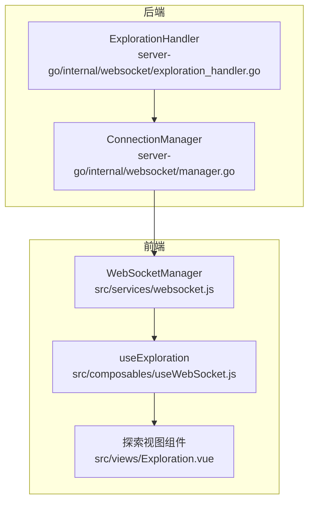
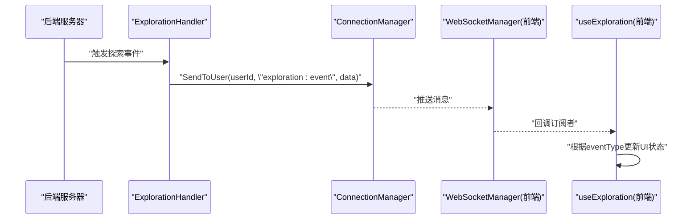
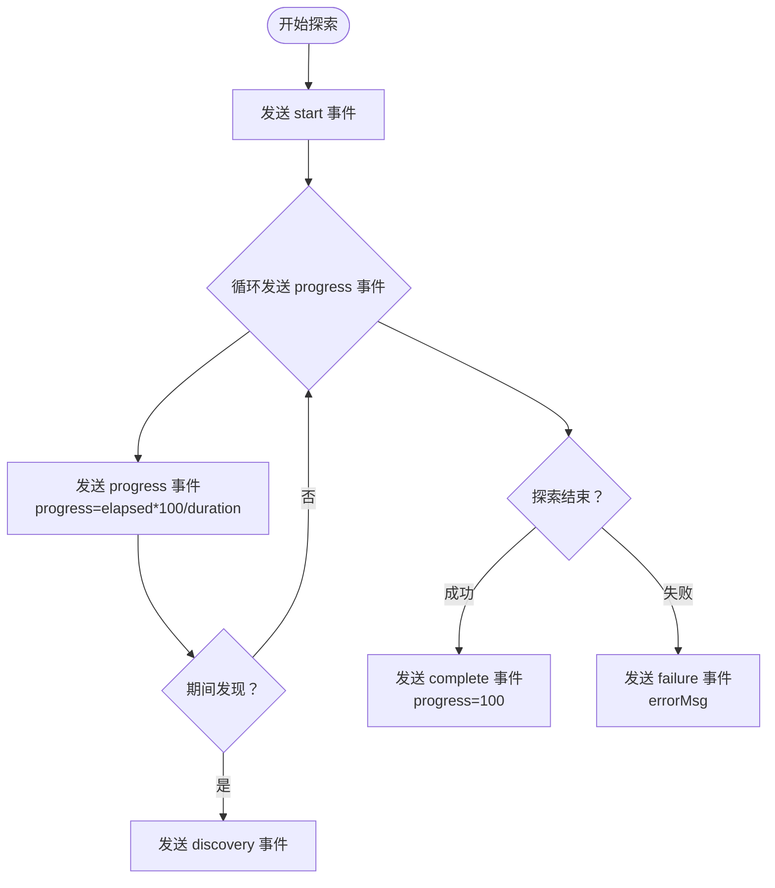
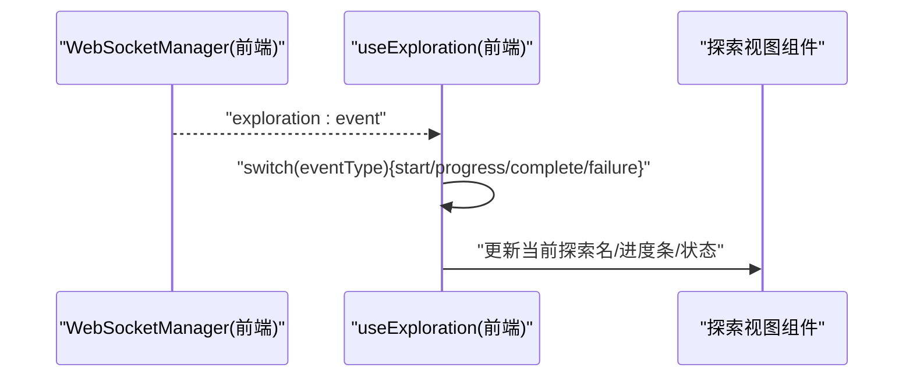
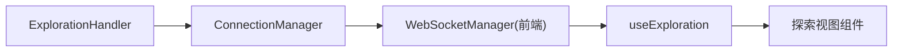

# 探索系统消息协议

<cite>
**本文引用的文件**
- [server-go/internal/websocket/exploration_handler.go](file://server-go/internal/websocket/exploration_handler.go)
- [server-go/internal/websocket/manager.go](file://server-go/internal/websocket/manager.go)
- [src/services/websocket.js](file://src/services/websocket.js)
- [src/composables/useWebSocket.js](file://src/composables/useWebSocket.js)
- [src/views/Exploration.vue](file://src/views/Exploration.vue)
- [WebSocket实现快速开始.md](file://WebSocket实现快速开始.md)
- [WebSocket改造完整实现指南.md](file://WebSocket改造完整实现指南.md)
- [server-go/internal/exploration/service.go](file://server-go/internal/exploration/service.go)
- [server-go/internal/exploration/models.go](file://server-go/internal/exploration/models.go)
</cite>

## 目录
1. [简介](#简介)
2. [项目结构](#项目结构)
3. [核心组件](#核心组件)
4. [架构总览](#架构总览)
5. [详细组件分析](#详细组件分析)
6. [依赖关系分析](#依赖关系分析)
7. [性能考量](#性能考量)
8. [故障排查指南](#故障排查指南)
9. [结论](#结论)
10. [附录](#附录)

## 简介
本文件系统化文档化“探索系统”的实时消息协议，重点围绕 WebSocket 推送的探索事件消息格式与前端实时反馈流程，明确以下要点：
- 探索事件消息类型：start、progress、discovery、complete、failure
- 消息字段规范：progress、eventType、exploreName、message、durationSecs、elapsedSecs、discovery、reward、errorMsg、timestamp 等
- 后端广播逻辑与前端订阅处理链路
- 从开始探索到完成的完整消息流示例
- 前端基于消息更新 UI 的策略与网络延迟对体验的影响及应对策略

## 项目结构
探索系统涉及前后端协作的关键文件如下：
- 后端 WebSocket 探索事件处理器：负责构造并广播探索事件
- WebSocket 连接管理器：负责消息路由、心跳、连接生命周期
- 前端 WebSocket 管理器与组合式 API：负责连接、订阅、消息分发与 UI 更新
- 探索业务服务与模型：用于生成探索结果与事件（与 WebSocket 探索事件不同维度，但共同构成探索体验）

图表来源
- [server-go/internal/websocket/exploration_handler.go](file://server-go/internal/websocket/exploration_handler.go#L1-L149)
- [server-go/internal/websocket/manager.go](file://server-go/internal/websocket/manager.go#L1-L309)
- [src/services/websocket.js](file://src/services/websocket.js#L1-L313)
- [src/composables/useWebSocket.js](file://src/composables/useWebSocket.js#L1-L319)
- [src/views/Exploration.vue](file://src/views/Exploration.vue#L1-L223)

章节来源
- [server-go/internal/websocket/exploration_handler.go](file://server-go/internal/websocket/exploration_handler.go#L1-L149)
- [server-go/internal/websocket/manager.go](file://server-go/internal/websocket/manager.go#L1-L309)
- [src/services/websocket.js](file://src/services/websocket.js#L1-L313)
- [src/composables/useWebSocket.js](file://src/composables/useWebSocket.js#L1-L319)
- [src/views/Exploration.vue](file://src/views/Exploration.vue#L1-L223)

## 核心组件
- 探索事件消息结构（后端定义）
  - 字段：userId、eventType、exploreName、message、progress、durationSecs、elapsedSecs、discovery、reward、errorMsg、timestamp
  - 类型：exploration:event
- 探索事件处理器
  - 提供 start、progress、discovery、complete、failure 通知方法
  - 通过连接管理器按用户广播
- WebSocket 管理器
  - 负责连接、心跳、消息分发、重连与断开
- 前端 useExploration
  - 订阅 exploration:event，维护当前探索状态与进度条
  - 根据 eventType 更新 UI

章节来源
- [server-go/internal/websocket/exploration_handler.go](file://server-go/internal/websocket/exploration_handler.go#L9-L22)
- [server-go/internal/websocket/exploration_handler.go](file://server-go/internal/websocket/exploration_handler.go#L59-L149)
- [server-go/internal/websocket/manager.go](file://server-go/internal/websocket/manager.go#L41-L48)
- [src/services/websocket.js](file://src/services/websocket.js#L1-L313)
- [src/composables/useWebSocket.js](file://src/composables/useWebSocket.js#L267-L319)

## 架构总览
WebSocket 探索事件从后端处理器生成，经连接管理器路由至目标用户，前端 WebSocket 管理器接收并分发给 useExploration，后者据此更新 UI。

图表来源
- [server-go/internal/websocket/exploration_handler.go](file://server-go/internal/websocket/exploration_handler.go#L38-L57)
- [server-go/internal/websocket/manager.go](file://server-go/internal/websocket/manager.go#L137-L153)
- [src/services/websocket.js](file://src/services/websocket.js#L102-L128)
- [src/composables/useWebSocket.js](file://src/composables/useWebSocket.js#L65-L73)

## 详细组件分析

### 探索事件消息结构与字段规范
- 消息类型：exploration:event
- 字段定义（后端结构体）
  - userId：接收用户ID
  - eventType：事件类型，取值范围 start、progress、discovery、complete、failure
  - exploreName：探索地点名称
  - message：事件提示文本
  - progress：进度百分比（0-100）
  - durationSecs：总时长（秒）
  - elapsedSecs：已用时长（秒）
  - discovery：发现内容（对象或数组，按 discovery 事件）
  - reward：奖励内容（对象，按 complete 事件）
  - errorMsg：失败信息（按 failure 事件）
  - timestamp：消息时间戳（Unix 秒）

章节来源
- [server-go/internal/websocket/exploration_handler.go](file://server-go/internal/websocket/exploration_handler.go#L9-L22)
- [server-go/internal/websocket/exploration_handler.go](file://server-go/internal/websocket/exploration_handler.go#L59-L149)

### 后端广播逻辑
- NotifyExplorationStart：发送开始事件，progress=0
- NotifyExplorationProgress：按 elapsed/duration 计算进度并发送 progress 事件
- NotifyDiscovery：发送 discovery 事件，携带 discovery 内容
- NotifyExplorationComplete：发送完成事件，progress=100，携带 reward
- NotifyExplorationFailure：发送失败事件，携带 errorMsg
- BroadcastExplorationEvent：统一构造消息并调用 SendToUser 广播

图表来源
- [server-go/internal/websocket/exploration_handler.go](file://server-go/internal/websocket/exploration_handler.go#L59-L149)

章节来源
- [server-go/internal/websocket/exploration_handler.go](file://server-go/internal/websocket/exploration_handler.go#L59-L149)

### 前端订阅与 UI 更新
- 前端通过 subscribeExplorationEvent 订阅 exploration:event
- useExploration 根据 eventType 更新：
  - start：记录探索地点，进度归零
  - progress：更新进度条
  - complete/failure：清空当前探索与进度
- 前端 WebSocket 管理器负责连接、心跳、重连与消息分发

图表来源
- [src/services/websocket.js](file://src/services/websocket.js#L102-L128)
- [src/composables/useWebSocket.js](file://src/composables/useWebSocket.js#L267-L319)
- [src/views/Exploration.vue](file://src/views/Exploration.vue#L1-L223)

章节来源
- [src/services/websocket.js](file://src/services/websocket.js#L1-L313)
- [src/composables/useWebSocket.js](file://src/composables/useWebSocket.js#L267-L319)
- [src/views/Exploration.vue](file://src/views/Exploration.vue#L1-L223)

### 与探索业务服务的关系
- 探索业务服务（service.go）负责探索过程的业务逻辑与事件生成，其输出可能与 WebSocket 探索事件协同工作
- 探索模型（models.go）定义了探索相关的事件类型与数据结构，便于前后端对齐

章节来源
- [server-go/internal/exploration/service.go](file://server-go/internal/exploration/service.go#L1-L515)
- [server-go/internal/exploration/models.go](file://server-go/internal/exploration/models.go#L1-L128)

## 依赖关系分析
- 后端
  - ExplorationHandler 依赖 ConnectionManager 进行消息广播
  - ConnectionManager 依赖 gorilla/websocket 进行连接管理与心跳
- 前端
  - WebSocketManager 负责连接、心跳、消息分发与重连
  - useExploration 依赖 WebSocketManager 的订阅接口

图表来源
- [server-go/internal/websocket/exploration_handler.go](file://server-go/internal/websocket/exploration_handler.go#L1-L149)
- [server-go/internal/websocket/manager.go](file://server-go/internal/websocket/manager.go#L1-L309)
- [src/services/websocket.js](file://src/services/websocket.js#L1-L313)
- [src/composables/useWebSocket.js](file://src/composables/useWebSocket.js#L1-L319)

章节来源
- [server-go/internal/websocket/exploration_handler.go](file://server-go/internal/websocket/exploration_handler.go#L1-L149)
- [server-go/internal/websocket/manager.go](file://server-go/internal/websocket/manager.go#L1-L309)
- [src/services/websocket.js](file://src/services/websocket.js#L1-L313)
- [src/composables/useWebSocket.js](file://src/composables/useWebSocket.js#L1-L319)

## 性能考量
- 心跳与超时
  - 前端每秒发送 ping；后端读超时与心跳超时控制连接存活
- 消息队列与背压
  - 后端广播通道与客户端发送通道均有限容量，避免阻塞
- 重连策略
  - 前端指数回退重连，避免雪崩
- UI 更新节流
  - 前端可对高频 progress 事件做节流/去抖，减少渲染压力

章节来源
- [server-go/internal/websocket/manager.go](file://server-go/internal/websocket/manager.go#L170-L256)
- [src/services/websocket.js](file://src/services/websocket.js#L174-L238)
- [WebSocket改造完整实现指南.md](file://WebSocket改造完整实现指南.md#L618-L677)

## 故障排查指南
- 连接失败
  - 检查 userId、token 参数是否正确传递
  - 确认 WebSocket 路由与端口配置
- 无法接收消息
  - 确认已订阅 exploration:event
  - 检查前端连接状态与心跳是否正常
- 探索进度异常
  - 检查 elapsedSecs 与 durationSecs 是否合理
  - 确认 progress 计算逻辑与边界值（不超过100）
- 失败与错误信息
  - failure 事件包含 errorMsg，前端应展示并允许重试

章节来源
- [src/services/websocket.js](file://src/services/websocket.js#L1-L313)
- [src/composables/useWebSocket.js](file://src/composables/useWebSocket.js#L267-L319)
- [server-go/internal/websocket/exploration_handler.go](file://server-go/internal/websocket/exploration_handler.go#L122-L149)

## 结论
- 探索系统通过 WebSocket 实现实时进度与事件推送，消息类型覆盖 start、progress、discovery、complete、failure
- 前端 useExploration 基于 eventType 与 progress 字段实现进度条与状态切换
- 后端通过 ExplorationHandler 与 ConnectionManager 确保消息可靠投递
- 建议在网络波动场景下采用心跳、重连与 UI 节流策略，保障用户体验

## 附录

### 完整消息流示例（从开始到完成）
- start：发送探索开始事件，progress=0
- progress：周期性发送进度事件，progress=elapsed*100/duration
- discovery：期间发现内容事件，携带 discovery
- complete：探索完成事件，progress=100，携带 reward
- failure：探索失败事件，携带 errorMsg

章节来源
- [server-go/internal/websocket/exploration_handler.go](file://server-go/internal/websocket/exploration_handler.go#L59-L149)
- [WebSocket实现快速开始.md](file://WebSocket实现快速开始.md#L153-L209)
- [WebSocket改造完整实现指南.md](file://WebSocket改造完整实现指南.md#L292-L311)

### 前端 UI 更新策略
- start：显示探索地点，进度条归零
- progress：更新进度百分比
- complete/failure：清空当前探索与进度，提示结果

章节来源
- [src/composables/useWebSocket.js](file://src/composables/useWebSocket.js#L267-L319)
- [src/views/Exploration.vue](file://src/views/Exploration.vue#L1-L223)