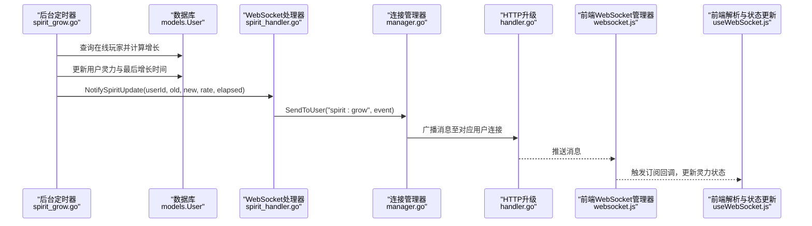
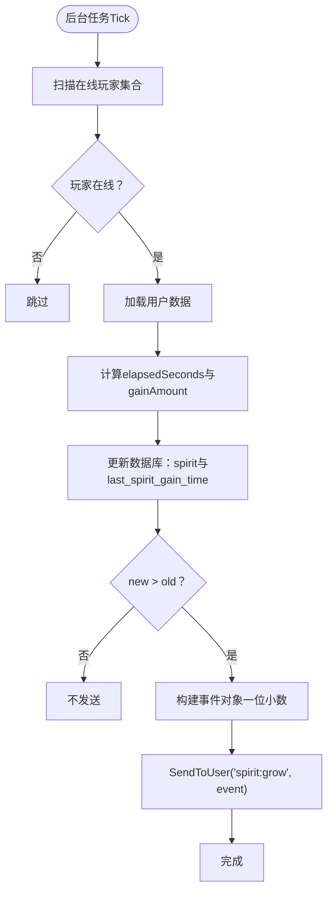
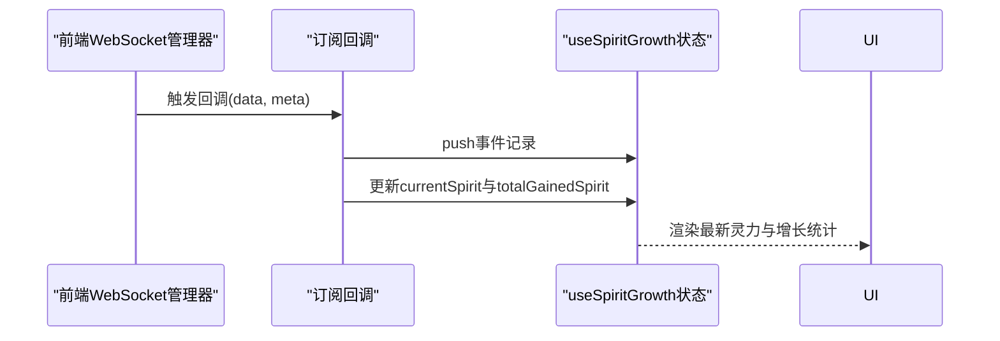
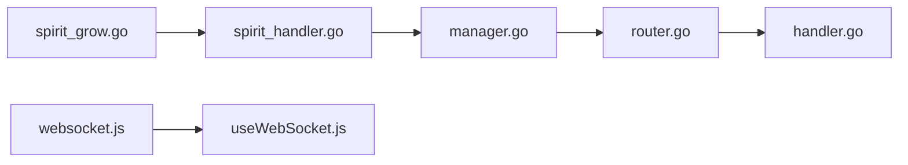

# 灵力增长消息协议

<cite>
**本文引用的文件**
- [spirit_grow.go](file://server-go/internal/spirit/spirit_grow.go)
- [spirit_handler.go](file://server-go/internal/websocket/spirit_handler.go)
- [manager.go](file://server-go/internal/websocket/manager.go)
- [router.go](file://server-go/internal/websocket/router.go)
- [handler.go](file://server-go/internal/websocket/handler.go)
- [useWebSocket.js](file://src/composables/useWebSocket.js)
- [websocket.js](file://src/services/websocket.js)
- [WebSocket改造完整实现指南.md](file://WebSocket改造完整实现指南.md)
- [WebSocket实现完成总结.md](file://WebSocket实现完成总结.md)
- [test_websocket/main.go](file://server-go/cmd/test_websocket/main.go)
</cite>

## 目录
1. [简介](#简介)
2. [项目结构](#项目结构)
3. [核心组件](#核心组件)
4. [架构总览](#架构总览)
5. [详细组件分析](#详细组件分析)
6. [依赖关系分析](#依赖关系分析)
7. [性能考量](#性能考量)
8. [故障排查指南](#故障排查指南)
9. [结论](#结论)

## 简介
本文件系统性文档化“灵力增长”相关的WebSocket消息协议，覆盖消息类型、请求/响应JSON结构、字段语义与数据类型，并结合服务端后台任务与前端解析流程，给出消息的完整生命周期。同时提供常见问题排查方法与最佳实践，帮助开发者快速集成与维护。

## 项目结构
围绕“灵力增长”的消息流转，涉及后端的灵力增长后台任务、WebSocket处理器与连接管理器，以及前端的WebSocket管理与组合式API解析。

```mermaid
graph TB
subgraph "后端(server-go)"
A["spirit_grow.go<br/>灵力增长后台任务"]
B["spirit_handler.go<br/>灵力增长事件处理器"]
C["manager.go<br/>连接管理器"]
D["router.go<br/>路由注册"]
E["handler.go<br/>HTTP升级为WebSocket"]
end
subgraph "前端(src)"
F["websocket.js<br/>WebSocket管理器"]
G["useWebSocket.js<br/>Vue组合式API"]
end
A --> B
B --> C
C --> E
D --> E
F --> G
C <- --> F
```

图表来源
- [spirit_grow.go](file://server-go/internal/spirit/spirit_grow.go#L1-L193)
- [spirit_handler.go](file://server-go/internal/websocket/spirit_handler.go#L1-L122)
- [manager.go](file://server-go/internal/websocket/manager.go#L1-L309)
- [router.go](file://server-go/internal/websocket/router.go#L1-L36)
- [handler.go](file://server-go/internal/websocket/handler.go#L1-L100)
- [websocket.js](file://src/services/websocket.js#L1-L313)
- [useWebSocket.js](file://src/composables/useWebSocket.js#L1-L319)

章节来源
- [spirit_grow.go](file://server-go/internal/spirit/spirit_grow.go#L1-L193)
- [spirit_handler.go](file://server-go/internal/websocket/spirit_handler.go#L1-L122)
- [manager.go](file://server-go/internal/websocket/manager.go#L1-L309)
- [router.go](file://server-go/internal/websocket/router.go#L1-L36)
- [handler.go](file://server-go/internal/websocket/handler.go#L1-L100)
- [websocket.js](file://src/services/websocket.js#L1-L313)
- [useWebSocket.js](file://src/composables/useWebSocket.js#L1-L319)

## 核心组件
- 灵力增长后台任务：周期扫描在线玩家，计算灵力增长并持久化，随后触发WebSocket事件推送。
- 灵力增长事件处理器：封装事件结构与推送逻辑，确保仅在增长发生时发送。
- 连接管理器：负责用户连接注册、消息广播、心跳检测与自动下线。
- WebSocket路由与HTTP升级：提供/ws端点，校验参数并升级为WebSocket。
- 前端WebSocket管理器：统一连接、订阅、心跳与重连；前端组合式API解析并更新状态。

章节来源
- [spirit_grow.go](file://server-go/internal/spirit/spirit_grow.go#L36-L174)
- [spirit_handler.go](file://server-go/internal/websocket/spirit_handler.go#L1-L122)
- [manager.go](file://server-go/internal/websocket/manager.go#L1-L309)
- [router.go](file://server-go/internal/websocket/router.go#L1-L36)
- [handler.go](file://server-go/internal/websocket/handler.go#L1-L100)
- [websocket.js](file://src/services/websocket.js#L1-L313)
- [useWebSocket.js](file://src/composables/useWebSocket.js#L1-L319)

## 架构总览
灵力增长消息的端到端流程如下：



图表来源
- [spirit_grow.go](file://server-go/internal/spirit/spirit_grow.go#L63-L174)
- [spirit_handler.go](file://server-go/internal/websocket/spirit_handler.go#L42-L121)
- [manager.go](file://server-go/internal/websocket/manager.go#L137-L153)
- [handler.go](file://server-go/internal/websocket/handler.go#L37-L73)
- [websocket.js](file://src/services/websocket.js#L99-L129)
- [useWebSocket.js](file://src/composables/useWebSocket.js#L35-L43)

## 详细组件分析

### 消息类型与JSON结构
- 消息类型：spirit:grow
- 服务器到客户端的消息结构（外层通用字段 + data内嵌事件对象）：
  - type: 字符串，固定为 "spirit:grow"
  - userId: 整数，目标用户ID
  - timestamp: 整数，消息发送时间戳（Unix秒）
  - data: 对象，包含以下字段：
    - userId: 整数，同上
    - oldSpirit: 浮点数，旧灵力值（保留一位小数）
    - newSpirit: 浮点数，新灵力值（保留一位小数）
    - gainAmount: 浮点数，本次增长量（保留一位小数）
    - spiritRate: 浮点数，灵力倍率（来源于玩家基础属性）
    - elapsedSeconds: 浮点数，本次增长所用秒数
    - timestamp: 整数，事件时间戳（Unix秒）

章节来源
- [WebSocket实现完成总结.md](file://WebSocket实现完成总结.md#L112-L154)
- [WebSocket改造完整实现指南.md](file://WebSocket改造完整实现指南.md#L215-L236)
- [spirit_handler.go](file://server-go/internal/websocket/spirit_handler.go#L17-L26)
- [spirit_handler.go](file://server-go/internal/websocket/spirit_handler.go#L63-L81)

### 字段含义与数据类型
- userId: 整数，唯一标识消息接收者
- oldSpirit/newSpirit/gainAmount: 浮点数，单位为灵力数值，服务端按一位小数四舍五入
- spiritRate: 浮点数，玩家基础属性中的倍率，用于计算增长速度
- elapsedSeconds: 浮点数，自上次增长以来的秒数
- timestamp: 整数，Unix秒时间戳，用于前后端对齐与排序

章节来源
- [spirit_handler.go](file://server-go/internal/websocket/spirit_handler.go#L17-L26)
- [spirit_handler.go](file://server-go/internal/websocket/spirit_handler.go#L63-L81)
- [spirit_grow.go](file://server-go/internal/spirit/spirit_grow.go#L143-L150)

### 服务端发送逻辑
- 后台任务周期扫描在线玩家集合，计算增长并更新数据库；若存在增长，则调用处理器发送事件。
- 处理器对事件进行标准化（一位小数保留），并调用连接管理器按userId广播。
- 连接管理器将消息放入广播通道，写循环将消息发送给对应用户连接。



图表来源
- [spirit_grow.go](file://server-go/internal/spirit/spirit_grow.go#L63-L174)
- [spirit_handler.go](file://server-go/internal/websocket/spirit_handler.go#L63-L81)
- [manager.go](file://server-go/internal/websocket/manager.go#L137-L153)

章节来源
- [spirit_grow.go](file://server-go/internal/spirit/spirit_grow.go#L63-L174)
- [spirit_handler.go](file://server-go/internal/websocket/spirit_handler.go#L42-L81)
- [manager.go](file://server-go/internal/websocket/manager.go#L137-L153)

### 前端解析与状态更新
- 前端通过WebSocket管理器订阅 "spirit:grow" 类型消息。
- useWebSocket.js 提供 useSpiritGrowth 组合式API，接收事件后：
  - 追加历史记录（最多100条）
  - 更新当前灵力值与累计增长量
  - 记录接收时间，便于调试与可视化



图表来源
- [websocket.js](file://src/services/websocket.js#L99-L129)
- [useWebSocket.js](file://src/composables/useWebSocket.js#L141-L175)

章节来源
- [websocket.js](file://src/services/websocket.js#L99-L129)
- [useWebSocket.js](file://src/composables/useWebSocket.js#L141-L175)

### 消息生命周期（端到端）
- 后端：后台任务周期触发，计算增长并持久化；若增长发生，构造事件并通过连接管理器广播。
- 传输：HTTP升级为WebSocket后，连接管理器根据userId将消息投递给对应客户端。
- 前端：WebSocket管理器接收消息，分发到订阅者；useSpiritGrowth更新本地状态并驱动UI。

章节来源
- [handler.go](file://server-go/internal/websocket/handler.go#L37-L73)
- [manager.go](file://server-go/internal/websocket/manager.go#L137-L153)
- [websocket.js](file://src/services/websocket.js#L99-L129)
- [useWebSocket.js](file://src/composables/useWebSocket.js#L35-L43)

## 依赖关系分析
- 后端模块耦合：
  - 灵力增长后台任务依赖数据库与Redis以判断在线状态与持久化更新。
  - WebSocket处理器依赖连接管理器进行广播。
  - 路由注册依赖HTTP升级处理器。
- 前端模块耦合：
  - WebSocket管理器作为单例，集中处理连接、订阅与心跳。
  - 组合式API将消息解析与状态更新解耦，便于组件复用。



图表来源
- [spirit_grow.go](file://server-go/internal/spirit/spirit_grow.go#L1-L193)
- [spirit_handler.go](file://server-go/internal/websocket/spirit_handler.go#L1-L122)
- [manager.go](file://server-go/internal/websocket/manager.go#L1-L309)
- [router.go](file://server-go/internal/websocket/router.go#L1-L36)
- [handler.go](file://server-go/internal/websocket/handler.go#L1-L100)
- [websocket.js](file://src/services/websocket.js#L1-L313)
- [useWebSocket.js](file://src/composables/useWebSocket.js#L1-L319)

章节来源
- [router.go](file://server-go/internal/websocket/router.go#L1-L36)
- [handler.go](file://server-go/internal/websocket/handler.go#L1-L100)
- [manager.go](file://server-go/internal/websocket/manager.go#L1-L309)
- [spirit_grow.go](file://server-go/internal/spirit/spirit_grow.go#L1-L193)
- [spirit_handler.go](file://server-go/internal/websocket/spirit_handler.go#L1-L122)
- [websocket.js](file://src/services/websocket.js#L1-L313)
- [useWebSocket.js](file://src/composables/useWebSocket.js#L1-L319)

## 性能考量
- 后台任务频率：默认每秒扫描一次在线玩家，建议根据并发与CPU资源调整周期。
- 消息序列化与广播：连接管理器使用带缓冲的广播通道，注意在高并发场景下适当增大缓冲区或增加背压策略。
- 前端渲染：历史记录限制为100条，避免DOM膨胀；建议在大数据量场景采用虚拟滚动或分页。
- 心跳与超时：后端心跳超时阈值与前端重连策略需协调，避免频繁断线重连。

[本节为通用指导，无需具体文件引用]

## 故障排查指南
- 连接失败
  - 确认URL参数：userId与token是否正确传递。
  - 检查HTTP升级是否成功，查看后端日志。
- 消息未到达
  - 确认前端已订阅 "spirit:grow" 类型。
  - 检查连接状态与订阅回调是否正确绑定。
- 数据不一致
  - 后端：确认elapsedSeconds计算与last_spirit_gain_time更新逻辑。
  - 前端：确认useSpiritGrowth仅在new > old时更新currentSpirit与累计增长量。
- 自动下线与心跳
  - 若心跳超时导致自动下线，检查Redis中在线键与心跳时间更新。
  - 前端重连策略与最大重连次数需合理配置。

章节来源
- [WebSocket改造完整实现指南.md](file://WebSocket改造完整实现指南.md#L503-L588)
- [manager.go](file://server-go/internal/websocket/manager.go#L170-L256)
- [test_websocket/main.go](file://server-go/cmd/test_websocket/main.go#L145-L172)
- [useWebSocket.js](file://src/composables/useWebSocket.js#L35-L43)

## 结论
“灵力增长”消息协议通过后台任务、WebSocket处理器与连接管理器形成稳定的消息链路，前端以组合式API实现轻量解析与状态更新。遵循本文档的字段定义、生命周期与排障建议，可确保消息可靠、实时地推送到客户端并正确反映到UI。