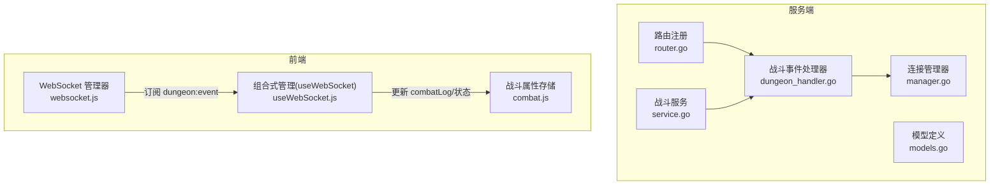
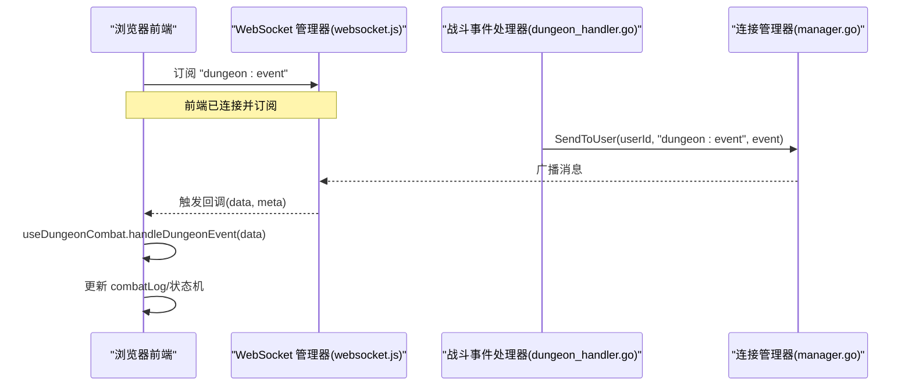
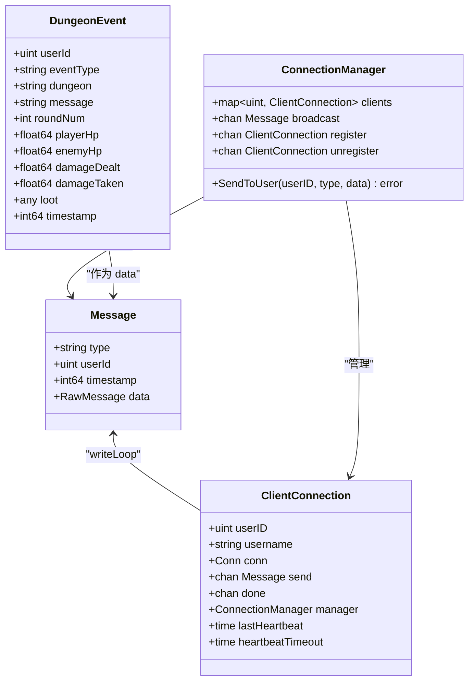
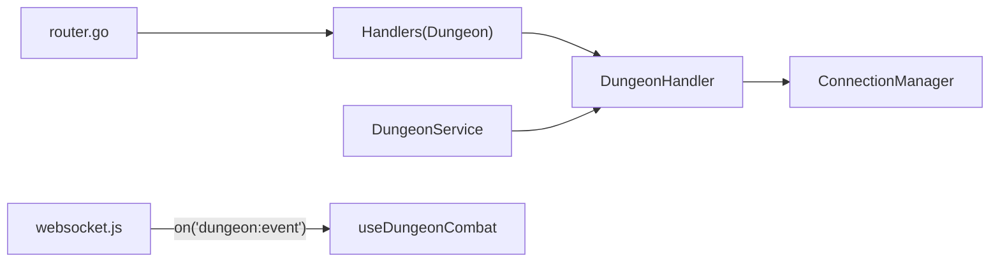

# 秘境战斗消息协议

<cite>
**本文引用的文件**
- [dungeon_handler.go](file://server-go/internal/websocket/dungeon_handler.go)
- [router.go](file://server-go/internal/websocket/router.go)
- [manager.go](file://server-go/internal/websocket/manager.go)
- [service.go](file://server-go/internal/dungeon/service.go)
- [models.go](file://server-go/internal/dungeon/models.go)
- [useWebSocket.js](file://src/composables/useWebSocket.js)
- [websocket.js](file://src/services/websocket.js)
- [combat.js](file://src/stores/combat.js)
- [WebSocket实现完成总结.md](file://WebSocket实现完成总结.md)
- [WebSocket改造完整实现指南.md](file://WebSocket改造完整实现指南.md)
</cite>

## 目录
1. [简介](#简介)
2. [项目结构](#项目结构)
3. [核心组件](#核心组件)
4. [架构总览](#架构总览)
5. [详细组件分析](#详细组件分析)
6. [依赖关系分析](#依赖关系分析)
7. [性能考量](#性能考量)
8. [故障排查指南](#故障排查指南)
9. [结论](#结论)
10. [附录](#附录)

## 简介
本文件面向秘境战斗系统的WebSocket消息协议，聚焦服务端事件触发与前端状态管理的协同工作流。重点覆盖以下内容：
- 消息类型与字段定义：包括 dungeond_update 的 eventType（start、combat_round、victory、defeat、treasure）及战斗日志、角色状态字段。
- 服务端事件触发逻辑：由战斗处理器按阶段广播事件。
- 前端状态管理：通过 useDungeonCombat 管理战斗日志、当前秘境与战斗状态，并驱动界面更新。
- 消息序列示例与状态同步机制说明。
- 性能优化建议（如日志条目数量限制）。

## 项目结构
围绕秘境战斗消息的关键文件分布如下：
- 服务端
  - WebSocket 路由与处理器：router.go、dungeon_handler.go、manager.go
  - 秘境业务模型与服务：models.go、service.go
- 前端
  - WebSocket 管理与订阅：websocket.js
  - 组合式状态管理：useWebSocket.js
  - 战斗属性存储：combat.js

图表来源
- [router.go](file://server-go/internal/websocket/router.go#L1-L36)
- [manager.go](file://server-go/internal/websocket/manager.go#L1-L120)
- [dungeon_handler.go](file://server-go/internal/websocket/dungeon_handler.go#L1-L60)
- [service.go](file://server-go/internal/dungeon/service.go#L302-L489)
- [models.go](file://server-go/internal/dungeon/models.go#L92-L136)
- [websocket.js](file://src/services/websocket.js#L1-L120)
- [useWebSocket.js](file://src/composables/useWebSocket.js#L177-L229)
- [combat.js](file://src/stores/combat.js#L1-L45)

章节来源
- [router.go](file://server-go/internal/websocket/router.go#L1-L36)
- [manager.go](file://server-go/internal/websocket/manager.go#L1-L120)
- [dungeon_handler.go](file://server-go/internal/websocket/dungeon_handler.go#L1-L60)
- [service.go](file://server-go/internal/dungeon/service.go#L302-L489)
- [models.go](file://server-go/internal/dungeon/models.go#L92-L136)
- [websocket.js](file://src/services/websocket.js#L1-L120)
- [useWebSocket.js](file://src/composables/useWebSocket.js#L177-L229)
- [combat.js](file://src/stores/combat.js#L1-L45)

## 核心组件
- 服务端消息结构
  - 消息载体：Message（type、userId、timestamp、data）
  - 战斗事件：DungeonEvent（eventType、dungeon、message、roundNum、playerHp、enemyHp、damageDealt、damageTaken、loot、timestamp）
- 服务端处理器
  - DungeonHandler：负责广播战斗事件（开始、轮次、胜利、失败、宝藏）
  - ConnectionManager：负责连接注册、广播、心跳与离线处理
- 前端订阅与状态
  - wsManager：统一连接、心跳、订阅与重连
  - useDungeonCombat：维护 combatLog、currentDungeon、combatState，并根据 eventType 更新状态

章节来源
- [manager.go](file://server-go/internal/websocket/manager.go#L41-L98)
- [dungeon_handler.go](file://server-go/internal/websocket/dungeon_handler.go#L9-L22)
- [dungeon_handler.go](file://server-go/internal/websocket/dungeon_handler.go#L59-L144)
- [websocket.js](file://src/services/websocket.js#L1-L120)
- [useWebSocket.js](file://src/composables/useWebSocket.js#L177-L229)

## 架构总览
服务端通过路由注册 WebSocket 升级端点，初始化 Handlers（含 DungeonHandler），并将消息以“dungeon:event”类型推送到指定用户。前端通过 wsManager 订阅该类型消息，useDungeonCombat 根据 eventType 更新战斗日志与状态机，驱动 UI 响应。

图表来源
- [router.go](file://server-go/internal/websocket/router.go#L8-L17)
- [dungeon_handler.go](file://server-go/internal/websocket/dungeon_handler.go#L38-L68)
- [manager.go](file://server-go/internal/websocket/manager.go#L137-L153)
- [websocket.js](file://src/services/websocket.js#L130-L160)
- [useWebSocket.js](file://src/composables/useWebSocket.js#L177-L229)

## 详细组件分析

### 服务端消息结构与事件类型
- 消息载体 Message
  - 字段：type、userId、timestamp、data
- 战斗事件 DungeonEvent
  - 关键字段：eventType（start、combat_round、victory、defeat、treasure）、dungeon、message、roundNum、playerHp、enemyHp、damageDealt、damageTaken、loot、timestamp
- 事件触发方法
  - NotifyDungeonStart：开始阶段
  - NotifyCombatRound：战斗轮次，携带双方血量与伤害
  - NotifyVictory：胜利，携带战利品
  - NotifyDefeat：失败
  - NotifyTreasure：发现宝藏，携带战利品

章节来源
- [manager.go](file://server-go/internal/websocket/manager.go#L41-L60)
- [dungeon_handler.go](file://server-go/internal/websocket/dungeon_handler.go#L9-L22)
- [dungeon_handler.go](file://server-go/internal/websocket/dungeon_handler.go#L59-L144)

### 服务端战斗服务与战斗日志
- 模型定义
  - CombatStats：角色战斗属性（health、maxHealth、damage、defense、speed、critRate、comboRate、counterRate、stunRate、dodgeRate、vampireRate、critResist、comboResist、counterResist、stunResist、dodgeResist、vampireResist、healBoost、critDamageBoost、critDamageReduce、finalDamageBoost、finalDamageReduce、combatBoost、resistanceBoost）
  - DamageResult、TakeDamageResult：伤害计算与被伤害结果
- 战斗流程
  - StartFight：根据难度与增益应用战斗属性，模拟战斗，生成 battleLog（回合与伤害描述）
  - 计算逻辑：伤害、减伤、闪避、反击、眩晕、暴击/连击/吸血等判定
  - 结果：胜利/失败、奖励发放（灵石）

章节来源
- [models.go](file://server-go/internal/dungeon/models.go#L92-L136)
- [service.go](file://server-go/internal/dungeon/service.go#L302-L489)

### 前端状态管理与UI同步
- useDungeonCombat
  - combatLog：保存最近若干条战斗事件（默认保留50条，超出则移除最早一条）
  - currentDungeon：当前秘境名称
  - combatState：状态机（idle、fighting、victory、defeat）
  - handleDungeonEvent：根据 eventType 更新状态机与日志
- wsManager
  - 订阅“dungeon:event”，分发到 useDungeonCombat
  - 心跳与重连策略（见“性能考量”）

章节来源
- [useWebSocket.js](file://src/composables/useWebSocket.js#L177-L229)
- [websocket.js](file://src/services/websocket.js#L130-L160)

### 消息序列示例与状态同步机制
- 消息类型与典型字段
  - 类型：dungeon:event
  - 字段：eventType、dungeon、message、roundNum、playerHp、enemyHp、damageDealt、damageTaken、loot、timestamp
- 典型序列
  - start：开始秘境，设置 currentDungeon 与 combatState=fighting
  - combat_round：更新双方血量与伤害，保持 fighting
  - victory：combatState=victory，携带 loot
  - defeat：combatState=defeat
  - treasure：携带 loot
- 状态同步
  - 前端根据 eventType 更新 combatLog 与 combatState，驱动 UI 展示（如战斗面板、日志、奖励弹窗）

章节来源
- [WebSocket实现完成总结.md](file://WebSocket实现完成总结.md#L133-L151)
- [WebSocket改造完整实现指南.md](file://WebSocket改造完整实现指南.md#L340-L411)
- [useWebSocket.js](file://src/composables/useWebSocket.js#L177-L229)

### 数据模型类图（代码级）

图表来源
- [manager.go](file://server-go/internal/websocket/manager.go#L41-L98)
- [manager.go](file://server-go/internal/websocket/manager.go#L137-L153)
- [dungeon_handler.go](file://server-go/internal/websocket/dungeon_handler.go#L9-L22)

## 依赖关系分析
- 服务端
  - router.go 初始化 Handlers（含 DungeonHandler）
  - dungeon_handler.go 依赖 ConnectionManager 发送消息
  - service.go 生成战斗日志与结果，供上层触发事件
- 前端
  - websocket.js 统一管理连接、心跳与订阅
  - useWebSocket.js 提供 useDungeonCombat，消费“dungeon:event”

图表来源
- [router.go](file://server-go/internal/websocket/router.go#L19-L36)
- [dungeon_handler.go](file://server-go/internal/websocket/dungeon_handler.go#L38-L68)
- [manager.go](file://server-go/internal/websocket/manager.go#L137-L153)
- [service.go](file://server-go/internal/dungeon/service.go#L302-L489)
- [websocket.js](file://src/services/websocket.js#L130-L160)
- [useWebSocket.js](file://src/composables/useWebSocket.js#L177-L229)

章节来源
- [router.go](file://server-go/internal/websocket/router.go#L19-L36)
- [dungeon_handler.go](file://server-go/internal/websocket/dungeon_handler.go#L38-L68)
- [manager.go](file://server-go/internal/websocket/manager.go#L137-L153)
- [service.go](file://server-go/internal/dungeon/service.go#L302-L489)
- [websocket.js](file://src/services/websocket.js#L130-L160)
- [useWebSocket.js](file://src/composables/useWebSocket.js#L177-L229)

## 性能考量
- 日志条目数量限制
  - 前端 combatLog 默认保留50条，超出则移除最早一条，避免内存膨胀与渲染压力
  - 灵力增长历史保留100条，同理控制内存占用
- 事件节流
  - 服务端 BroadcastMultipleEvents 在逐条广播时插入短暂休眠，避免事件过于密集导致前端卡顿
- 心跳与离线处理
  - 前端每秒发送 ping，服务端心跳超时自动下线并清理在线状态，减少无效连接占用
- 建议
  - 若战斗轮次极密，可在前端进一步合并相近轮次事件，或采用增量更新字段而非频繁全量刷新
  - 对高频事件（如 combat_round）可考虑前端侧聚合多条后再渲染，降低UI重绘频率

章节来源
- [useWebSocket.js](file://src/composables/useWebSocket.js#L177-L229)
- [useWebSocket.js](file://src/composables/useWebSocket.js#L138-L175)
- [dungeon_handler.go](file://server-go/internal/websocket/dungeon_handler.go#L133-L144)
- [manager.go](file://server-go/internal/websocket/manager.go#L222-L256)

## 故障排查指南
- 连接问题
  - 检查 wsManager 的连接状态与重连尝试次数；确认 URL 参数（userId、token）正确
  - 查看“connection:open/close/error”事件回调，定位断开原因
- 订阅问题
  - 确认已调用 subscribeDungeonEvent 并传入回调
  - 检查消息类型是否为“dungeon:event”
- 心跳与离线
  - 前端心跳未达预期：检查 sendHeartbeat 与 interval
  - 服务端心跳超时：查看 performLogout 流程与 Redis 在线状态更新
- 消息格式
  - 确认服务端 SendToUser 使用的消息类型为“dungeon:event”，且 data 符合 DungeonEvent 字段

章节来源
- [websocket.js](file://src/services/websocket.js#L1-L120)
- [websocket.js](file://src/services/websocket.js#L174-L206)
- [manager.go](file://server-go/internal/websocket/manager.go#L222-L256)
- [dungeon_handler.go](file://server-go/internal/websocket/dungeon_handler.go#L38-L68)

## 结论
本协议以“dungeon:event”为核心消息类型，通过服务端事件处理器与前端组合式状态管理实现高效、稳定的秘境战斗实时交互。结合日志条目限制与事件节流策略，可在高并发场景下维持良好性能与用户体验。

## 附录

### 消息字段定义与示例
- 消息载体
  - type：消息类型（如“dungeon:event”）
  - userId：用户ID
  - timestamp：时间戳
  - data：具体数据
- 战斗事件数据（DungeonEvent）
  - eventType：start、combat_round、victory、defeat、treasure
  - dungeon：秘境名称
  - message：事件提示文本
  - roundNum：战斗轮数（combat_round）
  - playerHp/enemyHp：双方当前血量（combat_round）
  - damageDealt/damageTaken：造成的伤害/承受的伤害（combat_round）
  - loot：战利品对象（victory、treasure）
  - timestamp：事件时间戳

章节来源
- [manager.go](file://server-go/internal/websocket/manager.go#L41-L60)
- [dungeon_handler.go](file://server-go/internal/websocket/dungeon_handler.go#L9-L22)
- [WebSocket实现完成总结.md](file://WebSocket实现完成总结.md#L133-L151)