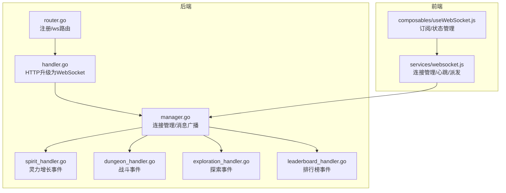
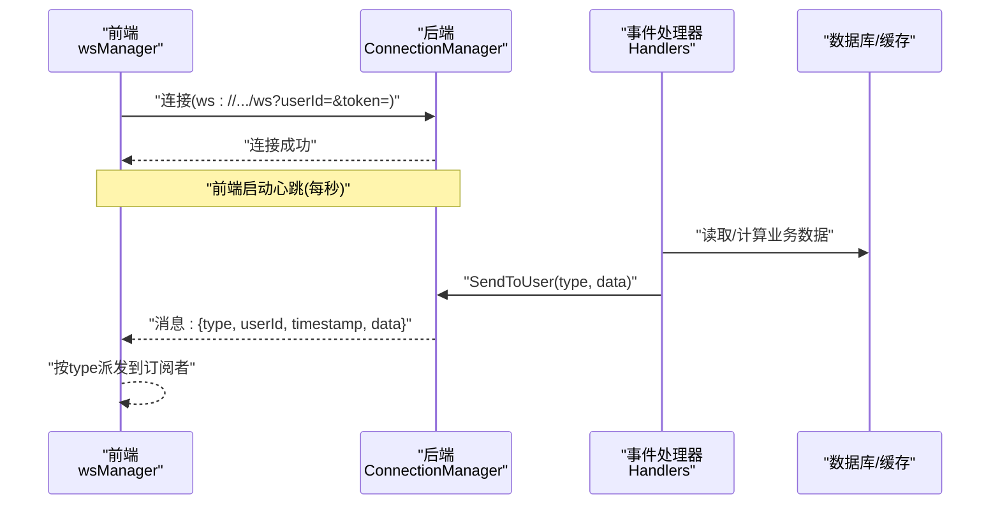
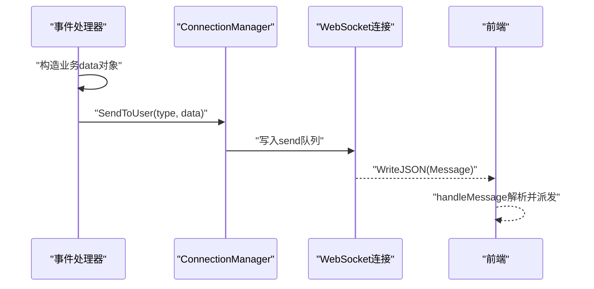
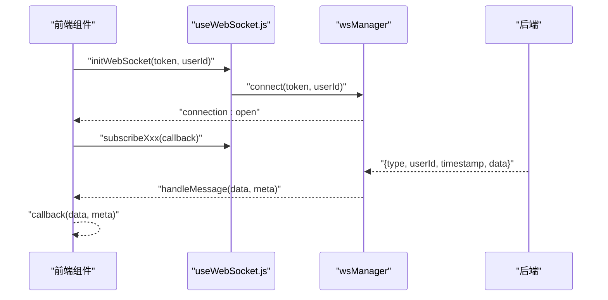
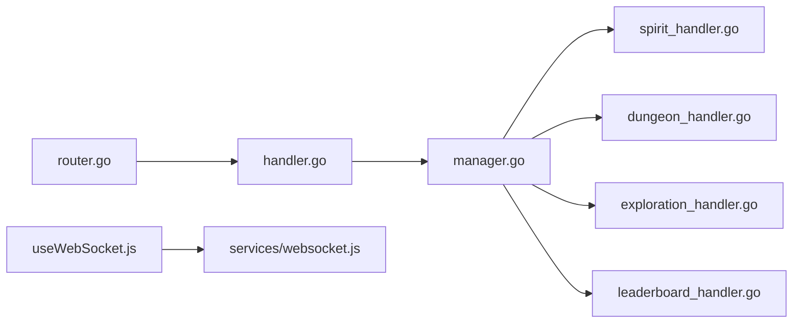

# 通信协议与消息格式

<cite>
**本文引用的文件**
- [server-go/internal/websocket/manager.go](file://server-go/internal/websocket/manager.go)
- [server-go/internal/websocket/handler.go](file://server-go/internal/websocket/handler.go)
- [server-go/internal/websocket/router.go](file://server-go/internal/websocket/router.go)
- [server-go/internal/websocket/spirit_handler.go](file://server-go/internal/websocket/spirit_handler.go)
- [server-go/internal/websocket/dungeon_handler.go](file://server-go/internal/websocket/dungeon_handler.go)
- [server-go/internal/websocket/leaderboard_handler.go](file://server-go/internal/websocket/leaderboard_handler.go)
- [server-go/internal/websocket/exploration_handler.go](file://server-go/internal/websocket/exploration_handler.go)
- [src/services/websocket.js](file://src/services/websocket.js)
- [src/composables/useWebSocket.js](file://src/composables/useWebSocket.js)
- [WebSocket实现完成总结.md](file://WebSocket实现完成总结.md)
- [WebSocket改造完整实现指南.md](file://WebSocket改造完整实现指南.md)
</cite>

## 目录
1. [简介](#简介)
2. [项目结构](#项目结构)
3. [核心组件](#核心组件)
4. [架构总览](#架构总览)
5. [详细组件分析](#详细组件分析)
6. [依赖关系分析](#依赖关系分析)
7. [性能与序列化规则](#性能与序列化规则)
8. [故障排查指南](#故障排查指南)
9. [结论](#结论)

## 简介
本文件定义并文档化了本项目的WebSocket通信协议规范，覆盖服务端与前端之间的消息类型、消息结构、序列化规则、服务端构造消息的逻辑以及前端解析与派发事件的流程。重点消息类型包括：dungeon:event、exploration:event、spirit:grow、leaderboard:update，并给出每种消息的请求/响应JSON结构、字段含义与数据类型、时间戳格式与数值精度约定，以及前后端对接的最佳实践。

## 项目结构
- 后端（Go）：WebSocket连接管理、HTTP升级、事件处理器（灵力增长、战斗、探索、排行榜）、路由注册。
- 前端（Vue3/JS）：WebSocket连接管理器、事件订阅与派发、状态管理组合式API。

图表来源
- [server-go/internal/websocket/router.go](file://server-go/internal/websocket/router.go#L1-L36)
- [server-go/internal/websocket/handler.go](file://server-go/internal/websocket/handler.go#L1-L100)
- [server-go/internal/websocket/manager.go](file://server-go/internal/websocket/manager.go#L1-L309)
- [server-go/internal/websocket/spirit_handler.go](file://server-go/internal/websocket/spirit_handler.go#L1-L122)
- [server-go/internal/websocket/dungeon_handler.go](file://server-go/internal/websocket/dungeon_handler.go#L1-L144)
- [server-go/internal/websocket/exploration_handler.go](file://server-go/internal/websocket/exploration_handler.go#L1-L149)
- [server-go/internal/websocket/leaderboard_handler.go](file://server-go/internal/websocket/leaderboard_handler.go#L1-L137)
- [src/services/websocket.js](file://src/services/websocket.js#L1-L313)
- [src/composables/useWebSocket.js](file://src/composables/useWebSocket.js#L1-L319)

章节来源
- [server-go/internal/websocket/router.go](file://server-go/internal/websocket/router.go#L1-L36)
- [server-go/internal/websocket/handler.go](file://server-go/internal/websocket/handler.go#L1-L100)
- [server-go/internal/websocket/manager.go](file://server-go/internal/websocket/manager.go#L1-L309)
- [src/services/websocket.js](file://src/services/websocket.js#L1-L313)
- [src/composables/useWebSocket.js](file://src/composables/useWebSocket.js#L1-L319)

## 核心组件
- 连接管理器（ConnectionManager）：维护用户连接映射、广播通道、读写循环、心跳检测与自动下线。
- WebSocket处理器（WebSocketHandler）：HTTP升级为WebSocket、鉴权参数解析、注册连接。
- 事件处理器（Handlers）：包含SpiritHandler、DungeonHandler、ExplorationHandler、LeaderboardHandler，负责构造具体业务消息并广播。
- 前端WebSocket管理器（wsManager）：连接、重连、心跳、消息派发、订阅管理。
- 前端组合式API（useWebSocket.js）：订阅事件、状态管理、UI派发。

章节来源
- [server-go/internal/websocket/manager.go](file://server-go/internal/websocket/manager.go#L1-L309)
- [server-go/internal/websocket/handler.go](file://server-go/internal/websocket/handler.go#L1-L100)
- [server-go/internal/websocket/router.go](file://server-go/internal/websocket/router.go#L1-L36)
- [src/services/websocket.js](file://src/services/websocket.js#L1-L313)
- [src/composables/useWebSocket.js](file://src/composables/useWebSocket.js#L1-L319)

## 架构总览
WebSocket消息在服务端以统一的Message结构封装，包含type、userId、timestamp、data四部分；事件处理器根据业务场景构造data对象并交由ConnectionManager广播至指定用户。前端wsManager负责解析消息、按type派发到对应订阅者，并提供心跳与自动重连保障。

图表来源
- [server-go/internal/websocket/manager.go](file://server-go/internal/websocket/manager.go#L137-L153)
- [server-go/internal/websocket/handler.go](file://server-go/internal/websocket/handler.go#L37-L73)
- [src/services/websocket.js](file://src/services/websocket.js#L69-L128)

## 详细组件分析

### 消息类型与结构规范
- 统一消息结构（服务端→客户端）
  - type: 字符串，消息类型标识（如 spirit:grow、dungeon:event、exploration:event、leaderboard:update）
  - userId: 整数，目标用户ID
  - timestamp: 整数，Unix秒时间戳
  - data: 对象，具体业务数据

- 灵力增长（spirit:grow）
  - data字段
    - userId: 整数
    - oldSpirit: 浮点数（保留一位小数）
    - newSpirit: 浮点数（保留一位小数）
    - gainAmount: 浮点数（保留一位小数）
    - spiritRate: 浮点数
    - elapsedSeconds: 浮点数
    - timestamp: 整数（Unix秒）

- 战斗事件（dungeon:event）
  - data字段
    - eventType: 字符串，枚举值：start、combat_round、victory、defeat、treasure
    - dungeon: 字符串，秘境名称
    - message: 字符串，提示消息
    - roundNum: 整数，战斗轮数
    - playerHp: 浮点数，玩家血量
    - enemyHp: 浮点数，敌人血量
    - damageDealt: 浮点数，造成的伤害
    - damageTaken: 浮点数，承受的伤害
    - loot: 对象或数组，掉落物
    - timestamp: 整数（Unix秒）

- 探索事件（exploration:event）
  - data字段
    - eventType: 字符串，枚举值：start、progress、discovery、complete、failure
    - exploreName: 字符串，探索地点名称
    - message: 字符串，提示消息
    - progress: 整数，百分比
    - durationSecs: 整数，持续时间（秒）
    - elapsedSecs: 整数，已用时间（秒）
    - discovery: 对象或数组，发现内容
    - reward: 对象或数组，奖励
    - errorMsg: 字符串，失败信息
    - timestamp: 整数（Unix秒）

- 排行榜更新（leaderboard:update）
  - data字段
    - type: 字符串，枚举值：update、full_refresh、rank_up、rank_down
    - category: 字符串，枚举值：spirit、power、level
    - updateTime: 整数（Unix秒）
    - top10: 数组，排行榜前10条目（每项含rank、userId、username、spirit、power、level、avatarUrl）
    - userRank: 对象，包含rank、value、percent
    - timestamp: 整数（Unix秒）

章节来源
- [server-go/internal/websocket/manager.go](file://server-go/internal/websocket/manager.go#L41-L60)
- [server-go/internal/websocket/spirit_handler.go](file://server-go/internal/websocket/spirit_handler.go#L17-L26)
- [server-go/internal/websocket/dungeon_handler.go](file://server-go/internal/websocket/dungeon_handler.go#L9-L22)
- [server-go/internal/websocket/exploration_handler.go](file://server-go/internal/websocket/exploration_handler.go#L9-L22)
- [server-go/internal/websocket/leaderboard_handler.go](file://server-go/internal/websocket/leaderboard_handler.go#L9-L17)
- [WebSocket实现完成总结.md](file://WebSocket实现完成总结.md#L112-L188)
- [WebSocket改造完整实现指南.md](file://WebSocket改造完整实现指南.md#L215-L311)

### 服务端消息构造与发送流程
- 连接管理器
  - SendToUser：将业务数据序列化为data，构造统一Message并投递到广播通道。
  - readLoop：接收客户端心跳（type为ping），更新心跳时间戳并写回Redis。
  - writeLoop：定时检查心跳超时，超时则触发自动下线流程。

- 事件处理器
  - 灵力增长：NotifySpiritUpdate在newSpirit>oldSpirit时构造事件，保留一位小数后广播。
  - 战斗事件：NotifyDungeonStart/NotifyCombatRound/NotifyVictory/NotifyDefeat/NotifyTreasure分别构造不同eventType事件并广播。
  - 探索事件：NotifyExplorationStart/NotifyExplorationProgress/NotifyDiscovery/NotifyExplorationComplete/NotifyExplorationFailure分别构造不同eventType事件并广播。
  - 排行榜：NotifyFullRefresh/NotifyRankChange/按类别封装top10与userRank后广播。

图表来源
- [server-go/internal/websocket/manager.go](file://server-go/internal/websocket/manager.go#L137-L153)
- [server-go/internal/websocket/spirit_handler.go](file://server-go/internal/websocket/spirit_handler.go#L63-L81)
- [server-go/internal/websocket/dungeon_handler.go](file://server-go/internal/websocket/dungeon_handler.go#L59-L118)
- [server-go/internal/websocket/exploration_handler.go](file://server-go/internal/websocket/exploration_handler.go#L59-L123)
- [server-go/internal/websocket/leaderboard_handler.go](file://server-go/internal/websocket/leaderboard_handler.go#L51-L105)
- [src/services/websocket.js](file://src/services/websocket.js#L102-L128)

章节来源
- [server-go/internal/websocket/manager.go](file://server-go/internal/websocket/manager.go#L170-L256)
- [server-go/internal/websocket/spirit_handler.go](file://server-go/internal/websocket/spirit_handler.go#L63-L121)
- [server-go/internal/websocket/dungeon_handler.go](file://server-go/internal/websocket/dungeon_handler.go#L59-L143)
- [server-go/internal/websocket/exploration_handler.go](file://server-go/internal/websocket/exploration_handler.go#L59-L148)
- [server-go/internal/websocket/leaderboard_handler.go](file://server-go/internal/websocket/leaderboard_handler.go#L51-L121)

### 前端解析与派发流程
- wsManager
  - handleMessage：解析服务端消息，按type触发对应回调。
  - on/off：订阅/取消订阅事件。
  - sendHeartbeat/startHeartbeat：每秒发送ping心跳。
  - 自动重连：断线后按指数退避重连，最多5次。

- useWebSocket.js
  - 提供subscribeSpiritGrowthData、subscribeDungeonEventData、subscribeLeaderboardUpdateData、subscribeExplorationEventData等订阅接口。
  - 内置状态管理（连接状态、数据快照）与watchConnectionStatus监听连接事件。

图表来源
- [src/services/websocket.js](file://src/services/websocket.js#L36-L128)
- [src/composables/useWebSocket.js](file://src/composables/useWebSocket.js#L1-L136)

章节来源
- [src/services/websocket.js](file://src/services/websocket.js#L1-L313)
- [src/composables/useWebSocket.js](file://src/composables/useWebSocket.js#L1-L319)

## 依赖关系分析
- 后端
  - router.go依赖handler.go进行HTTP升级，handler.go依赖manager.go进行连接注册与统计。
  - 事件处理器均依赖manager.go的SendToUser进行广播。
- 前端
  - useWebSocket.js依赖wsManager进行连接与订阅。
  - 组件通过组合式API订阅事件并更新UI。

图表来源
- [server-go/internal/websocket/router.go](file://server-go/internal/websocket/router.go#L1-L36)
- [server-go/internal/websocket/handler.go](file://server-go/internal/websocket/handler.go#L1-L100)
- [server-go/internal/websocket/manager.go](file://server-go/internal/websocket/manager.go#L1-L309)
- [src/composables/useWebSocket.js](file://src/composables/useWebSocket.js#L1-L136)
- [src/services/websocket.js](file://src/services/websocket.js#L1-L128)

章节来源
- [server-go/internal/websocket/router.go](file://server-go/internal/websocket/router.go#L1-L36)
- [server-go/internal/websocket/handler.go](file://server-go/internal/websocket/handler.go#L1-L100)
- [server-go/internal/websocket/manager.go](file://server-go/internal/websocket/manager.go#L1-L309)
- [src/composables/useWebSocket.js](file://src/composables/useWebSocket.js#L1-L136)
- [src/services/websocket.js](file://src/services/websocket.js#L1-L128)

## 性能与序列化规则
- 时间戳格式
  - 服务端与前端均使用Unix秒时间戳（整数）。
  - 服务端在构造消息时统一设置timestamp为当前Unix秒。
- 数值精度
  - 灵力增长事件对浮点数保留一位小数（new、old、gain）。
  - 排行榜数值（value、percent）为浮点数。
- 心跳与超时
  - 前端每秒发送ping心跳；后端readLoop收到ping后更新心跳并写入Redis。
  - 后端writeLoop每秒检查心跳超时，超时触发自动下线流程。
- 消息队列与背压
  - 广播通道默认缓冲256条；发送队列默认64条；队列满时丢弃并记录日志。
- 连接与重连
  - 断线后前端按最多5次、递增延迟重连；仅当非主动断开时重连。

章节来源
- [server-go/internal/websocket/manager.go](file://server-go/internal/websocket/manager.go#L137-L153)
- [server-go/internal/websocket/spirit_handler.go](file://server-go/internal/websocket/spirit_handler.go#L13-L16)
- [src/services/websocket.js](file://src/services/websocket.js#L174-L205)
- [WebSocket实现完成总结.md](file://WebSocket实现完成总结.md#L420-L444)

## 故障排查指南
- 连接失败
  - 检查后端是否启动且/ws路由已注册；确认userId与token参数有效。
  - 查看后端日志“WebSocket升级失败”等错误。
- 无法接收消息
  - 确认wsManager.isConnected为true；确认已订阅对应type事件。
  - 检查前端控制台是否有“未知消息类型”警告。
- 心跳超时/频繁断线
  - 检查网络与Nginx代理配置；确保WebSocket升级头正确传递。
  - 后端writeLoop会因心跳超时触发自动下线，需检查Redis心跳更新逻辑。
- 内存泄漏
  - 确保组件卸载时取消订阅并调用ws.disconnect()。
  - 避免在回调中持有长生命周期引用导致闭包泄漏。

章节来源
- [server-go/internal/websocket/handler.go](file://server-go/internal/websocket/handler.go#L37-L73)
- [server-go/internal/websocket/manager.go](file://server-go/internal/websocket/manager.go#L170-L256)
- [src/services/websocket.js](file://src/services/websocket.js#L225-L238)
- [WebSocket改造完整实现指南.md](file://WebSocket改造完整实现指南.md#L552-L616)

## 结论
本协议以统一的Message结构承载各类业务事件，服务端通过事件处理器构造data并广播，前端通过wsManager解析并派发到订阅者。协议明确了时间戳格式、数值精度与心跳机制，提供了完善的错误处理与重连策略。后续可在现有基础上扩展更多事件类型，并结合后台任务与定时任务实现更丰富的实时推送能力。