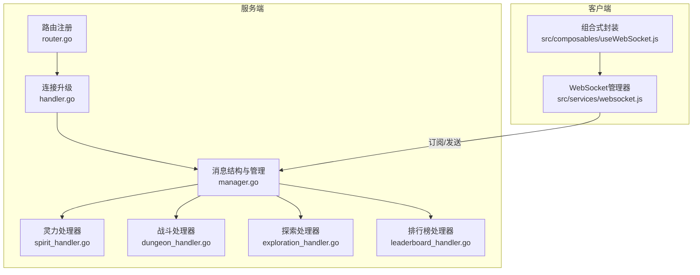
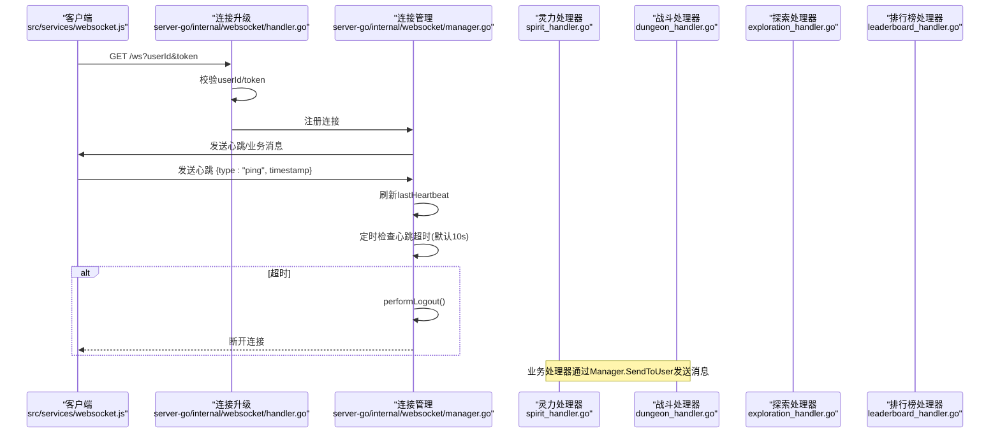
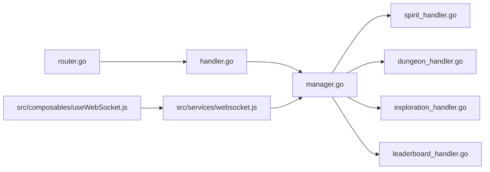

# 通用消息格式

<cite>
**本文引用的文件**
- [server-go/internal/websocket/manager.go](file://server-go/internal/websocket/manager.go)
- [server-go/internal/websocket/handler.go](file://server-go/internal/websocket/handler.go)
- [server-go/internal/websocket/router.go](file://server-go/internal/websocket/router.go)
- [server-go/internal/websocket/spirit_handler.go](file://server-go/internal/websocket/spirit_handler.go)
- [server-go/internal/websocket/dungeon_handler.go](file://server-go/internal/websocket/dungeon_handler.go)
- [server-go/internal/websocket/exploration_handler.go](file://server-go/internal/websocket/exploration_handler.go)
- [server-go/internal/websocket/leaderboard_handler.go](file://server-go/internal/websocket/leaderboard_handler.go)
- [src/services/websocket.js](file://src/services/websocket.js)
- [src/composables/useWebSocket.js](file://src/composables/useWebSocket.js)
- [WebSocket实现完成总结.md](file://WebSocket实现完成总结.md)
- [HEARTBEAT_AND_LOGOUT_GUIDE.md](file://HEARTBEAT_AND_LOGOUT_GUIDE.md)
</cite>

## 目录
1. [简介](#简介)
2. [项目结构](#项目结构)
3. [核心组件](#核心组件)
4. [架构总览](#架构总览)
5. [详细组件分析](#详细组件分析)
6. [依赖关系分析](#依赖关系分析)
7. [性能考量](#性能考量)
8. [故障排查指南](#故障排查指南)
9. [结论](#结论)
10. [附录](#附录)

## 简介
本文件定义并规范了本项目中基于 WebSocket 的通用消息结构，确保前后端在消息字段、数据类型、序列化规则、错误处理等方面保持一致。同时结合服务端连接升级逻辑与客户端消息解析机制，给出统一的协议约定与最佳实践，便于在不同功能模块（灵力增长、战斗事件、探索事件、排行榜）之间保持格式一致性。

## 项目结构
围绕 WebSocket 的通用消息格式，涉及以下关键文件：
- 服务端：连接管理、消息结构、各业务处理器、路由注册
- 客户端：连接管理、消息解析、订阅分发、心跳与重连

图表来源
- [server-go/internal/websocket/router.go](file://server-go/internal/websocket/router.go#L1-L36)
- [server-go/internal/websocket/handler.go](file://server-go/internal/websocket/handler.go#L37-L73)
- [server-go/internal/websocket/manager.go](file://server-go/internal/websocket/manager.go#L41-L47)
- [src/services/websocket.js](file://src/services/websocket.js#L1-L120)

章节来源
- [server-go/internal/websocket/router.go](file://server-go/internal/websocket/router.go#L1-L36)
- [server-go/internal/websocket/handler.go](file://server-go/internal/websocket/handler.go#L37-L73)
- [src/services/websocket.js](file://src/services/websocket.js#L1-L120)

## 核心组件
- 通用消息结构
  - 字段：type、userId、timestamp、data
  - 数据类型与约束：
    - type: 字符串，标识消息类型，如 "spirit:grow"、"dungeon:event"、"leaderboard:update"、"exploration:event"
    - userId: 整数，用户ID
    - timestamp: 整数，Unix时间戳（秒），用于服务端默认填充
    - data: JSON对象，承载具体业务数据
  - 序列化规则：
    - 服务端发送时，timestamp 默认使用服务端当前时间（秒）
    - 客户端发送心跳时，timestamp 使用客户端当前时间（毫秒）
    - 数值精度：服务端对浮点型字段按业务需要进行四舍五入（如灵力增长事件保留一位小数）

- 连接升级与鉴权
  - 服务端通过路由注册升级端点，从查询参数中读取 userId 与 token，并进行基本校验
  - 升级成功后，将连接注册到连接管理器，启动读写 goroutine

- 心跳与自动下线
  - 客户端每秒发送心跳消息（type: "ping"），携带客户端时间戳
  - 服务端在读循环中识别心跳消息，刷新最近心跳时间；若超过阈值（默认10秒），触发自动下线流程

章节来源
- [server-go/internal/websocket/manager.go](file://server-go/internal/websocket/manager.go#L41-L47)
- [server-go/internal/websocket/handler.go](file://server-go/internal/websocket/handler.go#L37-L73)
- [src/services/websocket.js](file://src/services/websocket.js#L174-L191)
- [HEARTBEAT_AND_LOGOUT_GUIDE.md](file://HEARTBEAT_AND_LOGOUT_GUIDE.md#L1-L203)

## 架构总览
下面的序列图展示了从连接升级到消息收发的整体流程，以及心跳与错误处理的关键节点。

图表来源
- [server-go/internal/websocket/handler.go](file://server-go/internal/websocket/handler.go#L37-L73)
- [server-go/internal/websocket/manager.go](file://server-go/internal/websocket/manager.go#L170-L256)
- [server-go/internal/websocket/spirit_handler.go](file://server-go/internal/websocket/spirit_handler.go#L42-L81)
- [server-go/internal/websocket/dungeon_handler.go](file://server-go/internal/websocket/dungeon_handler.go#L38-L57)
- [server-go/internal/websocket/exploration_handler.go](file://server-go/internal/websocket/exploration_handler.go#L38-L57)
- [server-go/internal/websocket/leaderboard_handler.go](file://server-go/internal/websocket/leaderboard_handler.go#L51-L68)

## 详细组件分析

### 通用消息结构定义
- 结构体字段
  - type: 消息类型字符串
  - userId: 用户ID
  - timestamp: Unix时间戳（秒）
  - data: 具体业务数据（json.RawMessage）

- 字段约束与序列化规则
  - type：由业务处理器统一设置，如 "spirit:grow"、"dungeon:event"、"leaderboard:update"、"exploration:event"
  - userId：服务端在注册连接时解析查询参数；业务发送时由处理器填充
  - timestamp：服务端发送时默认使用服务端当前时间（秒）；客户端心跳使用毫秒时间戳
  - data：业务数据对象，按业务模型序列化

- 服务端消息发送流程
  - 业务处理器构造业务数据对象
  - 调用连接管理器的发送接口，内部将业务数据序列化为字节，组装通用消息结构并投递到广播通道
  - 写循环从发送队列取出消息并通过 WebSocket 发送

章节来源
- [server-go/internal/websocket/manager.go](file://server-go/internal/websocket/manager.go#L41-L47)
- [server-go/internal/websocket/manager.go](file://server-go/internal/websocket/manager.go#L137-L153)
- [server-go/internal/websocket/spirit_handler.go](file://server-go/internal/websocket/spirit_handler.go#L42-L81)
- [server-go/internal/websocket/dungeon_handler.go](file://server-go/internal/websocket/dungeon_handler.go#L38-L57)
- [server-go/internal/websocket/exploration_handler.go](file://server-go/internal/websocket/exploration_handler.go#L38-L57)
- [server-go/internal/websocket/leaderboard_handler.go](file://server-go/internal/websocket/leaderboard_handler.go#L51-L68)

### 连接升级与鉴权
- 升级端点
  - 路由注册：GET "/ws" 调用升级处理函数
- 升级逻辑
  - 从查询参数读取 userId 与 token
  - 校验 userId 是否为空及是否可解析为整数
  - 生成用户名（若未提供）
  - 升级为 WebSocket 连接并注册到连接管理器
- 统计端点
  - GET "/ws/stats" 返回在线人数与服务端时间戳

章节来源
- [server-go/internal/websocket/router.go](file://server-go/internal/websocket/router.go#L8-L17)
- [server-go/internal/websocket/handler.go](file://server-go/internal/websocket/handler.go#L37-L81)

### 客户端消息解析与订阅
- 连接管理器
  - 构建 WebSocket URL，支持 wss/ws，主机名与端口分离
  - onopen/onmessage/onerror/onclose 生命周期管理
  - 事件驱动：connection:open/close/error 与业务消息类型
- 消息解析
  - onmessage 中解析 JSON，按 type 分发到对应监听器
  - 对未知类型进行告警，不影响其他监听器
- 心跳与重连
  - 每秒发送心跳 {type:"ping", timestamp:毫秒}
  - 连接关闭时根据是否主动断开决定是否重连（最多5次，递增延迟）

章节来源
- [src/services/websocket.js](file://src/services/websocket.js#L36-L96)
- [src/services/websocket.js](file://src/services/websocket.js#L102-L128)
- [src/services/websocket.js](file://src/services/websocket.js#L174-L205)
- [src/services/websocket.js](file://src/services/websocket.js#L207-L238)

### 心跳与自动下线
- 前端心跳
  - 每秒发送一次心跳消息（type: "ping"），timestamp 为毫秒
- 后端心跳
  - 读循环识别心跳消息，刷新 lastHeartbeat，并延长读超时
  - 写循环定时检查 lastHeartbeat 是否超时（默认10秒）
  - 超时后执行 performLogout：更新数据库与 Redis 状态，移除在线集合，断开连接
- 自动重连
  - 客户端在非主动断开情况下进行最多5次重连，延迟递增

章节来源
- [src/services/websocket.js](file://src/services/websocket.js#L174-L191)
- [server-go/internal/websocket/manager.go](file://server-go/internal/websocket/manager.go#L170-L256)
- [HEARTBEAT_AND_LOGOUT_GUIDE.md](file://HEARTBEAT_AND_LOGOUT_GUIDE.md#L1-L203)

### 业务消息类型与数据模型
- 灵力增长（type: "spirit:grow"）
  - 通用字段：type、userId、timestamp、data
  - data 字段：oldSpirit、newSpirit、gainAmount、spiritRate、elapsedSeconds、timestamp
  - 服务端对数值保留一位小数
- 战斗事件（type: "dungeon:event"）
  - data 字段：eventType、dungeon、message、roundNum、playerHp、enemyHp、damageDealt、damageTaken、loot、timestamp
- 探索事件（type: "exploration:event"）
  - data 字段：eventType、exploreName、message、progress、durationSecs、elapsedSecs、discovery、reward、errorMsg、timestamp
- 排行榜更新（type: "leaderboard:update"）
  - data 字段：type、category、updateTime、top10、userRank、timestamp
  - userRank：rank、value、percent

章节来源
- [WebSocket实现完成总结.md](file://WebSocket实现完成总结.md#L110-L188)
- [server-go/internal/websocket/spirit_handler.go](file://server-go/internal/websocket/spirit_handler.go#L13-L26)
- [server-go/internal/websocket/dungeon_handler.go](file://server-go/internal/websocket/dungeon_handler.go#L9-L22)
- [server-go/internal/websocket/exploration_handler.go](file://server-go/internal/websocket/exploration_handler.go#L9-L21)
- [server-go/internal/websocket/leaderboard_handler.go](file://server-go/internal/websocket/leaderboard_handler.go#L9-L17)

### 错误处理机制
- 无效消息格式
  - 客户端收到未知 type 的消息会发出告警，但不会影响其他监听器
  - 服务端读取 JSON 失败时记录错误并关闭连接
- 连接错误与重连
  - 客户端 onerror/onclose 会触发事件与重连策略
- 心跳超时
  - 服务端超时后执行 performLogout 并断开连接
- 缺少必要参数
  - 升级时若缺失 userId 或 token，返回错误响应

章节来源
- [src/services/websocket.js](file://src/services/websocket.js#L102-L128)
- [server-go/internal/websocket/manager.go](file://server-go/internal/websocket/manager.go#L170-L213)
- [server-go/internal/websocket/handler.go](file://server-go/internal/websocket/handler.go#L43-L52)
- [HEARTBEAT_AND_LOGOUT_GUIDE.md](file://HEARTBEAT_AND_LOGOUT_GUIDE.md#L1-L203)

## 依赖关系分析
- 服务端
  - 路由注册依赖连接管理器与处理器工厂
  - 连接管理器依赖 gorilla/websocket 与 zap 日志
  - 业务处理器依赖连接管理器进行消息发送
- 客户端
  - WebSocketManager 依赖浏览器 WebSocket API
  - 组合式封装 useWebSocket.js 依赖 wsManager 与各业务订阅函数

图表来源
- [server-go/internal/websocket/router.go](file://server-go/internal/websocket/router.go#L8-L17)
- [server-go/internal/websocket/handler.go](file://server-go/internal/websocket/handler.go#L37-L73)
- [server-go/internal/websocket/manager.go](file://server-go/internal/websocket/manager.go#L1-L40)
- [src/services/websocket.js](file://src/services/websocket.js#L1-L60)
- [src/composables/useWebSocket.js](file://src/composables/useWebSocket.js#L1-L40)

## 性能考量
- 发送队列与背压
  - 连接管理器对发送队列进行容量控制，队列满时记录告警并丢弃消息，避免阻塞
- 心跳与读写超时
  - 读循环设置读超时并配合 pong 处理器刷新；写循环定时检查心跳超时
- 事件密度控制
  - 战斗与探索事件在批量发送时加入短延迟，避免事件过于密集
- 数值精度
  - 灵力增长事件对浮点数保留一位小数，减少冗余精度带来的序列化体积

章节来源
- [server-go/internal/websocket/manager.go](file://server-go/internal/websocket/manager.go#L85-L98)
- [server-go/internal/websocket/dungeon_handler.go](file://server-go/internal/websocket/dungeon_handler.go#L133-L142)
- [server-go/internal/websocket/exploration_handler.go](file://server-go/internal/websocket/exploration_handler.go#L135-L146)
- [server-go/internal/websocket/spirit_handler.go](file://server-go/internal/websocket/spirit_handler.go#L13-L16)

## 故障排查指南
- 连接失败
  - 检查 userId 与 token 查询参数是否正确传递
  - 确认服务端升级日志与客户端 onerror/onclose 事件
- 心跳超时
  - 确认客户端每秒发送心跳且 timestamp 为毫秒
  - 检查服务端 lastHeartbeat 是否被刷新，写循环是否定时检查
- 未知消息类型
  - 客户端会输出未知类型告警，确认订阅的 type 是否与服务端一致
- 重连问题
  - 非主动断开才会触发自动重连；检查 isIntentionallyClosed 标记

章节来源
- [server-go/internal/websocket/handler.go](file://server-go/internal/websocket/handler.go#L43-L52)
- [src/services/websocket.js](file://src/services/websocket.js#L174-L205)
- [server-go/internal/websocket/manager.go](file://server-go/internal/websocket/manager.go#L222-L256)
- [HEARTBEAT_AND_LOGOUT_GUIDE.md](file://HEARTBEAT_AND_LOGOUT_GUIDE.md#L1-L203)

## 结论
通过统一的通用消息结构与严格的序列化规则，本项目在服务端与客户端之间建立了清晰、可维护的通信契约。配合心跳与自动下线机制、事件驱动的订阅分发以及完善的错误处理，能够在多业务场景下保持消息格式一致性与稳定性。建议在新增业务时遵循既有字段与序列化规则，确保跨模块兼容性。

## 附录

### 通用消息字段定义
- type: 字符串，消息类型
- userId: 整数，用户ID
- timestamp: 整数，Unix时间戳（秒，服务端默认；心跳为毫秒）
- data: JSON对象，业务数据

章节来源
- [server-go/internal/websocket/manager.go](file://server-go/internal/websocket/manager.go#L41-L47)
- [src/services/websocket.js](file://src/services/websocket.js#L174-L191)

### 实际消息示例（按类型）
- 灵力增长（type: "spirit:grow"）
  - 参考：[WebSocket实现完成总结.md](file://WebSocket实现完成总结.md#L110-L131)
- 战斗事件（type: "dungeon:event"）
  - 参考：[WebSocket实现完成总结.md](file://WebSocket实现完成总结.md#L133-L151)
- 排行榜更新（type: "leaderboard:update"）
  - 参考：[WebSocket实现完成总结.md](file://WebSocket实现完成总结.md#L153-L171)
- 探索事件（type: "exploration:event"）
  - 参考：[WebSocket实现完成总结.md](file://WebSocket实现完成总结.md#L173-L188)

### 不同功能模块的格式一致性建议
- 统一使用通用消息结构，业务数据放入 data 字段
- 服务端发送时统一设置 timestamp 为服务端秒级时间
- 客户端心跳使用毫秒时间戳，业务消息使用秒级时间戳
- 对浮点型字段按业务需要保留固定小数位（如灵力增长保留一位）

章节来源
- [server-go/internal/websocket/spirit_handler.go](file://server-go/internal/websocket/spirit_handler.go#L63-L81)
- [server-go/internal/websocket/dungeon_handler.go](file://server-go/internal/websocket/dungeon_handler.go#L38-L57)
- [server-go/internal/websocket/exploration_handler.go](file://server-go/internal/websocket/exploration_handler.go#L38-L57)
- [server-go/internal/websocket/leaderboard_handler.go](file://server-go/internal/websocket/leaderboard_handler.go#L51-L68)