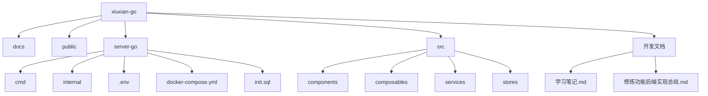

# 开发者入门指南

<cite>
**本文档引用的文件**  
- [README.md](file://README.md)
- [package.json](file://package.json)
- [vite.config.js](file://vite.config.js)
- [vitest.config.js](file://vitest.config.js)
- [server-go/.env](file://server-go/.env)
- [server-go/docker-compose.yml](file://server-go/docker-compose.yml)
- [server-go/init.sql](file://server-go/init.sql)
- [test-websocket.js](file://test-websocket.js)
- [test-heartbeat-timeout.js](file://test-heartbeat-timeout.js)
- [add-reinforce-stones.js](file://add-reinforce-stones.js)
- [diagnose-online-status.js](file://diagnose-online-status.js)
- [server-go/cmd/test_websocket/main.go](file://server-go/cmd/test_websocket/main.go)
- [WebSocket实现快速开始.md](file://WebSocket实现快速开始.md)
- [HEARTBEAT_AND_LOGOUT_GUIDE.md](file://HEARTBEAT_AND_LOGOUT_GUIDE.md)
- [开发文档/学习笔记.md](file://开发文档/学习笔记.md)
- [开发文档/修炼功能后端实现总结.md](file://开发文档/修炼功能后端实现总结.md)
- [开发日志.md](file://开发日志.md)
</cite>

## 目录
1. [简介](#简介)
2. [项目结构](#项目结构)
3. [环境搭建](#环境搭建)
4. [服务启动](#服务启动)
5. [前端开发](#前端开发)
6. [后端开发](#后端开发)
7. [关键开发脚本](#关键开发脚本)
8. [调试与测试](#调试与测试)
9. [常见问题排查](#常见问题排查)
10. [最佳实践建议](#最佳实践建议)

## 简介
xiuxian-go 是一个修仙类游戏的前后端分离项目，前端基于 Vue3 + Vite 构建，后端使用 Go 语言开发。本指南旨在为新开发者提供完整的开发环境搭建和本地开发指导，涵盖从代码克隆到服务运行的全过程。

## 项目结构
项目采用前后端分离架构，主要目录结构如下：



**Diagram sources**
- [README.md](file://README.md)

## 环境搭建
### 1. 克隆仓库
```bash
git clone https://github.com/your-repo/xiuxian-go.git
cd xiuxian-go
```

### 2. 安装Node.js环境
确保已安装 Node.js 16+ 和 npm：
```bash
node -v
npm -v
```

### 3. 安装Go环境
确保已安装 Go 1.19+：
```bash
go version
```

### 4. 配置PostgreSQL和Redis
通过 Docker Compose 快速启动数据库服务：
```bash
cd server-go
docker-compose up -d
```

该命令将启动：
- PostgreSQL 数据库（端口 5432）
- Redis 缓存（端口 6379）

**Section sources**
- [server-go/docker-compose.yml](file://server-go/docker-compose.yml)

### 5. 配置环境变量
复制并修改环境配置文件：
```bash
cd server-go
cp .env.example .env
```

主要配置项：
- `PORT=3000`：后端服务端口
- `DB_HOST=localhost`：数据库主机
- `DB_PORT=5432`：数据库端口
- `REDIS_URL=redis://localhost:6379`：Redis连接地址

**Section sources**
- [server-go/.env](file://server-go/.env)

## 服务启动
### 1. 启动数据库服务
```bash
cd server-go
docker-compose up -d
```

### 2. 初始化数据库
数据库容器会自动执行 `init.sql` 文件中的表结构创建语句。

**Section sources**
- [server-go/init.sql](file://server-go/init.sql)

### 3. 启动后端服务
有两种方式启动后端服务：

#### 方式一：使用Air热重载（推荐用于开发）
```bash
# 安装air工具
go install github.com/cosmtrek/air@latest

# 在server-go目录下启动
air
```

#### 方式二：直接运行Go程序
```bash
cd server-go
go run cmd/server/main.go
```

## 前端开发
### 1. 安装依赖
```bash
npm install
```

### 2. 启动开发服务器
```bash
npm run dev
```

前端开发服务器默认运行在 `http://localhost:2025`，通过 Vite 配置的代理将 `/api` 请求转发到后端服务。

**Section sources**
- [package.json](file://package.json)
- [vite.config.js](file://vite.config.js)

### 3. 构建生产版本
```bash
npm run build
```

构建结果输出到 `docs` 目录，可用于静态部署。

## 后端开发
### 1. 项目依赖管理
```bash
# 更新依赖
go mod tidy

# 下载所有依赖
go mod download
```

### 2. 代码热重载
使用 Air 工具实现代码修改后自动重启：
```bash
# 安装Air
go install github.com/cosmtrek/air@latest

# 启动服务
air
```

Air 的配置在项目根目录的 `.air.toml` 文件中。

### 3. API端点
后端提供了多个功能模块的API：
- `/api/auth`：认证相关
- `/api/cultivation`：修炼系统
- `/api/gacha`：抽奖系统
- `/api/dungeon`：秘境系统
- `/api/online`：在线状态管理

## 关键开发脚本
项目包含多个实用的开发脚本，位于项目根目录：

### 1. WebSocket测试脚本
```bash
node test-websocket.js
```
该脚本测试WebSocket连接、消息接收和断开连接功能。

**Section sources**
- [test-websocket.js](file://test-websocket.js)

### 2. 心跳超时测试脚本
```bash
node test-heartbeat-timeout.js
```
测试心跳超时自动下线功能。

**Section sources**
- [test-heartbeat-timeout.js](file://test-heartbeat-timeout.js)

### 3. 数据管理脚本
```bash
# 为指定玩家增加强化石
node add-reinforce-stones.js <playerId> <amount>

# 诊断在线状态
node diagnose-online-status.js
```

**Section sources**
- [add-reinforce-stones.js](file://add-reinforce-stones.js)
- [diagnose-online-status.js](file://diagnose-online-status.js)

## 调试与测试
### 1. WebSocket通信调试
前端提供了WebSocket调试面板，位于 `src/components/WebSocketDebug.vue`。

也可以使用Node.js脚本进行测试：
```bash
node test-websocket.js
```

### 2. 查看API日志
后端使用 zap 日志库，启动服务后可在控制台查看详细的API请求日志。

### 3. 运行单元测试
```bash
# 运行所有测试
npm run test

# 运行带UI的测试
npm run test:ui
```

测试配置在 `vitest.config.js` 文件中。

**Section sources**
- [vitest.config.js](file://vitest.config.js)

### 4. 后端集成测试
```bash
cd server-go
go run cmd/test_websocket/main.go
```
该测试验证WebSocket连接管理器和事件处理器的功能。

**Section sources**
- [server-go/cmd/test_websocket/main.go](file://server-go/cmd/test_websocket/main.go)

## 常见问题排查
### 1. 数据库连接失败
**症状**：后端启动时报错无法连接数据库
**解决方案**：
```bash
# 检查Docker容器状态
docker ps

# 重启数据库服务
cd server-go
docker-compose down
docker-compose up -d
```

### 2. WebSocket连接失败
**症状**：前端无法建立WebSocket连接
**解决方案**：
1. 确保后端服务已启动
2. 检查 `vite.config.js` 中的代理配置
3. 查看浏览器控制台和后端日志

### 3. 心跳超时问题
根据 `HEARTBEAT_AND_LOGOUT_GUIDE.md` 文档，前端每秒发送心跳，后端10秒未收到则自动下线。

**排查步骤**：
```bash
# 检查Redis在线玩家列表
redis-cli
> SMEMBERS server:online:players
```

### 4. 灵力不增长
**可能原因**：玩家未正确标记为在线
**解决方案**：
```bash
# 使用诊断脚本检查
node diagnose-online-status.js
```

## 最佳实践建议
### 1. 参考开发文档
项目包含详细的开发文档，建议新开发者先阅读：
- `开发文档/学习笔记.md`：前后端数据交互笔记
- `开发文档/修炼功能后端实现总结.md`：修炼系统实现细节
- `WebSocket实现快速开始.md`：WebSocket功能快速入门

**Section sources**
- [开发文档/学习笔记.md](file://开发文档/学习笔记.md)
- [开发文档/修炼功能后端实现总结.md](file://开发文档/修炼功能后端实现总结.md)
- [WebSocket实现快速开始.md](file://WebSocket实现快速开始.md)

### 2. 代码修改流程
1. 修改代码
2. 查看Air自动重启服务
3. 在浏览器中测试功能
4. 运行相关测试脚本验证

### 3. 调试技巧
- 使用 `console.log` 输出关键变量
- 利用浏览器开发者工具查看网络请求
- 查看后端日志获取详细错误信息
- 使用提供的诊断脚本快速定位问题

### 4. 性能优化
- 前端使用Vite的代码分割功能
- 后端合理使用Redis缓存
- 数据库查询添加适当索引
- WebSocket消息使用二进制格式压缩